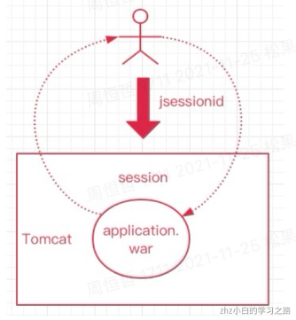
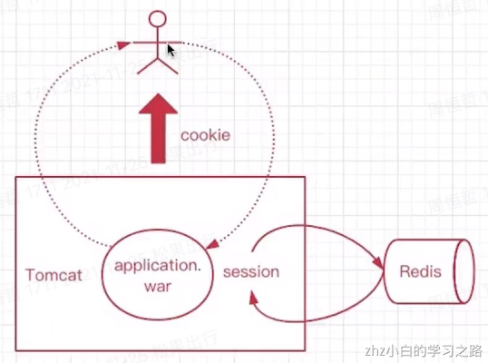
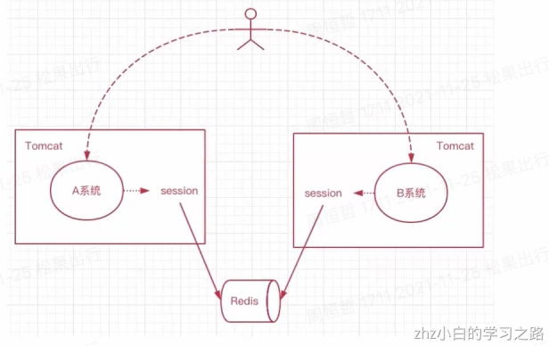

# 1、什么是会话？

会话Session代表的是客户端与服务器的一次交互，这个过程可以是连续也可以是时断时续的。曾经的Servlet时代(jsp)，一旦用户与服务端交互，服务器 用户创建一个session，同时前端会有一个jsessionid，每次交互都会携带。如此一来，服务器只要在接到用户请求时候，就可以拿到jsessionid，并根据这个ID 对应的会话session，当拿到session会话后，那么我们就可以操作会话了。会话存活期间，我们就能认为用户一直处于正在使用着网站的状态，一旦session超 就可以认为用户已经离开网站，停止交互了。用户的身份信息，我们也是通过session来判断的，在session中可以保存不同用户的信息。 session的使用之前在单体部分演示过，代码如下:

```java
 @GetMapping("/setSession")
    public Object setSession(HttpServletRequest request){
        HttpSession httpSession=request.getSession();
        //设置
        httpSession.setAttribute("user","用户对象");
        httpSession.setMaxInactiveInterval(3600);
        //获取
        httpSession.getAttribute("user");
        //删除
        //httpSession.removeAttribute("user");
        return "ok";
    }
```

# 2、实现

## 2.1、无状态会话

HTTP请求是无状态的，用户向服务端发起多个请求，服务端并不会知道这多次请求都是来自同一用户，这个就是无状态的。cookie的出现就是为了有状态的记录。
常见的，ios与服务端交互，安卓与服务端交互，前后端分离，小程序与服务端交互，他们都是通过发起http来调用接口数据的，每次交互服务端都不会拿到客户端的状态， 但是我们可以通过手段去处理，比如每次用户发起请求的时候携带一个userid或者user-token，如此一来，就能让服务端根据用户id或token来获得相应的数据。每个用户的下以次请求都能被服务端识别来自同一个用户。

## 2.2、有状态的会话

Tomcat中的会话，就是有状态的，一旦用户和服务端交互，就有会话，会话保存了用户的信息，这样用户就“有状态”了，服务端会和每个客户端都保持着这样的一层关系，这个由容器来管理(也就是tomcat)，这个session会话是保存到内存空间里的，如此一来，当不同的用户访问服务端，那么就能通过会话知道谁是谁了。tomcat 是为了让http请求变的有状态。如果用户不再和服务端交互，那么会话超时则消失，结束了他的生命周期。如此一来，每个用户其实都会有一个会话被维护，这就是有状态的会话。
场景:在传统项目或者jsp项目中是使用的最多的session都是有状态的，session的存在就是为了弥补http的无状态。

- 注:tomcat会话可以通过手段实现多系统之间的状态同步，但是会损耗一定的时间，一旦发生同步那么用户请求就会等待，这种做法不可取

## 2.3、为什么使用无状态会话？

有状态会话都是放在服务器的内存中的，一旦用户会量多，那么内存就会出现瓶颈。而无状态的会话可以采用介质，前端可以采用cookies（app可以使用缓存）保护用户ID或者token，后端比如redis，相应的用户会话都能放入redis中进行管理。如此，对应用不是的服务器就不会造成内存压力了。用户在前端发起http请求，携带id或者token，如此服务端就能够根据前端提供的id或者token来识别用户了，可伸缩性就更强了。

## 2.4、单Tomcat会话(图)

先来看一下单个tomcat会话，这个就是有状态的，用户首次访问服务端，这个时候会话产生，并且会设置jsessionid放入cookie中，后续每次请求都会携带jsessionid以保持用户状态。


## 2.5、动静分离会话(图)

用户请求服务器，由于动静分离，前端发起http请求，不会携带任何状态，当用户第一次请求以后，我们手动设置一个token，作为用户会话，放入redis中，如此作为redis-session，并且这个token设置后放入前端cookies中（app或小程序可以放入本地缓存），如此后序交互过程中，前端只需要传递token给后端，后端就能识别这个用户请求来自谁了。


## 2.6、集群分布式系统会话(图)

集群或者分布式系统本质都是多个系统，假设这里面有两个服务器节点，分别是A,B系统，他们可以是集群，也可以是分布式系统，一开始用户和A系统交互，那么这个时候的优化状态，我们可以保存到redis中，作为A系统的会话信息，随后用户的请求进入到了B系统，那么B系统中的会话同样和redis关联，如此AB系统的session就统一了。当然cookies是会随着用户的访问携带过来的。那么这个其实就是分布式会话，通过redis来保存用户的状态。


# 3、实践
用户的增删查改都需要

```java
 //增加令牌token，会整合进redis，分布式会话
        UsersVO usersVO = conventUsersVo(userResult);

        CookieUtils.setCookie(request, response, "user",
                JsonUtils.objectToJson(usersVO), true);
```

CookieUtils

```java
package com.zhz.utils;

import org.slf4j.Logger;
import org.slf4j.LoggerFactory;

import javax.servlet.http.Cookie;
import javax.servlet.http.HttpServletRequest;
import javax.servlet.http.HttpServletResponse;
import java.io.UnsupportedEncodingException;
import java.net.URLDecoder;
import java.net.URLEncoder;

/**
 * cookie工具类
 * @author zhouhengzhe
 * @date 2021/11/25 下午10:25
 **/
public final class CookieUtils {

    final static Logger logger = LoggerFactory.getLogger(CookieUtils.class);
	
	/**
	 * 
	 * @Description: 得到Cookie的值, 不编码
	 * @param request
	 * @param cookieName
	 * @return
	 */
    public static String getCookieValue(HttpServletRequest request, String cookieName) {
        return getCookieValue(request, cookieName, false);
    }
    
    /**
     * 
     * @Description: 得到Cookie的值
     * @param request
     * @param cookieName
     * @param isDecoder
     * @return
     */
    public static String getCookieValue(HttpServletRequest request, String cookieName, boolean isDecoder) {
        Cookie[] cookieList = request.getCookies();
        if (cookieList == null || cookieName == null) {
            return null;
        }
        String retValue = null;
        try {
            for (int i = 0; i < cookieList.length; i++) {
                if (cookieList[i].getName().equals(cookieName)) {
                    if (isDecoder) {
                        retValue = URLDecoder.decode(cookieList[i].getValue(), "UTF-8");
                    } else {
                        retValue = cookieList[i].getValue();
                    }
                    break;
                }
            }
        } catch (UnsupportedEncodingException e) {
            e.printStackTrace();
        }
        return retValue;
    }

    /**
     * 
     * @Description: 得到Cookie的值
     * @param request
     * @param cookieName
     * @param encodeString
     * @return
     */
    public static String getCookieValue(HttpServletRequest request, String cookieName, String encodeString) {
        Cookie[] cookieList = request.getCookies();
        if (cookieList == null || cookieName == null) {
            return null;
        }
        String retValue = null;
        try {
            for (int i = 0; i < cookieList.length; i++) {
                if (cookieList[i].getName().equals(cookieName)) {
                    retValue = URLDecoder.decode(cookieList[i].getValue(), encodeString);
                    break;
                }
            }
        } catch (UnsupportedEncodingException e) {
        	 e.printStackTrace();
        }
        return retValue;
    }

    /**
     * 
     * @Description: 设置Cookie的值 不设置生效时间默认浏览器关闭即失效,也不编码
     * @param request
     * @param response
     * @param cookieName
     * @param cookieValue
     */
    public static void setCookie(HttpServletRequest request, HttpServletResponse response, String cookieName,
            String cookieValue) {
        setCookie(request, response, cookieName, cookieValue, -1);
    }

    /**
     * 
     * @Description: 设置Cookie的值 在指定时间内生效,但不编码
     * @param request
     * @param response
     * @param cookieName
     * @param cookieValue
     * @param cookieMaxage
     */
    public static void setCookie(HttpServletRequest request, HttpServletResponse response, String cookieName,
            String cookieValue, int cookieMaxage) {
        setCookie(request, response, cookieName, cookieValue, cookieMaxage, false);
    }

    /**
     * 
     * @Description: 设置Cookie的值 不设置生效时间,但编码
     * 在服务器被创建，返回给客户端，并且保存客户端
     * 如果设置了SETMAXAGE(int seconds)，会把cookie保存在客户端的硬盘中
     * 如果没有设置，会默认把cookie保存在浏览器的内存中
     * 一旦设置setPath()：只能通过设置的路径才能获取到当前的cookie信息
     * @param request
     * @param response
     * @param cookieName
     * @param cookieValue
     * @param isEncode
     */
    public static void setCookie(HttpServletRequest request, HttpServletResponse response, String cookieName,
            String cookieValue, boolean isEncode) {
        setCookie(request, response, cookieName, cookieValue, -1, isEncode);
    }

   /**
    * 
    * @Description: 设置Cookie的值 在指定时间内生效, 编码参数
    * @param request
    * @param response
    * @param cookieName
    * @param cookieValue
    * @param cookieMaxage
    * @param isEncode
    */
    public static void setCookie(HttpServletRequest request, HttpServletResponse response, String cookieName,
            String cookieValue, int cookieMaxage, boolean isEncode) {
        doSetCookie(request, response, cookieName, cookieValue, cookieMaxage, isEncode);
    }

    /**
     * 
     * @Description: 设置Cookie的值 在指定时间内生效, 编码参数(指定编码)
     * @param request
     * @param response
     * @param cookieName
     * @param cookieValue
     * @param cookieMaxage
     * @param encodeString
     */
    public static void setCookie(HttpServletRequest request, HttpServletResponse response, String cookieName,
            String cookieValue, int cookieMaxage, String encodeString) {
        doSetCookie(request, response, cookieName, cookieValue, cookieMaxage, encodeString);
    }

    /**
     * 
     * @Description: 删除Cookie带cookie域名
     * @param request
     * @param response
     * @param cookieName
     */
    public static void deleteCookie(HttpServletRequest request, HttpServletResponse response,
            String cookieName) {
        doSetCookie(request, response, cookieName, null, -1, false);
//        doSetCookie(request, response, cookieName, "", -1, false);
    }

    
    /**
     * 
     * @Description: 设置Cookie的值，并使其在指定时间内生效
     * @param request
     * @param response
     * @param cookieName
     * @param cookieValue
     * @param cookieMaxage	cookie生效的最大秒数
     * @param isEncode
     */
    private static final void doSetCookie(HttpServletRequest request, HttpServletResponse response,
            String cookieName, String cookieValue, int cookieMaxage, boolean isEncode) {
        try {
            if (cookieValue == null) {
                cookieValue = "";
            } else if (isEncode) {
                cookieValue = URLEncoder.encode(cookieValue, "utf-8");
            }
            Cookie cookie = new Cookie(cookieName, cookieValue);
            if (cookieMaxage > 0)
                cookie.setMaxAge(cookieMaxage);
            if (null != request) {// 设置域名的cookie
            	String domainName = getDomainName(request);
                logger.info("========== domainName: {} ==========", domainName);
                if (!"localhost".equals(domainName)) {
                	cookie.setDomain(domainName);
                }
            }
            cookie.setPath("/");
            response.addCookie(cookie);
        } catch (Exception e) {
        	 e.printStackTrace();
        }
    }

    /**
     * 
     * @Description: 设置Cookie的值，并使其在指定时间内生效
     * @param request
     * @param response
     * @param cookieName
     * @param cookieValue
     * @param cookieMaxage	cookie生效的最大秒数
     * @param encodeString
     */
    private static final void doSetCookie(HttpServletRequest request, HttpServletResponse response,
            String cookieName, String cookieValue, int cookieMaxage, String encodeString) {
        try {
            if (cookieValue == null) {
                cookieValue = "";
            } else {
                cookieValue = URLEncoder.encode(cookieValue, encodeString);
            }
            Cookie cookie = new Cookie(cookieName, cookieValue);
            if (cookieMaxage > 0)
                cookie.setMaxAge(cookieMaxage);
            if (null != request) {// 设置域名的cookie
            	String domainName = getDomainName(request);
                logger.info("========== domainName: {} ==========", domainName);
                if (!"localhost".equals(domainName)) {
                	cookie.setDomain(domainName);
                }
            }
            cookie.setPath("/");
            response.addCookie(cookie);
        } catch (Exception e) {
        	 e.printStackTrace();
        }
    }

    /**
     * 
     * @Description: 得到cookie的域名
     * @return
     */
    private static final String getDomainName(HttpServletRequest request) {
        String domainName = null;

        String serverName = request.getRequestURL().toString();
        if (serverName == null || serverName.equals("")) {
            domainName = "";
        } else {
            serverName = serverName.toLowerCase();
            serverName = serverName.substring(7);
            final int end = serverName.indexOf("/");
            serverName = serverName.substring(0, end);
            if (serverName.indexOf(":") > 0) {
            	String[] ary = serverName.split("\\:");
            	serverName = ary[0];
            }

            final String[] domains = serverName.split("\\.");
            int len = domains.length;
            if (len > 3 && !isIp(serverName)) {
            	// www.xxx.com.cn
                domainName = "." + domains[len - 3] + "." + domains[len - 2] + "." + domains[len - 1];
            } else if (len <= 3 && len > 1) {
                // xxx.com or xxx.cn
                domainName = "." + domains[len - 2] + "." + domains[len - 1];
            } else {
                domainName = serverName;
            }
        }
        return domainName;
    }
    
    public static String trimSpaces(String IP){//去掉IP字符串前后所有的空格  
        while(IP.startsWith(" ")){  
               IP= IP.substring(1,IP.length()).trim();  
            }  
        while(IP.endsWith(" ")){  
               IP= IP.substring(0,IP.length()-1).trim();  
            }  
        return IP;  
    }  
    
    public static boolean isIp(String IP){//判断是否是一个IP  
        boolean b = false;  
        IP = trimSpaces(IP);  
        if(IP.matches("\\d{1,3}\\.\\d{1,3}\\.\\d{1,3}\\.\\d{1,3}")){  
            String s[] = IP.split("\\.");  
            if(Integer.parseInt(s[0])<255)  
                if(Integer.parseInt(s[1])<255)  
                    if(Integer.parseInt(s[2])<255)  
                        if(Integer.parseInt(s[3])<255)  
                            b = true;  
        }  
        return b;  
    }  

}
```

```java
 /**
     * Users转换UserVo
     * @param users
     * @return com.zhz.pojo.vo.UsersVO
     * @author zhouhengzhe
     * @date 2021/11/25 下午10:13
     **/
    public UsersVO conventUsersVo(Users users) {
        //生成用户token，存入redis会话
        String uniqueToken = UUID.randomUUID().toString().trim();
        redisOperator.set(REDIS_USER_TOKEN+":"+users.getId(),uniqueToken);

        UsersVO usersVO= new UsersVO();
        BeanUtils.copyProperties(users,usersVO);
        usersVO.setUserUniqueToken(uniqueToken);
        return usersVO;
    }
```