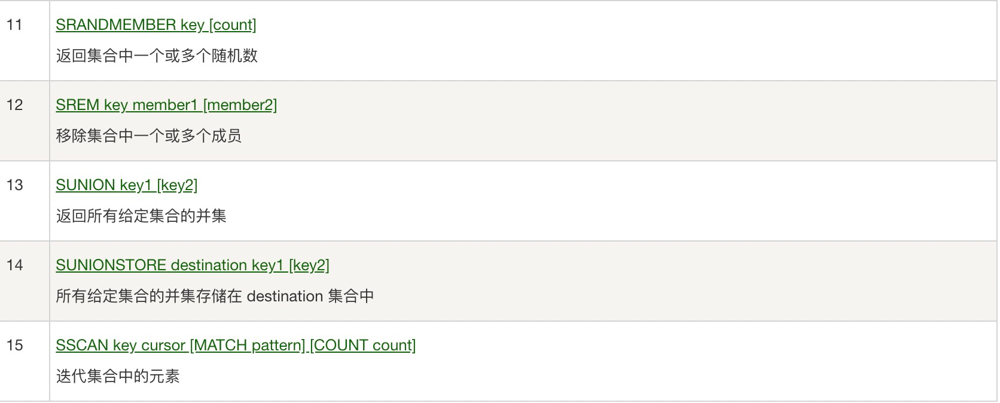
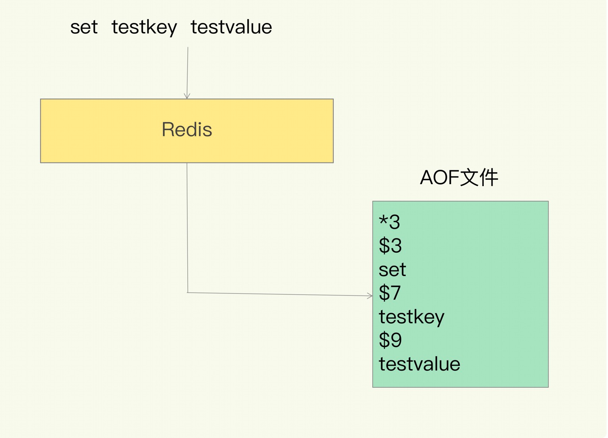

在线数据库（可以玩的）：[https://try.redis.io/](https://try.redis.io/)

Redis什么？

> Redis 是一种开源（BSD 许可）、内存中数据结构存储，用作数据库、缓存和消息代理。Redis 提供了诸如字符串、散列、列表、集合、带范围查询的排序集合、位图、超级日志、地理空间索引和流等数据结构。Redis 内置复制、Lua 脚本、LRU 驱逐、事务和不同级别的磁盘持久化，并通过 Redis Sentinel 和 Redis Cluster 自动分区提供高可用性。


安装：docker（用于学习，生产尽量别用）

```
docker run -d --name redis -p 6379:6379 redis:latest redis-server --appendonly yes --requirepass "123456"
查看运行的容器:
docker ps
连接redis:
docker exec -ti 95b40 redis-cli    连接
auth 123456			输入密码
```

## 1.1、问题：，为了保证数据的可靠性，Redis 需要在磁盘上读写 AOF 和 RDB，但在高并发场景里，这就会直接带来两个新问题：一个是写 AOF 和RDB 会造成 Redis 性能抖动，另一个是 Redis 集群数据同步和实例恢复时，读 RDB 比较慢，限制了同步和恢复速度。

解决方案：

> 一个可行的解决方案就是使用非易失内存 NVM，因为它既能保证高速的读写，又能快速持久化数据!!


### 1.1.1、NVM是什么？

> NVM特性
NonVolatile Memory，非易失存储器，具有非易失、按字节存取、存储密度高、低能耗、读写性能接近DRAM，但读写速度不对称，读远快于写，寿命有限（需要像ssd一样考虑磨损均衡）。当电流关掉后,所存储的数据不会消失的计算机存储器。没有数据寻道，这点和ssd比较像。
>  
> 常见NVM：
>  
> - 相变存储器（PCM，phase change memory）
> - 磁阻式存储器（MRAM，Magnetoresistive RAM）
> - 电阻式/阻变存储器（RRAM，resistive ram）
> - 铁电存储器（FeRAM， Ferroelectric RAM）
> - 赛道存储器（Racetrack Memory）
> - 石墨烯存储器（Graphene Memory）
> - 忆阻器（Memristor，也是一种RRAM）
> 
 
> 未来NVM可能的应用场景
>  
> - 完全取代内存（DRAM）：
这种做法虽然快，但带来了安全问题，很容易被野指针修改NVM上的数据，因为毕竟是内存；除此之外还得考虑往NVM上写的顺序性（因为系统会对访问内存的指令做优化，因此执行顺序可能会乱序）；cache与NVM一致性的问题，怎么防止断电时cache上的新数据没有写入NVM上；同时这种模型对原有的内存模型带来巨大变化，需要我们对操作系统做出适当修改，兼容性不好。
> - 与DRAM混合使用构成新的内存系统：
基本和上面情况类似，甚至更复杂，但更贴合实际，因为感觉NVM就算有成型的商业化产品，价格肯定也会很昂贵，再加上还有使用寿命。因此大规模使用还是不太现实。
> - 作为块设备（外设）使用（类似ssd）：
这种做法能有很好的兼容性，因为我们把它当做块设备来用，只要编写好它的驱动就能使用它了，并不用修改操作系统。但缺点是毕竟是外设，如果挂在io总线上的话读写速度还是很慢的。
> - 作为cache使用
除了掉电数据还在，但NVM的速度远低于原有cache的速度。
> 
 
> 现有的高性能键值数据库：HiKV


1.2、四大坑

> 1、CPU 使用上的“坑”，例如数据结构的复杂度、跨 CPU 核的访问；
>  
> 2、内存使用上的“坑”，例如主从同步和 AOF 的内存竞争；
>  
> 3、存储持久化上的“坑”，例如在 SSD 上做快照的性能抖动；
>  
> 4、网络通信上的“坑”，例如多实例时的异常网络丢包。


1.3、全景图->两大维度，三大主线

“两大维度”就是指系统维度和应用维度，“三大主线”也就是指高性能、高可靠和高可扩展（可以简称为“三高”）。

> **在应用维度上**: “**应用场景驱动**”和“**典型案例驱动**”，一个是“面”的梳理，一个是“点”的掌握。
>  
> **高性能主线**：包括线程模型、数据结构、持久化、网络框架；
>  
> **高可靠主线**：包括主从复制、哨兵机制；
>  
> **高可扩展主线**：包括数据分片、负载均衡。


1.4、redis问题画像图


## 1.2测试性能

redis-benchmark

```
==== SET ======
  100000 requests completed in 1.11 seconds   对我们的10万个数据进行写入测试
  50 parallel clients   50个并发客户端
  3 bytes payload	每次写入3个字节
  keep alive: 1	只有一台服务器来处理请求，单击

98.00% <= 1 milliseconds	
99.76% <= 2 milliseconds
99.97% <= 3 milliseconds
100.00% <= 3 milliseconds 	所有的请求在3ms内处理完成
90009.01 requests per second	美每秒处理90009.01次请求

====== GET ======
  100000 requests completed in 1.11 seconds
  50 parallel clients
  3 bytes payload
  keep alive: 1

97.81% <= 1 milliseconds
99.82% <= 2 milliseconds
99.97% <= 3 milliseconds
100.00% <= 3 milliseconds
90252.70 requests per second

====== INCR ======
  100000 requests completed in 1.04 seconds
  50 parallel clients
  3 bytes payload
  keep alive: 1

98.81% <= 1 milliseconds
99.97% <= 2 milliseconds
100.00% <= 2 milliseconds
96339.12 requests per second
```

>  查看redis支持的最大连接数，在redis.conf文件中可修改，# maxclients 10000
>  
> 127.0.0.1:6379>  CONFIG GET maxclients
>  
> 1. "maxclients"
> 2. "10000"

## 1.3、基础知识

redis有16 个数据库，默认是0数据库


```java
select 1 切换数据库
dbsize 查看DB大小
```


```java
keys *  查询数据库所有的key
flushdb 清除当前数据库
flushall 清除全部数据库的内容
```

## 1.4、redis为什么是单线程但是那么快呢？

> 1、它所有的数据都在内存中，所有的运算都是内存级别的运算，而且单线程避免了多线程的切换性能损耗问题。因为 Redis 是单线程，所以要小心使用 Redis 指令，对于那些耗时的指令(比如
keys)，一定要谨慎使用，一不小心就可能会导致 Redis 卡顿。
>  
> 2、Redis完全基于内存，绝大部分请求是纯粹的内存操作，非常迅速，数据存在内存中。
>  
> 3、数据结构简单，对数据操作也简单。
>  
> 4、采用单线程，避免了不必要的上下文切换和竞争条件，不存在多线程导致的CPU切换，不用去考虑各种锁的问题，不存在加锁释放锁操作，没有死锁问题导致的性能消耗。
>  
> 5、使用多路复用IO模型，非阻塞IO（redis利用epoll来实现IO多路复用，将连接信息和事件放到队列中，依次放到文件事件分派器，事件分派器将事件分发给事件处理器）


# 2、五大基本数据类型

## 2.1、redis-key


```java
重要的：
exists name 判断key是否存在
expire name 10 设置过期时间
ttl name  查看过期时间的失效倒计时
  
===================================================
scan：渐进式遍历键
  SCAN cursor [MATCH pattern] [COUNT count]
  cursor： 整数值(hash桶的索引值)
  MATCH pattern：key 的正则模式
  COUNT count： 一次遍历的key的数量(参考值，底层遍历的数量不一定)，并不是符合条件的结果数量
1、第一次遍历时，cursor值为 0，然后将返回结果中第一个整数值作为下一次遍历的 cursor。一直遍历 到返回的 cursor 值为 0 时结束。
2、 如果在scan的过程中如果有键的变化（增加、删除、修改），那么遍历效果可能会碰到如下问题： 新增的键可能没有遍历到，遍历出了重复的键等情况，也就是说scan并不能保证完整的遍历出来所有的键。
===================================================
Info：查看redis服务运行信息，分为 9 大块，每个块都有非常多的参数，这 9 个块分别是: 
Server 服务器运行的环境参数 
Clients 客户端相关信息 
Memory 服务器运行内存统计数据 
Persistence 持久化信息 
Stats 通用统计数据 
Replication 主从复制相关信息 
CPU CPU 使用情况 
Cluster 集群信息 
KeySpace 键值对统计数量信息

127.0.0.1:6379> Info
# Server
redis_version:6.2.4
redis_git_sha1:00000000
redis_git_dirty:0
redis_build_id:462e443fe1573a8b
redis_mode:standalone
os:Linux 5.10.25-linuxkit x86_64
arch_bits:64
multiplexing_api:epoll
atomicvar_api:c11-builtin
gcc_version:8.3.0
process_id:1
process_supervised:no
run_id:4f735556d1b9cf041de4d7ac9c72205f45ff3ba6
tcp_port:6379
server_time_usec:1628276163065051
uptime_in_seconds:49745
uptime_in_days:0
hz:10
configured_hz:10
lru_clock:886211
executable:/data/redis-server
config_file:
io_threads_active:0

# Clients
connected_clients:1		 # 正在连接的客户端数量
cluster_connections:0
maxclients:10000
client_recent_max_input_buffer:32
client_recent_max_output_buffer:0
blocked_clients:0
tracking_clients:0
clients_in_timeout_table:0

# Memory
used_memory:874456					 			 # Redis分配的内存总量(byte)，包含redis进程内部的开销和数据占用的内 存
used_memory_human:853.96K		 			 # Redis分配的内存总量(Kb，human会展示出单位)
used_memory_rss:7761920
used_memory_rss_human:7.40M	 			 # 向操作系统申请的内存大小(Mb)（这个值一般是大于used_memory的，因为Redis的内存分配策略会产生内存碎片）
used_memory_peak:893272			 			 # redis的内存消耗峰值(byte)
used_memory_peak_human:872.34K		 # redis的内存消耗峰值(KB)
used_memory_peak_perc:97.89%
used_memory_overhead:830936
used_memory_startup:810048
used_memory_dataset:43520
used_memory_dataset_perc:67.57%
allocator_allocated:918336
allocator_active:1187840
allocator_resident:3883008
total_system_memory:2083807232
total_system_memory_human:1.94G
used_memory_lua:37888
used_memory_lua_human:37.00K
used_memory_scripts:0
used_memory_scripts_human:0B
number_of_cached_scripts:0
maxmemory:0												 # 配置中设置的最大可使用内存值(byte),默认0,不限制
maxmemory_human:0B								 # 配置中设置的最大可使用内存值
maxmemory_policy:noeviction				 # 当达到maxmemory时的淘汰策略
allocator_frag_ratio:1.29
allocator_frag_bytes:269504
allocator_rss_ratio:3.27
allocator_rss_bytes:2695168
rss_overhead_ratio:2.00
rss_overhead_bytes:3878912
mem_fragmentation_ratio:9.33
mem_fragmentation_bytes:6930216
mem_not_counted_for_evict:108
mem_replication_backlog:0
mem_clients_slaves:0
mem_clients_normal:20512
mem_aof_buffer:112
mem_allocator:jemalloc-5.1.0
active_defrag_running:0
lazyfree_pending_objects:0
lazyfreed_objects:0

# Persistence
loading:0
current_cow_size:0
current_cow_size_age:0
current_fork_perc:0.00
current_save_keys_processed:0
current_save_keys_total:0
rdb_changes_since_last_save:0
rdb_bgsave_in_progress:0
rdb_last_save_time:1628261512
rdb_last_bgsave_status:ok
rdb_last_bgsave_time_sec:0
rdb_current_bgsave_time_sec:-1
rdb_last_cow_size:405504
aof_enabled:1
aof_rewrite_in_progress:0
aof_rewrite_scheduled:0
aof_last_rewrite_time_sec:-1
aof_current_rewrite_time_sec:-1
aof_last_bgrewrite_status:ok
aof_last_write_status:ok
aof_last_cow_size:0
module_fork_in_progress:0
module_fork_last_cow_size:0
aof_current_size:8715
aof_base_size:8551
aof_pending_rewrite:0
aof_buffer_length:0
aof_rewrite_buffer_length:0
aof_pending_bio_fsync:0
aof_delayed_fsync:0

# Stats
total_connections_received:1
total_commands_processed:29
instantaneous_ops_per_sec:0		# 每秒执行多少次指令
total_net_input_bytes:595
total_net_output_bytes:345
instantaneous_input_kbps:0.00
instantaneous_output_kbps:0.00
rejected_connections:0
sync_full:0
sync_partial_ok:0
sync_partial_err:0
expired_keys:0
expired_stale_perc:0.00
expired_time_cap_reached_count:0
expire_cycle_cpu_milliseconds:5434
evicted_keys:0
keyspace_hits:5
keyspace_misses:2
pubsub_channels:0
pubsub_patterns:0
latest_fork_usec:582
total_forks:2
migrate_cached_sockets:0
slave_expires_tracked_keys:0
active_defrag_hits:0
active_defrag_misses:0
active_defrag_key_hits:0
active_defrag_key_misses:0
tracking_total_keys:0
tracking_total_items:0
tracking_total_prefixes:0
unexpected_error_replies:0
total_error_replies:5
dump_payload_sanitizations:0
total_reads_processed:18
total_writes_processed:17
io_threaded_reads_processed:0
io_threaded_writes_processed:0

# Replication
role:master
connected_slaves:0
master_failover_state:no-failover
master_replid:291d8b9497669de4d1c0169b0b625199ffc00271
master_replid2:0000000000000000000000000000000000000000
master_repl_offset:0
second_repl_offset:-1
repl_backlog_active:0
repl_backlog_size:1048576
repl_backlog_first_byte_offset:0
repl_backlog_histlen:0

# CPU
used_cpu_sys:118.254109
used_cpu_user:34.796392
used_cpu_sys_children:0.009333
used_cpu_user_children:0.003860
used_cpu_sys_main_thread:118.237090
used_cpu_user_main_thread:34.797454

# Modules

# Errorstats
errorstat_ERR:count=4
errorstat_NOAUTH:count=1

# Cluster
cluster_enabled:0

# Keyspace
db0:keys=5,expires=0,avg_ttl=0
```

## 2.2、String（字符串）

### 2.2.1、api


### 2.2.2、api使用例子

```java
127.0.0.1:6379> get views
(nil)
127.0.0.1:6379> incr views
(integer) 1
127.0.0.1:6379> incr views   自增1
(integer) 2
127.0.0.1:6379> get views
"2"
127.0.0.1:6379> get views  
"2"
127.0.0.1:6379> decr views  自减1
(integer) 1
127.0.0.1:6379> INCRBY views 10  指定加多少（设置步长，指定增量）
(integer) 11
127.0.0.1:6379> DECRBY views 1 指定减多少（设置步长，指定减量）
(integer) 10
127.0.0.1:6379> DECRBY views 4
(integer) 6
===============================================
# 字符串范围 range
127.0.0.1:6379> set key "hello,zhz"
OK
127.0.0.1:6379> get key
"hello,zhz"
127.0.0.1:6379> GETRANGE key 0 1  截取字符串[0,1] 
"he"
127.0.0.1:6379> GETRANGE key 0 -1  截取全部字符串和get key等值
"hello,zhz"
===============================================
# 替换 
127.0.0.1:6379> set key2 ajksdashjdbas
OK
127.0.0.1:6379> get key2
"ajksdashjdbas"
127.0.0.1:6379> SETRANGE key2 1 xx 从第一个去替换
(integer) 13
127.0.0.1:6379> get key2
"axxsdashjdbas"
===============================================
# setex    设置过期时间
# setnx    不存在再设置（分布式锁）
    
127.0.0.1:6379> setex key3 30 hello  设置key3的值为hello，过期时间为30秒
OK
127.0.0.1:6379> ttl key3
(integer) 24
127.0.0.1:6379> get key3
"hello"
127.0.0.1:6379> ttl key3
(integer) 14
127.0.0.1:6379> setnx mykey "redis"  如果mykey不存在，创建mykey
(integer) 1
127.0.0.1:6379> keys *
1) "key2"
2) "key"
3) "mykey"
127.0.0.1:6379> setnx mykey "mongodb"  如果mykey存在，创建失败
(integer) 0
127.0.0.1:6379> get mykey
"redis" 
===============================================
mset
mget

127.0.0.1:6379> mset k1 v1 k2 v2 k3 v3  同时设置多个值
OK
127.0.0.1:6379> keys *
1) "k3"
2) "k2"
3) "k1"
127.0.0.1:6379> mget k1 k2 k3   同时获取多个值
1) "v1"
2) "v2"
3) "v3"
127.0.0.1:6379> msetnx k1 v1 k4 v4  msetnx是一个原子性操作，要么一起成功，要么一起失败（分布式锁）
(integer) 0
127.0.0.1:6379> get k4
(nil)

# 对象
set user:1 (name:zhangsan,age:3) #设置一个user:1 对象值为json字符串来保存一个对象

# user:{id}:{filed},如此设计在redis中也是可以！
    
127.0.0.1:6379> mset user:1:name zhangsan user:1:age 2
OK
127.0.0.1:6379> mget user:1:name user:1:age
1) "zhangsan"
2) "2"
    
=================================================
getset #先get后set
    
127.0.0.1:6379> getset db redis #如果不存在值，则返回nil
(nil)
127.0.0.1:6379> get db
"redis"
127.0.0.1:6379> getset db mongodb  #如果存在值，获取原来的值，并设置新的值
"redis"
127.0.0.1:6379> get db
"mongodb"
```

### 2.2.3、使用场景

```
字符串常用操作
SET  key  value 					 //存入字符串键值对
MSET  key  value [key value ...] 	//批量存储字符串键值对
SETNX  key  value 				   //存入一个不存在的字符串键值对
GET  key 							//获取一个字符串键值
MGET  key  [key ...]	 			//批量获取字符串键值
DEL  key  [key ...] 				 //删除一个键
EXPIRE  key  seconds 				//设置一个键的过期时间(秒)

原子加减(value必须是integer)
INCR  key 							//将key中储存的数字值加1
DECR  key 							//将key中储存的数字值减1
INCRBY  key  increment 				//将key所储存的值加上increment
DECRBY  key  decrement 				//将key所储存的值减去decrement

单值缓存
SET  key  value 	
GET  key 	

对象缓存

1) SET  user:1  value(json格式数据)
2) MSET  user:1:name zhz   user:1:balance  1888
   MGET  user:1:name       user:1:balance 
   分布式锁
   SETNX  product:10001  true 		 //返回1代表获取锁成功
   SETNX  product:10001  true 		 //返回0代表获取锁失败
   。。。执行业务操作
   DEL  product:10001			      //执行完业务释放锁

SET product:10001 true  ex  10  nx	 //防止程序意外终止导致死锁

计数器
INCR article:readcount:{文章id}

GET article:readcount:{文章id}
```


```
Web集群session共享
spring session + redis实现session共享

分布式系统全局序列号(预热)
INCRBY  orderId  1000		//redis批量生成序列号提升性能
```

## 2.3、List

Redis列表是简单的字符串列表，按照插入顺序排序。你可以添加一个元素到列表的头部（左边）或者尾部（右边）。一个列表最多可以包含 232 - 1 个元素 (4294967295, 每个列表超过40亿个元素)。

### 2.3.1、api


### 2.3.2、api使用例子

```java
=======================================
LPUSH 左插入
RPUSH 右插入
127.0.0.1:6379> lpush student one	#将一个值或者多个值，插入到列表头部（左）
(integer) 1
127.0.0.1:6379> lpush student two
(integer) 2 
127.0.0.1:6379> lpush student three
(integer) 3
127.0.0.1:6379> LRANGE student 0 -1  获取student中的值
1) "three"
2) "two"
3) "one"
127.0.0.1:6379> LRANGE student 0 1  通过区间获取具体的值
1) "three"
2) "two"
127.0.0.1:6379> rpush student right  #将一个值或者多个值，插入到列表头部（右）
(integer) 4
127.0.0.1:6379> LRANGE list 0 -1
(empty list or set)
127.0.0.1:6379> LRANGE student 0 -1
1) "three"
2) "two"
3) "one"
4) "right"
========================================
lpop	左移除
rpop	右移除
127.0.0.1:6379> LRANGE student 0 -1   	获取student中的值
1) "three"
2) "two"
3) "one"
4) "right"
127.0.0.1:6379> lpop student	左移除
"three"
127.0.0.1:6379> rpop student	右移除
"right"
127.0.0.1:6379> LRANGE student 0 -1		获取student中的值
1) "two"
2) "one"
==========================================
lindex	返回指定的下标的值
LRANGE  返回所有
127.0.0.1:6379> LRANGE student 0 -1
1) "two"
2) "one"
127.0.0.1:6379> lindex student 1
"one"
127.0.0.1:6379> lindex student 0
"two"
===========================================
llen 返回列表的长度

127.0.0.1:6379> llen student
(integer) 2
===========================================
移除指定的值
127.0.0.1:6379> lpush student three  	左插入
(integer) 3
127.0.0.1:6379> lpush student three
(integer) 4
127.0.0.1:6379>  LRANGE student 0 -1	查所有
1) "three"
2) "three"
3) "two"
4) "one"
127.0.0.1:6379> lrem student 1 one		移除student集合中指定个数的value，精确匹配
(integer) 1
127.0.0.1:6379>  LRANGE student 0 -1	查所有
1) "three"
2) "three"
3) "two"
127.0.0.1:6379>  lrem student 1 three	
(integer) 1
127.0.0.1:6379>  LRANGE student 0 -1
1) "three"
2) "two"
127.0.0.1:6379> lpush student three
(integer) 3
127.0.0.1:6379>  LRANGE student 0 -1
1) "three"
2) "three"
3) "two"
127.0.0.1:6379> lrem student 2 three	
(integer) 2
127.0.0.1:6379>  LRANGE student 0 -1
1) "two"
=====================================
trim	修剪，list截断
127.0.0.1:6379> rpush mylist "hello"
(integer) 1
127.0.0.1:6379> rpush mylist "hello1"
(integer) 2
127.0.0.1:6379> rpush mylist "hello2"
(integer) 3
127.0.0.1:6379> rpush mylist "hello3"
(integer) 4
127.0.0.1:6379> ltrim mylist 1 2	通过下标截取指定的长度这个list会被改变，只剩下截取的元素
OK
127.0.0.1:6379> lrange mylist 0 -1
1) "hello1"
2) "hello2"
=====================================
rpoplpush 移除列表的最后一个元素，将他移动到新的列表中

127.0.0.1:6379>  rpush mylist "hello"
(integer) 1
127.0.0.1:6379>  rpush mylist "hello1"
(integer) 2
127.0.0.1:6379>  rpush mylist "hello2"
(integer) 3
127.0.0.1:6379>  rpush mylist "hello3"
(integer) 4
127.0.0.1:6379>  rpush mylist "hello4"
(integer) 5
127.0.0.1:6379> rpoplpush mylist myotherlist 移除列表的最后一个元素，将他移动到新的列表中
"hello4"
127.0.0.1:6379> lrange mylist 0 -1 查询源的list
1) "hello"
2) "hello1"
3) "hello2"
4) "hello3"
127.0.0.1:6379> lrange myotherlist 0 -1 查询目标的list
1) "hello4"    
=====================================
lset	将列表中指定下表的值替换为另一个值，更新操作
127.0.0.1:6379> EXISTS list		判断这个列表是否存在
(integer) 0
127.0.0.1:6379> lset list 0 item		如果不存在列表去更新就会报错
(error) ERR no such key
127.0.0.1:6379> lpush list value1		
(integer) 1
127.0.0.1:6379> lrange list 0 -1
1) "value1"
127.0.0.1:6379> lset list 0 item		如果存在久替换
OK
127.0.0.1:6379> lrange list 0 -1
1) "item"
127.0.0.1:6379> lset list 1 item1		如果不存在列表去更新就会报错
(error) ERR index out of range
=====================================
linsert		将某个具体的value插入到列中某个元素的前面或者后面
127.0.0.1:6379> rpush mylist "hello"
(integer) 1
127.0.0.1:6379> rpush mylist "world"
(integer) 2
127.0.0.1:6379> linsert mylist before "world" "other"		把othre插入到mylist中的world的前面
(integer) 3
127.0.0.1:6379> lrange mylist 0 -1
1) "hello"
2) "other"
3) "world"
127.0.0.1:6379> linsert mylist after world new		把new插入到mylist中的world的后面
(integer) 4
127.0.0.1:6379> lrange mylist 0 -1
1) "hello"
2) "other"
3) "world"
4) "new"
```

### 2.3.3、使用场景

```
List常用操作
LPUSH  key  value [value ...] 		//将一个或多个值value插入到key列表的表头(最左边)
RPUSH  key  value [value ...]	 	//将一个或多个值value插入到key列表的表尾(最右边)
LPOP  key							  //移除并返回key列表的头元素
RPOP  key							  //移除并返回key列表的尾元素
LRANGE  key  start  stop			   //返回列表key中指定区间内的元素，区间以偏移量start和stop指定

BLPOP  key  [key ...]  timeout		 //从key列表表头弹出一个元素，若列表中没有元素，阻塞等待timeout秒,如果timeout=0,一直阻塞等待
BRPOP  key  [key ...]  timeout 		//从key列表表尾弹出一个元素，若列表中没有元素，阻塞等待timeout秒,如果timeout=0,一直阻塞等待
```


```
使用场景：

栈（lpush，lpop）
消息队列（lpush，rpop）
阻塞队列(push + brpop)

微博和微信公号消息流
```


```
微博消息和微信公号消息
zhz关注了码农开花，快学Java
1）码农开花发微信公号消息，消息ID为10018
LPUSH  msg:{zhz-ID}  10018
2）快学Java发微信公号消息，消息ID为10086
LPUSH  msg:{zhz-ID} 10086
3）查看最新微信公号消息
LRANGE  msg:{zhz-ID}  0  4


热点数据存储
最新评论，最新文章列表，使用list 存储,ltrim取出热点数据，删除老数据。
```

### 2.3.4、小结

- list本质上就是一个链表，before node after，left，right 都可以插入值
- 如果key不存在，创建新的链表
- 如果key存在，新增内容
- 如果移除了所有值，空链表，也代表不存在
- 在两边插入或者改动值，效率最高！中间插入，效率低

## 2.4、Set（集合）

特点：

- set的值不能重复
- 无序不重复集合

### 2.4.1、api




### 2.4.2、api使用例子

```java
======================================================================
sadd		集合中添加元素
smembers	查看指定set的所有值
sismember	判断某一个值是不是在set集合中 0 不在， 1  在
127.0.0.1:6379> sadd myset "hello"		集合中添加元素
(integer) 1	
127.0.0.1:6379> sadd myset "zhz"
(integer) 1
127.0.0.1:6379> sadd myset "lovezhz"
(integer) 1
127.0.0.1:6379> smembers myset		查看指定set的所有值
1) "zhz"
2) "lovezhz"
3) "hello"
127.0.0.1:6379> sismember myset hello			判断某一个值是不是在set集合中
(integer) 1
127.0.0.1:6379> sismember myset world			判断某一个值是不是在set集合中
(integer) 0
======================================================================
scard	获取集合中的内存元素个数

127.0.0.1:6379> scard myset		获取集合中的内存个数
(integer) 3
======================================================================
srem		移除set集合中的一个或多个元素
127.0.0.1:6379> srem myset hello		移除set集合中的一个或多个元素
(integer) 1
127.0.0.1:6379> smembers myset
1) "zhz"
2) "lovezhz"
127.0.0.1:6379> scard myset
(integer) 2
======================================================================
srandmember    随机返回集合中的某个元素，或多个元素
127.0.0.1:6379> srandmember myset
"666"
127.0.0.1:6379> srandmember myset		随机返回集合中的某个元素
"888"
127.0.0.1:6379> srandmember myset
"zhz"
127.0.0.1:6379> srandmember myset 2		随机返回集合中的多个元素
1) "zhz"
2) "888"
======================================================================
spop			随机删除指定集合中的元素
127.0.0.1:6379> spop myset	随机删除指定集合中的元素
"bai"
127.0.0.1:6379> spop myset
"lovezhz"
127.0.0.1:6379> smembers myset
1) "zhz"
2) "666"
3) "888"
4) "xiao"
5) "didi"
======================================================================
smove		将一个指定的值移动到另一个set集合中
  127.0.0.1:6379> sadd myset "hello"
(integer) 1
127.0.0.1:6379> sadd myset "world"
(integer) 1
127.0.0.1:6379> sadd myset "zhz"
(integer) 1
127.0.0.1:6379> sadd myset "666"
(integer) 1
127.0.0.1:6379> sadd myset "888"
(integer) 1
127.0.0.1:6379> sadd myset "000"
(integer) 1
127.0.0.1:6379> smembers myset
1) "666"
2) "world"
3) "hello"
4) "zhz"
5) "000"
6) "888"
127.0.0.1:6379> sadd myset2 "111"
(integer) 1
127.0.0.1:6379> smembers myset2
1) "111"
127.0.0.1:6379> smove myset myset2 "666"
(integer) 1
127.0.0.1:6379> smove myset myset2 "000"
(integer) 1
127.0.0.1:6379> smove myset myset2 "888"
(integer) 1
127.0.0.1:6379> smembers myset
1) "zhz"
2) "hello"
3) "world"
127.0.0.1:6379> smembers myset2
1) "888"
2) "666"
3) "000"
4) "111"
======================================================================
微博，B站，共同关注（并集）
数字集合类：
  -	差集	sdiff	返回的是前一个集合的的差集
  - 交集	sinter
  - 并集	sunion
127.0.0.1:6379> sadd key1 a
(integer) 1
127.0.0.1:6379> sadd key1 b
(integer) 1
127.0.0.1:6379> sadd key1 c
(integer) 1
127.0.0.1:6379> sadd key1 d
(integer) 1
127.0.0.1:6379> sadd key2 d
(integer) 1
127.0.0.1:6379> sadd key2 e
(integer) 1
127.0.0.1:6379> sadd key2 f
(integer) 1
127.0.0.1:6379> sadd key2 g
(integer) 1
127.0.0.1:6379> smembers key1
1) "d"
2) "b"
3) "a"
4) "c"
127.0.0.1:6379> smembers key2
1) "d"
2) "g"
3) "f"
4) "e"
127.0.0.1:6379> sdiff key1 key2			差集
1) "b"
2) "a"
3) "c"
127.0.0.1:6379> sdiff key2 key1			差集
1) "g"
2) "f"
3) "e"
127.0.0.1:6379> sinter key1 key2			交集
1) "d"
127.0.0.1:6379> sunion key1 key2			并集
1) "d"
2) "g"
3) "e"
4) "b"
5) "a"
6) "c"
7) "f"
```

### 2.4.3、使用场景

微博，A用户将所有关注的人放在一个set集合中！将他的粉丝也放在一个集合中！

共同关注，共同爱好，二度好友，推荐好友！（六度分割理论）

```
Set常用操作
SADD  key  member  [member ...]		 	//往集合key中存入元素，元素存在则忽略，若key不存在则新建
SREM  key  member  [member ...]		 	//从集合key中删除元素
SMEMBERS  key								//获取集合key中所有元素
SCARD  key							   	//获取集合key的元素个数
SISMEMBER  key  member				   	//判断member元素是否存在于集合key中
SRANDMEMBER  key  [count]					//从集合key中选出count个元素，元素不从key中删除
SPOP  key  [count]					   	//从集合key中选出count个元素，元素从key中删除

Set运算操作
SINTER  key  [key ...] 				  	//交集运算
SINTERSTORE  destination  key  [key ..]. 	//将交集结果存入新集合destination中
SUNION  key  [key ..] 				   	//并集运算
SUNIONSTORE  destination  key  [key ...] 	//将并集结果存入新集合destination中
SDIFF  key  [key ...] 				   	//差集运算
SDIFFSTORE  destination  key  [key ...]. 	//将差集结果存入新集合destination中


微信抽奖小程序
1）点击参与抽奖加入集合
SADD key {userlD}
2）查看参与抽奖所有用户
SMEMBERS key	  
3）抽取count名中奖者
SRANDMEMBER key [count] / SPOP key [count]
```


```
微信微博点赞，收藏，标签

1) 点赞
   SADD  like:{消息ID}  {用户ID}
2) 取消点赞
   SREM like:{消息ID}  {用户ID}
3) 检查用户是否点过赞
   SISMEMBER  like:{消息ID}  {用户ID}
4) 获取点赞的用户列表
   SMEMBERS like:{消息ID}
5) 获取点赞用户数 
   SCARD like:{消息ID}
```


```
SINTER set1 set2 set3 	-> 	{ c }
SUNION set1 set2 set3 	-> 	{ a,b,c,d,e }
SDIFF  set1  set2  set3   -> 	{ a }
```

集合操作实现微博微信关注模型
>  
> 1. 小A关注的人:
ASet-> {B, C}
> 2. D关注的人:
DSet--> {A, E, B, C}
> 3. B关注的人:
BSet-> {A, D, E, C, F)
> 4. 我和D共同关注:
SINTER ASet DSet--> {B, C}
> 5. 我关注的人也关注他(DSet):
SISMEMBER BSet DSet
SISMEMBER CSet DSet
> 6. 我可能认识的人:
SDIFF DSet ASet->(A, E}
> 
 


```
集合操作实现微博微信关注模型
1) 小A关注的人: 
   ASet-> {B, C}
2) D关注的人:
   DSet--> {A, E, B, C}
3) B关注的人: 
   BSet-> {A, D, E, C, F)
4) 我和D共同关注: 
   SINTER ASet DSet--> {B, C}
5) 我关注的人也关注他(DSet): 
   SISMEMBER BSet DSet
   SISMEMBER CSet DSet
6) 我可能认识的人: 
   SDIFF DSet ASet->(A, E}

集合操作实现电商商品筛选

SADD  brand:huawei  P40
SADD  brand:xiaomi  mi-10
SADD  brand:iPhone iphone12
SADD os:android  P40  mi-10
SADD cpu:brand:intel  P40  mi-10
SADD ram:8G  P40  mi-10  iphone12

SINTER  os:android  cpu:brand:intel  ram:8G ->  {P40，mi-10}
```


## 2.5、Hash

- Redis hash 是一个 string 类型的 field（字段） 和 value（值） 的映射表，hash 特别适合用于存储对象。
- Redis 中每个 hash 可以存储 232 - 1 键值对（40多亿）。
- 本质上跟string差不多

### 2.5.1、api


### 2.5.2、api使用例子

```java
===================================================
hset 			# set一个具体的key-map
hget  		# 获取一个字段值
hmset			# set设置多个key-map
hmget			# 获取多个字段值
hgetall		# 获取对应的key的所有的值
127.0.0.1:6379> hset myhash field1 zhz
(integer) 0
127.0.0.1:6379> hset myhash field1 zhz
(integer) 0
127.0.0.1:6379> flushall
OK
127.0.0.1:6379> hset myhash field1 zhz
(integer) 1
127.0.0.1:6379> hget myhash field1
"zhz"
127.0.0.1:6379> hmset myhash field1 hello field2 world
OK
127.0.0.1:6379> hmget myhash field1 field2
1) "hello"
2) "world"
127.0.0.1:6379> hgetall myhash
1) "field1"
2) "hello"
3) "field2"
4) "world"
===================================================
hdel  	# 删除指定的key对应的map中的key
127.0.0.1:6379> hdel myhash field1
(integer) 1
127.0.0.1:6379> hgetall myhash
1) "field2"
2) "world"
===================================================
hlen 获取有多少个key对应的map中的key（也就是获取map的字段数量）
127.0.0.1:6379> hmset myhash field1 hello field2 world
OK
127.0.0.1:6379> hgetall myhash
1) "field1"
2) "hello"
3) "field2"
4) "world"
127.0.0.1:6379> hlen myhash
(integer) 2
===================================================
hexists		# 判断map中指定字段是否存在，存在1 ，不存在0
127.0.0.1:6379> hexists myhash field1
(integer) 1
127.0.0.1:6379> hexists myhash field3
(integer) 0
===================================================  
hkeys		# 只获得所有的field
hvals		# 只获得所有的value
127.0.0.1:6379> hkeys myhash    只获得所有的field
1) "field1"
2) "field2"
127.0.0.1:6379> hvals myhash    只获得所有的field
1) "hello"
2) "world"
===================================================
hincrby				# 指定增量
hdecrby				# 指定减量
hsetnx				# 如果不存在则可以设置，如果存在则不可以设置
127.0.0.1:6379> hset myhash zhz 1
(integer) 1
127.0.0.1:6379> hincrby myhash zhz 1
(integer) 2
127.0.0.1:6379> hdecrby myhash zhz -9
(integer) -7
127.0.0.1:6379> hincrby myhash zhz 10
(integer) 3
127.0.0.1:6379> hincrby myhash zhz 19
(integer) 22
127.0.0.1:6379> hsetnx myhash field4 hello
(integer) 1
```

### 2.5.3、使用场景

```
Hash常用操作
HSET  key  field  value 			 			//存储一个哈希表key的键值
HSETNX  key  field  value 		   			//存储一个不存在的哈希表key的键值
HMSET  key  field  value [field value ...] 	  //在一个哈希表key中存储多个键值对
HGET  key  field 								//获取哈希表key对应的field键值
HMGET  key  field  [field ...] 	  		   //批量获取哈希表key中多个field键值
HDEL  key  field  [field ...] 	   		   //删除哈希表key中的field键值
HLEN  key							 		   //返回哈希表key中field的数量
HGETALL  key						  		   //返回哈希表key中所有的键值

HINCRBY  key  field  increment 	  		    //为哈希表key中field键的值加上增量increment

对象缓存
HMSET  user  {userId}:name  zhz  {userId}:age  21
HMSET  user  1:name  zzz  1:age  21 2:name  hyf  2:age  23
HMGET  user  1:name  1:age
```


```
电商购物车
1）以用户id为key
2）商品id为field
3）商品数量为value

购物车操作

1) 添加商品 -> hset cart:1001 10088 1
2) 增加数量 -> hincrby cart:1001 10088 1
3) 商品总数 -> hlen cart:1001
4) 删除商品 -> hdel cart:1001 10088
5) 获取购物车所有商品 -> hgetall cart:1001
```


### 2.5.4、优缺点

> 优点
1）同类数据归类整合储存，方便数据管理
2）相比string操作消耗内存与cpu更小
3）相比string储存更节省空间
>  
> 缺点
>  
> 1)过期功能不能使用在field上，只能用在key上
2)Redis集群架构下不适合大规模使用


## 2.6、Zset

- Redis 有序集合和集合一样也是 string 类型元素的集合,且不允许重复的成员。
- 不同的是每个元素都会关联一个 double 类型的分数。redis 正是通过分数来为集合中的成员进行从小到大的排序。
- 有序集合的成员是唯一的,但分数(score)却可以重复。
- 集合是通过哈希表实现的，所以添加，删除，查找的复杂度都是 O(1)。 集合中最大的成员数为 232 - 1 (4294967295, 每个集合可存储40多亿个成员)。
- 在set的基础上，增加了一个值，set k1 v1 ->  zset k1 score1 v1

### 2.6.1、api


### 2.6.2、api使用例子

```java
==============================================================
 zadd 添加元素
 zrange 随机查看所有元素
 zrangebyscore 有序查看所有元素（可以带成绩，具体看下面示例）
 zrevrange     # 从大到小排序
 
 127.0.0.1:6379> zadd grade 10 zhz1      # 添加一个元素
 (integer) 1
 127.0.0.1:6379> zadd grade 30 zhz2      # 添加一个元素
 (integer) 1
 127.0.0.1:6379> zadd grade 50 zhz3      # 添加一个元素
 (integer) 1
 127.0.0.1:6379> zadd grade 70 zhz4      # 添加一个元素
 (integer) 1
 127.0.0.1:6379> zadd grade 90 zhz5      # 添加一个元素
 (integer) 1
 127.0.0.1:6379> zadd grade 20 hyf 40 hxm      添加多个元素
 (integer) 2
 127.0.0.1:6379> zrange grade 0 -1     # 通过索引获取区间在内的值
 1) "zhz1"
 2) "hyf"
 3) "zhz2"
 4) "hxm"
 5) "zhz3"
 6) "zhz4"
 7) "zhz5"
 127.0.0.1:6379> zrangebyscore grade -inf +inf     # 显示全部的用户，从小到大
 1) "zhz1"
 2) "hyf"
 3) "zhz2"
 4) "hxm"
 5) "zhz3"
 6) "zhz4"
 7) "zhz5"
 127.0.0.1:6379> zrevrange grade 0 -1      # 从大到小排序
 1) "zhz5"
 2) "zhz4"
 3) "zhz3"
 4) "zhz2"
 5) "zhz1"
 127.0.0.1:6379> zrangebyscore grade -inf +inf withscores      # 显示全部的用户并且有成绩，从小到大
  1) "zhz1"
  2) "10"
  3) "hyf"
  4) "20"
  5) "zhz2"
  6) "30"
  7) "hxm"
  8) "40"
  9) "zhz3"
 10) "50"
 11) "zhz4"
 12) "70"
 13) "zhz5"
 14) "90"
 127.0.0.1:6379> zrangebyscore grade -inf 50 withscores      # 显示[-负无穷，50]的值的用户并且有成绩，从小到大
  1) "zhz1"
  2) "10"
  3) "hyf"
  4) "20"
  5) "zhz2"
  6) "30"
  7) "hxm"
  8) "40"
  9) "zhz3"
 10) "50"
 ==============================================================
 zrem 移除zset中的元素
 127.0.0.1:6379> zrem grade hyf      # 移除有序集合中的指定元素
 (integer) 1
 127.0.0.1:6379> zrem grade hxm
 (integer) 1
 127.0.0.1:6379> zrange grade 0 -1
 1) "zhz1"
 2) "zhz2"
 3) "zhz3"
 4) "zhz4"
 5) "zhz5"
 127.0.0.1:6379> zcard grade       # 获取有序集合中的个数
 (integer) 5
 ==============================================================
 zcount    # 获取指定区别的成员数量！ 
 127.0.0.1:6379> zadd myzset 1 hello
 (integer) 1
 127.0.0.1:6379> zadd myzset 2 world
 (integer) 1
 127.0.0.1:6379> zadd myzset 3 zhz 4 hyf
 (integer) 2
 127.0.0.1:6379> zcount myzset 1 3   # 获取指定区别的成员数量！ 
 (integer) 3
 127.0.0.1:6379> zcount myzset 1 5   # 获取指定区别的成员数量！ 
 (integer) 4
 127.0.0.1:6379> zcount myzset 1 2 # 获取指定区别的成员数量！ 
 (integer) 2
```

### 2.6.3、使用场景

应用场景：

- set 排序 存储班级成绩表，工资表排序
- 普通消息 1，重要消息 2，带权重的进行判断
- 排行榜应用实现，取 TopN

```
ZSet常用操作
ZADD key score member [[score member]…]		//往有序集合key中加入带分值元素
ZREM key member [member …]					 //从有序集合key中删除元素
ZSCORE key member 							 //返回有序集合key中元素member的分值
ZINCRBY key increment member				   //为有序集合key中元素member的分值加上increment 
ZCARD key									  //返回有序集合key中元素个数
ZRANGE key start stop [WITHSCORES]			 //正序获取有序集合key从start下标到stop下标的元素
ZREVRANGE key start stop [WITHSCORES]		  //倒序获取有序集合key从start下标到stop下标的元素

Zset集合操作
ZUNIONSTORE destkey numkeys key [key ...] 	 //并集计算
ZINTERSTORE destkey numkeys key [key …]		//交集计算


延迟队列
使用sorted_set，使用 【当前时间戳 + 需要延迟的时长】做score, 消息内容作为元素,调用zadd来生产消息，消费者使用zrangbyscore获取当前时间之前的数据做轮询处理。消费完再删除任务 rem  key  member

Zset集合操作实现排行榜(微博热门排行榜)
1）点击新闻
ZINCRBY  hotNews:20190819  1 吴亦凡入狱
2）展示当日排行前十
ZREVRANGE  hotNews:20190819  0  9  WITHSCORES 
3）七日搜索榜单计算
ZUNIONSTORE  hotNews:20190813-20190819  7 
hotNews:20190813  hotNews:20190814... hotNews:20190819
4）展示七日排行前十
ZREVRANGE hotNews:20190813-20190819  0  9  WITHSCORES
```

# 3、特殊数据类型

## 3.1、Geospatial（GEO）

经度纬度在线查询：[http://www.jsons.cn/lngcode/](http://www.jsons.cn/lngcode/)

定义：

- Redis GEO 主要用于存储地理位置信息，并对存储的信息进行操作，该功能在 Redis 3.2 版本新增。

底层原理：就是zset，可以用zset命令去操作geo

使用场景：

- 朋友定位
- 附近的人
- 打车距离计算
- 推算地理位置信息，两地之间的距离，方圆百里的人

api：

-  Redis GEO 操作方法有： 
   -  geoadd： 
      -  添加地理位置的坐标。 
      -  GEOADD 命令将给定的空间元素（纬度、经度、名字）添加到指定的键里面。这些数据会以**有序集合**的形式被储存在键里面，从而使得像 GEORADIUS 和 GEORADIUSBYMEMBER 这样的命令可以在之后通过位置查询取得这些元素。 
      -  GEOADD 命令以标准的 x,y 格式接受参数，所以用户必须先输入经度，然后再输入纬度。GEOADD 能够记录的坐标是有限的，非常接近两极的区域是无法被索引的。精确的坐标限制由 EPSG:900913/EPSG:3785/OSGEO:41001 等坐标系统定义，具体如下： 
         - 有效的经度介于-180度至180度之间。
         - 有效的纬度介于-85.05112878度至85.05112878度之间。
         - 两级无法添加

当用户尝试输入一个超出范围的经度或者纬度时，GEOADD 命令将返回一个错误。 
> _Redis 里面没有 GEODEL 命令，你可以用_ [ZREM](https://www.knowledgedict.com/tutorial/redis-command-zrem.html) _命令来删除指定 key 的相应元素，因为 geo 索引结构本质上是一个有序集合。_

```
# getadd	添加地理位置
127.0.0.1:6379> geoadd china:city 116.40 39.90 beijing
(integer) 1
127.0.0.1:6379> geoadd china:city 121.47 31.23 shanghai
(integer) 1
127.0.0.1:6379> geoadd china:city 106.50 29.53 chongqing
(integer) 1
127.0.0.1:6379> geoadd china:city 114.05 22.52 shenzhen
(integer) 1
127.0.0.1:6379> geoadd china:city 120.16 30.24 hangzhou 108.96 34.26 xian
(integer) 2
```
> geopos：获取地理位置的坐标。获得当前定位，坐标值

```
  127.0.0.1:6379> geopos china:city beijing    # 获取指定的城市的经度和纬度
1) 1) "116.39999896287918091"
 2) "39.90000009167092543"
127.0.0.1:6379> geopos china:city beijing chongqing
1) 1) "116.39999896287918091"
   2) "39.90000009167092543"
2) 1) "106.49999767541885376"
   2) "29.52999957900659211"
```
> geodist：计算两个位置之间的距离。

两位之间的距离！
单位：默认是米（meter） 

   - **m**表示单位为米
   - **km**表示单位为千米
   - **mi**表示单位为英里
   - **ft**表示单位为英尺
```java
127.0.0.1:6379> geodist china:city beijing shanghai km		# 查看上海到北京的直线距离
"1067.3788"
127.0.0.1:6379> geodist china:city beijing shenzhen km
"1945.7881"
```
> georadius：根据用户给定的经纬度坐标来获取指定范围内的地理位置集合。（以给定的经纬度为中心，找出某一半径内的元素）

   - 附近的人（获得所有附近的人的地址，定位！）通过半径来查询
   - 获取指定数量的人
   - 所有数据应该都录入：china:city，才会让结果更加请求
```java
    127.0.0.1:6379> georadius china:city 110 30 1000 km		 # 以110,30 这个经纬度为中心，寻找方圆1000km内的城市
  1) "chongqing"
  2) "xian"
  3) "shenzhen"
  4) "hangzhou"
  127.0.0.1:6379> georadius china:city 110 30 500 km
  1) "chongqing"
  2) "xian"
  127.0.0.1:6379> georadius china:city 110 30 500 km withdist		# 显示到中间距离的位置
  1) 1) "chongqing"
     2) "341.9374"
  2) 1) "xian"
     2) "483.8340"
  127.0.0.1:6379> georadius china:city 110 30 500 km withcoord			# 显示他人的定位信息
  1) 1) "chongqing"
     2) 1) "106.49999767541885376"
        2) "29.52999957900659211"
  2) 1) "xian"
     2) 1) "108.96000176668167114"
        2) "34.25999964418929977"
  127.0.0.1:6379> georadius china:city 110 30 500 km withdist withcoord count 1		# 筛选出指定的结果！
  1) 1) "chongqing"
     2) "341.9374"
     3) 1) "106.49999767541885376"
        2) "29.52999957900659211"
  127.0.0.1:6379> georadius china:city 110 30 500 km withdist withcoord count 2
  1) 1) "chongqing"
     2) "341.9374"
     3) 1) "106.49999767541885376"
        2) "29.52999957900659211"
  2) 1) "xian"
     2) "483.8340"
     3) 1) "108.96000176668167114"
        2) "34.25999964418929977"
```
> georadiusbymember：根据储存在位置集合里面的某个地点获取指定范围内的地理位置集合。

```java
  # 找出位于指定元素周围的其他元素
  127.0.0.1:6379> georadiusbymember china:city beijing 1000 km
  1) "beijing"
  2) "xian"
  127.0.0.1:6379> georadiusbymember china:city shanghai 1000 km
  1) "hangzhou"
  2) "shanghai"
```
> geohash：返回一个或多个位置元素的 geohash 值。
>  
> - 该命令将返回11个字符的Geohash字符串！
> 
 

```java
# 将二维码的经纬度转换为一维的字符串，如果两个字符串越接近，那么则距离越近
  127.0.0.1:6379> geohash china:city beijing chongqing
  1) "wx4fbxxfke0"
  2) "wm5xzrybty0"
```

## 3.2、HyperLogLog

-  Redis HyperLogLog 是用来做基数统计的算法，HyperLogLog 的优点是，在输入元素的数量或者体积非常非常大时，计算基数所需的空间总是固定 的、并且是很小的。 
-  在 Redis 里面，每个 HyperLogLog 键只需要花费 12 KB 内存，就可以计算接近 2^64 个不同元素的基 数。这和计算基数时，元素越多耗费内存就越多的集合形成鲜明对比。 
-  但是，因为 HyperLogLog 只会根据输入元素来计算基数，而不会储存输入元素本身，所以 HyperLogLog 不能像集合那样，返回输入的各个元素。 


什么是基数？

> A(1,3,5,6,7,8,7)
>  
> B(1,3,5,7,8)
>  
> 基数（不重复的元素）=5 可以接受误差


定义：

-  Redis 在 2.8.9 版本添加了 HyperLogLog 结构。 
-  Redis HyperLogLog 是用来做基数统计的算法，HyperLogLog 的优点是，在输入元素的数量或者体积非常非常大时，计算基数所需的空间总是固定 的、并且是很小的。 
-  在 Redis 里面，每个 HyperLogLog 键只需要花费 12 KB 内存，就可以计算接近 2^64 个不同元素的基 数。这和计算基数时，元素越多耗费内存就越多的集合形成鲜明对比。 
-  但是，因为 HyperLogLog 只会根据输入元素来计算基数，而不会储存输入元素本身，所以 HyperLogLog 不能像集合那样，返回输入的各个元素。 

场景：

- 网页的UV（一个人访问一个网站多次，但是还是算作一个人）
- 传统的方式，set保存用户的id，可以作为统计set中的元素数量；然而这个方式会保存大量的用户id，会很麻烦！我们的目标是保存用户id，0.81%的错误率！统计UV任务，可以忽略不计
- 如果允许容错，那么一定可以用HyperLogLog！
- 如果不允许容错，就使用set或者自己的数据类型

使用：

```
127.0.0.1:6379> pfadd zhz 1a b c d e f g h i j    # 创建第一组元素zhz
 (integer) 1
 127.0.0.1:6379> pfcount zhz     # 统计zhz元素的基数数量
 (integer) 10
 127.0.0.1:6379> pfadd zhz1 i j z x v b n m c      # 创建第二组元素zhz1
 (integer) 1
 127.0.0.1:6379> pfcount zhz1    # 统计zhz1元素的基数数量
 (integer) 9
 127.0.0.1:6379> pfmerge zhz2 zhz zhz1             # 合并两组 zhz zhz1->zhz2 并集
 OK
 127.0.0.1:6379> pfcount zhz2    # 统计zhz2元素的基数数量，看并集的数量
 (integer) 15
```

## 3.3、Bitmap（位存储）=》布隆过滤器=〉布谷鸟过滤器

使用场景：

- 统计用户信息（活跃，不活跃；登录，未登录；打卡，365打卡！；）
- 两种状态的都可以用Bitmap

定义：位图，数据结构！都是操作二进制位来进行记录，就只有0和1两个状态

365天=365bit 1字节=8bit 想当于46个字节左右

使用：

```java
 setbit    设置状态
 getbit    获得状态
 bitcount  获得状态为1的值
 下面表示 周日，周一，周二，周四，周六打卡（1）了，周三，周五不打卡（0）
 127.0.0.1:6379> setbit login 0 1
 (integer) 0
 127.0.0.1:6379> setbit login 1 1
 (integer) 0
 127.0.0.1:6379> setbit login 2 1
 (integer) 0
 127.0.0.1:6379> setbit login 3 0
 (integer) 0
 127.0.0.1:6379> setbit login 4 1
 (integer) 0
 127.0.0.1:6379> setbit login 5 0
 (integer) 0
 127.0.0.1:6379> setbit login 6 1
 (integer) 0
 127.0.0.1:6379> getbit login 1
 (integer) 1
 127.0.0.1:6379> getbit login 5
 (integer) 0
 127.0.0.1:6379> bitcount login      统计全勤
 (integer) 5
```

# 4、事务


-  redis单条命令是保证原子性的，但是事务不保证原子性！ 
-  redis的事务本质：一组命令的集合！一个事务中的所有命令都会被序列化，在食物执行过程中，会按照顺序执行！ 
-  一次性，顺序性，排他性！执行一些列的命令 
-  Redis事务没有隔离级别的概念 
-  所有的命令在事务中，并没有直接被执行！只有发起执行命令的时候才会执行！Exec 

redis的事务：

- 开启事务（multi）
- 命令入队（...）
- 执行事务（exec）

测试：

> 正常执行事务！！！


```java
127.0.0.1:6379> multi     # 开启事务
 OK
 127.0.0.1:6379(TX)> set k1 v1     # 命令入队
 QUEUED
 127.0.0.1:6379(TX)> set k2 v2
 QUEUED
 127.0.0.1:6379(TX)> set k3 v3
 QUEUED
 127.0.0.1:6379(TX)> get k1
 QUEUED
 127.0.0.1:6379(TX)> get k3
 QUEUED
 127.0.0.1:6379(TX)> exec  # 执行事务
 1) OK
 2) OK
 3) OK
 4) "vi"
 5) "v3"
```

> 放弃事务！！！！


```java
127.0.0.1:6379> multi           # 开启事务
 OK
 127.0.0.1:6379(TX)> set k1 v1
 QUEUED
 127.0.0.1:6379(TX)> set k2 v2
 QUEUED
 127.0.0.1:6379(TX)> set k4 v4
 QUEUED
 127.0.0.1:6379(TX)> discard     # 放弃事务
 OK
 127.0.0.1:6379> get k4          # 事务列表中的命令都不会执行
 (nil)
```

> 编译型异常（代码有问题！命令有错！），事务中的所有命令都不会被执行！！


```java
127.0.0.1:6379> multi
 OK
 127.0.0.1:6379(TX)> set z1 1
 QUEUED
 127.0.0.1:6379(TX)> set z2 2
 QUEUED
 127.0.0.1:6379(TX)> setget z3 2 # 命令错误
 (error) ERR unknown command `setget`, with args beginning with: `z3`, `2`,
 127.0.0.1:6379(TX)> set z4 4
 QUEUED
 127.0.0.1:6379(TX)> exec    # 执行事务出错
 (error) EXECABORT Transaction discarded because of previous errors.
 127.0.0.1:6379> get z4      # 所有的命令都不会执行
 (nil)
```

> 运行时异常（1/0），如果事务队列中存在语法错误，那么执行命令的时候，其他命令时可以正常执行的，错误命令抛出异常！！


```java
127.0.0.1:6379> set zhz "hello"
 OK
 127.0.0.1:6379> multi
 OK
 127.0.0.1:6379(TX)> incr zhz  会执行失败
 QUEUED
 127.0.0.1:6379(TX)> set zhz1 zhz
 QUEUED
 127.0.0.1:6379(TX)> set zhz2 zhz1
 QUEUED
 127.0.0.1:6379(TX)> exec
 1) (error) ERR value is not an integer or out of range    虽然第一条失败了，但是后面的都成功了
 2) OK
 3) OK
```

> 监控！Watch


-  乐观锁 
   - 认为什么时候都不会出问题，所以不会加锁！更新数据的时候会去判断一下，在此期间会不会有人改过数据
   - 第一步，获取version
   - 第二步，更新的时候比较version
-  悲观锁 
   - 认为什么时候都会出问题，无论做什么都加锁

> Redis监控测试


正常执行成功！

```java
 127.0.0.1:6379> set money 100
 OK
 127.0.0.1:6379> set out 0
 OK
 127.0.0.1:6379> watch money       # 监控money对象
 OK
 127.0.0.1:6379> multi             # 事务正常结束，数据期间没有发生变动，正常执行成功
 OK
 127.0.0.1:6379(TX)> decrby money 20
 QUEUED
 127.0.0.1:6379(TX)> incrby out 20
 QUEUED
 127.0.0.1:6379(TX)> exec
 1) (integer) 80
 2) (integer) 20
```

测试多线程修改值，使用watch，可以当作redis的乐观锁操作！

```java
 127.0.0.1:6379> set money 100
 OK
 127.0.0.1:6379> set out 0
 OK
 127.0.0.1:6379> watch money       # 监控money对象
 OK
 127.0.0.1:6379> multi             # 事务正常结束，数据期间没有发生变动，正常执行成功
 OK
 127.0.0.1:6379(TX)> decrby money 20
 QUEUED
 127.0.0.1:6379(TX)> incrby out 20
 QUEUED
 127.0.0.1:6379(TX)> exec
 1) (integer) 80
 2) (integer) 20
```

如果修改失败，会获取最新的值


# 5、管道

## 5.1、意思

- 客户端可以一次性发送多个请求而不用等待服务器的响应，待所有命令都发送完后再一次性读取服务的响应，这样可以极大的降低多条命令执行的网络传输开销，管道执行多条命令的网络开销实际上只相当于一次命令执行的网络开销。所以并不是打包的命令越多越好。 pipeline中发送的每个command都会被server立即执行，如果执行失败，将会在此后的响应中得到信息；也就是pipeline并不是表达“所有command都一起成功”的语义，管道中前面命令失败，后面命令 不会有影响，继续执行。

## 5.2、缺点

>  
> 1. 如果命令太多，就阻塞线程，导致
> 2. 用pipeline方式打包命令发送，redis必须在处理完所有命令前先缓存起所有命令的处理结果。打包的命令越多，缓存消耗内存也越多
> 3. 管道不是原子的，不过redis的批量操作命令(类似mset)是原子的。
> 
 


## 5.3、使用

### 5.3.1、jedis

```
package com.zhz.testredis.pipeline;

import redis.clients.jedis.Jedis;
import redis.clients.jedis.JedisPool;
import redis.clients.jedis.JedisPoolConfig;
import redis.clients.jedis.Pipeline;

import java.util.List;

/**
 * @author zhouhengzhe
 * @Description: 管道，一次网络开销，减少多次网络开销
 * @date 2021/8/8上午12:18
 */
public class JedisPipeline {
    public static void main(String[] args) {
        JedisPoolConfig jedisPoolConfig=new JedisPoolConfig();
        jedisPoolConfig.setMaxTotal(20);
        jedisPoolConfig.setMaxIdle(10);
        jedisPoolConfig.setMaxIdle(5);

        // timeout，这里既是连接超时又是读写超时，从Jedis 2.8开始有区分connectionTimeout和soTimeout的构造函数
        JedisPool jedisPool=new JedisPool(jedisPoolConfig, "localhost", 6379, 3000, "123456");
        Jedis jedis = null;
        try {
            //从redis连接池里拿出一个连接执行命令
            jedis=jedisPool.getResource();
            /**
             * 管道 cat redis.txt | redis-cli -h 127.0.0.1 -a password - p 6379 --pipe
             */
            //报错[1, OK, redis.clients.jedis.exceptions.JedisDataException: ERR bit offset is not an integer or out of range, 2, OK, redis.clients.jedis.exceptions.JedisDataException: ERR bit offset is not an integer or out of range, 3, OK, redis.clients.jedis.exceptions.JedisDataException: ERR bit offset is not an integer or out of range, 4, OK, redis.clients.jedis.exceptions.JedisDataException: ERR bit offset is not an integer or out of range, 5, OK, redis.clients.jedis.exceptions.JedisDataException: ERR bit offset is not an integer or out of range, 6, OK, redis.clients.jedis.exceptions.JedisDataException: ERR bit offset is not an integer or out of range, 7, OK, redis.clients.jedis.exceptions.JedisDataException: ERR bit offset is not an integer or out of range, 8, OK, redis.clients.jedis.exceptions.JedisDataException: ERR bit offset is not an integer or out of range, 9, OK, redis.clients.jedis.exceptions.JedisDataException: ERR bit offset is not an integer or out of range, 10, OK, redis.clients.jedis.exceptions.JedisDataException: ERR bit offset is not an integer or out of range]
            Pipeline pl = jedis.pipelined();
            for (int i = 0; i < 10; i++) {
                pl.incr("plKey");
                pl.set("name"+i,"zhz");
                //模拟管道报错
//                pl.setbit("name",-1,true);
            }
            List<Object> results = pl.syncAndReturnAll();
            System.out.println(results);
        }catch (Exception e){
            e.printStackTrace();
        }finally {
            //注意这里不是关闭连接，在JedisPool模式下，Jedis会被归还给资源池。
            if (jedis!=null){
                jedis.close();
            }
        }
    }
}
```

# 6、Lua脚本

## 6.1、Lua学习

[https://www.runoob.com/lua/lua-tutorial.html](https://www.runoob.com/lua/lua-tutorial.html)

## 6.2、作用

>  
> 1. 减少网络开销
> 2. 原子操作
> 3. 替代redis的事务功能：redis自带的事务功能很鸡肋，而redis的lua脚本几乎实现了常规的事务功能，官方推荐如果要使用redis的事务功能可以用redis lua替代
> 
 


## 6.3、注意

> 不要在Lua脚本中出现死循环和耗时的运算，否则redis会阻塞，将不接受其他的命令， 所以使用时要注意不能出现死循环、耗时的运算。redis是单进程、单线程执行脚本。管道不会阻塞redis。


## 6.4、使用

### 6.4.1、jedis集成

```
package com.zhz.testredis.lua;

import redis.clients.jedis.Jedis;
import redis.clients.jedis.JedisPool;
import redis.clients.jedis.JedisPoolConfig;
import redis.clients.jedis.Pipeline;

import java.util.Arrays;
import java.util.Collections;
import java.util.List;

/**
 * @author zhouhengzhe
 * @Description: Lua脚本
 * @date 2021/8/8上午12:28
 */
public class JedisLuaSingle {
    public static void main(String[] args) {
        JedisPoolConfig jedisPoolConfig=new JedisPoolConfig();
        jedisPoolConfig.setMaxTotal(20);
        jedisPoolConfig.setMaxIdle(10);
        jedisPoolConfig.setMaxIdle(5);

        // timeout，这里既是连接超时又是读写超时，从Jedis 2.8开始有区分connectionTimeout和soTimeout的构造函数
        JedisPool jedisPool=new JedisPool(jedisPoolConfig, "localhost", 6379, 3000, "123456");
        Jedis jedis = null;
        try {
            //从redis连接池里拿出一个连接执行命令
            jedis=jedisPool.getResource();
            /**
             * lua脚本示例，模拟一个商品减库存的原子操作，当作一条命令，多线程会等待，分布式锁
             */
            //初始化商品1的库存
            jedis.set("product_stock_1","15");
            String script=" local count = redis.call('get', KEYS[1]) " +//get product_stock_1
                    " local a = tonumber(count) " + //转整数
                    " local b = tonumber(ARGV[1]) " +
                    " if a >= b then " +
                    "   redis.call('set', KEYS[1], a-b) " +
                    //模拟语法报错回滚操作
                    //"   bb = 0 " +
                    "   return 1 " +
                    " end " +
                    " return 0 ";
            Object obj = jedis.eval(script, Collections.singletonList("product_stock_1"), Collections.singletonList("10"));
            System.out.println(obj);
        }catch (Exception e){
            e.printStackTrace();
        }finally {
            //注意这里不是关闭连接，在JedisPool模式下，Jedis会被归还给资源池。
            if (jedis!=null){
                jedis.close();
            }
        }
    }
}
```

# 7、布隆过滤器

## 7.1、什么是布隆过滤器

- 布隆过滤器（Bloom Filter）是1970年由布隆提出的。它实际上是一个很长的二进制向量(位图)和一系列随机映射函数（哈希函数）。布隆过滤器可以用于检索一个元素是否在一个集合中。它的优点是空间效率和查询时间都远远超过一般的算法，缺点是有一定的误识别率和删除困难。

## 7.2、原理

-  一个key取多次hash

 
-  布隆过滤器广泛应用于网页黑名单系统、垃圾邮件过滤系统、爬虫网址判重系统等，有人会想，我直接将网页URL存入数据库进行查找不就好了，或者建立一个哈希表进行查找不就OK了。 
-  当数据量小的时候，这么思考是对的，但如果整个网页黑名单系统包含100亿个网页URL，在数据库查找是很费时的，并且如果每个URL空间为64B，那么需要内存为640GB，一般的服务器很难达到这个需求。 
-  那么，在这种内存不够且检索速度慢的情况下，不妨考虑下布隆过滤器，但业务上要可以忍受判断失误率。 

## 7.3、位图（bitmap）

>  
> 1. 布隆过滤器其中重要的实现就是位图的实现，也就是位数组，并且在这个数组中每一个位置只占有1个bit，而每个bit只有0和1两种状态。如上图bitarray所示！bitarray也叫bitmap，大小也就是布隆过滤器的大小。
> 2. 假设一种有k个哈希函数，且每个哈希函数的输出范围都大于m，接着将输出值对k取余（%m）,就会得到k个[0, m-1]的值，由于每个哈希函数之间相互独立，因此这k个数也相互独立，最后将这k个数对应到bitarray上并标记为1（涂黑）。
> 3. 等判断时，将输入对象经过这k个哈希函数计算得到k个值，然后判断对应bitarray的k个位置是否都为1（是否标黑），如果有一个不为黑，那么这个输入对象则不在这个集合中，也就不是黑名单了！如果都是黑，那说明在集合中，但有可能会误，由于当输入对象过多，而集合也就是bitarray过小，则会出现大部分为黑的情况，那样就容易发生误判！因此使用布隆过滤器是需要容忍错误率的，即使很低很低！
> 
 


## 7.4、布隆过滤器重要参数计算

假设输入对象个数为n，bitarray大小（也就是布隆过滤器大小）为m，所容忍的误判率p和哈希函数的个数k。计算公式如下：（小数向上取整）


- 由于我们计算的m和k可能是小数，那么需要经过向上取整，此时需要重新计算误判率p！
- 假设一个网页黑名单有URL为100亿，每个样本为64B，失误率为0.01%，经过上述公式计算后，需要布隆过滤器大小为25GB，这远远小于使用哈希表的640GB的空间。
- 并且由于是通过hash进行查找的，所以基本都可以在O(1)的时间完成！

## 7.5、使用

### 7.5.1、jedis集成

```
package com.zhz.testredis.bloomfilter;

import com.google.common.base.Preconditions;
import com.google.common.hash.Funnel;
import com.google.common.hash.Hashing;

public class BloomFilterHelper<T> {
    private int numHashFunctions;
    private int bitSize;
    private Funnel<T> funnel;

    //初始化BloomFilterHelper对象
    public BloomFilterHelper(Funnel<T> funnel, int expectedInsertions, double fpp) {
        //检查boolean是否为真。 用作方法中检查参数
        Preconditions.checkArgument(funnel != null, "funnel不能为空");
        this.funnel = funnel;
        bitSize = optimalNumOfBits(expectedInsertions, fpp);
        numHashFunctions = optimalNumOfHashFunctions(expectedInsertions, bitSize);
    }

    //偏移量
    public int[] murmurHashOffset(T value) {
        int[] offset = new int[numHashFunctions];
 
        long hash64 = Hashing.murmur3_128().hashObject(value, funnel).asLong();
        int hash1 = (int) hash64;
        int hash2 = (int) (hash64 >>> 32);
        for (int i = 1; i <= numHashFunctions; i++) {
            int nextHash = hash1 + i * hash2;
            if (nextHash < 0) {
                nextHash = ~nextHash;
            }
            offset[i - 1] = nextHash % bitSize;
        }
 
        return offset;
    }
 
    /**
     * 计算bit数组长度
     */
    private int optimalNumOfBits(long n, double p) {
        if (p == 0) {
            p = Double.MIN_VALUE;
        }
        return (int) (-n * Math.log(p) / (Math.log(2) * Math.log(2)));
    }
 
    /**
     * 计算hash方法执行次数
     */
    private int optimalNumOfHashFunctions(long n, long m) {
        return Math.max(1, (int) Math.round((double) m / n * Math.log(2)));
    }
 
}
```

```
package com.zhz.testredis.bloomfilter;

import redis.clients.jedis.Jedis;

/**
 * @author zhouhengzhe
 * @Description: redis的布隆过滤器
 * @date 2021/8/8上午3:40
 */
public class RedisBloomFilter<T> {
    private Jedis jedis;

    public RedisBloomFilter(Jedis jedis) {
        this.jedis = jedis;
    }

    /**
     * 根据给定的布隆过滤器添加值
     */
    public <T> void addByBloomFilter(BloomFilterHelper<T> bloomFilterHelper, String key, T value) {
        int[] offset = bloomFilterHelper.murmurHashOffset(value);
        for (int i : offset) {
            //redisTemplate.opsForValue().setBit(key, i, true);
            jedis.setbit(key, i, true);
        }
    }

    /**
     * 根据给定的布隆过滤器判断值是否存在
     */
    public <T> boolean includeByBloomFilter(BloomFilterHelper<T> bloomFilterHelper, String key, T value) {
        int[] offset = bloomFilterHelper.murmurHashOffset(value);
        for (int i : offset) {
            //if (!redisTemplate.opsForValue().getBit(key, i)) {
            if (!jedis.getbit(key, i)) {
                return false;
            }
        }
        return true;
    }
}
```

```
package com.zhz.testredis.bloomfilter;

import com.google.common.hash.Funnels;
import redis.clients.jedis.Jedis;
import redis.clients.jedis.JedisPool;
import redis.clients.jedis.JedisPoolConfig;

import java.nio.charset.Charset;

/**
 * @author zhouhengzhe
 * @Description: 测试布隆过滤器
 * @date 2021/8/8上午3:35
 */
public class JedisBloomFilterTest {
    public static void main(String[] args) {
        JedisPoolConfig jedisPoolConfig = new JedisPoolConfig();
        jedisPoolConfig.setMaxTotal(10);
        jedisPoolConfig.setMaxIdle(5);
        jedisPoolConfig.setMinIdle(2);

        // timeout，这里既是连接超时又是读写超时，从Jedis 2.8开始有区分connectionTimeout和soTimeout的构造函数
        JedisPool jedisPool = new JedisPool(jedisPoolConfig, "localhost", 6379, 3000, "123456");

        Jedis jedis = null;
        try {
            //从redis连接池里拿出一个连接执行命令
            jedis = jedisPool.getResource();

            //******* Redis测试布隆方法 ********
            BloomFilterHelper<CharSequence> bloomFilterHelper = new BloomFilterHelper<CharSequence>(Funnels.stringFunnel(Charset.defaultCharset()), 1000, 0.1);
            RedisBloomFilter<Object> redisBloomFilter = new RedisBloomFilter<Object>(jedis);
            int j = 0;
            for (int i = 0; i < 100; i++) {
                redisBloomFilter.addByBloomFilter(bloomFilterHelper, "bloom", i+"");
            }
            for (int i = 0; i < 10000; i++) {
                boolean result = redisBloomFilter.includeByBloomFilter(bloomFilterHelper, "bloom", i+"");
                if (!result) {
                    j++;
                }
            }
            System.out.println("漏掉了" + j + "个");

        } catch (Exception e) {
            e.printStackTrace();
        } finally {
            //注意这里不是关闭连接，在JedisPool模式下，Jedis会被归还给资源池。
            if (jedis != null)
                jedis.close();
        }
    }
}
```

### 7.5.2、springboot集成

#### 7.5.2.1、pom

```
        <dependency>
            <groupId>org.redisson</groupId>
            <artifactId>redisson</artifactId>
            <version>3.16.0</version>
        </dependency>
```

#### 7.5.2.2、config

```
package com.zhz.config;

import org.redisson.Redisson;
import org.redisson.config.Config;
import org.springframework.context.annotation.Bean;
import org.springframework.context.annotation.Configuration;

/**
 * @author zhouhengzhe
 * @Description: redission的配置
 * @date 2021/8/8下午7:34
 */
@Configuration
public class RedissonConfig {
    @Bean
    public Redisson redisson(){
        //单机模式
        Config config = new Config();
        config.useSingleServer().setAddress("redis://localhost:6379").setDatabase(0).setPassword("123456");
        return (Redisson) Redisson.create(config);
    }
}
```

#### 7.5.2.3、使用

```
package com.zhz;

import org.redisson.Redisson;
import org.redisson.api.RBloomFilter;
import org.redisson.api.RedissonClient;
import org.redisson.config.Config;

/**
 * @author zhouhengzhe
 * @Description: 布隆过滤器
 * @date 2021/8/8下午8:11
 */
public class RedissonBloomFilter {
    public static void main(String[] args) {
        Config config = new Config();
        config.useSingleServer().setAddress("redis://localhost:6379").setPassword("123456");
        //构造Redisson
        RedissonClient redisson = Redisson.create(config);

        RBloomFilter<String> bloomFilter = redisson.getBloomFilter("nameList");
        //初始化布隆过滤器：预计元素为100000000L,误差率为3%,根据这两个参数会计算出底层的bit数组大小
        bloomFilter.tryInit(100000L,0.03);
        //将zhuge插入到布隆过滤器中
        bloomFilter.add("zhz");
        bloomFilter.add("hyf");

        //判断下面号码是否在布隆过滤器中
        System.out.println(bloomFilter.contains("lhl"));//false
        System.out.println(bloomFilter.contains("sfy"));//false
        System.out.println(bloomFilter.contains("zhz"));//true
    }
}
```

# 8、分布式锁

## 8.1、为什么使用！

>  
> 1. 我们在开发应用的时候，如果需要对某一个共享变量进行多线程同步访问的时候，可以使用我们学到的java多线程解决。
> 2. 注意这是单机应用，也就是所有的请求都会分配到当前服务器的jvm内部，然后映射为操作系统的线程进行处理，而这个共享变量只是在这个jvm内部的一块内存空间。
> 3. 为了保证一个方法或者属性在高并发情况下的同一时间只能被同一个线程执行，在传统单机应用单机部署的情况下，可以使用java并发处理的相关API进行互斥控制（如ReentrantLock或Synchronized）。
> 4. 在单机环境中，java中提供了很多并发处理相关的API。
> 5. 但是随着业务发展的需要，原单体单机部署的系统被演化成分布式集群系统后，由于分布式系统多线程、多进程并且分布在不同机器上，这将使原单机部署情况下的并发控制锁策略失效，单纯的java API并不能提供分布式锁的能力。
> 6. 为了解决这个问题，就需要一种跨JVM的互斥机制来控制共享资源的访问，这就是分布式锁要解决的问题。
> 
 


## 8.2、分布式锁具备的条件

>  
> 1. 在分布式系统环境下，一个方法在同一时间只能被一个机器的的一个线程执行；
> 2. 高可用的获取锁与释放锁；
> 3. 高性能的获取锁与释放锁；
> 4. 具备可重入特性；
> 5. 具备锁失效机制，防止死锁；
> 6. 具备非阻塞锁特性，即没有获取到锁将直接返回获取锁失败。
> 
 


## 8.3、实现方式

### 8.3.1、基于数据库的实现方式

实现

> 唯一索引


缺点：

（1）因为是基于数据库实现的，数据库的可用性和性能将直接影响分布式锁的可用性及性能，所以，数据库需要双机部署、数据同步、主备切换。

（2）不具备可重入的特性，因为同一个线程在释放锁之前，行数据一直存在，无法再次成功插入数据，所以，需要在表中新增一列，用于记录当前获取到锁的机器和线程信息，在再次获取锁的时候，先查询表中机器和线程信息是否和当前机器和线程信息相同，若相同则直接获取锁；

（3）没有锁失效机制，因为有可能出现成功插入数据后，服务器宕机了，对应的数据没有被删除，当服务恢复后一直获取不到锁，所以，需要在锁中新增一列，用于记录失效时间，并且需要有定时任务清除这些失效的数据；

（4）不具备阻塞锁特性，获取不到锁直接返回失败，所以需要优化获取逻辑，循环多次去获取。

### 8.3.2、基于redis的实现方式

#### 8.4.2.1、redis原生实现

##### 8.4.2.1.1、原理

> （1）获取锁的时候，使用setnx加锁，并使用expire命令给锁加一个超时时间，超过该时间则自动释放锁，锁的value值为一个随机生成的UUID，通过此在释放锁的时候进行判断。
>  
> （2）获取锁的时候还设置一个获取的超时时间，若超过这个时间则放弃获取锁。
>  
> （3）释放锁的时候，通过UUID判断是不是该锁，若是该锁，则执行delete进行锁释放。


##### 8.4.2.1.2、springboot实现

```
        <dependency>
            <groupId>org.springframework.boot</groupId>
            <artifactId>spring-boot-starter-data-redis</artifactId>
        </dependency>
```

```
package com.zhz.splock;

import com.zhz.constant.RedisLockKeyConstant;
import lombok.extern.slf4j.Slf4j;
import org.junit.jupiter.api.Test;
import org.springframework.beans.factory.annotation.Autowired;
import org.springframework.boot.test.context.SpringBootTest;
import org.springframework.data.redis.core.StringRedisTemplate;

import java.util.UUID;
import java.util.concurrent.TimeUnit;

/**
 * @author zhouhengzhe
 * @Description: springboot集成redis锁
 * @date 2021/8/8下午4:46
 */
@SpringBootTest
@Slf4j
public class SpringBootRedisLock {
    @Autowired
    private StringRedisTemplate stringRedisTemplate;

    /**
     * 简单的过期时间与加锁两部曲
     */
    @Test
    public void testLockSectionExpire(){
        String clientId = UUID.randomUUID().toString();
        String lockKey= RedisLockKeyConstant.USER_PRODUCT +"id";//id指的是用户或者订单，商品等的id，前面的一般是固定标识
        try {
            //分段设置过期时间，会出现锁永远不释放问题
            Boolean flag = stringRedisTemplate.opsForValue().setIfAbsent(lockKey, clientId);//对应jedis.setnx(k,v)
            stringRedisTemplate.expire(lockKey,30, TimeUnit.SECONDS);//30秒
            if (!flag){
                //这里可以返回，
                log.info("加锁失败");
                return ;
            }
            //业务逻辑处理
        }finally {
            if (("zhz").equals(stringRedisTemplate.opsForValue().get(lockKey))){
                stringRedisTemplate.delete(lockKey);
            }
        }
    }
    /**
     * 一步到位
     */
    @Test
    public void testLockAlongWithExpire(){
        String clientId = UUID.randomUUID().toString();
        String lockKey= RedisLockKeyConstant.USER_PRODUCT +"id";//id指的是用户或者订单，商品等的id，前面的一般是固定标识
        try {
            //分段设置过期时间，会出现锁永远不释放问题
            Boolean flag = stringRedisTemplate.opsForValue().setIfAbsent(lockKey, clientId,30,TimeUnit.SECONDS);//对应jedis.setnx(k,v)
            if (!flag){
                //这里可以返回，
                log.info("加锁失败");
                return ;
            }
            //业务逻辑处理
        }finally {
            if (("zhz").equals(stringRedisTemplate.opsForValue().get(lockKey))){
                stringRedisTemplate.delete(lockKey);
            }
        }
    }
}
```

##### 8.4.2.1.3、springboot+redisson实现

原理：


实现

```
        <dependency>
            <groupId>org.springframework.boot</groupId>
            <artifactId>spring-boot-starter-data-redis</artifactId>
        </dependency>
        <dependency>
            <groupId>org.projectlombok</groupId>
            <artifactId>lombok</artifactId>
        </dependency>
        <dependency>
            <groupId>org.springframework.boot</groupId>
            <artifactId>spring-boot-starter-web</artifactId>
        </dependency>
        <dependency>
            <groupId>org.redisson</groupId>
            <artifactId>redisson</artifactId>
            <version>3.16.0</version>
        </dependency>
```

```
package com.zhz.redisson;

import cn.hutool.core.lang.Console;
import cn.hutool.core.thread.ConcurrencyTester;
import cn.hutool.core.thread.ThreadUtil;
import cn.hutool.core.util.RandomUtil;
import com.zhz.constant.RedisLockKeyConstant;
import lombok.extern.slf4j.Slf4j;
import org.junit.jupiter.api.Test;
import org.redisson.Redisson;
import org.redisson.RedissonRedLock;
import org.redisson.api.RLock;
import org.redisson.api.RReadWriteLock;
import org.springframework.beans.factory.annotation.Autowired;
import org.springframework.boot.test.context.SpringBootTest;
import org.springframework.data.redis.core.StringRedisTemplate;

import java.util.concurrent.TimeUnit;
import java.util.concurrent.atomic.AtomicInteger;

/**
 * @author zhouhengzhe
 * @Description: redission的锁使用
 * @date 2021/8/8下午7:31
 */
@SpringBootTest
@Slf4j
public class SpringBootRedissonLockTest {

    @Autowired
    private StringRedisTemplate stringRedisTemplate;
    @Autowired
    private Redisson redisson;
    public AtomicInteger counter=new AtomicInteger(10);

    /**
     * redisson实现，事实证明， tryLock一般用于特定满足需求的场合，但不建议作为一般需求的分布式锁，
     * 一般分布式锁建议用void lock(long leaseTime, TimeUnit unit)。因为从性能上考虑，在高并发情况下后者效率是前者的好几倍
     * redisson的锁默认时间是30秒自动解锁
     */
    @Test
    public void testLockForLock(){

        ConcurrencyTester tester = ThreadUtil.concurrencyTest(100, () -> {
            // 测试的逻辑内容
            String lockKey= RedisLockKeyConstant.USER_PRODUCT +"id";//id指的是用户或者订单，商品等的id，前面的一般是固定标识
            RLock redissonLock = redisson.getLock(lockKey);
            try {
                //加锁
                redissonLock.lock();
                //业务处理
                System.out.println("给"+Thread.currentThread().getName()+"加锁:"+counter.decrementAndGet());
            }finally {
                redissonLock.unlock();
            }

            Console.log("{} test finished, delay: {}", Thread.currentThread().getName(), lockKey);
        });

        // 获取总的执行时间，单位毫秒
        Console.log(tester.getInterval());

    }

    /**
     * RedLock方案相比普通的Redis分布式锁方案可靠性确实大大提升。但是，任何事情都具有两面性，因为我们的业务一般只需要一个Redis Cluster，
     * 或者一个Sentinel，但是这两者都不能承载RedLock的落地。如果你想要使用RedLock方案，
     * 还需要专门搭建一套环境。所以，如果不是对分布式锁可靠性有极高的要求（比如金融场景），不太建议使用RedLock方案
     */
    @Test
    public void testLockForRedLock(){
        String lockKey= RedisLockKeyConstant.USER_PRODUCT +"id";//id指的是用户或者订单，商品等的id，前面的一般是固定标识
        //这里需要自己实例化不同redis实例的redisson客户端连接，这里只是伪代码用一个redisson客户端简化了
        RLock lock1 = redisson.getLock(lockKey);
        RLock lock2 = redisson.getLock(lockKey);
        RLock lock3 = redisson.getLock(lockKey);
        /**
         * 根据多个 RLock 对象构建 RedissonRedLock （最核心的差别就在这里）
         */
        RedissonRedLock redLock = new RedissonRedLock(lock1, lock2, lock3);
        try {

            /**
             * waitTimeout 尝试获取锁的最大等待时间，超过这个值，则认为获取锁失败
             * leaseTime   锁的持有时间,超过这个时间锁会自动失效（值应设置为大于业务处理的时间，确保在锁有效期内业务能处理完）
             * 加锁
             */
            boolean res = redLock.tryLock(10, 30, TimeUnit.SECONDS);
            if (res) {
                //成功获得锁，在这里处理业务
            }
        } catch (InterruptedException e) {
            throw new RuntimeException("获取锁失败");
        } finally {
            //无论如何, 最后都要解锁
            redLock.unlock();
        }
    }
    @Test
    public void testLockForRReadWriteLockInReadLock(){
        String lockKey= RedisLockKeyConstant.USER_PRODUCT +"id";//id指的是用户或者订单，商品等的id，前面的一般是固定标识
        RReadWriteLock readWriteLock = redisson.getReadWriteLock(lockKey);
        RLock rLock = readWriteLock.readLock();
        rLock.lock();
        //处理业务，正常的get方法
        rLock.unlock();
    }
    @Test
    public void testLockForRReadWriteLockInWriteLock(){
        String lockKey= RedisLockKeyConstant.USER_PRODUCT +"id";//id指的是用户或者订单，商品等的id，前面的一般是固定标识
        RReadWriteLock readWriteLock = redisson.getReadWriteLock(lockKey);
        RLock writeLock = readWriteLock.writeLock();
        writeLock.lock();
        //业务处理，删除或者修改都行
        System.out.println("修改操作。。。。。。。");

        stringRedisTemplate.delete("stock");
        writeLock.unlock();

    }
}
```

### 8.3.3、基于ZooKeeper的实现方式

实现

> （1）创建一个目录mylock；
>  
> （2）线程A想获取锁就在mylock目录下创建临时顺序节点；
>  
> （3）获取mylock目录下所有的子节点，然后获取比自己小的兄弟节点，如果不存在，则说明当前线程顺序号最小，获得锁；
>  
> （4）线程B获取所有节点，判断自己不是最小节点，设置监听比自己小的节点；
>  
> （5）线程A处理完，删除自己的节点，线程B监听到变更事件，判断自己是不是最小节点，如果是则获得锁。


优点：
具备高可用、可重入、阻塞锁特性，可解决失效死锁问题。

缺点：
因为需要频繁的创建和删除节点，性能上不如redis方式。

# 9、实战

## 9.1、Jedis连接Redis

### 9.1.1、pom依赖

```java
<!-- https://mvnrepository.com/artifact/redis.clients/jedis -->
        <dependency>
            <groupId>redis.clients</groupId>
            <artifactId>jedis</artifactId>
            <version>3.6.0</version>
        </dependency>
        <dependency>
            <groupId>com.alibaba</groupId>
            <artifactId>fastjson</artifactId>
            <version>1.2.72</version>
        </dependency>
```

### 9.1.2、测试代码

#### 9.1.2.1、测试连接

```java
package com.zhz.testredis;
import redis.clients.jedis.Jedis;
/** 
* @author zhouhengzhe
* @Description: com.zhz.testredis 
* @date 2021/7/20上午10:35 
*/
public class TestPing {    
  public static void main(String[] args) {        
    Jedis jedis=new Jedis("127.0.0.1",6379 );        
    jedis.auth("123456");        
    System.out.println(jedis.ping());    
  }
}
```


#### 9.1.2.2、测试key

```java
package com.zhz.testredis;

import redis.clients.jedis.Jedis;

import java.util.Set;

/**
 * @author zhouhengzhe
 * @Description: 测试key
 * @date 2021/7/21上午2:52
 */
public class TestKey {
    public static void main(String[] args) {
        Jedis jedis = new Jedis("127.0.0.1", 6379);
        jedis.auth("123456");
        System.out.println("清空数据："+jedis.flushDB());
        System.out.println("判断某个键是否存在："+jedis.exists("username"));
        System.out.println("新增<'username','kuangshen'>的键值对："+jedis.set("username", "kuangshen"));
        System.out.println("新增<'password','password'>的键值对："+jedis.set("password", "password"));
        System.out.print("系统中所有的键如下：");
        Set<String> keys = jedis.keys("*");
        System.out.println(keys);
        System.out.println("删除键password:"+jedis.del("password"));
        System.out.println("判断键password是否存在："+jedis.exists("password"));
        System.out.println("查看键username所存储的值的类型："+jedis.type("username"));
        System.out.println("随机返回key空间的一个："+jedis.randomKey());
        System.out.println("重命名key："+jedis.rename("username","name"));
        System.out.println("取出改后的name："+jedis.get("name"));
        System.out.println("按索引查询："+jedis.select(0));
        System.out.println("删除当前选择数据库中的所有key："+jedis.flushDB());
        System.out.println("返回当前数据库中key的数目："+jedis.dbSize());
        System.out.println("删除所有数据库中的所有key："+jedis.flushAll());
    }
}
```


#### 9.1.2.3、测试String

```java
package com.zhz.testredis;

import redis.clients.jedis.Jedis;

import java.util.concurrent.TimeUnit;

/**
 * @author zhouhengzhe
 * @Description: 测试string
 * @date 2021/7/21上午2:58
 */
public class TestString {
    public static void main(String[] args) {
        //创建连接
        Jedis jedis=new Jedis("127.0.0.1",6379 );
        //登录密码设置
        jedis.auth("123456");
        jedis.flushDB();
        System.out.println("-------------增加数据-------------");
        System.out.println(jedis.set("zhz", "xiaobai"));
        System.out.println(jedis.set("zhz1", "xiaobai1"));
        System.out.println(jedis.set("zhz2", "xiaobai2"));
        System.out.println(jedis.set("zhz3", "xiaobai3"));
        System.out.println("删除键zhz1："+jedis.del("zhz1"));
        System.out.println("获取键zhz1："+jedis.get("zhz1"));
        System.out.println("修改zhz："+jedis.set("zhz","lisi"));
        System.out.println("在zhz2后面加入值："+jedis.append("zhz2","end"));
        System.out.println("获取zhz2的值："+jedis.get("zhz2"));
        System.out.println("增加多个键值对："+jedis.mset("k1","v1","k2","v2","k3","v3"));
        System.out.println("获取多个键值对："+jedis.mget("k1","k2","k3"));
        System.out.println("删除多个键值对："+jedis.del("k1","k2"));
        System.out.println("获取多个键值对："+jedis.mget("k1","k2","k3"));


        jedis.flushDB();
        System.out.println("===========新增键值对防止覆盖原先值==============");
        System.out.println(jedis.setnx("key1", "value1"));
        System.out.println(jedis.setnx("key2", "value2"));
        System.out.println(jedis.setnx("key2", "value2-new"));
        System.out.println(jedis.get("key1"));
        System.out.println(jedis.get("key2"));

        System.out.println("===========新增键值对并设置有效时间=============");
        System.out.println(jedis.setex("key3", 2, "value3"));
        System.out.println(jedis.get("key3"));
        try {
            //验证过期时间
            TimeUnit.SECONDS.sleep(3);
        } catch (InterruptedException e) {
            e.printStackTrace();
        }
        System.out.println(jedis.get("key3"));

        System.out.println("===========获取原值，更新为新值==========");
        System.out.println(jedis.getSet("key2", "key2GetSet"));
        System.out.println(jedis.get("key2"));
        System.out.println("获得key2的值的字串："+jedis.getrange("key2", 2, 4));
    }
}
```


#### 9.1.2.4、测试Hash

```java
package com.zhz.testredis;

import redis.clients.jedis.Jedis;

import java.util.HashMap;
import java.util.Map;

/**
 * @author zhouhengzhe
 * @Description: 测试hash
 * @date 2021/7/21上午2:59
 */
public class TestHash {
    public static void main(String[] args) {
        Jedis jedis = new Jedis("127.0.0.1", 6379);
        jedis.auth("123456");
        jedis.flushDB();
        Map<String,String> map = new HashMap<String,String>();
        map.put("key1","value1");
        map.put("key2","value2");
        map.put("key3","value3");
        map.put("key4","value4");
        //添加名称为hash（key）的hash元素
        jedis.hmset("hash",map);
        //向名称为hash的hash中添加key为key5，value为value5元素
        jedis.hset("hash", "key5", "value5");
        System.out.println("散列hash的所有键值对为："+jedis.hgetAll("hash"));//return Map<String,String>
        System.out.println("散列hash的所有键为："+jedis.hkeys("hash"));//return Set<String>
        System.out.println("散列hash的所有值为："+jedis.hvals("hash"));//return List<String>
        System.out.println("将key6保存的值加上一个整数，如果key6不存在则添加key6："+jedis.hincrBy("hash", "key6", 6));
        System.out.println("散列hash的所有键值对为："+jedis.hgetAll("hash"));
        System.out.println("将key6保存的值加上一个整数，如果key6不存在则添加key6："+jedis.hincrBy("hash", "key6", 3));
        System.out.println("散列hash的所有键值对为："+jedis.hgetAll("hash"));
        System.out.println("删除一个或者多个键值对："+jedis.hdel("hash", "key2"));
        System.out.println("散列hash的所有键值对为："+jedis.hgetAll("hash"));
        System.out.println("散列hash中键值对的个数："+jedis.hlen("hash"));
        System.out.println("判断hash中是否存在key2："+jedis.hexists("hash","key2"));
        System.out.println("判断hash中是否存在key3："+jedis.hexists("hash","key3"));
        System.out.println("获取hash中的值："+jedis.hmget("hash","key3"));
        System.out.println("获取hash中的值："+jedis.hmget("hash","key3","key4"));
    }
}
```


#### 9.1.2.5、测试List

```java
package com.zhz.testredis;

import redis.clients.jedis.Jedis;

/**
 * @author zhouhengzhe
 * @Description: 测试list
 * @date 2021/7/21上午2:59
 */
public class TestList {
    public static void main(String[] args) {
        Jedis jedis = new Jedis("127.0.0.1", 6379);
        jedis.auth("123456");
        jedis.flushDB();
        System.out.println("===========添加一个list===========");
        jedis.lpush("collections", "ArrayList", "Vector", "Stack", "HashMap", "WeakHashMap", "LinkedHashMap");
        jedis.lpush("collections", "HashSet");
        jedis.lpush("collections", "TreeSet");
        jedis.lpush("collections", "TreeMap");
        System.out.println("collections的内容："+jedis.lrange("collections", 0, -1));//-1代表倒数第一个元素，-2代表倒数第二个元素,end为-1表示查询全部
        System.out.println("collections区间0-3的元素："+jedis.lrange("collections",0,3));
        System.out.println("===============================");
        // 删除列表指定的值 ，第二个参数为删除的个数（有重复时），后add进去的值先被删，类似于出栈
        System.out.println("删除指定元素个数："+jedis.lrem("collections", 2, "HashMap"));
        System.out.println("collections的内容："+jedis.lrange("collections", 0, -1));
        System.out.println("删除下表0-3区间之外的元素："+jedis.ltrim("collections", 0, 3));
        System.out.println("collections的内容："+jedis.lrange("collections", 0, -1));
        System.out.println("collections列表出栈（左端）："+jedis.lpop("collections"));
        System.out.println("collections的内容："+jedis.lrange("collections", 0, -1));
        System.out.println("collections添加元素，从列表右端，与lpush相对应："+jedis.rpush("collections", "EnumMap"));
        System.out.println("collections的内容："+jedis.lrange("collections", 0, -1));
        System.out.println("collections列表出栈（右端）："+jedis.rpop("collections"));
        System.out.println("collections的内容："+jedis.lrange("collections", 0, -1));
        System.out.println("修改collections指定下标1的内容："+jedis.lset("collections", 1, "LinkedArrayList"));
        System.out.println("collections的内容："+jedis.lrange("collections", 0, -1));
        System.out.println("===============================");
        System.out.println("collections的长度："+jedis.llen("collections"));
        System.out.println("获取collections下标为2的元素："+jedis.lindex("collections", 2));
        System.out.println("===============================");
        jedis.lpush("sortedList", "3","6","2","0","7","4");
        System.out.println("sortedList排序前："+jedis.lrange("sortedList", 0, -1));
        System.out.println(jedis.sort("sortedList"));
        System.out.println("sortedList排序后："+jedis.lrange("sortedList", 0, -1));
    }
}
```


#### 9.1.2.6、测试Set

```java
package com.zhz.testredis;

import redis.clients.jedis.Jedis;

/**
 * @author zhouhengzhe
 * @Description: 测试Set
 * @date 2021/7/21上午2:59
 */
public class TestSet {
    public static void main(String[] args) {
        Jedis jedis = new Jedis("127.0.0.1", 6379);
        jedis.auth("123456");
        jedis.flushDB();
        System.out.println("============向集合中添加元素（不重复）============");
        System.out.println(jedis.sadd("eleSet", "e1","e2","e4","e3","e0","e8","e7","e5"));
        System.out.println(jedis.sadd("eleSet", "e6"));
        System.out.println(jedis.sadd("eleSet", "e6"));
        System.out.println("eleSet的所有元素为："+jedis.smembers("eleSet"));
        System.out.println("删除一个元素e0："+jedis.srem("eleSet", "e0"));
        System.out.println("eleSet的所有元素为："+jedis.smembers("eleSet"));
        System.out.println("删除两个元素e7和e6："+jedis.srem("eleSet", "e7","e6"));
        System.out.println("eleSet的所有元素为："+jedis.smembers("eleSet"));
        System.out.println("随机的移除集合中的一个元素："+jedis.spop("eleSet"));
        System.out.println("随机的移除集合中的一个元素："+jedis.spop("eleSet"));
        System.out.println("eleSet的所有元素为："+jedis.smembers("eleSet"));
        System.out.println("eleSet中包含元素的个数："+jedis.scard("eleSet"));
        System.out.println("e3是否在eleSet中："+jedis.sismember("eleSet", "e3"));
        System.out.println("e1是否在eleSet中："+jedis.sismember("eleSet", "e1"));
        System.out.println("e1是否在eleSet中："+jedis.sismember("eleSet", "e5"));
        System.out.println("=================================");
        System.out.println(jedis.sadd("eleSet1", "e1","e2","e4","e3","e0","e8","e7","e5"));
        System.out.println(jedis.sadd("eleSet2", "e1","e2","e4","e3","e0","e8"));
        System.out.println("将eleSet1中删除e1并存入eleSet3中："+jedis.smove("eleSet1", "eleSet3", "e1"));//移到集合元素
        System.out.println("将eleSet1中删除e2并存入eleSet3中："+jedis.smove("eleSet1", "eleSet3", "e2"));
        System.out.println("eleSet1中的元素："+jedis.smembers("eleSet1"));
        System.out.println("eleSet3中的元素："+jedis.smembers("eleSet3"));
        System.out.println("============集合运算=================");
        System.out.println("eleSet1中的元素："+jedis.smembers("eleSet1"));
        System.out.println("eleSet2中的元素："+jedis.smembers("eleSet2"));
        System.out.println("eleSet1和eleSet2的交集:"+jedis.sinter("eleSet1","eleSet2"));
        System.out.println("eleSet1和eleSet2的并集:"+jedis.sunion("eleSet1","eleSet2"));
        System.out.println("eleSet1和eleSet2的差集:"+jedis.sdiff("eleSet1","eleSet2"));//eleSet1中有，eleSet2中没有
        jedis.sinterstore("eleSet4","eleSet1","eleSet2");//求交集并将交集保存到dstkey的集合
        System.out.println("eleSet4中的元素："+jedis.smembers("eleSet4"));
    }
}
```


#### 9.1.2.7、测试Multi

```java
package com.zhz.testredis;

import com.alibaba.fastjson.JSONObject;
import redis.clients.jedis.Jedis;
import redis.clients.jedis.Transaction;

/**
 * @author zhouhengzhe
 * @Description: 测试multi
 * @date 2021/7/21上午3:00
 */
public class TestMulti {
    public static void main(String[] args) {
        //创建客户端连接服务端，redis服务端需要被开启
        Jedis jedis = new Jedis("127.0.0.1", 6379);
        jedis.auth("123456");
        jedis.flushDB();

        JSONObject jsonObject = new JSONObject();
        jsonObject.put("hello", "world");
        jsonObject.put("name", "java");
        //开启事务
        Transaction multi = jedis.multi();
        String result = jsonObject.toJSONString();
        try {
            //向redis存入一条数据
            multi.set("json", result);
            //再存入一条数据
            multi.set("json2", result);
            //这里引发了异常，用0作为被除数
            int i = 100 / 0;
            //如果没有引发异常，执行进入队列的命令
            multi.exec();
        } catch (Exception e) {
            e.printStackTrace();
            //如果出现异常，回滚
            multi.discard();
        } finally {
            System.out.println(jedis.get("json"));
            System.out.println(jedis.get("json2"));
            //最终关闭客户端
            jedis.close();
        }
    }
}
```


## 9.2、SpringBoot整合Redis

SpringBoot集成redis源码分析：


```java
@Configuration(proxyBeanMethods = false)
@ConditionalOnClass(RedisOperations.class)
@EnableConfigurationProperties(RedisProperties.class)
@Import({ LettuceConnectionConfiguration.class, JedisConnectionConfiguration.class })
public class RedisAutoConfiguration {

  //表示可以自定义一个redisTemplate来替换默认的！
	@Bean
	@ConditionalOnMissingBean(name = "redisTemplate")
	public RedisTemplate<Object, Object> redisTemplate(RedisConnectionFactory redisConnectionFactory)
			throws UnknownHostException {
    //默认的redis没有太多的设置，而一般redis对象都要序列化的    
    //两个泛型都是Object，Object类型，使用还需要强转，太麻烦
		RedisTemplate<Object, Object> template = new RedisTemplate<>();
		template.setConnectionFactory(redisConnectionFactory);
		return template;
	}

	@Bean
	@ConditionalOnMissingBean
	public StringRedisTemplate stringRedisTemplate(RedisConnectionFactory redisConnectionFactory)
			throws UnknownHostException {
    
		//默认给我们一个stringRedisTemplate，string比较常用
		StringRedisTemplate template = new StringRedisTemplate();
		template.setConnectionFactory(redisConnectionFactory);
		return template;
	}

}
```

### 9.2.1、POM依赖

```java
<dependency>
		<groupId>org.springframework.boot</groupId>
		<artifactId>spring-boot-starter-data-redis</artifactId>
</dependency>
<dependency>
		<groupId>org.projectlombok</groupId>
		<artifactId>lombok</artifactId>
</dependency>
```

### 9.2.2、yml配置

```java
# SpringBoot所有的配置类，默认都会有一个XXXAutoConfiguration# 自动配置类会绑定一个配置文件 XXXProperties

# 配置redis
spring:
  redis:
    host: 127.0.0.1
    password: 123456
    port: 6379
```

### 9.2.3、测试类(没有序列化工具)

```java
package com.zhz.redis02springboot;

import com.zhz.redis02springboot.pojo.User;
import com.zhz.redis02springboot.utils.RedisUtil;
import org.junit.jupiter.api.Test;
import org.springframework.beans.factory.annotation.Autowired;
import org.springframework.beans.factory.annotation.Qualifier;
import org.springframework.boot.test.context.SpringBootTest;
import org.springframework.data.redis.core.RedisTemplate;

@SpringBootTest
class Redis02SpringbootApplicationTests {
    @Autowired
    @Qualifier("redisTemplate")
    private RedisTemplate<String, Object> redisTemplate;

    @Test
    void contextLoads() {
        //redisTemplate        操作不同的数据类型，api和redis指令一样
        //opsForValue()        操作string
        //opsForList()         操作list
        //opsForSet()          操作set
        //opsForMap()          操作map
        //opsForZSet()         操作zset
        //opsForGeo()          操作geo
        //opsForHyperLogLog    操作HyperLogLog（基数）
        //除了基本的操作，常用的操作都可以通过redisTemplate操作，比如事务，和基本的CURD
        //RedisClusterConnection clusterConnection = redisTemplate.getConnectionFactory().getClusterConnection();
        //clusterConnection.flushDb();
        //clusterConnection.flushAll();

        redisTemplate.opsForValue().set("userId","小白弟弟");
        System.out.println(redisTemplate.opsForValue().get("userId"));
    }
}
```

idea中显示


redis-cli中显示


### 9.2.4、添加redis序列化（常用）

#### 9.2.4.1、为什么需要序列化？


`所以我们需要换个序列化工具!!!!`

#### 9.4.2.2、redis序列化（万能模版，生产可以用）

```
package com.zhz.redis02springboot.config;

import com.fasterxml.jackson.annotation.JsonAutoDetect;
import com.fasterxml.jackson.annotation.PropertyAccessor;
import com.fasterxml.jackson.databind.ObjectMapper;
import org.springframework.context.annotation.Bean;
import org.springframework.context.annotation.Configuration;
import org.springframework.data.redis.connection.RedisConnectionFactory;
import org.springframework.data.redis.core.RedisTemplate;
import org.springframework.data.redis.serializer.Jackson2JsonRedisSerializer;
import org.springframework.data.redis.serializer.StringRedisSerializer;

/**
 * @author zhouhengzhe
 * @Description: redis序列化配置工具
 * @date 2021/7/24上午1:38
 */
@Configuration
public class RedisConfiguration {

    @Bean
    @SuppressWarnings("all")
    public RedisTemplate<String, Object> redisTemplate(RedisConnectionFactory redisConnectionFactory) {
        RedisTemplate<String, Object> redisTemplate = new RedisTemplate<>();
        redisTemplate.setConnectionFactory(redisConnectionFactory);
        //json序列化配置
        Jackson2JsonRedisSerializer jackson2JsonRedisSerializer=new Jackson2JsonRedisSerializer(Object.class);
        //转义
        ObjectMapper objectMapper=new ObjectMapper();
        objectMapper.setVisibility(PropertyAccessor.ALL, JsonAutoDetect.Visibility.ANY);
        objectMapper.enableDefaultTyping(ObjectMapper.DefaultTyping.NON_FINAL);
        jackson2JsonRedisSerializer.setObjectMapper(objectMapper);
        //String的序列化
        StringRedisSerializer stringRedisSerializer=new StringRedisSerializer();
        //key采用String的序列化方式
        redisTemplate.setKeySerializer(stringRedisSerializer);
        //hash的key也采用string的序列化方式
        redisTemplate.setHashKeySerializer(stringRedisSerializer);
        //value序列化方式采用jackson
        redisTemplate.setValueSerializer(jackson2JsonRedisSerializer);
        //设置hash的value序列化方式采用jackson
        redisTemplate.setHashValueSerializer(jackson2JsonRedisSerializer);
        redisTemplate.afterPropertiesSet();
        return redisTemplate;
    }

}
```

#### 9.4.2.3、测试pojo类

实体类pojo

```java
package com.zhz.redis02springboot.pojo;

import lombok.AllArgsConstructor;
import lombok.Data;
import lombok.NoArgsConstructor;
import lombok.experimental.Accessors;

import java.io.Serializable;

/**
 * @author zhouhengzhe
 * @Description: 用户
 * @date 2021/7/24上午2:01
 */
@Data
@AllArgsConstructor
@NoArgsConstructor
@Accessors(chain = true)
public class User implements Serializable {
    private Integer id;
    private String name;
}
```

#### 9.4.2.4、Redis工具类

```java
package com.zhz.redis02springboot.utils;

import org.springframework.beans.factory.annotation.Autowired;
import org.springframework.data.redis.core.RedisTemplate;
import org.springframework.stereotype.Component;
import org.springframework.util.CollectionUtils;

import java.util.List;
import java.util.Map;
import java.util.Set;
import java.util.concurrent.TimeUnit;

@Component
public final class RedisUtil {

    @Autowired
    private RedisTemplate<String, Object> redisTemplate;

    // =============================common============================
    /**
     * 指定缓存失效时间
     * @param key  键
     * @param time 时间(秒)
     */
    public boolean expire(String key, long time) {
        try {
            if (time > 0) {
                redisTemplate.expire(key, time, TimeUnit.SECONDS);
            }
            return true;
        } catch (Exception e) {
            e.printStackTrace();
            return false;
        }
    }

    /**
     * 根据key 获取过期时间
     * @param key 键 不能为null
     * @return 时间(秒) 返回0代表为永久有效
     */
    public long getExpire(String key) {
        return redisTemplate.getExpire(key, TimeUnit.SECONDS);
    }


    /**
     * 判断key是否存在
     * @param key 键
     * @return true 存在 false不存在
     */
    public boolean hasKey(String key) {
        try {
            return redisTemplate.hasKey(key);
        } catch (Exception e) {
            e.printStackTrace();
            return false;
        }
    }


    /**
     * 删除缓存
     * @param key 可以传一个值 或多个
     */
    @SuppressWarnings("unchecked")
    public void del(String... key) {
        if (key != null && key.length > 0) {
            if (key.length == 1) {
                redisTemplate.delete(key[0]);
            } else {
                redisTemplate.delete(CollectionUtils.arrayToList(key));
            }
        }
    }


    // ============================String=============================

    /**
     * 普通缓存获取
     * @param key 键
     * @return 值
     */
    public Object get(String key) {
        return key == null ? null : redisTemplate.opsForValue().get(key);
    }

    /**
     * 普通缓存放入
     * @param key   键
     * @param value 值
     * @return true成功 false失败
     */

    public boolean set(String key, Object value) {
        try {
            redisTemplate.opsForValue().set(key, value);
            return true;
        } catch (Exception e) {
            e.printStackTrace();
            return false;
        }
    }


    /**
     * 普通缓存放入并设置时间
     * @param key   键
     * @param value 值
     * @param time  时间(秒) time要大于0 如果time小于等于0 将设置无限期
     * @return true成功 false 失败
     */

    public boolean set(String key, Object value, long time) {
        try {
            if (time > 0) {
                redisTemplate.opsForValue().set(key, value, time, TimeUnit.SECONDS);
            } else {
                set(key, value);
            }
            return true;
        } catch (Exception e) {
            e.printStackTrace();
            return false;
        }
    }


    /**
     * 递增
     * @param key   键
     * @param delta 要增加几(大于0)
     */
    public long incr(String key, long delta) {
        if (delta < 0) {
            throw new RuntimeException("递增因子必须大于0");
        }
        return redisTemplate.opsForValue().increment(key, delta);
    }


    /**
     * 递减
     * @param key   键
     * @param delta 要减少几(小于0)
     */
    public long decr(String key, long delta) {
        if (delta < 0) {
            throw new RuntimeException("递减因子必须大于0");
        }
        return redisTemplate.opsForValue().increment(key, -delta);
    }


    // ================================Map=================================

    /**
     * HashGet
     * @param key  键 不能为null
     * @param item 项 不能为null
     */
    public Object hget(String key, String item) {
        return redisTemplate.opsForHash().get(key, item);
    }

    /**
     * 获取hashKey对应的所有键值
     * @param key 键
     * @return 对应的多个键值
     */
    public Map<Object, Object> hmget(String key) {
        return redisTemplate.opsForHash().entries(key);
    }

    /**
     * HashSet
     * @param key 键
     * @param map 对应多个键值
     */
    public boolean hmset(String key, Map<String, Object> map) {
        try {
            redisTemplate.opsForHash().putAll(key, map);
            return true;
        } catch (Exception e) {
            e.printStackTrace();
            return false;
        }
    }


    /**
     * HashSet 并设置时间
     * @param key  键
     * @param map  对应多个键值
     * @param time 时间(秒)
     * @return true成功 false失败
     */
    public boolean hmset(String key, Map<String, Object> map, long time) {
        try {
            redisTemplate.opsForHash().putAll(key, map);
            if (time > 0) {
                expire(key, time);
            }
            return true;
        } catch (Exception e) {
            e.printStackTrace();
            return false;
        }
    }


    /**
     * 向一张hash表中放入数据,如果不存在将创建
     *
     * @param key   键
     * @param item  项
     * @param value 值
     * @return true 成功 false失败
     */
    public boolean hset(String key, String item, Object value) {
        try {
            redisTemplate.opsForHash().put(key, item, value);
            return true;
        } catch (Exception e) {
            e.printStackTrace();
            return false;
        }
    }

    /**
     * 向一张hash表中放入数据,如果不存在将创建
     *
     * @param key   键
     * @param item  项
     * @param value 值
     * @param time  时间(秒) 注意:如果已存在的hash表有时间,这里将会替换原有的时间
     * @return true 成功 false失败
     */
    public boolean hset(String key, String item, Object value, long time) {
        try {
            redisTemplate.opsForHash().put(key, item, value);
            if (time > 0) {
                expire(key, time);
            }
            return true;
        } catch (Exception e) {
            e.printStackTrace();
            return false;
        }
    }


    /**
     * 删除hash表中的值
     *
     * @param key  键 不能为null
     * @param item 项 可以使多个 不能为null
     */
    public void hdel(String key, Object... item) {
        redisTemplate.opsForHash().delete(key, item);
    }


    /**
     * 判断hash表中是否有该项的值
     *
     * @param key  键 不能为null
     * @param item 项 不能为null
     * @return true 存在 false不存在
     */
    public boolean hHasKey(String key, String item) {
        return redisTemplate.opsForHash().hasKey(key, item);
    }


    /**
     * hash递增 如果不存在,就会创建一个 并把新增后的值返回
     *
     * @param key  键
     * @param item 项
     * @param by   要增加几(大于0)
     */
    public double hincr(String key, String item, double by) {
        return redisTemplate.opsForHash().increment(key, item, by);
    }


    /**
     * hash递减
     *
     * @param key  键
     * @param item 项
     * @param by   要减少记(小于0)
     */
    public double hdecr(String key, String item, double by) {
        return redisTemplate.opsForHash().increment(key, item, -by);
    }


    // ============================set=============================

    /**
     * 根据key获取Set中的所有值
     * @param key 键
     */
    public Set<Object> sGet(String key) {
        try {
            return redisTemplate.opsForSet().members(key);
        } catch (Exception e) {
            e.printStackTrace();
            return null;
        }
    }


    /**
     * 根据value从一个set中查询,是否存在
     *
     * @param key   键
     * @param value 值
     * @return true 存在 false不存在
     */
    public boolean sHasKey(String key, Object value) {
        try {
            return redisTemplate.opsForSet().isMember(key, value);
        } catch (Exception e) {
            e.printStackTrace();
            return false;
        }
    }


    /**
     * 将数据放入set缓存
     *
     * @param key    键
     * @param values 值 可以是多个
     * @return 成功个数
     */
    public long sSet(String key, Object... values) {
        try {
            return redisTemplate.opsForSet().add(key, values);
        } catch (Exception e) {
            e.printStackTrace();
            return 0;
        }
    }


    /**
     * 将set数据放入缓存
     *
     * @param key    键
     * @param time   时间(秒)
     * @param values 值 可以是多个
     * @return 成功个数
     */
    public long sSetAndTime(String key, long time, Object... values) {
        try {
            Long count = redisTemplate.opsForSet().add(key, values);
            if (time > 0)
                expire(key, time);
            return count;
        } catch (Exception e) {
            e.printStackTrace();
            return 0;
        }
    }


    /**
     * 获取set缓存的长度
     *
     * @param key 键
     */
    public long sGetSetSize(String key) {
        try {
            return redisTemplate.opsForSet().size(key);
        } catch (Exception e) {
            e.printStackTrace();
            return 0;
        }
    }


    /**
     * 移除值为value的
     *
     * @param key    键
     * @param values 值 可以是多个
     * @return 移除的个数
     */

    public long setRemove(String key, Object... values) {
        try {
            Long count = redisTemplate.opsForSet().remove(key, values);
            return count;
        } catch (Exception e) {
            e.printStackTrace();
            return 0;
        }
    }

    // ===============================list=================================

    /**
     * 获取list缓存的内容
     *
     * @param key   键
     * @param start 开始
     * @param end   结束 0 到 -1代表所有值
     */
    public List<Object> lGet(String key, long start, long end) {
        try {
            return redisTemplate.opsForList().range(key, start, end);
        } catch (Exception e) {
            e.printStackTrace();
            return null;
        }
    }


    /**
     * 获取list缓存的长度
     *
     * @param key 键
     */
    public long lGetListSize(String key) {
        try {
            return redisTemplate.opsForList().size(key);
        } catch (Exception e) {
            e.printStackTrace();
            return 0;
        }
    }


    /**
     * 通过索引 获取list中的值
     *
     * @param key   键
     * @param index 索引 index>=0时， 0 表头，1 第二个元素，依次类推；index<0时，-1，表尾，-2倒数第二个元素，依次类推
     */
    public Object lGetIndex(String key, long index) {
        try {
            return redisTemplate.opsForList().index(key, index);
        } catch (Exception e) {
            e.printStackTrace();
            return null;
        }
    }


    /**
     * 将list放入缓存
     *
     * @param key   键
     * @param value 值
     */
    public boolean lSet(String key, Object value) {
        try {
            redisTemplate.opsForList().rightPush(key, value);
            return true;
        } catch (Exception e) {
            e.printStackTrace();
            return false;
        }
    }


    /**
     * 将list放入缓存
     * @param key   键
     * @param value 值
     * @param time  时间(秒)
     */
    public boolean lSet(String key, Object value, long time) {
        try {
            redisTemplate.opsForList().rightPush(key, value);
            if (time > 0)
                expire(key, time);
            return true;
        } catch (Exception e) {
            e.printStackTrace();
            return false;
        }

    }


    /**
     * 将list放入缓存
     *
     * @param key   键
     * @param value 值
     * @return
     */
    public boolean lSet(String key, List<Object> value) {
        try {
            redisTemplate.opsForList().rightPushAll(key, value);
            return true;
        } catch (Exception e) {
            e.printStackTrace();
            return false;
        }

    }


    /**
     * 将list放入缓存
     *
     * @param key   键
     * @param value 值
     * @param time  时间(秒)
     * @return
     */
    public boolean lSet(String key, List<Object> value, long time) {
        try {
            redisTemplate.opsForList().rightPushAll(key, value);
            if (time > 0)
                expire(key, time);
            return true;
        } catch (Exception e) {
            e.printStackTrace();
            return false;
        }
    }


    /**
     * 根据索引修改list中的某条数据
     *
     * @param key   键
     * @param index 索引
     * @param value 值
     * @return
     */

    public boolean lUpdateIndex(String key, long index, Object value) {
        try {
            redisTemplate.opsForList().set(key, index, value);
            return true;
        } catch (Exception e) {
            e.printStackTrace();
            return false;
        }
    }


    /**
     * 移除N个值为value
     *
     * @param key   键
     * @param count 移除多少个
     * @param value 值
     * @return 移除的个数
     */

    public long lRemove(String key, long count, Object value) {
        try {
            Long remove = redisTemplate.opsForList().remove(key, count, value);
            return remove;
        } catch (Exception e) {
            e.printStackTrace();
            return 0;
        }

    }

}
```

#### 9.4.2.5、Redis测试

```java
package com.zhz.redis02springboot;

import com.zhz.redis02springboot.pojo.User;
import com.zhz.redis02springboot.utils.RedisUtil;
import org.junit.jupiter.api.Test;
import org.springframework.beans.factory.annotation.Autowired;
import org.springframework.beans.factory.annotation.Qualifier;
import org.springframework.boot.test.context.SpringBootTest;
import org.springframework.data.redis.core.RedisTemplate;

@SpringBootTest
class Redis02SpringbootApplicationTests {
    @Autowired
    @Qualifier("redisTemplate")
    private RedisTemplate<String, Object> redisTemplate;

    //工具类
    @Autowired
    private RedisUtil redisUtil;

    @Test
    void contextLoads() {
        //redisTemplate        操作不同的数据类型，api和redis指令一样
        //opsForValue()        操作string
        //opsForList()         操作list
        //opsForSet()          操作set
        //opsForMap()          操作map
        //opsForZSet()         操作zset
        //opsForGeo()          操作geo
        //opsForHyperLogLog    操作HyperLogLog（基数）
        //除了基本的操作，常用的操作都可以通过redisTemplate操作，比如事务，和基本的CURD
        //RedisClusterConnection clusterConnection = redisTemplate.getConnectionFactory().getClusterConnection();
        //clusterConnection.flushDb();
        //clusterConnection.flushAll();

        redisTemplate.opsForValue().set("userId","小白弟弟");
        System.out.println(redisTemplate.opsForValue().get("userId"));
    }

    @Test
    public void testSerializable(){
        User user=new User().setId(1).setName("小白弟弟");
        redisTemplate.opsForValue().set("user",user);
        System.out.println(redisTemplate.opsForValue().get("user"));
    }

    @Test
    public void testRedisUtil(){
        redisUtil.set("name","小白弟弟");
        System.out.println(redisUtil.get("name"));
    }
}
```

# 10、Redis.conf详解

## 10.1、重要的！！！！！

> 单位


```java
//1、配置文件 unit单位对大小写不敏感
# 1k => 1000 bytes
# 1kb => 1024 bytes
# 1m => 1000000 bytes
# 1mb => 1024*1024 bytes
# 1g => 1000000000 bytes
# 1gb => 1024*1024*1024 bytes
```

> 包含


```java
//2、包含    类似Spring的Import，Mybatis的Include（这在你有标准配置模板但是每个 redis 服务器又需要个性设置的时候很有用）
# include /path/to/local.conf# include /path/to/other.conf
```

> 网络


```java
//指定 redis 只接收来自于该 IP 地址的请求，如果不进行设置，那么将处理所有请求（一般要注释掉）
# bind 127.0.0.1 -::1  
//6、保护模式protected-mode yes	
// 7、端口设置
port 6379
```

> 通用


```java
//是否在后台执行，yes：后台运行；no：不是后台运行（老版本默认）
daemonize yes

//redis 的进程文件（如果以后台的方式启动，需要指定一个pid文件）
pidfile /var/run/redis_6379.pid

//指定了服务端日志的级别。级别包括：debug（很多信息，方便开发、测试），verbose（许多有用的信息，但是没有 debug 级别信息多），notice（适当的日志级别，适合生产环境），warn（只有非常重要的信息）
loglevel notice

//指定了记录日志的文件。空字符串的话，日志会打印到标准输出设备。后台运行的 redis 标准输出是/dev/null。
logfile ""


# 是否打开记录 syslog 功能
# syslog-enabled no

# Specify the syslog identity.
# syslog 的标识符。
# syslog-ident redis

# 日志的来源、设备
# syslog-facility local0

//据库的数量，默认使用的数据库是 DB 0。可以通过”SELECT “命令选择一个 db
databases 16

//是否总是显示log
always-show-logo no
```

> 快照


持久化，在规定的时间内，执行了多少次操作，则会持久化到文件.rdb .aof

redis是内存型数据库，如果不持久化，断电就会丢数据

```java
/**
快照配置
# 注释掉“save”这一行配置项就可以让保存数据库功能失效
# 设置 sedis 进行数据库镜像的频率。
# 3600 秒（60 分钟）内至少 1 个 key 值改变（则进行数据库保存--持久化）
# 300 秒（5 分钟）内至少 100 个 key 值改变（则进行数据库保存--持久化）
# 60 秒（1 分钟）内至少 10000 个 key 值改变（则进行数据库保存--持久化）
*/
save 3600 1
save 300 100
save 60 10000

//当 RDB 持久化出现错误后，是否依然进行继续进行工作，yes：不能进行工作，no：可以继续进行工作，可以通过 info 中的 rdb_last_bgsave_status 了解 RDB 持久化是否有错误
stop-writes-on-bgsave-error yes

//使用压缩 rdb 文件，rdb 文件压缩使用 LZF 压缩算法，yes：压缩，但是需要一些 cpu 的消耗。no：不压缩，需要更多的磁盘空间
rdbcompression yes

//是否校验 rdb 文件。从 rdb 格式的第五个版本开始，在 rdb 文件的末尾会带上 CRC64 的校验和。这跟有利于文件的容错性，但是在保存 rdb 文件的时候，会有大概 10%的性能损耗，所以如果你追求高性能，可以关闭该配置。
rdbchecksum yes
//数据目录，数据库的写入会在这个目录。rdb、aof 文件也会写在这个目录
dir ./
```

> SECURITY(安全)


```java
//设置密码
config set requirepass "你自己的密码"
//获得设置的密码
config get requirepass
```

> 限制clients


```java
// 设置能连上 redis 的最大客户端连接数量。默认是 10000 个客户端连接。由于 redis 不区分连接是客户端连接还是内部打开文件或者和 slave 连接等，所以 maxclients 最小建议设置到 32。如果超过了maxclients，redis 会给新的连接发送’max number of clients reached’，并关闭连接。
# maxclients 10000
// redis 配置的最大内存容量。当内存满了，需要配合 maxmemory-policy 策略进行处理。注意 slave的输出缓冲区是不计算在 maxmemory 内的。所以为了防止主机内存使用完，建议设置的 maxmemory 需要更小一些。
# maxmemory <bytes>

# MAXMEMORY POLICY: how Redis will select what to remove when maxmemory
# is reached. You can select one from the following behaviors:
/**
# 内存容量超过 maxmemory 后的处理策略。
# volatile-lru->利用 LRU 算法移除设置过过期时间的 key。
# allkeys-lru -> 利用 LRU 算法移除任何 key。
# volatile-lfu -> 利用lfu算法移除设置过过期时间的key
# allkeys-lfu -> 利用lfu删除任何key
# volatile-random -> 随机移除设置过过期时间的 key。
# allkeys-random -> 随机移除任何 key。
# volatile-ttl -> 移除即将过期的 key，根据最近过期时间来删除（辅以 TTL）
# noeviction -> 不移除任何 key，只是返回一个写错误。
*/
# volatile-lru -> Evict using approximated LRU, only keys with an expire set.
# allkeys-lru -> Evict any key using approximated LRU.
# volatile-lfu -> Evict using approximated LFU, only keys with an expire set.
# allkeys-lfu -> Evict any key using approximated LFU.
# volatile-random -> Remove a random key having an expire set.
# allkeys-random -> Remove a random key, any key.
# volatile-ttl -> Remove the key with the nearest expire time (minor TTL)
# noeviction -> Don't evict anything, just return an error on write operations.
```

> APPEND ONLY


```java
//默认 redis 使用的是 rdb 方式持久化，这种方式在许多应用中已经足够用了。但是 redis 如果中途宕机，会导致可能有几分钟的数据丢失，根据 save 来策略进行持久化，Append Only File 是另一种持久化方式，可以提供更好的持久化特性。Redis 会把每次写入的数据在接收后都写入 appendonly.aof 文件，每次启动时 Redis 都会先把这个文件的数据读入内存里，先忽略 RDB 文件。
appendonly no

// aof 文件名
appendfilename "appendonly.aof"
# appendfsync always
/**
aof 持久化策略的配置
#no 表示不执行 fsync，由操作系统保证数据同步到磁盘，速度最快。
#always 表示每次写入都执行 fsync，以保证数据同步到磁盘。
#everysec 表示每秒执行一次 fsync，可能会导致丢失这 1s 数据。
*/                                     
appendfsync everysec
# appendfsync no
```

## 10.2、详细的

```java
# Redis configuration file example.
#
# Note that in order to read the configuration file, Redis must be
# started with the file path as first argument:
#
# ./redis-server /path/to/redis.conf

# Note on units: when memory size is needed, it is possible to specify
# it in the usual form of 1k 5GB 4M and so forth:

//1、配置文件 unit单位对大小写不敏感

# 1k => 1000 bytes
# 1kb => 1024 bytes
# 1m => 1000000 bytes
# 1mb => 1024*1024 bytes
# 1g => 1000000000 bytes
# 1gb => 1024*1024*1024 bytes
#
# units are case insensitive so 1GB 1Gb 1gB are all the same.

################################## INCLUDES ###################################

# Include one or more other config files here.  This is useful if you
# have a standard template that goes to all Redis servers but also need
# to customize a few per-server settings.  Include files can include
# other files, so use this wisely.
#
# Note that option "include" won't be rewritten by command "CONFIG REWRITE"
# from admin or Redis Sentinel. Since Redis always uses the last processed
# line as value of a configuration directive, you'd better put includes
# at the beginning of this file to avoid overwriting config change at runtime.
#
# If instead you are interested in using includes to override configuration
# options, it is better to use include as the last line.
//2、包含    类似Spring的Import，Mybatis的Include（这在你有标准配置模板但是每个 redis 服务器又需要个性设置的时候很有用）
# include /path/to/local.conf
# include /path/to/other.conf

################################## MODULES #####################################
//3、加载一些so文件
# Load modules at startup. If the server is not able to load modules
# it will abort. It is possible to use multiple loadmodule directives.
#
# loadmodule /path/to/my_module.so
# loadmodule /path/to/other_module.so

################################## NETWORK #####################################
//4、配置网络
# By default, if no "bind" configuration directive is specified, Redis listens
# for connections from all available network interfaces on the host machine.
# It is possible to listen to just one or multiple selected interfaces using
# the "bind" configuration directive, followed by one or more IP addresses.
# Each address can be prefixed by "-", which means that redis will not fail to
# start if the address is not available. Being not available only refers to
# addresses that does not correspond to any network interfece. Addresses that
# are already in use will always fail, and unsupported protocols will always BE
# silently skipped.
#
# Examples:
#
# bind 192.168.1.100 10.0.0.1     # listens on two specific IPv4 addresses
# bind 127.0.0.1 ::1              # listens on loopback IPv4 and IPv6
# bind * -::*                     # like the default, all available interfaces
#
# ~~~ WARNING ~~~ If the computer running Redis is directly exposed to the
# internet, binding to all the interfaces is dangerous and will expose the
# instance to everybody on the internet. So by default we uncomment the
# following bind directive, that will force Redis to listen only on the
# IPv4 and IPv6 (if available) loopback interface addresses (this means Redis
# will only be able to accept client connections from the same host that it is
# running on).
#
# IF YOU ARE SURE YOU WANT YOUR INSTANCE TO LISTEN TO ALL THE INTERFACES
# JUST COMMENT OUT THE FOLLOWING LINE.
# ~~~~~~~~~~~~~~~~~~~~~~~~~~~~~~~~~~~~~~~~~~~~~~~~~~~~~~~~~~~~~~~~~~~~~~~~
//指定 redis 只接收来自于该 IP 地址的请求，如果不进行设置，那么将处理所有请求（一般要注释掉）
# bind 127.0.0.1 -::1	

# Protected mode is a layer of security protection, in order to avoid that
# Redis instances left open on the internet are accessed and exploited.
#
# When protected mode is on and if:
#
# 1) The server is not binding explicitly to a set of addresses using the
#    "bind" directive.
# 2) No password is configured.
#
# The server only accepts connections from clients connecting from the
# IPv4 and IPv6 loopback addresses 127.0.0.1 and ::1, and from Unix domain
# sockets.
#
# By default protected mode is enabled. You should disable it only if
# you are sure you want clients from other hosts to connect to Redis
# even if no authentication is configured, nor a specific set of interfaces
# are explicitly listed using the "bind" directive.
//6、保护模式
protected-mode yes	

# Accept connections on the specified port, default is 6379 (IANA #815344).
# If port 0 is specified Redis will not listen on a TCP socket.
// 7、端口设置
port 6379		

# TCP listen() backlog.
#
# In high requests-per-second environments you need a high backlog in order
# to avoid slow clients connection issues. Note that the Linux kernel
# will silently truncate it to the value of /proc/sys/net/core/somaxconn so
# make sure to raise both the value of somaxconn and tcp_max_syn_backlog
# in order to get the desired effect.

//此参数确定了 TCP 连接中已完成队列(完成三次握手之后)的长度， 当然此值必须不大于 Linux 系统定义的/proc/sys/net/core/somaxconn 值，默认是 511，而 Linux 的默认参数值是 128。当系统并发量大并且客户端速度缓慢的时候，可以将这二个参数一起参考设定。该内核参数默认值一般是 128，对于负载很大的服务程序来说大大的不够。一般会将它修改为 2048 或者更大。在/etc/sysctl.conf 中添加:net.core.somaxconn = 2048，然后在终端中执行 sysctl -p。
tcp-backlog 511

# Unix socket.
#
# Specify the path for the Unix socket that will be used to listen for
# incoming connections. There is no default, so Redis will not listen
# on a unix socket when not specified.
#
#配置 unix socket 来让 redis 支持监听本地连接。
# unixsocket /run/redis.sock
#配置 unix socket 使用文件的权限
# unixsocketperm 700

# Close the connection after a client is idle for N seconds (0 to disable)
//此参数为设置客户端空闲超过 timeout，服务端会断开连接，为 0 则服务端不会主动断开连接，不能小于 0。
timeout 0

# TCP keepalive.
#
# If non-zero, use SO_KEEPALIVE to send TCP ACKs to clients in absence
# of communication. This is useful for two reasons:
#
# 1) Detect dead peers.
# 2) Force network equipment in the middle to consider the connection to be
#    alive.
#
# On Linux, the specified value (in seconds) is the period used to send ACKs.
# Note that to close the connection the double of the time is needed.
# On other kernels the period depends on the kernel configuration.
#
# A reasonable value for this option is 300 seconds, which is the new
# Redis default starting with Redis 3.2.1.
//tcp keepalive 参数。如果设置不为 0，就使用配置 tcp 的 SO_KEEPALIVE 值，使用 keepalive 有两个好处:检测挂掉的对端。降低中间设备出问题而导致网络看似连接却已经与对端端口的问题。在 Linux内核中，设置了 keepalive，redis 会定时给对端发送 ack。检测到对端关闭需要两倍的设置值。
tcp-keepalive 300

################################# TLS/SSL #####################################

# By default, TLS/SSL is disabled. To enable it, the "tls-port" configuration
# directive can be used to define TLS-listening ports. To enable TLS on the
# default port, use:
#
# port 0
# tls-port 6379

# Configure a X.509 certificate and private key to use for authenticating the
# server to connected clients, masters or cluster peers.  These files should be
# PEM formatted.
#
# tls-cert-file redis.crt 
# tls-key-file redis.key
#
# If the key file is encrypted using a passphrase, it can be included here
# as well.
#
# tls-key-file-pass secret

# Normally Redis uses the same certificate for both server functions (accepting
# connections) and client functions (replicating from a master, establishing
# cluster bus connections, etc.).
#
# Sometimes certificates are issued with attributes that designate them as
# client-only or server-only certificates. In that case it may be desired to use
# different certificates for incoming (server) and outgoing (client)
# connections. To do that, use the following directives:
#
# tls-client-cert-file client.crt
# tls-client-key-file client.key
#
# If the key file is encrypted using a passphrase, it can be included here
# as well.
#
# tls-client-key-file-pass secret

# Configure a DH parameters file to enable Diffie-Hellman (DH) key exchange:
#
# tls-dh-params-file redis.dh

# Configure a CA certificate(s) bundle or directory to authenticate TLS/SSL
# clients and peers.  Redis requires an explicit configuration of at least one
# of these, and will not implicitly use the system wide configuration.
#
# tls-ca-cert-file ca.crt
# tls-ca-cert-dir /etc/ssl/certs

# By default, clients (including replica servers) on a TLS port are required
# to authenticate using valid client side certificates.
#
# If "no" is specified, client certificates are not required and not accepted.
# If "optional" is specified, client certificates are accepted and must be
# valid if provided, but are not required.
#
# tls-auth-clients no
# tls-auth-clients optional

# By default, a Redis replica does not attempt to establish a TLS connection
# with its master.
#
# Use the following directive to enable TLS on replication links.
#
# tls-replication yes

# By default, the Redis Cluster bus uses a plain TCP connection. To enable
# TLS for the bus protocol, use the following directive:
#
# tls-cluster yes

# By default, only TLSv1.2 and TLSv1.3 are enabled and it is highly recommended
# that older formally deprecated versions are kept disabled to reduce the attack surface.
# You can explicitly specify TLS versions to support.
# Allowed values are case insensitive and include "TLSv1", "TLSv1.1", "TLSv1.2",
# "TLSv1.3" (OpenSSL >= 1.1.1) or any combination.
# To enable only TLSv1.2 and TLSv1.3, use:
#
# tls-protocols "TLSv1.2 TLSv1.3"

# Configure allowed ciphers.  See the ciphers(1ssl) manpage for more information
# about the syntax of this string.
#
# Note: this configuration applies only to <= TLSv1.2.
#
# tls-ciphers DEFAULT:!MEDIUM

# Configure allowed TLSv1.3 ciphersuites.  See the ciphers(1ssl) manpage for more
# information about the syntax of this string, and specifically for TLSv1.3
# ciphersuites.
#
# tls-ciphersuites TLS_CHACHA20_POLY1305_SHA256

# When choosing a cipher, use the server's preference instead of the client
# preference. By default, the server follows the client's preference.
#
# tls-prefer-server-ciphers yes

# By default, TLS session caching is enabled to allow faster and less expensive
# reconnections by clients that support it. Use the following directive to disable
# caching.
#
# tls-session-caching no

# Change the default number of TLS sessions cached. A zero value sets the cache
# to unlimited size. The default size is 20480.
#
# tls-session-cache-size 5000

# Change the default timeout of cached TLS sessions. The default timeout is 300
# seconds.
#
# tls-session-cache-timeout 60

################################# GENERAL #####################################

# By default Redis does not run as a daemon. Use 'yes' if you need it.
# Note that Redis will write a pid file in /var/run/redis.pid when daemonized.
# When Redis is supervised by upstart or systemd, this parameter has no impact.
//是否在后台执行，yes：后台运行；no：不是后台运行（老版本默认）
daemonize yes

# If you run Redis from upstart or systemd, Redis can interact with your
# supervision tree. Options:
#   supervised no      - no supervision interaction
#   supervised upstart - signal upstart by putting Redis into SIGSTOP mode
#                        requires "expect stop" in your upstart job config
#   supervised systemd - signal systemd by writing READY=1 to $NOTIFY_SOCKET
#                        on startup, and updating Redis status on a regular
#                        basis.
#   supervised auto    - detect upstart or systemd method based on
#                        UPSTART_JOB or NOTIFY_SOCKET environment variables
# Note: these supervision methods only signal "process is ready."
#       They do not enable continuous pings back to your supervisor.
#
# The default is "no". To run under upstart/systemd, you can simply uncomment
# the line below:
#
# supervised auto

# If a pid file is specified, Redis writes it where specified at startup
# and removes it at exit.
#
# When the server runs non daemonized, no pid file is created if none is
# specified in the configuration. When the server is daemonized, the pid file
# is used even if not specified, defaulting to "/var/run/redis.pid".
#
# Creating a pid file is best effort: if Redis is not able to create it
# nothing bad happens, the server will start and run normally.
#
# Note that on modern Linux systems "/run/redis.pid" is more conforming
# and should be used instead.
//redis 的进程文件（如果以后台的方式启动，需要指定一个pid文件）
pidfile /var/run/redis_6379.pid

# Specify the server verbosity level.
# This can be one of:
# debug (a lot of information, useful for development/testing)
# verbose (many rarely useful info, but not a mess like the debug level)
# notice (moderately verbose, what you want in production probably)
# warning (only very important / critical messages are logged)
//指定了服务端日志的级别。级别包括：debug（很多信息，方便开发、测试），verbose（许多有用的信息，但是没有 debug 级别信息多），notice（适当的日志级别，适合生产环境），warn（只有非常重要的信息）
loglevel notice

# Specify the log file name. Also the empty string can be used to force
# Redis to log on the standard output. Note that if you use standard
# output for logging but daemonize, logs will be sent to /dev/null
//指定了记录日志的文件。空字符串的话，日志会打印到标准输出设备。后台运行的 redis 标准输出是/dev/null。
logfile ""

# To enable logging to the system logger, just set 'syslog-enabled' to yes,
# and optionally update the other syslog parameters to suit your needs.
# 是否打开记录 syslog 功能
# syslog-enabled no

# Specify the syslog identity.
# syslog 的标识符。
# syslog-ident redis

# Specify the syslog facility. Must be USER or between LOCAL0-LOCAL7.
# 日志的来源、设备
# syslog-facility local0

# To disable the built in crash log, which will possibly produce cleaner core
# dumps when they are needed, uncomment the following:
#
# crash-log-enabled no

# To disable the fast memory check that's run as part of the crash log, which
# will possibly let redis terminate sooner, uncomment the following:
#
# crash-memcheck-enabled no

# Set the number of databases. The default database is DB 0, you can select
# a different one on a per-connection basis using SELECT <dbid> where
# dbid is a number between 0 and 'databases'-1
//据库的数量，默认使用的数据库是 DB 0。可以通过”SELECT “命令选择一个 db
databases 16

# By default Redis shows an ASCII art logo only when started to log to the
# standard output and if the standard output is a TTY and syslog logging is
# disabled. Basically this means that normally a logo is displayed only in
# interactive sessions.
#
# However it is possible to force the pre-4.0 behavior and always show a
# ASCII art logo in startup logs by setting the following option to yes.
//是否总是显示log
always-show-logo no

# By default, Redis modifies the process title (as seen in 'top' and 'ps') to
# provide some runtime information. It is possible to disable this and leave
# the process name as executed by setting the following to no.
set-proc-title yes

# When changing the process title, Redis uses the following template to construct
# the modified title.
#
# Template variables are specified in curly brackets. The following variables are
# supported:
#
# {title}           Name of process as executed if parent, or type of child process.
# {listen-addr}     Bind address or '*' followed by TCP or TLS port listening on, or
#                   Unix socket if only that's available.
# {server-mode}     Special mode, i.e. "[sentinel]" or "[cluster]".
# {port}            TCP port listening on, or 0.
# {tls-port}        TLS port listening on, or 0.
# {unixsocket}      Unix domain socket listening on, or "".
# {config-file}     Name of configuration file used.
#
proc-title-template "{title} {listen-addr} {server-mode}"

################################ SNAPSHOTTING  ################################

# Save the DB to disk.
#
# save <seconds> <changes>
#
# Redis will save the DB if both the given number of seconds and the given
# number of write operations against the DB occurred.
#
# Snapshotting can be completely disabled with a single empty string argument
# as in following example:
#
# save ""
#
# Unless specified otherwise, by default Redis will save the DB:
#   * After 3600 seconds (an hour) if at least 1 key changed
#   * After 300 seconds (5 minutes) if at least 100 keys changed
#   * After 60 seconds if at least 10000 keys changed
#
# You can set these explicitly by uncommenting the three following lines.

/**
快照配置
# 注释掉“save”这一行配置项就可以让保存数据库功能失效
# 设置 sedis 进行数据库镜像的频率。
# 3600 秒（60 分钟）内至少 1 个 key 值改变（则进行数据库保存--持久化）
# 300 秒（5 分钟）内至少 100 个 key 值改变（则进行数据库保存--持久化）
# 60 秒（1 分钟）内至少 10000 个 key 值改变（则进行数据库保存--持久化）
*/
save 3600 1
save 300 100
save 60 10000

# By default Redis will stop accepting writes if RDB snapshots are enabled
# (at least one save point) and the latest background save failed.
# This will make the user aware (in a hard way) that data is not persisting
# on disk properly, otherwise chances are that no one will notice and some
# disaster will happen.
#
# If the background saving process will start working again Redis will
# automatically allow writes again.
#
# However if you have setup your proper monitoring of the Redis server
# and persistence, you may want to disable this feature so that Redis will
# continue to work as usual even if there are problems with disk,
# permissions, and so forth.
//当 RDB 持久化出现错误后，是否依然进行继续进行工作，yes：不能进行工作，no：可以继续进行工作，可以通过 info 中的 rdb_last_bgsave_status 了解 RDB 持久化是否有错误
stop-writes-on-bgsave-error yes

# Compress string objects using LZF when dump .rdb databases?
# By default compression is enabled as it's almost always a win.
# If you want to save some CPU in the saving child set it to 'no' but
# the dataset will likely be bigger if you have compressible values or keys.
//使用压缩 rdb 文件，rdb 文件压缩使用 LZF 压缩算法，yes：压缩，但是需要一些 cpu 的消耗。no：不压缩，需要更多的磁盘空间
rdbcompression yes

# Since version 5 of RDB a CRC64 checksum is placed at the end of the file.
# This makes the format more resistant to corruption but there is a performance
# hit to pay (around 10%) when saving and loading RDB files, so you can disable it
# for maximum performances.
#
# RDB files created with checksum disabled have a checksum of zero that will
# tell the loading code to skip the check.
//是否校验 rdb 文件。从 rdb 格式的第五个版本开始，在 rdb 文件的末尾会带上 CRC64 的校验和。这跟有利于文件的容错性，但是在保存 rdb 文件的时候，会有大概 10%的性能损耗，所以如果你追求高性能，可以关闭该配置。
rdbchecksum yes

# Enables or disables full sanitation checks for ziplist and listpack etc when
# loading an RDB or RESTORE payload. This reduces the chances of a assertion or
# crash later on while processing commands.
# Options:
#   no         - Never perform full sanitation
#   yes        - Always perform full sanitation
#   clients    - Perform full sanitation only for user connections.
#                Excludes: RDB files, RESTORE commands received from the master
#                connection, and client connections which have the
#                skip-sanitize-payload ACL flag.
# The default should be 'clients' but since it currently affects cluster
# resharding via MIGRATE, it is temporarily set to 'no' by default.
#
# sanitize-dump-payload no

# The filename where to dump the DB
//rdb 文件的名称
dbfilename dump.rdb

# Remove RDB files used by replication in instances without persistence
# enabled. By default this option is disabled, however there are environments
# where for regulations or other security concerns, RDB files persisted on
# disk by masters in order to feed replicas, or stored on disk by replicas
# in order to load them for the initial synchronization, should be deleted
# ASAP. Note that this option ONLY WORKS in instances that have both AOF
# and RDB persistence disabled, otherwise is completely ignored.
#
# An alternative (and sometimes better) way to obtain the same effect is
# to use diskless replication on both master and replicas instances. However
# in the case of replicas, diskless is not always an option.
rdb-del-sync-files no

# The working directory.
#
# The DB will be written inside this directory, with the filename specified
# above using the 'dbfilename' configuration directive.
#
# The Append Only File will also be created inside this directory.
#
# Note that you must specify a directory here, not a file name.
//数据目录，数据库的写入会在这个目录。rdb、aof 文件也会写在这个目录
dir ./

################################# REPLICATION #################################

# Master-Replica replication. Use replicaof to make a Redis instance a copy of
# another Redis server. A few things to understand ASAP about Redis replication.
#
#   +------------------+      +---------------+
#   |      Master      | ---> |    Replica    |
#   | (receive writes) |      |  (exact copy) |
#   +------------------+      +---------------+
#
# 1) Redis replication is asynchronous, but you can configure a master to
#    stop accepting writes if it appears to be not connected with at least
#    a given number of replicas.
# 2) Redis replicas are able to perform a partial resynchronization with the
#    master if the replication link is lost for a relatively small amount of
#    time. You may want to configure the replication backlog size (see the next
#    sections of this file) with a sensible value depending on your needs.
# 3) Replication is automatic and does not need user intervention. After a
#    network partition replicas automatically try to reconnect to masters
#    and resynchronize with them.
#
# replicaof <masterip> <masterport>

# If the master is password protected (using the "requirepass" configuration
# directive below) it is possible to tell the replica to authenticate before
# starting the replication synchronization process, otherwise the master will
# refuse the replica request.
#
# masterauth <master-password>
#
# However this is not enough if you are using Redis ACLs (for Redis version
# 6 or greater), and the default user is not capable of running the PSYNC
# command and/or other commands needed for replication. In this case it's
# better to configure a special user to use with replication, and specify the
# masteruser configuration as such:
#
# masteruser <username>
#
# When masteruser is specified, the replica will authenticate against its
# master using the new AUTH form: AUTH <username> <password>.

# When a replica loses its connection with the master, or when the replication
# is still in progress, the replica can act in two different ways:
#
# 1) if replica-serve-stale-data is set to 'yes' (the default) the replica will
#    still reply to client requests, possibly with out of date data, or the
#    data set may just be empty if this is the first synchronization.
#
# 2) If replica-serve-stale-data is set to 'no' the replica will reply with
#    an error "SYNC with master in progress" to all commands except:
#    INFO, REPLICAOF, AUTH, PING, SHUTDOWN, REPLCONF, ROLE, CONFIG, SUBSCRIBE,
#    UNSUBSCRIBE, PSUBSCRIBE, PUNSUBSCRIBE, PUBLISH, PUBSUB, COMMAND, POST,
#    HOST and LATENCY.
#
  
# slaveof <masterip> <masterport>
/**
复制选项，slave 复制对应的 master。
# 如果 master 设置了 requirepass，那么 slave 要连上 master，需要有 master 的密码才行。
masterauth 就是用来配置 master 的密码，这样可以在连上 master 后进行认证。
*/
# masterauth <master-password>
/**
#当从库同主机失去连接或者复制正在进行，从机库有两种运行方式：1) 如果
replica-serve-stale-data 设置为 yes(默认设置)，从库会继续响应客户端的请求。2) 如果
replica-serve-stale-data 设置为 no，除去 INFO 和 SLAVOF 命令之外的任何请求都会返回一个错
误”SYNC with master in progress”。
*/
replica-serve-stale-data yes

# You can configure a replica instance to accept writes or not. Writing against
# a replica instance may be useful to store some ephemeral data (because data
# written on a replica will be easily deleted after resync with the master) but
# may also cause problems if clients are writing to it because of a
# misconfiguration.
#
# Since Redis 2.6 by default replicas are read-only.
#
# Note: read only replicas are not designed to be exposed to untrusted clients
# on the internet. It's just a protection layer against misuse of the instance.
# Still a read only replica exports by default all the administrative commands
# such as CONFIG, DEBUG, and so forth. To a limited extent you can improve
# security of read only replicas using 'rename-command' to shadow all the
# administrative / dangerous commands.
//作为从服务器，默认情况下是只读的（yes），可以修改成 NO，用于写（不建议）。
replica-read-only yes

# Replication SYNC strategy: disk or socket.
#
# New replicas and reconnecting replicas that are not able to continue the
# replication process just receiving differences, need to do what is called a
# "full synchronization". An RDB file is transmitted from the master to the
# replicas.
#
# The transmission can happen in two different ways:
#
# 1) Disk-backed: The Redis master creates a new process that writes the RDB
#                 file on disk. Later the file is transferred by the parent
#                 process to the replicas incrementally.
# 2) Diskless: The Redis master creates a new process that directly writes the
#              RDB file to replica sockets, without touching the disk at all.
#
# With disk-backed replication, while the RDB file is generated, more replicas
# can be queued and served with the RDB file as soon as the current child
# producing the RDB file finishes its work. With diskless replication instead
# once the transfer starts, new replicas arriving will be queued and a new
# transfer will start when the current one terminates.
#
# When diskless replication is used, the master waits a configurable amount of
# time (in seconds) before starting the transfer in the hope that multiple
# replicas will arrive and the transfer can be parallelized.
#
# With slow disks and fast (large bandwidth) networks, diskless replication
# works better.
/**
是否使用 socket 方式复制数据。目前 redis 复制提供两种方式，disk 和 socket。如果新的 slave连上来或者重连的 slave 无法部分同步，就会执行全量同步，master 会生成 rdb 文件。有 2 种方式：disk 方式是 master 创建一个新的进程把 rdb 文件保存到磁盘，再把磁盘上的 rdb 文件传递给 slave。socket 是 master 创建一个新的进程，直接把 rdb 文件以 socket 的方式发给 slave。disk 方式的时候，当一个 rdb 保存的过程中，多个 slave 都能共享这个 rdb 文件。socket 的方式就的一个个 slave顺序复制。在磁盘速度缓慢，网速快的情况下推荐用 socket 方式。
*/
repl-diskless-sync no

# When diskless replication is enabled, it is possible to configure the delay
# the server waits in order to spawn the child that transfers the RDB via socket
# to the replicas.
#
# This is important since once the transfer starts, it is not possible to serve
# new replicas arriving, that will be queued for the next RDB transfer, so the
# server waits a delay in order to let more replicas arrive.
#
# The delay is specified in seconds, and by default is 5 seconds. To disable
# it entirely just set it to 0 seconds and the transfer will start ASAP.
//diskless 复制的延迟时间，防止设置为 0。一旦复制开始，节点不会再接收新 slave 的复制请求直到下一个 rdb 传输。所以最好等待一段时间，等更多的 slave 连上来。
repl-diskless-sync-delay 5

# -----------------------------------------------------------------------------
# WARNING: RDB diskless load is experimental. Since in this setup the replica
# does not immediately store an RDB on disk, it may cause data loss during
# failovers. RDB diskless load + Redis modules not handling I/O reads may also
# cause Redis to abort in case of I/O errors during the initial synchronization
# stage with the master. Use only if you know what you are doing.
# -----------------------------------------------------------------------------
#
# Replica can load the RDB it reads from the replication link directly from the
# socket, or store the RDB to a file and read that file after it was completely
# received from the master.
#
# In many cases the disk is slower than the network, and storing and loading
# the RDB file may increase replication time (and even increase the master's
# Copy on Write memory and salve buffers).
# However, parsing the RDB file directly from the socket may mean that we have
# to flush the contents of the current database before the full rdb was
# received. For this reason we have the following options:
#
# "disabled"    - Don't use diskless load (store the rdb file to the disk first)
# "on-empty-db" - Use diskless load only when it is completely safe.
# "swapdb"      - Keep a copy of the current db contents in RAM while parsing
#                 the data directly from the socket. note that this requires
#                 sufficient memory, if you don't have it, you risk an OOM kill.
repl-diskless-load disabled

# Replicas send PINGs to server in a predefined interval. It's possible to
# change this interval with the repl_ping_replica_period option. The default
# value is 10 seconds.
#
//slave 根据指定的时间间隔向服务器发送 ping 请求。时间间隔可以通过 repl_ping_slave_period 来设置，默认 10 秒。

# repl-ping-replica-period 10

# The following option sets the replication timeout for:
#
# 1) Bulk transfer I/O during SYNC, from the point of view of replica.
# 2) Master timeout from the point of view of replicas (data, pings).
# 3) Replica timeout from the point of view of masters (REPLCONF ACK pings).
#
# It is important to make sure that this value is greater than the value
# specified for repl-ping-replica-period otherwise a timeout will be detected
# every time there is low traffic between the master and the replica. The default
# value is 60 seconds.
#
# repl-timeout 60

# Disable TCP_NODELAY on the replica socket after SYNC?
#
# If you select "yes" Redis will use a smaller number of TCP packets and
# less bandwidth to send data to replicas. But this can add a delay for
# the data to appear on the replica side, up to 40 milliseconds with
# Linux kernels using a default configuration.
#
# If you select "no" the delay for data to appear on the replica side will
# be reduced but more bandwidth will be used for replication.
#
# By default we optimize for low latency, but in very high traffic conditions
# or when the master and replicas are many hops away, turning this to "yes" may
# be a good idea.
/**
slave 根据指定的时间间隔向服务器发送 ping 请求。时间间隔可以通过 repl_ping_slave_period 来设置，默认 10 秒。
#在进行故障转移的时候，全部 slave 都会请求申请为 master，但是有些 slave 可能与 master 断开连接一段时间了，导致数据过于陈旧，这样的 slave 不应该被提升为 master。该参数就是用来判断 slave节点与 master 断线的时间是否过长。判断方法是：
#比较 slave 断开连接的时间和(node-timeout * slave-validity-factor) +
*/
# repl-ping-slave-period 10
/**
#复制连接超时时间。master 和 slave 都有超时时间的设置。master 检测到 slave 上次发送的时间超
过 repl-timeout，即认为 slave 离线，清除该 slave 信息。slave 检测到上次和 master 交互的时间超过 repl-timeout，则认为 master 离线。需要注意的是 repl-timeout 需要设置一个比repl-ping-slave-period 更大的值，不然会经常检测到超时。
*/
# repl-timeout 60
/**
#是否禁止复制 tcp 链接的 tcp nodelay 参数，可传递 yes 或者 no。默认是 no，即使用 tcp nodelay。如果 master 设置了 yes 来禁止 tcp nodelay 设置，在把数据复制给 slave 的时候，会减少包的数量和更小的网络带宽。但是这也可能带来数据的延迟。默认我们推荐更小的延迟，但是在数据量传输很大的场景下，建议选择 yes。
*/
repl-disable-tcp-nodelay no

# Set the replication backlog size. The backlog is a buffer that accumulates
# replica data when replicas are disconnected for some time, so that when a
# replica wants to reconnect again, often a full resync is not needed, but a
# partial resync is enough, just passing the portion of data the replica
# missed while disconnected.
#
# The bigger the replication backlog, the longer the replica can endure the
# disconnect and later be able to perform a partial resynchronization.
#
# The backlog is only allocated if there is at least one replica connected.
/**
复制缓冲区大小，这是一个环形复制缓冲区，用来保存最新复制的命令。这样在 slave 离线的时候，不
需要完全复制 master 的数据，如果可以执行部分同步，只需要把缓冲区的部分数据复制给 slave，就能
恢复正常复制状态。缓冲区的大小越大，slave 离线的时间可以更长，复制缓冲区只有在有 slave 连接
的时候才分配内存。没有 slave 的一段时间，内存会被释放出来，默认 1m。
*/
# repl-backlog-size 1mb

# After a master has no connected replicas for some time, the backlog will be
# freed. The following option configures the amount of seconds that need to
# elapse, starting from the time the last replica disconnected, for the backlog
# buffer to be freed.
#
# Note that replicas never free the backlog for timeout, since they may be
# promoted to masters later, and should be able to correctly "partially
# resynchronize" with other replicas: hence they should always accumulate backlog.
#
# A value of 0 means to never release the backlog.

//master 没有 slave 一段时间会释放复制缓冲区的内存，repl-backlog-ttl 用来设置该时间长度。单位为秒。
# repl-backlog-ttl 3600

# The replica priority is an integer number published by Redis in the INFO
# output. It is used by Redis Sentinel in order to select a replica to promote
# into a master if the master is no longer working correctly.
#
# A replica with a low priority number is considered better for promotion, so
# for instance if there are three replicas with priority 10, 100, 25 Sentinel
# will pick the one with priority 10, that is the lowest.
#
# However a special priority of 0 marks the replica as not able to perform the
# role of master, so a replica with priority of 0 will never be selected by
# Redis Sentinel for promotion.
#
# By default the priority is 100.
//当 master 不可用，Sentinel 会根据 slave 的优先级选举一个 master。最低的优先级的 slave，当选 master。而配置成 0，永远不会被选举。
replica-priority 100

# -----------------------------------------------------------------------------
# By default, Redis Sentinel includes all replicas in its reports. A replica
# can be excluded from Redis Sentinel's announcements. An unannounced replica
# will be ignored by the 'sentinel replicas <master>' command and won't be
# exposed to Redis Sentinel's clients.
#
# This option does not change the behavior of replica-priority. Even with
# replica-announced set to 'no', the replica can be promoted to master. To
# prevent this behavior, set replica-priority to 0.
#
# replica-announced yes

# It is possible for a master to stop accepting writes if there are less than
# N replicas connected, having a lag less or equal than M seconds.
#
# The N replicas need to be in "online" state.
#
# The lag in seconds, that must be <= the specified value, is calculated from
# the last ping received from the replica, that is usually sent every second.
#
# This option does not GUARANTEE that N replicas will accept the write, but
# will limit the window of exposure for lost writes in case not enough replicas
# are available, to the specified number of seconds.
#
# For example to require at least 3 replicas with a lag <= 10 seconds use:
#
/**
redis 提供了可以让 master 停止写入的方式，如果配置了 min-slaves-to-write，健康的 slave的个数小于 N，mater 就禁止写入。master 最少得有多少个健康的 slave 存活才能执行写命令。这个配置虽然不能保证 N 个 slave 都一定能接收到 master 的写操作，但是能避免没有足够健康的 slave 的时候，master 不能写入来避免数据丢失。设置为 0 是关闭该功能。
*/
# min-replicas-to-write 3
//延迟小于 min-slaves-max-lag 秒的 slave 才认为是健康的 slave。
# min-replicas-max-lag 10
//设置 1 或另一个设置为 0 禁用这个特性。
# Setting one or the other to 0 disables the feature.
#
# By default min-replicas-to-write is set to 0 (feature disabled) and
# min-replicas-max-lag is set to 10.

# A Redis master is able to list the address and port of the attached
# replicas in different ways. For example the "INFO replication" section
# offers this information, which is used, among other tools, by
# Redis Sentinel in order to discover replica instances.
# Another place where this info is available is in the output of the
# "ROLE" command of a master.
#
# The listed IP address and port normally reported by a replica is
# obtained in the following way:
#
#   IP: The address is auto detected by checking the peer address
#   of the socket used by the replica to connect with the master.
#
#   Port: The port is communicated by the replica during the replication
#   handshake, and is normally the port that the replica is using to
#   listen for connections.
#
# However when port forwarding or Network Address Translation (NAT) is
# used, the replica may actually be reachable via different IP and port
# pairs. The following two options can be used by a replica in order to
# report to its master a specific set of IP and port, so that both INFO
# and ROLE will report those values.
#
# There is no need to use both the options if you need to override just
# the port or the IP address.
#
# replica-announce-ip 5.5.5.5
# replica-announce-port 1234

############################### KEYS TRACKING #################################

# Redis implements server assisted support for client side caching of values.
# This is implemented using an invalidation table that remembers, using
# a radix key indexed by key name, what clients have which keys. In turn
# this is used in order to send invalidation messages to clients. Please
# check this page to understand more about the feature:
#
#   https://redis.io/topics/client-side-caching
#
# When tracking is enabled for a client, all the read only queries are assumed
# to be cached: this will force Redis to store information in the invalidation
# table. When keys are modified, such information is flushed away, and
# invalidation messages are sent to the clients. However if the workload is
# heavily dominated by reads, Redis could use more and more memory in order
# to track the keys fetched by many clients.
#
# For this reason it is possible to configure a maximum fill value for the
# invalidation table. By default it is set to 1M of keys, and once this limit
# is reached, Redis will start to evict keys in the invalidation table
# even if they were not modified, just to reclaim memory: this will in turn
# force the clients to invalidate the cached values. Basically the table
# maximum size is a trade off between the memory you want to spend server
# side to track information about who cached what, and the ability of clients
# to retain cached objects in memory.
#
# If you set the value to 0, it means there are no limits, and Redis will
# retain as many keys as needed in the invalidation table.
# In the "stats" INFO section, you can find information about the number of
# keys in the invalidation table at every given moment.
#
# Note: when key tracking is used in broadcasting mode, no memory is used
# in the server side so this setting is useless.
#
# tracking-table-max-keys 1000000

################################## SECURITY ###################################

# Warning: since Redis is pretty fast, an outside user can try up to
# 1 million passwords per second against a modern box. This means that you
# should use very strong passwords, otherwise they will be very easy to break.
# Note that because the password is really a shared secret between the client
# and the server, and should not be memorized by any human, the password
# can be easily a long string from /dev/urandom or whatever, so by using a
# long and unguessable password no brute force attack will be possible.

# Redis ACL users are defined in the following format:
#
#   user <username> ... acl rules ...
#
# For example:
#
#   user worker +@list +@connection ~jobs:* on >ffa9203c493aa99
#
# The special username "default" is used for new connections. If this user
# has the "nopass" rule, then new connections will be immediately authenticated
# as the "default" user without the need of any password provided via the
# AUTH command. Otherwise if the "default" user is not flagged with "nopass"
# the connections will start in not authenticated state, and will require
# AUTH (or the HELLO command AUTH option) in order to be authenticated and
# start to work.
#
# The ACL rules that describe what a user can do are the following:
#
#  on           Enable the user: it is possible to authenticate as this user.
#  off          Disable the user: it's no longer possible to authenticate
#               with this user, however the already authenticated connections
#               will still work.
#  skip-sanitize-payload    RESTORE dump-payload sanitation is skipped.
#  sanitize-payload         RESTORE dump-payload is sanitized (default).
#  +<command>   Allow the execution of that command
#  -<command>   Disallow the execution of that command
#  +@<category> Allow the execution of all the commands in such category
#               with valid categories are like @admin, @set, @sortedset, ...
#               and so forth, see the full list in the server.c file where
#               the Redis command table is described and defined.
#               The special category @all means all the commands, but currently
#               present in the server, and that will be loaded in the future
#               via modules.
#  +<command>|subcommand    Allow a specific subcommand of an otherwise
#                           disabled command. Note that this form is not
#                           allowed as negative like -DEBUG|SEGFAULT, but
#                           only additive starting with "+".
#  allcommands  Alias for +@all. Note that it implies the ability to execute
#               all the future commands loaded via the modules system.
#  nocommands   Alias for -@all.
#  ~<pattern>   Add a pattern of keys that can be mentioned as part of
#               commands. For instance ~* allows all the keys. The pattern
#               is a glob-style pattern like the one of KEYS.
#               It is possible to specify multiple patterns.
#  allkeys      Alias for ~*
#  resetkeys    Flush the list of allowed keys patterns.
#  &<pattern>   Add a glob-style pattern of Pub/Sub channels that can be
#               accessed by the user. It is possible to specify multiple channel
#               patterns.
#  allchannels  Alias for &*
#  resetchannels            Flush the list of allowed channel patterns.
#  ><password>  Add this password to the list of valid password for the user.
#               For example >mypass will add "mypass" to the list.
#               This directive clears the "nopass" flag (see later).
#  <<password>  Remove this password from the list of valid passwords.
#  nopass       All the set passwords of the user are removed, and the user
#               is flagged as requiring no password: it means that every
#               password will work against this user. If this directive is
#               used for the default user, every new connection will be
#               immediately authenticated with the default user without
#               any explicit AUTH command required. Note that the "resetpass"
#               directive will clear this condition.
#  resetpass    Flush the list of allowed passwords. Moreover removes the
#               "nopass" status. After "resetpass" the user has no associated
#               passwords and there is no way to authenticate without adding
#               some password (or setting it as "nopass" later).
#  reset        Performs the following actions: resetpass, resetkeys, off,
#               -@all. The user returns to the same state it has immediately
#               after its creation.
#
# ACL rules can be specified in any order: for instance you can start with
# passwords, then flags, or key patterns. However note that the additive
# and subtractive rules will CHANGE MEANING depending on the ordering.
# For instance see the following example:
#
#   user alice on +@all -DEBUG ~* >somepassword
#
# This will allow "alice" to use all the commands with the exception of the
# DEBUG command, since +@all added all the commands to the set of the commands
# alice can use, and later DEBUG was removed. However if we invert the order
# of two ACL rules the result will be different:
#
#   user alice on -DEBUG +@all ~* >somepassword
#
# Now DEBUG was removed when alice had yet no commands in the set of allowed
# commands, later all the commands are added, so the user will be able to
# execute everything.
#
# Basically ACL rules are processed left-to-right.
#
# For more information about ACL configuration please refer to
# the Redis web site at https://redis.io/topics/acl

# ACL LOG
#
# The ACL Log tracks failed commands and authentication events associated
# with ACLs. The ACL Log is useful to troubleshoot failed commands blocked 
# by ACLs. The ACL Log is stored in memory. You can reclaim memory with 
# ACL LOG RESET. Define the maximum entry length of the ACL Log below.
acllog-max-len 128

# Using an external ACL file
#
# Instead of configuring users here in this file, it is possible to use
# a stand-alone file just listing users. The two methods cannot be mixed:
# if you configure users here and at the same time you activate the external
# ACL file, the server will refuse to start.
#
# The format of the external ACL user file is exactly the same as the
# format that is used inside redis.conf to describe users.
#
# aclfile /etc/redis/users.acl

# IMPORTANT NOTE: starting with Redis 6 "requirepass" is just a compatibility
# layer on top of the new ACL system. The option effect will be just setting
# the password for the default user. Clients will still authenticate using
# AUTH <password> as usually, or more explicitly with AUTH default <password>
# if they follow the new protocol: both will work.
#
# The requirepass is not compatable with aclfile option and the ACL LOAD
# command, these will cause requirepass to be ignored.
#
//requirepass 配置可以让用户使用 AUTH 命令来认证密码，才能使用其他命令。这让 redis 可以使用在不受信任的网络中。为了保持向后的兼容性，可以注释该命令，因为大部分用户也不需要认证。使用requirepass 的时候需要注意，因为 redis 太快了，每秒可以认证 15w 次密码，简单的密码很容易被攻破，所以最好使用一个更复杂的密码。
# requirepass foobared

# New users are initialized with restrictive permissions by default, via the
# equivalent of this ACL rule 'off resetkeys -@all'. Starting with Redis 6.2, it
# is possible to manage access to Pub/Sub channels with ACL rules as well. The
# default Pub/Sub channels permission if new users is controlled by the 
# acl-pubsub-default configuration directive, which accepts one of these values:
#
# allchannels: grants access to all Pub/Sub channels
# resetchannels: revokes access to all Pub/Sub channels
#
# To ensure backward compatibility while upgrading Redis 6.0, acl-pubsub-default
# defaults to the 'allchannels' permission.
#
# Future compatibility note: it is very likely that in a future version of Redis
# the directive's default of 'allchannels' will be changed to 'resetchannels' in
# order to provide better out-of-the-box Pub/Sub security. Therefore, it is
# recommended that you explicitly define Pub/Sub permissions for all users
# rather then rely on implicit default values. Once you've set explicit
# Pub/Sub for all existing users, you should uncomment the following line.
#
# acl-pubsub-default resetchannels

# Command renaming (DEPRECATED).
#
# ------------------------------------------------------------------------
# WARNING: avoid using this option if possible. Instead use ACLs to remove
# commands from the default user, and put them only in some admin user you
# create for administrative purposes.
# ------------------------------------------------------------------------
#
# It is possible to change the name of dangerous commands in a shared
# environment. For instance the CONFIG command may be renamed into something
# hard to guess so that it will still be available for internal-use tools
# but not available for general clients.
#
# Example:
// 把危险的命令给修改成其他名称。比如 CONFIG 命令可以重命名为一个很难被猜到的命令，这样用户不能使用，而内部工具还能接着使用。
# rename-command CONFIG b840fc02d524045429941cc15f59e41cb7be6c52
#
# It is also possible to completely kill a command by renaming it into
# an empty string:

// 设置成一个空的值，可以禁止一个命令
# rename-command CONFIG ""
#
# Please note that changing the name of commands that are logged into the
# AOF file or transmitted to replicas may cause problems.

################################### CLIENTS ####################################

# Set the max number of connected clients at the same time. By default
# this limit is set to 10000 clients, however if the Redis server is not
# able to configure the process file limit to allow for the specified limit
# the max number of allowed clients is set to the current file limit
# minus 32 (as Redis reserves a few file descriptors for internal uses).
#
# Once the limit is reached Redis will close all the new connections sending
# an error 'max number of clients reached'.
#
# IMPORTANT: When Redis Cluster is used, the max number of connections is also
# shared with the cluster bus: every node in the cluster will use two
# connections, one incoming and another outgoing. It is important to size the
# limit accordingly in case of very large clusters.

// 设置能连上 redis 的最大客户端连接数量。默认是 10000 个客户端连接。由于 redis 不区分连接是客户端连接还是内部打开文件或者和 slave 连接等，所以 maxclients 最小建议设置到 32。如果超过了maxclients，redis 会给新的连接发送’max number of clients reached’，并关闭连接。
# maxclients 10000

############################## MEMORY MANAGEMENT ################################

# Set a memory usage limit to the specified amount of bytes.
# When the memory limit is reached Redis will try to remove keys
# according to the eviction policy selected (see maxmemory-policy).
#
# If Redis can't remove keys according to the policy, or if the policy is
# set to 'noeviction', Redis will start to reply with errors to commands
# that would use more memory, like SET, LPUSH, and so on, and will continue
# to reply to read-only commands like GET.
#
# This option is usually useful when using Redis as an LRU or LFU cache, or to
# set a hard memory limit for an instance (using the 'noeviction' policy).
#
# WARNING: If you have replicas attached to an instance with maxmemory on,
# the size of the output buffers needed to feed the replicas are subtracted
# from the used memory count, so that network problems / resyncs will
# not trigger a loop where keys are evicted, and in turn the output
# buffer of replicas is full with DELs of keys evicted triggering the deletion
# of more keys, and so forth until the database is completely emptied.
#
# In short... if you have replicas attached it is suggested that you set a lower
# limit for maxmemory so that there is some free RAM on the system for replica
# output buffers (but this is not needed if the policy is 'noeviction').
// redis 配置的最大内存容量。当内存满了，需要配合 maxmemory-policy 策略进行处理。注意 slave的输出缓冲区是不计算在 maxmemory 内的。所以为了防止主机内存使用完，建议设置的 maxmemory 需要更小一些。
# maxmemory <bytes>

# MAXMEMORY POLICY: how Redis will select what to remove when maxmemory
# is reached. You can select one from the following behaviors:
/**
# 内存容量超过 maxmemory 后的处理策略。
# volatile-lru->利用 LRU 算法移除设置过过期时间的 key。
# allkeys-lru -> 利用 LRU 算法移除任何 key。
# volatile-lfu -> 利用lfu算法移除设置过过期时间的key
# allkeys-lfu -> 利用lfu删除任何key
# volatile-random -> 随机移除设置过过期时间的 key。
# allkeys-random -> 随机移除任何 key。
# volatile-ttl -> 移除即将过期的 key，根据最近过期时间来删除（辅以 TTL）
# noeviction -> 不移除任何 key，只是返回一个写错误。
*/
# volatile-lru -> Evict using approximated LRU, only keys with an expire set.
# allkeys-lru -> Evict any key using approximated LRU.
# volatile-lfu -> Evict using approximated LFU, only keys with an expire set.
# allkeys-lfu -> Evict any key using approximated LFU.
# volatile-random -> Remove a random key having an expire set.
# allkeys-random -> Remove a random key, any key.
# volatile-ttl -> Remove the key with the nearest expire time (minor TTL)
# noeviction -> Don't evict anything, just return an error on write operations.
#
# LRU means Least Recently Used
# LFU means Least Frequently Used
#
# Both LRU, LFU and volatile-ttl are implemented using approximated
# randomized algorithms.
#
# Note: with any of the above policies, when there are no suitable keys for
# eviction, Redis will return an error on write operations that require
# more memory. These are usually commands that create new keys, add data or
# modify existing keys. A few examples are: SET, INCR, HSET, LPUSH, SUNIONSTORE,
# SORT (due to the STORE argument), and EXEC (if the transaction includes any
# command that requires memory).
#
# The default is:
//上面的这些驱逐策略，如果 redis 没有合适的 key 驱逐，对于写命令，还是会返回错误。redis 将不再接收写请求，只接收 get 请求。写命令包括：set setnx setex append incr decr rpush lpush rpushx lpushx linsert lset rpoplpush sadd sinter sinterstore sunion sunionstore sdiff sdiffstore zadd zincrby zunionstore zinterstore hset hsetnx hmset hincrby incrby decrby getset mset msetnx exec sort。（内存满了才会发生）
# maxmemory-policy noeviction

# LRU, LFU and minimal TTL algorithms are not precise algorithms but approximated
# algorithms (in order to save memory), so you can tune it for speed or
# accuracy. By default Redis will check five keys and pick the one that was
# used least recently, you can change the sample size using the following
# configuration directive.
#
# The default of 5 produces good enough results. 10 Approximates very closely
# true LRU but costs more CPU. 3 is faster but not very accurate.
// lru 检测的样本数。使用 lru 或者 ttl 淘汰算法，从需要淘汰的列表中随机选择 sample 个 key，选出闲置时间最长的 key 移除。
# maxmemory-samples 5

# Eviction processing is designed to function well with the default setting.
# If there is an unusually large amount of write traffic, this value may need to
# be increased.  Decreasing this value may reduce latency at the risk of 
# eviction processing effectiveness
#   0 = minimum latency, 10 = default, 100 = process without regard to latency
#
# maxmemory-eviction-tenacity 10

# Starting from Redis 5, by default a replica will ignore its maxmemory setting
# (unless it is promoted to master after a failover or manually). It means
# that the eviction of keys will be just handled by the master, sending the
# DEL commands to the replica as keys evict in the master side.
#
# This behavior ensures that masters and replicas stay consistent, and is usually
# what you want, however if your replica is writable, or you want the replica
# to have a different memory setting, and you are sure all the writes performed
# to the replica are idempotent, then you may change this default (but be sure
# to understand what you are doing).
#
# Note that since the replica by default does not evict, it may end using more
# memory than the one set via maxmemory (there are certain buffers that may
# be larger on the replica, or data structures may sometimes take more memory
# and so forth). So make sure you monitor your replicas and make sure they
# have enough memory to never hit a real out-of-memory condition before the
# master hits the configured maxmemory setting.
#
# replica-ignore-maxmemory yes

# Redis reclaims expired keys in two ways: upon access when those keys are
# found to be expired, and also in background, in what is called the
# "active expire key". The key space is slowly and interactively scanned
# looking for expired keys to reclaim, so that it is possible to free memory
# of keys that are expired and will never be accessed again in a short time.
#
# The default effort of the expire cycle will try to avoid having more than
# ten percent of expired keys still in memory, and will try to avoid consuming
# more than 25% of total memory and to add latency to the system. However
# it is possible to increase the expire "effort" that is normally set to
# "1", to a greater value, up to the value "10". At its maximum value the
# system will use more CPU, longer cycles (and technically may introduce
# more latency), and will tolerate less already expired keys still present
# in the system. It's a tradeoff between memory, CPU and latency.
#
# active-expire-effort 1

############################# LAZY FREEING ####################################

# Redis has two primitives to delete keys. One is called DEL and is a blocking
# deletion of the object. It means that the server stops processing new commands
# in order to reclaim all the memory associated with an object in a synchronous
# way. If the key deleted is associated with a small object, the time needed
# in order to execute the DEL command is very small and comparable to most other
# O(1) or O(log_N) commands in Redis. However if the key is associated with an
# aggregated value containing millions of elements, the server can block for
# a long time (even seconds) in order to complete the operation.
#
# For the above reasons Redis also offers non blocking deletion primitives
# such as UNLINK (non blocking DEL) and the ASYNC option of FLUSHALL and
# FLUSHDB commands, in order to reclaim memory in background. Those commands
# are executed in constant time. Another thread will incrementally free the
# object in the background as fast as possible.
#
# DEL, UNLINK and ASYNC option of FLUSHALL and FLUSHDB are user-controlled.
# It's up to the design of the application to understand when it is a good
# idea to use one or the other. However the Redis server sometimes has to
# delete keys or flush the whole database as a side effect of other operations.
# Specifically Redis deletes objects independently of a user call in the
# following scenarios:
#
# 1) On eviction, because of the maxmemory and maxmemory policy configurations,
#    in order to make room for new data, without going over the specified
#    memory limit.
# 2) Because of expire: when a key with an associated time to live (see the
#    EXPIRE command) must be deleted from memory.
# 3) Because of a side effect of a command that stores data on a key that may
#    already exist. For example the RENAME command may delete the old key
#    content when it is replaced with another one. Similarly SUNIONSTORE
#    or SORT with STORE option may delete existing keys. The SET command
#    itself removes any old content of the specified key in order to replace
#    it with the specified string.
# 4) During replication, when a replica performs a full resynchronization with
#    its master, the content of the whole database is removed in order to
#    load the RDB file just transferred.
#
# In all the above cases the default is to delete objects in a blocking way,
# like if DEL was called. However you can configure each case specifically
# in order to instead release memory in a non-blocking way like if UNLINK
# was called, using the following configuration directives.

lazyfree-lazy-eviction no
lazyfree-lazy-expire no
lazyfree-lazy-server-del no
replica-lazy-flush no

# It is also possible, for the case when to replace the user code DEL calls
# with UNLINK calls is not easy, to modify the default behavior of the DEL
# command to act exactly like UNLINK, using the following configuration
# directive:

lazyfree-lazy-user-del no

# FLUSHDB, FLUSHALL, and SCRIPT FLUSH support both asynchronous and synchronous
# deletion, which can be controlled by passing the [SYNC|ASYNC] flags into the
# commands. When neither flag is passed, this directive will be used to determine
# if the data should be deleted asynchronously.

lazyfree-lazy-user-flush no

################################ THREADED I/O #################################

# Redis is mostly single threaded, however there are certain threaded
# operations such as UNLINK, slow I/O accesses and other things that are
# performed on side threads.
#
# Now it is also possible to handle Redis clients socket reads and writes
# in different I/O threads. Since especially writing is so slow, normally
# Redis users use pipelining in order to speed up the Redis performances per
# core, and spawn multiple instances in order to scale more. Using I/O
# threads it is possible to easily speedup two times Redis without resorting
# to pipelining nor sharding of the instance.
#
# By default threading is disabled, we suggest enabling it only in machines
# that have at least 4 or more cores, leaving at least one spare core.
# Using more than 8 threads is unlikely to help much. We also recommend using
# threaded I/O only if you actually have performance problems, with Redis
# instances being able to use a quite big percentage of CPU time, otherwise
# there is no point in using this feature.
#
# So for instance if you have a four cores boxes, try to use 2 or 3 I/O
# threads, if you have a 8 cores, try to use 6 threads. In order to
# enable I/O threads use the following configuration directive:
#
# io-threads 4
#
# Setting io-threads to 1 will just use the main thread as usual.
# When I/O threads are enabled, we only use threads for writes, that is
# to thread the write(2) syscall and transfer the client buffers to the
# socket. However it is also possible to enable threading of reads and
# protocol parsing using the following configuration directive, by setting
# it to yes:
#
# io-threads-do-reads no
#
# Usually threading reads doesn't help much.
#
# NOTE 1: This configuration directive cannot be changed at runtime via
# CONFIG SET. Aso this feature currently does not work when SSL is
# enabled.
#
# NOTE 2: If you want to test the Redis speedup using redis-benchmark, make
# sure you also run the benchmark itself in threaded mode, using the
# --threads option to match the number of Redis threads, otherwise you'll not
# be able to notice the improvements.

############################ KERNEL OOM CONTROL ##############################

# On Linux, it is possible to hint the kernel OOM killer on what processes
# should be killed first when out of memory.
#
# Enabling this feature makes Redis actively control the oom_score_adj value
# for all its processes, depending on their role. The default scores will
# attempt to have background child processes killed before all others, and
# replicas killed before masters.
#
# Redis supports three options:
#
# no:       Don't make changes to oom-score-adj (default).
# yes:      Alias to "relative" see below.
# absolute: Values in oom-score-adj-values are written as is to the kernel.
# relative: Values are used relative to the initial value of oom_score_adj when
#           the server starts and are then clamped to a range of -1000 to 1000.
#           Because typically the initial value is 0, they will often match the
#           absolute values.
oom-score-adj no

# When oom-score-adj is used, this directive controls the specific values used
# for master, replica and background child processes. Values range -2000 to
# 2000 (higher means more likely to be killed).
#
# Unprivileged processes (not root, and without CAP_SYS_RESOURCE capabilities)
# can freely increase their value, but not decrease it below its initial
# settings. This means that setting oom-score-adj to "relative" and setting the
# oom-score-adj-values to positive values will always succeed.
oom-score-adj-values 0 200 800


#################### KERNEL transparent hugepage CONTROL ######################

# Usually the kernel Transparent Huge Pages control is set to "madvise" or
# or "never" by default (/sys/kernel/mm/transparent_hugepage/enabled), in which
# case this config has no effect. On systems in which it is set to "always",
# redis will attempt to disable it specifically for the redis process in order
# to avoid latency problems specifically with fork(2) and CoW.
# If for some reason you prefer to keep it enabled, you can set this config to
# "no" and the kernel global to "always".

disable-thp yes

############################## APPEND ONLY MODE ###############################

# By default Redis asynchronously dumps the dataset on disk. This mode is
# good enough in many applications, but an issue with the Redis process or
# a power outage may result into a few minutes of writes lost (depending on
# the configured save points).
#
# The Append Only File is an alternative persistence mode that provides
# much better durability. For instance using the default data fsync policy
# (see later in the config file) Redis can lose just one second of writes in a
# dramatic event like a server power outage, or a single write if something
# wrong with the Redis process itself happens, but the operating system is
# still running correctly.
#
# AOF and RDB persistence can be enabled at the same time without problems.
# If the AOF is enabled on startup Redis will load the AOF, that is the file
# with the better durability guarantees.
#
# Please check https://redis.io/topics/persistence for more information.

//默认 redis 使用的是 rdb 方式持久化，这种方式在许多应用中已经足够用了。但是 redis 如果中途宕机，会导致可能有几分钟的数据丢失，根据 save 来策略进行持久化，Append Only File 是另一种持久化方式，可以提供更好的持久化特性。Redis 会把每次写入的数据在接收后都写入 appendonly.aof 文件，每次启动时 Redis 都会先把这个文件的数据读入内存里，先忽略 RDB 文件。
appendonly no

# The name of the append only file (default: "appendonly.aof")

// aof 文件名
appendfilename "appendonly.aof"

# The fsync() call tells the Operating System to actually write data on disk
# instead of waiting for more data in the output buffer. Some OS will really flush
# data on disk, some other OS will just try to do it ASAP.
#
# Redis supports three different modes:
#
# no: don't fsync, just let the OS flush the data when it wants. Faster.
# always: fsync after every write to the append only log. Slow, Safest.
# everysec: fsync only one time every second. Compromise.
#
# The default is "everysec", as that's usually the right compromise between
# speed and data safety. It's up to you to understand if you can relax this to
# "no" that will let the operating system flush the output buffer when
# it wants, for better performances (but if you can live with the idea of
# some data loss consider the default persistence mode that's snapshotting),
# or on the contrary, use "always" that's very slow but a bit safer than
# everysec.
#
# More details please check the following article:
# http://antirez.com/post/redis-persistence-demystified.html
#
# If unsure, use "everysec".

# appendfsync always
/**
aof 持久化策略的配置
#no 表示不执行 fsync，由操作系统保证数据同步到磁盘，速度最快。
#always 表示每次写入都执行 fsync，以保证数据同步到磁盘。
#everysec 表示每秒执行一次 fsync，可能会导致丢失这 1s 数据。
*/                                     
appendfsync everysec
# appendfsync no

# When the AOF fsync policy is set to always or everysec, and a background
# saving process (a background save or AOF log background rewriting) is
# performing a lot of I/O against the disk, in some Linux configurations
# Redis may block too long on the fsync() call. Note that there is no fix for
# this currently, as even performing fsync in a different thread will block
# our synchronous write(2) call.
#
# In order to mitigate this problem it's possible to use the following option
# that will prevent fsync() from being called in the main process while a
# BGSAVE or BGREWRITEAOF is in progress.
#
# This means that while another child is saving, the durability of Redis is
# the same as "appendfsync none". In practical terms, this means that it is
# possible to lose up to 30 seconds of log in the worst scenario (with the
# default Linux settings).
#
# If you have latency problems turn this to "yes". Otherwise leave it as
# "no" that is the safest pick from the point of view of durability.
/**
在 aof 重写或者写入 rdb 文件的时候，会执行大量 IO，此时对于 everysec 和 always 的 aof 模式来说，执行 fsync 会造成阻塞过长时间，no-appendfsync-on-rewrite 字段设置为默认设置为 no。如果对延迟要求很高的应用，这个字段可以设置为 yes，否则还是设置为 no，这样对持久化特性来说这是更安全的选择。设置为 yes 表示 rewrite 期间对新写操作不 fsync,暂时存在内存中,等 rewrite 完成后再写入，默认为 no，建议 yes。Linux 的默认 fsync 策略是 30 秒。可能丢失 30 秒数据。
*/
no-appendfsync-on-rewrite no

# Automatic rewrite of the append only file.
# Redis is able to automatically rewrite the log file implicitly calling
# BGREWRITEAOF when the AOF log size grows by the specified percentage.
#
# This is how it works: Redis remembers the size of the AOF file after the
# latest rewrite (if no rewrite has happened since the restart, the size of
# the AOF at startup is used).
#
# This base size is compared to the current size. If the current size is
# bigger than the specified percentage, the rewrite is triggered. Also
# you need to specify a minimal size for the AOF file to be rewritten, this
# is useful to avoid rewriting the AOF file even if the percentage increase
# is reached but it is still pretty small.
#
# Specify a percentage of zero in order to disable the automatic AOF
# rewrite feature.
/**
  aof 自动重写配置。当目前 aof 文件大小超过上一次重写的 aof 文件大小的百分之多少进行重写，即当aof 文件增长到一定大小的时候 Redis 能够调用 bgrewriteaof 对日志文件进行重写。当前 AOF 文件大小是上次日志重写得到 AOF 文件大小的二倍（设置为 100）时，自动启动新的日志重写过程。
*/
auto-aof-rewrite-percentage 100
// 设置允许重写的最小 aof 文件大小，避免了达到约定百分比但尺寸仍然很小的情况还要重写
auto-aof-rewrite-min-size 64mb

# An AOF file may be found to be truncated at the end during the Redis
# startup process, when the AOF data gets loaded back into memory.
# This may happen when the system where Redis is running
# crashes, especially when an ext4 filesystem is mounted without the
# data=ordered option (however this can't happen when Redis itself
# crashes or aborts but the operating system still works correctly).
#
# Redis can either exit with an error when this happens, or load as much
# data as possible (the default now) and start if the AOF file is found
# to be truncated at the end. The following option controls this behavior.
#
# If aof-load-truncated is set to yes, a truncated AOF file is loaded and
# the Redis server starts emitting a log to inform the user of the event.
# Otherwise if the option is set to no, the server aborts with an error
# and refuses to start. When the option is set to no, the user requires
# to fix the AOF file using the "redis-check-aof" utility before to restart
# the server.
#
# Note that if the AOF file will be found to be corrupted in the middle
# the server will still exit with an error. This option only applies when
# Redis will try to read more data from the AOF file but not enough bytes
# will be found.
//aof 文件可能在尾部是不完整的，当 redis 启动的时候，aof 文件的数据被载入内存。重启可能发生在redis 所在的主机操作系统宕机后，尤其在 ext4 文件系统没有加上 data=ordered 选项（redis 宕机或者异常终止不会造成尾部不完整现象。）出现这种现象，可以选择让 redis 退出，或者导入尽可能多的数据。如果选择的是 yes，当截断的 aof 文件被导入的时候，会自动发布一个 log 给客户端然后 load。如果是 no，用户必须手动 redis-check-aof 修复 AOF 文件才可以。
aof-load-truncated yes

# When rewriting the AOF file, Redis is able to use an RDB preamble in the
# AOF file for faster rewrites and recoveries. When this option is turned
# on the rewritten AOF file is composed of two different stanzas:
#
#   [RDB file][AOF tail]
#
# When loading, Redis recognizes that the AOF file starts with the "REDIS"
# string and loads the prefixed RDB file, then continues loading the AOF
# tail.
aof-use-rdb-preamble yes

################################ LUA SCRIPTING  ###############################

# Max execution time of a Lua script in milliseconds.
#
# If the maximum execution time is reached Redis will log that a script is
# still in execution after the maximum allowed time and will start to
# reply to queries with an error.
#
# When a long running script exceeds the maximum execution time only the
# SCRIPT KILL and SHUTDOWN NOSAVE commands are available. The first can be
# used to stop a script that did not yet call any write commands. The second
# is the only way to shut down the server in the case a write command was
# already issued by the script but the user doesn't want to wait for the natural
# termination of the script.
#
# Set it to 0 or a negative value for unlimited execution without warnings.
// 如果达到最大时间限制（毫秒），redis 会记个 log，然后返回 error。当一个脚本超过了最大时限。只有 SCRIPT KILL 和 SHUTDOWN NOSAVE 可以用。第一个可以杀没有调 write 命令的东西。要是已经调用了 write，只能用第二个命令杀。
lua-time-limit 5000

################################ REDIS CLUSTER  ###############################

# Normal Redis instances can't be part of a Redis Cluster; only nodes that are
# started as cluster nodes can. In order to start a Redis instance as a
# cluster node enable the cluster support uncommenting the following:

// 集群开关，默认是不开启集群模式。
# cluster-enabled yes

# Every cluster node has a cluster configuration file. This file is not
# intended to be edited by hand. It is created and updated by Redis nodes.
# Every Redis Cluster node requires a different cluster configuration file.
# Make sure that instances running in the same system do not have
# overlapping cluster configuration file names.

// 集群配置文件的名称，每个节点都有一个集群相关的配置文件，持久化保存集群的信息。这个文件并不需要手动配置，这个配置文件有 Redis 生成并更新，每个 Redis 集群节点需要一个单独的配置文件，请确保与实例运行的系统中配置文件名称不冲突
# cluster-config-file nodes-6379.conf

# Cluster node timeout is the amount of milliseconds a node must be unreachable
# for it to be considered in failure state.
# Most other internal time limits are a multiple of the node timeout.
// 节点互连超时的阀值。集群节点超时毫秒数
# cluster-node-timeout 15000

# A replica of a failing master will avoid to start a failover if its data
# looks too old.
#
# There is no simple way for a replica to actually have an exact measure of
# its "data age", so the following two checks are performed:
#
# 1) If there are multiple replicas able to failover, they exchange messages
#    in order to try to give an advantage to the replica with the best
#    replication offset (more data from the master processed).
#    Replicas will try to get their rank by offset, and apply to the start
#    of the failover a delay proportional to their rank.
#
# 2) Every single replica computes the time of the last interaction with
#    its master. This can be the last ping or command received (if the master
#    is still in the "connected" state), or the time that elapsed since the
#    disconnection with the master (if the replication link is currently down).
#    If the last interaction is too old, the replica will not try to failover
#    at all.
#
# The point "2" can be tuned by user. Specifically a replica will not perform
# the failover if, since the last interaction with the master, the time
# elapsed is greater than:
#
#   (node-timeout * cluster-replica-validity-factor) + repl-ping-replica-period
#
# So for example if node-timeout is 30 seconds, and the cluster-replica-validity-factor
# is 10, and assuming a default repl-ping-replica-period of 10 seconds, the
# replica will not try to failover if it was not able to talk with the master
# for longer than 310 seconds.
#
# A large cluster-replica-validity-factor may allow replicas with too old data to failover
# a master, while a too small value may prevent the cluster from being able to
# elect a replica at all.
#
# For maximum availability, it is possible to set the cluster-replica-validity-factor
# to a value of 0, which means, that replicas will always try to failover the
# master regardless of the last time they interacted with the master.
# (However they'll always try to apply a delay proportional to their
# offset rank).
#
# Zero is the only value able to guarantee that when all the partitions heal
# the cluster will always be able to continue.
// 如果节点超时时间为三十秒, 并且 slave-validity-factor 为 10,假设默认的
repl-ping-slave-period 是 10 秒，即如果超过 310 秒 slave 将不会尝试进行故障转移
# cluster-replica-validity-factor 10

# Cluster replicas are able to migrate to orphaned masters, that are masters
# that are left without working replicas. This improves the cluster ability
# to resist to failures as otherwise an orphaned master can't be failed over
# in case of failure if it has no working replicas.
#
# Replicas migrate to orphaned masters only if there are still at least a
# given number of other working replicas for their old master. This number
# is the "migration barrier". A migration barrier of 1 means that a replica
# will migrate only if there is at least 1 other working replica for its master
# and so forth. It usually reflects the number of replicas you want for every
# master in your cluster.
#
# Default is 1 (replicas migrate only if their masters remain with at least
# one replica). To disable migration just set it to a very large value or
# set cluster-allow-replica-migration to 'no'.
# A value of 0 can be set but is useful only for debugging and dangerous
# in production.
// master 的 slave 数量大于该值，slave 才能迁移到其他孤立 master 上，如这个参数若被设为 2，那么只有当一个主节点拥有 2 个可工作的从节点时，它的一个从节点会尝试迁移。
# cluster-migration-barrier 1

# Turning off this option allows to use less automatic cluster configuration.
# It both disables migration to orphaned masters and migration from masters
# that became empty.
#
# Default is 'yes' (allow automatic migrations).
// 默认情况下，集群全部的 slot 有节点负责，集群状态才为 ok，才能提供服务。设置为 no，可以在 slot没有全部分配的时候提供服务。不建议打开该配置，这样会造成分区的时候，小分区的 master 一直在接受写请求，而造成很长时间数据不一致。
# cluster-allow-replica-migration yes

# By default Redis Cluster nodes stop accepting queries if they detect there
# is at least a hash slot uncovered (no available node is serving it).
# This way if the cluster is partially down (for example a range of hash slots
# are no longer covered) all the cluster becomes, eventually, unavailable.
# It automatically returns available as soon as all the slots are covered again.
#
# However sometimes you want the subset of the cluster which is working,
# to continue to accept queries for the part of the key space that is still
# covered. In order to do so, just set the cluster-require-full-coverage
# option to no.
#
# cluster-require-full-coverage yes

# This option, when set to yes, prevents replicas from trying to failover its
# master during master failures. However the replica can still perform a
# manual failover, if forced to do so.
#
# This is useful in different scenarios, especially in the case of multiple
# data center operations, where we want one side to never be promoted if not
# in the case of a total DC failure.
#
# cluster-replica-no-failover no

# This option, when set to yes, allows nodes to serve read traffic while the
# the cluster is in a down state, as long as it believes it owns the slots. 
#
# This is useful for two cases.  The first case is for when an application 
# doesn't require consistency of data during node failures or network partitions.
# One example of this is a cache, where as long as the node has the data it
# should be able to serve it. 
#
# The second use case is for configurations that don't meet the recommended  
# three shards but want to enable cluster mode and scale later. A 
# master outage in a 1 or 2 shard configuration causes a read/write outage to the
# entire cluster without this option set, with it set there is only a write outage.
# Without a quorum of masters, slot ownership will not change automatically. 
#
# cluster-allow-reads-when-down no

# In order to setup your cluster make sure to read the documentation
# available at https://redis.io web site.

########################## CLUSTER DOCKER/NAT support  ########################

# In certain deployments, Redis Cluster nodes address discovery fails, because
# addresses are NAT-ted or because ports are forwarded (the typical case is
# Docker and other containers).
#
# In order to make Redis Cluster working in such environments, a static
# configuration where each node knows its public address is needed. The
# following four options are used for this scope, and are:
#
# * cluster-announce-ip
# * cluster-announce-port
# * cluster-announce-tls-port
# * cluster-announce-bus-port
#
# Each instructs the node about its address, client ports (for connections
# without and with TLS) and cluster message bus port. The information is then
# published in the header of the bus packets so that other nodes will be able to
# correctly map the address of the node publishing the information.
#
# If cluster-tls is set to yes and cluster-announce-tls-port is omitted or set
# to zero, then cluster-announce-port refers to the TLS port. Note also that
# cluster-announce-tls-port has no effect if cluster-tls is set to no.
#
# If the above options are not used, the normal Redis Cluster auto-detection
# will be used instead.
#
# Note that when remapped, the bus port may not be at the fixed offset of
# clients port + 10000, so you can specify any port and bus-port depending
# on how they get remapped. If the bus-port is not set, a fixed offset of
# 10000 will be used as usual.
#
# Example:
#
# cluster-announce-ip 10.1.1.5
# cluster-announce-tls-port 6379
# cluster-announce-port 0
# cluster-announce-bus-port 6380

################################## SLOW LOG ###################################

# The Redis Slow Log is a system to log queries that exceeded a specified
# execution time. The execution time does not include the I/O operations
# like talking with the client, sending the reply and so forth,
# but just the time needed to actually execute the command (this is the only
# stage of command execution where the thread is blocked and can not serve
# other requests in the meantime).
#
# You can configure the slow log with two parameters: one tells Redis
# what is the execution time, in microseconds, to exceed in order for the
# command to get logged, and the other parameter is the length of the
# slow log. When a new command is logged the oldest one is removed from the
# queue of logged commands.

# The following time is expressed in microseconds, so 1000000 is equivalent
# to one second. Note that a negative number disables the slow log, while
# a value of zero forces the logging of every command.
/**
#slog log 是用来记录 redis 运行中执行比较慢的命令耗时。当命令的执行超过了指定时间，就记录在 slow log 中，slog log 保存在内存中，所以没有 IO 操作。
#执行时间比 slowlog-log-slower-than 大的请求记录到 slowlog 里面，单位是微秒，所以 1000000就是 1 秒。注意，负数时间会禁用慢查询日志，而 0 则会强制记录所有命令。
*/
slowlog-log-slower-than 10000

# There is no limit to this length. Just be aware that it will consume memory.
# You can reclaim memory used by the slow log with SLOWLOG RESET.
// 慢查询日志长度。当一个新的命令被写进日志的时候，最老的那个记录会被删掉。这个长度没有限制。只要有足够的内存就行。你可以通过 SLOWLOG RESET 来释放内存。
slowlog-max-len 128

################################ LATENCY MONITOR ##############################

# The Redis latency monitoring subsystem samples different operations
# at runtime in order to collect data related to possible sources of
# latency of a Redis instance.
#
# Via the LATENCY command this information is available to the user that can
# print graphs and obtain reports.
#
# The system only logs operations that were performed in a time equal or
# greater than the amount of milliseconds specified via the
# latency-monitor-threshold configuration directive. When its value is set
# to zero, the latency monitor is turned off.
#
# By default latency monitoring is disabled since it is mostly not needed
# if you don't have latency issues, and collecting data has a performance
# impact, that while very small, can be measured under big load. Latency
# monitoring can easily be enabled at runtime using the command
# "CONFIG SET latency-monitor-threshold <milliseconds>" if needed.
/** 
延迟监控功能是用来监控 redis 中执行比较缓慢的一些操作，用 LATENCY 打印 redis 实例在跑命令时
的耗时图表。只记录大于等于下边设置的值的操作。0 的话，就是关闭监视。默认延迟监控功能是关闭的，
如果你需要打开，也可以通过 CONFIG SET 命令动态设置。
*/
latency-monitor-threshold 0

############################# EVENT NOTIFICATION ##############################

# Redis can notify Pub/Sub clients about events happening in the key space.
# This feature is documented at https://redis.io/topics/notifications
#
# For instance if keyspace events notification is enabled, and a client
# performs a DEL operation on key "foo" stored in the Database 0, two
# messages will be published via Pub/Sub:
#
# PUBLISH __keyspace@0__:foo del
# PUBLISH __keyevent@0__:del foo
#
# It is possible to select the events that Redis will notify among a set
# of classes. Every class is identified by a single character:
#
#  K     Keyspace events, published with __keyspace@<db>__ prefix.
#  E     Keyevent events, published with __keyevent@<db>__ prefix.
#  g     Generic commands (non-type specific) like DEL, EXPIRE, RENAME, ...
#  $     String commands
#  l     List commands
#  s     Set commands
#  h     Hash commands
#  z     Sorted set commands
#  x     Expired events (events generated every time a key expires)
#  e     Evicted events (events generated when a key is evicted for maxmemory)
#  t     Stream commands
#  d     Module key type events
#  m     Key-miss events (Note: It is not included in the 'A' class)
#  A     Alias for g$lshzxetd, so that the "AKE" string means all the events
#        (Except key-miss events which are excluded from 'A' due to their
#         unique nature).
#
#  The "notify-keyspace-events" takes as argument a string that is composed
#  of zero or multiple characters. The empty string means that notifications
#  are disabled.
#
#  Example: to enable list and generic events, from the point of view of the
#           event name, use:
#
#  notify-keyspace-events Elg
#
#  Example 2: to get the stream of the expired keys subscribing to channel
#             name __keyevent@0__:expired use:
#
#  notify-keyspace-events Ex
#
#  By default all notifications are disabled because most users don't need
#  this feature and the feature has some overhead. Note that if you don't
#  specify at least one of K or E, no events will be delivered.
/**
键空间通知使得客户端可以通过订阅频道或模式，来接收那些以某种方式改动了 Redis 数据集的事件。因为开启键空间通知功能需要消耗一些 CPU ，所以在默认配置下，该功能处于关闭状态。
# notify-keyspace-events 的参数可以是以下字符的任意组合，它指定了服务器该发送哪些类型的通知：
##K 键空间通知，所有通知以 __keyspace@__ 为前缀
##E 键事件通知，所有通知以 __keyevent@__ 为前缀
##g DEL 、 EXPIRE 、 RENAME 等类型无关的通用命令的通知
##$ 字符串命令的通知
##l 列表命令的通知
##s 集合命令的通知
##h 哈希命令的通知
##z 有序集合命令的通知
##x 过期事件：每当有过期键被删除时发送
##e 驱逐(evict)事件：每当有键因为 maxmemory 政策而被删除时发送
##A 参数 g$lshzxe 的别名
#输入的参数中至少要有一个 K 或者 E，否则的话，不管其余的参数是什么，都不会有任何 通知被分发。
详细使用可以参考 http://redis.io/topics/notifications
*/
notify-keyspace-events ""

############################### GOPHER SERVER #################################

# Redis contains an implementation of the Gopher protocol, as specified in
# the RFC 1436 (https://www.ietf.org/rfc/rfc1436.txt).
#
# The Gopher protocol was very popular in the late '90s. It is an alternative
# to the web, and the implementation both server and client side is so simple
# that the Redis server has just 100 lines of code in order to implement this
# support.
#
# What do you do with Gopher nowadays? Well Gopher never *really* died, and
# lately there is a movement in order for the Gopher more hierarchical content
# composed of just plain text documents to be resurrected. Some want a simpler
# internet, others believe that the mainstream internet became too much
# controlled, and it's cool to create an alternative space for people that
# want a bit of fresh air.
#
# Anyway for the 10nth birthday of the Redis, we gave it the Gopher protocol
# as a gift.
#
# --- HOW IT WORKS? ---
#
# The Redis Gopher support uses the inline protocol of Redis, and specifically
# two kind of inline requests that were anyway illegal: an empty request
# or any request that starts with "/" (there are no Redis commands starting
# with such a slash). Normal RESP2/RESP3 requests are completely out of the
# path of the Gopher protocol implementation and are served as usual as well.
#
# If you open a connection to Redis when Gopher is enabled and send it
# a string like "/foo", if there is a key named "/foo" it is served via the
# Gopher protocol.
#
# In order to create a real Gopher "hole" (the name of a Gopher site in Gopher
# talking), you likely need a script like the following:
#
#   https://github.com/antirez/gopher2redis
#
# --- SECURITY WARNING ---
#
# If you plan to put Redis on the internet in a publicly accessible address
# to server Gopher pages MAKE SURE TO SET A PASSWORD to the instance.
# Once a password is set:
#
#   1. The Gopher server (when enabled, not by default) will still serve
#      content via Gopher.
#   2. However other commands cannot be called before the client will
#      authenticate.
#
# So use the 'requirepass' option to protect your instance.
#
# Note that Gopher is not currently supported when 'io-threads-do-reads'
# is enabled.
#
# To enable Gopher support, uncomment the following line and set the option
# from no (the default) to yes.
#
# gopher-enabled no

############################### ADVANCED CONFIG ###############################

# Hashes are encoded using a memory efficient data structure when they have a
# small number of entries, and the biggest entry does not exceed a given
# threshold. These thresholds can be configured using the following directives.
//数据量小于等于 hash-max-ziplist-entries 的用 ziplist，大于 hash-max-ziplist-entries用 hash
hash-max-ziplist-entries 512	
//value 大小小于等于 hash-max-ziplist-value 的用ziplist，大于 hash-max-ziplist-value 用 hash。
hash-max-ziplist-value 64

# Lists are also encoded in a special way to save a lot of space.
# The number of entries allowed per internal list node can be specified
# as a fixed maximum size or a maximum number of elements.
# For a fixed maximum size, use -5 through -1, meaning:
# -5: max size: 64 Kb  <-- not recommended for normal workloads
# -4: max size: 32 Kb  <-- not recommended
# -3: max size: 16 Kb  <-- probably not recommended
# -2: max size: 8 Kb   <-- good
# -1: max size: 4 Kb   <-- good
# Positive numbers mean store up to _exactly_ that number of elements
# per list node.
# The highest performing option is usually -2 (8 Kb size) or -1 (4 Kb size),
# but if your use case is unique, adjust the settings as necessary.
list-max-ziplist-size -2

# Lists may also be compressed.
# Compress depth is the number of quicklist ziplist nodes from *each* side of
# the list to *exclude* from compression.  The head and tail of the list
# are always uncompressed for fast push/pop operations.  Settings are:
# 0: disable all list compression
# 1: depth 1 means "don't start compressing until after 1 node into the list,
#    going from either the head or tail"
#    So: [head]->node->node->...->node->[tail]
#    [head], [tail] will always be uncompressed; inner nodes will compress.
# 2: [head]->[next]->node->node->...->node->[prev]->[tail]
#    2 here means: don't compress head or head->next or tail->prev or tail,
#    but compress all nodes between them.
# 3: [head]->[next]->[next]->node->node->...->node->[prev]->[prev]->[tail]
# etc.
list-compress-depth 0

# Sets have a special encoding in just one case: when a set is composed
# of just strings that happen to be integers in radix 10 in the range
# of 64 bit signed integers.
# The following configuration setting sets the limit in the size of the
# set in order to use this special memory saving encoding.
// 数据量小于等于 set-max-intset-entries 用 iniset，大于 set-max-intset-entries 用 set。
set-max-intset-entries 512

# Similarly to hashes and lists, sorted sets are also specially encoded in
# order to save a lot of space. This encoding is only used when the length and
# elements of a sorted set are below the following limits:
// 数据量小于等于 zset-max-ziplist-entries 用 ziplist，大于 zset-max-ziplist-entries用 zset。
zset-max-ziplist-entries 128	
// value 大小小于等于 zset-max-ziplist-value 用 ziplist，大于 zset-max-ziplist-value 用 zset。
zset-max-ziplist-value 64

# HyperLogLog sparse representation bytes limit. The limit includes the
# 16 bytes header. When an HyperLogLog using the sparse representation crosses
# this limit, it is converted into the dense representation.
#
# A value greater than 16000 is totally useless, since at that point the
# dense representation is more memory efficient.
#
# The suggested value is ~ 3000 in order to have the benefits of
# the space efficient encoding without slowing down too much PFADD,
# which is O(N) with the sparse encoding. The value can be raised to
# ~ 10000 when CPU is not a concern, but space is, and the data set is
# composed of many HyperLogLogs with cardinality in the 0 - 15000 range.
/**
value 大小小于等于 hll-sparse-max-bytes 使用稀疏数据结构（sparse），大于hll-sparse-max-bytes 使用稠密的数据结构（dense）。一个比 16000 大的 value 是几乎没用的，建议的 value 大概为 3000。如果对 CPU 要求不高，对空间要求较高的，建议设置到 10000 左右。
*/
hll-sparse-max-bytes 3000

# Streams macro node max size / items. The stream data structure is a radix
# tree of big nodes that encode multiple items inside. Using this configuration
# it is possible to configure how big a single node can be in bytes, and the
# maximum number of items it may contain before switching to a new node when
# appending new stream entries. If any of the following settings are set to
# zero, the limit is ignored, so for instance it is possible to set just a
# max entries limit by setting max-bytes to 0 and max-entries to the desired
# value.
stream-node-max-bytes 4096
stream-node-max-entries 100

# Active rehashing uses 1 millisecond every 100 milliseconds of CPU time in
# order to help rehashing the main Redis hash table (the one mapping top-level
# keys to values). The hash table implementation Redis uses (see dict.c)
# performs a lazy rehashing: the more operation you run into a hash table
# that is rehashing, the more rehashing "steps" are performed, so if the
# server is idle the rehashing is never complete and some more memory is used
# by the hash table.
#
# The default is to use this millisecond 10 times every second in order to
# actively rehash the main dictionaries, freeing memory when possible.
#
# If unsure:
# use "activerehashing no" if you have hard latency requirements and it is
# not a good thing in your environment that Redis can reply from time to time
# to queries with 2 milliseconds delay.
#
# use "activerehashing yes" if you don't have such hard requirements but
# want to free memory asap when possible.
//Redis 将在每 100 毫秒时使用 1 毫秒的 CPU 时间来对 redis 的 hash 表进行重新 hash，可以降低内存的使用。当你的使用场景中，有非常严格的实时性需要，不能够接受 Redis 时不时的对请求有 2 毫秒的延迟的话，把这项配置为 no。如果没有这么严格的实时性要求，可以设置为 yes，以便能够尽可能快的释放内存。
activerehashing yes

# The client output buffer limits can be used to force disconnection of clients
# that are not reading data from the server fast enough for some reason (a
# common reason is that a Pub/Sub client can't consume messages as fast as the
# publisher can produce them).
#
# The limit can be set differently for the three different classes of clients:
#
# normal -> normal clients including MONITOR clients
# replica  -> replica clients
# pubsub -> clients subscribed to at least one pubsub channel or pattern
#
# The syntax of every client-output-buffer-limit directive is the following:
#
# client-output-buffer-limit <class> <hard limit> <soft limit> <soft seconds>
#
# A client is immediately disconnected once the hard limit is reached, or if
# the soft limit is reached and remains reached for the specified number of
# seconds (continuously).
# So for instance if the hard limit is 32 megabytes and the soft limit is
# 16 megabytes / 10 seconds, the client will get disconnected immediately
# if the size of the output buffers reach 32 megabytes, but will also get
# disconnected if the client reaches 16 megabytes and continuously overcomes
# the limit for 10 seconds.
#
# By default normal clients are not limited because they don't receive data
# without asking (in a push way), but just after a request, so only
# asynchronous clients may create a scenario where data is requested faster
# than it can read.
#
# Instead there is a default limit for pubsub and replica clients, since
# subscribers and replicas receive data in a push fashion.
#
# Both the hard or the soft limit can be disabled by setting them to zero.
/**
对客户端输出缓冲进行限制可以强迫那些不从服务器读取数据的客户端断开连接，用来强制关闭传输缓慢的客户端。
#对于 normal client，第一个 0 表示取消 hard limit，第二个 0 和第三个 0 表示取消 soft limit，normal client 默认取消限制，因为如果没有寻问，他们是不会接收数据的。
*/
client-output-buffer-limit normal 0 0 0	
//对于 slave client 和 MONITER client，如果client-output-buffer 一旦超过 256mb，又或者超过 64mb 持续 60 秒，那么服务器就会立即断开客户端连接。
client-output-buffer-limit replica 256mb 64mb 60	
//对于 pubsub client，如果client-output-buffer 一旦超过 32mb，又或者超过 8mb 持续 60 秒，那么服务器就会立即断开客户端连接。
client-output-buffer-limit pubsub 32mb 8mb 60

# Client query buffers accumulate new commands. They are limited to a fixed
# amount by default in order to avoid that a protocol desynchronization (for
# instance due to a bug in the client) will lead to unbound memory usage in
# the query buffer. However you can configure it here if you have very special
# needs, such us huge multi/exec requests or alike.
#
# client-query-buffer-limit 1gb

# In the Redis protocol, bulk requests, that are, elements representing single
# strings, are normally limited to 512 mb. However you can change this limit
# here, but must be 1mb or greater
#
# proto-max-bulk-len 512mb

# Redis calls an internal function to perform many background tasks, like
# closing connections of clients in timeout, purging expired keys that are
# never requested, and so forth.
#
# Not all tasks are performed with the same frequency, but Redis checks for
# tasks to perform according to the specified "hz" value.
#
# By default "hz" is set to 10. Raising the value will use more CPU when
# Redis is idle, but at the same time will make Redis more responsive when
# there are many keys expiring at the same time, and timeouts may be
# handled with more precision.
#
# The range is between 1 and 500, however a value over 100 is usually not
# a good idea. Most users should use the default of 10 and raise this up to
# 100 only in environments where very low latency is required.
// redis 执行任务的频率为 1s 除以 hz。
hz 10

# Normally it is useful to have an HZ value which is proportional to the
# number of clients connected. This is useful in order, for instance, to
# avoid too many clients are processed for each background task invocation
# in order to avoid latency spikes.
#
# Since the default HZ value by default is conservatively set to 10, Redis
# offers, and enables by default, the ability to use an adaptive HZ value
# which will temporarily raise when there are many connected clients.
#
# When dynamic HZ is enabled, the actual configured HZ will be used
# as a baseline, but multiples of the configured HZ value will be actually
# used as needed once more clients are connected. In this way an idle
# instance will use very little CPU time while a busy instance will be
# more responsive.
dynamic-hz yes

# When a child rewrites the AOF file, if the following option is enabled
# the file will be fsync-ed every 32 MB of data generated. This is useful
# in order to commit the file to the disk more incrementally and avoid
# big latency spikes.
//在 aof 重写的时候，如果打开了 aof-rewrite-incremental-fsync 开关，系统会每 32MB 执行一次 fsync。这对于把文件写入磁盘是有帮助的，可以避免过大的延迟峰值。
aof-rewrite-incremental-fsync yes

# When redis saves RDB file, if the following option is enabled
# the file will be fsync-ed every 32 MB of data generated. This is useful
# in order to commit the file to the disk more incrementally and avoid
# big latency spikes.
rdb-save-incremental-fsync yes

# Redis LFU eviction (see maxmemory setting) can be tuned. However it is a good
# idea to start with the default settings and only change them after investigating
# how to improve the performances and how the keys LFU change over time, which
# is possible to inspect via the OBJECT FREQ command.
#
# There are two tunable parameters in the Redis LFU implementation: the
# counter logarithm factor and the counter decay time. It is important to
# understand what the two parameters mean before changing them.
#
# The LFU counter is just 8 bits per key, it's maximum value is 255, so Redis
# uses a probabilistic increment with logarithmic behavior. Given the value
# of the old counter, when a key is accessed, the counter is incremented in
# this way:
#
# 1. A random number R between 0 and 1 is extracted.
# 2. A probability P is calculated as 1/(old_value*lfu_log_factor+1).
# 3. The counter is incremented only if R < P.
#
# The default lfu-log-factor is 10. This is a table of how the frequency
# counter changes with a different number of accesses with different
# logarithmic factors:
#
# +--------+------------+------------+------------+------------+------------+
# | factor | 100 hits   | 1000 hits  | 100K hits  | 1M hits    | 10M hits   |
# +--------+------------+------------+------------+------------+------------+
# | 0      | 104        | 255        | 255        | 255        | 255        |
# +--------+------------+------------+------------+------------+------------+
# | 1      | 18         | 49         | 255        | 255        | 255        |
# +--------+------------+------------+------------+------------+------------+
# | 10     | 10         | 18         | 142        | 255        | 255        |
# +--------+------------+------------+------------+------------+------------+
# | 100    | 8          | 11         | 49         | 143        | 255        |
# +--------+------------+------------+------------+------------+------------+
#
# NOTE: The above table was obtained by running the following commands:
#
#   redis-benchmark -n 1000000 incr foo
#   redis-cli object freq foo
#
# NOTE 2: The counter initial value is 5 in order to give new objects a chance
# to accumulate hits.
#
# The counter decay time is the time, in minutes, that must elapse in order
# for the key counter to be divided by two (or decremented if it has a value
# less <= 10).
#
# The default value for the lfu-decay-time is 1. A special value of 0 means to
# decay the counter every time it happens to be scanned.
#
# lfu-log-factor 10
# lfu-decay-time 1

########################### ACTIVE DEFRAGMENTATION #######################
#
# What is active defragmentation?
# -------------------------------
#
# Active (online) defragmentation allows a Redis server to compact the
# spaces left between small allocations and deallocations of data in memory,
# thus allowing to reclaim back memory.
#
# Fragmentation is a natural process that happens with every allocator (but
# less so with Jemalloc, fortunately) and certain workloads. Normally a server
# restart is needed in order to lower the fragmentation, or at least to flush
# away all the data and create it again. However thanks to this feature
# implemented by Oran Agra for Redis 4.0 this process can happen at runtime
# in a "hot" way, while the server is running.
#
# Basically when the fragmentation is over a certain level (see the
# configuration options below) Redis will start to create new copies of the
# values in contiguous memory regions by exploiting certain specific Jemalloc
# features (in order to understand if an allocation is causing fragmentation
# and to allocate it in a better place), and at the same time, will release the
# old copies of the data. This process, repeated incrementally for all the keys
# will cause the fragmentation to drop back to normal values.
#
# Important things to understand:
#
# 1. This feature is disabled by default, and only works if you compiled Redis
#    to use the copy of Jemalloc we ship with the source code of Redis.
#    This is the default with Linux builds.
#
# 2. You never need to enable this feature if you don't have fragmentation
#    issues.
#
# 3. Once you experience fragmentation, you can enable this feature when
#    needed with the command "CONFIG SET activedefrag yes".
#
# The configuration parameters are able to fine tune the behavior of the
# defragmentation process. If you are not sure about what they mean it is
# a good idea to leave the defaults untouched.

# Enabled active defragmentation
# activedefrag no

# Minimum amount of fragmentation waste to start active defrag
# active-defrag-ignore-bytes 100mb

# Minimum percentage of fragmentation to start active defrag
# active-defrag-threshold-lower 10

# Maximum percentage of fragmentation at which we use maximum effort
# active-defrag-threshold-upper 100

# Minimal effort for defrag in CPU percentage, to be used when the lower
# threshold is reached
# active-defrag-cycle-min 1

# Maximal effort for defrag in CPU percentage, to be used when the upper
# threshold is reached
# active-defrag-cycle-max 25

# Maximum number of set/hash/zset/list fields that will be processed from
# the main dictionary scan
# active-defrag-max-scan-fields 1000

# Jemalloc background thread for purging will be enabled by default
jemalloc-bg-thread yes

# It is possible to pin different threads and processes of Redis to specific
# CPUs in your system, in order to maximize the performances of the server.
# This is useful both in order to pin different Redis threads in different
# CPUs, but also in order to make sure that multiple Redis instances running
# in the same host will be pinned to different CPUs.
#
# Normally you can do this using the "taskset" command, however it is also
# possible to this via Redis configuration directly, both in Linux and FreeBSD.
#
# You can pin the server/IO threads, bio threads, aof rewrite child process, and
# the bgsave child process. The syntax to specify the cpu list is the same as
# the taskset command:
#
# Set redis server/io threads to cpu affinity 0,2,4,6:
# server_cpulist 0-7:2
#
# Set bio threads to cpu affinity 1,3:
# bio_cpulist 1,3
#
# Set aof rewrite child process to cpu affinity 8,9,10,11:
# aof_rewrite_cpulist 8-11
#
# Set bgsave child process to cpu affinity 1,10,11
# bgsave_cpulist 1,10-11

# In some cases redis will emit warnings and even refuse to start if it detects
# that the system is in bad state, it is possible to suppress these warnings
# by setting the following config which takes a space delimited list of warnings
# to suppress
#
# ignore-warnings ARM64-COW-BUG
```

# 11、Redis持久化

## 11.1、RDB(Redis DataBase)

### 11.1.1、RDB快照（snapshot）

在默认情况下， Redis 将内存数据库快照保存在名字为 dump.rdb 的二进制文件中。

你可以对 Redis 进行设置， 让它在“ N 秒内数据集至少有 M 个改动”这一条件被满足时， 自动保存一次 数据集。

比如说， 以下设置会让 Redis 在满足“ 60 秒内有至少有 1000 个键被改动”这一条件时， 自动保存一次 数据集：

> #save 60 1000 //关闭RDB只需要将所有的save保存策略注释掉即可


还可以手动执行命令生成RDB快照，进入redis客户端执行命令**save**或**bgsave**可以生成dump.rdb文件，

每次命令执行都会将所有redis内存快照到一个新的rdb文件里，并覆盖原有rdb快照文件。

### 11.1.2、bgsave的写时复制(COW)机制（全量快照（把内存中的所有数据都记录到磁盘中））

Redis 借助操作系统提供的写时复制技术（Copy-On-Write, COW），在生成快照的同时，依然可以正常

处理写命令。简单来说，bgsave 子进程是由主线程 fork 生成的，可以共享主线程的所有内存数据。

bgsave 子进程运行后，开始读取主线程的内存数据，并把它们写入 RDB 文件。此时，如果主线程对这些

数据也都是读操作，那么，主线程和 bgsave 子进程相互不影响。但是，如果主线程要修改一块数据，那

么，这块数据就会被复制一份，生成该数据的副本。然后，bgsave 子进程会把这个副本数据写入 RDB 文

件，而在这个过程中，主线程仍然可以直接修改原来的数据。


### 11.1.3、save与bgsave对比


**配置自动生成rdb文件后台使用的是bgsave方式。**

### 11.1.4、增量快照

解决问题：

1. 频繁将全量数据写入磁盘，会给磁盘带来很大压力，多个快照竞争有限的磁盘带宽，前一个快照还没有做完，后一个又开始做了，容易造成恶性循环
2. bgsave 子进程需要通过 fork 操作从主线程创建出来。虽然，子进程在创建后不会再阻塞主线程，但是，fork 这个创建过程本身会阻塞主线程，而且主线程的内存越大，阻塞时间越长。如果频繁 fork 出 bgsave 子进程，这就会频繁阻塞主线程了。
   

## 11.2、AOF**（append-only file）**

### 11.2.1、操作过程


### 11.2.2、底层命令记录

如set testkey testvalue



```java
“*3”表示当前命令有三个部分，每部分都是由“$+数字”开头，后面紧跟着具体的命令、键或值。这里，“数字”表示这部分中的命令、键或值一共有多少字节。例如，“$3 set”表示这部分有 3 个字节，也就是“set”命令
```

### 11.2.3、打开AOF

> appendonly yes


从现在开始，每当 Redis 执行一个改变数据集的命令时（比如 SET）， 这个命令就会被追加到AOF 文件的末尾。 这样的话， 当 Redis 重新启动时， 程序就可以通过重新执行AOF文件中的命令来达到重建数据集的目的。

### 11.2.4、appendfsync

你可以配置 Redis 多久才将数据 fsync 到磁盘一次。 有三个选项：

>  
> 1.  appendfsync always：每次有新命令追加到 AOF 文件时就执行一次 fsync ，非常慢，也非常安全。 
> 2.  appendfsync everysec：每秒 fsync 一次，足够快，并且在故障时只会丢失 1 秒钟的数据。 
> 3.  appendfsync no：从不 fsync ，将数据交给操作系统来处理。更快，也更不安全的选择。
推荐（并且也是默认）的措施为每秒 fsync 一次， 这种 fsync 策略可以兼顾速度和安全性。

 


### 11.2.5、AOF重写

#### 11.2.5.1、定期重写

AOF文件里可能有太多没用指令，所以AOF会定期根据**内存的最新数据**生成aof文件

例如，执行了如下几条命令：

```java
 127.0.0.1:6379> incr readcount 

 (integer) 13 127.0.0.1:6379> incr readcount 

 (integer) 2 

 127.0.0.1:6379> incr readcount 

 (integer) 3 

 127.0.0.1:6379> incr readcount 

 (integer) 4 

 127.0.0.1:6379> incr readcount 

 (integer) 5
```

重写后AOF文件里变成

```java
 *3 

 $3 

 SET 

 $2 

 readcount 

 $1 

 5
```

如下两个配置可以控制AOF自动重写频率

> auto‐aof‐rewrite‐min‐size 64mb //aof文件至少要达到64M才会自动重写，文件太小恢复速度本来就很快，重写的意义不大
>  
> auto‐aof‐rewrite‐percentage 100 //aof文件自上一次重写后文件大小增长了100%则再次触发重写


#### 11.2.5.2、AOF手动重写

> **bgrewriteaof**重写AOF文件


注意：AOF重写redis会fork出一个子进程去做(与bgsave命令类似)，不会对redis正常命令处理有太多影响

#### 11.2.5.3、潜在问题

> 1、fork子进程
>  
> - fork子进程，fork这个瞬间一定是会阻塞主线程的（注意，fork时并不会一次性拷贝所有内存数据给子进程），fork采用操作系统提供的写实复制(Copy On Write)机制，就是为了避免一次性拷贝大量内存数据给子进程造成的长时间阻塞问题，但fork子进程需要拷贝进程必要的数据结构，其中有一项就是拷贝内存页表（虚拟内存和物理内存的映射索引表），这个拷贝过程会消耗大量CPU资源，拷贝完成之前整个进程是会阻塞的，阻塞时间取决于整个实例的内存大小，实例越大，内存页表越大，fork阻塞时间越久。拷贝内存页表完成后，子进程与父进程指向相同的内存地址空间，也就是说此时虽然产生了子进程，但是并没有申请与父进程相同的内存大小。
> - fork出的子进程指向与父进程相同的内存地址空间，此时子进程就可以执行AOF重写，把内存中的所有数据写入到AOF文件中。但是此时父进程依旧是会有流量写入的，如果父进程操作的是一个已经存在的key，那么这个时候父进程就会真正拷贝这个key对应的内存数据，申请新的内存空间，这样逐渐地，父子进程内存数据开始分离，父子进程逐渐拥有各自独立的内存空间。因为内存分配是以页为单位进行分配的，默认4k，如果父进程此时操作的是一个bigkey，重新申请大块内存耗时会变长，可能会产阻塞风险。另外，如果操作系统开启了内存大页机制(Huge Page，页面大小2M)，那么父进程申请内存时阻塞的概率将会大大提高，所以在Redis机器上需要关闭Huge Page机制。Redis每次fork生成RDB或AOF重写完成后，都可以在Redis log中看到父进程重新申请了多大的内存空间。
> 
 
> 2、AOF重写过程中父进程产生写入（AOF重写不复用AOF本身的日志）
>  
> - 父子进程写同一个文件必然会产生竞争问题，控制竞争就意味着会影响父进程的性能
> - 如果AOF重写过程中失败了，那么原本的AOF文件相当于被污染了，无法做恢复使用。所以Redis AOF重写一个新文件，重写失败的话，直接删除这个文件就好了，不会对原先的AOF文件产生影响。等重写完成之后，直接替换旧文件即可
> 
 


#### 11.2.5.4、阻塞解决（一个拷贝，两处日志）

> 一个拷贝


1. 每次执行重写时，主线程 fork 出后台的 bgrewriteaof 子进程
2. fork 会把主线程的内存拷贝一份给bgrewriteaof 子进程，这里面就包含了数据库的最新数据。
3. bgrewriteaof 子进程就可以在不影响主线程的情况下，逐一把拷贝的数据写成操作，记入重写日志

> 两处日志


1. 如果有写操作，第一处日志就是指正在使用的 AOF 日志，Redis 会把这个操作写到它的缓冲区
2. 第二处日志，就是指新的 AOF 重写日志（也会被写到重写日志的缓冲区）

- 等到拷贝数据的所有操作记录重写完成后，重写日志记录的这些最新操作也会写入新的 AOF 文件，以保证数据库最新状态的记录
- 用新的 AOF 文件替代旧文件

> AOF非阻塞的重写过程


`每次 AOF 重写时，Redis 会先执行一个内存拷贝，用于重写；然后，使用两个日志保证在重写过程中，新写入的数据不会丢失。而且，因为 Redis 采用额外的线程进行数据重写，所以，这个过程并不会阻塞主线程。`

### 11.2.6、特点

> 1、先执行命令后记录日志
>  
> - 先让系统执行命令，只有命令能执行成功，才会被记录到日志中，否则，系统就会直接向客户端报错（避免出现错误命令）
> - 命令执行后才记录日志，所以不会阻塞当前的写操作。
> 
 


### 11.2.7、性能问题

>  
> 1. 文件系统本身对文件大小有限制，无法保存过大的文件
> 2. 如果文件太大，之后再往里面追加命令记录的话，效率也会变低
> 3. 如果发生宕机，AOF 中记录的命令要一个个被重新执行，用于故障恢复，如果日志文件太大，整个恢复过程就会非常缓慢，这就会影响到 Redis 的正常使用
> 
 


## 11.3、RDB和AOF选择


`生产环境可以都启用，redis启动时如果既有rdb文件又有aof文件则优先选择aof文件恢复数据，因为aof一般来说数据更全一点。`

## 11.4、AOF+RDB混合持久化

通过如下配置可以开启混合持久化(**必须先开启aof**)：

> aof‐use‐rdb‐preamble yes


`如果开启了混合持久化，AOF在重写时，不再是单纯将内存数据转换为RESP命令写入AOF文件，而是将 重写这一刻之前的内存做RDB快照处理，并且将RDB快照内容和增量的AOF修改内存数据的命令存在一起，都写入新的AOF文件，新的文件一开始不叫appendonly.aof，等到重写完新的AOF文件才会进行改名，覆盖原有的AOF文件，完成新旧两个AOF文件的替换。`


> 文件组成


> 加载顺序


`Redis重启的时候，可以先加载 RDB 的内容，然后再重放增量 AOF日志就可以完全替代之前的AOF全量文件重放`

## 11.5、Redis数据备份策略

1.  写crontab定时调度脚本，每小时都copy一份rdb或aof的备份到一个目录中去，仅仅保留最近48小时的备份 
2.  每天都保留一份当日的数据备份到一个目录中去，可以保留最近1个月的备份 
3.  每次copy备份的时候，都把太旧的备份给删了 
4.  每天晚上将当前机器上的备份复制一份到其他机器上，以防机器损坏 

# 12、Redis发布订阅

Redis发布订阅（pub/sub）是一种消息通信模式；发送者（pub）发送消息，订阅者（sub）接收信息。

Redis客户端可以订阅任意数量的频道。

订阅/发布消息图：


下图展示了频道 channel1 ， 以及订阅这个频道的三个客户端 —— client2 、 client5 和 client1 之间的关系：


当有新消息通过 PUBLISH 命令发送给频道 channel1 时， 这个消息就会被发送给订阅它的三个客户端：


命令：


第一个客户端订阅者(sub)：

```java
127.0.0.1:6379> SUBSCRIBE xiaobaididi
Reading messages... (press Ctrl-C to quit)
1) "subscribe"
2) "xiaobaididi"
3) (integer) 1
1) "message"
2) "xiaobaididi"
3) "welcome write brother csdn"
1) "message"
2) "xiaobaididi"
3) "hello subscribe"
```

第二个客户端发布者(pub)：

```java
127.0.0.1:6379> PUBLISH xiaobaididi "welcome write brother csdn"
(integer) 1
127.0.0.1:6379> PUBLISH xiaobaididi "hello subscribe"
(integer) 1
127.0.0.1:6379>
```

解释：

- 开启本地 Redis 服务，开启两个 redis-cli 客户端。
- 在**第一个 redis-cli 客户端**输入 **SUBSCRIBE xiaobaididi**，意思是订阅 `xiaobaididi` 频道。
- 在**第二个 redis-cli 客户端**输入 **PPUBLISH xiaobaididi "welcome write brother csdn"** 往 xiaobaididi 频道发送消息，这个时候在第一个 redis-cli 客户端就会看到由第二个 redis-cli 客户端发送的测试消息。

应用场景：

1.  网络聊天室 
2.  实时广播 
3.  实时提醒 
4.  群聊 
5.  实时聊天 
6.  实时消息系统 
7.  订阅，关注系统 

原理：

```java
1、Redis是C实现的，通过分析Redis源码的pubsub.c文件，了解发布和订阅机制的底层实现，Redis通过publish，subscribe和psubscribe等命令实现发布和订阅功能。
2、通过subscribe命令订阅某频道后，redis-server里维护了一个字典，字典的键就是一个个channel，而字典的值则是一个链表，链表中保存了所有订阅这个channel的客户端，subscribe命令的关键，就是将客户端添加到给定channel的订阅链表中。
3、通过publish命令向订阅者发送消息，redis-server会使用给定的频道作为键，在它所维护的channel字典中查找记录了订阅这个频道的所有客户端的链表，遍历这个链表，将消息发布给所有订阅者。
4、pub/sub从字面上理解就是发布（publish）和订阅（subscribe），在Redis中，你可以设定对某个key值进行消息发布及消息订阅，当一个key值上进行了消息发布后，所有订阅它的客户端都会收到相应的消息。这一功能最明显的用法就是用作实时消息系统，比如普通的即时聊天，群聊等功能。
```

# 13、主从架构

## 13.1、Redis主从复制——全量复制


1.  `如果你为master配置了一个slave，不管这个slave是否是第一次连接上Master，它都会发送一个PSYNC命令给master请求复制数据。` 
2.  `master收到PSYNC命令后，会在后台进行数据持久化通过bgsave生成最新的rdb快照文件，持久化期间，master会继续接收客户端的请求，它会把这些可能修改数据集的请求缓存在内存中。当持久化进行完 毕以后，master会把这份rdb文件数据集发送给slave，slave会把接收到的数据进行持久化生成rdb，然后 再加载到内存中。然后，master再将之前缓存在内存中的命令发送给slave。` 
3.  `当master与slave之间的连接由于某些原因而断开时，slave能够自动重连Master，如果master收到了多 个slave并发连接请求，它只会进行一次持久化，而不是一个连接一次，然后再把这一份持久化的数据发送给多个并发连接的slave。` 

### 13.1.1、作用

> 1、数据冗余：主从复制实现了数据的热备份，是持久化之外的一种数据冗余方式
>  
> 2、故障恢复：当主节点出现问题时，可以由从节点提供服务，实现快速的故障恢复；实际上是一种服务的冗余
>  
> 3、负载均衡：在主从复制的基础上，配合读写分离，可以由主节点提供写服务，有从节点提供读服务（即redis数据时应用连接主节点，读redis数据时应用连接从节点），分组服务器负载；尤其是写少读多的场景下，通过多个从节点分担读负载可以大大提高Redis服务器的并发量。
>  
> 4、高可用（集群）基石：主从复制还是哨兵加集群能够实施的基础，因此可以说主从复制是redis高可用的基础。


## 13.2、主从复制——部分复制(断点续传)


							Redis repl_backlog_buffer的使用


>  
> 1. 当主从库断连后，主库会把断连期间收到的写操作命令，写入 replication buffer，同时也会把这些操作命令也写入 repl_backlog_buffer 这个缓冲区。
> 2. repl_backlog_buffer 是一个环形缓冲区，**主库会记录自己写到的位置，从库则会记录自己 已经读到的位置**。
> 3. 刚开始的时候，主库和从库的写读位置在一起，这算是它们的起始位置。随着主库不断接 收新的写操作，它在缓冲区中的写位置会逐步偏离起始位置，我们通常用偏移量来衡量这 个偏移距离的大小，对主库来说，对应的偏移量就是master_repl_offset。主库接收的新 写操作越多，这个值就会越大。
> 4. 同样，从库在复制完写操作命令后，它在缓冲区中的读位置也开始逐步偏移刚才的起始位 置，此时，从库已复制的偏移量 slave_repl_offset 也在不断增加。正常情况下，这两个偏 移量基本相等。
> 5. 主从库的连接恢复之后，从库首先会给主库发送 psync 命令，并把自己当前的slave_repl_offset 发给主库，主库会判断自己的 master_repl_offset 和 slave_repl_offset 之间的差距。
> 6. 在网络断连阶段，主库可能会收到新的写操作命令，所以，一般来说，master_repl_offset 会大于 slave_repl_offset。此时，主库只用把 master_repl_offset 和 slave_repl_offset
> 
 


之间的命令操作同步给从库就行。

### 13.2.1、总结

>  
> 1. 就是相当于网络等问题之后，此时会有一个repl_backlog_buffer（环形队列）去记录值，有两个偏移量，一个是主库的 master_repl_offse，一个是从库的 slave_repl_offset
> 2. 主库的 master_repl_offse会一直往环形队列中加数据，然后从库在同步完rdb之后会读环形队列的主库的 master_repl_offse的 初始值，并用从库的slave_repl_offset从这读起，一直读到两个偏移量相等就可以了
> 
 


### 13.2.2、缺点

> 如果从库的读取速度比较慢，就有可能导致从库还未读取的操作被主库新写的操作覆盖了，这会导致主从库间的数据不一致。


### 13.2.3、解决

> 调整 repl_backlog_size 这个参数
>  
> 	一般情况：缓冲空间大小 = 主库写入命令速度 _ 操作大小 - 主从库间网络传输命令速度 _ 操作大小
	实际工作：repl_backlog_size = 缓冲空间大小 * 2，这也就是 repl_backlog_size 的最终值。


## 13.3、主从架构实现


### 13.3.1、搭建

略

## 13.4、主多主从

如果有很多从节点，为了缓解**主从复制风暴**(多个从节点同时复制主节点导致主节点压力过大)，可以做如

下架构，让部分从节点与从节点(与主节点同步)同步数据


## 13.5、Redis哨兵高可用架构


### 13.5.1、pom
```java
<?xml version="1.0" encoding="UTF-8"?>
<project xmlns="http://maven.apache.org/POM/4.0.0"
         xmlns:xsi="http://www.w3.org/2001/XMLSchema-instance"
         xsi:schemaLocation="http://maven.apache.org/POM/4.0.0 http://maven.apache.org/xsd/maven-4.0.0.xsd">
    <modelVersion>4.0.0</modelVersion>
    <parent>
        <groupId>org.springframework.boot</groupId>
        <artifactId>spring-boot-starter-parent</artifactId>
        <version>2.2.5.RELEASE</version>
        <relativePath/> <!-- lookup parent from repository -->
    </parent>
    <groupId>org.example</groupId>
    <artifactId>spring-boot-redis-sentinel-cluster</artifactId>
    <version>1.0-SNAPSHOT</version>

        <properties>
            <java.version>1.8</java.version>
        </properties>
        <dependencies>
            <dependency>
                <groupId>org.springframework.boot</groupId>
                <artifactId>spring-boot-starter-data-redis</artifactId>
            </dependency>
            <!-- https://mvnrepository.com/artifact/org.apache.commons/commons-pool2 -->
            <dependency>
                <groupId>org.apache.commons</groupId>
                <artifactId>commons-pool2</artifactId>
                <version>2.10.0</version>
            </dependency>

            <dependency>
                <groupId>org.projectlombok</groupId>
                <artifactId>lombok</artifactId>
            </dependency>
            <dependency>
                <groupId>org.springframework.boot</groupId>
                <artifactId>spring-boot-starter-web</artifactId>
            </dependency>

            <dependency>
                <groupId>org.springframework.boot</groupId>
                <artifactId>spring-boot-starter-test</artifactId>
                <scope>test</scope>
                <exclusions>
                    <exclusion>
                        <groupId>org.junit.vintage</groupId>
                        <artifactId>junit-vintage-engine</artifactId>
                    </exclusion>
                </exclusions>
            </dependency>
        </dependencies>

        <build>
            <plugins>
                <plugin>
                    <groupId>org.springframework.boot</groupId>
                    <artifactId>spring-boot-maven-plugin</artifactId>
                </plugin>
            </plugins>
        </build>

</project>
```
### 13.5.2、yml
```java
server:
  port: 8080
spring:
  redis:
    database: 0
    timeout: 3000
    sentinel:  # 哨兵模式
      master:  zhzmaster  #主服务器所在集群名称
      nodes: 192.168.0.60:26379,192.168.0.60:26380,192.168.0.60:26381
    lettuce:
      pool:
        max-wait: 1000
        max-active: 100
        min-idle: 10
        max-idle: 50
```
### 13.5.3、测试类
```java
import org.junit.jupiter.api.Test;
import org.springframework.boot.test.context.SpringBootTest;
import org.springframework.data.redis.core.StringRedisTemplate;

import javax.annotation.Resource;

/**
 * @author zhouhengzhe
 * @Description: 测试哨兵集群
 * @date 2021/8/8下午4:35
 */
@SpringBootTest
public class TestSentinel {
    @Resource
    private StringRedisTemplate stringRedisTemplate;

    /**
     * 测试节点挂了哨兵重新选举新的master节点，客户端是否能动态感知到新的master选举出来后，
     * 哨兵会把消息发布出去，客户端实际上是实现了一个消息监听机制，当哨兵把新master的消息发布出去，
     * 客户端会立马感知到新master的信息，从而动态切换访问的master ip
     *
     * 注意：手动关闭master节点，才能测试！！！
     */
    @Test
    public void testSentinel(){
        for (int i = 0; i < 100; i++) {
            try {
                stringRedisTemplate.opsForValue().set("name", "zhz");
                Thread.sleep(1000);
            } catch (Exception e) {
                e.printStackTrace();
            }
        }
    }
}
```
# 14、redis的思维导图
## 14.1、redis的思维导图
以下是一个Xmind文档，基本整个Redis都有总结：
https://www.yuque.com/zhzbaishen/ldbu6i/inpg5n?singleDoc# 《Redis思维导图》

# 15、redis生产遇到的坑

## 15.1、 批量命令代替单个命令

项⽬使⽤情况：

```java
Set<String> noCacheSkuCodeSet = Sets.newHashSet();
for (String skuCode : skuCodeList) {
    String key = KEY + skuCode;
    // 每次使⽤单个Key获取单个缓存
    String value = redisTemplate.opsForValue().get(key);
    if (StringUtils.isNotBlank(value)) {
        Test skuBrief = JSON.parseObject(value, Test.class);
        skuBriefList.add(skuBrief);
    } else {
        noCacheSkuCodeSet.add(skuCode);
    }
}
```

>  引发问题：每次单个获取缓存都是⼀次和Redis的IO消耗，当需要遍历的数量多了，会导致该请求响应⼗ 分缓慢。

```java
List<String> keys = Lists.newArrayList();
for (String skuCode : skuCodeList) {
    keys.add(KEY + skuCode);
}
// 使⽤MGet批量获取缓存
List<String> cacheValues = redisTemplate.opsForValue().multiGet(keys);
Set<String> noCacheSkuCodeSet = Sets.newHashSet();
if (CollectionUtils.isNotEmpty(cacheValues)) {
    for (int i = 0; i < cacheValues.size(); i++) {
        String cacheValue = cacheValues.get(i);
        if (StringUtils.isBlank(cacheValue)) {
            noCacheSkuCodeSet.add(skuCodeList.get(i));
            continue;
        }
        Test skuBrief = JSON.parseObject(cacheValue, Test.class);
        skuBriefList.add(skuBrief);
    }
}
```

>  注：使⽤了批量命令代替单个命令后，可以减少客户端、服务端来回⽹络的IO次数，提升接⼝性能。

## 15.2、Redis Cluster 不⽀持多个数据库


## 15.3、过期时间丢失

>  如下，第⼀次设置‘testKey’的时候，还设置了该key的过期时间。

```java
String key = "testTime";
String value = "testValue";
// 设置缓存，并设置过期时间为 60 秒过期
redisTemplate.opsForValue().set(key, value, 60, TimeUnit.SECONDS);
// 查询缓存的过期时间
Long time = redisTemplate.opsForValue().getOperations()
    .getExpire(key, TimeUnit.SECONDS);

```

当第⼆次如果修改这个key的值，但没设置过期时间的话

```java
String value2 = "testValue2";
// 设置缓存
redisTemplate.opsForValue().set(key, value2);
// 查询缓存的过期时间
Long time = redisTemplate.opsForValue().getOperations()
    .getExpire(key, TimeUnit.SECONDS);
```

> 解决⽅法：先获取其过期时间，再进⾏设置

```java
String key = "testTime";
String value2 = "testValue2";
// 查询缓存的过期时间
Long time = redisTemplate.opsForValue().getOperations()
    .getExpire(key, TimeUnit.SECONDS);
// 设置缓存，并设置过期时间
redisTemplate.opsForValue().set(key, value2, time, TimeUnit.SECONDS);
```

>  注：当key没有设置过期时间时，此命令会返回-1；当key不存在时，此命令会返回-2

## 15.4、 Redis 默认序列化

```java
MyTest test = new MyTest();
test.setName("我爱Redis");
test.setAge(99);
redisTemplate.opsForValue().set("testKey", test);
```


>  如上所示，当使⽤redisTemplate的默认序列化时，会带上class属性。

> 引发问题：当取缓存信息时反序列化的类，和设置缓存是的类不⼀致时，会有类转换异常告警信息。

> 解决⽅法：使⽤JSON序列化存储

```java
MyTest test = new MyTest();
test.setName("我爱Redis");
test.setAge(99);
String value = JSON.toJSONString(test);
redisTemplate.opsForValue().set("testKey", value);
```

## 15.5、Redission 线程并发时遇到的异常

当我们在使⽤Redission的lock.lock()⽅法时，且存在线程并发的情况时，可能会出现，线程1获取了锁， 但没有释放锁；此时线程2解锁的时候，系统就会报出以下异常： java.lang.IllegalMonitorStateException: attempt to unlock lock, not locked by current thread by node id：XXXXX

```java
public String deductStockRedission() {
    String lockKey = "this_is_lock";
    RLock rlock = redission.getLock(lockKey);
    try {
        rlock.lock();
        //业务逻辑实现
    } catch (Exception e) {
        e.printStackTrace();
    } finally {
        rlock.unlock();
    }
}
```

>  解决⽅法：进⾏解锁的时候，判断该锁是否当前线程持有

```java
public String deductStockRedission() {
    String lockKey = "this_is_lock";
    RLock rlock = redission.getLock(lockKey);
    try {
        rlock.lock();
        //业务逻辑实现
    } catch (Exception e) {
        e.printStackTrace();
    } finally {
        // 是否是当前执⾏线程的锁
        // TODO 有问题
        if(lock.isHeldByCurrentThread()) {
            lock.unlock(); // 释放锁
        }
    }
}
```

>  注：当锁没有设置超时时间的时候，Redission内部的看⻔狗机制，会该锁不断延⻓其有效期；但当拥 有该锁的实例停机后，该锁会过期删除。

## 15.6、 Redis集群环境中，执⾏Lua脚本批量设置

如下，实例为批量设置缓存（集群环境中）

```shell
127.0.0.1:6379> MSET testKey1 '1' testKey2 '2' testKey3 '3'
(error) CROSSSLOT Keys in request don't hash to the same slot
```

** 引发问题：当执⾏批量设置缓存的时候，出现“请求的键没有落⼊同⼀个槽中”。  **
是因为在redis集群环境下。每个Key通过CRC16散列，然后对16384进⾏取模，来决定该Key应当被放在 哪个槽中。对于多个键，仅当它们都共享相同的连接插槽时才执⾏。
所以如上所示，testKey1、testKey2、testKey3三个Key会被存放到不同的槽中。  

**解决⽅法：Hash Tag  **
Hash Tag可以决定使⽤指定的Key计算hash值，使得此次批量操作的Key都可以落⼊同⼀个slot中。
** ⽤法：使⽤ {} 包裹Key  **

```shell
127.0.0.1:6379> MSET {testKey}1 '1' {testKey}2 '2' {testKey}3 '3
```

此时，就会根据 {} 中的‘testKey’进⾏计算，它们就会被分配到同⼀个slot中。

>  注：HashTag可能会使过多的key分配到同⼀个slot中，造成数据倾斜影响系统的吞吐量，务必谨慎使 ⽤。

## 15.7、ZREM 批量删除缓存

- 时间复杂度：O(M*log(N)) （N是有序集合中的元素个数，M是被移除的元素个数）
- 命令参数：ZREM key member [member …]
- 作⽤：移除有序列表中的元素，当版本⼤于等于2.4时，可以⼀次性移除多个元素，返回成功移除的元素个数，当指定的元素不存在时不会有任何操作。

在⼤批量的定时任务同⼀时间执⾏时，执⾏完之后需要对该缓存进⾏删除，则使⽤了该⽅法，但由于数据量过多，会导致此次请求执⾏时间过⻓，有阻塞Redis的⻛险。

> **引发问题：⼀旦这些请求⼤量产⽣，会导致Redis被阻塞，影响其他使⽤Redis的业务系统**


> **解决⽅法：分批删除集合中的元素。**
> 注：任何复杂度不是O(1)的操作，都需要注意操作的Key的数量。

## 15.8、Keys 批量查询缓存

> - 时间复杂度：O(N)
> - 命令参数：keyskey
> - 作⽤：命令⽤于查找所有符合给定模式 pattern 的 key

**项⽬使⽤情况：**有些特定的缓存，由于它们的Key前缀⼀致，所以使⽤了Keys命令，将这些⼀致前缀的缓存全部查询出来，但这个命令时间复杂度O(N)中的N，是Redis服务器中所有Key的数量！如下，每个 命令执⾏时⻓都⼗分之⻓，Redis直接阻塞。

> 引发问题：⼀旦这些请求⼤量产⽣，会导致Redis被阻塞，影响其他使⽤Redis的业务系统。


> 注：任何复杂度不是O(1)的操作，都需要注意操作的Key的数量，有遍历的需求，请使⽤迭代查询命令！
> ⾼危命令，建议直接禁⽌使⽤！

解决办法：

- 1、代码层⾯优化，避免使⽤模糊查询的⽅式查询缓存
- 2、使⽤scan进⾏迭代获取（但要注意count的参数设置，⽐如当redis中的key有100万个时，设置count为1000，则要与redis交互1000次，所以需要取舍，因此尽量避免模糊查询缓存的操作）

## 15.9、缓存雪崩

缓存正常从Redis中获取，示意图如下：


> **缓存雪崩指的是**：当Redis中⼤量Key集中过期，或者Redis服务器宕机，从⽽导致⼤量请求落到底层数据库获取数据，造成数据库短时间内承受⼤量请求⽽崩掉。


**解决⽅法：**

- 1. 若是⼤量Key同时过期所造成的

   - a. 将缓存过期时间分散开，设置缓存过期时间时，加上⼀个随机值，避免⼤量缓存在同⼀时间过期。

```java
// 缓存时间为随机2-3天
int times = RandomUtil.randomInt(48, 73);
redisTemplate.opsForValue().set(key, skuDetailCache, times, TimeUnit.HOURS)
;
```

- b. 数据预热，对于即将来临的⼤量请求，可以提前将数据缓存在Redis中，并且设置不同的过期时间。
- 2. 若是Redis宕机所造成的

可以搭建Redis集群，保证⾼可⽤

- 3. 可以添加多级缓存，如Nginx缓存
- 4. 缓存设置永不过期

## 15.10、缓存策略如何选

常⻅的缓存更新策略有：

- 旁路缓存（Cache Aside）先更新数据库，再删缓存
- 读/写直通（Read/Write Through）
- 写回（Write Back）

> Read Through 策略
> 先查询缓存在中数据是否存在，如果存在则直接返回，如果不存在，则由缓存组件负责从数据库查询数据，并将结果写⼊到缓存组件，最后缓存组件将数据返回给应⽤。
> Write Through 策略
> 当有数据更新的时候，先查询要写⼊的数据在缓存中是否已经存在：如果缓存中数据已经存在，则更新缓存中的数据，并且由缓存组件同步更新到数据库中，然后缓存组件告知应⽤程序更新完成。如果缓存中数据不存在，直接更新数据库，然后返回；
> Write Back（写回）策略
> 在更新数据的时候，只更新缓存，同时将缓存数据设置为脏的，然后⽴⻢返回，并不会更新数据库。对于数据库的更新，会通过批量异步更新的⽅式进⾏。

在实际应⽤中，业界最常⽤的⽅案就是“旁路缓存”

但是需要注意的是，这种操作在「读 + 写」并发时：

最终，该⽤户年龄在缓存中是 20（旧值），在数据库中是 21（新值），缓存和数据库数据不⼀致。 从上⾯的理论上分析，先更新数据库，再删除缓存也是会出现数据不⼀致性的问题，**但是在实际中，这个问题出现的概率并不⾼**。
**因为缓存的写⼊通常要远远快于数据库的写⼊**，所以在实际中很难出现请求 B 已经更新了数据库并且删除了缓存，请求 A 才更新完缓存的情况。⽽⼀旦请求 A 早于请求 B 删除缓存之前更新了缓存，那么接下来的请求就会因为缓存不命中⽽从数据库中重新读取数据，所以不会出现这种不⼀致的情况。
**Cache Aside 策略适合读多写少的场景，不适合写多的场景**，因为当写⼊⽐较频繁时，缓存中的数据会被频繁地清理，这样会对缓存的命中率有⼀些影响。