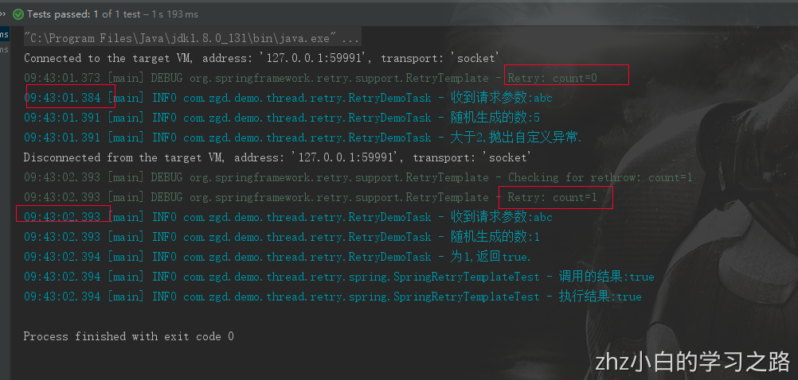
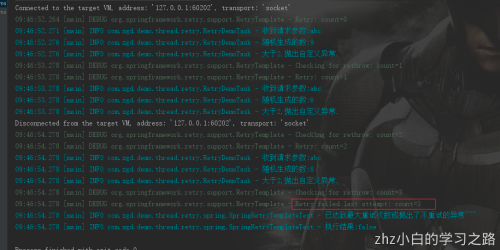

# 1、 重试框架之Spring-Retry

Spring Retry 为 Spring 应用程序提供了声明性重试支持。 它用于Spring批处理、Spring集成、Apache Hadoop(等等)。它主要是针对可能抛出异常的一些调用操作,进行有策略的重试

## 1.1、Spring-Retry的普通使用方式


准备工作
我们只需要加上依赖:

```java
<dependency>
    <groupId>org.springframework.retry</groupId>
    <artifactId>spring-retry</artifactId>
    <version>1.2.2.RELEASE</version>
 </dependency>
```

准备一个任务方法,我这里是采用一个随机整数,根据不同的条件返回不同的值,或者抛出异常

```java
package com.zgd.demo.thread.retry;

import lombok.extern.slf4j.Slf4j;
import org.apache.commons.lang3.RandomUtils;
import org.springframework.remoting.RemoteAccessException;


@Slf4j
public class RetryDemoTask {


  /**
   * 重试方法
   * @return
   */
  public static boolean retryTask(String param)  {
    log.info("收到请求参数:{}",param);

    int i = RandomUtils.nextInt(0,11);
    log.info("随机生成的数:{}",i);
    if (i == 0) {
      log.info("为0,抛出参数异常.");
      throw new IllegalArgumentException("参数异常");
    }else if (i  == 1){
      log.info("为1,返回true.");
      return true;
    }else if (i == 2){
      log.info("为2,返回false.");
      return false;
    }else{
      //为其他
        log.info("大于2,抛出自定义异常.");
        throw new RemoteAccessException("大于2,抛出远程访问异常");
      }
    }

}
```

### 1.1.1、使用SpringRetryTemplate

这里可以写我们的代码了

```java
package com.zgd.demo.thread.retry.spring;

import com.zgd.demo.thread.retry.RetryDemoTask;
import lombok.extern.slf4j.Slf4j;
import org.junit.Test;
import org.springframework.remoting.RemoteAccessException;
import org.springframework.retry.backoff.FixedBackOffPolicy;
import org.springframework.retry.policy.SimpleRetryPolicy;
import org.springframework.retry.support.RetryTemplate;

import java.util.HashMap;
import java.util.Map;


@Slf4j
public class SpringRetryTemplateTest {

  /**
   * 重试间隔时间ms,默认1000ms
   * */
  private long fixedPeriodTime = 1000L;
  /**
   * 最大重试次数,默认为3
   */
  private int maxRetryTimes = 3;
  /**
   * 表示哪些异常需要重试,key表示异常的字节码,value为true表示需要重试
   */
  private Map<Class<? extends Throwable>, Boolean> exceptionMap = new HashMap<>();


  @Test
  public void test() {
    exceptionMap.put(RemoteAccessException.class,true);

    // 构建重试模板实例
    RetryTemplate retryTemplate = new RetryTemplate();

    // 设置重试回退操作策略，主要设置重试间隔时间
    FixedBackOffPolicy backOffPolicy = new FixedBackOffPolicy();
    backOffPolicy.setBackOffPeriod(fixedPeriodTime);

    // 设置重试策略，主要设置重试次数
    SimpleRetryPolicy retryPolicy = new SimpleRetryPolicy(maxRetryTimes, exceptionMap);

    retryTemplate.setRetryPolicy(retryPolicy);
    retryTemplate.setBackOffPolicy(backOffPolicy);

    Boolean execute = retryTemplate.execute(
            //RetryCallback
            retryContext -> {
              boolean b = RetryDemoTask.retryTask("abc");
              log.info("调用的结果:{}", b);
              return b;
            },
            retryContext -> {
              //RecoveryCallback
              log.info("已达到最大重试次数或抛出了不重试的异常~~~");
              return false;
            }
      );

    log.info("执行结果:{}",execute);

  }

}
```

- 简单剖析下案例代码，RetryTemplate 承担了重试执行者的角色，它可以设置SimpleRetryPolicy(重试策略，设置重试上限，重试的根源实体)，FixedBackOffPolicy（固定的回退策略，设置执行重试回退的时间间隔）。
- RetryTemplate通过execute提交执行操作，需要准备RetryCallback 和RecoveryCallback 两个类实例，前者对应的就是重试回调逻辑实例，包装正常的功能操作，RecoveryCallback实现的是整个执行操作结束的恢复操作实例.
- 只有在调用的时候抛出了异常,并且异常是在exceptionMap中配置的异常,才会执行重试操作,否则就调用到excute方法的第二个执行方法RecoveryCallback中
- 当然,重试策略还有很多种,回退策略也是:

### 1.2.1、重试策略

```java
NeverRetryPolicy：只允许调用RetryCallback一次，不允许重试

AlwaysRetryPolicy：允许无限重试，直到成功，此方式逻辑不当会导致死循环

SimpleRetryPolicy：固定次数重试策略，默认重试最大次数为3次，RetryTemplate默认使用的策略

TimeoutRetryPolicy：超时时间重试策略，默认超时时间为1秒，在指定的超时时间内允许重试

ExceptionClassifierRetryPolicy：设置不同异常的重试策略，类似组合重试策略，区别在于这里只区分不同异常的重试

CircuitBreakerRetryPolicy：有熔断功能的重试策略，需设置3个参数openTimeout、resetTimeout和delegate

CompositeRetryPolicy：组合重试策略，有两种组合方式，乐观组合重试策略是指只要有一个策略允许即可以重试，

悲观组合重试策略是指只要有一个策略不允许即可以重试，但不管哪种组合方式，组合中的每一个策略都会执行
```

### 1.2.2、重试回退策略

重试回退策略，指的是每次重试是立即重试还是等待一段时间后重试。
默认情况下是立即重试，如果需要配置等待一段时间后重试则需要指定回退策略BackoffRetryPolicy。

```java
NoBackOffPolicy：无退避算法策略，每次重试时立即重试

FixedBackOffPolicy：固定时间的退避策略，需设置参数sleeper和backOffPeriod，sleeper指定等待策略，默认是Thread.sleep，即线程休眠，backOffPeriod指定休眠时间，默认1秒

UniformRandomBackOffPolicy：随机时间退避策略，需设置sleeper、minBackOffPeriod和maxBackOffPeriod，该策略在[minBackOffPeriod,maxBackOffPeriod之间取一个随机休眠时间，minBackOffPeriod默认500毫秒，maxBackOffPeriod默认1500毫秒

ExponentialBackOffPolicy：指数退避策略，需设置参数sleeper、initialInterval、maxInterval和multiplier，initialInterval指定初始休眠时间，默认100毫秒，maxInterval指定最大休眠时间，默认30秒，multiplier指定乘数，即下一次休眠时间为当前休眠时间*multiplier

ExponentialRandomBackOffPolicy：随机指数退避策略，引入随机乘数可以实现随机乘数回退
```

我们可以根据自己的应用场景和需求,使用不同的策略,不过一般使用默认的就足够了.
上面的代码的话,我简单的设置了重试间隔为1秒,重试的异常是RemoteAccessException,下面就是测试代码的情况:
重试第二次成功的情况:

重试一次以后,遇到了没有指出需要重试的异常,直接结束重试,调用retryContext

重试了三次后,达到了最大重试次数,调用retryContext


## 1.2、Spring-Retry的注解使用方式

既然是Spring家族的东西,那么自然就支持和Spring-Boot整合

1. 准备工作
   依赖:

```java
 <dependency>
    <groupId>org.springframework.retry</groupId>
    <artifactId>spring-retry</artifactId>
    <version>1.2.2.RELEASE</version>
 </dependency>

 <dependency>
    <groupId>org.aspectj</groupId>
    <artifactId>aspectjweaver</artifactId>
    <version>1.9.1</version>
 </dependency>
```

1. 代码
   在application启动类上加上@EnableRetry的注解

```java
@EnableRetry
public class Application {
	...
}
```

为了方便测试,我这里写了一个SpringBootTest的测试基类,需要使用SpringBootTest的只要继承这个类就好了

```java
package com.zgd.demo.thread.test;

import com.zgd.demo.thread.Application;
import lombok.extern.slf4j.Slf4j;
import org.junit.After;
import org.junit.Before;
import org.junit.runner.RunWith;
import org.springframework.boot.test.context.SpringBootTest;
import org.springframework.test.context.junit4.SpringRunner;

@RunWith(SpringRunner.class)
@SpringBootTest(classes = Application.class)
@Slf4j
public class MyBaseTest {


  @Before
  public void init() {
    log.info("----------------测试开始---------------");
  }

  @After
  public void after() {
    log.info("----------------测试结束---------------");
  }

}
```

我们只要在需要重试的方法上加@Retryable,在重试失败的回调方法上加@Recover,下面是这些注解的属性

建一个service类

```java
package com.zgd.demo.thread.retry.spring;

import com.zgd.demo.thread.retry.RetryDemoTask;
import com.zgd.demo.thread.test.MyBaseTest;
import lombok.extern.slf4j.Slf4j;
import org.springframework.remoting.RemoteAccessException;
import org.springframework.retry.ExhaustedRetryException;
import org.springframework.retry.annotation.Backoff;
import org.springframework.retry.annotation.Recover;
import org.springframework.retry.annotation.Retryable;
import org.springframework.stereotype.Component;

@Service
@Slf4j
public class SpringRetryDemo   {

 /**
   * 重试所调用方法
   * @param param
   * @return
   */
  @Retryable(value = {RemoteAccessException.class},maxAttempts = 3,backoff = @Backoff(delay = 1000L,multiplier = 2))
  public boolean call(String param){
      return RetryDemoTask.retryTask(param);
  }

  /**
   * 达到最大重试次数,或抛出了一个没有指定进行重试的异常
   * recover 机制
   * @param e 异常
   */
  @Recover
  public boolean recover(Exception e,String param) {
    log.error("达到最大重试次数,或抛出了一个没有指定进行重试的异常:",e);
    return false;
  }

}
```

然后我们调用这个service里面的call方法

```java
package com.zgd.demo.thread.retry.spring;

import com.zgd.demo.thread.test.MyBaseTest;
import lombok.extern.slf4j.Slf4j;
import org.junit.Test;
import org.springframework.beans.factory.annotation.Autowired;
import org.springframework.stereotype.Component;

@Component
@Slf4j
public class SpringRetryDemoTest extends MyBaseTest {

  @Autowired
  private SpringRetryDemo springRetryDemo;

  @Test
  public void retry(){
    boolean abc = springRetryDemo.call("abc");
    log.info("--结果是:{}--",abc);
  }

}
```

这里我依然是RemoteAccessException的异常才重试,@Backoff(delay = 2000L,multiplier = 2))表示第一次间隔2秒,以后都是次数的2倍,也就是第二次4秒,第三次6秒.
来测试一下:
遇到了没有指定重试的异常,这里指定重试的异常是 @Retryable(value = {RemoteAccessException.class}...,所以抛出参数异常IllegalArgumentException的时候,直接回调@Recover的方法

重试达到最大重试次数时,调用@Recover的方法

重试到最后一次没有报错,返回false


# 2、重试框架之Guava-Retry

Guava retryer工具与spring-retry类似，都是通过定义重试者角色来包装正常逻辑重试，但是Guava retryer有更优的策略定义，在支持重试次数和重试频度控制基础上，能够兼容支持多个异常或者自定义实体对象的重试源定义，让重试功能有更多的灵活性。
Guava Retryer也是线程安全的，入口调用逻辑采用的是Java.util.concurrent.Callable的call方法，示例代码如下：
pom.xml加入依赖

```xml
<!-- https://mvnrepository.com/artifact/com.github.rholder/guava-retrying -->
    <dependency>
        <groupId>com.github.rholder</groupId>
        <artifactId>guava-retrying</artifactId>
        <version>2.0.0</version>
    </dependency>
```

更改一下测试的任务方法

```java
package com.zgd.demo.thread.retry;

import lombok.extern.slf4j.Slf4j;
import org.apache.commons.lang3.RandomUtils;
import org.springframework.remoting.RemoteAccessException;

/**
 * @Author: zgd
 * @Date: 18/11/21 17:01
 * @Description:
 */
@Slf4j
public class RetryDemoTask {


  /**
   * 重试方法
   * @return
   */
  public static boolean retryTask(String param)  {
    log.info("收到请求参数:{}",param);

    int i = RandomUtils.nextInt(0,11);
    log.info("随机生成的数:{}",i);
    if (i < 2) {
      log.info("为0,抛出参数异常.");
      throw new IllegalArgumentException("参数异常");
    }else if (i  < 5){
      log.info("为1,返回true.");
      return true;
    }else if (i < 7){
      log.info("为2,返回false.");
      return false;
    }else{
      //为其他
        log.info("大于2,抛出自定义异常.");
        throw new RemoteAccessException("大于2,抛出自定义异常");
      }
    }

}
```

Guava
这里设定跟Spring-Retry不一样,我们可以根据返回的结果来判断是否重试,比如返回false我们就重试

```java
package com.zgd.demo.thread.retry.guava;

import com.github.rholder.retry.*;
import com.zgd.demo.thread.retry.RetryDemoTask;
import org.junit.Test;
import org.springframework.remoting.RemoteAccessException;

import java.util.concurrent.ExecutionException;
import java.util.concurrent.TimeUnit;
import java.util.function.Predicate;

public class GuavaRetryTest {


  @Test
  public void fun01(){
    // RetryerBuilder 构建重试实例 retryer,可以设置重试源且可以支持多个重试源，可以配置重试次数或重试超时时间，以及可以配置等待时间间隔
    Retryer<Boolean> retryer = RetryerBuilder.<Boolean> newBuilder()
            .retryIfExceptionOfType(RemoteAccessException.class)//设置异常重试源
            .retryIfResult(res-> res==false)  //设置根据结果重试
            .withWaitStrategy(WaitStrategies.fixedWait(3, TimeUnit.SECONDS)) //设置等待间隔时间
            .withStopStrategy(StopStrategies.stopAfterAttempt(3)) //设置最大重试次数
            .build();

    try {
      retryer.call(() -> RetryDemoTask.retryTask("abc"));
    } catch (Exception e) {
      e.printStackTrace();
    }
  }

}
```

运行测试一下
遇到了我们指定的需要重试的异常,进行重试,间隔是3秒

重试次数超过了最大重试次数

返回为true,直接结束重试

遇到了没有指定重试的异常,结束重试

返回false,重试

我们可以更灵活的配置重试策略,比如:

- retryIfException

retryIfException，抛出 runtime 异常、checked 异常时都会重试，但是抛出 error 不会重试。

- retryIfRuntimeException

retryIfRuntimeException 只会在抛 runtime 异常的时候才重试，checked 异常和error 都不重试。

- retryIfExceptionOfType

retryIfExceptionOfType 允许我们只在发生特定异常的时候才重试，比如NullPointerException 和 IllegalStateException 都属于 runtime 异常，也包括自定义的error。
如:

```java
retryIfExceptionOfType(NullPointerException.class)// 只在抛出空指针异常重试
```

- retryIfResult
  retryIfResult 可以指定你的 Callable 方法在返回值的时候进行重试，如

```java
// 返回false重试  
.retryIfResult(Predicates.equalTo(false))   

//以_error结尾才重试  
.retryIfResult(Predicates.containsPattern("_error$"))

//返回为空时重试
.retryIfResult(res-> res==null)
```

- RetryListener
  当发生重试之后，假如我们需要做一些额外的处理动作，比如log一下异常，那么可以使用RetryListener。
  每次重试之后，guava-retrying 会自动回调我们注册的监听。
  可以注册多个RetryListener，会按照注册顺序依次调用。

```java
.withRetryListener(new RetryListener {      
 @Override    
   public <T> void onRetry(Attempt<T> attempt) {  
               logger.error("第【{}】次调用失败" , attempt.getAttemptNumber());  
          } 
 }
) 
```

主要接口


# 3、总结

- spring-retry 和 guava-retry 工具都是线程安全的重试，能够支持并发业务场景的重试逻辑正确性。两者都很好的将正常方法和重试方法进行了解耦,可以设置超时时间,重试次数,间隔时间,监听结果,都是不错的框架
- 但是明显感觉得到,guava-retry在使用上更便捷,更灵活,能根据方法返回值来判断是否重试,而Spring-retry只能根据抛出的异常来进行重试

引用：[https://blog.csdn.net/zzzgd_666/article/details/84377962](https://blog.csdn.net/zzzgd_666/article/details/84377962)

# 4、Resilience4j-轻量级熔断框架

[https://www.jianshu.com/p/5531b66b777a](https://www.jianshu.com/p/5531b66b777a)

