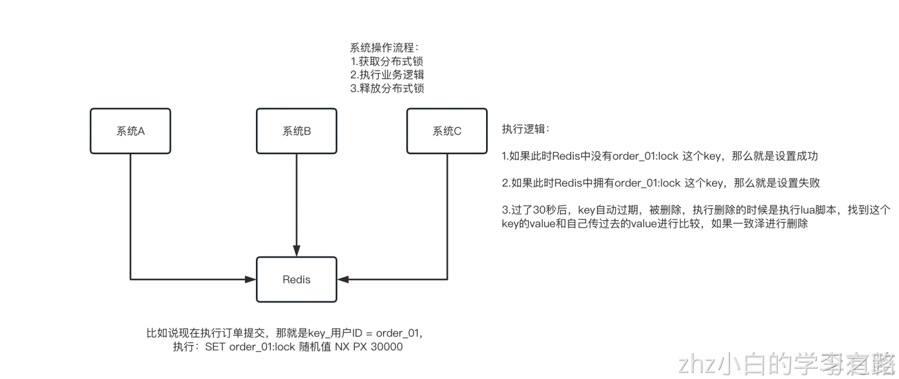

# 一、什么是分布式锁？
分布式锁，即分布式系统中的锁
在单体应用中我们通过锁解决的是**控制共享资源访问**的问题，而分布式锁，就是解决了**分布式系统中控制共享资源访问**的问题。与单体应用不同的是，分布式系统中竞争共享资源的最小粒度从线程升级成了进程。相对应的是线程锁、进程锁

**线程锁（单体同一个数据库）：**主要用来给方法、代码块加锁。当某个方法或代码使用锁，在同一时刻仅有一个线程执行该方法或该代码段。线程锁只在同一JVM中有效果，因为线程锁的实现在根本上是依靠线程之间共享内存实现的，比如synchronized是共享对象头，显示锁Lock是共享某个变量（state）

**进程锁（多体多个数据库）：**为了控制同一操作系统中多个进程访问某个共享资源，因为进程具有独立性，各个进程无法访问其他进程的资源，因此无法通过synchronized等线程锁实现进程锁

分布式锁：当多个进程不在同一个系统中，用分布式锁控制多个进程对资源的访问

# 二、为什么要用分布式锁？
答：为分两种情况：

1. 共享锁：进程A和进程B同时访问资源，读操作。幂等性避免重复加锁。
2. 独占锁：进程A和进程B同时访问分布式锁，写操作。非幂等性同一时刻只允许一个线程或进程访问这个共享资源。

注：幂等性

- 所谓幂等性通俗的将就是一次请求和多次请求同一个资源产生相同的副作用。用数学语言表达就是f(x)=f(f(x))。
- 维基百科的幂等性定义如下

幂等（idempotent、idempotence）是一个数学与计算机学概念，常见于抽象代数中

在编程中一个幂等操作的特点是其任意多次执行所产生的影响均与一次执行的影响相同。幂等函数，或幂等方法，是指可以使用相同参数重复执行，并能获得相同结果的函数。

这些函数不会影响系统状态，也不用担心重复执行会对系统造成改变。例如，“setTrue()”函数就是一个幂等函数,无论多次执行，其结果都是一样的，更复杂的操作幂等保证是利用唯一交易号(流水号)实现

# 三、分布式锁的实现方式

**主要有：基于数据库实现分布式锁，基于reids实现分布式锁 ，基于Zookeeper实现分布式锁**

## 基于数据库实现分布式锁
这里可以使用专用的数据表：
```plsql
CREATE TABLE `resource_lock`(
	`id` int (11) unsigned NOT NULL AUTO_INCREMENT,
 	`resource_name` varchar(128) NOT NULL DEFAULT '' COMMENT '资源名称',
  `node_info` varchar(128) NOT NULL DEFAULT '' COMMENT '节点信息/ 线程信息',
  `count` varchar(11) NOT NULL DEFAULT '0' COMMENT '锁的次数，实现可重入',
  `create_time` timestamp  NULL DEFAULT NULL COMMENT '创建时间',
  `update_time` timestamp  NULL DEFAULT NULL COMMENT '更新时间',
  PRIMARY KEY (`id`),
  UNIQUE KEY `unq_resource`(`resource_name`)
)ENGINE = InnoDB DEFAULT CHARSET = utf8
```

适用场景：没有其他中间件可以使用，需要加锁的资源恰好有对应的数据表
优点：理解起来简单，不需要维护其他中间件
缺点：需要自己实现加锁/解锁过程，性能较差


#### 

## 基于reids实现分布式锁 

redis（remote dictionary server）是一个k-v存储中间件，有多种方式加锁：
### SET NX的方式
 (SET key value NX PX milliseconds) - 通过0和1去判断是否获取得到锁

这个的NX的意思就是只有key不存在的时候才会设置成功，PX 30000的意思是30秒后锁自动释放。别人创建的时候如果发现已经有了就不能加锁了

为啥要用随机值呢？因为如果某个客户端获取到了锁，但是阻塞了很长时间超过30秒才执行完，此时可能已经自动释放锁了，此时可能别的客户端已经获取到了这个锁，要是你这个时候直接删除key的话会有问题，所以得用随机值加上面的lua脚本来释放锁

删除Key的Lua脚本：
```lua
if redis.call("get",KEYS[1]) == ARGV[1] then
  return redis.call("del",KEYS[1])
else
  return 0
end
```

但是这样是肯定不行的。因为如果是普通的redis单实例，那就是单点故障。或者是redis普通主从，那redis主从异步复制，如果主节点挂了，key还没同步到从节点，此时从节点切换为主节点，别人就会拿到锁

因为redis主从架构采用的是异步复制，当master节点拿到了锁，但是锁还未同步到slave节点，此时master节点挂了，发生故障转移，slave节点被选举为master节点，丢失了锁。这样其他线程就能够获取到该锁，显然是有问题的

### RedLock的方式 
正是因为上述redis分布式锁存在的一致性问题，redis作者提出了一个更加高级的基于redis实现的分布式锁——RedLock。原文可参考：[Distributed locks with Redis](https://redis.io/topics/distlock)
Distributed Locks with Redis 中英译文# Distributed Locks with Redis
A distributed lock pattern with Redis
Distributed locks are a very useful primitive in many environments where different processes must operate with shared resources in a mutually exclusive way.
There are a number of libraries and blog posts describing how to implement a DLM (Distributed Lock Manager) with Redis, but every library uses a different approach, and many use a simple approach with lower guarantees compared to what can be achieved with slightly more complex designs.
This page describes a more canonical algorithm to implement distributed locks with Redis. We propose an algorithm, called **Redlock**, which implements a DLM which we believe to be safer than the vanilla single instance approach. We hope that the community will analyze it, provide feedback, and use it as a starting point for the implementations or more complex or alternative designs

Redis分布式锁
Redis的分布式锁模式
分布式锁在许多环境中是非常有用的原语，在这些环境中，不同的进程必须以互斥的方式使用共享资源进行操作。
有很多库和博客文章描述了如何用Redis实现DLM（分布式锁管理器），但每个库都使用不同的方法，许多库使用简单的方法，与稍微复杂的设计相比，保证更低。
本页介绍了一种更规范的算法，用于使用Redis实现分布式锁。我们提出了一种称为Redlock的算法，它实现了DLM，我们认为它比普通的单实例方法更安全。我们希望社区能够对其进行分析，提供反馈，并将其作为实现或更复杂或替代设计的起点。

#### RedLock是什么？
RedLock是基于redis实现的分布式锁，它能够保证以下特性：
互斥性：在任何时候，只能有一个客户端能够持有锁；
避免死锁：当客户端拿到锁后，即使发生了网络分区或者客户端宕机，也不会发生死锁；（利用key的存活时间）
容错性：只要多数节点的redis实例正常运行，就能够对外提供服务，加锁或者释放锁；而非redLock是无法满足互斥性的，上面已经阐述过了原因

#### RedLock算法
RedLock实现主要是RedLock算法，就是说假设有N个redis的master节点，这些节点是相互独立的（不需要主从或者其他协调的系统）。N推荐为奇数

客户端执行以下步骤获取一把锁：

- 获取当前时间戳，以毫秒为单位
- 使用相同的lockName和lockValue，尝试从N个节点获取锁

（在获取锁时，要求等待获取锁的时间远小于锁的释放时间，如锁的lease_time为10s，那么wait_time应该为5-50毫秒；避免因为redis实例挂掉，客户端需要等待更长的时间才能返回，即需要让客户端能够fast_fail；如果一个redis实例不可用，那么需要继续从下个redis实例获取锁）

- 当从N个节点获取锁结束后，如果客户端能够从多数节点(N/2 + 1)中成功获取锁，比如5个节点就要求是3个节点（n / 2 +1）。且获取锁的时间小于失效时间，那么可认为，客户端成功获得了锁。（获取锁的时间=当前时间戳 - 步骤1的时间戳）
- 客户端成功获得锁后，那么锁的实际有效时间 = 设置锁的有效时间 - 获取锁的时间
- 客户端获取锁失败后，N个节点的redis实例都会释放锁，即使未能加锁成功

#### 为什么N推荐为奇数呢？
原因1：本着最大容错的情况下，占用服务资源最少的原则，2N+1和2N+2的容灾能力是一样的，所以采用2N+1；比如，5台服务器允许2台宕机，容错性为2，6台服务器也只能允许2台宕机，容错性也是2，因为要求超过半数节点存活才OK

原因2：假设有6个redis节点，client1和client2同时向redis实例获取同一个锁资源，那么可能发生的结果是——client1获得了3把锁，client2获得了3把锁，由于都没有超过半数，那么client1和client2获取锁都失败，对于奇数节点是不会存在这个问题

#### 失败时重试
当客户端无法获取到锁时，应该随机延时后进行重试，防止多个客户端在同一时间抢夺同一资源的锁（会导致脑裂，最终都不能获取到锁）。客户端获得超过半数节点的锁花费的时间越短，那么脑裂的概率就越低。所以，理想的情况下，客户端最好能够同时（并发）向所有redis发出set命令。

当客户端从多数节点获取锁失败时，应该尽快释放已经成功获取的锁，这样其他客户端不需要等待锁过期后再获取。（如果存在网络分区，客户端已经无法和redis进行通信，那么此时只能等待锁过期后自动释放）

#### 释放锁
向所有redis实例发送释放锁命令即可，不需要关心redis实例有没有成功上锁。

redisson在加锁的时候，key=lockName, value=uuid + threadID, 采用set结构存储，并包含了上锁的次数 （支持可重入）；解锁的时候通过hexists判断key和value是否存在，存在则解锁；这里不会出现误解锁


### Ridession的方式 

redisson是在redis基础上实现的一套开源解决方案，不仅提供了一系列的分布式的java常用对象，还提供了许多分布式服务，宗旨是促进使用者对redis的关注分离，更多的关注业务逻辑的处理上

调用开源框架里面封装好的api(lock和unlock)。用Lua脚本实现加锁和解锁。还提供一个watchdoc（看门狗）监控锁的状态，每10s对key进行续约

主要提供的分布式锁有以下：可重入锁、公平锁、MultiLock、RedLock、读写锁

可重入锁：非公平锁，最最基础的分布式锁，我们最最常用的锁

公平锁：各个客户端尝试获取锁的时候会排队，按照队列的顺序先后获取锁

MultiLock：底层就是一次性要锁住多个小lock，让你一次性锁多个资源

RedLock：相当于是一把锁，虽然底层包裹了多个小lock，但是那多个小lock并不是说对应着多个资源，而是说每个锁key对应一个redis实例，只要大多数的redis实例加锁成功，就认为这个整体的RedLock锁加锁成功，健壮性比其他的普通的锁要好一些

读写锁：读锁、写锁，各种锁可以互斥，可以非互斥，可以支持更加复杂的加锁的语义
