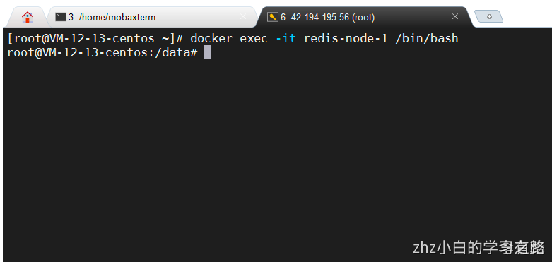

# 一、准备Redis镜像、容器

## 下载redis6.0.8
```
 docker pull redis:6.0.8
```

## 准备6台服务器配置文件
```
#创建第一台服务..
mkdir -p /usr/local/repository/redis/redis-node-1
# 配置config文件
vim /usr/local/repository/redis/redis-node-1/redis.conf 
cd /usr/local/repository/redis
# 依次复制其他5份
cp -r redis-node-1/ ./redis-node-2
```


##  创建6台redis容器

```
docker run -d --name redis-node-1 --net host --privileged=true -v /usr/local/repository/redis/redis-node-1/redis.conf:/etc/redis/redis.conf -v /usr/local/repository/redis/redis-node-1/data:/data redis:6.0.8 --cluster-enabled yes --appendonly yes --port 6381
 
docker run -d --name redis-node-2 --net host --privileged=true -v /usr/local/repository/redis/redis-node-2/redis.conf:/etc/redis/redis.conf -v /usr/local/repository/redis/redis-node-2/data:/data redis:6.0.8 --cluster-enabled yes --appendonly yes --port 6382

docker run -d --name redis-node-3 --net host --privileged=true -v /usr/local/repository/redis/redis-node-3/redis.conf:/etc/redis/redis.conf -v /usr/local/repository/redis/redis-node-3/data:/data redis:6.0.8 --cluster-enabled yes --appendonly yes --port 6383

docker run -d --name redis-node-4 --net host --privileged=true -v /usr/local/repository/redis/redis-node-4/redis.conf:/etc/redis/redis.conf -v /usr/local/repository/redis/redis-node-4/data:/data redis:6.0.8 --cluster-enabled yes --appendonly yes --port 6384

docker run -d --name redis-node-5 --net host --privileged=true -v /usr/local/repository/redis/redis-node-5/redis.conf:/etc/redis/redis.conf -v /usr/local/repository/redis/redis-node-5/data:/data redis:6.0.8 --cluster-enabled yes --appendonly yes --port 6385

docker run -d --name redis-node-6 --net host --privileged=true -v /usr/local/repository/redis/redis-node-6/redis.conf:/etc/redis/redis.conf -v /usr/local/repository/redis/redis-node-6/data:/data redis:6.0.8 --cluster-enabled yes --appendonly yes --port 6386

```

# 二、创建主从集群关系

## 进入任意一台redis容器
```
docker exec -it redis-node-1 /bin/bash

```


## 构建主从关系

```

redis-cli --cluster create 127.0.0.1:6381 127.0.0.1:6382 127.0.0.1:6383 127.0.0.1:6384 127.0.0.1:6385 127.0.0.1:6386 --cluster-replicas 1
# --cluster-replicas 1 表示为每个master创建一个slave节点
```


## 查看集群状态

```
# 进入任意redis容器，这里以6381为例
redis-cli -p 6381
cluster info
cluster nodes
```

# 三、主从容错切换迁移案例

## 数据读写存储
```

# 重新进入6381，-c可以防止路由失效（(error) MOVED 12706 192.168.202.200:6383），往其他服务器hash槽存数据时报错。
redis-cli -p 6381 -c
set k1 v1
set k2 v2
```


## 切换到集群上的其他服务器，获取值

## 查看集群信息

## 容错切换迁移-主6381和从机切换

```
# 停止6381，机器，查看集群状态
docker stop redis-node-1
# 进入6382容器，查看集群状态
docker exec -it redis-node-2 bash
```


