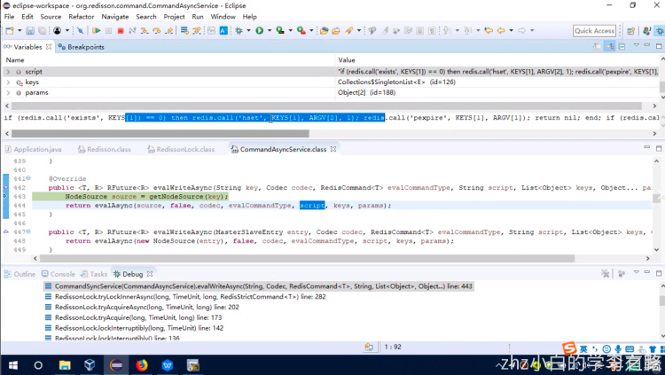
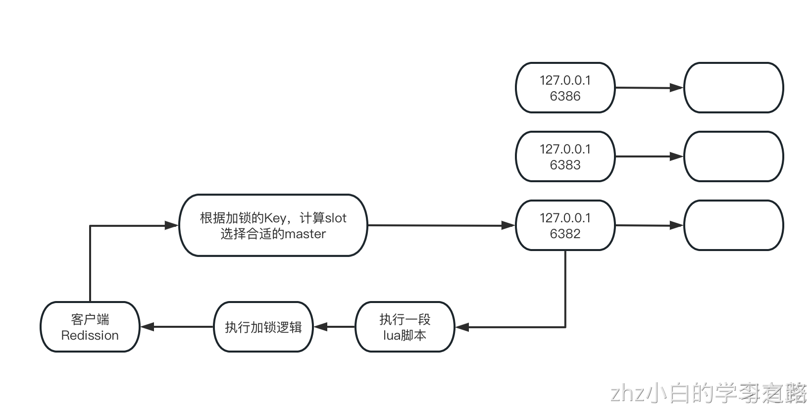

# 一、前言回顾
```java
// Acquire lock and release it automatically after 10 seconds
// if unlock method hasn't been invoked
lock.lock(10, TimeUnit.SECONDS);

// Wait for 100 seconds and automatically unlock it after 10 seconds
boolean res = lock.tryLock(100, 10, TimeUnit.SECONDS);
lock.unlock();
```
客户端A已经获取了一把锁，此时客户端B尝试去获取这把锁，默认情况下是无限制的等待，但是这里你在获取锁的时候是可以指定一个时间的，最多等待100秒的时间

如果获取不到锁直接就返回，boolean res，这个res如果是false就代表你加锁失败了，在指定时间范围内，没有获取到锁 如果获取到了锁之后，在10秒之内，没有手动释放锁，那么就自动释放锁

前篇文章入口：[04_redis分布式锁（一）：可重入锁源码剖析之使用场景介绍](04_redis分布式锁（一）：可重入锁源码剖析之使用场景介绍.md)
# 二、redisson.getLock()解析
接下来我们就进入getLock方法里，看看它到底做了什么东西？
```java
public class Redisson implements RedissonClient {

    @Override
    public RLock getLock(String name) {
        return new RedissonLock(connectionManager.getCommandExecutor(), name);
    }
    //省略其他代码....
}

```
可以关注的获取到的Lock对象是RedissonLock对象，里面封装了一个ConnectionManager里获取的一个CommandExecutor，CommandExecutor是什么东西？

从名字看里面一定是封装了一个跟redis之间进行通信的一个Cconnection连接对象
```java

public interface ConnectionManager {
    
    //省略其他关键代码.....
    CommandSyncService getCommandExecutor();
}

public class MasterSlaveConnectionManager implements ConnectionManager {

	private final CommandSyncService commandExecutor;
    
	public CommandSyncService getCommandExecutor() {
        return this.commandExecutor;
    }

    //省略其他关键代码.....
}
```
```java
public class CommandSyncService extends CommandAsyncService implements CommandExecutor {

    public <T, R> R read(String key, RedisCommand<T> command, Object... params) {
        return this.read(key, this.connectionManager.getCodec(), command, params);
    }

    public <T, R> R read(String key, Codec codec, RedisCommand<T> command, Object... params) {
        RFuture<R> res = this.readAsync(key, codec, command, params);
        return this.get(res);
    }
	//省略其他关键代码.....
}

public class CommandAsyncService implements CommandAsyncExecutor {

	
	//省略其他关键代码.....
    
	public <T, R> RFuture<R> readAsync(String key, Codec codec, RedisCommand<T> command, Object... params) {
        RPromise<R> mainPromise = this.createPromise();
        NodeSource source = this.getNodeSource(key);
        this.async(true, source, codec, command, params, mainPromise, 0, false, (RFuture)null);
        return mainPromise;
    }
    
    public <V> V get(RFuture<V> future) {
        if (!future.isDone()) {
            final CountDownLatch l = new CountDownLatch(1);
            future.addListener(new FutureListener<V>() {
                public void operationComplete(Future<V> future) throws Exception {
                    l.countDown();
                }
            });
            boolean interrupted = false;

            while(!future.isDone()) {
                try {
                    l.await();
                } catch (InterruptedException var5) {
                    interrupted = true;
                    break;
                }
            }

            if (interrupted) {
                Thread.currentThread().interrupt();
            }
        }

        if (future.isSuccess()) {
            return future.getNow();
        } else {
            throw this.convertException(future);
        }
    }
}
```
那么我们就可以知道CommandExecutor命令执行器，封装了一个redis连接的命令执行器，可以执行一些set、get redis的一些操作，用来执行底层的redis命令的就可以了

接下来回到刚刚new RedissonLock(this.connectionManager.getCommandExecutor(), name);
```java
public class RedissonLock extends RedissonExpirable implements RLock {

    //省略其他关键性代码...
    public RedissonLock(CommandAsyncExecutor commandExecutor, String name) {
        super(commandExecutor, name);
        this.commandExecutor = commandExecutor;
        this.id = commandExecutor.getConnectionManager().getId();
        this.internalLockLeaseTime = commandExecutor.getConnectionManager().getCfg().getLockWatchdogTimeout();
        this.entryName = id + ":" + name;
	}
}
```
在这个RedissonLock的构造函数里面，建议关注的代码internalLockLeaseTime这东西，它是和跟watchdog看门狗有关系的

# 三、RedissonLock.getLock()解析
对于interlnalLockLeaseTime，我们可以根据构造函数里的commandExecutor.getConnectionManager().getCfg().getLockWatchdogTimeout()，去看看他是怎么赋值的
```java
public interface ConnectionManager {

    //省略其他关键代码.....
    CommandSyncService getCommandExecutor();
    
    Config getCfg();
}
public class MasterSlaveConnectionManager implements ConnectionManager {

	private final CommandSyncService commandExecutor;

	private final Config cfg;
    
	public CommandSyncService getCommandExecutor() {
        return this.commandExecutor;
    }
    
    
    //省略其他关键代码.....
}

public class Config {

    public Config() {
        this.transportMode = TransportMode.NIO;
        this.lockWatchdogTimeout = 30000L;
        this.keepPubSubOrder = true;
        this.addressResolverGroupFactory = new DnsAddressResolverGroupFactory();
    }
	//省略其他关键代码.....
}
```

接下来我们从redisson执行getLock获取到锁，现在可以看看RedissonLock它是怎么执行lock这个步骤的
```java
public class RedissonLock extends RedissonExpirable implements RLock {

    //省略其他关键性代码...
    public RedissonLock(CommandAsyncExecutor commandExecutor, String name) {
        super(commandExecutor, name);
        this.commandExecutor = commandExecutor;
        this.id = commandExecutor.getConnectionManager().getId();
        this.internalLockLeaseTime = commandExecutor.getConnectionManager().getCfg().getLockWatchdogTimeout();
        this.entryName = id + ":" + name;
	}
    
	@Override
    public void lock() {
        try {
            this.lockInterruptibly();
        } catch (InterruptedException var2) {
            Thread.currentThread().interrupt();
        }
    }

    @Override
    public void unlock() {
        try {
            get(unlockAsync(Thread.currentThread().getId()));
        } catch (RedisException e) {
            if (e.getCause() instanceof IllegalMonitorStateException) {
                throw (IllegalMonitorStateException)e.getCause();
            } else {
                throw e;
            }
        }

	public void lockInterruptibly() throws InterruptedException {
        this.lockInterruptibly(-1L, (TimeUnit)null);
    }
        
    public void lockInterruptibly(long leaseTime, TimeUnit unit) throws InterruptedException {
        long threadId = Thread.currentThread().getId();
        Long ttl = this.tryAcquire(leaseTime, unit, threadId);
        if (ttl != null) {
            RFuture<RedissonLockEntry> future = this.subscribe(threadId);
            this.commandExecutor.syncSubscription(future);

            try {
                while(true) {
                    ttl = this.tryAcquire(leaseTime, unit, threadId);
                    if (ttl == null) {
                        return;
                    }

                    if (ttl >= 0L) {
                        this.getEntry(threadId).getLatch().tryAcquire(ttl, TimeUnit.MILLISECONDS);
                    } else {
                        this.getEntry(threadId).getLatch().acquire();
                    }
                }
            } finally {
                this.unsubscribe(future, threadId);
            }
        }
    }
}
```
发现我们如果没有传递leaseTime和unit，默认走的是-1和null，紧接着就是走到tryAcquire这个方法，往里继续看详情处理了什么内容
```java


private Long tryAcquire(long leaseTime, TimeUnit unit, long threadId) {
    return (Long)this.get(this.tryAcquireAsync(leaseTime, unit, threadId));
}

private <T> RFuture<Long> tryAcquireAsync(long leaseTime, TimeUnit unit, final long threadId) {
    if (leaseTime != -1L) {
        return this.tryLockInnerAsync(leaseTime, unit, threadId, RedisCommands.EVAL_LONG);
    } else {
    
        RFuture<Long> ttlRemainingFuture = this.tryLockInnerAsync(
            this.commandExecutor.getConnectionManager().getCfg().getLockWatchdogTimeout(),
            TimeUnit.MILLISECONDS, threadId, RedisCommands.EVAL_LONG);
    
        ttlRemainingFuture.addListener(new FutureListener<Long>() {
            public void operationComplete(Future<Long> future) throws Exception {
                if (future.isSuccess()) {
                    Long ttlRemaining = (Long)future.getNow();
                    if (ttlRemaining == null) {
                        RedissonLock.this.scheduleExpirationRenewal(threadId);
                    }

                }
            }
        });
        return ttlRemainingFuture;
    }
}

<T> RFuture<T> tryLockInnerAsync(long leaseTime, TimeUnit unit, long threadId, RedisStrictCommand<T> command) {
    this.internalLockLeaseTime = unit.toMillis(leaseTime);
    return this.commandExecutor.evalWriteAsync(
        this.getName(), LongCodec.INSTANCE, command,
        "if (redis.call('exists', KEYS[1]) == 0) then redis.call('hset', KEYS[1], ARGV[2], 1); redis.call('pexpire', KEYS[1], ARGV[1]); return nil; end; if (redis.call('hexists', KEYS[1], ARGV[2]) == 1) then redis.call('hincrby', KEYS[1], ARGV[2], 1); redis.call('pexpire', KEYS[1], ARGV[1]); return nil; end; return redis.call('pttl', KEYS[1]);",
        Collections.singletonList(this.getName()), new Object[]{this.internalLockLeaseTime, this.getLockName(threadId)});
}

```
至此我们就找到有个lua脚本，针对redis加锁的这么一个底层的命令
```java
 "if (redis.call('exists', KEYS[1]) == 0) then " +
      "redis.call('hset', KEYS[1], ARGV[2], 1); " +
      "redis.call('pexpire', KEYS[1], ARGV[1]); " +
      "return nil; " +
  "end; " +
  "if (redis.call('hexists', KEYS[1], ARGV[2]) == 1) then " +
      "redis.call('hincrby', KEYS[1], ARGV[2], 1); " +
      "redis.call('pexpire', KEYS[1], ARGV[1]); " +
      "return nil; " +
  "end; " +
  "return redis.call('pttl', KEYS[1]);"

```
第一行if (redis.call('exists', KEYS[1]) == 0) then，KEYS[1] 一看就是我们设置的那个锁的名字，先执行了redis的exists的指令，判断一下，如果“anyLock”这个key不存在，那么就进行加锁，加锁的指令：
```java
"redis.call('hset', KEYS[1], ARGV[2], 1); " +
"redis.call('pexpire', KEYS[1], ARGV[1]); " +
"return nil; " +
```
hset，它是redis的一个指令，相当于是在redis的一个map数据结构里设置一个key value，相当于有一个anyLock的map结构，同时在map里面放着一对kv。而pexpire KEYS[1] ARGV[1]，其实就是设置一个key的过期时间，紧接着我们可以发现后面还有一段lua脚本
```java
"if (redis.call('hexists', KEYS[1], ARGV[2]) == 1) then " +
  "redis.call('hincrby', KEYS[1], ARGV[2], 1); " +
  "redis.call('pexpire', KEYS[1], ARGV[1]); " +
  "return nil; " +
"end; " +
```
hexits KEYS[1] ARGV[2]，这个意思就是说针对KEYS[1]（anyLock）这个名字的一个map，里面是否存在一个ARGV[2]的一个key，如果是存在的话，hincrby KEYS[1] ARGV[2] 1，将anyLock这个map中的这个key的值累加1，同时又执行了一下pexpire ，再一次将anyLock这个key的有效期又设置一次

接下来我们看return redis.call('pttl', KEYS[1]);这行指令，其实是pttl这个指令，就是返回anyLock这个key当前还剩下的一个有效的存活期，就是当前这个key还能存活多少毫秒，或者多少秒这样子

至此我们上面加锁的逻辑就是这样，接着往下走this.commandExecutor.evalWriteAsync
```java

public class CommandAsyncService implements CommandAsyncExecutor {


	public <T, R> RFuture<R> evalWriteAsync(String key, Codec codec, RedisCommand<T> evalCommandType, String script, List<Object> keys, Object... params) {
        NodeSource source = this.getNodeSource(key);
        return this.evalAsync(source, false, codec, evalCommandType, script, keys, params);
    }
    //省略其他关键性代码....
}
```
看着方法的名称，可以推测是根据anyLock这个key，尝试去获取到一个NodeSource的这么一个东西，我们可以认为说，我们现在不是有3主3从的一个redis集群，是不是有可能说他是通过key获取其中一个NodeSource？

这个NodeSource有可能就是3个master实例中的一个，有可能就是说对这个key的设置，就释放在3个master的其中一个上而已
```java
private NodeSource getNodeSource(String key) {
    int slot = this.connectionManager.calcSlot(key);
    MasterSlaveEntry entry = this.connectionManager.getEntry(slot);
    return new NodeSource(entry);
}
```
在redis cluster，默认的slot数量是16384，无论你创建的是多大的一个redis cluster，他统一有一个slot的一个划分，就是将集群的存储空间划分为16384个slot，这16384个slot就平均分布在各个master实例上

3个master，每个master实例有5000多slot。这里就可以猜出意思：那么在针对redis cluster读写操作的时候，先会去基于hash算法计算这个slot，anyLock这个key，13434，算出来是这个slot，相当于是针对“anyLock”这个key计算出来一个hash值，然后将这个hash值对16384这个slot数量进行取模，int slot = connectionManager.calcSlot(key);
```java
public int calcSlot(String key) {
    if (key == null) {
        return 0;
    } else {
        int start = key.indexOf(123);
        int result;
        if (start != -1) {
            result = key.indexOf(125);
            key = key.substring(start + 1, result);
        }
        result = CRC16.crc16(key.getBytes()) % 16384;
        this.log.debug("slot {} for {}", result, key);
        return result;
    }
}
```

取模之后就可以拿到当前这个“anyLock”的key对应的是哪个slot，而MasterSlaveEntry entry = connectionManager.getEntry(slot);，这行代码是什么意思？就是算出来了一个slot，就是根据这个slot的编号，获取到这个slot是属于哪个master实例的

将这entry打印出来可以看到是
```java
MasterSlaveEntry [
    masterEntry=[
    	freeSubscribeConnectionsAmount=1, 
    	freeSubscribeConnectionsCounter=50, 
    	freeConnectionsAmount=32, 
    	freeConnectionsCounter=64,
    	freezed=false,
    	freezeReason=null,
    	client=[addr=redis://localhost:6382],
    	nodeType=MASTER,
    	firstFail=0
	]
]
```
此时就是已经知道了，其实必须是将加锁的那段lua脚本，放到redis://127.0.0.1:6382这个master实例上去执行，完成加锁的操作，接着往下走，看看他的参数是什么？
```java
public <T, R> RFuture<R> evalWriteAsync(String key, Codec codec, RedisCommand<T> evalCommandType, String script, List<Object> keys, Object... params) {
    NodeSource source = this.getNodeSource(key);
    return this.evalAsync(source, false, codec, evalCommandType, script, keys, params);
}

private <T, R> RFuture<R> evalAsync(NodeSource nodeSource, boolean readOnlyMode, Codec codec, RedisCommand<T> evalCommandType, String script, List<Object> keys, Object... params) {
    RPromise<R> mainPromise = this.createPromise();
    List<Object> args = new ArrayList(2 + keys.size() + params.length);
    args.add(script);
    args.add(keys.size());
    args.addAll(keys);
    args.addAll(Arrays.asList(params));
    this.async(readOnlyMode, nodeSource, codec, evalCommandType, args.toArray(), mainPromise, 0, false, (RFuture)null);
    return mainPromise;
}
```

keys，是一个数组，[anyLock]，这个其实对应的就是上面分析的那个脚本里的KEYS[1]
params，是一个参数，[30000，8743c9c0-0795-4907-87fd-6c719a6b4586:1]，代表的其实就是ARGV[1]和ARGV[2]

把参数和数组带入回到我们这串lua脚本里去
```java
 "if (redis.call('exists', KEYS[1]) == 0) then " +
      "redis.call('hset', KEYS[1], ARGV[2], 1); " +
      "redis.call('pexpire', KEYS[1], ARGV[1]); " +
      "return nil; " +
  "end; " +
  "if (redis.call('hexists', KEYS[1], ARGV[2]) == 1) then " +
      "redis.call('hincrby', KEYS[1], ARGV[2], 1); " +
      "redis.call('pexpire', KEYS[1], ARGV[1]); " +
      "return nil; " +
  "end; " +
  "return redis.call('pttl', KEYS[1]);"

//KEYS[1] = anyLock	
//ARGV[1] = 30000
//ARGV[2] = 8743c9c0-0795-4907-87fd-6c719a6b4586:1
```
8743c9c0-0795-4907-87fd-6c719a6b4586，代表的是一个UUID，其实就是这个客户端上的一个ConnectionManager的这么一个id，1是什么呢？其实就是threadId，大体上可以认为是一个客户端的一个线程对应的唯一的标识

ARGV[2]，代表的就是一个客户端上的一个线程，对这个key进行了加锁
```java
//对于下面的hexists部分就是
//anyLock这个key是否存在？
//hset anyLock 8743c9c0-0795-4907-87fd-6c719a6b4586:1 1
//anyLock就对应一个map数据结构（hash）
{
	“8743c9c0-0795-4907-87fd-6c719a6b4586:1”: 1
}
```
pexpire anyLock 30000：anyLock这个key只能存活30000毫秒，30秒，默认情况下，你使用redisson加锁，其实不是无限制的不停的可以拥有这把锁的，默认情况下给你设置的一个锁的有效期就是30秒


