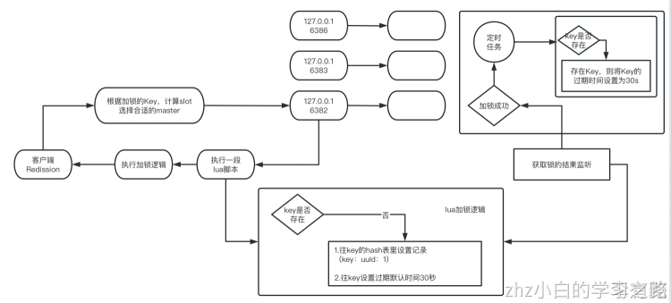

# 一、前言回顾


我们前一篇文章分析出来大概知道：如果客户端一直持有锁，没有释放，redis中的锁key是如何一直保持着存活不要过期的？无非就是靠的是后台每隔10秒的定时调度任务

并且如果持有锁的客户端宕机了，锁没有了定时调度任务更新生存周期，30秒过后自然就释放掉了

前篇文章入口：[06_redis分布式锁（三）：可重入锁源码剖析之watchdog维持加锁](06_redis分布式锁（三）：可重入锁源码剖析之watchdog维持加锁.md)
# 
# 二、可重入加锁

## 第一次来加锁
重新梳理，如果一开始这个锁是没有的，那么这段lua脚本会如何执行？
```java
"if (redis.call('exists', KEYS[1]) == 0) then " +
      "redis.call('hset', KEYS[1], ARGV[2], 1); " +
      "redis.call('pexpire', KEYS[1], ARGV[1]); " +
      "return nil; " +
"end; " +
```
如果一开始这个锁没有，那么就是第一次加锁，会进这个if then分支，hset设置一个hash的数据结构，pexpire设置这个key的生存时间，直接返回nil，也就是已给null，这个lua脚本后面的内容其实就不会执行了
```java
//hset设置一个hash的数据结构
//anyLock: 
//{ “8e6b27a7-5346-483a-b9b5-0957c690c27f:1”: 1 }
```
如果Future拿到了那个lua脚本执行成功后的返回值为null，就会触发一个监听器执行后门看门狗的逻辑

## 同线程重复加锁
如果是在一个客户端的一个线程内，先对一个lock进行了加锁，然后后面又加了一次锁，形成了一个叫做可重入锁的概念，就同一个线程对一个lock可以反复的重复加锁多次

再次进入加锁lua脚本，执行第一个IF判断时则就不为0了，因为此时这个anyLock这个key已经存在了
```java
"if (redis.call('exists', KEYS[1]) == 0) then " +
      "redis.call('hset', KEYS[1], ARGV[2], 1); " +
      "redis.call('pexpire', KEYS[1], ARGV[1]); " +
      "return nil; " +
"end; " +
```
此时则进入下一个IF的判断，判断anyLock对应的hash数据结构中，是否存在一个8e6b27a7-5346-483a-b9b5-0957c690c27f:1一个key
```java
"if (redis.call('hexists', KEYS[1], ARGV[2]) == 1) then " +
      "redis.call('hincrby', KEYS[1], ARGV[2], 1); " +
      "redis.call('pexpire', KEYS[1], ARGV[1]); " +
      "return nil; " +
"end; " +
```
此时肯定是存在的，说明这个客户端的这个线程，已经对这个锁加过一次锁了。此时就会将8e6b27a7-5346-483a-b9b5-0957c690c27f:1这个key对应的值（本来是1），累加1，变为2
```java
//hset设置一个hash的数据结构
//anyLock: 
//{“8e6b27a7-5346-483a-b9b5-0957c690c27f:1”: 2}
```
同时整个anyLock锁的生存周期pexpire anyLock 30000，重新刷新为30000毫秒，。返回值还是null，说明加锁成功
