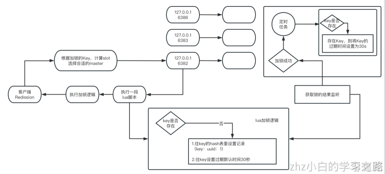

# 一、前言回顾

前一篇文章大概提到：如果是在一个客户端的一个线程内，先对一个lock进行了加锁，然后后面又加了一次锁，形成了一个叫做可重入锁的概念，就同一个线程对一个lock可以反复的重复加锁多次

同时在加锁的lua脚本中则，对这个hash的key值进行累加1，并且重新刷新为30000毫秒

前篇文章入口：[07_redis分布式锁（四）：可重入锁源码剖析之可重入加锁](07_redis分布式锁（四）：可重入锁源码剖析之可重入加锁.md)
# 二、其他的线程或者是其他客户端也加锁怎么搞？

如果已经有一个客户端的线程对一个key加了锁，那么此时其他的线程或者是客户端如果也要对这个key加锁，是如何被阻塞住的呢？（部署在其他机器上的服务实例，或者是部署在其他机器上的其他服务）


```java
 "if (redis.call('exists', KEYS[1]) == 0) then " +
      "redis.call('hset', KEYS[1], ARGV[2], 1); " +
      "redis.call('pexpire', KEYS[1], ARGV[1]); " +
      "return nil; " +
  "end; " +
  "if (redis.call('hexists', KEYS[1], ARGV[2]) == 1) then " +
      "redis.call('hincrby', KEYS[1], ARGV[2], 1); " +
      "redis.call('pexpire', KEYS[1], ARGV[1]); " +
      "return nil; " +
  "end; " +
  "return redis.call('pttl', KEYS[1]);"
```
如果说客户端A已经上锁了，还持有着这把锁，此时客户端B尝试加锁，此时就会直接执行pttl anyLock指令，返回这个key剩余的一个存活时间

回到我们之前的加锁lock方法

```java
public void lockInterruptibly(long leaseTime, TimeUnit unit) throws InterruptedException {
    long threadId = Thread.currentThread().getId();
    Long ttl = this.tryAcquire(leaseTime, unit, threadId);
    if (ttl != null) {
        RFuture<RedissonLockEntry> future = this.subscribe(threadId);
        this.commandExecutor.syncSubscription(future);
        try {
            while(true) {
                ttl = this.tryAcquire(leaseTime, unit, threadId);
                if (ttl == null) {
                    return;
                }

                if (ttl >= 0L) {
                    this.getEntry(threadId).getLatch().tryAcquire(ttl, TimeUnit.MILLISECONDS);
                } else {
                    this.getEntry(threadId).getLatch().acquire();
                }
            }
        } finally {
            this.unsubscribe(future, threadId);
        }
    }
}
```

而如果我们是第一次获取锁的时候就会获取结果Null，ttl一定是null；如果是一个线程多次加锁，可重入锁的概念，此时ttl也一定是null，lua脚本里返回的就是nil；但是如果加锁没成功，锁被其他机器占用了，你执行lua脚本直接获取到的是这个key对应的剩余时间

所以我们的lock 分析源码就会来到接下来的步骤
```java
if (ttl != null) {
    RFuture<RedissonLockEntry> future = this.subscribe(threadId);
    this.commandExecutor.syncSubscription(future);

    try {
        while(true) {
            ttl = this.tryAcquire(leaseTime, unit, threadId);
            if (ttl == null) {
                return;
            }

            if (ttl >= 0L) {
                this.getEntry(threadId).getLatch().tryAcquire(ttl, TimeUnit.MILLISECONDS);
            } else {
                this.getEntry(threadId).getLatch().acquire();
            }
        }
    } finally {
        this.unsubscribe(future, threadId);
    }
}
```
如果加锁不成功，直接会进入while(true)就是一个死循环内，在死循环内，再次执行这个ttl = tryAcquire(leaseTime, unit, threadId);，尝试去获取这个分布式的锁，如果获取到了锁，证明ttl是null，此时就会退出死循环，如果ttl大于等于0，说明其他的客户端还是占据着这把锁


看到这样的一个分布式锁的阻塞逻辑，如果一个客户端的其他线程，或者是其他客户端的线程，尝试获取一个已经被加锁的key的锁，就会在while(true)死循环里被无限制的阻塞住，无限制的等待，尝试获取这把锁

如果没有获取到一把分布式锁，可能就是等待那个ttl指定的时间，再次去尝试获取那把锁

