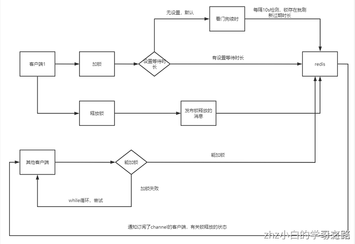

# 一、前言回顾

前面提到的都是加锁，这篇文章开始说的是解除锁， 还是按照之前的案例进行解锁分析，主要分为：手动释放锁，宕机自动释放锁

宕机自动释放锁，这个锁对应的就是redis里的一个key，如果这个机器宕机了，对这个key不断的刷新其生存周期的后台定时调度的任务就没了，redis里的key，自动就会在最多30秒内就过期删除，其他的客户端就可以成功加锁了

前篇文章入口：[08_redis分布式锁（五）：可重入锁源码剖析之锁的互斥阻塞](08_redis分布式锁（五）：可重入锁源码剖析之锁的互斥阻塞.md)
# 二、unlock方法分析
进入到手动释放锁的源码分析
```java
public void unlock() {
    try {
        this.get(this.unlockAsync(Thread.currentThread().getId()));
    } catch (RedisException var2) {
        if (var2.getCause() instanceof IllegalMonitorStateException) {
            throw (IllegalMonitorStateException)var2.getCause();
        } else {
            throw var2;
        }
    }
}
```
里面的那个unlockAsync()是异步化执行的一个方法，释放锁的操作是异步执行的，get(unlockAnsync())，get()包裹了之后就是会同步的等待异步执行的结果

```java
protected RFuture<Boolean> unlockInnerAsync(long threadId) {
    return this.commandExecutor.evalWriteAsync(
    		this.getName(), LongCodec.INSTANCE, RedisCommands.EVAL_BOOLEAN,
    		"if (redis.call('exists', KEYS[1]) == 0) then " +
                    "redis.call('publish', KEYS[2], ARGV[1]); " +
                    "return 1; " +
                "end;" +
                "if (redis.call('hexists', KEYS[1], ARGV[3]) == 0) then " +
                    "return nil;" +
                "end; " +
                "local counter = redis.call('hincrby', KEYS[1], ARGV[3], -1); " +
                "if (counter > 0) then " +
                    "redis.call('pexpire', KEYS[1], ARGV[2]); " +
                    "return 0; " +
                "else " +
                    "redis.call('del', KEYS[1]); " +
                    "redis.call('publish', KEYS[2], ARGV[1]); " +
                    "return 1; "+
                "end; " +
                "return nil;",
    		Arrays.asList(this.getName(), this.getChannelName()),
    			new Object[]{
                    		LockPubSub.unlockMessage,
                    		this.internalLockLeaseTime,
                    		this.getLockName(threadId)
                }
		);
}

public RFuture<Void> unlockAsync(final long threadId) {
    final RPromise<Void> result = new RedissonPromise();
    RFuture<Boolean> future = this.unlockInnerAsync(threadId);
    future.addListener(new FutureListener<Boolean>() {
        public void operationComplete(Future<Boolean> future) throws Exception {
            if (!future.isSuccess()) {
                RedissonLock.this.cancelExpirationRenewal(threadId);
                result.tryFailure(future.cause());
            } else {
                Boolean opStatus = (Boolean)future.getNow();
                if (opStatus == null) {
                    IllegalMonitorStateException cause = new IllegalMonitorStateException("attempt to unlock lock, not locked by current thread by node id: " + RedissonLock.this.id + " thread-id: " + threadId);
                    result.tryFailure(cause);
                } else {
                    if (opStatus) {
                        RedissonLock.this.cancelExpirationRenewal((Long)null);
                    }

                    result.trySuccess((Object)null);
                }
            }
        }
    });
    return result;
}
```
又看到了lua脚本，还是按照之前加锁的逻辑进行分析，我们大概可以根据源码进分析，先将我们的key1，key2，AVG数组弄清楚
```java
//key[1] = anyLock
//key[2] = redisson_lock__channel:{anyLock}

//AVG[1] = LockPubSub.unlockMessage = 0
//AVG[2] = this.internalLockLeaseTime = 30000
//AVG[3] = ff161e99-fd06-42f9-8bf0-1b34d803c1a7:1
```
接下来就进行lua脚本分析
```java
"if (redis.call('exists', KEYS[1]) == 0) then " +
    "redis.call('publish', KEYS[2], ARGV[1]); " +
    "return 1; " +
"end;" +
```
如果anyLock这个key不存在，则进行publish redisson_lock__channel_anyLock 0，意思是告诉其它订阅了这把锁的线程，我已经释放锁了，你们可以过来获取了；释放锁成功，返回1

因为redis是支持发布/订阅模型的，就是说可以对里面的某个channel key进行订阅，订阅他的消息，如果别人发布了消息在这个channel key里，别人就可以监听到
```java
"if (redis.call('hexists', KEYS[1], ARGV[3]) == 0) then " +
    "return nil;" +
"end"; 
```
hexists anyLock 26cebeaa-e3b0-4097-8192-d62d0d0214b8:1，也就是说判断一下当前这个锁key对应的hash数据结构中，判断锁是不是自己的，如果不是自己的锁，说明非法释放锁，返回nil，
```java
"local counter = redis.call('hincrby', KEYS[1], ARGV[3], -1); " +
    "if (counter > 0) then " +
        "redis.call('pexpire', KEYS[1], ARGV[2]); " +
        "return 0; " +
    "else " +
        "redis.call('del', KEYS[1]); " +
        "redis.call('publish', KEYS[2], ARGV[1]); " +
        "return 1; "+
    "end; " +
```
hincrby anyLock 26cebeaa-e3b0-4097-8192-d62d0d0214b8:1 如果是自己的锁，通过hincrby将锁的重入次数减1；判断减1后的数是否大于0，如果减1后的数大于0，说明还没有完全释放锁，则重置锁的过期时间，并返回0；

如果减1后的数已经等于0，说明已经完全释放锁，则通过del指令释放锁，并通过publish发布一条消息，告诉其它订阅了这把锁的线程，我已经释放锁了，你们可以过来获取了；释放锁成功，返回1

手动释放锁这块考虑的不仅仅是对 key 进行处理，因为可能存在重入锁，所以会先对 redis key 对应的 hash value 进行递减，相当于减去重入次数

# 三、取消watchdog任务

当线程完全释放锁后，就会调用cancelExpirationRenewal()方法取消"看门狗"的续时线程
```java
void cancelExpirationRenewal(Long threadId) {
    RedissonLock.ExpirationEntry task = (RedissonLock.ExpirationEntry)expirationRenewalMap.get(this.getEntryName());
    if (task != null && (threadId == null || task.getThreadId() == threadId)) {
        expirationRenewalMap.remove(this.getEntryName());
        task.getTimeout().cancel();
    }
}
```

之前我们提到看门狗这个定时任务会存储在一个ConcurrentHashMap对象expirationRenewalMap中，存储的key就为“线程ID:key名称”，所以我们解锁和取消的时候，还是引用这个Map取消掉




