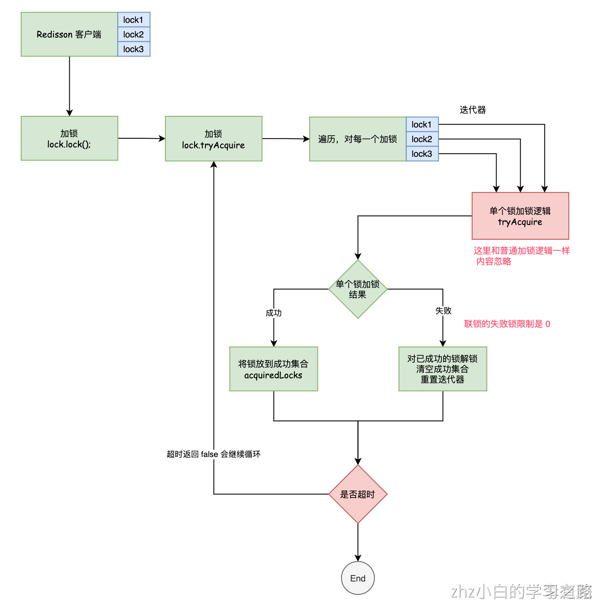

# 一、联锁（MultiLock）介绍

基于Redis的Redisson分布式联锁RedissonMultiLock对象可以将多个RLock对象关联为一个联锁，每个RLock对象实例可以来自于不同的Redisson实例。
```
RLock lock1 = redissonInstance1.getLock("lock1");
RLock lock2 = redissonInstance2.getLock("lock2");
RLock lock3 = redissonInstance3.getLock("lock3");

RedissonMultiLock lock = new RedissonMultiLock(lock1, lock2, lock3);
// 同时加锁：lock1 lock2 lock3
// 所有的锁都上锁成功才算成功。
lock.lock();
...
lock.unlock();
```
大家都知道，如果负责储存某些分布式锁的某些Redis节点宕机以后，而且这些锁正好处于锁住的状态时，这些锁会出现锁死的状态。为了避免这种情况的发生，

Redisson内部提供了一个监控锁的看门狗，它的作用是在Redisson实例被关闭前，不断的延长锁的有效期。默认情况下，看门狗的检查锁的超时时间是30秒钟，也可以通过修改Config.lockWatchdogTimeout来另行指定
另外Redisson还通过加锁的方法提供了leaseTime的参数来指定加锁的时间。超过这个时间后锁便自动解开了。
```
复制代码

RedissonMultiLock lock = new RedissonMultiLock(lock1, lock2, lock3);
// 给lock1，lock2，lock3加锁，如果没有手动解开的话，10秒钟后将会自动解开
lock.lock(10, TimeUnit.SECONDS);

// 为加锁等待100秒时间，并在加锁成功10秒钟后自动解开
boolean res = lock.tryLock(100, 10, TimeUnit.SECONDS);
...
lock.unlock();
```

# 二、加锁逻辑分析

```java

public class RedissonMultiLock implements Lock {


    //省略其他关键性代码.......
	final List<RLock> locks = new ArrayList();
    
    public void lock() {
        try {
            this.lockInterruptibly();
        } catch (InterruptedException var2) {
            Thread.currentThread().interrupt();
        }
    }

    public void lockInterruptibly() throws InterruptedException {
        this.lockInterruptibly(-1L, (TimeUnit)null);
    }

    public void lockInterruptibly(long leaseTime, TimeUnit unit) throws InterruptedException {
        long baseWaitTime = (long)(this.locks.size() * 1500);
        long waitTime = -1L;
        if (leaseTime == -1L) {
            waitTime = baseWaitTime;
            unit = TimeUnit.MILLISECONDS;
        } else {
            waitTime = unit.toMillis(leaseTime);
            if (waitTime <= 2000L) {
                waitTime = 2000L;
            } else if (waitTime <= baseWaitTime) {
                waitTime = ThreadLocalRandom.current().nextLong(waitTime / 2L, waitTime);
            } else {
                waitTime = ThreadLocalRandom.current().nextLong(baseWaitTime, waitTime);
            }
            waitTime = unit.convert(waitTime, TimeUnit.MILLISECONDS);
        }

        while(!this.tryLock(waitTime, leaseTime, unit)) {
        
        }
    }
}

```
### 参数说明

- 基础等待时间 baseWaitTime = 锁数量 * 1500，在这里就是 4500 毫秒；
- leaseTime == -1 所以 waitTime = baseWaitTime，也就是 4500；
- while (true) 调用 tryLock 加锁，直到成功

### 主要加锁逻辑代码
```java
public boolean tryLock(long waitTime, long leaseTime, TimeUnit unit) throws InterruptedException {
    long newLeaseTime = -1L;
    if (leaseTime != -1L) {
        newLeaseTime = unit.toMillis(waitTime) * 2L;
    }

    long time = System.currentTimeMillis();
    long remainTime = -1L;
    if (waitTime != -1L) {
        remainTime = unit.toMillis(waitTime);
    }

    long lockWaitTime = this.calcLockWaitTime(remainTime);
    int failedLocksLimit = this.failedLocksLimit();
    List<RLock> acquiredLocks = new ArrayList(this.locks.size());
    ListIterator iterator = this.locks.listIterator();

    while(iterator.hasNext()) {
        RLock lock = (RLock)iterator.next();

        boolean lockAcquired;
        try {
            if (waitTime == -1L && leaseTime == -1L) {
                lockAcquired = lock.tryLock();
            } else {
                long awaitTime = Math.min(lockWaitTime, remainTime);
                lockAcquired = lock.tryLock(awaitTime, newLeaseTime, TimeUnit.MILLISECONDS);
            }
        } catch (Exception var21) {
            lockAcquired = false;
        }

        if (lockAcquired) {
            acquiredLocks.add(lock);
        } else {
            if (this.locks.size() - acquiredLocks.size() == this.failedLocksLimit()) {
                break;
            }

            if (failedLocksLimit == 0) {
                this.unlockInner(acquiredLocks);
                if (waitTime == -1L && leaseTime == -1L) {
                    return false;
                }

                failedLocksLimit = this.failedLocksLimit();
                acquiredLocks.clear();

                while(iterator.hasPrevious()) {
                    iterator.previous();
                }
            } else {
                --failedLocksLimit;
            }
        }

        if (remainTime != -1L) {
            remainTime -= System.currentTimeMillis() - time;
            time = System.currentTimeMillis();
            if (remainTime <= 0L) {
                this.unlockInner(acquiredLocks);
                return false;
            }
        }
    }

    if (leaseTime != -1L) {
        List<RFuture<Boolean>> futures = new ArrayList(acquiredLocks.size());
        Iterator var23 = acquiredLocks.iterator();

        while(var23.hasNext()) {
            RLock rLock = (RLock)var23.next();
            RFuture<Boolean> future = rLock.expireAsync(unit.toMillis(leaseTime), TimeUnit.MILLISECONDS);
            futures.add(future);
        }

        var23 = futures.iterator();

        while(var23.hasNext()) {
            RFuture<Boolean> rFuture = (RFuture)var23.next();
            rFuture.syncUninterruptibly();
        }
    }

    return true;
}
```

### 重点：遍历所有的锁，依次加锁
```java
ListIterator iterator = this.locks.listIterator();
while(iterator.hasNext()) {
    RLock lock = (RLock)iterator.next();
    boolean lockAcquired;
    try {
        if (waitTime == -1L && leaseTime == -1L) {
            lockAcquired = lock.tryLock();
        } else {
            long awaitTime = Math.min(lockWaitTime, remainTime);
            lockAcquired = lock.tryLock(awaitTime, newLeaseTime, TimeUnit.MILLISECONDS);
        }
    } catch (Exception var21) {
        lockAcquired = false;
    }

    if (lockAcquired) {
        acquiredLocks.add(lock);
    } else {
        
        if (this.locks.size() - acquiredLocks.size() == this.failedLocksLimit()) {
            break;
        }

        if (failedLocksLimit == 0) {
            this.unlockInner(acquiredLocks);
            if (waitTime == -1L && leaseTime == -1L) {
                return false;
            }

            failedLocksLimit = this.failedLocksLimit();
            acquiredLocks.clear();

            while(iterator.hasPrevious()) {
                iterator.previous();
            }
        } else {
            --failedLocksLimit;
        }
    }

    if (remainTime != -1L) {
        remainTime -= System.currentTimeMillis() - time;
        time = System.currentTimeMillis();
        if (remainTime <= 0L) {
            this.unlockInner(acquiredLocks);
            return false;
        }
    }
}
```
lock是底层的RedissonLock，加锁逻辑就和可重入锁加锁并无区别了。所以 Lua 脚本就不进行分析了。他没有使用lock.lock()，用的是tryLock()，指定了获取锁等待超时的时间，4500毫秒必须获取到这个锁，如果获取不到这个锁，就退出标记为获取锁失败

哪怕是获取到锁之后，这个锁在多长时间内会自动释放，因为你的newLeaseTime是-1，所以说如果获取到了锁，会启动一个lock watchdog不断的刷新你的锁key的生存时间为30000毫秒

加锁成功，则将成功的锁放进 acquiredLocks 集合中；加锁失败，需要判断 failedLocksLimit，因为这里是 0所以会直接对成功加锁集合 acquiredLocks 中的所有锁执行锁释放，同时清空成功集合，恢复迭代器

### 加锁失败释放锁逻辑代码
```java
protected void unlockInner(Collection<RLock> locks) {
    List<RFuture<Void>> futures = new ArrayList(locks.size());
    Iterator var3 = locks.iterator();

    while(var3.hasNext()) {
        RLock lock = (RLock)var3.next();
        futures.add(lock.unlockAsync());
    }

    var3 = futures.iterator();

    while(var3.hasNext()) {
        RFuture<Void> unlockFuture = (RFuture)var3.next();
        unlockFuture.awaitUninterruptibly();
    }

}
```
### 
### 

### 解析remainTime负数逻辑判断原因
经过了一个lock的获取，可能会消耗掉了比如说20毫秒，100毫秒，500毫秒，耗费了500毫秒，而我们的remainTime = 4500毫秒 - 500毫秒 = 4000毫秒，time = 当前时间

如果remainTime <= 0，意味着什么呢？获取锁的时间已经超过了4500毫秒了，迄今为止，你获取到这些所的时间，已经超过了预设的4500毫秒了，相当于是你获取多个锁的时间，最多不能超过4500毫秒

如果一旦获取各个锁的时间超过了4500毫秒，此时就会释放掉所有已经获取的锁，然后返回一个false，再次进入while true中的一个死循环，尝试走上述一模一样的流程

获取了三把锁，耗时了1000毫秒，此时remainTime还剩下3500毫秒，可以计算得到获取锁花费了多少秒

# 三、释放锁逻辑分析

## 释放锁住要源码
```java
public void unlock() {
    List<RFuture<Void>> futures = new ArrayList(this.locks.size());
    Iterator var2 = this.locks.iterator();

    while(var2.hasNext()) {
        RLock lock = (RLock)var2.next();
        futures.add(lock.unlockAsync());
    }

    var2 = futures.iterator();

    while(var2.hasNext()) {
        RFuture<Void> future = (RFuture)var2.next();
        future.syncUninterruptibly();
    }
}
```
释放锁的话，就是依次调用所有的锁的释放的逻辑，lua脚本，同步等待所有的锁释放完毕，才会返回

默认的行为之下，你包裹了几把锁，就会锁数量 * 1500毫秒，获取所有的锁必须在多长时间之内就要结束，如果超时就会重新再次死循环尝试获取锁。使用的是各个锁的tryLock()方法，指定了说在获取每个单独的锁的时候，会有一个获取超时退出的时间

## 小结

总体而言，就是将 key1、key2、key3 …… keyN 放到一个 List 集合中，然后迭代循环加锁，直到所有的都成功。解锁的时候就是再遍历锁进行释放锁
