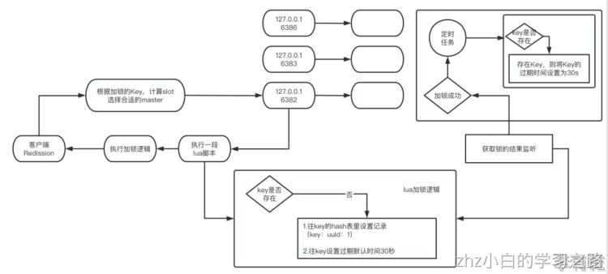
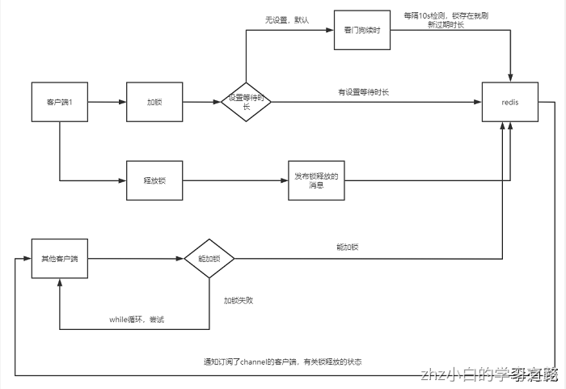
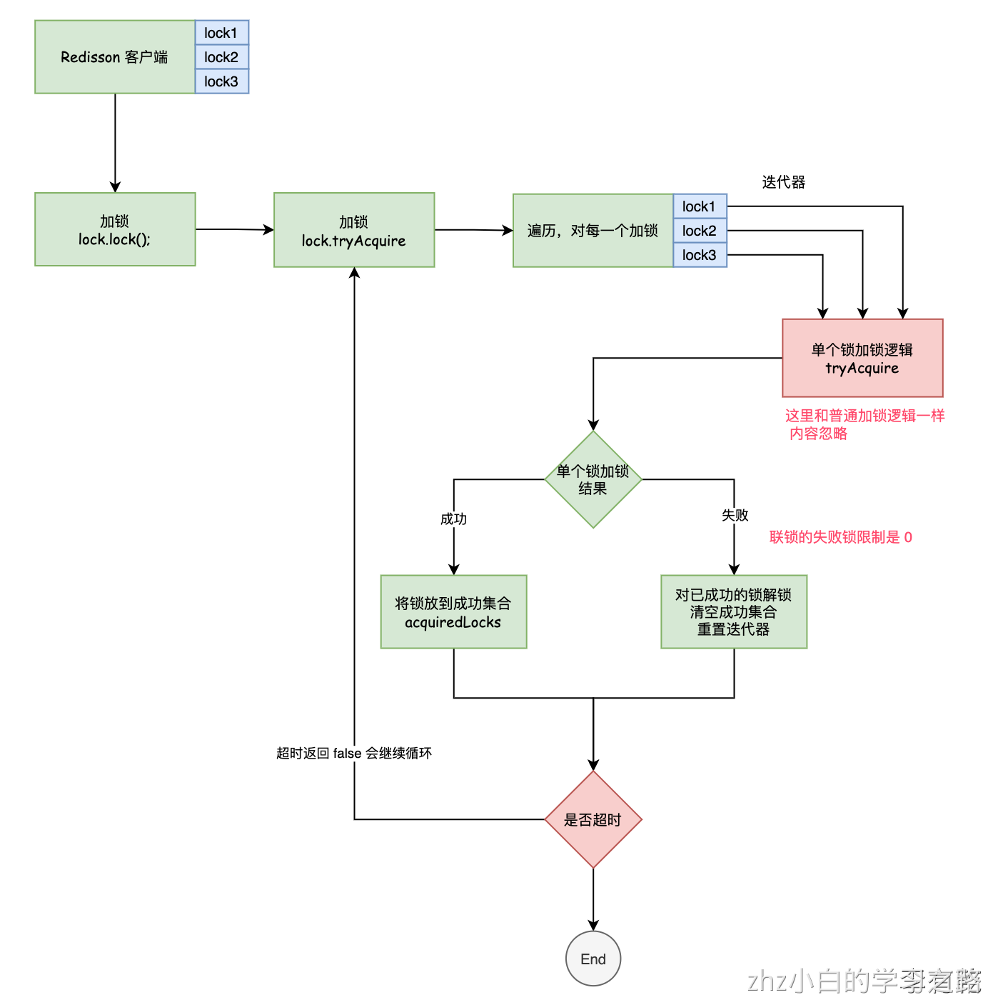

# 一、redis开源客户端框架redisson

## 基本介绍

Redisson是在redis基础上实现的一套开源解决方案，不仅提供了一系列的分布式的java常用对象，还提供了许多分布式服务，宗旨是促进使用者对redis的关注分离，更多的关注业务逻辑的处理上

Redisson采用了基于NIO的Netty框架，不仅能作为Redis底层驱动客户端，具备提供对Redis各种组态形式的连接功能，对Redis命令能以同步发送、异步形式发送、异步流形式发送或管道形式发送的功能，LUA脚本执行处理，以及处理返回结果的功能

还在此基础上融入了更高级的应用方案，不但将原生的RedisHash，List，Set，String，Geo，HyperLogLog等数据结构封装为Java里大家最熟悉的映射（Map），列表（List），集（Set），通用对象桶（Object Bucket），地理空间对象桶（Geospatial Bucket），基数估计算法（HyperLogLog）等结构

在这基础上还提供了分布式的多值映射（Multimap），本地缓存映射（LocalCachedMap），有序集（SortedSet），计分排序集（ScoredSortedSet），字典排序集（LexSortedSet），列队（Queue），阻塞队列（Blocking Queue），有界阻塞列队（Bounded Blocking Queue），双端队列（Deque），阻塞双端列队（Blocking Deque），阻塞公平列队（Blocking Fair Queue），延迟列队（Delayed Queue），布隆过滤器（Bloom Filter），原子整长形（AtomicLong），原子双精度浮点数（AtomicDouble），BitSet等Redis原本没有的分布式数据结构

不仅如此，Redisson还实现了Redis文档中提到像分布式锁Lock这样的更高阶应用场景。事实上Redisson并没有不止步于此，在分布式锁的基础上还提供了联锁（MultiLock），读写锁（ReadWriteLock），公平锁（Fair Lock），红锁（RedLock），信号量（Semaphore），可过期性信号量（PermitExpirableSemaphore）和闭锁（CountDownLatch）这些实际当中对多线程高并发应用至关重要的基本部件

## 看门狗介绍

分布式系统里面，如果多个机器上的服务要同时对一个共享资源（比如说修改数据库里的一份数据），此时的话，某台机器就需要先获取一个针对那个资源（数据库里的某一行数据）的分布式锁

获取到了分布式锁之后，就可以任由你查询那条数据，修改那条数据，在这个期间，没有任何其他的客户端可以来修改这条数据，获取了一个分布式锁之后，就对某个共享的数据获取了一定时间范围内的独享的操作

其他的客户端如果同时要修改那条数据，尝试去获取分布式锁，就会被卡住，他需要等待第一个客户端先操作完了之后释放锁

而在redisson在客户端里实现了一个看门狗，watchdog，主要是监控持有一把锁的客户端是否还存活着，如果还存活着，那么看门狗会不断的延长这个锁的过期时间

可以指定一个leaseTime，你获取了一把锁之后，可能你在锁定的期间，执行的操作特别的耗时，可能长达10分钟，1个小时。你就可以在获取锁的时候指定一个leaseTime，比如说，指定好，如果我自己1分钟之内没释放这把锁，redisson自动释放这把锁，让别的客户端可以获取锁来做一些操作

# 二、redis分布式锁（一）：可重入锁（Reentrant Lock）

## 基本介绍

基于Redis的Redisson分布式可重入锁RLock，Java对象实现了java.util.concurrent.locks.Lock接口。同时还提供了异步（Async）、反射式（Reactive）和RxJava2标准的接口，常见使用案例如下：
```java
RLock lock = redisson.getLock("anyLock");
// 最常见的使用方法
lock.lock();
```
Redisson同时还为分布式锁提供了异步执行的相关方法：
```java
RLock lock = redisson.getLock("anyLock");
lock.lockAsync();
lock.lockAsync(10, TimeUnit.SECONDS);
Future<Boolean> res = lock.tryLockAsync(100, 10, TimeUnit.SECONDS);
```
RLock对象完全符合Java的Lock规范。也就是说只有拥有锁的进程才能解锁，其他进程解锁则会抛出IllegalMonitorStateException错误。但是如果遇到需要其他进程也能解锁的情况，则需要使用分布式信号量Semaphore 对象

## 加锁逻辑和Lua分析
## 
### 主要加锁Lua脚本
```java
<T> RFuture<T> tryLockInnerAsync(long leaseTime, TimeUnit unit, long threadId, RedisStrictCommand<T> command) {
    this.internalLockLeaseTime = unit.toMillis(leaseTime);
    return this.commandExecutor.evalWriteAsync(
        this.getName(), LongCodec.INSTANCE, command,
        "if (redis.call('exists', KEYS[1]) == 0) then " +
        	"redis.call('hset', KEYS[1], ARGV[2], 1); " +
        	"redis.call('pexpire', KEYS[1], ARGV[1]); " +
        	"return nil; " +
        "end; " +
        "if (redis.call('hexists', KEYS[1], ARGV[2]) == 1) then " +
        	"redis.call('hincrby', KEYS[1], ARGV[2], 1); " +
        	"redis.call('pexpire', KEYS[1], ARGV[1]); " +
        	"return nil; " +
        "end; " +
        "return redis.call('pttl', KEYS[1]);"
        Collections.singletonList(this.getName()),
        new Object[]{this.internalLockLeaseTime, this.getLockName(threadId)});
}
```

### 根据锁key计算出 slot，找到执行Lua脚本的节点

需要先找到当前锁key需要存放到哪个slot，即在集群中哪个节点进行操作，后续不同客户端或不同线程再使用这个锁key进行上锁，也需要到对应的节点的slot中进行加锁操作
```java
@Override
public <T, R> RFuture<R> evalWriteAsync(String key, Codec codec, RedisCommand<T> evalCommandType, String script, List<Object> keys, Object... params) {
    // 根据锁key找到对应的redis节点
    NodeSource source = getNodeSource(key);
    return evalAsync(source, false, codec, evalCommandType, script, keys, params);
}

private NodeSource getNodeSource(String key) {
    // 计算锁key对应的slot
    int slot = connectionManager.calcSlot(key);
    return new NodeSource(slot);
}

public int calcSlot(String key) {
    if (key == null) {
        return 0;
    }

    int start = key.indexOf('{');
    if (start != -1) {
        int end = key.indexOf('}');
        key = key.substring(start+1, end);
    }
    // 使用 CRC16 算法来计算 slot，其中 MAX_SLOT 就是 16384，redis集群规定最多有 16384 个slot。
    int result = CRC16.crc16(key.getBytes()) % MAX_SLOT;
    log.debug("slot {} for {}", result, key);
    return result;
}
```

### watchdog看门狗监听延长锁

一个定时任务task，也就是10秒左右，当成功加锁之后开启定时调度的任务，初次执行是在10秒以后，这个定时任务会存储在一个ConcurrentHashMap对象expirationRenewalMap中，如果发现expirationRenewalMap中不存在对应当前线程key的话，定时任务就不会跑，这也是后面解锁中的一步重要操作
```java
private void scheduleExpirationRenewal(final long threadId) {
    if (!expirationRenewalMap.containsKey(this.getEntryName())) {
        
        Timeout task = 
            this.commandExecutor.getConnectionManager()
            	.newTimeout(new TimerTask() {
                    
                    public void run(Timeout timeout) throws Exception {
                        RFuture<Boolean> future = 
                        		RedissonLock.this.renewExpirationAsync(threadId);
                        
                        future.addListener(new FutureListener<Boolean>() {
                            public void operationComplete(Future<Boolean> future) throws Exception {
                                RedissonLock.expirationRenewalMap.remove(RedissonLock.this.getEntryName());
                                if (!future.isSuccess()) {
                                    RedissonLock.log.error("Can't update lock " + RedissonLock.this.getName() + " expiration", future.cause());
                                } else {
                                    if ((Boolean)future.getNow()) {
                                        RedissonLock.this.scheduleExpirationRenewal(threadId);
                                    }
        
                                }
                            }
                        });
                    }
        }, this.internalLockLeaseTime / 3L, TimeUnit.MILLISECONDS);
        
        if (expirationRenewalMap.putIfAbsent(this.getEntryName(), new RedissonLock.ExpirationEntry(threadId, task)) != null) {
            task.cancel();
        }
    }
}

//RFuture<Boolean> future = renewExpirationAsync(threadId);
protected RFuture<Boolean> renewExpirationAsync(long threadId) {
    return this.commandExecutor.evalWriteAsync(
    		this.getName(), LongCodec.INSTANCE, 
    			RedisCommands.EVAL_BOOLEAN,
                "if (redis.call('hexists', KEYS[1], ARGV[2]) == 1) then " +
                "redis.call('pexpire', KEYS[1], ARGV[1]); " +
                "return 1; " +
            	"end; " +
            	"return 0;"
	)   
}
```
### 加锁小结
lua脚本可以保证复杂判断和复杂操作的原子性，加锁主要步骤如下：

1. 处理加锁Lua脚本
2. 根据Key计算出slot，找到执行Lua脚本的节点
3. 若是没有传入过期时间，默认启用看门狗续命持有锁


## 释放锁逻辑和Lua分析

### 主要释放锁Lua脚本
```java
protected RFuture<Boolean> unlockInnerAsync(long threadId) {
    return this.commandExecutor.evalWriteAsync(
    		this.getName(), LongCodec.INSTANCE, RedisCommands.EVAL_BOOLEAN,
    		"if (redis.call('exists', KEYS[1]) == 0) then " +
                    "redis.call('publish', KEYS[2], ARGV[1]); " +
                    "return 1; " +
            "end;" +
            "if (redis.call('hexists', KEYS[1], ARGV[3]) == 0) then " +
                "return nil;" +
            "end; " +
            "local counter = redis.call('hincrby', KEYS[1], ARGV[3], -1); " +
            "if (counter > 0) then " +
                "redis.call('pexpire', KEYS[1], ARGV[2]); " +
                "return 0; " +
            "else " +
                "redis.call('del', KEYS[1]); " +
                "redis.call('publish', KEYS[2], ARGV[1]); " +
                "return 1; "+
            "end; " +
            "return nil;",
    		Arrays.asList(this.getName(), this.getChannelName()),
    			new Object[]{
                    		LockPubSub.unlockMessage,
                    		this.internalLockLeaseTime,
                    		this.getLockName(threadId)
                }
		);
}
```

### 释放锁取消看门狗逻辑

当线程完全释放锁后，就会调用cancelExpirationRenewal()方法取消"看门狗"的续时线程，引用expirationRenewalMap中进行取消
```java
void cancelExpirationRenewal(Long threadId) {
    RedissonLock.ExpirationEntry task = (RedissonLock.ExpirationEntry)expirationRenewalMap.get(this.getEntryName());
    if (task != null && (threadId == null || task.getThreadId() == threadId)) {
        expirationRenewalMap.remove(this.getEntryName());
        task.getTimeout().cancel();
    }
}
```


### 释放锁小结
还是基于 lua 脚本来完成的，lua脚本可以保证复杂判断和复杂操作的原子性，解锁主要步骤如下：

1. 处理解锁Lua脚本
2. 根据Key计算出slot，找到执行Lua脚本的节点
3. 解锁成功，取消看门狗任务

## 可重入锁的特征总结
加锁，释放锁，以及lock的方式进行枷锁，tryLock的方式进行加锁，可以接下来做一个总结：
（1）加锁：在redis里设置hash数据结构，生存周期是30000毫秒
（2）维持加锁：代码里一直加锁，redis里的key会一直保持存活，后台每隔10秒的定时任务（watchdog）不断的检查，只要客户端还在加锁，就刷新key的生存周期为30000毫秒
（3）可重入锁：同一个线程可以多次加锁，就是在hash数据结构中将加锁次数累加1
（4）锁互斥：不同客户端，或者不同线程，尝试加锁陷入死循环等待
（5）手动释放锁：可重入锁自动递减加锁次数，全部释放锁之后删除锁key
（6）宕机自动释放锁：如果持有锁的客户端宕机了，那么此时后台的watchdog定时调度任务也没了，不会刷新锁key的生存周期，此时redis里的锁key会自动释放
（7）尝试加锁超时：在指定时间内没有成功加锁就自动退出死循环，标识本次尝试加锁失败
（8）超时锁自动释放：获取锁之后，在一定时间内没有手动释放锁，则redis里的key自动过期，自动释放锁

## 结合可重入锁来进行说明常见分布式锁隐患问题

redis加锁，本质还是在redis集群中挑选一个master实例来加锁，master -> slave，实现了高可用的机制，如果master宕机，slave会自动切换为master

假设客户端刚刚在master写入一个锁，此时发生了master的宕机，但是master还没来得及将那个锁key异步同步到slave，slave就切换成了新的master。此时别的客户端在新的master上也尝试获取同一个锁，会成功获取锁

此时两个客户端，都会获取同一把分布式锁，可能有的时候就会导致一些数据的问题，redisson的分布式锁，隐患主要就是在这里

# 三、redis分布式锁（二）：公平锁（Fair Lock）
## 
## 基本介绍

基于Redis的Redisson分布式可重入公平锁也是实现了java.util.concurrent.locks.Lock接口的一种RLock对象。同时还提供了[异步（Async）](http://static.javadoc.io/org.redisson/redisson/3.10.0/org/redisson/api/RLockAsync.html)、反射式（Reactive）和RxJava2标准的接口。它保证了当多个Redisson客户端线程同时请求加锁时，优先分配给先发出请求的线程。所有请求线程会在一个队列中排队，当某个线程出现宕机时，Redisson会等待5秒后继续下一个线程，也就是说如果前面有5个线程都处于等待状态，那么后面的线程会等待至少25秒

通过公平锁，可以保证说，客户端获取锁的顺序，就跟他们请求获取锁的顺序是一样的，公平锁排队，谁先申请获取这把锁，谁就可以先获取到这把锁，这个是按照顺序来的，不是胡乱的争抢的。可重入非公平锁、公平锁，他们在整体的技术实现上都是一样的，只不过唯一不同的一点就是在于加锁的逻辑那里

非公平锁加锁是比计较简单粗暴，争抢；公平锁，在加锁的逻辑里，要加入这个排队的机制，保证说各个客户端排队，按照顺序获取锁，不是胡乱争抢的
```java
RLock fairLock = redisson.getFairLock("fairLock");
// 最常见的使用方法
fairLock.lock();
```

## 加锁逻辑和Lua分析
```java
<T> RFuture<T> tryLockInnerAsync(long leaseTime, TimeUnit unit, long threadId, RedisStrictCommand<T> command) {
	this.internalLockLeaseTime = unit.toMillis(leaseTime);
	long currentTime = System.currentTimeMillis();
    // 根据不同的命令类型执行不同的LUA脚本
	// EVAL_LONG，重点关注这个
    if (command == RedisCommands.EVAL_LONG) {
        return evalWriteAsync(getRawName(), LongCodec.INSTANCE, command,
            /**
             * 第一部分: 死循环的作用主要是用于清理过期的等待线程，主要避免下面场景，避免无效客户端占用等待队列资源
             * 1、获取锁失败，然后进入等待队列，但是网络出现问题，那么后续很有可能就不能继续正常获取锁了。
             * 2、获取锁失败，然后进入等待队列，但是之后客户端所在服务器宕机了。
             */
            // 开启死循环
            "while true do " +
                "local firstThreadId2 = redis.call('lindex', KEYS[2], 0);" +
                "if firstThreadId2 == false then " +
                    "break;" +
                "end;" +
                "local timeout = tonumber(redis.call('zscore', KEYS[3], firstThreadId2));" +
                "if timeout <= tonumber(ARGV[4]) then " +
                    // a、通过zrem指令从redisson_lock_timeout:{fairLock}超时集合中删除第一个等待线程ID对应的元素
                    "redis.call('zrem', KEYS[3], firstThreadId2);" +
                    // b、通过lpop指令从redisson_lock_queue:{fairLock}等待队列中移除第一个等待线程ID对应的元素
                    "redis.call('lpop', KEYS[2]);" +
                "else " +
                    // 如果超时时间戳 大于 当前时间，说明还没超时，则直接跳出循环
                    "break;" +
                "end;" +
            "end;" +
            /**
             * 第二部分: 检查是否可以获取锁
             * 满足下面两个条件之一可以获取锁：
             *  1、当前锁不存在（锁未被获取） and 等待队列不存在
             *  2、当前锁不存在（锁未被获取） and 等待队列存在 and 等待队列中的第一个等待线程就是当前客户端当前线程
             */
            "if (redis.call('exists', KEYS[1]) == 0) " +
                "and ((redis.call('exists', KEYS[2]) == 0) " +
                    "or (redis.call('lindex', KEYS[2], 0) == ARGV[2])) then " +

                "redis.call('lpop', KEYS[2]);" +
                "redis.call('zrem', KEYS[3], ARGV[2]);" +
                "redis.call('hset', KEYS[1], ARGV[2], 1);" +
                // 默认超时时间：30秒
                "redis.call('pexpire', KEYS[1], ARGV[1]);" +
                // 返回nil，表示获取锁成功，如果执行到这里，就return结束了，不会执行下面的第三、四、五部分
                "return nil;" +
            "end;" +

            /**
             * 第三部分: 检查锁是否已经被持有，公平锁重入
             */
            "if redis.call('hexists', KEYS[1], ARGV[2]) == 1 then " +
                "redis.call('hincrby', KEYS[1], ARGV[2], 1);" +
                "redis.call('pexpire', KEYS[1], ARGV[1]);" +
                "return nil;" +
            "end;" +

            /**
             * 第四部分: 检查线程是否已经在等待队列中，如果当前线程本就在等待队列中，返回等待时间
             */
            "local timeout = redis.call('zscore', KEYS[3], ARGV[2]);" +
            "if timeout ~= false then " +
                "return timeout - tonumber(ARGV[3]) - tonumber(ARGV[4]);" +
            "end;" +

            /**
             * 第五部分: 将线程添加到队列末尾，并在timeout set中设置其超时时间为队列中前一个线程的超时时间（如果队列为空则为锁的超时时间）加上threadWaitTime
             */
            // 获取等待队列redisson_lock_queue:{fairLock}最后一个元素，即等待队列中最后一个等待的线程
            "local lastThreadId = redis.call('lindex', KEYS[2], -1);" +
            "local ttl;" +
            "if lastThreadId ~= false and lastThreadId ~= ARGV[2] then " +
                "ttl = tonumber(redis.call('zscore', KEYS[3], lastThreadId)) - tonumber(ARGV[4]);" +
            "else " +
                "ttl = redis.call('pttl', KEYS[1]);" +
            "end;" +
            "local timeout = ttl + tonumber(ARGV[3]) + tonumber(ARGV[4]);" +
            "if redis.call('zadd', KEYS[3], timeout, ARGV[2]) == 1 then " +
                "redis.call('rpush', KEYS[2], ARGV[2]);" +
            "end;" +
            // 返回ttl
            "return ttl;",
            Arrays.asList(getRawName(), threadsQueueName, timeoutSetName),
            unit.toMillis(leaseTime), getLockName(threadId), wait, currentTime);
    }
    throw new IllegalArgumentException();
}
```
### Lua脚本第一部分：删除过期的等待线程
死循环的作用主要用于清理过期的等待线程，主要避免下面场景，避免无效客户端占用等待队列资源

1. 获取锁失败，然后进入等待队列，但是网络出现问题，那么后续很有可能就不能继续正常获取锁了
2. 获取锁失败，然后进入等待队列，但是之后客户端所在服务器宕机了

### Lua脚本第二部分：检查是否可以获取锁
满足下面两个条件之一可以获取锁：

-  当前锁不存在（锁未被获取） and 等待队列不存在
-  当前锁不存在（锁未被获取） and 等待队列存在 and 等待队列中的第一个等待线程就是当前客户端当前线程

### Lua脚本第三部分：检查锁是否已经被持有，公平锁重入
通过hexists指令判断当前持有锁的线程是不是自己，如果是自己的锁，则执行重入，增加加锁次数，并且刷新锁的过期时间

### Lua脚本第四部分：检查线程是否已经在等待队列中
检查线程是否已经在等待队列中，如果当前线程本就在等待队列中，返回等待时间

### Lua脚本第五部分: 将线程添加到队列末尾
将线程添加到队列末尾，并在timeout set中设置其超时时间为队列中前一个线程的超时时间（如果队列为空则为锁的超时时间）加上threadWaitTime

## 释放锁逻辑和Lua分析
```java
protected RFuture<Boolean> unlockInnerAsync(long threadId) {
    return this.commandExecutor.evalWriteAsync(
        this.getName(), LongCodec.INSTANCE, RedisCommands.EVAL_BOOLEAN,
           /**
             * 第一部分：开启死循环，移除超时的那些线程
             */
            "while true do "+
                // 获取等待队列中第一个等待的线程
                 "local firstThreadId2 = redis.call('lindex', KEYS[2], 0);" + 
                 "if firstThreadId2 == false then " + 
                     "break;"+ 
                 "end; "+ 
                 "local timeout = tonumber(redis.call('zscore', KEYS[3], firstThreadId2));"+ 
                 "if timeout <= tonumber(ARGV[4]) then "+ 
                     "redis.call('zrem', KEYS[3], firstThreadId2); "+ 
                     "redis.call('lpop', KEYS[2]); "+ 
                 "else "+ 
                    "break;"+ 
                 "end; "+ 
            "end;"+ 
    
            /**
             * 第二部分：锁已经被释放，通知等待队列中第一个线程
             * 场景：
             * 1、成功获取锁线程重复调用释放锁的方法，第二次释放时，锁已不存在，就去通知等待队列中的第一个元素
             * 2、又或者一个极端场景：当前线程未能成功获取锁，但是调用了释放锁的方法，并且刚好此时锁被释放
            */
            "if (redis.call('exists', KEYS[1]) == 0) then " +
                "local nextThreadId = redis.call('lindex', KEYS[2], 0); " + 
                "if nextThreadId ~= false then " +
                    "redis.call('publish', KEYS[4] .. ':' .. nextThreadId, ARGV[1]); " +
                "end; " +
                "return 1; " +
            "end;" +
    
        	/**
             * 第三部分: 释放锁
             */
            // 判断当前释放的锁是不是自己的，如果不是自己的，直接返回nil
            "if (redis.call('hexists', KEYS[1], ARGV[3]) == 0) then " +
                "return nil;" +
            "end; " +
            // 通过hincrby更新hash表中锁的重入次数减一
            "local counter = redis.call('hincrby', KEYS[1], ARGV[3], -1); " +
            "if (counter > 0) then " +
                "redis.call('pexpire', KEYS[1], ARGV[2]); " +
                "return 0; " +
            "end; " +
            "redis.call('del', KEYS[1]); " +
            "local nextThreadId = redis.call('lindex', KEYS[2], 0); " + 
            "if nextThreadId ~= false then " +
                "redis.call('publish', KEYS[4] .. ':' .. nextThreadId, ARGV[1]); " +
            "end; " +
            "return 1; ",
        Arrays.asList(getRawName(), threadsQueueName, timeoutSetName, getChannelName()),
        LockPubSub.UNLOCK_MESSAGE, internalLockLeaseTime, getLockName(threadId), System.currentTimeMillis());
}
```
### Lua脚本第一部分：开启死循环，移除超时的那些线程
这一段跟公平锁加锁的第一部分一致，都是开启一个死循环，然后移除等待队列中超时的线程

#### 主要流程

1. 开启死循环；
2. 利用 lindex 命令判断等待队列中第一个元素是否存在，如果存在，直接跳出循环。核心代码：lidex redisson_lock_queue:{myLock} 0
3. 如果等待队列中第一个元素不为空（例如返回了LockName，即客户端UUID拼接线程ID），利用 zscore 在 超时记录集合(sorted set) 中获取对应的超时时间；核心代码：zscore redisson_lock_timeout:{myLock} UUID:threadId
4. 如果超时时间已经小于当前时间，那么首先从超时集合中移除该节点，接着也在等待队列中弹出第一个节点；
- 核心代码：zrem redisson_lock_timeout:{myLock} UUID:threadId
- 核心代码：lpop redisson_lock_queue:{myLock}
5. 如果等待队列中的第一个元素还未超时，直接退出死循环

### Lua脚本第二部分：锁已经被释放，通知等待队列中第一个线程

- 成功获取锁线程重复调用释放锁的方法，第二次释放时，锁已不存在，就去通知等待队列中的第一个元素
- 又或者一个极端场景：当前线程未能成功获取锁，但是调用了释放锁的方法，并且刚好此时锁被释放

#### 主要流程

1. 利用 exists 命令判断锁是否存在；核心代码：exists myLock
2. 如果锁不存在，利用 lindex 获取等待队列中的第一个元素；核心代码：lindex redisson_lock_queue:{myLock} 0
3. 如果等待列表中第一个元素不为空，即还存在等待线程，往等待线程的订阅channel发送消息，通知其可以尝试获取锁了；核心代码：publish redisson_lock__channel:{myLock}:UUID:threadId 0

注意，RedissonLock 所有等待线程都是订阅锁的同一个channel：redisson_lock__channel:{myLock}，当有线程释放锁的时候，会往这个通道发送消息，此时所有等待现成都可以订阅消费这条消息，从而从等待状态中释放出来，重新尝试获取锁。

而 RedissonFairLock 不太一样，因为它要支持公平获取锁，即先到先得。所以每个等待线程订阅的都是不同的channel：redisson_lock__channel:{myLock}:UUID:threadId。当某个线程释放锁的时候，只会往等待队列中第一个线程对应订阅的channel发送消息

### Lua脚本第二部分：释放锁，通知等待队列中第一个线程

### 主要流程

1. 利用 hexists 命令判断加锁记录集合中，是否存在当前客户端当前线程，如果加锁记录不存在当前线程，返回nil；hexists myLock UUID:threadId，主要是兼容当前线程未能成功获取锁，但是调用了释放锁的方法
2. 利用 hincrby 扣减当前线程的加锁次数；核心代码：hincrby myLock UUID:threadId -1
3. 如果扣减后次数还是大于0，证明是重复获取锁，所以此时只需要重新刷新锁的过期时间，然后返回0；核心代码：expire myLock 30000
4. 如果扣减后次数还是等于0，证明当前线程持有锁，并且只加锁一次，则利用 del 命令删除锁对应 redis key；核心代码：del myLock
5. 往等待线程的订阅channel发送消息，通知等待队列中第一个线程可以尝试获取锁了；
   1. 利用 lindex 获取等待队列中的第一个线程，核心代码：lindex redisson_lock_queue:{myLock} 0
   2. 利用订阅channel给等待线程发送通知，核心代码：publish redisson_lock__channel:{myLock}:UUID:threadId 0
6. 跟RedissonLock一致，释放锁之后，还需要执行取消看门狗定时任务等逻辑


# 四、redis分布式锁（三）：联锁（MultiLock）

## 基本介绍

基于Redis的Redisson分布式联锁RedissonMultiLock对象可以将多个RLock对象关联为一个联锁，每个RLock对象实例可以来自于不同的Redisson实例
```java
RLock lock1 = redissonInstance1.getLock("lock1");
RLock lock2 = redissonInstance2.getLock("lock2");
RLock lock3 = redissonInstance3.getLock("lock3");

RedissonMultiLock lock = new RedissonMultiLock(lock1, lock2, lock3);
// 同时加锁：lock1 lock2 lock3
// 所有的锁都上锁成功才算成功。
lock.lock();
...
lock.unlock();
```
### 
## 加锁逻辑分析

### 重点：遍历所有的锁，依次加锁
```java
ListIterator iterator = this.locks.listIterator();
while(iterator.hasNext()) {
    RLock lock = (RLock)iterator.next();
    boolean lockAcquired;
    try {
        if (waitTime == -1L && leaseTime == -1L) {
            lockAcquired = lock.tryLock();
        } else {
            long awaitTime = Math.min(lockWaitTime, remainTime);
            lockAcquired = lock.tryLock(awaitTime, newLeaseTime, TimeUnit.MILLISECONDS);
        }
    } catch (Exception var21) {
        lockAcquired = false;
    }

    if (lockAcquired) {
        acquiredLocks.add(lock);
    } else {
        
        if (this.locks.size() - acquiredLocks.size() == this.failedLocksLimit()) {
            break;
        }

        if (failedLocksLimit == 0) {
            this.unlockInner(acquiredLocks);
            if (waitTime == -1L && leaseTime == -1L) {
                return false;
            }

            failedLocksLimit = this.failedLocksLimit();
            acquiredLocks.clear();

            while(iterator.hasPrevious()) {
                iterator.previous();
            }
        } else {
            --failedLocksLimit;
        }
    }

    if (remainTime != -1L) {
        remainTime -= System.currentTimeMillis() - time;
        time = System.currentTimeMillis();
        if (remainTime <= 0L) {
            this.unlockInner(acquiredLocks);
            return false;
        }
    }
}
```
lock是底层的RedissonLock，加锁逻辑就和可重入锁加锁并无区别了。所以 Lua 脚本就不进行分析了。他没有使用lock.lock()，用的是tryLock()，指定了获取锁等待超时的时间，4500毫秒必须获取到这个锁，如果获取不到这个锁，就退出标记为获取锁失败

哪怕是获取到锁之后，这个锁在多长时间内会自动释放，因为你的newLeaseTime是-1，所以说如果获取到了锁，会启动一个lock watchdog不断的刷新你的锁key的生存时间为30000毫秒。加锁成功，则将成功的锁放进 acquiredLocks 集合中；加锁失败，需要判断 failedLocksLimit，因为这里是 0所以会直接对成功加锁集合 acquiredLocks 中的所有锁执行锁释放，同时清空成功集合，恢复迭代器



### 加锁失败释放锁逻辑代码
```java
protected void unlockInner(Collection<RLock> locks) {
    List<RFuture<Void>> futures = new ArrayList(locks.size());
    Iterator var3 = locks.iterator();

    while(var3.hasNext()) {
        RLock lock = (RLock)var3.next();
        futures.add(lock.unlockAsync());
    }

    var3 = futures.iterator();

    while(var3.hasNext()) {
        RFuture<Void> unlockFuture = (RFuture)var3.next();
        unlockFuture.awaitUninterruptibly();
    }

}
```
### 
### 解析remainTime负数逻辑判断原因
经过了一个lock的获取，可能会消耗掉了比如说20毫秒，100毫秒，500毫秒，耗费了500毫秒，而我们的remainTime = 4500毫秒 - 500毫秒 = 4000毫秒，time = 当前时间

如果remainTime <= 0，意味着什么呢？获取锁的时间已经超过了4500毫秒了，迄今为止，你获取到这些所的时间，已经超过了预设的4500毫秒了，相当于是你获取多个锁的时间，最多不能超过4500毫秒

如果一旦获取各个锁的时间超过了4500毫秒，此时就会释放掉所有已经获取的锁，然后返回一个false，再次进入while true中的一个死循环，尝试走上述一模一样的流程。获取了三把锁，耗时了1000毫秒，此时remainTime还剩下3500毫秒，可以计算得到获取锁花费了多少秒

## 释放锁主要逻辑分析
```java
public void unlock() {
    List<RFuture<Void>> futures = new ArrayList(this.locks.size());
    Iterator var2 = this.locks.iterator();

    while(var2.hasNext()) {
        RLock lock = (RLock)var2.next();
        futures.add(lock.unlockAsync());
    }

    var2 = futures.iterator();

    while(var2.hasNext()) {
        RFuture<Void> future = (RFuture)var2.next();
        future.syncUninterruptibly();
    }
}
```
释放锁的话，就是依次调用所有的锁的释放的逻辑，lua脚本，同步等待所有的锁释放完毕，才会返回

默认的行为之下，你包裹了几把锁，就会锁数量 * 1500毫秒，获取所有的锁必须在多长时间之内就要结束，如果超时就会重新再次死循环尝试获取锁。使用的是各个锁的tryLock()方法，指定了说在获取每个单独的锁的时候，会有一个获取超时退出的时间


总体而言，就是将 key1、key2、key3 …… keyN 放到一个 List 集合中，然后迭代循环加锁，直到所有的都成功。解锁的时候就是再遍历锁进行释放锁

# 五、redis分布式锁（四）：红锁（RedLock）

## 基本介绍

RedLock是基于redis实现的分布式锁，它能够保证以下特性：
互斥性：在任何时候，只能有一个客户端能够持有锁；
避免死锁：当客户端拿到锁后，即使发生了网络分区或者客户端宕机，也不会发生死锁；（利用key的存活时间）
容错性：只要多数节点的redis实例正常运行，就能够对外提供服务，加锁或者释放锁；而非redLock是无法满足互斥性的

## RedLock算法
RedLock实现主要是RedLock算法，就是说假设有N个redis的master节点，这些节点是相互独立的（不需要主从或者其他协调的系统）。N推荐为奇数

客户端执行以下步骤获取一把锁：

- 获取当前时间戳，以毫秒为单位
- 使用相同的lockName和lockValue，尝试从N个节点获取锁

（在获取锁时，要求等待获取锁的时间远小于锁的释放时间，如锁的lease_time为10s，那么wait_time应该为5-50毫秒；避免因为redis实例挂掉，客户端需要等待更长的时间才能返回，即需要让客户端能够fast_fail；如果一个redis实例不可用，那么需要继续从下个redis实例获取锁）

- 当从N个节点获取锁结束后，如果客户端能够从多数节点(N/2 + 1)中成功获取锁，比如5个节点就要求是3个节点（n / 2 +1）。且获取锁的时间小于失效时间，那么可认为，客户端成功获得了锁。（获取锁的时间=当前时间戳 - 步骤1的时间戳）
- 客户端成功获得锁后，那么锁的实际有效时间 = 设置锁的有效时间 - 获取锁的时间
- 客户端获取锁失败后，N个节点的redis实例都会释放锁，即使未能加锁成功
```java
RLock lock1 = redissonInstance1.getLock("lock1");
RLock lock2 = redissonInstance2.getLock("lock2");
RLock lock3 = redissonInstance3.getLock("lock3");
RedissonRedLock lock = new RedissonRedLock(lock1, lock2, lock3);
// 同时加锁：lock1 lock2 lock3
// 红锁在大部分节点上加锁成功就算成功。
lock.lock();
...
lock.unlock();
```

## 主要加锁逻辑分析
```java
public class RedissonRedLock extends RedissonMultiLock {
    
    public RedissonRedLock(RLock... locks) {
        super(locks);
    }

    protected int failedLocksLimit() {
        return this.locks.size() - this.minLocksAmount(this.locks);
    }

    protected int minLocksAmount(List<RLock> locks) {
        return locks.size() / 2 + 1;
    }

    protected long calcLockWaitTime(long remainTime) {
        return Math.max(remainTime / (long)this.locks.size(), 1L);
    }

    public void unlock() {
        this.unlockInner(this.locks);
    }
}
```
可以看到RedissonRedLock 完全是 RedissonMultiLock 的子类！只不过是重写 failedLocksLimit 方法。在 MultiLock 中，要所有的锁都锁成功才可以。在 RedLock 中，要一半以上的锁成功

## 重写代码逻辑分析
```java
//比如你有3个lock，那么至少要成功加上3 / 2 + 1 = 2个lock
minLocksAmount(locks)里面就是用的大多数节点的一个算法，n / 2 + 1

//就是failedLocksLimit，默认是0，就是一个锁都不能容忍加失败了
//现在最新的是n - (n / 2 + 1)，3个lock，最多可以容忍1个lock加锁失败
failedLocksLimit，locks.size() - minLocksAmount(locks) = 1

//这个东西算出来的时间，是说在对每个lock进行加锁的时候，有一个尝试获取锁超时的时间
//原来默认的就是remainTime，4500毫秒，4500毫秒 / 3 = 1500毫秒
//每个小lock获取锁超时的时间改成了1500毫秒
alcLockWaitTime

//对每个小lock尝试加锁的时候，能够容忍的最大超时时间，就是1500毫秒，1500毫秒之内必须加成功这个小锁，否则就是加锁失败
waitTime = 1500
```

之前讲解的MultiLock的话，只要你有任何一个锁加锁失败，此次加这个MultiLock就会标记为失败，再重来一次

但是现在的话呢，使用的是RedLock，faildLocksLimit（3个小lock的时候，这个值是1），可以容忍一个锁加锁失败的，此时就会将failedLockLimit--，从1变为了0，也就是说之前可以容忍一次lock加锁失败，若是继续失败，则不能再容忍加锁失败了

也就是说针对多个lock进行加锁，每个lock都有一个1500毫秒的加锁超时时间，如果在4500毫秒内，成功的对n / 2 + 1个lock加锁成功了，就可以认为这个RedLock加锁成功了，不要求所有的lock都加锁成功的

### 小结

RedLock是一个锁，只不过是在各个不同的master实例上进行加锁，但是现在说RedLock合并了多个小lock。也就是说，如果你有3个redis master实例，你就用lock1、lock2、lock3三个锁key，人家本来就是分布在3个不同的redis master实例上的

加这个RedLock，相当于是3个redis master实例上的key，有2个加成功了，就算这个RedLock加锁成功了
此时别人如果要来加锁，用一样的key，人家是无法成功加锁的，锁被你占用了，人家就会卡在那儿，死循环，不断的尝试加锁，直到你释放锁å

红锁其实也并不能解决根本问题，只是降低问题发生的概率。完全相互独立的redis，每一台至少也要保证高可用，还是会有主从节点。既然有主从节点，在持续的高并发下，master还是可能会宕机，从节点可能还没来得及同步锁的数据。很有可能多个主节点也发生这样的情况，那么问题还是回到一开始的问题，红锁只是降低了发生的概率

# 六、redis分布式锁（五）：读写锁（ReadWriteLock）

## 基础介绍
基于Redis的Redisson分布式可重入读写锁RReadWriteLock Java对象实现了java.util.concurrent.locks.ReadWriteLock接口。其中读锁和写锁都继承了RLock接口。分布式可重入读写锁允许同时有多个读锁和一个写锁处于加锁状态
```java
RReadWriteLock rwlock = redisson.getReadWriteLock("anyRWLock");
// 最常见的使用方法
rwlock.readLock().lock();
// 或
rwlock.writeLock().lock();
```

当多个客户端同时加读锁，是不会互斥的，多个客户端可以同时加这个读锁，读锁和读锁是不互斥的。如果有人加了读锁，此时就不能加写锁，任何人都不能加写锁了，读锁和写锁是互斥的，如果有人加了写锁，此时任何人都不能加写锁了，写锁和写锁也是互斥的
## 读锁主要加锁逻辑

加锁源码基本和之前的可重入锁加锁无区别，唯一的差异就是在 Lua 脚本
```java
@Override
<T> RFuture<T> tryLockInnerAsync(long leaseTime, TimeUnit unit, long threadId, RedisStrictCommand<T> command) {
    internalLockLeaseTime = unit.toMillis(leaseTime);
    	return commandExecutor.evalWriteAsync(getName(), LongCodec.INSTANCE, command,
            "local mode = redis.call('hget', KEYS[1], 'mode'); " +
            "if (mode == false) then " +
              "redis.call('hset', KEYS[1], 'mode', 'read'); " +
              "redis.call('hset', KEYS[1], ARGV[2], 1); " +
              "redis.call('set', KEYS[2] .. ':1', 1); " +
              "redis.call('pexpire', KEYS[2] .. ':1', ARGV[1]); " +
              "redis.call('pexpire', KEYS[1], ARGV[1]); " +
              "return nil; " +
            "end; " +
            "if (mode == 'read') or (mode == 'write' and redis.call('hexists', KEYS[1], ARGV[3]) == 1) then " +
				"local ind = redis.call('hincrby', KEYS[1], ARGV[2], 1); " +      
              	"local key = KEYS[2] .. ':' .. ind;" +
              	"redis.call('set', key, 1); " +
              	"redis.call('pexpire', key, ARGV[1]); " +
              	"redis.call('pexpire', KEYS[1], ARGV[1]); " +
              	"return nil; " +
            "end;" +
            "return redis.call('pttl', KEYS[1]);",
        Arrays.<Object>asList(getName(), getReadWriteTimeoutNamePrefix(threadId)), 
        internalLockLeaseTime, getLockName(threadId), getWriteLockName(threadId));
}
```
## 首次加锁处理分析
通过hget获取锁，当锁不存在，继续执行下面的逻辑：

1. hset设置锁 anyRWLock 的 hash里kv值，key = mode ，value = read，表示这是个读锁
2. hset设置锁 anyRWLock 的 hash里kv值，key = e70b1307-9ddd-43de-ac9d-9c42b5c99a0d:1，value= 1
3. set设置锁，key字符串： {anyRWLock}:e70b1307-9ddd-43de-ac9d-9c42b5c99a0d:1:rwlock_timeout:1 ，value =  1
4. pexpire设置两个 RedisKey 的过期时间

同时不要忘了，我们还有一个watchdog看门狗，会每隔10秒钟去执行一段lua脚本，判断一下当前这个线程是否还持有着这个锁，如果还持有锁，更新一下锁key的生存时间为30000毫秒，保持redis的锁key和java代码中持有的锁是保持同步的
