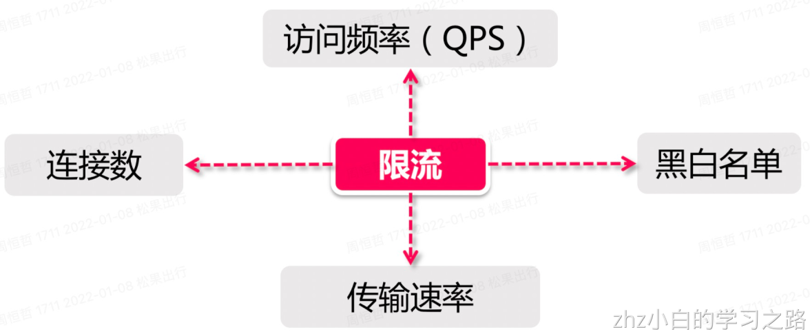
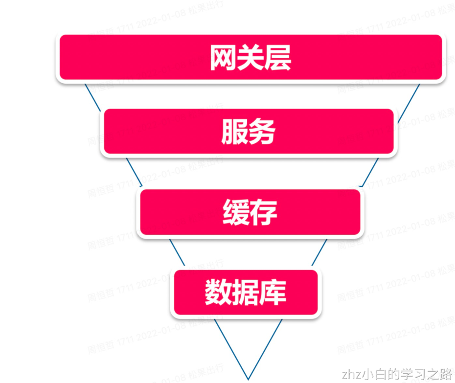
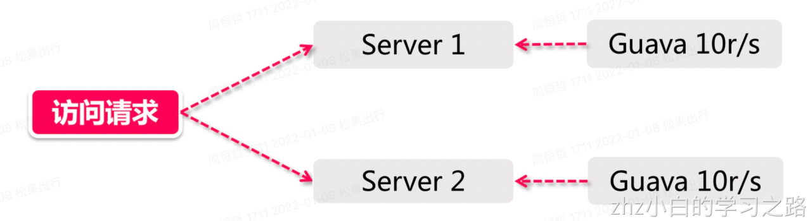
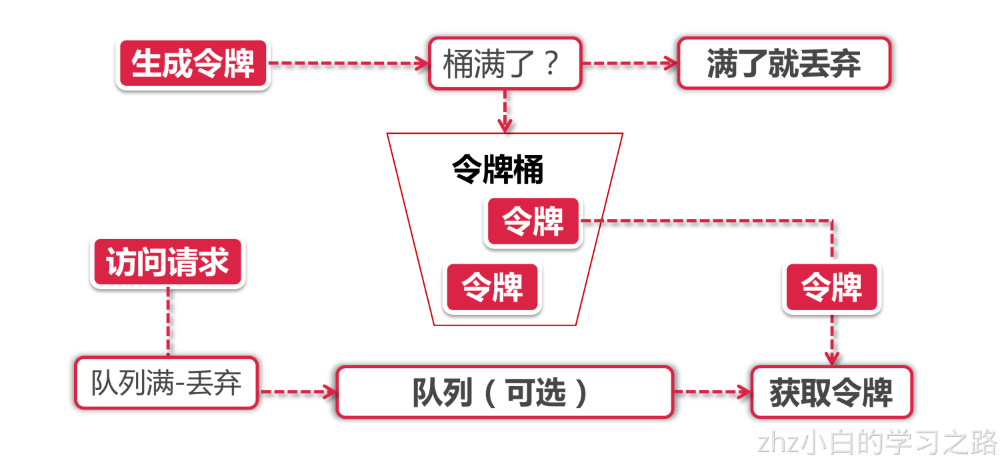
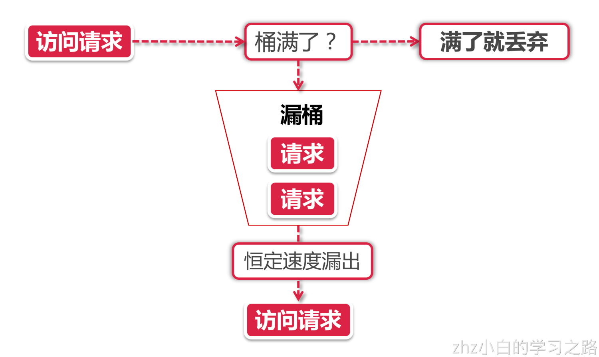
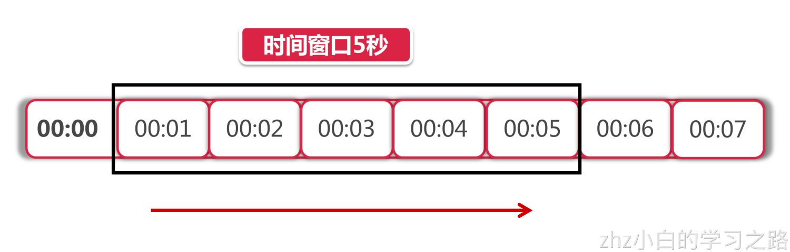

# 1、什么是限流？

- 比如我们春节抢票，你会发现我们有时候要输入验证码，为什么呢？原因就是在春节抢票的那个时间点，流量是很大的，qps非常高，可能几十万，甚至几百万都有可能，这个流量过来我们的系统，那我们的系统可能会崩，这个时候，为了防止这种情况，所以我们要限流，而这种限流手段就是分布式限流。

# 2、分布式限流有几种维度呢？

- **时间** 限流基于某段时间范围或者某个时间点，也就是我们常说的“时间窗口”，比如对每分钟、每秒钟的时间窗口做限定
- **资源** 基于可用资源的限制，比如设定最大访问次数，或最高可用连接数

上面两个维度结合起来看，限流就是在某个时间窗口对资源访问做限制，比如设定每秒最多100个访问请求。但在真正的场景里，我们不止设置一种限流规则，而是会设置多个限流规则共同作用，主要的几种限流规则如下：



- QPS和连接数控制

上图中的连接数和QPS(query per second)限流来说，我们可以设定IP维度的限流，也可以设置基于单个服务器的限流。在真实环境中通常会设置多个维度的限流规则，比如设定同一个IP每秒访问频率小于10，连接数小于5，再设定每台机器QPS最高1000，连接数最大保持200。更进一步，我们可以把某个服务器组或整个机房的服务器当做一个整体，设置更high-level的限流规则，这些所有限流规则都会共同作用于流量控制。

- 传输速率（百度网盘下载速度）

对于“传输速率”大家都不会陌生，比如资源的下载速度。有的网站在这方面的限流逻辑做的更细致，比如普通注册用户下载速度为100k/s，购买会员后是10M/s，这背后就是基于用户组或者用户标签的限流逻辑。

- 黑白名单

如果某个IP在一段时间的访问次数过于频繁，被系统识别为机器人用户或流量攻击，那么这个IP就会被加入到黑名单，从而限制其对系统资源的访问，这就是我们俗称的“封IP”。
白名单可以自由穿梭在各种限流规则里，畅行无阻。

# 3、分布式主流限流方案

- **网关层限流** 将限流规则应用在所有流量的入口处



- 上面是一个最普通的流量模型，从上到下的路径依次是：
    1. 用户流量从网关层转发到后台服务
    2. 后台服务承接流量，调用缓存获取数据
    3. 缓存中无数据，则访问数据库

为什么说它是一个漏斗模型，因为流量自上而下是逐层递减的，在网关层聚集了最多最密集的用户访问请求，其次是后台服务。然后经过后台服务的验证逻辑之后，刷掉了一部分错误请求，剩下的请求落在缓存上，如果缓存中没有数据才会请求漏斗最下方的数据库，因此数据库层面请求数量最小（相比较其他组件来说数据库往往是并发量能力最差的一环，阿里系的MySQL即便经过了大量改造，单机并发量也无法和Redis、Kafka之类的组件相比）

- **中间件限流** 将限流信息存储在分布式环境中某个中间件里（比如Redis缓存），每个组件都可以从这里获取到当前时刻的流量统计，从而决定是拒绝服务还是放行流量
    - Guava
        - 目前我有2台服务器[Server 1，Server 2]，这两台服务器都部署了一个登陆服务，假如我希望对这两台机器的流量进行控制，比如将两台机器的访问量总和控制在每秒20以内，如果用Guava来做，只能独立控制每台机器的访问量<=10。



- mq限流
- lua+redis限流

# 4、究其本质，限流算法底层

## 4.1、令牌桶算法

Token Bucket令牌桶算法，它有以下两个关键角色：

1. **令牌** 获取到令牌的Request才会被处理，其他Requests要么排队要么被直接丢弃
2. **桶** 用来装令牌的地方，所有Request都从这个桶里面获取令牌

了解了这两个角色之后，让我们来看一下令牌桶算法的图示：

下面我们分别从令牌生成和令牌获取两个流程来解读令牌桶算法：

### 4.1.1、令牌生成

这个流程涉及到令牌生成器和令牌桶，前面我们提到过令牌桶是一个装令牌的地方，既然是个桶那么必然有一个容量，也就是说令牌桶所能容纳的令牌数量是一个固定的数值。
对于令牌生成器来说，它会根据一个预定的速率向桶中添加令牌，比如我们可以配置让它以每秒100个请求的速率发放令牌，或者每分钟50个。注意这里的发放速度是匀速，也就是说这50个令牌并非是在每个时间窗口刚开始的时候一次性发放，而是会在这个时间窗口内匀速发放。
在令牌发放器就是一个水龙头，假如在下面接水的桶子满了，那么自然这个水（令牌）就流到了外面。在令牌发放过程中也一样，令牌桶的容量是有限的，如果当前已经放满了额定容量的令牌，那么新来的令牌就会被丢弃掉。

### 4.1.2、令牌获取

每个访问请求到来后，必须获取到一个令牌才能执行后面的逻辑。假如令牌的数量少，而访问请求较多的情况下，一部分请求自然无法获取到令牌，那么这个时候我们可以设置一个“缓冲队列”来暂存这些多余的令牌。
缓冲队列其实是一个可选的选项，并不是所有应用了令牌桶算法的程序都会实现队列。当有缓存队列存在的情况下，那些暂时没有获取到令牌的请求将被放到这个队列中排队，直到新的令牌产生后，再从队列头部拿出一个请求来匹配令牌。
当队列已满的情况下，这部分访问请求将被丢弃。在实际应用中我们还可以给这个队列加一系列的特效，比如设置队列中请求的存活时间，或者将队列改造为PriorityQueue，根据某种优先级排序，而不是先进先出。算法是死的，人是活的，先进的生产力来自于不断的创造，在技术领域尤其如此。

## 4.2、漏桶算法

Leaky Bucket。瞧见没，又是个桶，限流算法是跟桶杠上了，那么漏桶和令牌桶有什么不同呢？我们来看图说话：

漏桶算法的前半段和令牌桶类似，但是操作的对象不同，令牌桶是将令牌放入桶里，而漏桶是将访问请求的数据包放到桶里。同样的是，如果桶满了，那么后面新来的数据包将被丢弃。
漏桶算法的后半程是有鲜明特色的，它永远只会以一个恒定的速率将数据包从桶内流出。打个比方，如果我设置了漏桶可以存放100个数据包，然后流出速度是1s一个，那么不管数据包以什么速率流入桶里，也不管桶里有多少数据包，漏桶能保证这些数据包永远以1s一个的恒定速度被处理。

### 4.2.1、漏桶 vs 令牌桶的区别

根据它们各自的特点不难看出来，这两种算法都有一个“恒定”的速率和“不定”的速率。令牌桶是以恒定速率创建令牌，但是访问请求获取令牌的速率“不定”，反正有多少令牌发多少，令牌没了就干等。而漏桶是以“恒定”的速率处理请求，但是这些请求流入桶的速率是“不定”的。
从这两个特点来说，漏桶的天然特性决定了它不会发生突发流量，就算每秒1000个请求到来，那么它对后台服务输出的访问速率永远恒定。而令牌桶则不同，其特性可以“预存”一定量的令牌，因此在应对突发流量的时候可以在短时间消耗所有令牌，其突发流量处理效率会比漏桶高，但是导向后台系统的压力也会相应增多。

## 4.4、滑动窗口

Rolling Window，穿上你的滑板鞋，跟我一起摇摆。

上图中黑色的大框就是时间窗口，我们设定窗口时间为5秒，它会随着时间推移向后滑动。我们将窗口内的时间划分为五个小格子，每个格子代表1秒钟，同时这个格子还包含一个计数器，用来计算在当前时间内访问的请求数量。那么这个时间窗口内的总访问量就是所有格子计数器累加后的数值。
比如说，我们在每一秒内有5个用户访问，第5秒内有10个用户访问，那么在0到5秒这个时间窗口内访问量就是15。如果我们的接口设置了时间窗口内访问上限是20，那么当时间到第六秒的时候，这个时间窗口内的计数总和就变成了10，因为1秒的格子已经退出了时间窗口，因此在第六秒内可以接收的访问量就是20-10=10个。
滑动窗口其实也是一种计算器算法，它有一个显著特点，当时间窗口的跨度越长时，限流效果就越平滑。打个比方，如果当前时间窗口只有两秒，而访问请求全部集中在第一秒的时候，当时间向后滑动一秒后，当前窗口的计数量将发生较大的变化，拉长时间窗口可以降低这种情况的发生概率

# 5、实现

## 5.1、单体

### 5.1.1、guava的RateLimiter客户端限流

代码实现：
pom

```xml
		<dependency>
            <groupId>org.springframework.boot</groupId>
            <artifactId>spring-boot-starter-web</artifactId>
        </dependency>

        <dependency>
            <groupId>com.google.guava</groupId>
            <artifactId>guava</artifactId>
            <version>18.0</version>
        </dependency>
        <dependency>
            <groupId>org.projectlombok</groupId>
            <artifactId>lombok</artifactId>
        </dependency>
```

application.yml

```java
spring:
  application:
    name: rate-limiter
server:
  port: 10086
```

日志打印（可不要）

```java
<?xml version="1.0" encoding="UTF-8" ?>
<configuration>
    <appender name="consoleLog" class="ch.qos.logback.core.ConsoleAppender">
        <filter class="ch.qos.logback.classic.filter.ThresholdFilter">
            <level>INFO</level>
        </filter>
        <layout class="ch.qos.logback.classic.PatternLayout">
            <pattern>
                [%d{HH:mm:ss.SSS}] %-5level %logger{15} - %msg%n
            </pattern>
        </layout>
    </appender>

    <appender name="fileLog" class="ch.qos.logback.core.rolling.RollingFileAppender">
        <encoder>
            <pattern>
                [%d{HH:mm:ss.SSS}] %-5level [%thread]%logger{15} - %msg%n
            </pattern>
        </encoder>
        <rollingPolicy class="ch.qos.logback.core.rolling.TimeBasedRollingPolicy">
            <fileNamePattern>logs/%d.log</fileNamePattern>
            <maxHistory>30</maxHistory>
        </rollingPolicy>
    </appender>
    <root level="DEBUG">
        <appender-ref ref = "consoleLog"/>
        <appender-ref ref = "fileLog"/>
    </root>
</configuration>
```

代码测试：

```java
package com.zhz.ratelimiter.controller;

import com.google.common.util.concurrent.RateLimiter;
import lombok.extern.slf4j.Slf4j;
import org.springframework.web.bind.annotation.GetMapping;
import org.springframework.web.bind.annotation.RestController;

import java.util.concurrent.TimeUnit;

/**
 * @author zhouhengzhe
 * @description:
 * @date 2022/1/6 上午2:17
 * @since v1
 */
@RestController
@Slf4j
public class RateLimiterController {

    //每秒2个
    RateLimiter limiter = RateLimiter.create(2.0);

    //非阻塞限流
    @GetMapping("/tryAcquire")
    public String tryAcquire(Integer count) {
        if (limiter.tryAcquire(count)) {
            log.info("success,rate is {}", limiter.getRate());
            return "success";
        } else {
            log.info("fail,rate is {}", limiter.getRate());
            return "fail";
        }
    }

    //限定时间的非阻塞限流
    @GetMapping("/tryAcquireWithTimeout")
    public String tryAcquireWithTimeout(Integer count, Integer timeout) {
        if (limiter.tryAcquire(count, timeout, TimeUnit.SECONDS)) {
            log.info("success,rate is {}", limiter.getRate());
            return "success";
        } else {
            log.info("fail,rate is {}", limiter.getRate());
            return "fail";
        }
    }

    //同步阻塞限流
    @GetMapping("/acquire")
    public String acquire(Integer count) {
        limiter.acquire(count);
        log.info("success,rate is {}", limiter.getRate());
        return "success";
    }
}

```

启动类

```java
package com.zhz.ratelimiter;

import org.springframework.boot.SpringApplication;
import org.springframework.boot.WebApplicationType;
import org.springframework.boot.autoconfigure.SpringBootApplication;
import org.springframework.boot.builder.SpringApplicationBuilder;

/**
 * @author mac
 */
@SpringBootApplication
public class RateLimiterApplication {

    public static void main(String[] args) {
        //第一种方式
//        SpringApplication.run(RateLimiterApplication.class, args);
        //第二种方式
        new SpringApplicationBuilder(RateLimiterApplication.class)
                .web(WebApplicationType.SERVLET)
                .run(args);
    }
}
```

## 5.2、分布式

### 5.2.1、Nginx 限流

测试方法

```java
 /**
     * nginx专用
     * 1、修改host文件 （127.0.0.1   www.testnginx.com）
     * 2、修改nginx->讲上面的域名，添加到路由规则中
     *      配置文件地址：/usr/local/nginx/conf/nginx.conf
     * 3、添加配置项（具体可看resource文件地址）
     *
     **/
    @GetMapping("/nginx")
    public String nginx(){
        log.info("Nginx success");
        return "success";
    }
```

1、修改Host文件( mac/Linux中  vim /etc/hosts)

```java
127.0.0.1   www.testnginx.com
```

2、修改nginx->讲上面的域名，添加到路由规则中

```shell
server {
	server_name www.testnginx.com
	location /access-limit/ {
		proxy_pass http://127.0.0.1:10086/;#127.0.0.1可以换成具体ip
	}
}
```

3、基于_IP限流配置_

```shell
# 根据IP地址限制速度
# 1） 第一个参数 $binary_remote_addr
#    binary_目的是缩写内存占用，remote_addr表示通过IP地址来限流
# 2） 第二个参数 zone=iplimit:20m
#    iplimit是一块内存区域（记录访问频率信息），20m是指这块内存区域的大小
# 3） 第三个参数 rate=1r/s
#    比如100r/m，标识访问的限流频率
limit_req_zone $binary_remote_addr zone=iplimit:20m rate=1r/s;
    server {
        server_name www.testnginx.com
        location /access-limit/ {
            proxy_pass http://127.0.0.1:10086/;

            # 基于IP地址的限制
            # 1） 第一个参数zone=iplimit => 引用limit_req_zone中的zone变量
            # 2） 第二个参数burst=2，设置一个大小为2的缓冲区域，当大量请求到来。
            #     请求数量超过限流频率时，将其放入缓冲区域
            # 3) 第三个参数nodelay=> 缓冲区满了以后，直接返回503异常
            limit_req zone=iplimit burst=2 nodelay;
        }
    }
```

4、基于_服务器级别做限流_

```powershell
# 根据服务器级别做限流
limit_req_zone $server_name zone=serverlimit:10m rate=100r/s;

    server {
        server_name www.testnginx.com
        location /access-limit/ {
            proxy_pass http://127.0.0.1:10086/;

            # 基于服务器级别的限制
            # 通常情况下，server级别的限流速率是最大的
            limit_req zone=serverlimit burst=100 nodelay;
        }
    }

```

5、基于_基于连接数的配置_

```shell
# 基于连接数的配置
limit_conn_zone $binary_remote_addr zone=perip:20m;
limit_conn_zone $server_name zone=perserver:20m;


    server {
        server_name www.testnginx.com
        location /access-limit/ {
            proxy_pass http://127.0.0.1:10086/;

            # 每个server最多保持100个连接
            limit_conn perserver 100;
            # 每个IP地址最多保持1个连接
            limit_conn perip 5;

            # 异常情况，返回504（默认是503）
            limit_req_status 504;
            limit_conn_status 504;
        }
    }
```

请求地址：http://www.testnginx.com/access-limit/nginx
6、彩蛋(下载文件，前面100m不做限制，后面限制256k)

```java
    server {
        server_name www.testnginx.com

        # 彩蛋
        location /download/ {
            limit_rate_after 100m;
            limit_rate 256k;
        }
    }
```

### 5.2.2、Lua+Redis限流

lua脚本学习：[https://www.runoob.com/lua/lua-tutorial.html](https://www.runoob.com/lua/lua-tutorial.html)
安装lua

> 1、下载lua（http://www.lua.org/ftp/教程）下载最新版本
> 如果是mac，可以直接brew install lua
> 2、idea安装emmylua插件

pom依赖：

```xml
<?xml version="1.0" encoding="UTF-8"?>
<project xmlns="http://maven.apache.org/POM/4.0.0" xmlns:xsi="http://www.w3.org/2001/XMLSchema-instance"
	xsi:schemaLocation="http://maven.apache.org/POM/4.0.0 https://maven.apache.org/xsd/maven-4.0.0.xsd">
	<modelVersion>4.0.0</modelVersion>
	<parent>
		<groupId>org.springframework.boot</groupId>
		<artifactId>spring-boot-starter-parent</artifactId>
		<version>2.3.5.RELEASE</version>
		<relativePath/> <!-- lookup parent from repository -->
	</parent>
	<groupId>com.zhz</groupId>
	<artifactId>lua-redis-ratelimiter</artifactId>
	<version>0.0.1-SNAPSHOT</version>
	<name>lua-redis-ratelimiter</name>
	<description>Demo project for Spring Boot</description>
	<properties>
		<java.version>1.8</java.version>
	</properties>
	<dependencies>
		<dependency>
			<groupId>org.springframework.boot</groupId>
			<artifactId>spring-boot-starter</artifactId>
		</dependency>

		<dependency>
			<groupId>org.springframework.boot</groupId>
			<artifactId>spring-boot-starter-test</artifactId>
			<scope>test</scope>
		</dependency>
		<dependency>
			<groupId>org.springframework.boot</groupId>
			<artifactId>spring-boot-starter-web</artifactId>
		</dependency>
		<dependency>
			<groupId>org.springframework.boot</groupId>
			<artifactId>spring-boot-starter-data-redis</artifactId>
		</dependency>
		<dependency>
			<groupId>org.projectlombok</groupId>
			<artifactId>lombok</artifactId>
		</dependency>

		<dependency>
			<groupId>org.springframework.boot</groupId>
			<artifactId>spring-boot-starter-aop</artifactId>
		</dependency>

		<dependency>
			<groupId>com.google.guava</groupId>
			<artifactId>guava</artifactId>
			<version>18.0</version>
		</dependency>
	</dependencies>

	<build>
		<plugins>
			<plugin>
				<groupId>org.springframework.boot</groupId>
				<artifactId>spring-boot-maven-plugin</artifactId>
			</plugin>
		</plugins>
	</build>
</project>
```

#### 5.2.2.1、纯代码版本

配置文件application.properties

```java
spring.application.name=ratelimiter-test
server.port=10086

spring.redis.database=0
spring.redis.host=localhost
spring.redis.port=6379

logging.file.name=log/${spring.application.name}.log
```

logback-spring.xml

```java
<?xml version="1.0" encoding="UTF-8" ?>
<configuration>
    <appender name="consoleLog" class="ch.qos.logback.core.ConsoleAppender">
        <filter class="ch.qos.logback.classic.filter.ThresholdFilter">
            <level>INFO</level>
        </filter>
        <layout class="ch.qos.logback.classic.PatternLayout">
            <pattern>
                [%d{HH:mm:ss.SSS}] %-5level %logger{15} - %msg%n
            </pattern>
        </layout>
    </appender>

    <appender name="fileLog" class="ch.qos.logback.core.rolling.RollingFileAppender">
        <encoder>
            <pattern>
                [%d{HH:mm:ss.SSS}] %-5level [%thread]%logger{15} - %msg%n
            </pattern>
        </encoder>
        <rollingPolicy class="ch.qos.logback.core.rolling.TimeBasedRollingPolicy">
            <fileNamePattern>logs/%d.log</fileNamePattern>
            <maxHistory>30</maxHistory>
        </rollingPolicy>
    </appender>
    <root level="DEBUG">
        <appender-ref ref = "consoleLog"/>
        <appender-ref ref = "fileLog"/>
    </root>
</configuration>
```

ratelimiter.lua

```lua
-- 获取方法签名特征
local methodKey = KEYS[1]
redis.log(redis.LOG_DEBUG, 'key is', methodKey)

-- 调用脚本传入的限流大小
local limit = tonumber(ARGV[1])

-- 获取当前流量大小
local count = tonumber(redis.call('get', methodKey) or "0")

-- 是否超出限流阈值
if count + 1 > limit then
    -- 拒绝服务访问
    return false
else
    -- 没有超过阈值
    -- 设置当前访问的数量+1
    redis.call("INCRBY", methodKey, 1)
    -- 设置过期时间
    redis.call("EXPIRE", methodKey, 1)
    -- 放行
    return true
end
```

处理类

```java
package com.zhz.luaredisratelimiter.limiter;

import com.google.common.collect.Lists;
import lombok.extern.slf4j.Slf4j;
import org.springframework.beans.factory.annotation.Autowired;
import org.springframework.context.annotation.Configuration;
import org.springframework.data.redis.core.StringRedisTemplate;
import org.springframework.data.redis.core.script.RedisScript;
import org.springframework.stereotype.Component;

/**
 * @author mac
 */
@Component
@Slf4j
@Deprecated
public class AccessLimiter {

    @Autowired
    private StringRedisTemplate stringRedisTemplate;

    @Autowired
    private RedisScript<Boolean> rateLimitLua;

    public void limitAccess(String key, Integer limit) {
        // step 1 : request Lua script
        // Lua script的真身,Lua脚本中的Key列表,Lua脚本Value列表
        boolean acquired = stringRedisTemplate.execute(
                rateLimitLua,
                Lists.newArrayList(key),
                limit.toString()
        );

        if (!acquired) {
            log.error("your access is blocked, key={}", key);
            throw new RuntimeException("Your access is blocked");
        }
    }
}
```

redis配置类

```java
package com.zhz.luaredisratelimiter.config;

import org.springframework.context.annotation.Bean;
import org.springframework.context.annotation.Configuration;
import org.springframework.core.io.ClassPathResource;
import org.springframework.data.redis.connection.RedisConnectionFactory;
import org.springframework.data.redis.core.RedisTemplate;
import org.springframework.data.redis.core.StringRedisTemplate;
import org.springframework.data.redis.core.script.DefaultRedisScript;

@Configuration
public class RedisConfiguration {

    // 如果本地也配置了StringRedisTemplate，可能会产生冲突
    // 可以指定@Primary，或者指定加载特定的@Qualifier
    @Bean
    public RedisTemplate<String, String> redisTemplate(
            RedisConnectionFactory factory) {
        return new StringRedisTemplate(factory);
    }

    @Bean
    public DefaultRedisScript loadRedisScript() {
        DefaultRedisScript redisScript = new DefaultRedisScript();
        redisScript.setLocation(new ClassPathResource("ratelimiter.lua"));
        redisScript.setResultType(Boolean.class);
        return redisScript;
    }

}
```

控制器

```java
package com.zhz.luaredisratelimiter.controller;

import com.zhz.luaredisratelimiter.limiter.AccessLimiter;
import lombok.extern.slf4j.Slf4j;
import org.springframework.web.bind.annotation.GetMapping;
import org.springframework.web.bind.annotation.RestController;

import javax.annotation.Resource;

/**
 * @author mac
 */
@RestController
@Slf4j
public class Controller {

    @Resource
    private AccessLimiter accessLimiter;

    @GetMapping("test")
    public String test() {
        accessLimiter.limitAccess("ratelimiter-test", 3);
        return "success";
    }

    // 提醒！ 注意配置扫包路径（com.imooc.springcloud路径不同）
    @GetMapping("test-annotation")
    @com.zhz.luaredisratelimiter.anno.AccessLimiter(limit = 1)
    public String testAnnotation() {
        return "success";
    }
}
```

#### 5.2.2.2、注解版本

aop注解

```java
package com.zhz.luaredisratelimiter.anno;

import java.lang.annotation.*;

/**
 * @author mac
 */
@Target({ElementType.METHOD})
@Retention(RetentionPolicy.RUNTIME)
@Documented
public @interface AccessLimiter {

    int limit();

    String methodKey() default "";

}

```

aop切面

```java
package com.zhz.luaredisratelimiter.aop;

import com.google.common.collect.Lists;
import com.zhz.luaredisratelimiter.anno.AccessLimiter;
import lombok.extern.slf4j.Slf4j;
import org.aspectj.lang.JoinPoint;
import org.aspectj.lang.annotation.Aspect;
import org.aspectj.lang.annotation.Before;
import org.aspectj.lang.annotation.Pointcut;
import org.aspectj.lang.reflect.MethodSignature;
import org.springframework.beans.factory.annotation.Autowired;
import org.springframework.data.redis.core.StringRedisTemplate;
import org.springframework.data.redis.core.script.RedisScript;
import org.springframework.stereotype.Component;
import org.springframework.util.StringUtils;

import java.lang.reflect.Method;
import java.util.Arrays;
import java.util.stream.Collectors;

/**
 * @author mac
 */
@Slf4j
@Aspect
@Component
public class AccessLimiterAspect {

    @Autowired
    private StringRedisTemplate stringRedisTemplate;

    @Autowired
    private RedisScript<Boolean> rateLimitLua;

    @Pointcut("@annotation(com.zhz.luaredisratelimiter.anno.AccessLimiter)")
    public void cut() {
        log.info("cut");
    }

    @Before("cut()")
    public void before(JoinPoint joinPoint) {
        // 1. 获得方法签名，作为method Key
        MethodSignature signature = (MethodSignature) joinPoint.getSignature();
        Method method = signature.getMethod();
        AccessLimiter annotation = method.getAnnotation(AccessLimiter.class);
        if (annotation == null) {
            return;
        }
        String key = annotation.methodKey();
        Integer limit = annotation.limit();
        // 如果没设置methodkey, 从调用方法签名生成自动一个key
        if (StringUtils.isEmpty(key)) {
            Class[] type = method.getParameterTypes();
            key = method.getClass() + method.getName();

            if (type != null) {
                String paramTypes = Arrays.stream(type)
                        .map(Class::getName)
                        .collect(Collectors.joining(","));
                log.info("param types: " + paramTypes);
                key += "#" + paramTypes;
            }
        }
        // 2. 调用Redis
        // Lua script的真身, Lua脚本中的Key列表,Lua脚本Value列表
        boolean acquired = stringRedisTemplate.execute(
                rateLimitLua,
                Lists.newArrayList(key),
                limit.toString()
        );
        if (!acquired) {
            log.error("your access is blocked, key={}", key);
            throw new RuntimeException("Your access is blocked");
        }
    }
}
```

具体代码：[limiter-demo](https://gitee.com/zhouzhz/java-system-learn/tree/master/%E5%88%86%E5%B8%83%E5%BC%8F%E4%B8%93%E9%A2%98/%E5%88%86%E5%B8%83%E5%BC%8F%E9%99%90%E6%B5%81%E6%96%B9%E6%A1%88/limiter-demo)