# 1、MySQL搭建主从集群
## 1.1、好处

- 数据安全
   - 给主服务增加一个数据备份。基于这个目的，可以搭建主从架构，或者也可以基于主从架构搭建互主的架构。
- 读写分离
   - MySQl的主从架构是读写分离的一个基础。
   - 读写分离需要第三方中间件，比如ShardingSphere，MyCat。。。
   - 适用于读多写少，读请求远远高于写请求
   - 当主服务的访问压力过大时，可以将数据读请求转为由从服务来分担，主服务只负责数据写入的请求，这样大大缓解数据库的访问压力。
- 3、故障转移-高可用
   - 当MySQL主服务宕机后，可以由一台从服务切换成为主服务，继续提供数据读写功能。
   - 对于高可用架构，主从数据的同步也只是实现故障转移的一个前提条件，要实现MySQL主从切换，还需要依靠一些其他的中间件来实现。比如MMM、MHA、MGR。
   - 主从架构，高可用架构是必须的！！！！！
## 1.2、主从同步原理

- MySQL服务的主从架构一般都是通过`binlog日志文件来进行的。即在主服务上打开binlog记录每一步的数据库操作，然后从服务上会有一个IO线程，负责跟主服务建立一个TCP连接，请求主服务将binlog传输过来。这时，主库上会有一个IOdump线程，负责通过这个TCP连接把Binlog日志传输给从库的IO线程。接着从服务的IO线程会把读取到的binlog日志数据写入自己的relay日志文件中。然后从服务上另外一个SQL线程会读取relay日志里的内容，进行操作重演，达到还原数据的目的。我们通常对MySQL做的读写分离配置就必须基于主从架构来搭建。

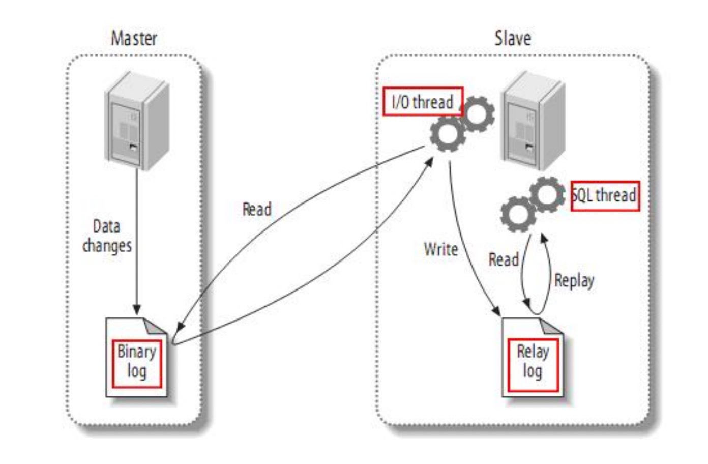

## 1.3、binlog使用场景

- 主从同步
- 缓存数据同步
   - 如Canal
      - 原理：模拟一个slave节点，向MySQL发起binlog同步，然后将数据落地到Redis、Kafka等其他组件，实现数据实时流转。
## 1.4、搭建要求

- 主从MySQL版本必须一样
   - 最少主服务要低于从服务
   - 两节点间时间要同步
## 1.5、搭建主从集群
### 1.5.1、无细节版
#### 1.5.1.1、配置master主服务器
主：
```shell
docker run --name mysql-master --privileged=true -v /usr/local/mysql/master-data:/var/lib/mysql -p 3306:3306 -e MYSQL_ROOT_PASSWORD=root -d xiaochunping/mysql-master
```

- --name指定运行之后的容器的名称为mysql-master；
- --privileged指定了当前容器是否真正的具有root权限，所谓的root权限是指具有宿主机的root权限，而不仅仅只是在容器内部有root权限；
- -v指定了容器中指定目录挂载到宿主机上的某个目录，这样做的目的在于防止容器中配置的数据丢失，因为docker容器在重启之后是不会保留前一次在其内部运行的相关数据的；
- -p表示宿主机上的某个端口映射到docker容器内的某个端口，这里也就是将宿主机的3306端口映射到容器内部的3306端口；
- -e表示指定当前容器运行的环境变量，该变量一般在容器内部程序的配置文件中使用，而在外部运行容器指定该参数。这里的MYSQL_ROOT_PASSWORD表示容器内部的MySQL的启动密码；
- -d参数指定了当前容器是在后台运行。

进入容器
```shell
docker exec -it mastermysql /bin/bash
```
进入mysql
```shell
mysql -uroot -proot
```
授权
```shell
grant replication slave on . to 'test'@'%' identified by '123456';flush privileges;
```
查看binlog
```shell
show master status;
```
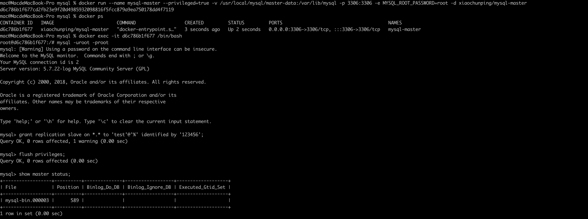
#### 1.5.1.2、配置slave主服务器
```shell
docker run --name mysql-slave --privileged=true -v /usr/local/mysql/slave-data:/var/lib/mysql -p 3307:3306 --link mysql-master:master -e MYSQL_ROOT_PASSWORD=root -d xiaochunping/mysql-slave
```

- 所映射的宿主机的端口号不能与master容器相同，因为其已经被master容器占用；
- 必须加上--link参数，其后指定了当前容器所要连接的容器，mysql-master表示所要连接的容器的名称，master表示为该容器起的一个别名，通俗来讲，就是slave容器通过这两个名称都可以访问到master容器。这么做的原因在于，如果master与slave不在同一个docker network中，那么这两个容器相互之间是没法访问的。注意这一点非常重要，之前本人按照网上的搭建方式搭建主从服务器一直无法成功，主要就是因为他们一直没有提到要设置这个参数。

进入容器
```shell
 docker exec -it mysql-slave /bin/bash
```
进入mysql
```shell
mysql -uroot -proot
```
复制master数据
```shell
change master to master_host='master', master_user='test', master_password='123456', master_port=3306, master_log_file='mysql-bin.000003', master_log_pos=589, master_connect_retry=30;
```

- 注意master_log_file为上面图上的file，master_log_pos为Position

启动主从复制
```shell
 start slave;
```
查看slave
```shell
show slave status \G;
```
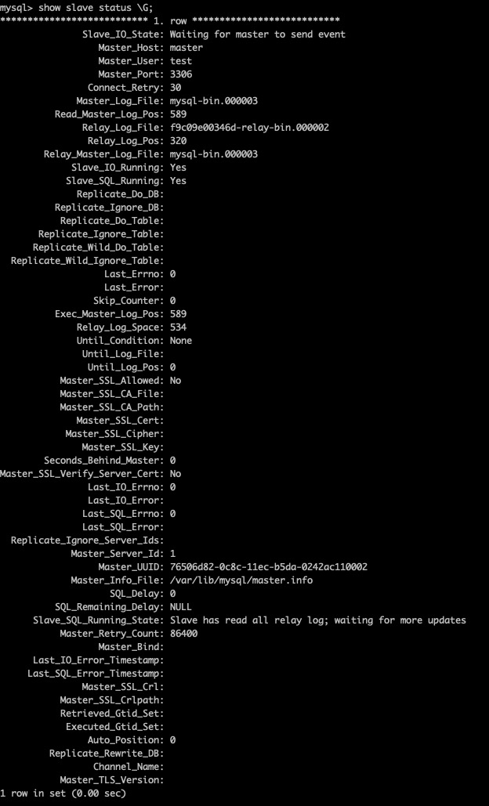
Slave_IO_Running/Slave_SQL_Running都为true，所以是成功的！！！
#### 1.5.1.3、测试
master

slave

### 1.5.2、细节篇
#### 1.5.2.1 配置master主服务器
首先，配置主节点的mysql配置文件： /etc/my.cnf 这一步需要对master进行配置，主要是需要打开binlog日志，以及指定severId。我们打开MySQL主服务的
my.cnf文件，在文件中一行server-id以及一个关闭域名解析的配置。然后重启服务。
```shell
 [mysqld]
 
 server-id=47 
 
 #开启binlog 
 
 log_bin=master-bin 
 
 log_bin-index=master-bin.index 
 
 skip-name-resolve 
 
 # 设置连接端口 
 
 port=3306 
 
 # 设置mysql的安装目录 
 
 basedir=/usr/local/mysql 
 
 # 设置mysql数据库的数据的存放目录 
 
 datadir=/usr/local/mysql/mysql-files 
 
 # 允许最大连接数 
 
 max_connections=200 
 
 # 允许连接失败的次数。 
 
 max_connect_errors=10 
 
 # 服务端使用的字符集默认为UTF8 
 
 character-set-server=utf8 
 
 # 创建新表时将使用的默认存储引擎 
 
 default-storage-engine=INNODB 
 
 # 默认使用“mysql_native_password”插件认证 
 
 #mysql_native_password 
 
 default_authentication_plugin=mysql_native_password 
```
配置说明：主要需要修改的是以下几个属性：

- server-id：服务节点的唯一标识。需要给集群中的每个服务分配一个单独的ID。
- log_bin：打开Binlog日志记录，并指定文件名。
- log_bin-index：Binlog日志文件

重启MySQL服务， service mysqld restart
然后，我们需要给root用户分配一个replication slave的权限。
```shell
#登录主数据库 
 
 mysql -u root -p 
 
 GRANT REPLICATION SLAVE ON *.* TO 'root'@'%'; 
 
 flush privileges; 
 
 #查看主节点同步状态： 
 
 show master status; 
```
在实际生产环境中，通常不会直接使用root用户，而会创建一个拥有全部权限的用户来负责主从同步。
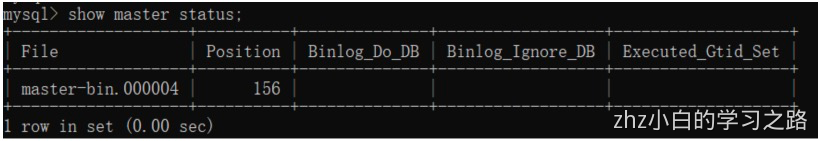
	这个指令结果中的File和Position记录的是当前日志的binlog文件以及文件中的索引。
	而后面的Binlog_Do_DB和Binlog_Ignore_DB这两个字段是表示需要记录binlog文件的库以及不需要记录binlog文件的库。目前我们没有进行配置，就表示是针对
全库记录日志。这两个字段如何进行配置，会在后面进行介绍。
开启binlog后，数据库中的所有操作都会被记录到datadir当中，以一组轮询文件的方式循环记录。而指令查到的File和Position就是当前日志的文件和位置。而在后面配置从服务时，就需要通过这个File和Position通知从服务从哪个地方开始记录binLog。
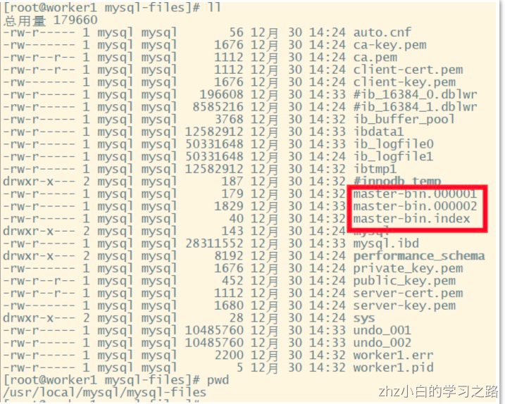
#### 1.5.2.2、配置slave从服务
下一步，我们来配置从服务mysqls。 我们打开mysqls的配置文件my.cnf，修改配置文件：
```shell
 [mysqld]
 
 #主库和从库需要不一致 
 
 server-id=48 
 
 #打开MySQL中继日志 
 
 relay-log-index=slave-relay-bin.index 
 
 relay-log=slave-relay-bin 
 
 #打开从服务二进制日志 
 
 log-bin=mysql-bin 
 
 #使得更新的数据写进二进制日志中 
 
 log-slave-updates=1 
 
 # 设置3306端口 
 
 port=3306 
 
 # 设置mysql的安装目录 
 
 basedir=/usr/local/mysql 
 
 # 设置mysql数据库的数据的存放目录 
 
 datadir=/usr/local/mysql/mysql-files 
 
 # 允许最大连接数 
 
 max_connections=200 
 
 # 允许连接失败的次数。 
 
 max_connect_errors=10 
 
 # 服务端使用的字符集默认为UTF8 
 
 character-set-server=utf8 
 
 # 创建新表时将使用的默认存储引擎 
 
 default-storage-engine=INNODB 
 
 # 默认使用“mysql_native_password”插件认证
 # mysql_native_password
 
 default_authentication_plugin=mysql_native_password 
```

配置说明：主要需要关注的几个属性：

- server-id：服务节点的唯一标识
- relay-log：打开从服务的relay-log日志。
- log-bin：打开从服务的bin-log日志记录。

然后我们启动mysqls的服务，并设置他的主节点同步状态。
```shell
 # 登录从服务 
 mysql -u root -proot; 
 
 # 设置同步主节点： 
 CHANGE MASTER TO MASTER_HOST='192.168.232.128', MASTER_PORT=3306, MASTER_USER='root', MASTER_PASSWORD='root', MASTER_LOG_FILE='master-bin.000004', MASTER_LOG_POS=156 GET_MASTER_PUBLIC_KEY=1; 
 
 # 开启slave 
 start slave; 
 
 # 查看主从同步状态 
 show slave status; 
 
 # 或者用 show slave status \G; 这样查看比较简洁
```
注意，CHANGE MASTER指令中需要指定的MASTER_LOG_FILE和MASTER_LOG_POS必须与主服务中查到的保持一致。并且后续如果要检查主从架构是否成功，也可以通过检查主服务与从服务之间的File和Position这两个属性是否一致来确定。
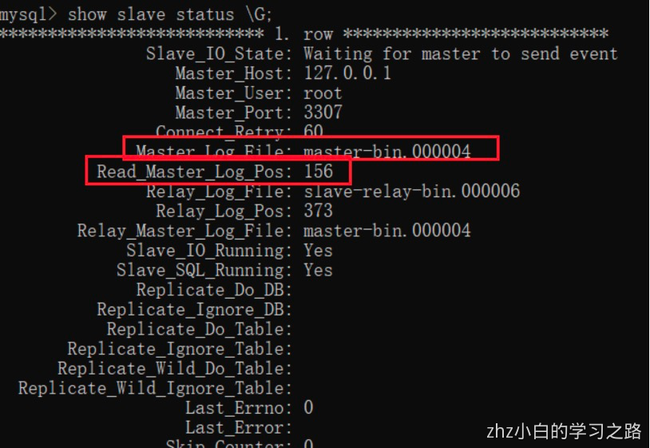
我们重点关注其中红色方框的两个属性，与主节点保持一致，就表示这个主从同步搭建是成功的。
从这个指令的结果能够看到，有很多Replicate_开头的属性，这些属性指定了两个服务之间要同步哪些数据库、哪些表的配置。只是在我们这个示例中全都没有进行配置，就标识是全库进行同步。后面我们会补充如何配置需要同步的库和表。
#### 1.5.2.3、测试
master
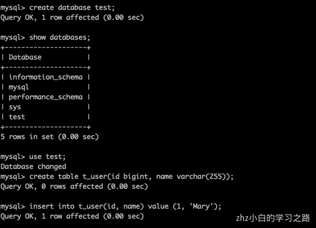
slave
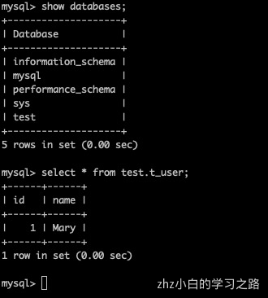
### 1.5.3、从slave写了怎么办？（自己手残）
如果在slave从服务上查看slave状态，发现Slave_SQL_Running=no，就表示主从同步失败了。这有可能
是因为在从数据库上进行了写操作，与同步过来的SQL操作冲突了，也有可能是slave从服务重启后有事务回滚了。
```shell
如果是因为slave从服务事务回滚的原因，可以按照以下方式重启主从同步：
 mysql> stop slave ; 
 mysql> set GLOBAL SQL_SLAVE_SKIP_COUNTER=1; 
 mysql> start slave ;
或者
 mysql> stop slave ; 
 mysql> change master to ..... (参考上面的命令)
 mysql> start slave ;
 但是这种方式要注意binlog的文件和位置，如果修改后和之前的同步接不上，那就会丢失部分数据。所以不太常用。
```
### 1.5.4、集群搭建扩展
#### 1.5.4.1、全库同步与部分同步
在Master端：在my.cnf中，可以通过以下这些属性指定需要针对哪些库或者哪些表记录binlog
```shell
 #需要同步的二进制数据库名 
 binlog-do-db=masterdemo 
 #只保留7天的二进制日志，以防磁盘被日志占满(可选) 
 expire-logs-days = 7 
 #不备份的数据库 
 binlog-ignore-db=information_schema 
 binlog-ignore-db=performation_schema 
 binlog-ignore-db=sys
在Slave端：在my.cnf中，需要配置备份库与主服务的库的对应关系
 #如果salve库名称与master库名相同，使用本配置 
 replicate-do-db=masterdemo 
 #如果master库名[mastdemo]与salve库名[mastdemo01]不同，使用以下配置[需要做映射] 
 replicate-rewrite-db=masterdemo -> masterdemo01 
 #如果不是要全部同步[默认全部同步]，则指定需要同步的表 
 replicate-wild-do-table=masterdemo01.t_dict 
 replicate-wild-do-table=masterdemo01.t_num
```
配置完成了之后，在show master status指令中，就可以看到Binlog_Do_DB和Binlog_Ignore_DB两个参数的作用了。
#### 1.5.4.2、读写分离配置
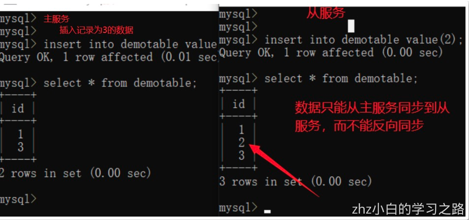
主读从写
在MySQL主从架构中，是需要严格限制从服务的数据写入的，一旦从服务有数据写入，就会造成数据不一致。并且从服务在执行事务期间还很容易造成数据同步失败。
如果需要限制用户写数据，我们可以在从服务中将read_only参数的值设为1( set global read_only=1; )。这样就可以限制用户写入数据。
但是这个属性有两个需要注意的地方：

1. read_only=1设置的只读模式，不会影响slave同步复制的功能。 所以在MySQL slave库中设定了read_only=1后，通过 "show slave status\G" 命令查看salve状态，可以看到salve仍然会读取master上的日志，并且在slave库中应用日志，保证主从数据库同步一致；
2. read_only=1设置的只读模式， 限定的是普通用户进行数据修改的操作，但不会限定具有super权限的用户的数据修改操作。 在MySQL中设置read_only=1后，普通的应用用户进行insert、update、delete等会产生数据变化的DML操作时，都会报出数据库处于只读模式不能发生数据变化的错误，但具有super权限的用户，例如在本地或远程通过root用户登录到数据库，还是可以进行数据变化的DML操作； 如果需要限定super权限的用户写数据，可以设置super_read_only=0。另外 如果要想连super权限用户的写操作也禁止，就使用"flush tables with read lock;"，这样设置也会阻止主从同步复制！
### 1.5.5、其他集群方式
#### 1.5.5.1、MySQL的多活部署
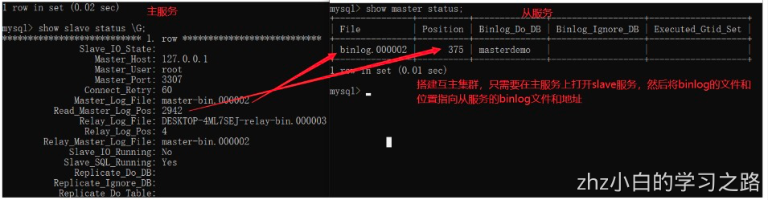

- 互为主从的互主集群
- 环形的主从集群
#### 1.5.5.2、GTID同步集群
本质：

- GTID的本质也是基于Binlog来实现的主从同步，只是他会基于一个全局的事务ID来标识同步进度。这个GTID全局事务ID是一个全局唯一、并且趋势递增的分布式ID策略。
- 在基于GTID的复制中，首先从服务器会告诉主服务器已经在从服务器执行完了哪些事务的GTID值，然后主库会有把所有没有在从库上执行的事务，发送到从库上进行执行，并且使用GTID的复制可以保证同一个事务只在指定的从库上执行一次，这样可以避免由于偏移量的问题造成数据不一致。

搭建：
master
gtid_mode=on 
enforce_gtid_consistency=on 
log_bin=on 
server_id=单独设置一个 
binlog_format=row
slave：
gtid_mode=on 
enforce_gtid_consistency=on 
log_slave_updates=1 
server_id=单独设置一个
然后分别重启主服务和从服务，就可以开启GTID同步复制方式。
#### 1.5.5.3、集群扩容

- 因为已经搭了一主一从，所以一主多从的集群结构就很简单了，增加一个binlog复制，就可以解决了！！
- 如果我们的集群是已经运行过一段时间，这时候如果要扩展新的从节点就有一个问题，之前的数据没办法从binlog来恢复了。这时候在扩展新的slave节点时，就需要增加一个数据复制的操作。
- 所以需要数据备份：利用mysql的bin目录下的mysqldump工具！
-  mysqldump -u root -p --all-databases > backup.sql
- 通过这个指令，就可以将整个数据库的所有数据导出成backup.sql，然后把这个backup.sql分发到新的MySQL服务器上，并执行下面的指令将数据全部导入到新的MySQL服务中。
- 新服务器
   -  mysql -u root -p < backup.sql
- 这样新的MySQL服务就已经有了所有的历史数据，然后就可以再按照上面的步骤，配置Slave从服务的数据同步了。
#### 1.5.5.4、**半同步复制**
主从集群，互主集群的隐患：有可能会丢数据！！
##### 1.5.5.4.1、原理：

- MySQL主从集群默认采用的是一种异步复制的机制。
   - 主服务在执行用户提交的事务后，写入binlog日志，然后就给客户端返回一个成功的响应了
   - binlog会由一个dump线程异步发送给Slave从服务。

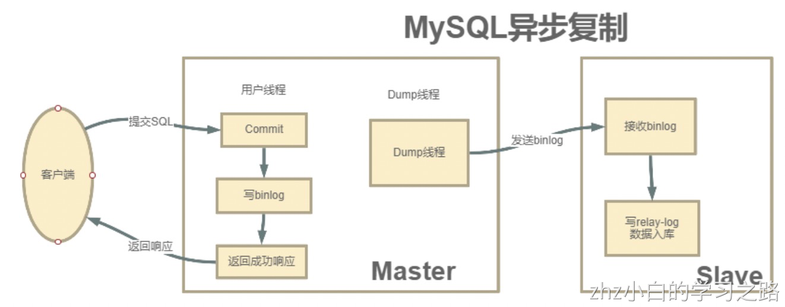
##### 1.5.5.4.2、产生问题：
因为发送的binlog是异步。主服务在向客户端反馈执行结果时，是不知道binlog是否同步成功了的。这时候如果主服务宕机了，而从服务还没有备份到新执行的binlog，那就有可能会丢数据。
##### 1.5.5.4.3、解决：
	靠MySQL的半同步复制机制来保证数据安全
##### 1.5.5.4.4、什么是半同步复制机制？

- 半同步复制机制是一种介于异步复制和全同步复制之前的机制
- 主库在执行完客户端提交的事务后，并不是立即返回客户端响应，而是等待至少一个从库接收并写到relay log中，才会返回给客户端。MySQL在等待确认时，默认会等10秒，如果超过10秒没有收到ack，就会降级成为异步复制。

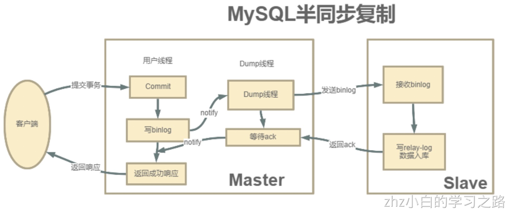
优点：

- 提高数据的安全性
   - 只保证事务提交后的binlog至少传输到了一个从库，并且并不保证从库应用这个事务的binlog是成功的！！
   - 半同步复制机制也会造成一定程度的延迟，这个延迟时间最少是一个TCP/IP请求往返的时间
   - 当从服务出现问题时，主服务需要等待的时间就会更长，要等到从服务的服务恢复或者请求超时才能给用户响应
##### 1.5.5.4.5、搭建半同步复制集群

- 半同步复制需要基于特定的扩展模块来实现。
- 这个模块包含在mysql安装目录下的lib/plugin目录下的semisync_master.so和semisync_slave.so两个文件中。需要在主服务上安装semisync_master模块，在从服务上安装semisync_slave模块

首先我们登陆主服务，安装semisync_master模块：
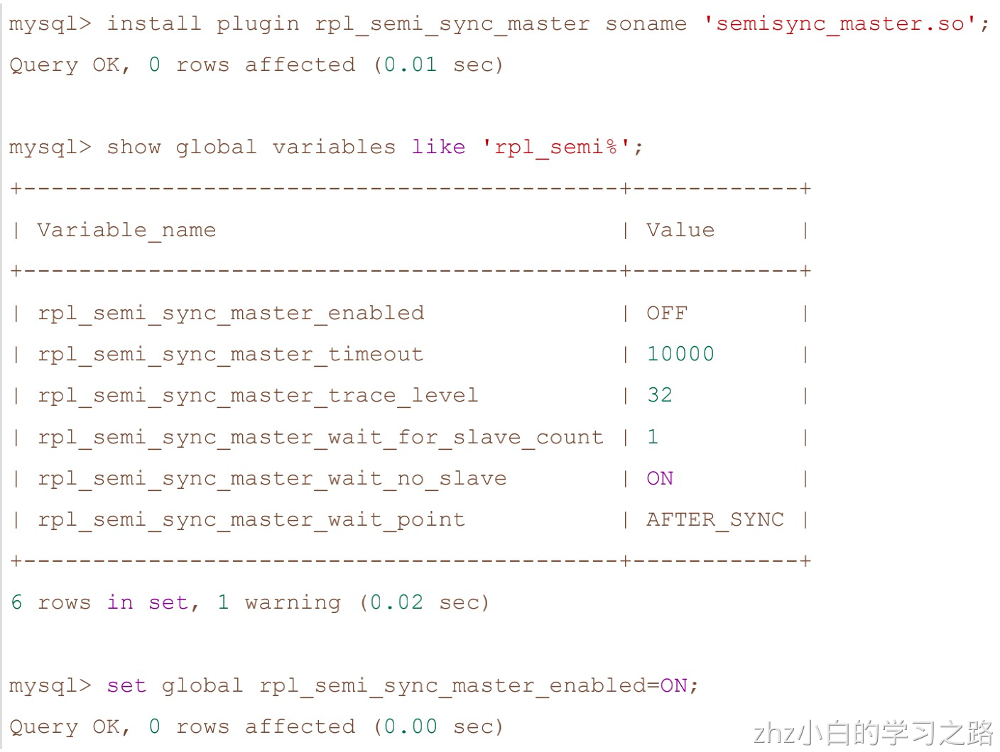

- 这三行指令中，第一行是通过扩展库来安装半同步复制模块，需要指定扩展库的文件名。
- 第二行查看系统全局参数，rpl_semi_sync_master_timeout就是半同步复制时等待应答的最长等待时间，默认是10秒，可以根据情况自行调整。
- 第三行则是打开半同步复制的开关。
- 在第二行查看系统参数时，最后的一个参数rpl_semi_sync_master_wait_point其实表示一种半同步复制的方式。
- 半同步复制有两种方式，
   - 一种是我们现在看到的这种默认的AFTER_SYNC方式。这种方式下，主库把日志写入binlog，并且复制给从库，然后开始等待从库的响应。从库返回成功后，主库再提交事务，接着给客户端返回一个成功响应。
   - 而另一种方式是叫做AFTER_COMMIT方式。他不是默认的。这种方式，在主库写入binlog后，等待binlog复制到从库，主库就提交自己的本地事务，再等待从库返回给自己一个成功响应，然后主库再给客户端返回响应。

然后我们登陆从服务，安装smeisync_slave模块
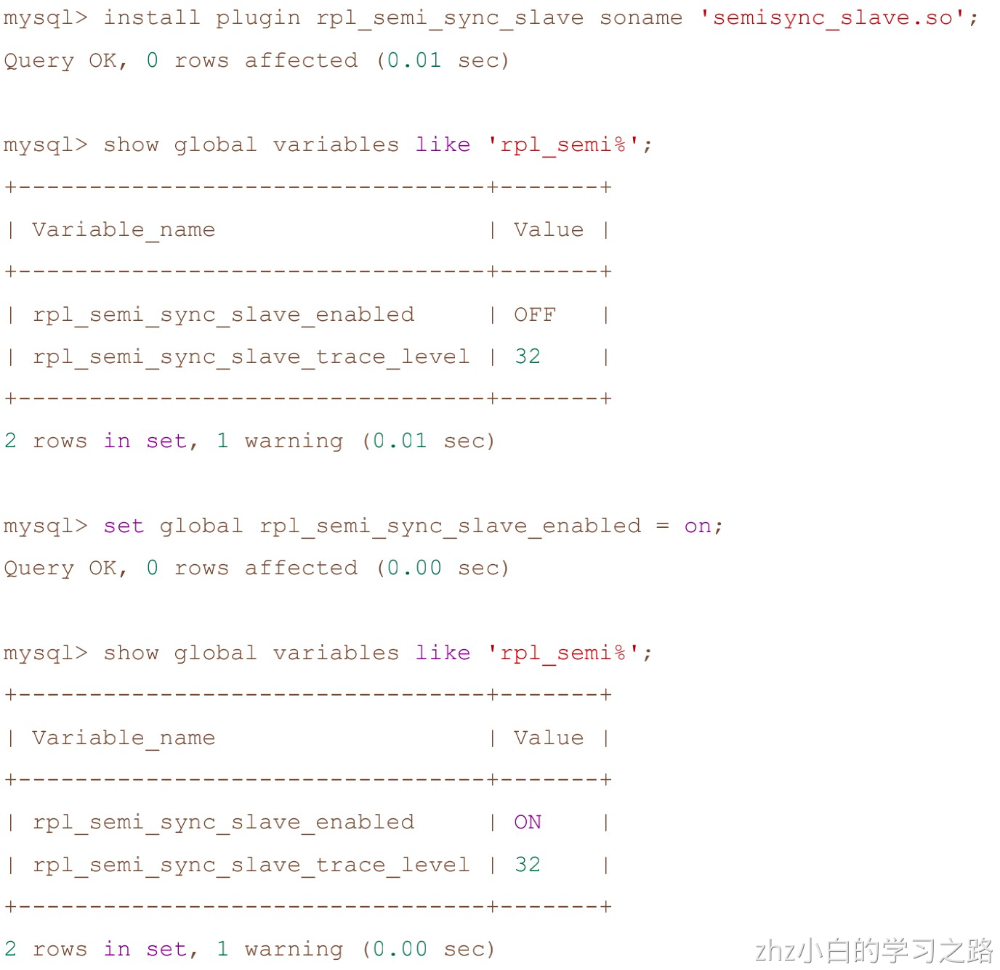
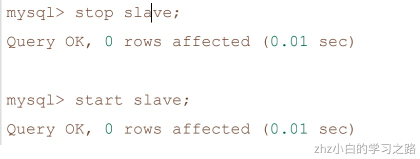
slave端的安装过程基本差不多，不过要注意下安装完slave端的半同步插
件后，需要重启下slave服务。
##### 1.5.5.4.6、主从架构的数据延迟问题

- 数据往主服务写，而读数据在从服务读
- 面向业务的主服务数据都是多线程并发写入的，而从服务是单个线程慢慢拉取binlog，这中间就会有个效率差。
   - 所以解决这个问题的关键是要让从服务也用多线程并行复制binlog数据。
   - MySQL自5.7版本后就已经支持并行复制了。可以在从服务上设置slave_parallel_workers为一个大于0的数，然后把slave_parallel_type参数设置为LOGICAL_CLOCK，这就可以了。
### 1.5.6、MySQL的高可用方案
下面三种方案的共同点：

- 对主从复制集群中的Master节点进行监控
- 自动的对Master进行迁移，通过VIP。
- 重新配置集群中的其它slave对新的Master进行同步
#### 1.5.6.1、MMM

(Master-Master replication managerfor Mysql，Mysql主主复制管理器)是一套由Perl语言实现的脚本程序，可以对mysql集群进行监控和故障迁移。他需要两个Master，同一时间只有一个Master对外提供服务，可以说是主备模式。
他是通过一个VIP(虚拟IP)的机制来保证集群的高可用。整个集群中，在主节点上会通过一个VIP地址来提供数据读写服务，而当出现故障时，VIP就会从原来的主节点漂移到其他节点，由其他节点提供服务。
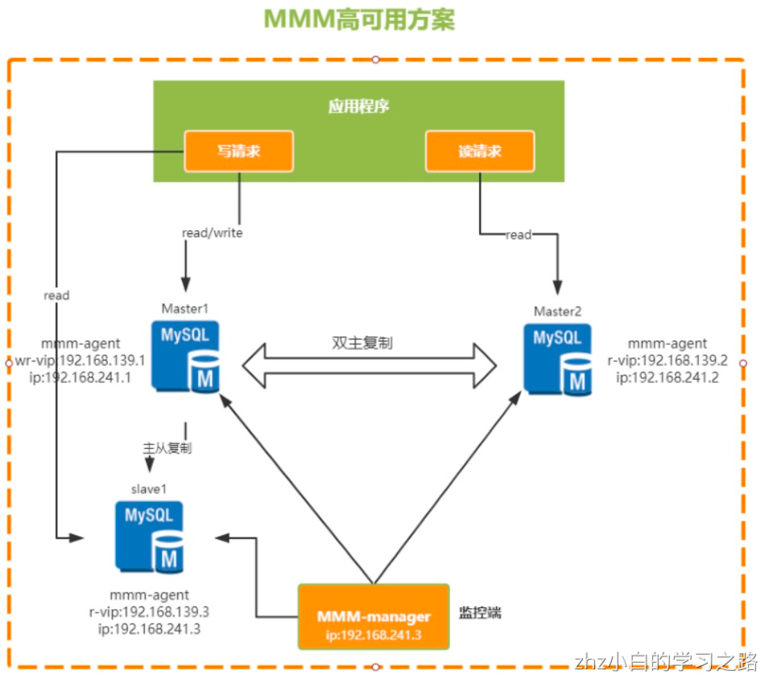
优点：

- 提供了读写VIP的配置，使读写请求都可以达到高可用工具包相对比较完善，不需要额外的开发脚本完成故障转移之后可以对MySQL集群进行高可用监控

缺点：

- 故障简单粗暴，容易丢失事务，建议采用半同步复制方式，减少失败的概率目前MMM社区已经缺少维护，不支持基于GTID的复制

适用场景：

- 读写都需要高可用的
- 基于日志点的复制方式
#### 1.5.6.2、MHA

- Master High Availability Manager and Tools for MySQL。是由日本人开发的一个基于Perl脚本写的工具。这个工具专门用于监控主库的状态，当发现master节点故障时，会提升其中拥有新数据的slave节点成为新的master节点，在此期间，MHA会通过其他从节点获取额外的信息来避免数据一致性方面的问题。MHA还提供了mater节点的在线切换功能，即按需切换master-slave节点。MHA能够在30秒内实现故障切换，并能在故障切换过程中，最大程度的保证数据一致性。在淘宝内部，也有一个相似的TMHA产品。
- MHA是需要单独部署的，分为Manager节点和Node节点，两种节点。其中Manager节点一般是单独部署的一台机器。而Node节点一般是部署在每台MySQL机器上的。 Node节点得通过解析各个MySQL的日志来进行一些操作。
- Manager节点会通过探测集群里的Node节点去判断各个Node所在机器上的MySQL运行是否正常，如果发现某个Master故障了，就直接把他的一个Slave提升为Master，然后让其他Slave都挂到新的Master上去，完全透明。

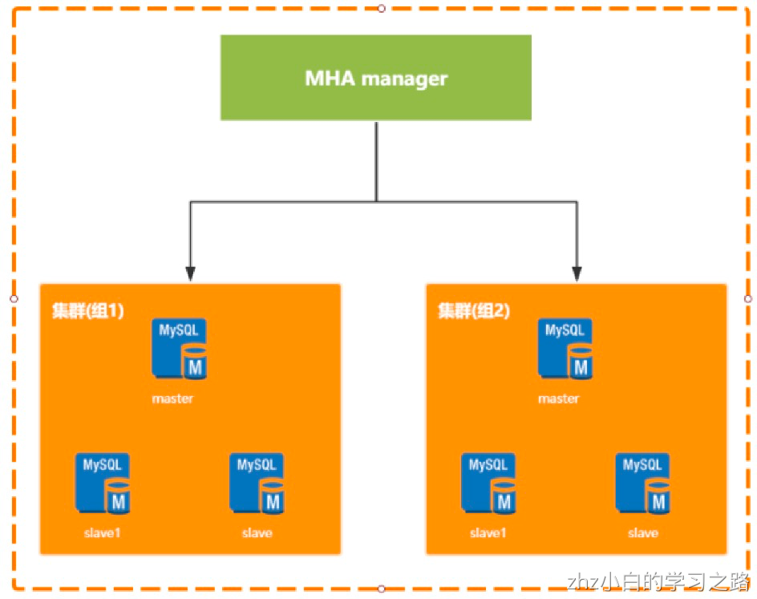
优点：

- MHA除了支持日志点的复制还支持GTID的方式
- 同MMM相比，MHA会尝试从旧的Master中恢复旧的二进制日志，只是未必每次都能成功。如果希望更少的数据丢失场景，建议使用MHA架构。

缺点：

- MHA需要自行开发VIP转移脚本。
- MHA只监控Master的状态，未监控Slave的状态
#### 1.5.6.3、MGR
MGR：MySQL Group Replication。 是MySQL官方在5.7.17版本正式推出的一种组复制机制。主要是解决传统异步复制和半同步复制的数据一致性问题。由若干个节点共同组成一个复制组，一个事务提交后，必须经过超过半数节点的决议并通过后，才可以提交。引入组复制，主要是为了解决传统异步复制和半同步复制可能产生数据不一致的问题。MGR依靠分布式一致性协议(Paxos协议的一个变体)，实现了分布式下数据的最终一致性，提供了真正的数据高可用方案(方案落地后是否可靠还有待商榷)。
支持多主模式，但官方推荐单主模式：

- 多主模式下，客户端可以随机向MySQL节点写入数据
- 单主模式下，MGR集群会选出primary节点负责写请求，primary节点与其它节点都可以进行读请求处理.

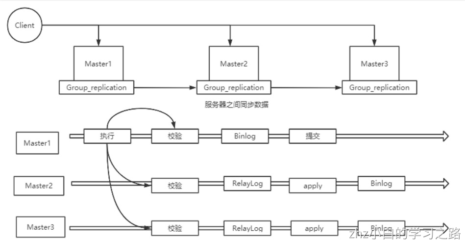
优点：

- 基本无延迟，延迟比异步的小很多
- 支持多写模式，但是目前还不是很成熟
- 数据的强一致性，可以保证数据事务不丢失

缺点:

- 仅支持innodb，且每个表必须提供主键。
- 只能用在GTID模式下，且日志格式为row格式。

适用的业务场景：

- 对主从延迟比较敏感
- 希望对对写服务提供高可用，又不想安装第三方软件
- 数据强一致的场景
### 1.5.7、分库分表

- 分库分表就是业务系统将数据写请求分发到master节点，而读请求分发到slave节点的一种方案，可以大大提高整个数据库集群的性能。
- 分库分表的一整套逻辑全部是由客户端自行实现的。
- 对于MySQL集群，数据主从同步是实现读写分离的一个必要前提条件。
#### 1.5.7.1、作用

- 1、解决数据量大而导致数据库性能降低的问题
   - 将独立的数据库分成若干数据库
   - 数据大表拆分成若干数据表（大数据量->多个小数据量）
- 例如
   - 微服务架构，每个服务都分配一个独立的数据库（分库）
   - 业务日志表，按月拆分成不同的表，这就是分表。
- 2、数据分片解决了性能、可用性以及单点备份恢复
#### 1.5.7.2、分库分表的方式

- 数据分片（将数据拆分成不同的存储单元）
   - 分库
   - 分表
- 分拆的角度
   - 垂直分片（纵向分片）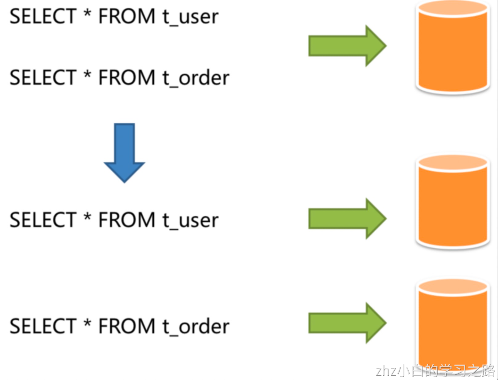
      - 核心理念：转库专用
      - 在拆分之前，一个数据库由多个数据表组成，每个表对应不同的业务。而拆分之后，则是按照业务将表进行归类，分布到不同的数据库或表中，从而将压力分散至不同的数据库或表。
      - 列如：将用户表和订单表垂直分片到不同的数据库
      - 垂直分片往往需要对架构和设计进行调整
      - 缺点：
         - 无法真正的解决单点数据库的性能瓶颈
         - 垂直分片可以缓解数据量和访问量带来的问题，但无法根治
         - 如果垂直分片之后，表中的数据量依然超过单节点所能承载的阈值，则需要水平分片来进一步处理
   - 水平分片（横向分片）--->分库分表的标准方案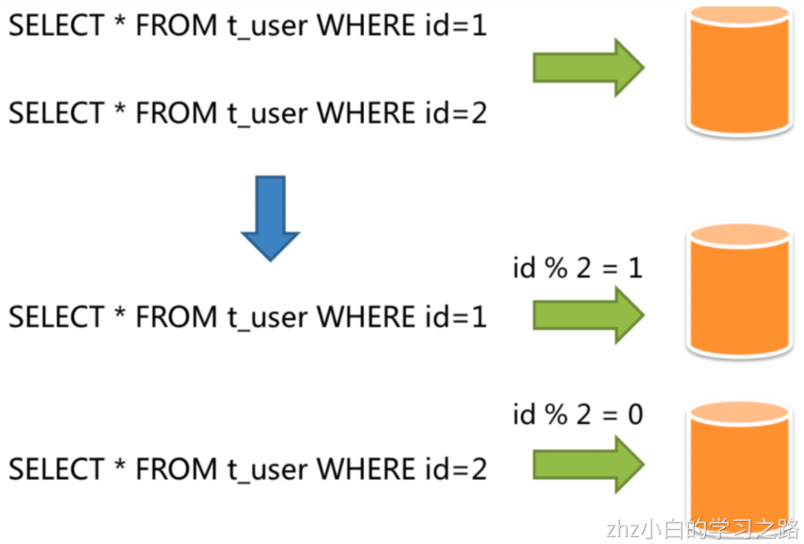
      - 不根据业务逻辑分类，通过某个字段或者某几个字段，根据某种规则将数据分散至多个库或表中，每个分片仅包含数据的一部分。
      - 分片策略
         - 取余\取模 ： 
            - 优点：均匀存放数据，缺点 扩容非常麻烦
         - 按照范围分片 ：
            - 比较好扩容， 数据分布不够均匀
         - 按照时间分片 ： 
            - 比较容易将热点数据区分出来
         - 按照枚举值分片 ： 
            - 例如按地区分片
         - 按照目标字段前缀指定进行分区：
            - 自定义业务规则分片
   - 两种方式选择
      - 在系统设计阶段就应该根据业务耦合松紧来确定垂直分库，垂直分表方案，在数据量及访问压力不是特别大的情况，首先考虑缓存、读写分离、索引技术等方案。
      - 若数据量极大，且持续增长，再考虑水平分库水平分表方案
#### 1.5.7.3、分库分表的缺点

- 事务一致性问题
   - 原本单机数据库有很好的事务机制能够帮我们保证数据一致性。但是分库分表后，由于数据分布在不同库甚至不同服务器，不可避免会带来分布式事务问题。
- 跨节点关联查询问题
   - 在没有分库时，我们可以进行很容易的进行跨表的关联查询。但是在分库后，表被分散到了不同的数据库，就无法进行关联查询了。
   - 这时就需要将关联查询拆分成多次查询，然后将获得的结果进行拼装。
- 跨节点分页、排序函数
   - 跨节点多库进行查询时，limit分页、order by排序等问题，就变得比较复杂了。需要先在不同的分片节点中将数据进行排序并返回，然后将不同分片返回的结果集进行汇总和再次排序。
   - 这时非常容易出现内存崩溃的问题。
- 主键避重问题
   - 在分库分表环境中，由于表中数据同时存在不同数据库中，主键值平时使用的自增长将无用武之地，某个分区数据库生成的ID无法保证全局唯一。因此需要单独设计全局主键，以避免跨库主键重复问题。
- 公共表处理
   - 实际的应用场景中，参数表、数据字典表等都是数据量较小，变动少，而且属于高频联合查询的依赖表。这一类表一般就需要在每个数据库中都保存一份，并且所有对公共表的操作都要分发到所有的分库去执行。
- 运维工作量
   - 面对散乱的分库分表之后的数据，应用开发工程师和数据库管理员对数据库的操作都变得非常繁重。对于每一次数据读写操作，他们都需要知道要往哪个具体的数据库的分表去操作，这也是其中重要的挑战之一。
#### 1.5.7.4、什么时候需要分库分表？

- MySQL单表记录如果达到500W这个级别，或者单表容量达到2GB，一般就建议进行分库分表
- 一般对于用户数据这一类后期增长比较缓慢的数据，一般可以按照三年左右的业务量来预估使用人数，按照标准预设好分库分表的方案。
- 对于业务数据这一类增长快速且稳定的数据，一般则需要按照预估量的两倍左右预设分库分表方案。并且由于分库分表的后期扩容是非常麻烦的，所以在进行分库分表时，尽量根据情况，多分一些表。最好是计算一下数据增量，永远不用增加更多的表。
- 在设计分库分表方案时，要尽量兼顾业务场景和数据分布。在支持业务场景的前提下，尽量保证数据能够分得更均匀。
- 一旦用到了分库分表，就会表现为对数据查询业务的灵活性有一定的影响，例如如果按userId进行分片，那按age来进行查询，就必然会增加很多麻烦。如果再要进行排序、分页、聚合等操作，很容易就扛不住了。这时候，都要尽量在分库分表的同时，再补充设计一个降级方案，例如将数据转存一份到ES，ES可以实现更灵活的大数据聚合查询。

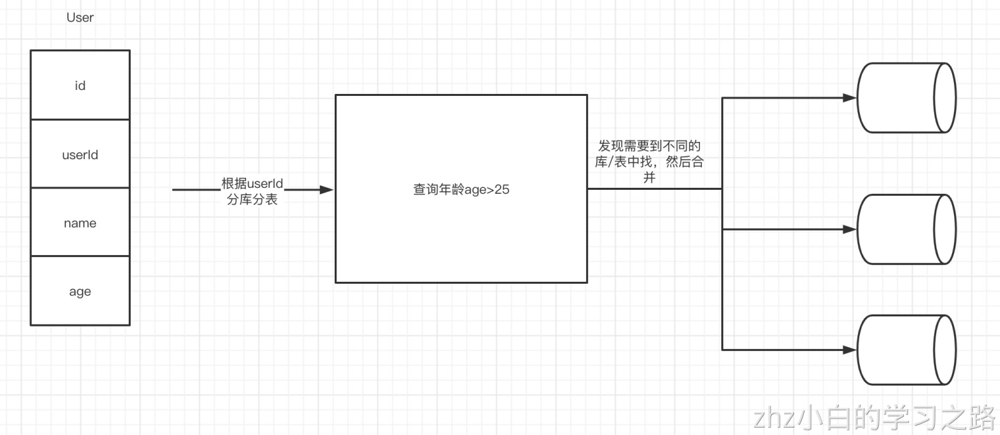
#### 1.5.7.5、常见的分库分表组件

- ShardingSphere
- MyCat
- Dble
- Cobar
# 2、ShardingSphere
## 2.1、什么是ShardingSphere？
地址：https://shardingsphere.apache.org/index_zh.html
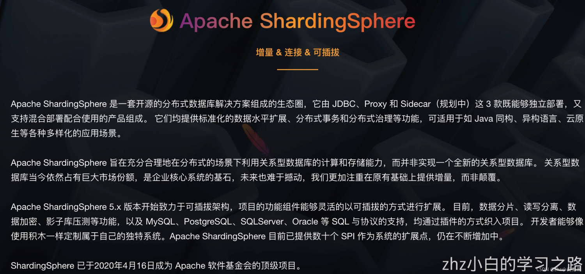
**ShardingJDBC**:
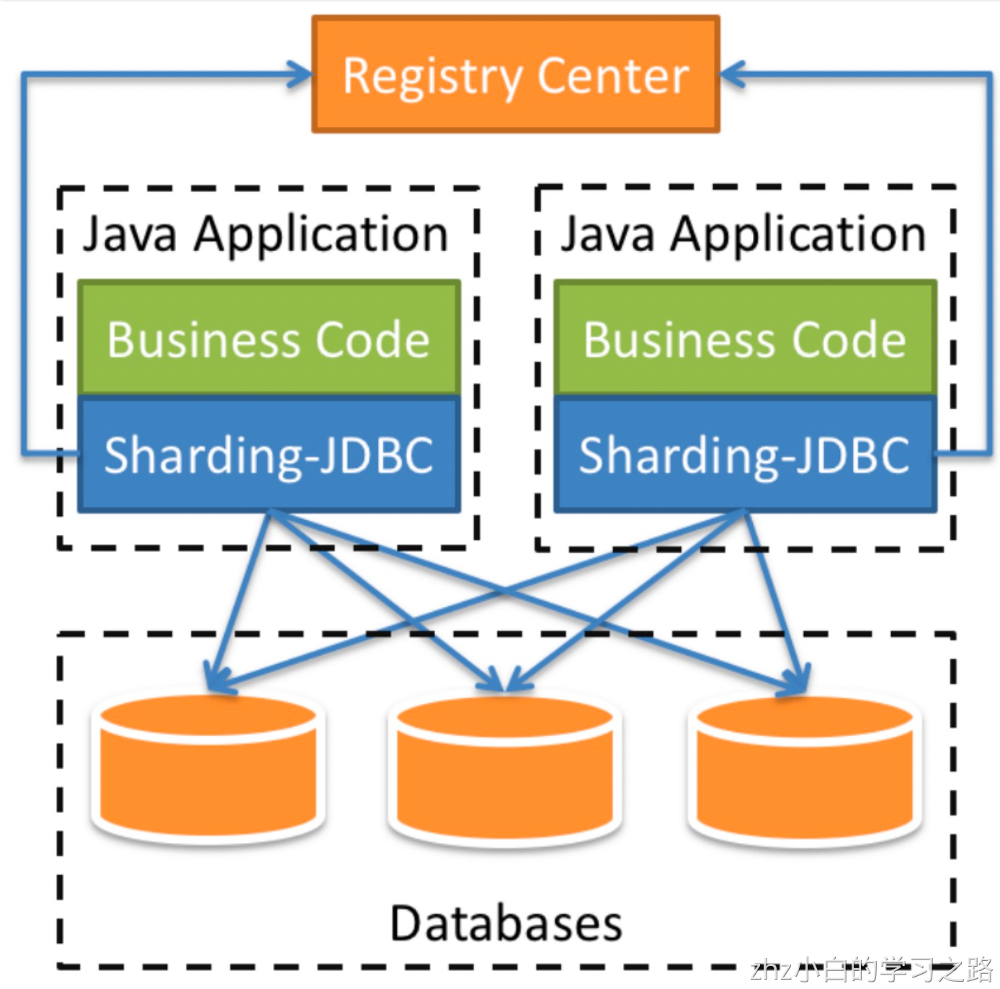
shardingJDBC定位为轻量级 Java 框架，在 Java 的 JDBC 层提供的额外服务。它使⽤客户端直连数据库，以 jar 包形式提供服务，⽆需额外部署和依赖，可理解为增强版的 JDBC 驱动，完全兼容 JDBC 和各种 ORM 框架。
**ShardingProxy**
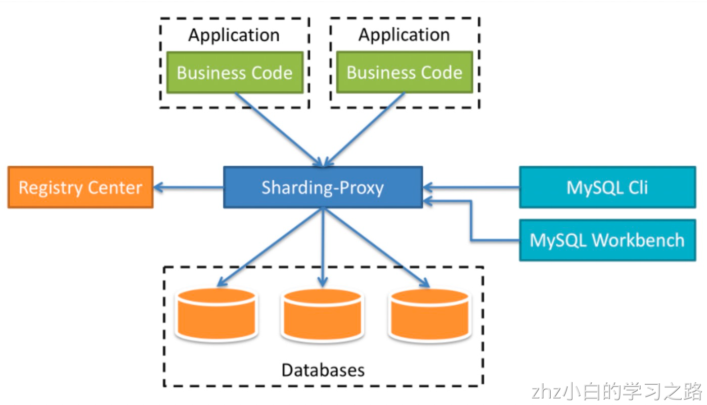
ShardingProxy定位为透明化的数据库代理端，提供封装了数据库⼆进制协议的服务端版本，⽤于完成对异构语⾔的⽀持。⽬前提供 MySQL 和 PostgreSQL 版本，它可以使⽤任何兼容 MySQL/PostgreSQL 协议的访问客⼾端。
**两种方式的区别：**

|  | **Sharding-JDBC** | **Sharding-Proxy** |
| --- | --- | --- |
| 数据库  | 任意  | MySQL/PostgreSQL |
| 连接消耗数  | 高 | 低 |
| 异构语言 | 仅java  | 任意 |
| 性能 | 损耗低  | 损耗略高 |
| 无中心化 | 是  | 否 |
| 静态入口 | 无 | 有 |

ShardingJDBC只是客户端的一个工具包，可以理解为一个特殊的JDBC驱动包，所有分库分表逻辑均由业务方自己控制，所以他的功能相对灵活，支持的数据库也非常多，但是对业务侵入大，需要业务方自己定制所有的分库分表逻辑。
ShardingProxy是一个独立部署的服务，对业务方无侵入，业务方可以像用一个普通的MySQL服务一样进行数据交互，基本上感觉不到后端分库分表逻辑的存在，但是这也意味着功能会比较固定，能够支持的数据库也比较少。
## 2.2、核心概念：
shardingjdbc的核心功能是数据分片和读写分离，通过ShardingJDBC，应用可以透明的使用JDBC访问已经分库分表、读写分离的多个数据源，而不用关心数据源的数量以及数据如何分布。

- 逻辑表：水平拆分的数据库的相同逻辑和数据结构表的总称
- 真实表：在分片的数据库中真实存在的物理表。
- 数据节点：数据分片的最小单元。由数据源名称和数据表组成
- 绑定表：分片规则一致的主表和子表。
- 广播表：也叫公共表，指素有的分片数据源中都存在的表，表结构和表中的数据在每个数据库中都完全一致。例如字典表。
- 分片键：用于分片的数据库字段，是将数据库(表)进行水平拆分的关键字段。SQL中若没有分片字段，将会执行全路由，性能会很差。
- 分片算法：通过分片算法将数据进行分片，支持通过=、BETWEEN和IN分片。分片算法需要由应用开发者自行实现，可实现的灵活度非常高。
- 分片策略：真正用于进行分片操作的是分片键+分片算法，也就是分片策略。在ShardingJDBC中一般采用基于Groovy表达式的inline分片策略，通过一个包含分片键的算法表达式来制定分片策略，如t_user_$->{u_id%8}标识根据u_id模8，分成8张表，表名称为t_user_0到t_user_7。
## 2.3、分库分表实战
pom依赖
```xml
 <?xml version="1.0" encoding="UTF-8"?>
 <project xmlns="http://maven.apache.org/POM/4.0.0" xmlns:xsi="http://www.w3.org/2001/XMLSchema-instance"
          xsi:schemaLocation="http://maven.apache.org/POM/4.0.0 https://maven.apache.org/xsd/maven-4.0.0.xsd">
     <modelVersion>4.0.0</modelVersion>
     <groupId>com.zhz</groupId>
     <artifactId>sharding-sphere-demo</artifactId>
     <version>0.0.1-SNAPSHOT</version>
     <name>sharding-sphere-demo</name>
     <description>Spring Boot集成ShardingSphere做分库分表</description>
     <properties>
         <java.version>1.8</java.version>
     </properties>
 
 
     <dependencies>
         <dependency>
             <groupId>org.apache.shardingsphere</groupId>
             <artifactId>sharding-jdbc-spring-boot-starter</artifactId>
             <version>4.1.1</version>
         </dependency>
         <dependency>
             <groupId>org.springframework.boot</groupId>
             <artifactId>spring-boot-starter</artifactId>
         </dependency>
         <dependency>
             <groupId>org.springframework.boot</groupId>
             <artifactId>spring-boot-starter-test</artifactId>
         </dependency>
         <dependency>
             <groupId>com.alibaba</groupId>
             <artifactId>druid</artifactId>
             <version>1.1.22</version>
         </dependency>
         <dependency>
             <groupId>mysql</groupId>
             <artifactId>mysql-connector-java</artifactId>
         </dependency>
         <dependency>
             <groupId>com.baomidou</groupId>
             <artifactId>mybatis-plus-boot-starter</artifactId>
             <version>3.0.5</version>
         </dependency>
         <dependency>
             <groupId>org.projectlombok</groupId>
             <artifactId>lombok</artifactId>
         </dependency>
     </dependencies>
 
     <dependencyManagement>
         <dependencies>
             <dependency>
                 <groupId>org.springframework.boot</groupId>
                 <artifactId>spring-boot-dependencies</artifactId>
                 <version>2.3.1.RELEASE</version>
                 <type>pom</type>
                 <scope>import</scope>
             </dependency>
         </dependencies>
     </dependencyManagement>
     <build>
         <plugins>
             <plugin>
                 <groupId>org.apache.maven.plugins</groupId>
                 <artifactId>maven-compiler-plugin</artifactId>
                 <configuration>
                     <source>8</source>
                     <target>8</target>
                 </configuration>
             </plugin>
         </plugins>
     </build>
 </project>
```
pojo实体类
```java
 package com.zhz.shardingspheredemo.pojo;
 
 import com.baomidou.mybatisplus.annotation.IdType;
 import com.baomidou.mybatisplus.annotation.TableField;
 import com.baomidou.mybatisplus.annotation.TableId;
 import com.baomidou.mybatisplus.annotation.TableName;
 import lombok.AllArgsConstructor;
 import lombok.Builder;
 import lombok.Data;
 import lombok.NoArgsConstructor;
 
   /**  
     * @Description: 课程实体类
     * 
     * @author zhouhengzhe
     * @date 2021/9/4下午3:24
     * @since 
     */
 @Data
 @Builder
 @AllArgsConstructor
 @NoArgsConstructor
 @TableName(value = "course")
 public class Course {
     @TableId(value = "cid")
     private Long cid;
 
     @TableField(value = "cname")
     private String cname;
 
     @TableField(value = "user_id")
     private Long userId;
 
     @TableField(value = "cstatus")
     private String cstatus;
 }
```
mapper
```java
 package com.zhz.shardingspheredemo.mapper;
 
 import com.baomidou.mybatisplus.core.mapper.BaseMapper;
 import com.zhz.shardingspheredemo.pojo.Course;
 
   /**  
     * @Description: 课程mapper数据操作层
     * 
     * @author zhouhengzhe
     * @date 2021/9/4下午3:24
     * @since 
     */
 public interface CourseMapper extends BaseMapper<Course> {
 }
```
启动类
```java
 package com.zhz.shardingspheredemo;
 
 import org.mybatis.spring.annotation.MapperScan;
 import org.springframework.boot.SpringApplication;
 import org.springframework.boot.autoconfigure.SpringBootApplication;
 
 /**
  * @author mac
  */
 @SpringBootApplication
 @MapperScan("com.zhz.shardingspheredemo.mapper")
 public class ShardingSphereDemoApplication {
 
     public static void main(String[] args) {
         SpringApplication.run(ShardingSphereDemoApplication.class, args);
     }
 }
```
### 2.3.1、分表不分库
**coursedb库有两个表**
```sql
 CREATE TABLE course_1 (
   cid BIGINT(20) PRIMARY KEY,
   cname VARCHAR(50) NOT NULL,
   user_id BIGINT(20) NOT NULL,
   cstatus varchar(10) NOT NULL
 );
 
 CREATE TABLE course_2 (
   cid BIGINT(20) PRIMARY KEY,
   cname VARCHAR(50) NOT NULL,
   user_id BIGINT(20) NOT NULL,
   cstatus varchar(10) NOT NULL
 );
```
#### 2.3.1.1、配置文件
```json
 #配置数据源
 spring.shardingsphere.datasource.names=m1
 spring.shardingsphere.datasource.m1.type=com.alibaba.druid.pool.DruidDataSource
 spring.shardingsphere.datasource.m1.driver-class-name=com.mysql.cj.jdbc.Driver
 spring.shardingsphere.datasource.m1.url=jdbc:mysql://localhost:3306/coursedb?useUnicode=true&characterEncoding=utf8&useSSL=false&allowPublicKeyRetrieval=true&serverTimezone=GMT%2B8
 spring.shardingsphere.datasource.m1.username=root
 spring.shardingsphere.datasource.m1.password=root
 
 # 要生成多少张真实表（#配置真实表分布）
 spring.shardingsphere.sharding.tables.course.actual-data-nodes=m1.course_$->{1..2}
 # 表的主键是什么（主键生成策略）
 spring.shardingsphere.sharding.tables.course.key-generator.column=cid
 spring.shardingsphere.sharding.tables.course.key-generator.type=SNOWFLAKE
 spring.shardingsphere.sharding.tables.course.key-generator.props.worker.id=1
 #配置分表策略
 spring.shardingsphere.sharding.tables.course.table-strategy.inline.sharding-column=cid
 spring.shardingsphere.sharding.tables.course.table-strategy.inline.algorithm-expression=course_$->{cid%2+1}
 #其他运行属性
 spring.shardingsphere.props.sql.show=true
 # 通过注册与现有定义同名的定义，设置是否允许覆盖 bean 定义 默认false
 spring.main.allow-bean-definition-overriding=true
```
解释：

- 1、首先定义一个数据源m1，并对m1进行实际的JDBC参数配置
- 2、spring.shardingsphere.sharding.tables.course开头的一系列属性即定义了一个名为course的逻辑表。
   - actual-data-nodes属性即定义course逻辑表的实际数据分布情况，他分布在m1.course_1和m1.course_2两个表。
   - key-generator属性配置了他的主键列以及主键生成策略。
   - ShardingJDBC默认提供了UUID和SNOWFLAKE两种分布式主键生成策略。
   - table-strategy属性即配置他的分库分表策略。分片键为cid属性。分片算法为course_$->{cid%2+1}，表示按照cid模2+1的结果，然后加上前面的course__ 部分作为前缀就是他的实际表结果。注意，这个表达式计算出来的结果需要能够与实际数据分布中的一种情况对应上，否则就会报错。
   - sql.show属性表示要在日志中打印实际SQL
#### 2.3.1.2、测试类
```java
 package com.zhz.shardingspheredemo;
 
 import com.zhz.shardingspheredemo.mapper.CourseMapper;
 import com.zhz.shardingspheredemo.pojo.Course;
 import org.junit.Test;
 import org.junit.runner.RunWith;
 import org.springframework.boot.test.context.SpringBootTest;
 import org.springframework.test.context.junit4.SpringRunner;
 
 import javax.annotation.Resource;
 
 @RunWith(SpringRunner.class)
 @SpringBootTest
 public class ShardingSphereDemoApplicationTests {
 
     @Resource
     private CourseMapper courseMapper;
 
     @Test
     public void testSharding() {
         for (int i = 0; i < 10; i++) {
             Course course=Course
                     .builder()
                     .cname("shardingSphere")
                     .userId((long)(1000+i))
                     .cstatus("1")
                     .build();
             courseMapper.insert(course);
         }
     }
 }
```
#### 2.3.1.3、运行结果
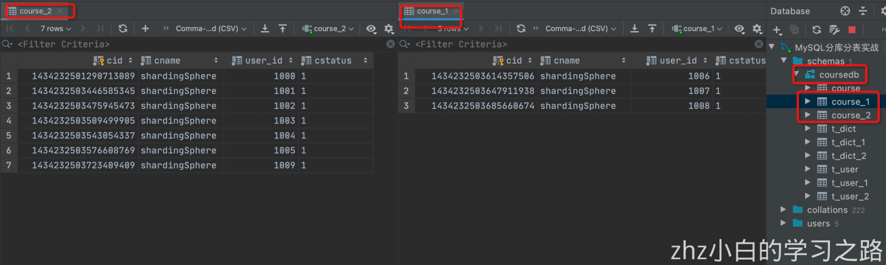
### 2.3.2、奇偶分表分库
**coursedb，coursedb2库都各自有两个相同的表**
```sql
 CREATE TABLE course_1 (
   cid BIGINT(20) PRIMARY KEY,
   cname VARCHAR(50) NOT NULL,
   user_id BIGINT(20) NOT NULL,
   cstatus varchar(10) NOT NULL
 );
 
 CREATE TABLE course_2 (
   cid BIGINT(20) PRIMARY KEY,
   cname VARCHAR(50) NOT NULL,
   user_id BIGINT(20) NOT NULL,
   cstatus varchar(10) NOT NULL
 );
```
#### 2.3.2.1、配置文件：
```json
 #配置数据源
 spring.shardingsphere.datasource.names=m1,m2
 spring.shardingsphere.datasource.m1.type=com.alibaba.druid.pool.DruidDataSource
 spring.shardingsphere.datasource.m1.driver-class-name=com.mysql.cj.jdbc.Driver
 spring.shardingsphere.datasource.m1.url=jdbc:mysql://localhost:3306/coursedb?useUnicode=true&characterEncoding=utf8&useSSL=false&allowPublicKeyRetrieval=true&serverTimezone=GMT%2B8
 spring.shardingsphere.datasource.m1.username=root
 spring.shardingsphere.datasource.m1.password=root
 
 #配置数据源
 spring.shardingsphere.datasource.m2.type=com.alibaba.druid.pool.DruidDataSource
 spring.shardingsphere.datasource.m2.driver-class-name=com.mysql.cj.jdbc.Driver
 spring.shardingsphere.datasource.m2.url=jdbc:mysql://localhost:3306/coursedb2?useUnicode=true&characterEncoding=utf8&useSSL=false&allowPublicKeyRetrieval=true&serverTimezone=GMT%2B8
 spring.shardingsphere.datasource.m2.username=root
 spring.shardingsphere.datasource.m2.password=root
 
 # 要生成多少张真实表（#配置真实表分布）
 spring.shardingsphere.sharding.tables.course.actual-data-nodes=m$->{1..2}.course_$->{1..2}
 # 表的主键是什么（主键生成策略）
 spring.shardingsphere.sharding.tables.course.key-generator.column=cid
 spring.shardingsphere.sharding.tables.course.key-generator.type=SNOWFLAKE
 spring.shardingsphere.sharding.tables.course.key-generator.props.worker.id=1
 #配置分表策略
 spring.shardingsphere.sharding.tables.course.table-strategy.inline.sharding-column=cid
 spring.shardingsphere.sharding.tables.course.table-strategy.inline.algorithm-expression=course_$->{cid%2+1}
 # 配置分库策略
 spring.shardingsphere.sharding.tables.course.database-strategy.inline.sharding-column=cid
 spring.shardingsphere.sharding.tables.course.database-strategy.inline.algorithm-expression=m$->{cid%2+1}
 #其他运行属性
 spring.shardingsphere.props.sql.show=true
 # 通过注册与现有定义同名的定义，设置是否允许覆盖 bean 定义 默认false
 spring.main.allow-bean-definition-overriding=true
```
#### 2.3.2.2、测试类
```java
 package com.zhz.shardingspheredemo;
 
 import com.zhz.shardingspheredemo.mapper.CourseMapper;
 import com.zhz.shardingspheredemo.pojo.Course;
 import org.junit.Test;
 import org.junit.runner.RunWith;
 import org.springframework.boot.test.context.SpringBootTest;
 import org.springframework.test.context.junit4.SpringRunner;
 
 import javax.annotation.Resource;
 
 @RunWith(SpringRunner.class)
 @SpringBootTest
 public class ShardingSphereDemoApplicationTests {
 
     @Resource
     private CourseMapper courseMapper;
 
     @Test
     public void testSharding() {
         for (int i = 0; i < 10; i++) {
             Course course=Course
                     .builder()
                     .cname("shardingSphere")
                     .userId((long)(1000+i))
                     .cstatus("1")
                     .build();
             courseMapper.insert(course);
         }
     }
 }
```
#### 2.3.2.3、运行结果
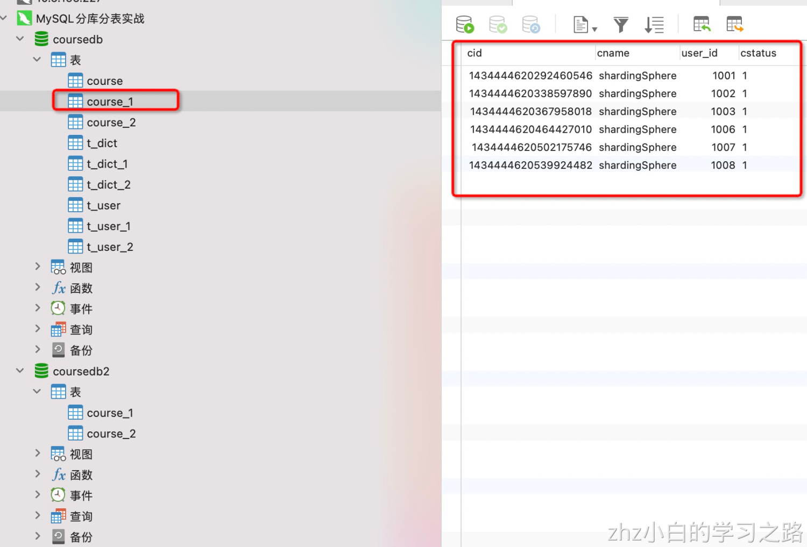

我们会发现course的course_1里面和course2里面的course_2里面有数据！！
测试查询：
```java
  @Test
     public void testQuery(){
         QueryWrapper<Course> queryWrapper=new QueryWrapper<>();
         //成功
 //        queryWrapper.eq("cid",1434444620292460546L);
         //成功
 //        queryWrapper.orderByAsc("cid");
         queryWrapper.between("cid",1434444618337914881L,1434444620539924482L);
         List<Course> courses = courseMapper.selectList(queryWrapper);
         courses.forEach(System.out::println);
     }
```
发现不能范围查询，因为inline是根据分区键玩的！！
### 2.3.3、**分片算法**

- 日常：使用的inline分片算法即提供一个分片键和一个分片表达式来制定分片算法。这种方式配置简单，功能灵活，是分库分表最佳的配置方式，并且对于绝大多数的分库分片场景来说，都已经非常好用了。
- 针对一些更为复杂的分片策略，例如多分片键、按范围分片等场景，inline分片算法就有点力不从心了
- 所以ShardingSphere目前提供了一共五种分片策略：
- 代码实现：配置：#配置数据源
```json
spring.shardingsphere.datasource.names=m1,m2
spring.shardingsphere.datasource.m1.type=com.alibaba.druid.pool.DruidDataSource
spring.shardingsphere.datasource.m1.driver-class-name=com.mysql.cj.jdbc.Driver
spring.shardingsphere.datasource.m1.url=jdbc:mysql://localhost:3306/coursedb?useUnicode=true&characterEncoding=utf8&useSSL=false&allowPublicKeyRetrieval=true&serverTimezone=GMT%2B8
spring.shardingsphere.datasource.m1.username=root
spring.shardingsphere.datasource.m1.password=root
 
#配置数据源
spring.shardingsphere.datasource.m2.type=com.alibaba.druid.pool.DruidDataSource
spring.shardingsphere.datasource.m2.driver-class-name=com.mysql.cj.jdbc.Driver
spring.shardingsphere.datasource.m2.url=jdbc:mysql://localhost:3306/coursedb2?useUnicode=true&characterEncoding=utf8&useSSL=false&allowPublicKeyRetrieval=true&serverTimezone=GMT%2B8
spring.shardingsphere.datasource.m2.username=root
spring.shardingsphere.datasource.m2.password=root
 
# 要生成多少张真实表（#配置真实表分布）
spring.shardingsphere.sharding.tables.course.actual-data-nodes=m$->{1..2}.course_$->{1..2}
# 表的主键是什么（主键生成策略）
spring.shardingsphere.sharding.tables.course.key-generator.column=cid
spring.shardingsphere.sharding.tables.course.key-generator.type=SNOWFLAKE
spring.shardingsphere.sharding.tables.course.key-generator.props.worker.id=1
 
spring.shardingsphere.sharding.tables.course.table-strategy.standard.sharding-column=cid
spring.shardingsphere.sharding.tables.course.table-strategy.standard.precise-algorithm-class-name=com.zhz.shardingspheredemo.algorithm.MyPreciseTableShardingAlgorithm
spring.shardingsphere.sharding.tables.course.table-strategy.standard.range-algorithm-class-name=com.zhz.shardingspheredemo.algorithm.MyRangeTableShardingAlgorithm
spring.shardingsphere.sharding.tables.course.database-strategy.standard.sharding-column=cid
spring.shardingsphere.sharding.tables.course.database-strategy.standard.precise-algorithm-class-name=com.zhz.shardingspheredemo.algorithm.MyPreciseDSShardingAlgorithm
spring.shardingsphere.sharding.tables.course.database-strategy.standard.range-algorithm-class-name=com.zhz.shardingspheredemo.algorithm.MyRangeDSShardingAlgorithm
 
#其他运行属性
spring.shardingsphere.props.sql.show=true
# 通过注册与现有定义同名的定义，设置是否允许覆盖 bean 定义 默认false
spring.main.allow-bean-definition-overriding=true
```
分片算法类：
```java
package com.zhz.shardingspheredemo.algorithm;
 
 import org.apache.shardingsphere.api.sharding.standard.PreciseShardingAlgorithm;
 import org.apache.shardingsphere.api.sharding.standard.PreciseShardingValue;
 
 import java.math.BigInteger;
 import java.util.Collection;
 
 
 /**
  * @Description: 精确的数据库分配算法
  *
  * @author zhouhengzhe
  * @date 2021/9/4下午3:24
  * @since
  */
 
 public class MyPreciseDSShardingAlgorithm implements PreciseShardingAlgorithm<Long> {
     //select * from course where cid = ? or cid in (?,?)
     @Override
     public String doSharding(Collection<String> availableTargetNames, PreciseShardingValue<Long> shardingValue) {
         String logicTableName = shardingValue.getLogicTableName();
         String cid = shardingValue.getColumnName();
         Long cidValue = shardingValue.getValue();
         //实现 course_$->{cid%2+1)
         BigInteger shardingValueB = BigInteger.valueOf(cidValue);
         BigInteger resB = (shardingValueB.mod(new BigInteger("2"))).add(new BigInteger("1"));
         String key = "m"+resB;
         if(availableTargetNames.contains(key)){
             return key;
         }
         //couse_1, course_2
         throw new UnsupportedOperationException("route "+ key +" is not supported ,please check your config");
     }
 } 
```
```java
package com.zhz.shardingspheredemo.algorithm;
 
 import org.apache.shardingsphere.api.sharding.standard.PreciseShardingAlgorithm;
 import org.apache.shardingsphere.api.sharding.standard.PreciseShardingValue;
 
 import java.math.BigInteger;
 import java.util.Collection;
 
 
 /**
  * @Description: 精确的表分配算法
  *
  * @author zhouhengzhe
  * @date 2021/9/4下午3:24
  * @since
  */
 public class MyPreciseTableShardingAlgorithm implements PreciseShardingAlgorithm<Long> {
     //select * from course where cid = ? or cid in (?,?)
     @Override
     public String doSharding(Collection<String> availableTargetNames, PreciseShardingValue<Long> shardingValue) {
         String logicTableName = shardingValue.getLogicTableName();
         String cid = shardingValue.getColumnName();
         Long cidValue = shardingValue.getValue();
         //实现 course_$->{cid%2+1)
         BigInteger shardingValueB = BigInteger.valueOf(cidValue);
         BigInteger resB = (shardingValueB.mod(new BigInteger("2"))).add(new BigInteger("1"));
         String key = logicTableName+"_"+resB;
         if(availableTargetNames.contains(key)){
             return key;
         }
         //couse_1, course_2
         throw new UnsupportedOperationException("route "+ key +" is not supported ,please check your config");
     }
 }
```
```java
 package com.zhz.shardingspheredemo.algorithm;
 
 import org.apache.shardingsphere.api.sharding.standard.RangeShardingAlgorithm;
 import org.apache.shardingsphere.api.sharding.standard.RangeShardingValue;
 
 import java.util.Arrays;
 import java.util.Collection;
 
 
 /**
  * @Description: 区间分配的分配算法（数据库）
  *
  * @author zhouhengzhe
  * @date 2021/9/4下午3:24
  * @since
  */
 public class MyRangeDSShardingAlgorithm implements RangeShardingAlgorithm<Long> {
     @Override
     public Collection<String> doSharding(Collection<String> availableTargetNames, RangeShardingValue<Long> shardingValue) {
         //select * from course where cid between 1 and 100;
         Long upperVal = shardingValue.getValueRange().upperEndpoint();//100
         Long lowerVal = shardingValue.getValueRange().lowerEndpoint();//1
 
         String logicTableName = shardingValue.getLogicTableName();
         return Arrays.asList("m1","m2");
     }
 }
```
```java
 package com.zhz.shardingspheredemo.algorithm;
 
 import org.apache.shardingsphere.api.sharding.standard.RangeShardingAlgorithm;
 import org.apache.shardingsphere.api.sharding.standard.RangeShardingValue;
 import sun.rmi.runtime.Log;
 
 import java.util.Arrays;
 import java.util.Collection;
 
 
 /**
  * @Description: 区间分配的分片算法（表）
  *
  * @author zhouhengzhe
  * @date 2021/9/4下午3:24
  * @since
  */
 public class MyRangeTableShardingAlgorithm implements RangeShardingAlgorithm<Long> {
     @Override
     public Collection<String> doSharding(Collection<String> availableTargetNames, RangeShardingValue<Long> shardingValue) {
         //select * from course where cid between 1 and 100;
         Long upperVal = shardingValue.getValueRange().upperEndpoint();//100
         Long lowerVal = shardingValue.getValueRange().lowerEndpoint();//1
 
         String logicTableName = shardingValue.getLogicTableName();
         return Arrays.asList(logicTableName+"_1",logicTableName+"_2");
     }
 }测试类   @Test
     public void queryOrderRange(){
         //select * from course
         QueryWrapper<Course> wrapper = new QueryWrapper<>();
         wrapper.between("cid",1434444618337914881L,1434444620539924482L);
 //        wrapper.in()
         List<Course> courses = courseMapper.selectList(wrapper);
         courses.forEach(course -> System.out.println(course));
     }
```
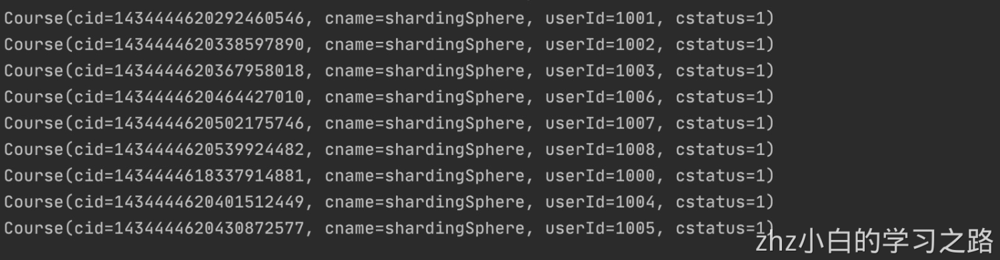
```json
#配置数据源
 spring.shardingsphere.datasource.names=m1,m2
 spring.shardingsphere.datasource.m1.type=com.alibaba.druid.pool.DruidDataSource
 spring.shardingsphere.datasource.m1.driver-class-name=com.mysql.cj.jdbc.Driver
 spring.shardingsphere.datasource.m1.url=jdbc:mysql://localhost:3306/coursedb?useUnicode=true&characterEncoding=utf8&useSSL=false&allowPublicKeyRetrieval=true&serverTimezone=GMT%2B8
 spring.shardingsphere.datasource.m1.username=root
 spring.shardingsphere.datasource.m1.password=root
 
 #配置数据源
 spring.shardingsphere.datasource.m2.type=com.alibaba.druid.pool.DruidDataSource
 spring.shardingsphere.datasource.m2.driver-class-name=com.mysql.cj.jdbc.Driver
 spring.shardingsphere.datasource.m2.url=jdbc:mysql://localhost:3306/coursedb2?useUnicode=true&characterEncoding=utf8&useSSL=false&allowPublicKeyRetrieval=true&serverTimezone=GMT%2B8
 spring.shardingsphere.datasource.m2.username=root
 spring.shardingsphere.datasource.m2.password=root
 
 # 要生成多少张真实表（#配置真实表分布）
 spring.shardingsphere.sharding.tables.course.actual-data-nodes=m$->{1..2}.course_$->{1..2}
 # 表的主键是什么（主键生成策略）
 spring.shardingsphere.sharding.tables.course.key-generator.column=cid
 spring.shardingsphere.sharding.tables.course.key-generator.type=SNOWFLAKE
 spring.shardingsphere.sharding.tables.course.key-generator.props.worker.id=1
 
 # 第三种
 spring.shardingsphere.sharding.tables.course.table-strategy.complex.sharding-columns= cid, user_id
 spring.shardingsphere.sharding.tables.course.table-strategy.complex.algorithm-class-name=com.zhz.shardingspheredemo.algorithm.MyComplexTableShardingAlgorithm
 
 spring.shardingsphere.sharding.tables.course.database-strategy.complex.sharding-columns=cid, user_id
 spring.shardingsphere.sharding.tables.course.database-strategy.complex.algorithm-class-name=com.zhz.shardingspheredemo.algorithm.MyComplexDSShardingAlgorithm
 
 #其他运行属性
 spring.shardingsphere.props.sql.show=true
 # 通过注册与现有定义同名的定义，设置是否允许覆盖 bean 定义 默认false
 spring.main.allow-bean-definition-overriding=true
```
算法类
```java
package com.zhz.shardingspheredemo.algorithm;
 
 import com.google.common.collect.Range;
 import org.apache.shardingsphere.api.sharding.complex.ComplexKeysShardingAlgorithm;
 import org.apache.shardingsphere.api.sharding.complex.ComplexKeysShardingValue;
 
 import java.math.BigInteger;
 import java.util.ArrayList;
 import java.util.Collection;
 import java.util.List;
 import java.util.Map;
 
 /**
  *
  * @author zhouhengzhe
  * @date 2021/9/4下午3:24
  * @since
  */
 public class MyComplexDSShardingAlgorithm implements ComplexKeysShardingAlgorithm<Long> {
 //    SELECT  cid,cname,user_id,cstatus  FROM course
 //    WHERE  cid BETWEEN ? AND ? AND user_id = ?
     @Override
     public Collection<String> doSharding(Collection<String> availableTargetNames, ComplexKeysShardingValue<Long> shardingValue) {
         Range<Long> cidRange = shardingValue.getColumnNameAndRangeValuesMap().get("cid");
         Collection<Long> userIdCol = shardingValue.getColumnNameAndShardingValuesMap().get("user_id");
 
         Long upperVal = cidRange.upperEndpoint();
         Long lowerVal = cidRange.lowerEndpoint();
 
         List<String> res = new ArrayList<>();
 
         for(Long userId: userIdCol){
             //course_{userID%2+1}
             BigInteger userIdB = BigInteger.valueOf(userId);
             BigInteger target = (userIdB.mod(new BigInteger("2"))).add(new BigInteger("1"));
 
             res.add("m"+target);
         }
 
         return res;
     }
 } 
```
```java
package com.zhz.shardingspheredemo.algorithm;
 
 import com.google.common.collect.Range;
 import org.apache.shardingsphere.api.sharding.complex.ComplexKeysShardingAlgorithm;
 import org.apache.shardingsphere.api.sharding.complex.ComplexKeysShardingValue;
 
 import java.math.BigInteger;
 import java.util.ArrayList;
 import java.util.Collection;
 import java.util.List;
 /**
  *
  * @author zhouhengzhe
  * @date 2021/9/4下午3:24
  * @since
  */
 
 public class MyComplexTableShardingAlgorithm implements ComplexKeysShardingAlgorithm<Long> {
     @Override
     public Collection<String> doSharding(Collection<String> availableTargetNames, ComplexKeysShardingValue<Long> shardingValue) {
         Range<Long> cidRange = shardingValue.getColumnNameAndRangeValuesMap().get("cid");
         Collection<Long> userIdCol = shardingValue.getColumnNameAndShardingValuesMap().get("user_id");
 
         Long upperVal = cidRange.upperEndpoint();
         Long lowerVal = cidRange.lowerEndpoint();
 
         List<String> res = new ArrayList<>();
 
         for(Long userId: userIdCol){
             //course_{userID%2+1}
             BigInteger userIdB = BigInteger.valueOf(userId);
             BigInteger target = (userIdB.mod(new BigInteger("2"))).add(new BigInteger("1"));
 
             res.add(shardingValue.getLogicTableName()+"_"+target);
         }
 
         return res;
     }
 }
```
测试类
```java
@Test
     public void queryCourseComplex(){
         QueryWrapper<Course> wrapper = new QueryWrapper<>();
         wrapper.between("cid",1434444618337914881L,1434444620539924482L);
         wrapper.eq("user_id",1009L);
 //        wrapper.in()
         List<Course> courses = courseMapper.selectList(wrapper);
         courses.forEach(course -> System.out.println(course));
     }
```
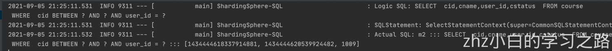

   - NoneShardingStrategy
      - 不分片。这种严格来说不算是一种分片策略了。只是ShardingSphere也提供了这么一个配置。
   - InlineShardingStrategy
      - 最常用的分片方式
      - 配置参数： inline.shardingColumn 分片键；inline.algorithmExpression分片表达式
      - 实现方式： 按照分片表达式来进行分片。
   - StandardShardingStrategy（解决区间查询）
      - 只支持单分片键的标准分片策略。
      - 配置参数：standard.sharding-column 分片键；standard.precise
      - algorithm-class-name 精确分片算法类名；standard.range-algorithm
      - class-name 范围分片算法类名
      - 实现方式：
         - shardingColumn指定分片算法。
         - preciseAlgorithmClassName指向一个实现了io.shardingsphere.api.algorithm.sharding.standard.PreciseShardingAlgorithm接口的java类名，提供按照 = 或者 IN 逻辑的精确分片 
         - rangeAlgorithmClassName 指向一个实现了io.shardingsphere.api.algorithm.sharding.standard.RangeShardingAlgorithm接口的java类名，提供按照Between 条件进行的范围分片。
      - 说明：
         - 其中精确分片算法是必须提供的，而范围分片算法则是可选的。
   - ComplexShardingStrategy（多字段查询）
      - 支持多分片键的复杂分片策略。
      - 配置参数：complex.sharding-columns 分片键(多个);complex.algorithm-class-name 分片算法实现类。
      - 实现方式：
         - shardingColumn指定多个分片列。
         - algorithmClassName指向一个实现了org.apache.shardingsphere.api.sharding.complex.ComplexKeysShardingAlgorithm接口的java类名。提供按照多个分片列进行综合分片的算法。
   - HintShardingStrategy（定制连表查询）
      - 不需要分片键的强制分片策略。这个分片策略，简单来理解就是说，他的分片键不再跟SQL语句相关联，而是用程序另行指定。对于一些复杂的情况，例如select count(*) from (select userid from t_user where userid in (1,3,5,7,9))这样的SQL语句，就没法通过SQL语句来指定一个分片键。这个时候就可以通过程序，给他另行执行一个分片键，例如在按userid奇偶分片的策略下，可以指定1作为分片键，然后自行指定他的分片策略。
         - 配置参数：hint.algorithm-class-name 分片算法实现类。
         - 实现方式：
            - algorithmClassName指向一个实现了org.apache.shardingsphere.api.sharding.hint.HintShardingAlgorithm接口的java类名。
         - 在这个算法类中，同样是需要分片键的。而分片键的指定是通过HintManager.addDatabaseShardingValue方法(分库)和HintManager.addTableShardingValue(分表)来指定。
         - 使用时要注意，这个分片键是线程隔离的，只在当前线程有效，所以通常建议使用之后立即关闭，或者用try资源方式打开。
      - 而Hint分片策略并没有完全按照SQL解析树来构建分片策略，是绕开了SQL解析的，所有对某些比较复杂的语句，Hint分片策略性能有可能会比较好。
```sql
 -- 不支持UNION 
 SELECT * FROM t_order1 UNION SELECT * FROM t_order2 INSERT INTO tbl_name (col1, col2, …) SELECT col1, col2, … FROM tbl_name WHERE col3 = ? 
 -- 不支持多层子查询 
 SELECT COUNT(*) FROM (SELECT * FROM t_order o WHERE o.id IN (SELECT id FROM t_order WHERE status = ?)) 
 -- 不支持函数计算。ShardingSphere只能通过SQL字面提取用于分片的值 
 SELECT * FROM t_order WHERE to_date(create_time, 'yyyy-mm-dd') = '2019-01-01';
```
配置类
```json
 #配置数据源
 spring.shardingsphere.datasource.names=m1,m2
 spring.shardingsphere.datasource.m1.type=com.alibaba.druid.pool.DruidDataSource
 spring.shardingsphere.datasource.m1.driver-class-name=com.mysql.cj.jdbc.Driver
 spring.shardingsphere.datasource.m1.url=jdbc:mysql://localhost:3306/coursedb?useUnicode=true&characterEncoding=utf8&useSSL=false&allowPublicKeyRetrieval=true&serverTimezone=GMT%2B8
 spring.shardingsphere.datasource.m1.username=root
 spring.shardingsphere.datasource.m1.password=root
 
 #配置数据源
 spring.shardingsphere.datasource.m2.type=com.alibaba.druid.pool.DruidDataSource
 spring.shardingsphere.datasource.m2.driver-class-name=com.mysql.cj.jdbc.Driver
 spring.shardingsphere.datasource.m2.url=jdbc:mysql://localhost:3306/coursedb2?useUnicode=true&characterEncoding=utf8&useSSL=false&allowPublicKeyRetrieval=true&serverTimezone=GMT%2B8
 spring.shardingsphere.datasource.m2.username=root
 spring.shardingsphere.datasource.m2.password=root
 
 # 要生成多少张真实表（#配置真实表分布）
 spring.shardingsphere.sharding.tables.course.actual-data-nodes=m$->{1..2}.course_$->{1..2}
 # 表的主键是什么（主键生成策略）
 spring.shardingsphere.sharding.tables.course.key-generator.column=cid
 spring.shardingsphere.sharding.tables.course.key-generator.type=SNOWFLAKE
 spring.shardingsphere.sharding.tables.course.key-generator.props.worker.id=1
 
 # 第四种
 spring.shardingsphere.sharding.tables.course.table-strategy.hint.algorithm-class-name=com.zhz.shardingspheredemo.algorithm.MyHintTableShardingAlgorithm
 
 #其他运行属性
 spring.shardingsphere.props.sql.show=true
 # 通过注册与现有定义同名的定义，设置是否允许覆盖 bean 定义 默认false
 spring.main.allow-bean-definition-overriding=true
```
算法类
```java
 package com.zhz.shardingspheredemo.algorithm;
 
 import org.apache.shardingsphere.api.sharding.hint.HintShardingAlgorithm;
 import org.apache.shardingsphere.api.sharding.hint.HintShardingValue;
 
 import java.util.Arrays;
 import java.util.Collection;
 
 /**
  *
  * @author zhouhengzhe
  * @date 2021/9/4下午3:24
  * @since
  */
 
 public class MyHintTableShardingAlgorithm implements HintShardingAlgorithm<Integer> {
     @Override
     public Collection<String> doSharding(Collection<String> availableTargetNames, HintShardingValue<Integer> shardingValue) {
         String key = shardingValue.getLogicTableName() + "_" + shardingValue.getValues().toArray()[0];
         if(availableTargetNames.contains(key)){
             return Arrays.asList(key);
         }
         throw new UnsupportedOperationException("route "+ key +" is not supported ,please check your config");
     }
 }
```
测试类：
```java
 @Test
     public void queryCourseByHint(){
         HintManager hintManager = HintManager.getInstance();
         hintManager.addTableShardingValue("course",2);
         List<Course> courses = courseMapper.selectList(null);
         courses.forEach(course -> System.out.println(course));
         hintManager.close();
     }
```
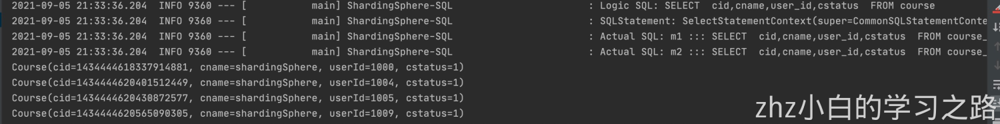
### 2.3.4、广播表
course，course2中都有一张表t_dict
```sql
 CREATE TABLE `t_dict` (
   `dict_id` bigint(20) NOT NULL,
   `ustatus` varchar(100) CHARACTER SET latin1 NOT NULL,
   `uvalue` varchar(100) CHARACTER SET latin1 NOT NULL,
   PRIMARY KEY (`dict_id`)
 ) ENGINE=InnoDB DEFAULT CHARSET=utf8mb4;
```
配置类
```json
 #配置数据源
 spring.shardingsphere.datasource.names=m1,m2
 spring.shardingsphere.datasource.m1.type=com.alibaba.druid.pool.DruidDataSource
 spring.shardingsphere.datasource.m1.driver-class-name=com.mysql.cj.jdbc.Driver
 spring.shardingsphere.datasource.m1.url=jdbc:mysql://localhost:3306/coursedb?useUnicode=true&characterEncoding=utf8&useSSL=false&allowPublicKeyRetrieval=true&serverTimezone=GMT%2B8
 spring.shardingsphere.datasource.m1.username=root
 spring.shardingsphere.datasource.m1.password=root
 
 #配置数据源
 spring.shardingsphere.datasource.m2.type=com.alibaba.druid.pool.DruidDataSource
 spring.shardingsphere.datasource.m2.driver-class-name=com.mysql.cj.jdbc.Driver
 spring.shardingsphere.datasource.m2.url=jdbc:mysql://localhost:3306/coursedb2?useUnicode=true&characterEncoding=utf8&useSSL=false&allowPublicKeyRetrieval=true&serverTimezone=GMT%2B8
 spring.shardingsphere.datasource.m2.username=root
 spring.shardingsphere.datasource.m2.password=root
 
 # 要生成多少张真实表（#配置真实表分布）
 spring.shardingsphere.sharding.tables.course.actual-data-nodes=m$->{1..2}.course_$->{1..2}
 # 表的主键是什么（主键生成策略）
 spring.shardingsphere.sharding.tables.course.key-generator.column=cid
 spring.shardingsphere.sharding.tables.course.key-generator.type=SNOWFLAKE
 spring.shardingsphere.sharding.tables.course.key-generator.props.worker.id=1
 
 # 第四种
 spring.shardingsphere.sharding.tables.course.table-strategy.hint.algorithm-class-name=com.zhz.shardingspheredemo.algorithm.MyHintTableShardingAlgorithm
 
 # 第五种 广播表（数据不变化）
 spring.shardingsphere.sharding.broadcast-tables=t_dict
 spring.shardingsphere.sharding.tables.t_dict.key-generator.column=dict_id
 spring.shardingsphere.sharding.tables.t_dict.key-generator.type=SNOWFLAKE
 
 #其他运行属性
 spring.shardingsphere.props.sql.show=true
 # 通过注册与现有定义同名的定义，设置是否允许覆盖 bean 定义 默认false
 spring.main.allow-bean-definition-overriding=true
```
测试类
```java
  @Test
     public void addDict(){
         Dict d1 = new Dict();
         d1.setUstatus("1");
         d1.setUvalue("zc");
         dictMapper.insert(d1);
 
         Dict d2 = new Dict();
         d2.setUstatus("0");
         d2.setUvalue("bzc");
         dictMapper.insert(d2);
      dictMapper.insert(user);
     }
```
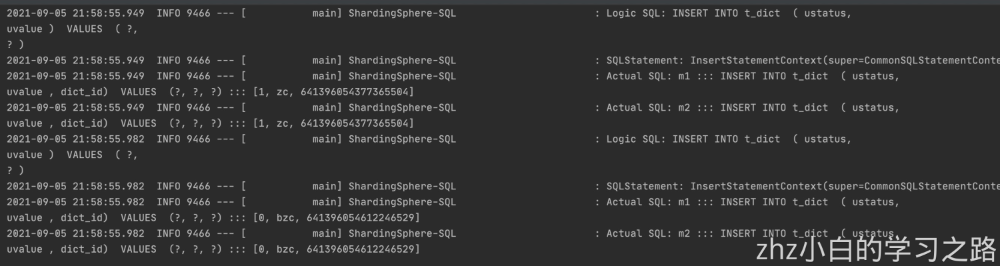
### 2.3.5、绑定表
配置类
```java
 spring.shardingsphere.datasource.names=m1
 spring.shardingsphere.datasource.m1.type=com.alibaba.druid.pool.DruidDataSource
 spring.shardingsphere.datasource.m1.driver-class-name=com.mysql.cj.jdbc.Driver
 spring.shardingsphere.datasource.m1.url=jdbc:mysql://localhost:3306/coursedb?useUnicode=true&characterEncoding=utf8&useSSL=false&allowPublicKeyRetrieval=true&serverTimezone=GMT%2B8
 spring.shardingsphere.datasource.m1.username=root
 spring.shardingsphere.datasource.m1.password=root
 
 spring.shardingsphere.sharding.tables.t_dict.actual-data-nodes=m1.t_dict_$->{1..2}
 
 spring.shardingsphere.sharding.tables.t_dict.key-generator.column=dict_id
 spring.shardingsphere.sharding.tables.t_dict.key-generator.type=SNOWFLAKE
 spring.shardingsphere.sharding.tables.t_dict.key-generator.props.worker.id=1
 spring.shardingsphere.sharding.tables.t_dict.table-strategy.inline.sharding-column=ustatus
 spring.shardingsphere.sharding.tables.t_dict.table-strategy.inline.algorithm-expression=t_dict_$->{ustatus.toInteger()%2+1}
 
 spring.shardingsphere.sharding.tables.user.actual-data-nodes=m1.t_user_$->{1..2}
 spring.shardingsphere.sharding.tables.user.key-generator.column=user_id
 spring.shardingsphere.sharding.tables.user.key-generator.type=SNOWFLAKE
 spring.shardingsphere.sharding.tables.user.key-generator.props.worker.id=1
 spring.shardingsphere.sharding.tables.user.table-strategy.inline.sharding-column=ustatus
 spring.shardingsphere.sharding.tables.user.table-strategy.inline.algorithm-expression=t_user_$->{ustatus.toInteger()%2+1}
 #\u7ED1\u5B9A\u8868\u793A\u4F8B
 spring.shardingsphere.sharding.binding-tables[0]=user,t_dict
 
 #其他运行属性
 spring.shardingsphere.props.sql.show=true
 # 通过注册与现有定义同名的定义，设置是否允许覆盖 bean 定义 默认false
 spring.main.allow-bean-definition-overriding=true
```
测试类
```java
  @Test
     public void addDict(){
         Dict d1 = new Dict();
         d1.setUstatus("1");
         d1.setUvalue("zc");
         dictMapper.insert(d1);
 
         Dict d2 = new Dict();
         d2.setUstatus("0");
         d2.setUvalue("bzc");
         dictMapper.insert(d2);
 
         for(int i = 0 ; i < 10 ; i ++){
             User user = new User();
             user.setUsername("user No "+i);
             user.setUstatus(""+(i%2));
             user.setUage(i*10);
             userMapper.insert(user);
         }
     }
```
结果
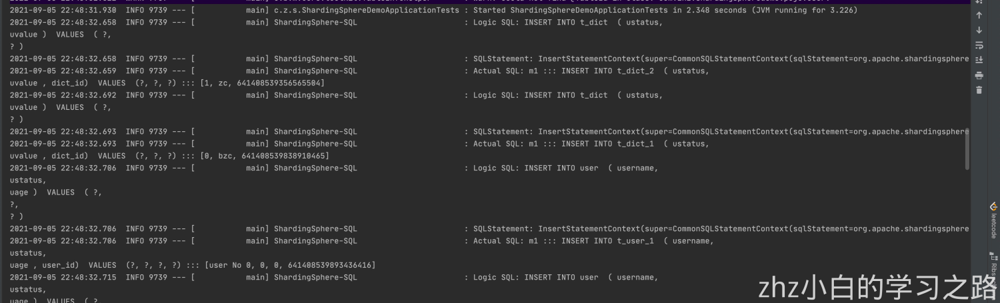
测试类
```java
 @Test
     public void queryUserStatus(){
         List<User> users = userMapper.queryUserStatus();
         users.forEach(user -> System.out.println(user));
     }
```

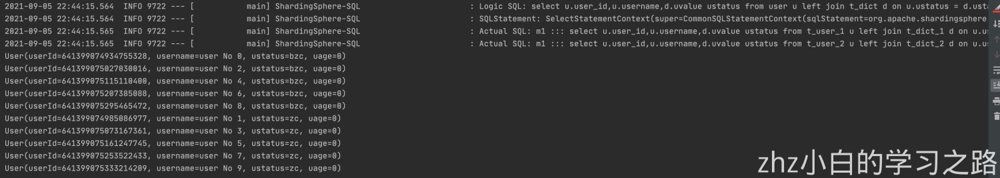
由上面数据知道两个库的表都是奇偶分的！！！
## 2.4、SQL使用限制
地址：[https://shardingsphere.apache.org/document/current/cn/features/sharding/use-norms/sql/](https://shardingsphere.apache.org/document/current/cn/features/sharding/use-norms/sql/)
**支持的SQL**
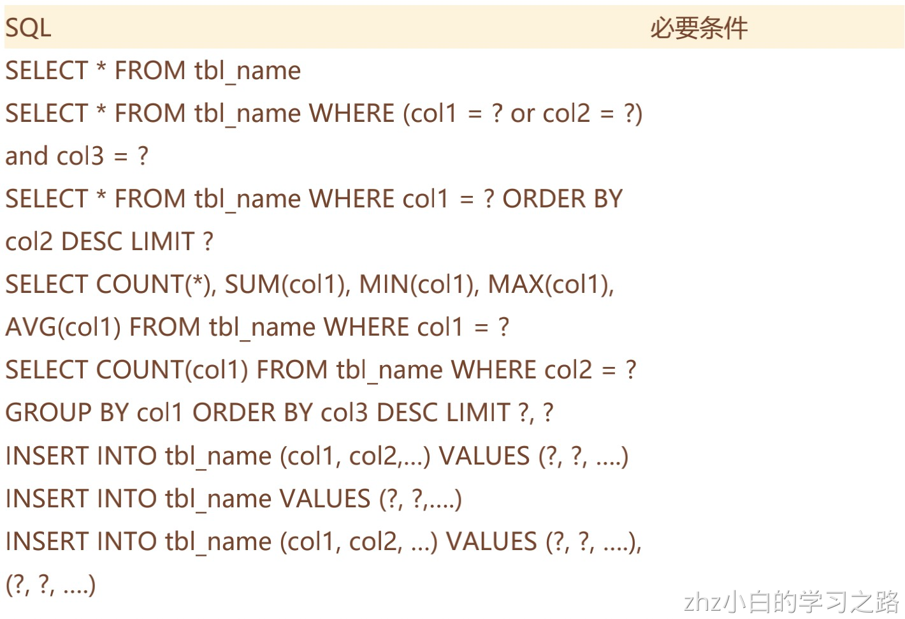
**不支持的SQL**
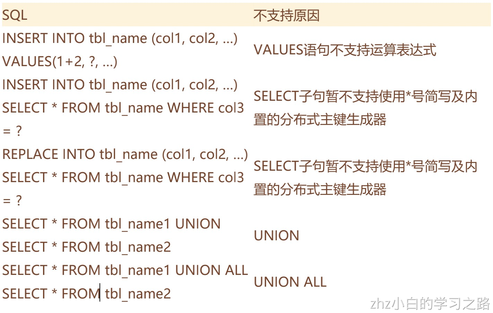
*DISTINCT支持情况详细说明**
**支持的SQL**
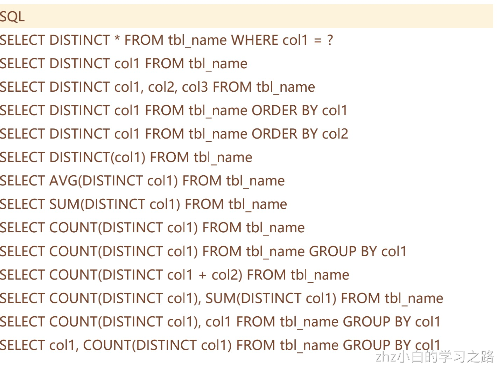
**不支持的SQL**
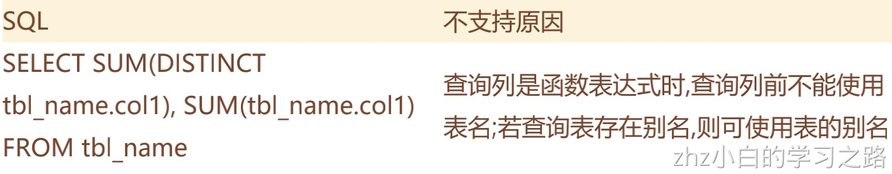
## 2.5、分库分表带来的问题
1、分库分表，其实围绕的都是一个核心问题，就是单机数据库容量的问题。我们要了解，在面对这个问题时，解决方案是很多的，并不止分库分表这一种。但是ShardingSphere的这种分库分表，是希望在软件层面对硬件资源进行管理，从而便于对数据库的横向扩展，这无疑是成本很小的一种方式。

大家想想还有哪些比较好的解决方案？

2、一般情况下，如果单机数据库容量撑不住了，应先从缓存技术着手降低对数据库的访问压力。如果缓存使用过后，数据库访问量还是非常大，可以考虑数据库读写分离策略。如果数据库压力依然非常大，且业务数据持续增长无法估量，最后才考虑分库分表，单表拆分数据应控制在1000万以内。

当然，随着互联网技术的不断发展，处理海量数据的选择也越来越多。在实际进行系统设计时，最好是用MySQL数据库只用来存储关系性较强的热点数据，而对海量数据采取另外的一些分布式存储产品。例如PostGreSQL、VoltDB甚至HBase、Hive、ES等这些大数据组件来存储。

3、从上一部分ShardingJDBC的分片算法中我们可以看到，由于SQL语句的功能实在太多太全面了，所以分库分表后，对SQL语句的支持，其实是步步为艰的，稍不小心，就会造成SQL语句不支持、业务数据混乱等很多很多问题。所以，实际使用时，我们会建议这个分库分表，能不用就尽量不要用。
如果要使用优先在OLTP场景下使用，优先解决大量数据下的查询速度问题。而在OLAP场景中，通常涉及到非常多复杂的SQL，分库分表的限制就会更加明显。当然，这也是ShardingSphere以后改进的一个方向。
4、如果确定要使用分库分表，就应该在系统设计之初开始对业务数据的耦合程度和使用情况进行考量，尽量控制业务SQL语句的使用范围，将数据库往简单的增删改查的数据存储层方向进行弱化。并首先详细规划垂直拆分的策略，使数据层架构清晰明了。而至于水平拆分，会给后期带来非常非常多的数据问题，所以应该谨慎、谨慎再谨慎。一般也就在日志表、操作记录表等很少的一些边缘场景才偶尔用用。

