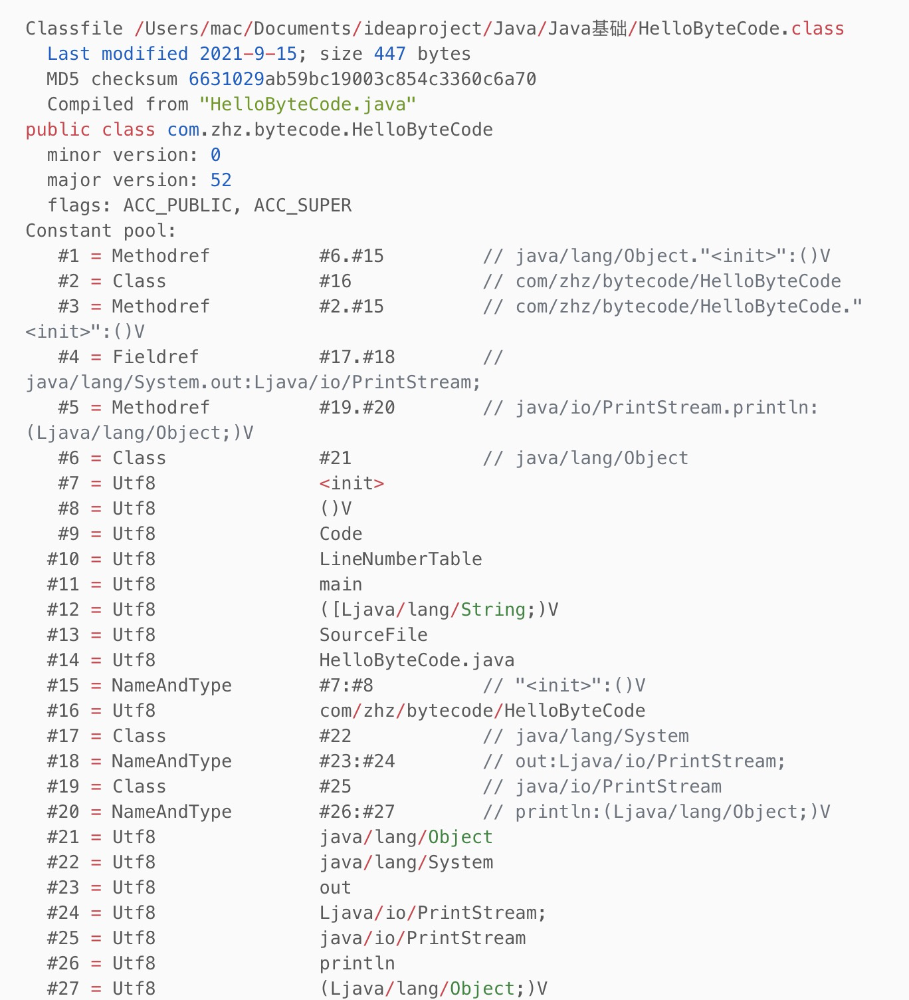

# 1、JVM基础

## 1.1、JDK，JRE，JVM关系

**JDK**

- JDK（Java Development Kit） 是用于开发 Java 应用程序的软件开发工具集合，包括 了 Java 运行时的环境（JRE）、解释器（Java）、编译器（javac）、Java 归档 （jar）、文档生成器（Javadoc）等工具。简单的说我们要开发Java程序，就需要安 装某个版本的JDK工具包。

**JRE**

- JRE（Java Runtime Enviroment ）提供 Java 应用程序执行时所需的环境，由 Java 虚拟机（JVM）、核心类、支持文件等组成。简单的说，我们要是想在某个机器上运 行Java程序，可以安装JDK，也可以只安装JRE，后者体积比较小。

**JVM**

- Java Virtual Machine（Java 虚拟机）有三层含义，分别是： JVM规范要求 满足 JVM 规范要求的一种具体实现（一种计算机程序） 一个 JVM 运行实例，在命令提示符下编写 Java 命令以运行 Java 类时，都会创建一 个 JVM 实例，我们下面如果只记到JVM则指的是这个含义；如果我们带上了某种JVM 的名称，比如说是Zing JVM，则表示上面第二种含义

**JDK 与 JRE、JVM 之间的关系**
JDK > JRE > JVM

- JDK = JRE + 开发工具
- JRE = JVM + 类库


三者在开发运行Java程序时的交互关系： 简单的说，就是通过JDK开发的程序，编译以后，可以打包分发给其他装有JRE的机器上去运行 而运行的程序，则是通过java命令启动的一个JVM实例，代码逻辑的执行都运行在这个JVM实例上

Java程序的开发运行过程为： 我们利用 JDK （调用 Java API）开发Java程序，编译成字节码或者打包程序。然后可以用 JRE 则启动一个JVM实例，加载、验证、执行 Java 字节码以及依赖库，运行Java程序 而JVM 将程序和依赖库的Java字节码解析并变成本地代码执行，产生结果

# 2、Java字节码

## 2.1、定义

- Java字节码是JVM的指令集
- JVM加载字节码格式的class文件，检验之后通过JIT编译器转换为本地机器代码执行。
- Java字节码就是JVM执行的指令格式

## 2.2、操作码

- Java bytecode 由单字节( byte )的指令组成，理论上最多支持256 个操作码(opcode)。实际上Java只使用了200左右的操作码， 还有一些操作码则保留给调试操作。
- 操作码， 下面称为 指令 , 主要由 类型前缀 和 操作名称 两部分组成。

## 2.3、指令性质

- 1. 栈操作指令，包括与局部变量交互的指令
- 2. 程序流程控制指令
- 3. 对象操作指令，包括方法调用指令
- 4. 算术运算以及类型转换指令

## 2.4、字节码的分类

1. 栈操作指令，包括与局部变量交互的指令
2. 程序流程控制指令
3. 对象操作指令，包括方法调用指令
4. 算术运算以及类型转换指令

## 2.5、字节码阅读

源码：

```java
package com.zhz.bytecode;

/**
 * @author zhouhengzhe
 * @Description: TODO
 * @date 2021/9/15下午7:57
 * @since
 */

public class HelloByteCode {
    public static void main(String[] args) {
        HelloByteCode helloByteCode=new HelloByteCode();
        System.out.println(helloByteCode);
    }
}
```

第一步先：

```java
javac HelloByteCode.java    =》  会生成一个HelloByteCode.class
```

> - Javac 不指定 -d 参数编译后生成的 .class 文件默认和源代码在同一个目录。 注意: javac 工具默认开启了优化功能, 生成的字节码中没有局部变量表(LocalVariableTable)，相当于 局部变量名称被擦除。如果需要这些调试信息, 在编译时请加上 -g 选项。
> - JDK自带工具的详细用法, 请使用: javac -help 或者 javap -help 来查看;

打开 HelloByteCode.class

```java
cafe babe 0000 0034 001c 0a00 0600 0f07
0010 0a00 0200 0f09 0011 0012 0a00 1300
1407 0015 0100 063c 696e 6974 3e01 0003
2829 5601 0004 436f 6465 0100 0f4c 696e
654e 756d 6265 7254 6162 6c65 0100 046d
6169 6e01 0016 285b 4c6a 6176 612f 6c61
6e67 2f53 7472 696e 673b 2956 0100 0a53
6f75 7263 6546 696c 6501 0012 4865 6c6c
6f42 7974 6543 6f64 652e 6a61 7661 0c00
0700 0801 001e 636f 6d2f 7a68 7a2f 6279
7465 636f 6465 2f48 656c 6c6f 4279 7465
436f 6465 0700 160c 0017 0018 0700 190c
001a 001b 0100 106a 6176 612f 6c61 6e67
2f4f 626a 6563 7401 0010 6a61 7661 2f6c
616e 672f 5379 7374 656d 0100 036f 7574
0100 154c 6a61 7661 2f69 6f2f 5072 696e
7453 7472 6561 6d3b 0100 136a 6176 612f
696f 2f50 7269 6e74 5374 7265 616d 0100
0770 7269 6e74 6c6e 0100 1528 4c6a 6176
612f 6c61 6e67 2f4f 626a 6563 743b 2956
0021 0002 0006 0000 0000 0002 0001 0007
0008 0001 0009 0000 001d 0001 0001 0000
0005 2ab7 0001 b100 0000 0100 0a00 0000
0600 0100 0000 0a00 0900 0b00 0c00 0100
0900 0000 3000 0200 0200 0000 10bb 0002
59b7 0003 4cb2 0004 2bb6 0005 b100 0000
0100 0a00 0000 0e00 0300 0000 0c00 0800
0d00 0f00 0e00 0100 0d00 0000 0200 0e
```

> javap -c -verbose HelloByteCode


```text
Classfile /Users/mac/Documents/ideaproject/Java/Java基础/HelloByteCode.class
  Last modified 2021-9-15; size 447 bytes
  MD5 checksum 6631029ab59bc19003c854c3360c6a70
  Compiled from "HelloByteCode.java"
public class com.zhz.bytecode.HelloByteCode
  minor version: 0
  major version: 52
  flags: ACC_PUBLIC, ACC_SUPER
Constant pool:
   #1 = Methodref          #6.#15         // java/lang/Object."<init>":()V
   #2 = Class              #16            // com/zhz/bytecode/HelloByteCode
   #3 = Methodref          #2.#15         // com/zhz/bytecode/HelloByteCode."<init>":()V
   #4 = Fieldref           #17.#18        // java/lang/System.out:Ljava/io/PrintStream;
   #5 = Methodref          #19.#20        // java/io/PrintStream.println:(Ljava/lang/Object;)V
   #6 = Class              #21            // java/lang/Object
   #7 = Utf8               <init>
   #8 = Utf8               ()V
   #9 = Utf8               Code
  #10 = Utf8               LineNumberTable
  #11 = Utf8               main
  #12 = Utf8               ([Ljava/lang/String;)V
  #13 = Utf8               SourceFile
  #14 = Utf8               HelloByteCode.java
  #15 = NameAndType        #7:#8          // "<init>":()V
  #16 = Utf8               com/zhz/bytecode/HelloByteCode
  #17 = Class              #22            // java/lang/System
  #18 = NameAndType        #23:#24        // out:Ljava/io/PrintStream;
  #19 = Class              #25            // java/io/PrintStream
  #20 = NameAndType        #26:#27        // println:(Ljava/lang/Object;)V
  #21 = Utf8               java/lang/Object
  #22 = Utf8               java/lang/System
  #23 = Utf8               out
  #24 = Utf8               Ljava/io/PrintStream;
  #25 = Utf8               java/io/PrintStream
  #26 = Utf8               println
  #27 = Utf8               (Ljava/lang/Object;)V
{
  public com.zhz.bytecode.HelloByteCode();
    descriptor: ()V
    flags: ACC_PUBLIC
    Code:
      stack=1, locals=1, args_size=1
         0: aload_0
         1: invokespecial #1                  // Method java/lang/Object."<init>":()V
         4: return
      LineNumberTable:
        line 10: 0

  public static void main(java.lang.String[]);
    descriptor: ([Ljava/lang/String;)V
    flags: ACC_PUBLIC, ACC_STATIC
    Code:
      stack=2, locals=2, args_size=1
         0: new           #2                  // class com/zhz/bytecode/HelloByteCode
         3: dup
         4: invokespecial #3                  // Method "<init>":()V
         7: astore_1
         8: getstatic     #4                  // Field java/lang/System.out:Ljava/io/PrintStream;
        11: aload_1
        12: invokevirtual #5                  // Method java/io/PrintStream.println:(Ljava/lang/Object;)V
        15: return
      LineNumberTable:
        line 12: 0
        line 13: 8
        line 14: 15
}
SourceFile: "HelloByteCode.java"
```


> 上面的字节码详解

super()：

无参构造函数的参数个数居然不是0: stack=1, locals=1,args_size=1 。 这是因为在 Java 中, 如果是静态方法则没有 this 引用。 对于非静态方法， this 将被分配到局部变量表的第0号槽位中

> 我们通过查看编译后的class文件证实了其中**存在默认构造函数**，所以这是**Java编译器**生成的， 而不是**运行时JVM**自动生成的。** 自动生成的构造函数，其方法体应该是空的**，但这里看到里面有一些指令。为什么呢？ 再次回顾Java知识, 每个构造函数中都会先调用 super 类的构造函数对吧？ 但这不是JVM自动执行的, 而是由程序指令控制，所以默认构造函数中也就有一些字节码指令来干这个事情。


---
java/lang/Object：


> 默认继承了 Object 类
---
main

可以看到方法描述: **([Ljava/lang/String;)V **：

- 其中小括号内是入参信息/形参信息,
- 左方括号表述数组,
- **L** 表示对象,
- 后面的 **java/lang/String** 就是类名称
- 小括号后面的 **V** 则表示这个方法的返回值是 **void**
- 方法的访问标志也很容易理解 **flags: ACC_PUBLIC, ACC_STATIC **，表示**public和static **
- 还可以看到执行该方法时需要的栈(stack)深度是多少，需要在局部变量表中保留多少个槽位, 还有方法的参 数个数: **stack=2, locals=2, args_size=1** 。把上面这些整合起来其实就是一个方法：

> - **public static void main(java.lang.String[]); **
> - 注：实际上我们一般把一个方法的修饰符+名称+参数类型清单+返回值类型，合在一起叫“方法签名”， 即这些信息可以完整的表示一个方法。
> - main 方法中创建了该类的一个实例， 然后就return了
---

常量池：

> **常量池** 大家应该都听说过, 英文是 **Constant pool** 。这里做一个强调: 大多数时候指的是**运行时常量池** 。但运行时常量池里面的常量是从哪里来的呢? 主要就是由 class 文件中的**常量池结构体**组成的。



> - 其中显示了很多关于class文件信息： **编译时间， MD5校验和， 从哪个 .java 源文件编译得来，符合哪个版本的Java语言规范**等等。
> - 还可以看到 **ACC_PUBLIC** 和 **ACC_SUPER** 访问标志符。
> - **ACC_PUBLIC** 标志很容易理解：这个类是 **public** 类，因此用**这个标志**来表示。 但 **ACC_SUPER** 标志是怎么回事呢？ 这就是历史原因, JDK1.0 的BUG修正中引入 **ACC_SUPER** 标志来修正 **invokespecial** 指令调用 **super** 类方法的问题，从 Java 1.1 开始， 编译器一般都会自动生成**ACC_SUPER** 标志。
---
解释   #1,   #2,   #3


 ```text
#3=#2.#15=#16.#15=#16.#7:#8=com/zhz/bytecode/HelloByteCode."<init>":()V
```
总结一下，常量池就是一个常量的大字典，使用编号的方式把程序里用到的各类常量统一管理起来，这样在字节码操作里，只需要引用编号即可。
```text
#1 = Methodref          #6.#15         // java/lang/Object."<init>":()V
```
解读如下:
```text

- #1 常量编号, 该文件中其他地方可以引用。
- = 等号就是分隔符.
- Methodref 表明这个常量指向的是一个方法；具体是哪个类的哪个方法呢?
    -  类指向的 #4 , 方法签 名指向的 #13 ; 当然双斜线注释后面已经解析出来可读性比较好的说明了。

```

## 2.5、线程栈与字节码执行模型

JVM是一台**基于栈**的计算机器。每个线程都有一个独属于自己的线程栈(JVM stack)，用于存储栈帧 (Frame)。每一次方法调用，**JVM都会自动创建一个栈帧**。 **栈帧** 由 **操作数栈** ，** 局部变量数组** 以及一 个** class引用** 组成。 class引用 指向当前方法在运行时常量池中对应的class)。

**局部变量数组** 也称为 **局部变量表 (LocalVariableTable)**, 其中包含了**方法的参数，**以及**局部变量**。 局部变 量数组的大小在编译时就已经确定: 和**局部变量+形参的个数**有关，还要看**每个变量/参数占用多少个字节**。** 操作数栈是一个LIFO结构的栈**， 用于**压入和弹出值**。 它的大小也在编译时确定。
有一些操作码/指令可以将值压入“**操作数栈**”； 还有一些操作码/指令则是从栈中获取操作数，并进行处理， 再将结果压入栈。操作数栈还用于接收调用其他方法时返回的结果值。

## 2.6、方法体中的字节码解读

main方法里面的字节码：

```java
 		 0: new           #2                  // class com/zhz/bytecode/HelloByteCode
         3: dup
         4: invokespecial #3                  // Method "<init>":()V
         7: astore_1
         8: getstatic     #4                  // Field java/lang/System.out:Ljava/io/PrintStream;
        11: aload_1
        12: invokevirtual #5                  // Method java/io/PrintStream.println:(Ljava/lang/Object;)V
        15: return
```

> - 有一部分操作码会附带有操作数, 也会占用字节码数组中的空间
> - new 就会占用三个槽位: 一个用于存放操作码指令自身，两个用于存放操作数
> - 下一条指令 dup 的索引从 3 开始


从字节码中可以看到

> 链接：[JVM字节码指令手册](2、JVM字节码指令手册.md)

## 2.6、字节码的运行时结构


- JVM 是一台基于栈的计算机器。
- 每个线程都有一个独属于自己的线程栈（JVM Stack），用于存储栈帧（Frame）。
- 每一次方法调用、JVM 都会自动创建一个栈帧。
- 栈帧由操作数栈、 局部变量数组以及一个 Class 引用组成。
- Class 引用指向当前方法在运行时常量池中对应的 Class。