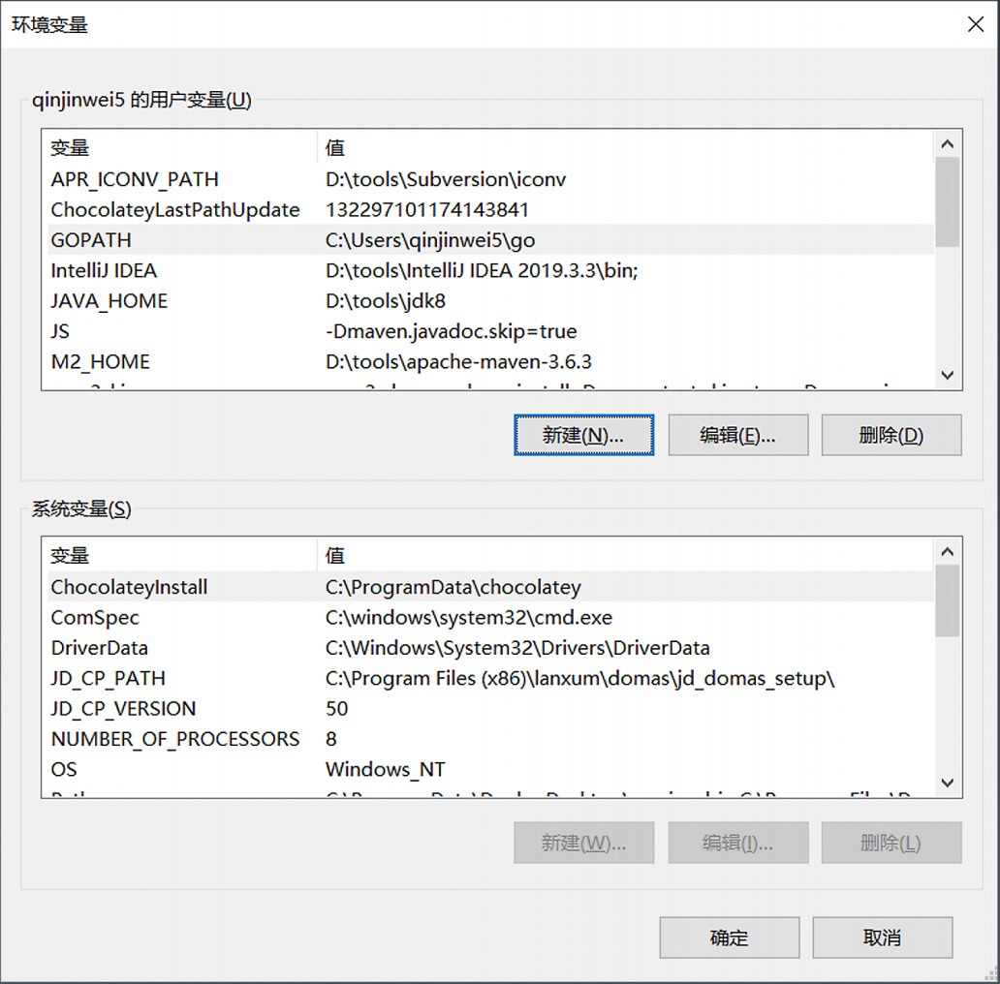
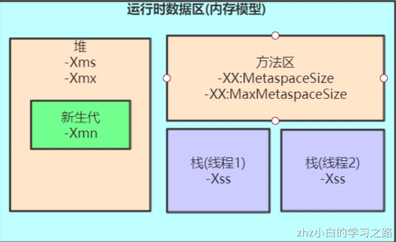
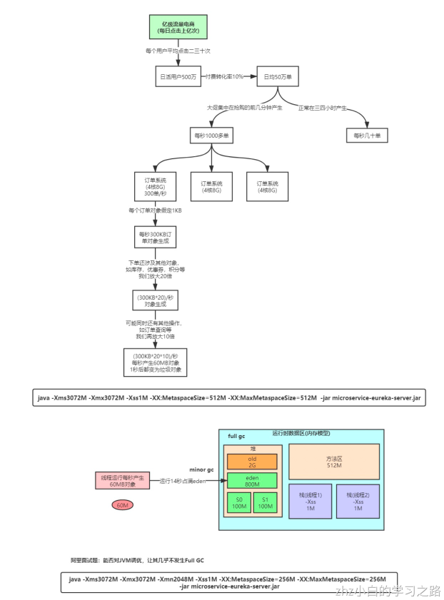
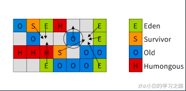
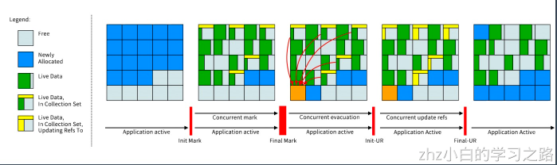

- 以 - 开头为标准参数，所有的 JVM 都要实现这些参数，并且向后兼容。
- -D 设置系统属性。
- 以 -X 开头为非标准参数， 基本都是传给 JVM 的，默认 JVM 实现这些参数的功能，但是并不保证所有 JVM 实现都满足，且不保证向后兼容。 可以使用 java -X 命令来查看当前 JVM 支持的非标准参数。
- 以 –XX：开头为非稳定参数, 专门用于控制 JVM的行为，跟具体的 JVM 实现有关，随时可能会在下个版本取消。
- -XX：+-Flags 形式, +- 是对布尔值进行开关。
- -XX：key=value 形式, 指定某个选项的值。

# 1、系统属性参数



- 全局定义设置
    - -Dfile.encoding=UTF-8 -Duser.timezone=GMT+08
    - -Dmaven.test.skip=true
    - -Dio.netty.eventLoopThreads=8
- 代码定义设置
    - System.setProperty("a","A100");
    - String a=System.getProperty("a");

# 2、运行模式参数

- -server：设置 JVM 使用 server 模式，特点是启动速度比较慢，但运行时性能和内存管理效率很高，适用于生产环境。在具有 64 位能力的 JDK 环境下将默认启用该模式，而忽略 -client 参数。
- -client ：JDK1.7 之前在32位的 x86 机器上的默认值是 -client 选项。设置 JVM 使用 client 模式，特点是启动速度比较快，但运行时性能和内存管理效率不高，通常用于客户端应用程序或者 PC 应用开发和调试。此外，我们知道 JVM 加载字节码后，可以解释执行，也可以编译成本地代码再执行，所以可以配置 JVM 对字节码的处理模式。
- -Xint：在解释模式（interpreted mode）下运行，-Xint 标记会强制 JVM 解释执行所有的字节码，这当然会降低运行速度，通常低10倍或更多。
- -Xcomp：-Xcomp 参数与-Xint 正好相反，JVM 在第一次使用时会把所有的字节码编译成本地代码，从而带来最大程度的优化。【注意预热】
- -Xmixed：-Xmixed 是混合模式，将解释模式和编译模式进行混合使用，有 JVM 自己决定，这是 JVM 的默认模式，也是推荐模式。 我们使用 java -version 可以看到 mixed mode 等信息。

# 3、堆内存设置参数


- Xmx、Xms、Xmn、Meta、DirectMemory、Xss的关系


Spring Boot程序的JVM参数设置格式(Tomcat启动直接加在bin目录下catalina.sh文件里)：

>  java ‐Xms2048M ‐Xmx2048M ‐Xmn1024M ‐Xss512K ‐XX:MetaspaceSize=256M ‐XX:MaxMetaspaceSize=256M ‐jar microservice‐eurek a‐server.jar

解释：

- -Xmx, 指定最大堆内存。 如 -Xmx4g。这只是限制了 Heap 部分的最大值为4g。这个内存不包括栈内存，也不包括堆外使用的内存。
- -Xms, 指定堆内存空间的初始大小。 如 -Xms4g。 而且指定的内存大小，并不是操作系统实际分配的初始值，而是GC先规划好，用到才分配。 专用服务器上需要保持 –Xms 和 –Xmx 一致，否则应用刚启动可能就有好几个 FullGC。当两者配置不一致时，堆内存扩容可能会导致性能抖动。
- -Xmn, 等价于 -XX:NewSize，使用 G1 垃圾收集器 不应该 设置该选项，在其他的某些业务场景下可以设置。官方建议设置为 -Xmx 的 1/2 ~ ¼。
- -XX：MaxMetaspaceSize=size, 设置元空间最大值，Java8 默认是-1，即不限制 Meta 空间，或者说只受限于本地内存大小，一般不允许设置该选项。
- -XX：MetaspaceSize： 指定元空间触发Fullgc的初始阈值(元空间无固定初始大小)， 以字节为单位，默认是21M，达到该值就会触发 full gc进行类型卸载， 同时收集器会对该值进行调整： 如果释放了大量的空间， 就适当降低该值； 如果释放了很少的空间， 那么在不超过-XX：MaxMetaspaceSize（如果设置了的话） 的情况下， 适当提高该值。这个跟早期jdk版本的-XX:PermSize参数意思不一样，-XX:PermSize代表永久代的初始容量。-XX：MaxPermSize=size, 这是 JDK1.7 之前使用的。Java8 默认允许的Meta空间无限大，此参数无效。
- -XX：MaxDirectMemorySize=size，系统可以使用的最大堆外内存，这个参数跟 -Dsun.nio.MaxDirectMemorySize 效果相同。
- -Xss, 设置每个线程栈的字节数，影响栈的深度，默认是1M。 例如 -Xss1m 指定线程栈为1MB，与-XX:ThreadStackSize=1m 等价。
- 一般建议在JVM参数中将MetaspaceSize和MaxMetaspaceSize设置成一样的值，并设置得比初始值要大， 对于8G物理内存的机器来说，一般我会将这两个值都设置为256M。（由于调整元空间的大小需要Full GC，这是非常昂贵的操作，如果应用在启动的时候发生大量Full GC，通常都是由于永久代或元空间发生 了大小调整）

StackOverflowError示例

```java
// JVM设置 ‐Xss128k(默认1M) 
public class StackOverflowTest {
    static int count = 0;
    static void redo() { 
        count++; 
        redo(); 
    }
    public static void main(String[] args) { 
        try { 
            redo();
        } catch (Throwable t) {
            t.printStackTrace(); 
            System.out.println(count); 
        } 
    } 
}
```

结论：-Xss设置越小count值越小，说明一个线程栈里能分配的栈帧就越少，但是对JVM整体来说能开启的线程数会更多


- 结论：尽可能让对象都在新生代里分配和回收，尽量别 让太多对象频繁进入老年代，避免频繁对老年代进行垃圾回收，同时给系统充足的内存大小，避免新生代频繁的进行垃 圾回收。

# 4、GC 设置参数




- -XX：+UseG1GC：使用 G1 垃圾回收器
- -XX：+UseConcMarkSweepGC：使用 CMS 垃圾回收器
- -XX：+UseSerialGC：使用串行垃圾回收器
- -XX：+UseParallelGC：使用并行垃圾回收器

// Java 11+

- -XX：+UnlockExperimentalVMOptions -XX:+UseZGC

// Java 12+

- -XX：+UnlockExperimentalVMOptions -XX:+UseShenandoahGC

# 5、分析诊断参数

- -XX：+-HeapDumpOnOutOfMemoryError 选项，当 OutOfMemoryError 产生，即内存溢出（堆内存或持久代) 时，自动 Dump 堆内存。
    - 示例用法： java -XX:+HeapDumpOnOutOfMemoryError -Xmx256m ConsumeHeap
- -XX：HeapDumpPath 选项，与 HeapDumpOnOutOfMemoryError 搭配使用，指定内存溢出时 Dump 文件的目录。如果没有指定则默认为启动 Java 程序的工作目录。
    - 示例用法： java -XX:+HeapDumpOnOutOfMemoryError -XX:HeapDumpPath=/usr/local/ ConsumeHeap 自动 Dump 的 hprof 文件会存储到 /usr/local/ 目录下。
- -XX：OnError 选项，发生致命错误时（fatal error）执行的脚本。例如, 写一个脚本来记录出错时间, 执行一些命令，或者 curl 一下某个在线报警的 url。
    - 示例用法：java -XX:OnError="gdb - %p" MyApp  可以发现有一个 %p 的格式化字符串，表示进程 PID。
- -XX：OnOutOfMemoryError 选项，抛出 OutOfMemoryError 错误时执行的脚本。
- -XX：ErrorFile=filename 选项，致命错误的日志文件名,绝对路径或者相对路径。
- -Xdebug -Xrunjdwp:transport=dt_socket,server=y,suspend=n,address=1506，远程调试。

# 6、JavaAgent 参数

- Agent 是 JVM 中的一项黑科技，可以通过无侵入方式来做很多事情，比如注入 AOP 代码，执行统计等等，权限非常大。
- 设置 agent 的语法如下：
    - -agentlib:libname[=options] 启用 native 方式的 agent，参考 LD_LIBRARY_PATH 路径。
    - -agentpath:pathname[=options] 启用 native 方式的 agent。 -javaagent:jarpath[=options] 启用外部的 agent 库，比如 pinpoint.jar 等等。
    - -Xnoagent 则是禁用所有 agent。
- 以下示例开启 CPU 使用时间抽样分析：
    - JAVA_OPTS="-agentlib:hprof=cpu=samples,file=cpu.samples.log"

# 7、分代收集的相关JVM参数

| 参数                         | 作用                                      | 默认值 |
| ---------------------------- | ----------------------------------------- | ------ |
| -XX:NewRatio=n               | 老年代：新生代内存大小比值                | 2      |
| -XX:SurvivorRatio=n          | 伊甸园：survivor区内存大小比值            | 8      |
| -XX:PretenureSizeThreshold=n | 对象大小该值就在老年代分配，0表示不做限制 | 0      |
| -Xms                         | 最小堆内存                                | -      |
| -Xmx                         | 最大堆内存                                | -      |
| -Xmn                         | 新生代大小                                | -      |
| -XX:+DisableExplicitGC       | 忽略掉System.gc()的调用                   | 启用   |
| -XX:NewSize=n                | 新生代初始内存大小                        | -      |
| -XX:MaxNewSize=n             | 新生代最大内存                            | -      |