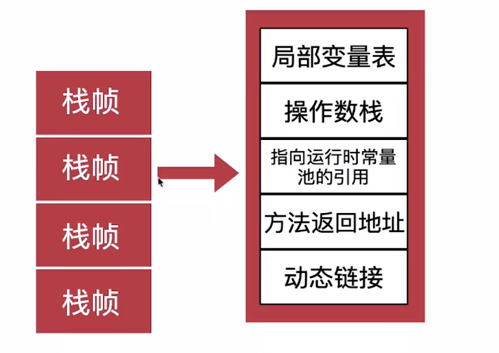

# 1、栈溢出

- Java虚拟机规范
    - 如果线程请求的栈深度大于虚拟机所允许的最大深度，将抛出StackOverFlowError
    - 如果虚拟机的栈内存允许动态扩展，当无法申请到足够的内存时，将抛出OutOfMemoryError
- Hotspot
    - 栈内存不可扩展
    - 统一用Xss设置栈的大小
        - 有的虚拟机可以用Xss设置虚拟机栈，Xoss设置本地方法栈

样例一

```java
package com.zhz.jvm.tuning;

// 默认配置：17868
// Xss144k：498
//栈内存溢出
public class StackOOMTest1 {
    private int stackLength = 1;

    private void stackLeak() {
        stackLength++;
        this.stackLeak();
    }

    public static void main(String[] args) {
        StackOOMTest1 oom = new StackOOMTest1();
        try {
            oom.stackLeak();
        } catch (Throwable e) {
            System.out.println("stack length:" + oom.stackLength);
            throw e;
        }
    }
}
```

样例二：

```java
package com.zhz.jvm.tuning;

// 默认配置：1538
// Xss144k：29
//栈内存溢出
public class StackOOMTest2 {
    private int stackLength = 1;

    private void stackLeak() {
        long unused1, unused2, unused3, unused4, unused5,
            unused6, unused7, unused8, unused9, unused10,
            unused11, unused12, unused13, unused14, unused15,
            unused16, unused17, unused18, unused19, unused20,
            unused21, unused22, unused23, unused24, unused25,
            unused26, unused27, unused28, unused29, unused30,
            unused31, unused32, unused33, unused34, unused35,
            unused36, unused37, unused38, unused39, unused40,
            unused41, unused42, unused43, unused44, unused45,
            unused46, unused47, unused48, unused49, unused50,
            unused51, unused52, unused53, unused54, unused55,
            unused56, unused57, unused58, unused59, unused60,
            unused61, unused62, unused63, unused64, unused65,
            unused66, unused67, unused68, unused69, unused70,
            unused71, unused72, unused73, unused74, unused75,
            unused76, unused77, unused78, unused79, unused80,
            unused81, unused82, unused83, unused84, unused85,
            unused86, unused87, unused88, unused89, unused90,
            unused91, unused92, unused93, unused94, unused95,
            unused96, unused97, unused98, unused99, unused100 = 0;
        stackLength++;
        this.stackLeak();
    }

    public static void main(String[] args) {
        StackOOMTest2 oom = new StackOOMTest2();
        try {
            oom.stackLeak();
        } catch (Error e) {
            System.out.println("stack length:" + oom.stackLength);
            throw e;
        }
    }
}
```

解释：


由图可以知道，当一个栈帧有大量的局部变量，则代表创建的栈帧数量越小（因为栈内存固定，单栈帧越大，总栈帧越小）
样例三：

```java
package com.zhz.jvm.tuning;

import org.slf4j.Logger;
import org.slf4j.LoggerFactory;

import java.util.concurrent.atomic.AtomicInteger;

/**
 * 注：
 * 本示例可能会造成机器假死，请慎重测试！！！
 * 本示例可能会造成机器假死，请慎重测试！！！
 * 本示例可能会造成机器假死，请慎重测试！！！
 * =======
 * -Xms=10m -Xmx=10m -Xss=144k -XX:MetaspaceSize=10m
 * =======
 * cat /proc/sys/kernel/threads-max
 * - 作用：系统支持的最大线程数，表示物理内存决定的理论系统进程数上限，一般会很大
 * - 修改：sysctl -w kernel.threads-max=7726
 * =======
 * cat /proc/sys/kernel/pid_max
 * - 作用：查看系统限制某用户下最多可以运行多少进程或线程
 * - 修改：sysctl -w kernel.pid_max=65535
 * =======
 * cat /proc/sys/vm/max_map_count
 * - 作用：限制一个进程可以拥有的VMA(虚拟内存区域)的数量，虚拟内存区域是一个连续的虚拟地址空间区域。
 * 在进程的生命周期中，每当程序尝试在内存中映射文件，链接到共享内存段，或者分配堆空间的时候，这些区域将被创建。
 * - 修改：sysctl -w vm.max_map_count=262144
 * =======
 * * ulimit –u
 * * - 作用：查看用户最多可启动的进程数目
 * * - 修改：ulimit -u 65535
 *
 * 栈内存溢出
 */
public class StackOOMTest3 {
    public static final Logger LOGGER = LoggerFactory.getLogger(StackOOMTest3.class);
    private AtomicInteger integer = new AtomicInteger();

    private void dontStop() {
        while (true) {
        }
    }

    public void newThread() {
        while (true) {
            Thread thread = new Thread(new Runnable() {
                @Override
                public void run() {
                    dontStop();
                }
            });
            thread.start();
            LOGGER.info("线程创建成功，threadName = {}", thread.getName());

            integer.incrementAndGet();
        }
    }

    public static void main(String[] args) {
        StackOOMTest3 oom = new StackOOMTest3();
        try {
            oom.newThread();
        } catch (Throwable throwable) {
            LOGGER.info("创建的线程数：{}", oom.integer);
            LOGGER.error("异常发生", throwable);
            System.exit(1);
        }
    }
}
```

# 如何运行更多的线程？

- 减少Xss配置
- 栈能分配的内存
    - 机器总内存-操作系统内存-堆内存-方法区内存-程序计数器内存-直接内存
- 尽量杀死其他程序
- 操作系统对线程数目的限制
