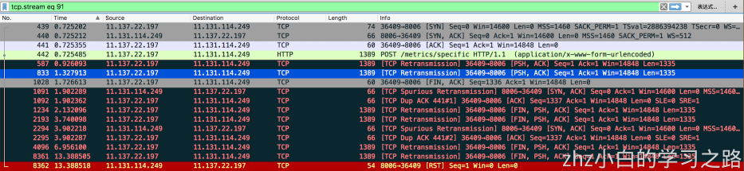

### 一、案件背景

近日，一个线上应用开始频繁报警：异常日志、接口rt超时、load高、tcp重传率高等等。现场监控如下：

从基础监控来看，cpu使用率不算特别异常，而load高说明等待cpu资源的线程队列长，配合rt上涨来看，推测是线程出现了堆积，而线程堆积一般有两种情况：

- 线程内部处理耗时变长：比如缓存未命中、被下游请求block、慢sql、循环逻辑耗时等。
- JVM因GC、锁擦除等jvm操作原因触发stop the world，导致线程等待。

下面进一步定位问题。

### 二、问题定位

#### 线程耗时变长？

因为应用重度依赖缓存，一起排查问题的同学发现tair成功率也有下降，于是找tair同学开始排查。

tair的同学表示集群正常，观察同机房其他应用读写tair也正常，推测问题还是出在应用自身。（其实应用自身负载高时，会引起tair超时和序列化失败，表象来看都像tair有问题，心疼下tair的同学。。。）

另外从db监控来看也没有慢sql出现，近期也没有逻辑改动较大的发布，暂时从其他方向看看。

#### STW

接下来比较醒目的就是GC监控了，监控如下：

可以看到问题期间GC次数和耗时明显上升，这里需要注意，因为GC监控里CMS(或G1)和Full GC都会归到Full GC里，所以登到机器上看看gc.log。

这里看到Metadata GC Threshold引起Full GC的字样较多，回收情况也很差（382626K->381836K）再通过jstat看下使用情况：

这里看到M区(metaspace)使用率是73.22%，而FGC平均每秒一次，GC前后O区(old gen)变化不大，可以确定是metaspace泄漏导致的Full GC。

值得注意：M区没到100%（73.22%），为什么会频繁触发fullGC呢？
> 原因是classloader加过多时，会引起metaspace的碎片化问题。后面会进一步解释classloader过多原因。

到此，原因可以确定是FullGC伴随的大量STW引起了线程堆积。下面继续定位为什么metaspace会出现泄漏。

#### groovy动态类加载问题

对付GC问题，堆dump是最好的排查手段。话不多说，psp进行dump。针对metaspace(Perm gen)的泄漏问题，从看"类加载器视图"和"重复类定义"能很快定位泄漏对象，如下：

可以发现，类加载器中上千个GroovyClassLoader&innerLoader，另外类定义里的Comp_XXX也是应用里使用的groovy类，原来是踩到groovy重复加载会导致泄漏的坑。

简单来说，每次通过groovyClassLoader.parseClass()方法记载class时，都会生成一个GroovyClassLoader&innerLoader，并且因为代码设计问题无法被卸载。
具体原因这篇文章有详细说明：[groovy脚本加载导致的FullGC问题](https://www.atatech.org/articles/30998)

但是令人疑惑的是，应用对编译出来的class都做了内存cache，命中就直接返回不再编译，为什么这里出现重复加载呢？

原来代码里通过guava cacheBuilder实现的内存cache，同时设置了缓存队列大小和弱引用
CacheBuilder.newBuilder().maximumSize(1000).softValues().build();
有两种可能导致缓存未命中，进而重新编译
- 达到maxSize
- softReference：回收阈值受使用频率和GC后空间大小影响，堆资源紧缺时，使用频率低会被回收

一开始怀疑是softReference会被回收，因为需要缓存的对象（官方模块）只有几十个，去掉softValues后跑一会，发现还是会复现问题，于是dump里查看缓存对象数量：
发现对象数量达到了1000，说明存在淘汰的对象，再次使用这些对象会重复编译，进而导致泄漏。
后续查看缓存对象，是一些不需要编译的三方模块，和同学确定是一次变更，把大量不需要编译的对象（三方模块）也缓存进来。修复方案分析如下：

- 官方模块数量少，需要编译，加载成本高
- 三方模块数量多，不需要编译，加载成本低
- 两者进行分开缓存，针对官方模块进行强引用缓存，针对三方模块进行弱引用缓存，并设置失效时间

发布上线后，运行良好。

### 三、后言

于此，问题原因已经水落石出，集群问题期间出现的表现，比如load高、rt高、cpu上涨、tair成功率下降通过gc引起的stw都可以合理解释。
但tcp重传率上涨的原因是什么呢？所有现象如果没有合理解释清楚，怕有问题遗漏，下面尝试分析下原因：

#### TCP重传率

TCP重传一种是为了保证数据可靠性的机制，其原理是在发送某一个数据以后就开启一个计时器，在一定时间内如果没有得到发送的数据报的ACK，那么就重新发送数据，直到发送成功为止。
TCP相关问题排查步骤大致如下

- tcp抓包：sudo tcpdump -i eth0 -w ~/11131114249_fgc_tcpdump1.cap
- 通过oss上传11131114249_fgc_tcpdump1.cap，然后下载到本地
- 用wireshark对cap文件进行分析

通过wireshark打开dump文件后，对重传相关的报文进行过滤：tcp.analysis.retransmissionransis

抓包机器是11.131.114.249，发现出现tcp重传的端口都是8006，追踪一条tcp流看看

发现对端（11.137.22.197）尝试通过对8006进行HTTP POST /metrics/specific 进行请求，但8006端口长时间未ACK，于是对端进行了大量retry。

这里需要解释8006端口是哪个进程的？是做什么的？为什么没有及时ACK？

> 通过netstat可以看到8006端口是java(1970)进程的，也就是tomcat直接暴露的。而8006是metrics的agent暴露给外部采集机器数据用的端口。

因为agent挂在在JVM进程里，网络io线程自然也受JVM STW影响，导致ACK不及时，从而引起对端TCP重传。
小小延展下，对比一下80端口的情况，没有出现TCP重传。

原因自然是因为80端口由nginx暴露，然后反向代理给7001端口(JVM)，所以JVM的STW不会对nginx ack有影响，而只会影响HTTP的返回时间。
相较BIO模式下的tomcat，NIO的nginx擅长做TCP建联，这大概也是在同机部署tomcat和nginx的一点益处。

#### 小心“并发症”的扰乱

另外一点感想是，在多次排查线上问题时，比如出现各种“病症”：机器load飙高、GC变多、内存上涨、线程数开始堆积、RT升高、HSF大量超时、tair失败率上升、流量曲线集中等等。

一旦应用因为某个“病因”出现情况，就会出现很多“病症”，这些“病症”绝大部分都是“并发症”，是由“病因”引起的连锁反应，孰是因孰是果呢？
> 比如tair集群如果出现问题，导致读取失败，那么依赖缓存的应用肯定会出现rt变长，线程数开始堆积，进而导致内存上涨，FGC，load上涨等问题。
而反过来看，如同本例，GC太过频繁，也会导致tair成功率下降，和其他类似现象。
我们需要快速判断，找到“病因”才能准确止血。
这里的一点心得是:
>- 先救命再治病：首先想办法止血，尝试重启、回滚，保留一两台现场
>- 系统一定要做好监控，这样病发现场才能有迹可循
>- 利用监控对各个“病症”出现时间进行比对，找到谁前谁后，前者往往大概率就是"病因"，后者是"并发症"

本例中，FGC开始出现的时间，比tair成功率下降、HSF流量异常出现时间早2分钟左右，由此判定前者是因，后者都是果。

原文地址：[https://developer.aliyun.com/article/603830](