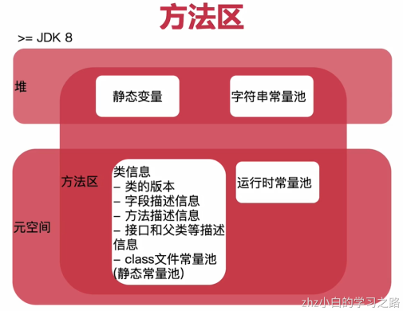
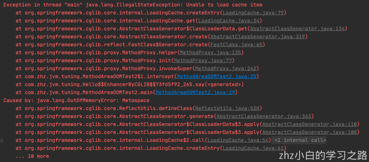

# 1、实践

- 线程共享，用来存储被虚拟机加载的类型信息、常量、静态变量等



样例一：

```java
package com.zhz.jvm.tuning;


import java.util.HashSet;
import java.util.Set;

/**
 * JDK 6: -XX:PermSize=6m -XX:MaxPermSize=6m
 * 报永久代溢出(java.lang.OutOfMemoryError: PermGen space)
 * ==========
 * JDK 7: -XX:PermSize=6m -XX:MaxPermSize=6m
 * 不报错，原因：JDK 7把字符串常量池放到堆了，设置-Xmx6m会报堆内存溢出
 * ==========
 * JDK 8+：同JDK 7
 */
public class MethodAreaOOMTest1 {
    public static void main(String[] args) {
        // 使用Set保持着常量池引用
        Set<String> set = new HashSet<String>();
        int i = 0;
        while (true) {
            // intern()：native方法
            // 如果字符串常量池里面已经包含了等于字符串x的字符串；那么
            // 就返回常量池中这个字符串的引用
            // 如果常量池中不存在，那么就会把当前字符串添加到常量池，
            // 并返回这个字符串的引用
            set.add(String.valueOf(i++).intern());
        }
    }
}
```

样例二：-XX:MetaspaceSize=10m -XX:MaxMetaspaceSize=10m

```java
package com.zhz.jvm.tuning;

import org.springframework.cglib.proxy.Enhancer;
import org.springframework.cglib.proxy.MethodInterceptor;
import org.springframework.cglib.proxy.MethodProxy;

import java.lang.reflect.Method;


public class MethodAreaOOMTest2 {
    /**
     * CGLib：https://blog.csdn.net/yaomingyang/article/details/82762697
     *
     * @param args 参数
     */
    public static void main(String[] args) {
        while (true) {
            Enhancer enhancer = new Enhancer();
            enhancer.setSuperclass(Hello.class);
            enhancer.setUseCache(false);
            enhancer.setCallback(new MethodInterceptor() {
                public Object intercept(Object obj, Method method, Object[] args, MethodProxy proxy) throws Throwable {
                    System.out.println("Enhanced hello");
                    // 调用Hello.say()
                    return proxy.invokeSuper(obj, args);
                }
            });
            Hello enhancedOOMObject = (Hello) enhancer.create();
            enhancedOOMObject.say();
            System.out.println(enhancedOOMObject.getClass().getName());
        }
    }
}

class Hello {
    public void say() {
        System.out.println("Hello Student");
    }
}
```

产生的问题：



# 2、场景

- 常量池里对象太大
- 加载的类的"种类"太多
    - 动态代理的操作库生成了大量的动态类
    - JSP项目
    - 脚本语言动态类加载
        - [https://developer.aliyun.com/article/603830](https://developer.aliyun.com/article/603830)

# 3、避免方法区溢出

- 根据JDK版本，为常量池保留足够的空间

    - JDK6：设大PermSize、MaxPermSize

    - >=JDK7：设大Xms、Xmx

- 防止类加载过多导致的溢出

    - <=JDK7：设大PermSize、MaxPermSize

    - >JDK8：留空元空间相关的配置，或合理设置大小的元空间

| 属性                      | 作用                                                         | 默认值           |
| ------------------------- | ------------------------------------------------------------ | ---------------- |
| -XX:MetaspaceSize         | 元空间的初始值，元空间占用达到该值就会触发垃圾手气，进行类型卸载，同时，收集器户自动调整该值。如果能够释放空间，就会自动降低该值；如果释放空间很小，那么在不超过-XX:MaxMetaspaceSize的情况下，可适当提高该值 | 21810376字节     |
| -XX:MaxMetaspaceSize      | 元空间最大值                                                 | 受限本地内存大小 |
| -XX:MinMetaspaceFreeRatio | 垃圾收集后，计算当前元空间的空闲百分比，如果小于该值，就增加元空间的大小 | 40%              |
| -XX:MaxMetaspaceFreeRatio | 垃圾收集后，计算当前元空间的空闲百分比，如果大于该值，就减少元空间的大小 | 70%              |
| -XX:MinMetaspaceException | 元空间增长时的最小幅度                                       | 340784字节       |
| -XX:MaxMetaspaceException | 元空间增长时的最小幅度                                       | 5452592字节      |

