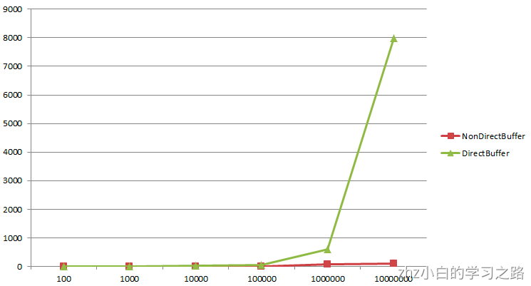
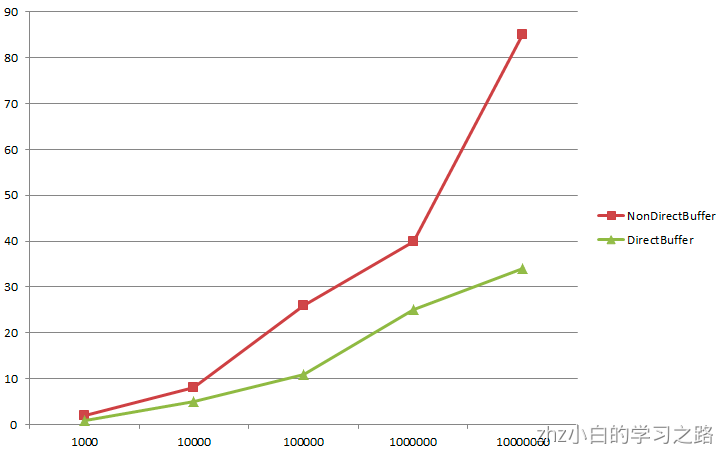

## 什么是直接内存与非直接内存

根据官方文档的描述：

> A byte buffer is either direct or non-direct. Given a direct byte buffer, the Java virtual machine will make a best effort to perform native I/O operations directly upon it. That is, it will attempt to avoid copying the buffer's content to (or from) an intermediate buffer before (or after) each invocation of one of the underlying operating system's native I/O operations.

**byte byffer**可以是两种类型，一种是基于直接内存（也就是非堆内存）；另一种是非直接内存（也就是堆内存）。
对于直接内存来说，JVM将会在IO操作上具有更高的性能，因为它直接作用于本地系统的IO操作。而非直接内存，也就是堆内存中的数据，如果要作IO操作，会先复制到直接内存，再利用本地IO处理。
从数据流的角度，非直接内存是下面这样的作用链：

> 本地IO_-->直接内存-->非直接内存-->直接内存-->本地IO_

而直接内存是：

> 本地IO_-->直接内存-->本地IO_

很明显，再做IO处理时，比如网络发送大量数据时，直接内存会具有更高的效率。

> A direct byte buffer may be created by invoking the allocateDirect factory method of this class. The buffers returned by this method typically have somewhat higher allocation and deallocation costs than non-direct buffers. The contents of direct buffers may reside outside of the normal garbage-collected heap, and so their impact upon the memory footprint of an application might not be obvious. It is therefore recommended that direct buffers be allocated primarily for large, long-lived buffers that are subject to the underlying system_'s native I/O operations. In general it is best to allocate direct buffers only when they yield a measureable gain in program performance._

但是，不要高兴的太早。文档中也说了，直接内存使用allocateDirect创建，但是它比申请普通的堆内存需要耗费更高的性能。不过，这部分的数据是在JVM之外的，因此它不会占用应用的内存。
所以呢，当你有很大的数据要缓存，并且它的生命周期又很长，那么就比较适合使用直接内存。只是一般来说，如果不是能带来很明显的性能提升，还是推荐直接使用堆内存。
关于直接内存需要注意的，就是上面两点了，其他的关于视图啊、作用链啊，都是使用上的问题了。如果有兴趣，可以[参考官方API ( 进去后搜索ByteBuffer，就能看到！)](http://docs.oracle.com/javase/8/docs/api/)，里面有少量的描述！重要的一些用法，还得自己摸索。

## 使用场景

通过上面的官方文档，与一些资料的搜索。可以总结下，直接内存的使用场景：

- 1 有很大的数据需要存储，它的生命周期又很长
- 2 适合频繁的IO操作，比如网络并发场景

## 申请分配地址速度比较

下面用一段简单的代码，测试下申请内存空间的速度：

```java
int time = 10000000;
Date begin = new Date();
for(int i=0;i<time;i++){
    ByteBuffer buffer = ByteBuffer.allocate(2);
}
Date end = new Date();
System.out.println(end.getTime()-begin.getTime());
begin = new Date();
for(int i=0;i<time;i++){
    ByteBuffer buffer = ByteBuffer.allocateDirect(2);
}
end = new Date();
System.out.println(end.getTime()-begin.getTime());
```

得到的测试结果如下：

在数据量提升时，直接内存相比于非直接内存的申请 有十分十分十分明显的性能问题！

## 读写速度比较

然后在写段代码，测试下读写的速度：

```java
int time = 1000;
Date begin = new Date();
ByteBuffer buffer = ByteBuffer.allocate(2*time);
for(int i=0;i<time;i++){
    buffer.putChar('a');
}
buffer.flip();
for(int i=0;i<time;i++){
    buffer.getChar();
}
Date end = new Date();
System.out.println(end.getTime()-begin.getTime());
begin = new Date();
ByteBuffer buffer2 = ByteBuffer.allocateDirect(2*time);
for(int i=0;i<time;i++){
    buffer2.putChar('a');
}
buffer2.flip();
for(int i=0;i<time;i++){
    buffer2.getChar();
}
end = new Date();
System.out.println(end.getTime()-begin.getTime());
```

测试的结果如下：

可以看到直接内存在直接的IO操作上，还是有明显的差异的！