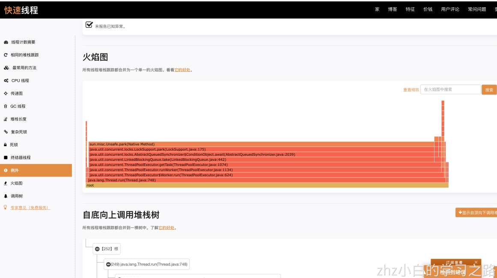

```java
package com.zhz.jvm.tuning;

import com.google.common.util.concurrent.ThreadFactoryBuilder;
import org.apache.commons.io.FileUtils;
import org.slf4j.Logger;
import org.slf4j.LoggerFactory;

import java.io.File;
import java.util.concurrent.*;

public class SlowTest {
    private static final Logger LOGGER = LoggerFactory.getLogger(SlowTest.class);
    private static final ScheduledThreadPoolExecutor SCHEDULER = new ScheduledThreadPoolExecutor(10,
        new ThreadFactoryBuilder()
            .setNameFormat("my-scheduler-%d")
            .build(),
        new ThreadPoolExecutor.AbortPolicy()
    );

    public void schedule() {
        SCHEDULER.scheduleAtFixedRate(new Runnable() {
            @Override
            public void run() {
                deal();
            }
            // 1. 这里每5秒执行1次定时任务，是为了迅速获得效果
            // 2. 实际项目中，定时任务的时间可以从数据库里获得
        }, 0, 100, TimeUnit.SECONDS);
    }

    private void deal() {
        // 模拟某公司有10个园区，每个园区弄1个线程池去执行
        for (int campusNo = 1; campusNo <= 10; campusNo++) {
            ThreadPoolExecutor threadPoolExecutor = new ThreadPoolExecutor(
                10,
                10,
                10L,
                TimeUnit.SECONDS,
                new LinkedBlockingQueue<>(100),
                new ThreadFactoryBuilder()
                    .setNameFormat("my-thread-pool-%d")
                .build(),
                new ThreadPoolExecutor.AbortPolicy()
            );
            try {
                // 模拟每个园区有8幢楼(实际项目中是查库获得)
                for (int buildingNo = 1; buildingNo <= 8; buildingNo++) {
                    int finalBuildingNo = buildingNo;
                    int finalCampusNo = campusNo;
                    threadPoolExecutor.submit(new Callable<String>() {
                        @Override
                        public String call() throws Exception {
                            long begin = System.currentTimeMillis();
                            // 模拟查询出1幢楼里有1000个灯
                            for (int lightNoInBuilding = 1; lightNoInBuilding <= 1000; lightNoInBuilding++) {
                                LOGGER.debug(
                                    "给{}号园区{}号楼中下标为{}的灯发送开灯信号...",
                                    finalCampusNo,
                                    finalBuildingNo,
                                    lightNoInBuilding

                                );
                                // 这里读取一个文件，是为了模拟和灯通信
                                // 这里的文件大小在200KB左右
                                // 同学们测试时，得改下这个路径
                                byte[] bytes = FileUtils.readFileToByteArray(
                                    new File("/Users/mac/Downloads/test.txt")
                                );

                                // 每操作100盏灯之后，停顿100ms再继续
                                if (lightNoInBuilding % 100 == 0) {
                                    Thread.sleep(100L);
                                }
                            }
                            LOGGER.info("{} 操作1幢楼的灯所耗费时间：{}", Thread.currentThread().getName(), System.currentTimeMillis() - begin);
                            return "success";
                        }
                    });
                }
            } finally {
                threadPoolExecutor.shutdown();
            }
        }
    }

    public static void main(String[] args) {
        new SlowTest().schedule();
    }
}

```

通过上面这个程序，我们可以知道，项目越到后面越慢，这个时候怎么解决呢？

首先我们先排查一下项目可能变慢的可能性有哪些？

- Stop The World过长
- 项目依赖的资源导致变慢
    - 数据库、网络等
    - code cache 满了
- 线程争抢过于激烈
- 服务器问题
    - 操作系统问题
    - 其他进程争抢资源

解决：

- 首先按照原因一个一个的排查
    - 通过日志我们发现Stop The World并没有什么问题,很正常

```java
Java HotSpot(TM) 64-Bit Server VM (25.291-b10) for bsd-amd64 JRE (1.8.0_291-b10), built on Apr  8 2021 02:17:24 by "java_re" with gcc 4.2.1 Compatible Apple LLVM 11.0.0 (clang-1100.0.33.17)
Memory: 4k page, physical 16777216k(277560k free)

/proc/meminfo:

CommandLine flags: -XX:InitialHeapSize=209715200 -XX:MaxHeapSize=209715200 -XX:MaxNewSize=69906432 -XX:MaxTenuringThreshold=6 -XX:OldPLABSize=16 -XX:+PrintGC -XX:+PrintGCTimeStamps -XX:+UseCompressedClassPointers -XX:+UseCompressedOops -XX:+UseConcMarkSweepGC -XX:+UseParNewGC 
0.214: [GC (Allocation Failure)  54656K->1866K(198016K), 0.0022860 secs]
0.787: [GC (Allocation Failure)  56522K->6814K(198016K), 0.0275552 secs]
5.228: [GC (Allocation Failure)  61470K->7555K(198016K), 0.0221967 secs]
5.970: [GC (Allocation Failure)  62211K->8938K(198016K), 0.0251555 secs]
10.577: [GC (Allocation Failure)  63594K->9996K(198016K), 0.0266977 secs]
15.247: [GC (Allocation Failure)  64652K->10369K(198016K), 0.0231319 secs]
16.003: [GC (Allocation Failure)  65025K->11540K(198016K), 0.0254837 secs]
20.666: [GC (Allocation Failure)  66196K->12112K(198016K), 0.0245835 secs]
25.334: [GC (Allocation Failure)  66768K->12795K(198016K), 0.0245846 secs]
26.102: [GC (Allocation Failure)  67451K->13186K(198016K), 0.0242660 secs]
30.733: [GC (Allocation Failure)  67842K->14095K(198016K), 0.0242713 secs]
35.353: [GC (Allocation Failure)  68751K->15078K(198016K), 0.0247130 secs]
36.114: [GC (Allocation Failure)  69734K->16206K(198016K), 0.0257307 secs]
40.773: [GC (Allocation Failure)  70862K->17063K(198016K), 0.0249930 secs]
45.440: [GC (Allocation Failure)  71719K->18028K(198016K), 0.0251239 secs]
46.182: [GC (Allocation Failure)  72684K->18863K(198016K), 0.0247747 secs]
50.793: [GC (Allocation Failure)  73519K->19759K(198016K), 0.0247078 secs]
55.460: [GC (Allocation Failure)  74415K->20766K(198016K), 0.0259496 secs]
56.217: [GC (Allocation Failure)  75422K->21628K(198016K), 0.0241582 secs]
60.877: [GC (Allocation Failure)  76284K->22290K(198016K), 0.0240552 secs]
65.550: [GC (Allocation Failure)  76946K->23699K(198016K), 0.0313111 secs]
70.215: [GC (Allocation Failure)  78355K->24230K(198016K), 0.0238455 secs]
70.986: [GC (Allocation Failure)  78886K->25487K(198016K), 0.0257511 secs]
75.575: [GC (Allocation Failure)  80143K->26470K(198016K), 0.0245719 secs]
80.242: [GC (Allocation Failure)  81126K->27215K(198016K), 0.0236666 secs]
81.000: [GC (Allocation Failure)  81871K->27768K(198016K), 0.0259044 secs]
85.655: [GC (Allocation Failure)  82424K->28590K(198016K), 0.0244777 secs]

```

- 项目依赖的资源导致变慢(也没有)
- 线程争抢过于激烈，我们用visualVM发现线程数超级多，dump线程
    - 通过FastThread，可以看出火焰图
        - [https://fastthread.io/](https://fastthread.io/)




- 方法二：[https://thread.console.heapdump.cn/detail/3563639/method](https://thread.console.heapdump.cn/detail/3563639/method)，可以看出调用栈
  


