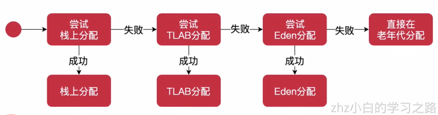

# 1、TLAB是什么？

- 全称Thread Local Allocation Buffer，即线程私有分配缓存区。
- 是一块线程专用的内存分配区域，JVM会为每个线程分配一块TLAB区域，占用Eden区的空间。

# 2、为什么要有TLAB？

- 加速对象分配

# 3、TLAB局限性

- TLAB空间较小，所以大对象无法在TLAB分配，只能直接分配到线程共享的堆里面。

# 4、误区避免

- 是一块线程专用的内存分配区域，JVM会为每个线程分配一块TLAB区域，占用Eden区的空间
- 分配独享，使用共享

# 5、参数总结

| 属性                        | 作用                                                         | 默认值 |
| --------------------------- | ------------------------------------------------------------ | ------ |
| -XX:+UseTLAB                | 是否启用线程私有分配缓存区（thread-local allocation buffer） | 启用   |
| -XX:MinTLABSize             | 最小TLAB大小，单位字节                                       | 2048   |
| -XX:ResizeTLAB              | 是否动态调整TLAB的大小                                       | 是     |
| -XX:TLABRefillWasteFraction | 由于TLAB空间比较小，因此很容易装满，比如TLAB 100K，已使用80KB，当需要分配一个30KB的对象时，就无法分配到这个TLAB了。这时虚拟机会有两种选择，第一，废弃当前TLAb，这样就会浪费20K空间；第二，保留当前的TLAB并将这30K的对象直接分配在堆上，这样将来有小于20KB的对象时，仍可使用这块空间。实际上虚拟机内部维护了一个叫作refill_waste时，当请求对象大于refill_waste时，会在堆中分配；若小于该值，则废弃当前TLAB，新建TLAB分配对象。TLABRefillWasteFraction来调整该阈值，它表示TLAB中允许产生这种浪费的比列，默认值为64，即允许使用1/64的TLAB空间作为refill_waste。默认情况下，TLAB和refill_waste都会在运行时不断调整，使系统的运行状态达到最优。如果想要禁用自动调整TLAB的大小，可以使用-XX:ResizeTLAB禁用ResizeTLAB，并使用-XX:TLABSize手工指定一个TLAB的大小 | 64     |
| -XX:+TLABStats              | 是否提供详细的TLAB的统计信息                                 | 是     |
| -XX:TLABSize                | 设置TLAB的初始大小。如果设置成0，JVM会自动设置TLAB初始化大小 | 0      |
| -XX:TLABWasteTargetpercent  | 允许TLAB占用Eden空间百分比                                   | 1      |

# 6、对象分配总结



# 7、测试用例

```java
package com.zhz.jvm.tuning;

import org.slf4j.Logger;
import org.slf4j.LoggerFactory;

public class TLABTest {
    private static final Logger LOGGER = LoggerFactory.getLogger(TLABTest.class);
    private TLABObj tlabObj;

    // -XX:+UseTLAB: 456ms
    // -XX:-UseTLAB: 987ms
    public static void main(String[] args) {
        TLABTest test = new TLABTest();
        long start = System.currentTimeMillis();
        for (int i = 0; i < 1_0000_0000; i++) {
            test.tlabObj = new TLABObj();
        }
        System.out.println(test.tlabObj);
        long end = System.currentTimeMillis();
        LOGGER.info("花费{}ms", end - start);
    }
}

class TLABObj {
}
```