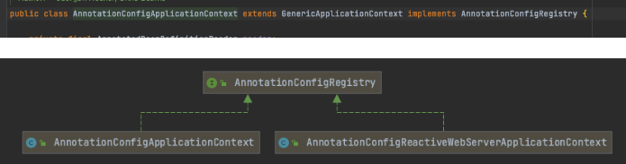

面向对象的本质是：**以类的方式组织代码，以对象的形式封装数据。**面向对象与面向过程思想的异同点：

- 都是解决问题的思维方式，都是代码组织的方式。
- 面向过程是一种“执行者思维”，解决简单问题可以使用面向过程。
- 面向对象是一种“设计者思维”，解决复杂、需要协作的问题可以使用面向对象。
- 面向对象离不开面向过程：在宏观上通过面向对象进行整体设计，在微观上执行和处理数据，仍然通过面向过程进行。

面向对象有三大特性：**封装、继承、多态**，我们简单回顾一下。

# 特性一：封装

封装是利用抽象的数据类型将数据和基于数据的操作封装在一起，形成一个原子性质的实体。数据被包含在抽象数据类型的内部，尽可能隐藏内部的细节，只能通过一些对外的接口暴露给外部，用户不需要内部实现什么，就可以直接获取自己想要的功能。

封装的优点如下：

- 高内聚：封装细节，便于修改内部代码，提高可维护性。

- 低耦合：简化外部调用，便于调用者使用，便于扩展和协作。

- 提高代码可用性。

-  提高代码安全性。

对于属性的封装规则：

- private访问权限。

- 有对应的get/set方法。

- **boolean变量的get方法是is开头**。

对于方法的封装规则：

只辅助于当前类的可以是private，需要其他类调用的可以用public。

业界有许多优秀的封装框架，比如：

- Hutool是一个小而全的Java工具类库，通过静态方法封装，降低相关API的学习成本，提高工作效率，使Java拥有函数式语言般的优雅，让Java语言也可以“甜甜的”。

- Apache Common下面的各种组装包。

我们来封装一个Person类，这个Person类包含了身份证、性别、职业信息。

代码清单 1-1 Person类

```java
import java.util.Objects;

public class Person {
    /**
     * 身份证
     */
    private String id;
    /**
     * sex性别: 男，女
     */
    private String sex;
    /**
     * 职业
     */
    private String position;

    public String getId() {
        return id;
    }
    public void setId(String id) {
        this.id = id;
    }
    public String getSex() {
        return sex;
    }
    public void setSex(String sex) {
        this.sex = sex;
    }
    public String getPosition() {
        return position;
    }
    public void setPosition(String position) {
        this.position = position;
    }
    @Override
    public boolean equals(Object o) {
        if (this == o) return true;
        if (o == null || getClass() != o.getClass()) return false;
        Person person = (Person) o;
        return Objects.equals(id, person.id) && Objects.equals(sex, person.sex) && Objects.equals(position, person.position);
    }
    @Override
    public int hashCode() {
        return Objects.hash(id, sex, position);
    }
    @Override
    public String () {
        return "Person{" +
                "id='" + id + '\'' +
                ", sex='" + sex + '\'' +
                ", position='" + position + '\'' +
                '}';
    }
}

```

# 特性二：继承

用八个字总结一下继承核心思想：**承于祖宗，活于自我。**

例如，Dog 和 Animal 就是一种 is-a 关系：A dog is an animal，因此 Dog 可以继承自 Animal，从而获得 Animal 非 private 的属性和方法。

继承就是一个is-a的关系，应该遵循里氏替换原则，子类对象必须能够替换所有父类对象。其中，父类引用指向子类对象称为**向上转型**。

继承的优点：子类拥有父类的所有属性和方法（除了private修饰的属性不能拥有），从而**实现了代码的复用**。

代码清单 1-2 Man类继承Person类

```
public class Man extends Person {
}
```


# 特性三：多态

多态产生的条件为：**继承、覆盖（重写）、向上转型。**多态分为运行时多态，编译时多态。

- 运行时多态：**方法的重载（作用于单个类）**。

- 编译时多态：**方法的重写（作用于多个类中）**。

那么，上方提到的特性——重载、重写是什么呢？接下来用一小段篇幅来介绍。

## 重写是什么？

在继承中，子类可以定义和父类相同的名称并且参数列表一致的函数，将这种函数称之为函数的重写，它作用于多个类中。

### 重写有什么特点？

- 当子类重写了父类的函数时，那么子类的对象如果调用该函数，一定调用的是重写过后的函数，可以通过super关键字进行父类的重写函数的调用。
-  继承可以使得子类增强父类的方法。

### 重写需要注意哪些点？

- 函数名必须相同。
- 参数列表必须相同。
- 子类重写父类的函数的时候，返回值类型必须是父类函数的返回值类型或该返回值类型的子类，不能返回比父类更大的数据类型，如子类函数的返回值类型是Object。
- 子类方法抛出的异常不能大于父类被重写方法的异常。
- 子类重写父类的函数的时候，函数的访问权限必须大于等于父类的函数的访问权限否则会编译报错。

一句话总结：两同两小一大。

### 重写的规则是什么？

- 声明为private/final的方法不能被重写。

- static的方法不能被重写，但是能够被继承。

- 构造方法不能被重写，因为构造方法是属于类的。

子类要想重写，就要先继承，怎么才能继承呢？这就要考虑权限的问题。private的方法除了本类对外屏蔽，不能继承，也就不能重写。default修饰的方法只能当子类和父类在同一包下才可以继承，然后重写。protected和public修饰的方法子类全都可以继承并且重写。

代码清单 1-3 重写Person类name方法

```java
public class Person {
    protected String name() {
        System.out.println("我是小白");
        return "小白";
    }
}

public class Man extends Person{
   @Override
   protected String name() {
      return super.name();
   }
}
```

## 什么是重载？


在同一个类中，只要方法的方法名相同，那么这几个方法就构成重载。重载方法的参数类型和参数个数可以不同，返回值的类型也可以不同，无法根据返回值类型来判断一个方法是不是重载方法。重载方法的权限可以是是任意权限，这是没有要求的。

重载的作用是：减少代码长度，它是更高效利用方法的一种方式，它的特征就是在引用方法的时候添加不同的参数，让程序走向不同的方向，它作用于单个类中。

### 重载有什么特点？

函数名相同，参数列表不同，与其他的无关（访问控制符，返回值类型）。调用时，根据方法参数列表来区别。

## 重载跟重写有什么区别呢？

- **重载（overloading）**，是在同一类中，有相同的方法名，返回值，异常，作用域，参数列表不同，但是不能同时产生两个一样的相同型构的方法。

- **重写（overriding)**，是在继承的前提上，子类有跟父类一样的方法名字、参数列表、异常、返回值，作用域都一样，也就是子类重写父类的方法，类似于我们平常开发过程中的service层和他的impl层。

# UML

那么另一个问题来了，我们怎么去表达类与类之间的关系呢，虽然说可以写代码去表达，但是代码不直观，那就需要一个我们的统一语言去表达了，而这个就是我们平常所说的UML（统一建模语言）去表达了。

我们可以使用**StarUML**或**PlantUML**等工具画类图，我们来看看UML图如何表达类图。

## 泛化关系

定义：泛化是一种继承关系，指定了子类如何特化父类的所有特征和行为，Java中使用的是extends关键字。


 1-1 使用UML图表示泛化

## **实现关系**

定义：一种类与接口的关系，表示类是接口所有特征和行为的实现，Java中使用implement关键字。



图 1-2 使用UML图表示实现

## **聚合关系**

**定义：**整体与部分的关系，但是不是强依赖的，整体不存在，部分也会还在。比如主机没了，但是硬盘，内存条，主板都会在。


图 1-3 使用UML图表示聚合

## **组合关系**

定义：整体与部分的关系，但是整体与部分是强依赖关系，整体不存在，部分自然也不存在了。比如公司与研发部、行政部的关系，没有公司，就没有公司里的研发部、行政部。


图 1-4 使用UML图表示组合

## **关联关系**

定义：不同类对象之间有关联，比如订单与订单明细之间就是一对多的关系，也多可以说订单明细与订单之间是多对一的关系。


图 1-5 使用UML图表示关联

## **依赖关系**

定义：依赖关系是在运行过程中起作用的，不是编译期起作用的。A类和B类的依赖关系主要有三种：
- A 类是 B 类中的(某中方法的)局部变量。
- A 类是 B 类方法当中的一个参数。
- A 类向 B 类发送消息，从而影响 B 类发生变化。


图 1-6 使用UML图表示依赖