# 为什么会引入泛型

## 泛型是什么？

泛型，即“参数化类型”。一提到参数，最熟悉的就是定义方法时有形参，然后调用此方法时传递实参。那么参数化类型怎么理解呢？

- 顾名思义，就是将类型由原来的具体的类型参数化，类似于方法中的变量参数，此时类型也定义成参数形式（可以称之为类型形参），然后在使用/调用时传入具体的类型（类型实参）。
  泛型的本质是为了参数化类型（在不创建新的类型的情况下，通过泛型指定的不同类型来控制形参具体限制的类型）。也就是说在泛型使用过程中，操作的数据类型被指定为一个参数，这种参数类型可以用在类、接口和方法中，分别被称为泛型类、泛型接口、泛型方法。

- **泛型是不能直接实例化的，需要通过反射进行处理。**

## 泛型的作用?

Java 语言中，引入泛型实乃为一个较大的功能增强。不仅语言、类型系统和编译器有了较大的变化，以支持泛型，而且类库也进行了大翻修，所以许多重要的类，比如集合框架，都已经成为泛型化的了。作用如下：

**1、类型安全。**

- 泛型的主要目标是提高 Java 程序的类型安全。编译时的强类型检查；通过知道使用泛型定义的变量的类型限制，编译器可以在一个高得多的程度上验证类型假设。没有泛型，这些假设就只存在于程序员的头脑中（或者如果幸运的话，还存在于代码注释中）。

**2、消除强制类型转换。**

- 泛型的一个附带好处是，消除源代码中的许多强制类型转换。这使得代码更加可读，并且减少了出错机会。

**3、潜在的性能收益。**

- 泛型为较大的优化带来可能。在泛型的初始实现中，编译器将强制类型转换（没有泛型的话，程序员会指定这些强制类型转换）插入生成的字节码中。但是更多类型信息可用于编译器这一事实，为未来版本的 JVM 的优化带来可能。由于泛型的实现方式，支持泛型（几乎）不需要 JVM 或类文件更改。所有工作都在编译器中完成，编译器生成类似于没有泛型（和强制类型转换）时所写的代码，只是更能确保类型安全而已。
- Java 语言引入泛型的好处是安全简单。泛型的好处是在编译的时候检查类型安全，并且所有的强制转换都是自动和隐式的，提高代码的重用率。

**4、更好的代码复用性，比如实现泛型算法**

- 比如统一返回值，MybatisPlus 的各种层的代码复用，具体可以下最下面的代码实现。

# 泛型的基本使用

## 泛型类

那最简单的类来说，所有 Iterable 类下面的子类大部分都是泛型类，下面列出了部分，其中包括`<E>`都是泛型类,要排除 interface 接口层面的

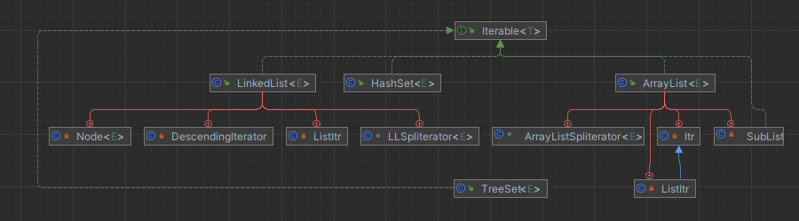

泛型类也可以多个泛型的，如下：

```java
class Notepad<K,V>{       // 此处指定了两个泛型类型
    private K key ;     // 此变量的类型由外部决定
    private V value ;   // 此变量的类型由外部决定
    public K getKey(){
        return this.key ;
    }
    public V getValue(){
        return this.value ;
    }
    public void setKey(K key){
        this.key = key ;
    }
    public void setValue(V value){
        this.value = value ;
    }
}
public class GenericsDemo09{
    public static void main(String args[]){
        Notepad<String,Integer> t = null ;        // 定义两个泛型类型的对象
        t = new Notepad<String,Integer>() ;       // 里面的key为String，value为Integer
        t.setKey("汤姆") ;        // 设置第一个内容
        t.setValue(20) ;            // 设置第二个内容
        System.out.print("姓名；" + t.getKey()) ;      // 取得信息
        System.out.print("，年龄；" + t.getValue()) ;       // 取得信息

    }
}
```

## 泛型接口

```java

package java.lang;

import java.util.Iterator;
import java.util.Objects;
import java.util.Spliterator;
import java.util.Spliterators;
import java.util.function.Consumer;


public interface Iterable<T> {// 在接口上定义泛型

    Iterator<T> iterator(); // 定义抽象方法，抽象方法的返回值就是泛型类型


    default void forEach(Consumer<? super T> action) {
        Objects.requireNonNull(action);
        for (T t : this) {
            action.accept(t);

    }

    default Spliterator<T> spliterator() {
        return Spliterators.spliteratorUnknownSize(iterator(), 0);
    }
}

```

## 泛型方法

- 泛型方法的语法结构

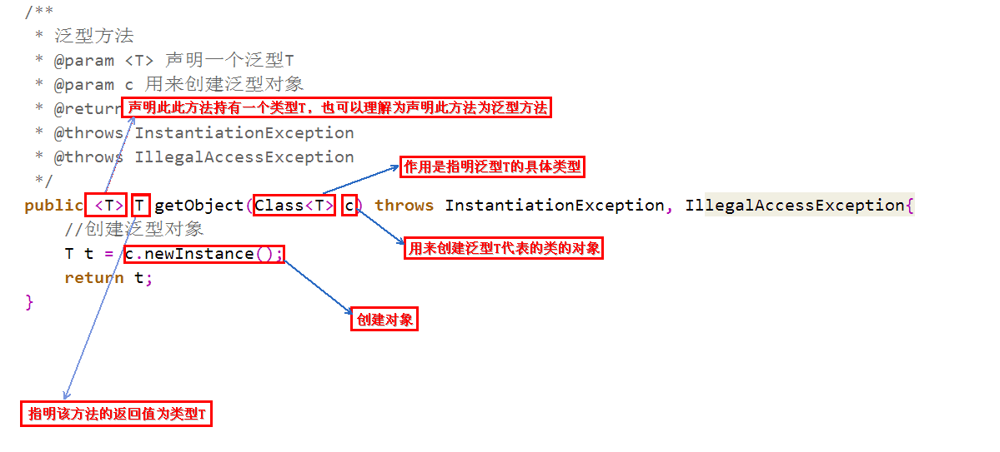

- 调用泛型方法的语法格式

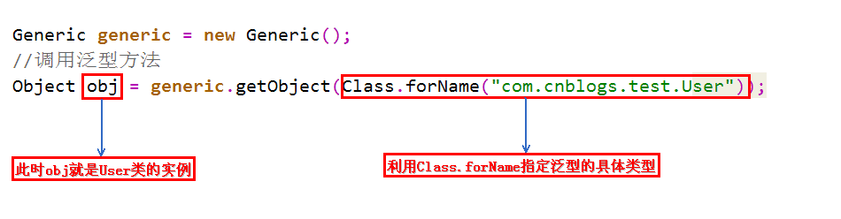

实际使用案例，可以参考 hutool 的 ProxyUtil 类

```java
package cn.hutool.aop;

import cn.hutool.aop.aspects.Aspect;
import cn.hutool.aop.proxy.ProxyFactory;
import cn.hutool.core.util.ClassUtil;
import java.lang.reflect.InvocationHandler;
import java.lang.reflect.Proxy;

public final class ProxyUtil {
    public ProxyUtil() {
    }

    public static <T> T proxy(T target, Class<? extends Aspect> aspectClass) {
        return ProxyFactory.createProxy(target, aspectClass);
    }

    public static <T> T proxy(T target, Aspect aspect) {
        return ProxyFactory.createProxy(target, aspect);
    }

    public static <T> T newProxyInstance(ClassLoader classloader, InvocationHandler invocationHandler, Class<?>... interfaces) {
        return Proxy.newProxyInstance(classloader, interfaces, invocationHandler);
    }

    public static <T> T newProxyInstance(InvocationHandler invocationHandler, Class<?>... interfaces) {
        return newProxyInstance(ClassUtil.getClassLoader(), invocationHandler, interfaces);
    }
}

```

## 泛型的上下限

- **先看下如下的代码，很明显是会报错的**

```java
class A{}
class B extends A {}

// 如下两个方法不会报错
public static void funA(A a) {
    // ...
}
public static void funB(B b) {
    funA(b);
    // ...
}

// 如下funD方法会报错
public static void funC(List<A> listA) {
    // ...
}
public static void funD(List<B> listB) {
    funC(listB); // Unresolved compilation problem: The method doPrint(List<A>) in the type test is not applicable for the arguments (List<B>)
    // ...
}
```

那么如何解决呢？

- 为了解决泛型中隐含的转换问题，Java 泛型加入了类型参数的上下边界机制。`<? extends A>` 表示该类型参数可以是 A(上边界)或者 A 的子类类型。编译时擦除到类型 A，即用 A 类型代替类型参数。这种方法可以解决开始遇到的问题，编译器知道类型参数的范围，如果传入的实例类型 B 是在这个范围内的话允许转换，这时只要一次类型转换就可以了，运行时会把对象当做 A 的实例看待。

```java
public static void funC(List<? extends A> listA) {
    // ...
}
public static void funD(List<B> listB) {
    funC(listB); // OK
    // ...
}
```

- **泛型上下限的引入**

在使用泛型的时候，我们可以为传入的泛型类型实参进行上下边界的限制，如：类型实参只准传入某种类型的父类或某种类型的子类。

- 上限

```java
class Info<T extends Number>{    // 此处泛型只能是数字类型
    private T var ;        // 定义泛型变量
    public void setVar(T var){
        this.var = var ;
    }
    public T getVar(){
        return this.var ;
    }
    public String toString(){    // 直接打印
        return this.var.toString() ;
    }
}
public class demo1{
    public static void main(String args[]){
        Info<Integer> i1 = new Info<Integer>() ;        // 声明Integer的泛型对象
    }
}
```

- 下限

```java
class Info<T>{
    private T var ;        // 定义泛型变量
    public void setVar(T var){
        this.var = var ;
    }
    public T getVar(){
        return this.var ;
    }
    public String toString(){    // 直接打印
        return this.var.toString() ;
    }
}
public class GenericsDemo21{
    public static void main(String args[]){
        Info<String> i1 = new Info<String>() ;        // 声明String的泛型对象
        Info<Object> i2 = new Info<Object>() ;        // 声明Object的泛型对象
        i1.setVar("hello") ;
        i2.setVar(new Object()) ;
        fun(i1) ;
        fun(i2) ;
    }
    public static void fun(Info<? super String> temp){    // 只能接收String或Object类型的泛型，String类的父类只有Object类
        System.out.print(temp + ", ") ;
    }
}
```

**小结**

```java
<?> 无限制通配符
<? extends E> extends 关键字声明了类型的上界，表示参数化的类型可能是所指定的类型，或者是此类型的子类
<? super E> super 关键字声明了类型的下界，表示参数化的类型可能是指定的类型，或者是此类型的父类

// 使用原则《Effictive Java》
// 为了获得最大限度的灵活性，要在表示 生产者或者消费者 的输入参数上使用通配符，使用的规则就是：生产者有上限、消费者有下限
1. 如果参数化类型表示一个 T 的生产者，使用 < ? extends T>;
2. 如果它表示一个 T 的消费者，就使用 < ? super T>；
3. 如果既是生产又是消费，那使用通配符就没什么意义了，因为你需要的是精确的参数类型。
```

- 再看一个实际例子，**加深印象**

```java
private  <E extends Comparable<? super E>> E max(List<? extends E> e1) {
    if (e1 == null){
        return null;
    }
    //迭代器返回的元素属于 E 的某个子类型
    Iterator<? extends E> iterator = e1.iterator();
    E result = iterator.next();
    while (iterator.hasNext()){
        E next = iterator.next();
        if (next.compareTo(result) > 0){
            result = next;
        }
    }
    return result;
}
```

上述代码中的类型参数 E 的范围是`<E extends Comparable<? super E>>`，我们可以分步查看：

- 要进行比较，所以 E 需要是可比较的类，因此需要 `extends Comparable<…>`（注意这里不要和继承的 extends 搞混了，不一样）
- `Comparable< ? super E>` 要对 E 进行比较，即 E 的消费者，所以需要用 super
- 而参数 `List< ? extends E>` 表示要操作的数据是 E 的子类的列表，指定上限，这样容器才够大
- **多个限制**

使用&符号

```java
public class Client {
    //工资低于2500元的上斑族并且站立的乘客车票打8折
    public static <T extends Staff & Passenger> void discount(T t){
        if(t.getSalary()<2500 && t.isStanding()){
            System.out.println("恭喜你！您的车票打八折！");
        }
    }
    public static void main(String[] args) {
        discount(new Me());
    }
}
```

---

- 阿里泛型上下限规范：

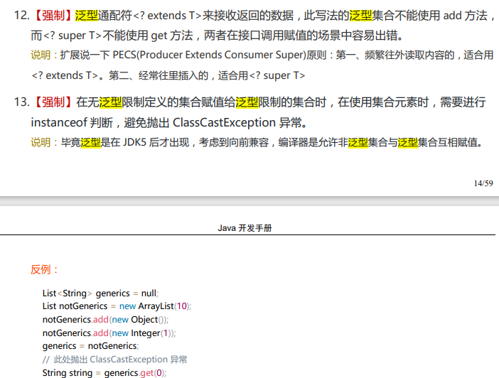

## 泛型数组

### 情况一：Java 无法创建参数化类型的数组

- 在 Java 中，我们不能实例化（注意我说的是实例化）一个参数化类型的数组，但是却可以参数化数组本身的类型。
  - 参数化类型的数组：就是这个数组里存储的对象是参数化类型，大家比较熟悉的 `List<String>` 就是一个类型参数为 String 的参数化类型，也叫做泛型。

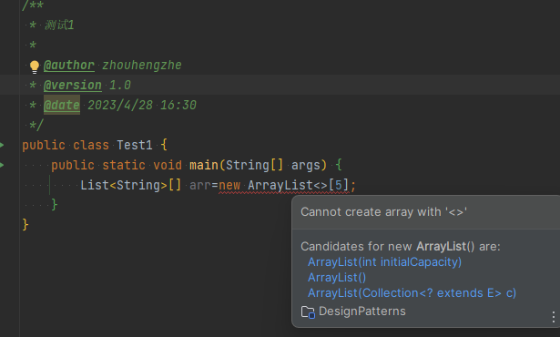

为什么 Java 会禁止我们实例化**参数化类型的数组**呢？

- 由于泛型具有**擦除机制**，在运行时的类型参数会被擦除，Java 只知道存储的对象是**一个 Object**而已，而对于 Java 的数组来说，他必须知道它**持有的所有对象的具体类型**，而泛型的这种运行时擦除机制**违反了数组安全检查**的原则。
- 问题来了，如果我就要实例化呢？怎么解决呢？我们可以采用曲线救国方案，如下，我们采用了**通过创建一个非参数化类型的数组，然后将他强制类型转换为一个参数化类型数组**。

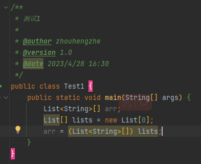

但是他也有一个很简单的问题，当我们第一个值传进去之后，他的泛型就会变成当前的对象类型/引用类型等，如下：
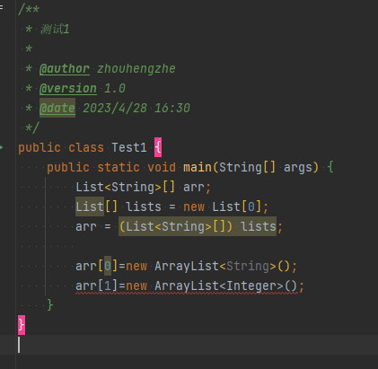

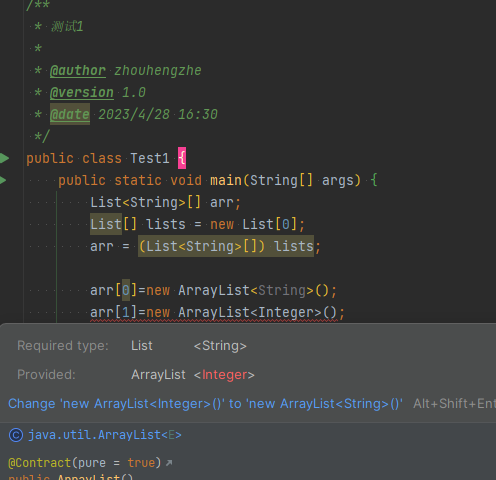
正常传入一个 String 类型参数的 list 并不会有任何问题，但当我们传入一个类型参数为 Integer 的 list 时编译器却提示我们有错，报错原因是**类型不合法**，数组期望一个 `List<String>`，我们却传入了 `List<Integer>`，所以我们就可以知道通过转型型实现的参数化类型数组在编译时就会帮我们做判断了。

### 情况二：可以参数化数组本身的类型

**参数化数组本身的类型**，顾名思义，我们**不再参数化数组持有的对象的类型，而是将数组应该存储的对象进行参数化，**我们来看一个返回一个数组的参数化方法：
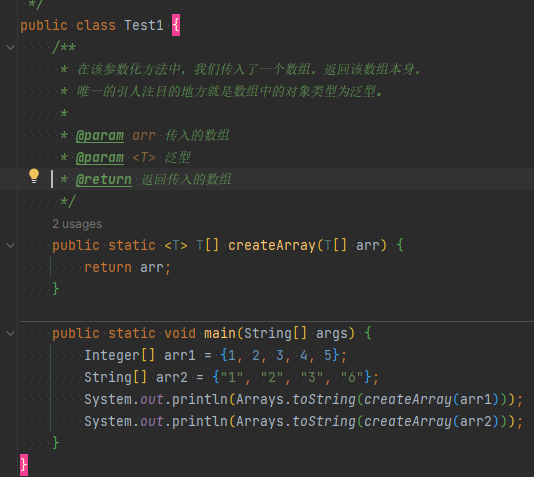

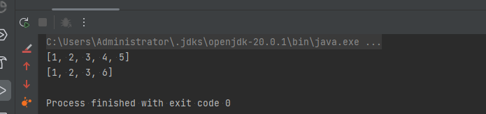

我们发现，**无论我们传入 Integer 类型数组或 String 类型数组或自定义对象数组，该参数化方法总能正确的执行，即数组本身的类型被参数化了，但在运行时，被赋予了具体的类型。**
但是就算如此，我也也不能直接创建一个泛型数组，这对于编译期来说是不可以的，但是运行期我们可以通过另类的方式搞定。如下：
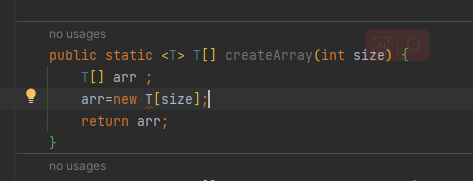
我们可以利用创建 Object 数组去强转成 T[]，来实现效果，但是这是没意义的，因为 T 会被泛型擦除，等于我们创建勒一个 Object[] arr=new Object[size]，那么泛型的意思早吗么。因此可以得知泛型是不能直接创建的。
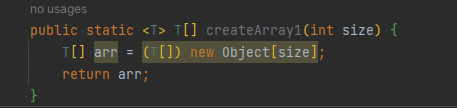

## 如何理解 Java 中的泛型是伪泛型？泛型中类型擦除

1、因为，在编译期间，所有的泛型信息都会被擦除掉。正确理解泛型概念的首要前提是理解类型擦除（type erasure）

2、Java 中的泛型基本上都是在编译器这个层次来实现的。在生成的 Java 字节码中是不包含泛型中的类型信息的。使用泛型的时候加上的类型参数，会在编译器在编译的时候去掉。这个过程就称为类型擦除。也就是说不论是 `List<String>` 还是 `List<Integer>` 在 JVM 层面都是 List。

### 泛型擦除的原因

- 1、JDK1.5 及 1.5 之前都是没有泛型的概念的，JDK1.5 之后引入了泛型的概念并为了与之前的 JDK 版本兼容，所以引入了泛型擦除的概念。
- 2、若对每个泛型类型都生成不同的目标代码，现有 10 个不同泛型的 List，就要生成 10 份字节码，这样会造成不仅造成代码膨胀，而且一份字节码对应一个 Class 对象，占据大量的内存。

### 类型擦除原则

- 消除类型参数声明，即删除`<>`及其包围的部分。
- 根据类型参数的上下界推断并替换所有的类型参数为原生态类型：如果类型参数是无限制通配符或没有上下界限定则替换为 Object，如果存在上下界限定则根据子类替换原则取类型参数的最左边限定类型（即父类）。
- 为了保证类型安全，必要时插入强制类型转换代码。
- 自动产生“桥接方法”以保证擦除类型后的代码仍然具有泛型的“多态性”。

### 如何进行类型擦除

1、情况一：首先将 所有声明泛型的地方 都擦除，然后若 定义该泛型的地方 没有指定泛型上界，则 所有该泛型类型的变量的数据类型 在编译之后都替换为 Object
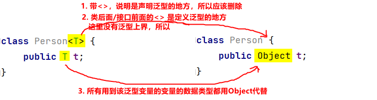
2、情况二：首先将 所有声明泛型的地方 都擦除，然后若 定义该泛型的地方 指定了泛型上界，则 所有该泛型类型的变量的数据类型 在编译之后都替换为泛型上界
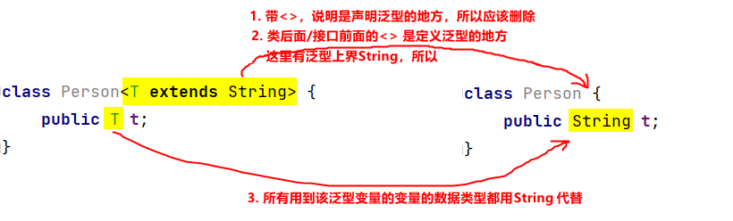

## 如何证明类型的擦除呢？

例题 1：

```java
 public static void main(String[] args) {
        List<Integer> p1 = new ArrayList<>();
        List<String> p2 = new ArrayList<>();
        System.out.println(p1.getClass() == p2.getClass()); //true
    }
```

例题 2：
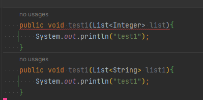
报错信息为：`'test1(List<Integer>)' clashes with 'test1(List<String>)'; both methods have same erasure`，所以可以得知在编译的时候泛型都被擦除了，导致两个方法是一样的，所以编译不通过。

## 如何理解类型擦除后保留的原始类型?

在 Java 中，泛型类和泛型方法在编译时会被擦除类型信息，将泛型类型参数替换成它们的原始类型。在类型擦除之后，泛型类型变量和泛型类型参数都将被替换成其对应的原始类型。

泛型类的类型擦除之后，其原始类型是只有类名和泛型参数的普通类，例如 List 类型擦除之后的原始类型是 List。对于泛型类中使用了多个类型参数的情况，类型擦除之后的原始类型依然只有类名，泛型参数丢失。例如 `Map<K,V>` 类型擦除之后的原始类型是 Map。

泛型方法的类型擦除之后，其原始类型是只有方法签名和泛型参数的普通方法。在类型擦除之后，泛型方法中的类型参数都会被其对应的原始类型替换掉。例如下面是一个泛型方法：

```java
public <T> void printList(List<T> list) {
   for(T t:list) {
      System.out.print(t+" ");
   }
}
```

在类型擦除之后，其原始类型是一个不带类型参数的普通方法，如下：

```java
public void printList(List list) {
   for(Object obj:list) {
      System.out.print(obj+" ");
   }
}
```

需要注意的是，在类型擦除之后，泛型类型擦除保留的原始类型只包含类名和方法签名，不包含泛型信息。在使用泛型时需要注意遵守类型擦除后的规定，确保类型的一致性和合法性。

## 如何理解泛型的编译期检查？

泛型的编译期检查可以理解为在编译阶段进行的类型检查，可以检查出一些编译期间的类型错误，从而避免了在运行时因类型转换错误等导致的异常。下面给出一些例子，帮助大家更好地理解泛型的编译期检查。

### 泛型类型参数的声明和使用要保持一致

在 Java 中，使用泛型时需要将泛型作为一个类型参数来进行使用。在使用泛型类型参数时，需要保持声明和使用的泛型类型参数一致，否则就会出现编译错误。例如，下面的代码：

```java
List<Integer> list = new ArrayList<String>();
```

在这个例子中，本来应该声明的是一个 `List<Integer>` 类型的变量，但是错误地将其声明为了 `List<String>`。这样就会导致编译时出现错误，因为 `ArrayList<String>` 类型不能转换为 `List<Integer>` 类型。

### 使用泛型时必须进行类型参数的指定

在使用泛型时，必须指定类型参数，不能使用原始类型。原始类型指的是没有指定泛型类型参数的泛型类型。例如，下面的代码：

```java
List list = new ArrayList();
list.add("hello");
```

在这个例子中，虽然可以使用 `List` 类型来声明变量 `list`，但是因为没有指定泛型类型参数，所以这个 List 是一个原始类型，其元素可以是任何类型的对象。这就会导致在编译时无法检查出类型错误，因此容易造成运行时异常。

### 不能在静态方法或静态代码块中使用泛型类型参数或者引用泛型类型

在 Java 中，无法在静态方法或静态代码块中使用泛型类型参数或引用泛型类型。这是因为泛型在实例化对象时才被声明和确定的，而静态方法和静态代码块没有实例化对象，无法通过编译器检查。例如，下面的代码：

```java
public class Test<T> {
    private T data;
    public static void staticMethod(T t) { ... } // 不能在静态方法中使用泛型类型参数 T
}
```

在这个例子中，由于静态方法 `staticMethod` 中使用了泛型类型参数 `T`，因此会导致编译时出现错误，无法通过编译。正确的写法应该是将 `staticMethod` 方法定义为静态泛型方法：

```java
public class Test<T> {
    private T data;
    public static <T> void staticMethod(T t) { ... }
}
```

这样就可以在静态方法中正确地引用泛型类型 T 了。

### 泛型中可以使用 extends 约束类型范围

泛型中可以使用 extends 关键字来约束泛型类型参数的范围。例如，下面的代码：

```java
public class MyClass<T extends Number> {
    private List<T> list = new ArrayList<T>();
    public void add(T element) {
        list.add(element);
    }
}
```

在这个例子中，`MyClass<T>` 泛型类声明了一个泛型类型参数 T，它需要继承 Number 类型。这样就可以在 `MyClass<T>` 类中使用泛型类型参数 T 的各种 Number 子类对象了。

接着，在 `MyClass<T>` 中使用了一个 `List<T>` 类型的变量 `list` 来存储 T 类型的对象。同时，`MyClass<T>` 中还定义了一个 `add` 方法，用来向 `list` 中添加 T 类型的对象。

这样，在使用 `MyClass<T>` 类时，不仅可以利用泛型实现类型安全，还可以限制泛型类型参数的范围，避免一些潜在的类型转换错误。如果不满足 extends 约束的要求，编译器就会报错，如下所示：

```java
MyClass<String> myClass = new MyClass<String>(); // 编译错误，String 类型不能继承 Number 类型
```

总的来说，泛型的扩展约束可以帮助我们在泛型中限定类型范围，提高程序的类型安全性。不过需要注意的是，extends 约束也只是在编译期进行的检查，无法完全保证程序的类型安全。

## 如何理解泛型的多态？泛型的桥方法

泛型的多态性是指在使用泛型类型时，相同的操作可以适用于不同的类型。具体来说，在定义泛型类或方法时，可以将类型参数用作变量，使得同一套代码可以用来操作不同类型的数据，从而提高了代码的复用性和灵活性。

对于泛型类或方法，编译器会自动生成桥方法（Bridge Method），用于在泛型类型与非泛型类型之间建立桥梁，确保类型安全和正确调用。桥方法的作用在于使得泛型类的行为与在使用泛型之前定义的类的行为保持一致。

例如，在以下的泛型类 Pair 中，T 是类型参数：

```
public class Pair<T> {
    private T first;
    private T second;

    public Pair(T first, T second) {
        this.first = first;
        this.second = second;
    }

    public T getFirst() {
        return first;
    }

    public T getSecond() {
        return second;
    }

    public void setFirst(T first) {
        this.first = first;
    }

    public void setSecond(T second) {
        this.second = second;
    }
}
```

当使用 `Pair<Integer>` 时，编译器会重写两个 get，set 方法，

```
public class Pair {
    private Object first;
    private Object second;

    public Pair(Object first, Object second) {
        this.first = first;
        this.second = second;
    }

    public Integer getFirst() {
        return (Integer) first;
    }

    public Integer getSecond() {
        return (Integer) second;
    }

    public void setFirst(Integer first) {
        this.first = first;
    }

    public void setSecond(Integer second) {
        this.second = second;
    }
}
```

可以看到，桥方法把泛型类型转换成了非泛型类型，同时保留了原有方法的签名和行为。这样，当使用 Pair 类型时，就可以像使用非泛型类型一样操作数据，而不需要考虑泛型的类型擦除问题。

### 那么什么是桥方法呢？

首先我们写一个测试类，

```java
public class Test {
    public static void main(String[] args) {
        Pair<Integer> pair=new Pair<>(1,2);
        System.out.println(pair.toString());
    }
}
```

然后我们可以用 javap -c Test.class 编译或者**java 的 plugins：jclasslib-bytecode-viewer**，得出以下

```java
// class version 64.0 (64)
// access flags 0x21
public class com/zhz/designpatterns/test/Test {

  // compiled from: Test.java

  // access flags 0x1
  public <init>()V
   L0
    LINENUMBER 10 L0
    ALOAD 0
    INVOKESPECIAL java/lang/Object.<init> ()V
    RETURN
   L1
    LOCALVARIABLE this Lcom/zhz/designpatterns/test/Test; L0 L1 0
    MAXSTACK = 1
    MAXLOCALS = 1

  // access flags 0x9
  public static main([Ljava/lang/String;)V
    // parameter  args
   L0
    LINENUMBER 12 L0
    NEW com/zhz/designpatterns/test/Pair
    DUP
    ICONST_1
    INVOKESTATIC java/lang/Integer.valueOf (I)Ljava/lang/Integer;
    ICONST_2
    INVOKESTATIC java/lang/Integer.valueOf (I)Ljava/lang/Integer;
    INVOKESPECIAL com/zhz/designpatterns/test/Pair.<init> (Ljava/lang/Object;Ljava/lang/Object;)V
    ASTORE 1
   L1
    LINENUMBER 13 L1
    GETSTATIC java/lang/System.out : Ljava/io/PrintStream;
    ALOAD 1
    INVOKEVIRTUAL com/zhz/designpatterns/test/Pair.toString ()Ljava/lang/String;
    INVOKEVIRTUAL java/io/PrintStream.println (Ljava/lang/String;)V
   L2
    LINENUMBER 14 L2
    RETURN
   L3
    LOCALVARIABLE args [Ljava/lang/String; L0 L3 0
    LOCALVARIABLE pair Lcom/zhz/designpatterns/test/Pair; L1 L3 1
    // signature Lcom/zhz/designpatterns/test/Pair<Ljava/lang/Integer;>;
    // declaration: pair extends com.zhz.designpatterns.test.Pair<java.lang.Integer>
    MAXSTACK = 4
    MAXLOCALS = 2
}
.
```

从编译结果来看，它内部字节码编译的时候增加了以下几个字节码

```java
   ICONST_1
    INVOKESTATIC java/lang/Integer.valueOf (I)Ljava/lang/Integer;
    ICONST_2
    INVOKESTATIC java/lang/Integer.valueOf (I)Ljava/lang/Integer;
    INVOKESPECIAL com/zhz/designpatterns/test/Pair.<init> (Ljava/lang/Object;Ljava/lang/Object;)V
    ASTORE 1
```

这就是所谓的桥方法。

## 如何理解基本类型不能作为泛型类型？

在 Java 中，基本类型是指 boolean、byte、short、int、long、float、double 这七种简单数据类型，而非基本类型则包括所有的对象类型，如 String、Number 等等。

由于 Java 泛型是在编译期实现类型擦除，也就是说，在编译后泛型类型会被擦除为其上限（upper bound）类型或 Object 类型。因此，由于基本类型没有对应的对象类型，无法作为泛型实参传递给类型参数，所以基本类型不能作为泛型类型直接使用。

但是，Java 中提供了包装类型（Wrapper Class）来解决这个问题。每个基本类型都有一个对应的包装类型，如 Boolean、Byte、Short、Integer、Long、Float、Double 等等，它们都是继承自基类 java.lang.Number。因此，如果需要在泛型中使用基本类型，可以使用对应的包装类型作为泛型实参。

例如，我们可以定义一个包装了 int 类型的 MyInteger 类：

```
public class MyInteger {
    private int value;

    public MyInteger(int value) {
        this.value = value;
    }

    public int getValue() {
        return value;
    }

    public void setValue(int value) {
        this.value = value;
    }
}
```

然后使用它作为泛型类型的参数：

```
public class MyList<T> {
    private List<T> list = new ArrayList<T>();

    public void add(T value) {
        list.add(value);
    }

    public T get(int index) {
        return list.get(index);
    }
}

MyList<MyInteger> myList = new MyList<MyInteger>();
myList.add(new MyInteger(1));
MyInteger myInt = myList.get(0);
System.out.println(myInt.getValue()); // 输出 1
```

这样就可以在泛型中使用基本类型了。在需要将包装类型转换为基本类型时，可以使用自动拆箱（Auto-Boxing）和自动装箱（Auto-Unboxing）特性，使得语法更加简洁和易于使用。

## 如何理解泛型类型不能实例化？

在 Java 中，我们可以使用泛型（Generic）来创建具有类型安全且通用的类和方法。泛型中的类型参数（Type Parameter）可以在使用时动态地指定类型，因此可以让类型更加灵活和具有通用性。但是，泛型类型本身是不能实例化的（Instantiation）。

这是因为泛型在编译时会进行类型擦除（Type Erasure），即将泛型类型转换为原始类型，也就是在字节码中不会存在泛型类型，只会存在原始类型的对应描述。例如，一个 `ArrayList<String>` 在编译后就会变成一个 `ArrayList`，泛型参数类型就会被擦除掉。因此，编译器在编译时并不知道具体类型，所以不能直接通过泛型类型来创建对象。
举个例子，假设我们有一个泛型类 `GenericClass<T>`：

```
public class GenericClass<T> {
    private T value;

    public T getValue() {
        return value;
    }

    public void setValue(T value) {
        this.value = value;
    }
}
```

我们不能直接通过以下方式来创建泛型类型的实例：

```
GenericClass<T> gc = new GenericClass<T>(); // 错误的方式，编译错误
```

因为泛型类型 T 在编译后被擦除，所以在创建泛型类型实例时，编译器并不知道具体类型，因此不能直接使用。但是，可以通过创建泛型类的子类或使用匿名内部类的方式来实现实例化。例如：

```
GenericClass<Integer> gc = new GenericClass<Integer>(){}; // 通过创建泛型类的子类进行实例化
```

或者

```
GenericClass<Integer> gc = new GenericClass<Integer>(){
    // 匿名内部类
}; // 通过匿名内部类进行实例化
```

这两种方式都是使用了 Java 中的继承机制来创建了一个具体的类，从而克服了泛型类型不能直接实例化的问题。

## 泛型数组

### 能不能采用具体的泛型类型进行初始化？

在 Java 中，为了确保类型安全，不可以使用具体类型进行泛型数组初始化，必须使用通配符、类型变量或者 Object 类型。

使用具体类型进行泛型数组初始化可能会导致类型不匹配，从而会出现编译错误或者运行时异常。这是因为 Java 的泛型并不是完全的泛化，而是在编译时进行类型检查，将泛型类型擦除成原始类型。因此，在数组创建的过程中使用具体类型将会与泛型类型参数不匹配。
以下是一个错误的泛型数组初始化示例：

```
// 不能使用具体类型进行泛型数组初始化
List<String>[] array = new List<String>[10]; // 编译错误
```

在上述代码中，我们试图将一个长度为 10 的泛型数组初始化为 `List<String>` 类型数组。但是由于 Java 的泛型类型参数被擦除成原始类型，所以编译器无法确定 `List<String>[]` 类型数组的实际类型，从而会产生编译错误。

相反，正确的泛型数组初始化应该使用通配符、类型变量或者 Object 类型，例如：

```
// 使用通配符进行泛型数组初始化
List<?>[] array1 = new List<?>[10];

// 使用类型变量进行泛型数组初始化
List<String>[] array2 = (List<String>[]) new List<?>[10];

// 使用 Object 进行泛型数组初始化
Object[] array3 = new List<String>[10];
```

在上述示例代码中，使用了通配符、类型变量和 Object 类型进行泛型数组初始化，如 `List<?>[]、List<String>[]、Object[]` 等。这些方式可以在编译时对类型进行检查，从而确保类型的一致性和合法性。

### 如何正确的初始化泛型数组实例？

在 Java 中，泛型数组是一组具有相同类型参数的数组对象，这个类型参数可以是任意类型，例如 T、K、V、？等。初始化泛型数组实例的过程可能会比较复杂，因为泛型数组必须在创建实例的同时指定其容量大小和类型参数。以下是一些正确的初始化泛型数组实例的方法。

1. 创建 Object 类型数组，然后强制类型转换为泛型数组类型

```
// 创建长度为 10 的 String 类型数组
T[] array = (T[]) new Object[10];
```

这种方法可以创建一个指定类型参数的数组实例，但是需要在使用时进行强制类型转换，否则会产生警告或编译错误。需要注意的是，在进行强制类型转换时，可能会存在类型安全的隐患，因为 Object 类型数组中可以放置任何类型的对象。

2. 使用反射 API 创建泛型数组实例，可以避免强制类型转换

```
// 创建长度为 10 的 String 类型数组
T[] array = (T[]) Array.newInstance(String.class, 10);
```

这种方法使用了 Java 反射 API 来创建泛型数组实例，可以避免强制类型转换带来的问题。它需要指定数组类型的 Class 对象和数组长度，然后使用 Array.newInstance() 方法创建新的数组对象。需要注意的是，在使用这种方法创建泛型数组时，需要保证泛型参数的类型符合约定。

3. 使用泛型类来包装数组，从而避免使用泛型数组

可以使用泛型类来包装数组，从而避免使用泛型数组，例如：

```
public class GenericArray<T> {
    private T[] array;

    public GenericArray(int size) {
        array = (T[]) new Object[size];
    }

    public void set(int index, T value) {
        array[index] = value;
    }

    public T get(int index) {
        return array[index];
    }
}
```

这种方法使用了泛型类来包装一个数组，使用时可以直接调用泛型类的方法，并且不需要使用强制类型转换。有需要时可以在泛型类中添加更多的方法和限制，来确保其正确性和安全性。

## 如何理解泛型类中的静态方法和静态变量？

在 Java 中，泛型类中的静态方法和静态变量并不依赖于该类的类型参数。由于泛型类的类型参数仅在实例化时才会确定，因此在编译时无法确定泛型类的类型参数，从而无法在泛型类中使用类型参数去访问静态方法和静态变量。
因此，在泛型类中定义的静态方法和静态变量必须是与泛型类型参数无关的，它们与泛型类型参数没有任何联系。在使用静态方法和静态变量的时候，也不需要实例化泛型类，可以直接使用类名访问。
以下是一个示例代码，定义了一个泛型类和一个静态变量：

```java
public class TestClass<T> {
    private T value;
    private static int count = 0;

    public TestClass(T value) {
        this.value = value;
    }

    public T getValue() {
        return value;
    }

    public static int getCount() {
        return count;
    }
}
```

在这个示例代码中，我们定义了一个泛型类 TestClass，它包含一个泛型类型参数 T 和一个具体类型属性 value。我们还定义了一个静态变量 count，它与泛型类型参数 T 没有任何关系。在静态方法 getCount() 中，可以直接使用 count 静态变量，而不需要考虑泛型类型参数。
在实际的程序开发中，需要注意静态方法和静态变量的使用场景和作用，确保它们与类的设计目的相符，并不会引入问题或冲突。

## 如何理解异常中使用泛型？

在 Java 中，catch 语句中的泛型要求与泛型类型擦除规则有关。在 Java 中，泛型被擦除后，所有的类型参数都会被替换成其边界类型或 Object 类型。这意味着在 catch 语句中，只能使用非限定通配符或指定具体类型，不能使用限定类型参数。
例如，在以下代码中，我们尝试在 catch 语句中使用限定类型参数 T：

```java
public class Test {
    public static void main(String[] args) {
        try {
            throw new Exception("test exception");
        } catch (T extends Throwable e) {  // 编译错误，不能使用限定类型参数 T
            System.out.println(e.getMessage());
        }
    }
}
```

上述代码中，在 catch 语句中使用了限定类型参数 T，希望捕获所有实现了 Throwable 接口的异常。但是这是不允许的，因为 catch 语句中的泛型会被编译器擦除，最终相当于使用了非限定通配符类型 Object：

```java
public static void main(java.lang.String[]) {
    try {
        throw new java.lang.Exception("test exception");
    } catch (java.lang.Object e) {
        System.out.println(e.getMessage());
    }
}
```

因此，在 catch 语句中只能使用非限定通配符或具体类型。

以下是一个使用非限定通配符的示例代码：

```java
try {
    // do something
} catch (Exception e) {
    // 捕获任何类型的异常
}
```

以下是一个使用具体类型的示例代码：

```java
try {
    // do something
} catch (IOException e) {
    // 捕获 IOException 异常
}
```

需要注意的是，在使用泛型的同时，也要考虑到程序的可读性和可维护性。过度使用泛型可能会带来理解和代码上的复杂度，从而降低程序的可读性和可维护性。

### 下面是一个异常中的泛型使用

在 Java 中，异常中使用泛型可以使异常处理更加具有通用性和灵活性。在定义异常类时，可以使用泛型来指定异常的类型。这样可以使得异常类可以处理任何类型的异常，并可以在异常处理中获取到异常的具体信息。
下面是一个使用泛型的异常类的示例：

```
public class MyException<T> extends Exception {
    private T data;

    public MyException(T data) {
        this.data = data;
    }

    public T getData() {
        return data;
    }
}
```

在上述代码中，我们定义了一个 `MyException<T>` 异常类，并使用泛型类型 T 来指定异常的类型参数。在异常类的构造函数中，可以传入任何类型的数据，并将其保存在该异常对象中。我们还定义了一个 getData() 方法来获取该异常对象中保存的数据。

在实际的异常处理中，可以使用该异常类来处理任何需要抛出该异常的情况。可以在抛出该异常时，指定具体的类型参数，并传入相应的数据。也可以通过 try-catch 机制捕获该异常对象，并通过 getData() 方法来获取异常对象中保存的数据。

使用泛型的异常类可以处理任何类型的异常，并且在异常处理时还可以获取到异常的具体信息，提高了异常处理的灵活性和通用性。不过需要注意的是，使用泛型的异常类可能会引入较高的复杂度和开销。

## 如何获取泛型类的参数类型？

在 Java 中，可以通过反射获取泛型类的参数类型。可以使用 Class 对象的 getGenericSuperclass() 方法来获取类的泛型父类，然后根据 Type 对象的具体类型进一步获取泛型参数的实际类型。下面是一个示例代码：

```
import java.lang.reflect.ParameterizedType;
import java.lang.reflect.Type;

public class TestClass<T> {
    private Class<T> clazz;

    public TestClass() {
        // 获取泛型父类
        Type type = getClass().getGenericSuperclass();

        // 如果type不是ParameterizedType类型，说明TestClass没有定义泛型
        if (!(type instanceof ParameterizedType)) {
            throw new IllegalArgumentException("Missing type parameter.");
        }

        // 取得参数类型数组
        Type[] typeArguments = ((ParameterizedType) type).getActualTypeArguments();

        // 取得实际的参数类型
        this.clazz = (Class<T>) typeArguments[0];
    }

    public Class<T> getClazz() {
        return clazz;
    }

    public static void main(String[] args) {
        TestClass<String> testClass = new TestClass<String>();
        System.out.println(testClass.getClazz().getName());   // 输出 java.lang.String
    }
}
```

在上述代码中，我们定义了一个泛型类 `TestClass<T>`，在类构造函数中，使用 getClass().getGenericSuperclass() 方法获取泛型父类（即 `TestClass<T>` 的父类 Object），然后判断泛型父类是否为 ParameterizedType 类型。如果是，则通过 getActualTypeArguments() 方法来获取泛型参数的实际类型 Type[] 数组，并取得第一个实际类型 Type。最后将该实际类型转换为 `Class<T>` 类型，即可获取泛型参数的具体类型。
在示例代码的 main 方法中，我们实例化 `TestClass<String>` 类，并调用 getClazz() 方法获取泛型参数类型。运行该程序后，会输出以下内容：

```
java.lang.String
```

可以看到，程序成功获取了 `TestClass<T>` 泛型参数的具体类型，并输出了该泛型参数的类型名称。

## 如何获取泛型方法的返回值类型

在 Java 中，可以通过反射获取泛型方法的返回类型。可以使用 Method 对象的 getGenericReturnType() 方法来获取方法返回类型的 Type 对象，然后根据 Type 对象的具体类型进一步获取泛型参数的实际类型。下面是一个示例代码：

```
import java.lang.reflect.Method;
import java.lang.reflect.Type;
import java.lang.reflect.TypeVariable;
import java.util.ArrayList;
import java.util.List;

public class TestClass {
    public static <T> List<T> testMethod() {
        return new ArrayList<T>();
    }

    public static void main(String[] args) {
        try {
            // 获取泛型方法对象
            Method method = TestClass.class.getMethod("testMethod");
            // 获取方法返回类型的 Type 对象
            Type returnType = method.getGenericReturnType();
            // 如果返回类型是 ParameterizedType 类型，则表示该方法返回值带有泛型参数
            if (returnType instanceof java.lang.reflect.ParameterizedType) {
                // 取得参数类型数组
                Type[] actualTypeArguments = ((java.lang.reflect.ParameterizedType) returnType).getActualTypeArguments();
                for (Type actualType: actualTypeArguments) {
                    // 如果是泛型变量，则输出泛型变量名称
                    if (actualType instanceof TypeVariable) {
                        System.out.println("泛型变量：" + actualType.getTypeName());
                    }
                    // 如果不是泛型变量，则输出实际类型
                    else {
                        System.out.println("实际类型：" + actualType.getTypeName());
                    }
                }
            }
            // 如果返回类型不是 ParameterizedType 类型，则表示该方法返回值不带有泛型参数
            else {
                System.out.println("返回类型：" + returnType.getTypeName());
            }
        } catch (NoSuchMethodException e) {
            e.printStackTrace();
        }
    }
}
```

在上述代码中，我们定义了一个泛型方法 testMethod()，返回类型是 `List<T>`，然后通过反射获取 testMethod() 方法对象，再通过 getGenericReturnType() 方法获取方法返回类型的 Type 对象。如果返回类型是 ParameterizedType 类型，则表示该方法返回值带有泛型参数，可以通过 getActualTypeArguments() 方法进一步获取泛型参数的实际类型数组。遍历实际类型数组，如果是泛型变量，则表示该泛型参数是一个泛型变量，可以通过 getTypeName() 方法获取其名称；如果不是泛型变量，则表示该泛型参数是一个具体的类型，可以直接获取其类型名称。

在示例代码的 main 方法中，我们调用 testMethod() 方法并使用反射获取该方法的返回值类型。运行该程序后，会输出以下内容：

```
泛型变量：T
```

可以看到，程序成功获取了泛型方法的返回值类型，并输出了泛型变量的名称。

## 如何泛型方法的参数类型

在 Java 中，获取方法中的泛型可以使用反射。可以通过获取方法对象（Method）的方式来获取泛型参数的 Type[] 数组，再通过 ParameterizedType 和 TypeVariable 类型的判断，获取具体的泛型类型。下面是一个示例代码：

```java
import java.lang.reflect.Method;
import java.lang.reflect.ParameterizedType;
import java.lang.reflect.Type;
import java.lang.reflect.TypeVariable;

public class TestClass {
    public static <T, E> void testMethod(T t, E e) {
        // 获取方法
        try {
            Method method = TestClass.class.getDeclaredMethod("testMethod", Object.class, Object.class);
            // 获取方法的参数类型
            Type[] types = method.getGenericParameterTypes();
            for (Type type : types) {
                // 判断是否为泛型类型
                if (type instanceof ParameterizedType) {
                    ParameterizedType parameterizedType = (ParameterizedType) type;
                    // 获取泛型参数的实际类型
                    Type[] actualTypes = parameterizedType.getActualTypeArguments();
                    for (Type actualType : actualTypes) {
                        // 判断实际类型是否为 TypeVariable 类型，即泛型变量
                        if (actualType instanceof TypeVariable) {
                            TypeVariable typeVariable = (TypeVariable) actualType;
                            // 获取泛型变量的上界，即定义时指定的类型
                            Type[] bounds = typeVariable.getBounds();
                            System.out.println("泛型变量：" + typeVariable);
                            System.out.println("上界类型：" + bounds[0]);
                        } else {
                            System.out.println("实际类型：" + actualType);
                        }
                    }
                } else {
                    System.out.println("参数类型：" + type);
                }
            }
        } catch (NoSuchMethodException e1) {
            e1.printStackTrace();
        }
    }

    public static void main(String[] args) {
        TestClass.<String, Integer>testMethod("hello", 123);
    }
}
```

上述代码中，我们在泛型方法 testMethod 中使用了两个泛型变量 T 和 E。通过反射获取 testMethod 方法对象的参数类型 Type[]，然后对每个参数类型进行判断，如果是 ParameterizedType 类型，则表示该参数含有泛型参数。

获取 ParameterizedType 对象后，再通过 getActualTypeArguments() 方法获取其泛型参数的实际类型 Type[] 数组，遍历该数组，如果实际类型是 TypeVariable 类型，则表示该泛型参数是一个泛型变量（即使用了类型形参 T、E 等）。

此时可以通过 TypeVariable 对象的 getBounds() 方法获取其上界类型，即定义时指定的类型。如果实际类型不是 TypeVariable 类型，则表示该泛型参数是一个具体的类型，可以直接获取该类型的 Class 对象。

在示例代码的 main 方法中，我们调用 testMethod 方法并指定泛型参数类型为 String 和 Integer，运行该程序后会输出以下内容：

```java
泛型变量：T
上界类型：class java.lang.String
泛型变量：E
上界类型：class java.lang.Integer
```

# 实战

## 实战一：统一返回值

```java
import live.jensvn.miao.infrastructure.base.core.contract.enums.ResultCode;
import live.jensvn.miao.infrastructure.base.utils.Converter;
import lombok.Data;

import java.io.Serializable;
import java.util.List;
import java.util.Objects;

/**
 * 统一的接口响应,标准的响应数据结构
 *
 * @param <T>
 */
@Data
public class R<T> implements Serializable {
    private static final long serialVersionUID = 1L;
    // 编码：0、请求成功；500、请求成功但服务异常；403、未登录或者token已失效；401、已登录没有权限。
    protected Integer code;
    // 异常编码：10000、请求参数异常；10001、数据库操作异常；10002、接口请求超时；10003、重复/频繁请求。其他由业务方定义，当未定义时，默认400
    protected Integer errCode;
    // 描述
    protected String msg;

    public boolean isSucceed() {
        return Objects.nonNull(this) && Objects.equals(this.getCode(), ResultCode.OK.getCode());
    }

    // 响应数据
    protected T payload;
    private static final R SUCCESS = new R<>();

    public R() {
        this(ResultCode.OK.getCode(), ResultCode.OK.getDesc());
    }

    public R(Integer code, String msg) {
        this(code, code, msg, (T) null);
    }

    public R(Integer code, Integer errCode, String msg) {
        this.code = code;
        this.errCode = errCode;
        this.msg = msg;
    }

    public R(T payload) {
        this(ResultCode.OK.getCode(), ResultCode.OK.getCode(), ResultCode.OK.getDesc(), payload);
    }

    public R(Integer code, Integer errCode, String msg, T payload) {
        this.code = code;
        this.errCode = errCode;
        this.msg = msg;
        this.payload = payload;
    }

    public static <T> R<T> succeed(T payload) {
        return new R(payload);
    }

    public static <T> R<T> ok() {
        return new R<>();
    }

    public static <T> R<T> ok(T payload) {
        return succeed(payload);
    }

    public static <T, D> R<D> ok(T payload, Class<D> target) {
        return succeed(Converter.copy(payload, target));
    }

    public static <T, D> R<List<D>> ok(List<T> payload, Class<D> target) {
        return succeed(Converter.copy(payload, target));
    }

    public static <T> R<T> okWithDesc(String msg) {
        return new R(ResultCode.OK.getCode(), msg);
    }

    public static <T> R<T> fail() {
        return fail(ResultCode.FAIL.getCode());
    }

    public static <T> R<T> fail(Integer errCode) {
        return new R(ResultCode.FAIL.getCode(), errCode, ResultCode.FAIL.getDesc());
    }

    public static <T> R<T> fail(String msg) {
        return fail(ResultCode.FAIL.getCode(), msg);
    }

    public static <T> R<T> fail(Integer errCode, String msg) {
        return new R(ResultCode.FAIL.getCode(), errCode, msg);
    }

    public static boolean empty(R<?> r) {
        return Objects.isNull(r) || !Objects.equals(r.getCode(), ResultCode.OK.getCode()) || Objects.isNull(r.getPayload());
    }

    public static <T> R<T> transform(R source) {
        R<T> target = new R();
        target.setCode(source.getCode());
        target.setErrCode(source.getErrCode());
        target.setMsg(source.getMsg());
        return target;
    }
}
```

常用于日常代码开发中，我们需要规定前后端的返回值，一般是有一个统一的规范，T 作为泛型一般就是要返回的数据。

## 实战二：MybatisPlus 统一的 mapper 层接口

```java
//
// Source code recreated from a .class file by IntelliJ IDEA
// (powered by FernFlower decompiler)
//

package com.baomidou.mybatisplus.core.mapper;

import com.baomidou.mybatisplus.core.conditions.Wrapper;
import com.baomidou.mybatisplus.core.metadata.IPage;
import java.io.Serializable;
import java.util.Collection;
import java.util.List;
import java.util.Map;
import org.apache.ibatis.annotations.Param;

public interface BaseMapper<T> extends Mapper<T> {
    int insert(T entity);

    int deleteById(Serializable id);

    int deleteByMap(@Param("cm") Map<String, Object> columnMap);

    int delete(@Param("ew") Wrapper<T> wrapper);

    int deleteBatchIds(@Param("coll") Collection<? extends Serializable> idList);

    int updateById(@Param("et") T entity);

    int update(@Param("et") T entity, @Param("ew") Wrapper<T> updateWrapper);

    T selectById(Serializable id);

    List<T> selectBatchIds(@Param("coll") Collection<? extends Serializable> idList);

    List<T> selectByMap(@Param("cm") Map<String, Object> columnMap);

    T selectOne(@Param("ew") Wrapper<T> queryWrapper);

    Integer selectCount(@Param("ew") Wrapper<T> queryWrapper);

    List<T> selectList(@Param("ew") Wrapper<T> queryWrapper);

    List<Map<String, Object>> selectMaps(@Param("ew") Wrapper<T> queryWrapper);

    List<Object> selectObjs(@Param("ew") Wrapper<T> queryWrapper);

    <E extends IPage<T>> E selectPage(E page, @Param("ew") Wrapper<T> queryWrapper);

    <E extends IPage<Map<String, Object>>> E selectMapsPage(E page, @Param("ew") Wrapper<T> queryWrapper);
}

```

一般常用于使用 mybatisplus 框架的小伙伴，他的实现是为了减少我们一些简单的 curd，方便于我们进行快速开发，而这里的泛型 T 是实体对象，也就是数据库对象
