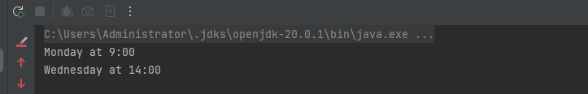
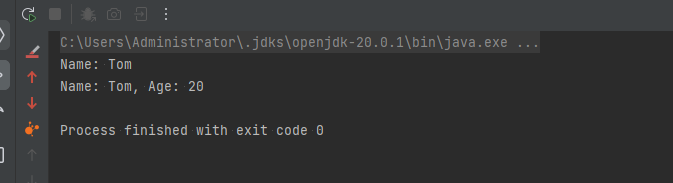
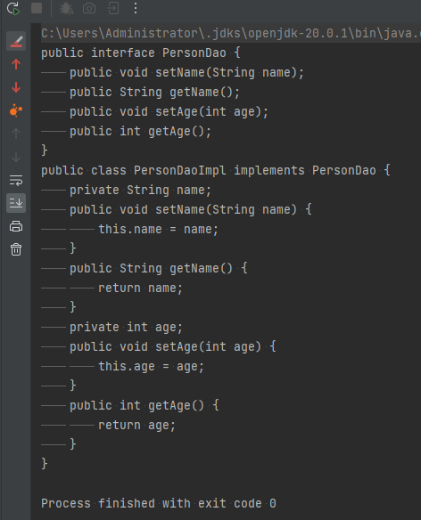

# 1、入门
## 1.1、什么是Java注解？为什么需要Java注解？ 
### 1.1.1、Java注解的定义和背景
#### 定义

- Java注解（Annotation）是一种元数据（metadata）机制，它提供了在代码中添加元数据的方式，以便在运行时进行解析和使用。Java注解可以用于描述程序的行为和约束，例如指定方法的参数、返回值、异常等信息，或者用于指定代码的行为和逻辑，例如标记某个方法为废弃的、启用某个功能等等。
#### 背景

- Java注解的背景是为了简化代码的编写和阅读，以及提供更丰富的元数据支持。在Java 5.0之前，程序员通常使用XML或属性文件等方式来指定元数据，这种方式不仅繁琐，而且容易出错。Java注解的出现，使得元数据可以以更简单、更直接的方式与代码一起编写，提高了代码的可读性和可维护性。
### 1.1.2、Java注解的作用和优势
#### 优点

- 1、提供元数据支持：Java注解是一种元数据机制，可以用于描述程序的行为和约束，例如指定方法的参数、返回值、异常等信息，或者用于指定代码的行为和逻辑，例如标记某个方法为废弃的、启用某个功能等等。
- 2、简化代码编写：Java注解让元数据可以以更简单、更直接的方式与代码一起编写，提高了代码的可读性和可维护性。注解可以直接加在代码中，不用像以前一样，需要将元数据写在XML或属性文件中。
- 3、增强编译时检查：Java注解可以在编译时检查代码，发现潜在的错误或问题，并给出警告信息，提高了代码的质量和健壮性。例如，@Deprecated注解可以提示程序员不要使用过时的方法，@Override注解可以确保重写父类方法时的正确性。
- 4、改善代码组织：Java注解可以让代码更好地组织起来，提高代码的清晰度和可读性。注解可以用于标记代码的某些特性，例如标记某个方法为测试用例、标记某个类为持久化类等等，这样可以让代码更加直观和易于理解。
- 5、增强框架扩展性：Java注解可以让框架更加灵活和可扩展。例如，在Spring框架中，注解可以用于描述Bean的作用域、生命周期等信息，这样可以让框架更好地管理Bean，并增强框架的可扩展性。
#### 缺点

- 1、注解的滥用会导致代码变得冗长，难以阅读和维护。
- 2、注解并不是面向对象的思想，过度使用注解会违背面向对象设计原则。
- 3、注解不能完全替代文档，有些注解需要额外的说明才能更好地理解其含义。
- 4、注解的使用需要一定的学习成本，新手可能会面临一定的挑战。
### 1.1.3、Java注解的使用场景和应用案例

1. 代码优化和检查
   - @Override: 用于标记子类中覆盖超类方法的注解，可用于检查覆盖方法的合法性和正确性。
   - @SuppressWarnings: 用于禁止编译器对指定的代码段产生警告的注解，可以减少不必要的编译器提示。
   - @SafeVarargs: 用于标记可变参数方法或构造函数的注解，确保参数的类型安全性。
2. 自定义注解和元注解
   - @Retention: 用于指定注解的声明周期（生命周期为源代码、编译时、运行时），是一个元注解。
   - @Target: 用于指定注解可以应用于程序的哪些元素，是一个元注解。
   - @Documented: 用于指定注解是否记录在Java文档中，是一个元注解。
   - @Inherited: 用于指定注解是否继承，是一个元注解。
3. 框架和库的应用
   - Spring框架中的注解，例如@Autowired、@Service、@Controller等，可以用于依赖注入、Web开发等场景。
   - JUnit测试框架中的注解，例如@Test、@Before、@After等，可以用于声明和执行测试用例。
   - Hibernate ORM框架中的注解，例如@Entity、@Table、@Column等，可以用于声明和映射实体类和关系数据库。
4. 元编程和AOP
   - @Aspect: 用于声明切面和通知规则的注解，可以用于AOP编程。
   - @Around: 用于声明环绕通知的注解，可以在方法执行前后进行额外的处理。
   - @Before和@After: 用于声明前置和后置通知的注解，可以在方法执行前和后进行额外的处理。
5. 其他应用
   - @Deprecated: 用于标记过时的API或方法的注解，可以帮助用户更好地阅读代码文档和接口说明。
   - @Native: 用于标记本地方法的注解，可以用于本地代码的调用和优化。
## 1.2、注解的基本语法和声明方式 
### 1.2.1、注解的声明和定义方式
#### 注解的声明方式

- Java注解的声明方式类似于声明接口，使用 @interface 关键字来声明一个注解。例如，声明一个名为 TestAnnotation 的注解，可以使用以下方式：
```
public @interface TestAnnotation {
    // 注解的属性和默认值
}
```
#### 注解的属性和默认值
Java注解可以包含属性和默认值，属性可以是任意基本数据类型、String、枚举类型、Class对象、注解类型和它们的一维数组类型。例如：
```
public @interface TestAnnotation {
   String name() default "defaultName";  // 带有默认值的String类型属性
    int value();  // 必填的int类型属性
    TestEnum testEnum() default TestEnum.DEFAULT;  // 带有默认值的枚举类型属性
    Class<?> clazz() default Object.class;  // 带有默认值的Class属性
    String[] role() default {};  // 空数组类型
    OtherAnnotation info() default @OtherAnnotation(str = "defaultInfo");  // 带有默认值的注解类型属性
}
```
其中，属性通过名称和值的方式进行赋值，如：@TestAnnotation(name="test", value=100)。
### 1.2.2、注解的元素类型和基本用法
#### 注解的元素类型
Java注解的元素类型包括普通类型（例如：int、String、boolean等）、Class类型、String数组类型、枚举类型和注解类型。元素类型用于限制注解可以存储的值的类型。例如：
```
public @interface TestAnnotation {
    int intValue();
    String stringValue();
    Class<?> clazzValue();
    String[] roleValue(); // 字符串数组类型
    TestEnum enumValue(); // 枚举类型
    OtherAnnotation annotationValue(); // 注解类型
}
```
#### 注解的使用方式
Java注解可以用于类、方法、字段等程序元素上。例如，在类上使用注解：
```
@TestAnnotation(name="test", value=100)
public class MyClass {
    // some code
}
```
或在方法上使用注解：
```
public class MyClass {
    @TestAnnotation(name="test", value=100)
    public void myMethod() {
        // some code
    }
}
```
### 1.2.3、注解的元注解和特殊用法
#### 元注解
Java注解的元注解是用于定义注解的注解。元注解包括以下几种：

- **@Target:** 用于声明注解可以应用于程序的哪些元素。枚举值包括类、接口、枚举、注解、方法、构造函数、字段、局部变量等。
- **@Retention:** 用于声明注解的生命周期，包括源代码、编译时和运行时。
- **@Documented: **用于指明注解是否会被记录在Java文档中。
- **@Inherited:** 用于指明子类是否可以继承父类的注解。
1. 元注解的使用
元注解可以在自定义注解上使用，例如：

```
@Target(ElementType.FIELD)
@Retention(RetentionPolicy.RUNTIME)
public @interface TestAnnotation {
    String value();
}
```

这里的 **@Target(ElementType.FIELD)** 和 **@Retention(RetentionPolicy.RUNTIME) **就是元注解。

1. 特殊用法
Java注解还有一些特殊用法，如下所示：
- 重复注解：Java 8开始支持重复注解，即相同注解可以在同一个程序元素上使用多次，这大大简化了注解的使用。
- 可重复的注解：为了支持重复注解，Java 8引入了 @Repeatable 注解，用于声明可重复的注解类型。
- 类型注解：Java 8开始支持类型注解，即可以将注解放到类型上，如泛型参数和返回类型等。
#### 重复注解和可重复的注解使用
```
import java.lang.annotation.Repeatable;
import java.lang.annotation.Retention;
import java.lang.annotation.RetentionPolicy;

@Repeatable(Schedules.class) // 声明可重复注解
@Retention(RetentionPolicy.RUNTIME)
public @interface Schedule {
    String dayOfWeek();
    String time();
}
```
在以上代码中，@Repeatable 注解用于声明该注解类型是可重复的，并指定了一个注解容器类型 Schedules，用于存储重复的 Schedule 注解。
```
import java.lang.annotation.Retention;
import java.lang.annotation.RetentionPolicy;

@Retention(RetentionPolicy.RUNTIME)
public @interface Schedules {
    Schedule[] value(); // 定义注解容器类型
}
```

在这里，注解容器 Schedules 的定义类似于一个注解，它由 Schedule 注解组成。
使用重复注解时，只需要在程序元素上添加多个 Schedule 注解即可，例如：

```
@Schedule(dayOfWeek = "Monday", time = "9:00")
@Schedule(dayOfWeek = "Wednesday", time = "14:00")
public class MyClass {
    // some code
}
```

在这里，@Schedule 注解在 MyClass 类上使用了两次，分别声明了该类的上课时间。当需要遍历所有的 Schedule 注解时，只需获取 Schedules 注解容器即可，例如：

```
Schedules schedules = MyClass.class.getAnnotation(Schedules.class);
if (schedules != null) {
    for (Schedule schedule : schedules.value()) {
        System.out.println(schedule.dayOfWeek() + " at " + schedule.time());
    }
}
```
以上代码可以输出该类的所有上课时间。

## 1.3、常用内置注解和自定义注解 
### 1.3.1、内置注解的作用和用法
#### 元注解
**元注解是用于定义注解的注解，其作用是控制注解的行为。**

- @Target：用于声明注解可以应用于程序的哪些元素。枚举值包括类、接口、枚举、注解、方法、构造函数、字段、局部变量等。
- @Retention：用于声明注解的生命周期，包括源代码、编译时和运行时。
- @Documented：用于指明注解是否会被记录在Java文档中。
- @Inherited：用于指明子类是否可以继承父类的注解。
#### 常用注解
**常用注解用于标记程序元素，以实现特定的功能。**

- @Override：表示一个方法是重写超类中的同名方法，如果不是则会编译错误。
- @Deprecated：表示一个方法已经被废弃，建议使用新的方法。
- @SuppressWarnings：用于抑制编译器产生的某些警告，例如 @SuppressWarnings(“unchecked”)。
- @FunctionalInterface：用于声明一个接口是函数接口，只能有一个抽象方法，否则会编译错误。
- @SafeVarargs：用于抑制编译器产生的关于可变长参数的警告，表示不会出现堆污染。
#### 使用案例
```java
import java.util.List;

public class MyUtils {
    @SuppressWarnings("unchecked")
    public static <T> List<T> cast(Object value) {
        return (List<T>) value;
    }

    @Override
    public String toString() {
        return super.toString();
    }

    @SafeVarargs
    static void process(List<String>... stringLists) {
        for (List<String> list : stringLists) {
            System.out.println(list);
        }
    }

    @FunctionalInterface
    interface Foo {
        void bar();
    }

    @Deprecated
    static void oldMethod() {
        // some code
    }
    // some code
}
```

- 在以上代码中，使用了 @SuppressWarnings、@Override、@SafeVarargs、@FunctionalInterface 和 @Deprecated 注解，分别用于抑制参数类型转换警告、标记重写超类方法、抑制可变变量类型警告、声明一个函数式接口和标记一个旧方法已废弃。
### 1.3.2、自定义注解的定义和应用场景
#### 自定义注解的定义
自定义注解通过 @interface 关键字定义，格式如下：
```java
[可见修饰符] @interface 注解名称{
    注解属性列表
}
```
注解属性列表中常用的成员类型有原始类型（int、float、boolean等）、String和Class以及枚举类型和注解类型。
#### 自定义注解的示例
```java
@Target(ElementType.METHOD) // 该注解只能用于方法上
@Retention(RetentionPolicy.RUNTIME) // 该注解在运行时有效
public @interface Author {
    String name();  // 作者姓名
    String date();  // 作品发布日期
}
```

- 注解 Author 定义了两个属性，分别表示作者的姓名和作品的发布日期。使用 @Target 和 @Retention 注解指定了注解可以应用的程序元素类型和生命周期。
#### 应用场景
自定义注解可以用于以下场景：

- **（1）标记方法：通过自定义注解标记某个方法，可以自动触发一些特定的行为，例如生成日志文件。**
- **（2）简单替代XML文件：有些场景下开发者需要为某些数据（如配置信息）创建XML文件，而自定义注解可以取代XML文件作为存储这些数据的方式，大大提高代码的可读性和易维护性。**
- **（3）框架整合：在框架整合中，自定义注解可以起到很好的作用。常见的如SpringMVC框架中，利用注解标识实现请求的映射和参数的绑定。**
- **（4）代码生成：自定义注解可以用于代码生成器中，在生成代码的同时为其添加某些自定义的注解。**
- **（5）自动验证和校验：通过添加自定义的注解，可以在编译器进行自动验证和校验，大大提高代码的可靠性和安全性。**
### 1.3.3、注解的属性和元素类型
注解的属性包括了以下几种类型：

- 1、基本数据类型： 如 int、float、boolean 等
- 2、String/String[]： 用于表示字符串类型
- 3、Class： 用于表示类型
- 4、枚举类型： 用于表示只有几个可选值的属性
- 5、其他注解： 用于嵌套表示不同的属性关系

元素类型是指注解的属性类型，Java中定义的注解中的元素类型可以是以上 1-5 种类型。以下是注解的属性和元素类型的示例：
```java
//自定义注解
public @interface MyAnnotation{
   // 注解元素1 
   String author();
   
   // 注解元素2 
   int version() default 1;
   
   // 注解元素3 
   String[] tags() default {};
   
   // 注解元素4 
   Class<?> testClass();

   // 注解元素5 
   String color() default "blue";

   // 注解元素6
   Type type() default Type.CLASS;
 
   // 注解元素7
   Override overrides();
}

//枚举类型
public enum Type {
    CLASS,
    INTERFACE,
    ENUM,
    ANNOTATION_TYPE;
}

//注解类型
public @interface Override{
   
}
```
在上面的示例中， MyAnnotation 注解定义了7个元素，其中包括了基本数据类型、字符串、Class类型、枚举类型以及其他注解类型。比如，元素1 author() 返回 String 类型，元素7 overrides() 表示其他注解类型。
## 1.4、反射和注解的基本概念 
### 1.4.1、Java反射机制的定义和使用
#### 定义

- Java反射机制是指在运行时动态地获取类的信息，并可以使用获取的信息在运行时创建对象、访问类成员以及调用对象方法，而不需要提前编写代码来实现这些操作的技术。
- 反射机制是Java语言的一项高级特性，可以使得Java程序具有更加灵活的动态性和扩展性，常用于开发框架、注解处理器、编译时代码生成器等领域。
#### 使用流程
下面是Java反射机制的使用流程：

- 1、获取Class对象
   - Java反射的第一步是获取Class对象，有以下几种方法可以获取Class对象：通过类名使用Class.forName()方法、使用对象的getClass()方法、使用类的class关键字。获取Class对象后，就可以得到类的所有信息和成员。
- 2、获取类的构造函数
   - 通过 Class 对象可以获取类的构造函数，通过构造函数可以创建对象。
- 3、获取类的成员变量
   - 通过 Class 对象可以获取类的成员变量，成员变量包括了字段和方法。
- 4、获取类的方法
   - 通过 Class 对象可以获取类的方法，包括了公有方法和私有方法。
- 5、调用类的方法和访问类的成员变量
   - 通过方法或者字段可以对类的成员变量进行访问，也可以调用方法。
#### 反射示例
定义一个 Person 类
```java
public class Person {
    private String name;
    private int age;

    public Person() {

    }

    public Person(String name, int age) {
        this.name = name;
        this.age = age;
    }

    public void printInfo() {
        System.out.println("Name: " + name + ", Age: " + age);
    }
}
```
获取 Person 类中的信息
```java
package com.zhz.designpatterns.test;

import java.lang.reflect.Constructor;
import java.lang.reflect.Field;
import java.lang.reflect.Method;

public class ReflectionTest {
    public static void main(String[] args) throws Exception {
        // 获取Person类的Class对象
        Class<?> clazz = Class.forName("com.zhz.designpatterns.test.Person");

        // 获取Person类的构造函数
        Constructor<?> constructor = clazz.getConstructor(String.class, int.class);

        // 创建Person对象
        Object person = constructor.newInstance("Tom", 20);

        // 获取Person对象的name字段
        Field field = clazz.getDeclaredField("name");
        field.setAccessible(true);
        String name = (String) field.get(person);
        System.out.println("Name: " + name);

        // 调用Person对象的方法
        Method method = clazz.getDeclaredMethod("printInfo");
        method.invoke(person);
    }
}
```
#### 展示效果

### 1.4.2、反射和注解的联系和区别
#### 联系

- （1）反射和注解都属于Java语言的高级特性，都可以使得Java程序具有更加灵活的动态性和扩展性。
- （2）在某些应用场景下，反射和注解可以结合起来使用，例如在框架整合、编译时代码生成器、注解处理器等领域。
#### 区别

- （1）反射是一种用于运行时获取类信息和操作对象的一种机制，它的核心是反射API，可以使用反射API来获取类的信息、创建对象、访问成员变量和调用方法等。
- （2）注解是一种为代码提供元数据的一种机制，它的作用是为程序元素打上标记，表明其作用和属性。注解并不会直接影响到程序的运行，它们只是为程序增加了额外的信息，可以被编译器、框架或者开发工具所使用。
- （3）反射机制主要用于运行时动态地获取类的信息，并可以使用获取的信息在运行时创建对象、访问类成员以及调用对象方法等，它可以帮助开发人员实现一些框架、工具和系统的基础架构代码。
- （4）注解机制主要用于为程序元素添加标记和元数据，可以帮助开发人员实现框架的自动配置、代码自动生成和元数据存储等功能。
- （5）反射机制的使用需要涉及到反射API的使用，涉及较多的底层调用和类型转换，使用反射API需要注意安全和性能问题。
- （6）注解机制的使用相对比较简单，代码可读性好，可以提升开发效率。但是，注解不应滥用，它们仅适合增强代码的可读性和编写框架、库和工具等。
### 1.4.3、反射API的基本操作和应用
#### 基本操作

- 1、获取Class对象
   - 在Java反射中，首先需要获取用于表示类的Class对象，有以下几种方式：
      - （1）使用类的静态属性class：`Class<Person> clazz = Person.class;`
      - （2）使用Class.forName() 方法：`Class<?> clazz = Class.forName("Person");`
      - （3）使用类对象的getClass() 方法：`Class<?> clazz = person.getClass();`
- 2、创建对象
   - Java反射机制可以通过Class对象在运行时动态创建对象，有以下几种方式：
      - （1）使用Class对象的newInstance() 方法（需要类有一个无参的构造方法）：Person person = clazz.newInstance();
      - （2）使用Constructor对象的newInstance() 方法：`Constructor<?> constructor = clazz.getConstructor(String.class, int.class); Person person = (Person)constructor.newInstance("Tom", 20);`
- 3、获取字段和方法
   - Java反射机制可以通过Class对象获取类的字段和方法，有以下几种方式：
      - （1）使用Class对象的getField() 和getDeclaredField() 方法获取字段：`Field field = clazz.getDeclaredField("name")`;
      - （2）使用Class对象的getMethod() 和getDeclaredMethod() 方法获取方法：`Method method = clazz.getMethod("printInfo")`;
- 4、调用方法和访问字段
   - 反射机制可以使用 Method 对象调用对象的方法，也可以使用 Field对象访问对象的字段，有以下几种方式：
      - （1）使用Method对象调用对象方法：`method.invoke(person)`;
      - （2）使用Field对象访问对象字段：`field.setAccessible(true);String name = (String)field.get(person)`;
#### 应用场景

- 1、动态代理
   - 动态代理是 Java 反射机制的一种实现方式，可以在不修改被代理类的情况下，动态地创建代理类来控制对被代理对象的访问，通过代理对象可以执行一些额外的操作，例如记录日志、安全检查等。
- 2、序列化和反序列化
   - Java序列化机制可以将一个Java对象转化为字节序列，反序列化可以将字节序列转换为Java对象。在序列化和反序列化中，Java反射机制扮演了重要角色，通过反射机制可以获取到Java对象的类型信息，进而实现序列化和反序列化。
- 3、代码依赖注入
   - 依赖注入是指通过控制反转（IoC）的方式，将依赖关系交由IoC容器来管理，从而有效地减少组件之间的耦合度。在Java中，依赖注入的实现方式之一就是采用反射机制，通过反射动态地获取实例，并自动注入依赖关系。
- 4、类加载机制
   - 在Java虚拟机中，类加载机制是类和对象的生命周期管理机制，它可以根据需要在运行时动态地加载类，Java反射机制可以扩展类加载器，从而实现自定义的类加载机制，例如自定义的类路径加载器、网络加载器等。
# 2、进阶
## 2.1、注解的高级应用和实践 
### 2.1.1、注解的运用技巧和实际案例
#### 自定义注解
Java提供了许多常见的注解，例如@Deprecated、@Override、@SuppressWarnings 等，但是有时候，这些注解并不能满足我们的需求，此时，开发人员可以自定义注解来满足特定的需求。自定义注解需要使用 @interface 关键字来定义，开发人员可以在注解中定义元数据和属性，可以通过反射机制来访问注解中的元数据。
```java
/**
 * 自定义注解，注解类成员变量 value，类型为 String
 */
@Retention(RetentionPolicy.RUNTIME)
@Target(ElementType.METHOD)
public @interface MyAnnotation {
    String value();
}

/**
 * 用自定义注解标记方法
 */
public class MyService {

    @MyAnnotation("这是我的服务实现方法")
    public void doService() {
        // ...
    }
}

/**
 * 通过反射机制获取MyService类的所有方法，并根据注解标记生成文档
 */
public class AnnotationDemo {
    public static void main(String[] args) throws Exception {
        Class<MyService> myServiceClass = MyService.class;
        Method[] methods = myServiceClass.getDeclaredMethods();
        for (Method method : methods) {
            if (method.isAnnotationPresent(MyAnnotation.class)) {
                MyAnnotation annotation = method.getAnnotation(MyAnnotation.class);
                System.out.println(annotation.value());
            }
        }
    }
}
```
#### 自动代码生成器
Java注解可以被用于自动代码生成器，例如MyBatis框架中的 Mapper 接口，根据注解自动生成SQL语句和Java接口的实现。注解和反射机制可以帮助开发人员实现代码的自动化生成，提高开发效率和代码质量。
**我们假设有一个注解 @SimplePojo，用于标记简单的POJO类，我们需要根据 @SimplePojo 注解生成相应的 DAO 接口和实现类。**
@SimplePojo
```java
package com.zhz.designpatterns.test;
import java.lang.annotation.*;

@Retention(RetentionPolicy.RUNTIME)
@Target(ElementType.TYPE)
public @interface SimplePojo {
}
```
Person
```java
package com.zhz.designpatterns.test;
import java.lang.annotation.*;

@Retention(RetentionPolicy.RUNTIME)
@Target(ElementType.TYPE)
public @interface SimplePojo {
}
```
**定义一个自动代码生成器，根据 @SimplePojo 注解生成相应的 DAO 接口和实现类：**
SimpleDaoGenerator 
```java
package com.zhz.designpatterns.test;
import java.lang.reflect.Field;
import java.lang.reflect.Method;
import java.lang.reflect.Modifier;
import java.util.ArrayList;
import java.util.List;

public class SimpleDaoGenerator {
    public static void generateDao(Class<?> clazz) {
        // 判断是否有 @SimplePojo 注解
        if(!clazz.isAnnotationPresent(SimplePojo.class)){
            return;
        }
        SimplePojo annotation = clazz.getAnnotation(SimplePojo.class);

        // 生成DAO接口
        String daoInterfaceName = clazz.getSimpleName() + "Dao";
        System.out.println("public interface " + daoInterfaceName + " {");
        Field[] fields = clazz.getDeclaredFields();
        for (Field field : fields) {
            String fieldName = field.getName();
            Class<?> fieldType = field.getType();
            System.out.println("\tpublic void set" + capitalize(fieldName) +
                        "(" + fieldType.getSimpleName() + " " + fieldName + ");");
            System.out.println("\tpublic " + fieldType.getSimpleName() + " get" +
                        capitalize(fieldName) + "();");
        }
        System.out.println("}");

        // 生成DAO实现类
        String daoImplName = clazz.getSimpleName() + "DaoImpl";
        System.out.println("public class " + daoImplName +
                    " implements " + daoInterfaceName + " {");
        for (Field field : fields) {
            String fieldName = field.getName();
            Class<?> fieldType = field.getType();
            String fieldSimpleName = fieldType.getSimpleName();
            String methodName = capitalize(fieldName);
            System.out.println("\tprivate " + fieldSimpleName + " " + fieldName + ";");
            System.out.println("\tpublic void set" + methodName + "(" + fieldSimpleName +
                        " " + fieldName + ") {");
            System.out.println("\t\t" + "this." + fieldName + " = " + fieldName + ";");
            System.out.println("\t}");
            System.out.println("\tpublic " + fieldSimpleName + " get" + methodName + "() {");
            System.out.println("\t\t" + "return " + fieldName + ";");
            System.out.println("\t}");
        }
        System.out.println("}");
    }

    // 首字母大写
    private static String capitalize(String s) {
        if(s == null || s.length() == 0){
            return s;
        }
        return s.substring(0, 1).toUpperCase() + s.substring(1);
    }
}
```
使用反射机制来获取JavaBean的字段信息，然后根据字段信息生成 DAO 接口和实现类，并输出到控制台。
Main
```java
package com.zhz.designpatterns.test;
public class Main {
    public static void main(String[] args) throws ClassNotFoundException {
        //person为包路径
        SimpleDaoGenerator.generateDao(Class.forName("com.zhz.designpatterns.test.Person"));
    }
}
```
执行效果

#### 编译时代码检查器
Java注解可以被用于实现编译时代码检查器，例如Hibernate Validator框架中的注解，可以在编译时检查持久化类的规则和限制条件。注解和元数据机制可以帮助开发人员实现编译时检查和校验，避免程序运行时出现错误。
```java
/**
 * 注解，标记注册用户时密码不能为空
 */
@Target(ElementType.FIELD)
@Retention(RetentionPolicy.RUNTIME)
@Constraint(validatedBy = PasswordValidator.class)
public @interface Password {
    String message() default "密码不能为空";
    Class<?>[] groups() default {};
    Class<? extends Payload>[] payload() default {};
}

/**
 * 验证器，判断用户密码是否为空
 */
public class PasswordValidator implements ConstraintValidator<Password, String> {
    public void initialize(Password constraint) {
    }

    public boolean isValid(String password, ConstraintValidatorContext context) {
        if (password == null || password.trim().length() == 0) {
            return false;
        }
        return true;
    }
}

/**
 * Java Bean，标记用户注册信息
 */
public class User {
    @Password
    private String password;
}
```
#### IoC容器配置
Java注解可以被用于IoC容器的配置，例如Spring框架中的 @Autowired、@Component、@Service、@Repository 等注解，可以帮助开发人员实现IoC容器的自动装配、组件扫描和注解驱动等功能。注解和反射机制可以帮助开发人员实现Spring框架中的各种IoC和AOP特性。
#### Web框架开发
Java注解可以被用于Web框架的开发，例如Spring MVC框架中的 @RequestMapping、@PathVariable 等注解，可以帮助开发人员实现Web请求的映射、参数绑定、响应格式等功能。注解和反射机制可以帮助开发人员实现Web应用开发的自动化和高度可扩展性。
#### 测试框架和单元测试
Java注解可以被用于测试框架和单元测试中，例如JUnit框架中的 @Test、@Before、@After、@Ignore 等注解，可以帮助开发人员实现测试用例的自动生成、自动运行和自动报告等功能。注解和反射机制可以帮助开发人员实现测试框架的自动化测试和测试报告。
#### 日志框架和日志处理
Java注解可以被用于日志框架和日志处理中，例如Log4j2框架中的 @Logger、@Log、@Log4j2 等注解，可以帮助开发人员实现日志的生成、处理和存储等功能。注解和反射机制可以帮助开发人员实现日志框架的自动装配和日志记录。
#### 数据库和ORM框架
Java注解可以被用于数据库和ORM框架中，例如JPA框架中的 @Entity、@Table、@Column、@Id 等注解，可以帮助开发人员实现持久化对象的自动创建、自动修改和自动删除等功能。注解和反射机制可以帮助开发人员实现ORM框架的自动映射和持久化。
#### Restful API
Java注解可以被用于Restful API中，例如Jersey框架中的 @Path、@GET、@POST、@PUT 等注解，可以帮助开发人员实现Web服务的路由、参数绑定和返回格式等功能。注解和反射机制可以帮助开发人员实现Web服务的自动映射和自动化测试。
### 2.1.3、注解和模块化思想的结合
注解和模块化思想可以结合起来，通过定义模块化的注解，实现对不同模块的标记和区分，从而更好地组织代码和管理模块之间的依赖关系。

在Java 9之后，Java平台已经支持了模块化，通过定义module-info.java文件，可以将代码组织成为一个模块，隐藏具体的实现细节，提供依赖管理等特性。而在模块之间可能会存在一定的依赖关系，这时候可以通过使用注解，标记模块之间的依赖关系。 
例如，我们可以定义一个@DependsOn注解，用来标记一个模块依赖于另一个模块：
```java
@Retention(RetentionPolicy.RUNTIME)
@Target(ElementType.TYPE)
public @interface DependsOn {

    String[] value();
}
```
这里使用@Target注解指定了注解可以用于哪些类型的元素，这里是用于类上。使用@Retention注解指定了注解的保留策略，这里是运行时保留。最后，定义了一个value属性，用来指定依赖的模块。
在模块化的代码中，可以在module-info.java文件中使用这个注解，标记模块之间的依赖关系。例如，假设我们有一个模块module1，依赖于另一个模块module2，可以这样定义module-info.java文件：
```java
module module1 {
    requires module2;

    // 其他配置
}

@DependsOn("module1")
module module2 {
    // 其他配置
}
```
这里使用requires关键字定义了module1依赖于module2。同时，使用@DependsOn注解将module2的依赖关系标记为module1，方便维护和管理模块之间的依赖。
通过定义这样的模块化注解，可以将代码更好地组织成为一个个模块，降低代码的耦合度，提高代码的可读性和可维护性，从而能够更好地适应复杂的应用场景。
## 2.2、编译时代码生成和处理注解 
### 2.2.1、Annotation Processing的基本知识和应用

- Annotation Processing是在Java编译时自动生成代码和资源的一种机制。最常见的应用场景是自动生成Java代码、XML配置文件、属性文件等资源，以及为框架提供扩展能力等。
- Annotation Processing的核心概念包括注解处理器（Annotation Processor）、注解（Annotation）、元素
（Element）、轮次（Round）等。
#### 注解处理器（Annotation Processor）

- 注解处理器是实现Annotation Processor接口的Java类，用于处理Java源文件中的注解。在处理Java源文件时，注解处理器会对使用了特定注解的元素进行处理，并可以生成新的Java源文件或其他类型的资源文件。
- 注解处理器通常会使用javax.annotation.processing包中的多个类和接口，例如AbstractProcessor、ProcessingEnvironment、Filer等，来完成特定的处理逻辑。同时，注解处理器也可以使用Java Reflection来获取和操作注解元素的信息。
#### 注解（Annotation）

- 注解是在Java源代码中添加元数据的一种方式，用于为代码提供更多的信息或进行标记。注解是通过Java反射机制获取并解释的。
- 注解类在声明时需要使用 @interface 关键字来定义，注解元素可以定义默认值和元素值。
```java
@Retention(RetentionPolicy.RUNTIME)
@Target(ElementType.TYPE)
public @interface MyAnnotation {
    int value();
}
```

- 这里定义了一个@MyAnnotation注解，包含一个元素value，该元素是int类型的。同时使用@Retention和@Target注解指定了注解的保留策略和作用范围。
#### 元素（Element）

- 元素是Java编译器中的一个通用术语，它指代一段代码中的语法成分。在Annotation Processing中，元素则是指Java源文件中使用了注解的位置。例如，对于一个使用了@MyAnnotation注解的类，Class对象就是一个元素。
- 在注解处理器中，可以通过RoundEnvironment对象获取所有使用了特定注解的元素，并进行处理。
#### 轮次（Round）

- Annotation Processing是通过轮次执行的，每一轮中都包含了所有的源文件和所有已经处理过的元素。在一轮中，注解处理器会根据已经处理的元素来处理下一个元素，直到所有的元素都被处理完毕。
- 如果在处理某个元素的过程中生成了新的Java源文件，那么这个源文件会在下一轮中被加入到编译器的处理列表中，接着继续执行注解处理器的处理逻辑。
- 注解处理器通过调用AnnotationProcessingUtils类的getElementsAnnotatedWith方法，获取所有使用了特定注解的元素。同时，在处理过程中，还可以使用Filer接口来生成新的Java源文件或其他类型的文件。
### 2.2.2、编译时注解处理器的实现和使用
#### 扩展学习
JavaPoet是square推出的开源java代码生成框架，提供Java Api生成.java源文件。这个框架功能非常有用，我们可以很方便的使用它根据注解、数据库模式、协议格式等来对应生成代码。通过这种自动化生成代码的方式，可以让我们用更加简洁优雅的方式要替代繁琐冗杂的重复工作。
项目主页及源码：[https://github.com/square/javapoet](https://link.jianshu.com?t=https://github.com/square/javapoet)
#### 项目总览
该项目代码量相对较小，只有一个package（com.squareup.javapoet），所有类均位于该package下。
##### 大体结构图


#### 关键类说明
| class | 说明 |  |
| --- | --- | --- |
| JavaFile | A Java file containing a single top level class | 用于构造输出包含一个顶级类的Java文件 |
| TypeSpec | A generated class, interface, or enum declaration | 生成类，接口，或者枚举 |
| MethodSpec | A generated constructor or method declaration | 生成构造函数或方法 |
| FieldSpec | A generated field declaration | 生成成员变量或字段 |
| ParameterSpec | A generated parameter declaration | 用来创建参数 |
| AnnotationSpec | A generated annotation on a declaration | 用来创建注解 |

在JavaPoet中，JavaFile是对.java文件的抽象，TypeSpec是类/接口/枚举的抽象，MethodSpec是方法/构造函数的抽象，FieldSpec是成员变量/字段的抽象。这几个类各司其职，但都有共同的特点，提供内部Builder供外部更多更好地进行一些参数的设置以便有层次的扩展性的构造对应的内容。
另外，它提供$L(for Literals), $S(for Strings), $T(for Types), $N(for Names)等标识符，用于占位替换。
#### 相关使用
#####  API使用
关于JavaPoet 的API使用，官方Github主页已经有很详细的使用说明和示例了，具体可前往查看。此处不赘述，详见 [项目主页、源码及使用说明](https://link.jianshu.com?t=https://github.com/square/javapoet)
##### 一个简单示例
下面就让我们以一个简单HelloWorld的例子来开启我们的JavaPoet之旅。
引入库：
build.gradle
```bash
compile 'com.squareup:javapoet:1.9.0'
```
例子如下:
```java
package com.example.helloworld;

public final class HelloWorld {
  public static void main(String[] args) {
    System.out.println("Hello, JavaPoet!");
  }
}
```
上方的代码是通过下方代码调用JavaPoet的API生成的：
```java
MethodSpec main = MethodSpec.methodBuilder("main")
    .addModifiers(Modifier.PUBLIC, Modifier.STATIC)
    .returns(void.class)
    .addParameter(String[].class, "args")
    .addStatement("$T.out.println($S)", System.class, "Hello, JavaPoet!")
    .build();

TypeSpec helloWorld = TypeSpec.classBuilder("HelloWorld")
    .addModifiers(Modifier.PUBLIC, Modifier.FINAL)
    .addMethod(main)
    .build();

JavaFile javaFile = JavaFile.builder("com.example.helloworld", helloWorld)
    .build();

javaFile.writeTo(System.out);
```
#### 源码浅析
下面来看看调用了JavaFile的writeTo后实际做了些什么。
```java
  public void writeTo(Appendable out) throws IOException {
    // First pass: emit the entire class, just to collect the types we'll need to import.
    CodeWriter importsCollector = new CodeWriter(NULL_APPENDABLE, indent, staticImports);
    emit(importsCollector);
    Map<String, ClassName> suggestedImports = importsCollector.suggestedImports();

    // Second pass: write the code, taking advantage of the imports.
    CodeWriter codeWriter = new CodeWriter(out, indent, suggestedImports, staticImports);
    emit(codeWriter);
  }
```
通过源码可以知道，writeTo分为两部分：第一步收集import，记录下来后第二步才跟随内容一起写到CodeWriter。
另外我们可以看到源码中的emit方法，通过查看其它源码发现，在JavaPoet中，所有java文件的抽象元素都定义了emit方法，如TypeSepc，ParameterSepc等，emit方法传入CodeWriter对象输出字符串。上层元素调用下层元素的emit方法，如JavaFile的emit方法调用TypeSpec的emit方法，从而实现整个java文件字符串的生成。
下面我们以MethodSpec为例，查看其emit代码：
```java

  void emit(CodeWriter codeWriter, String enclosingName, Set<Modifier> implicitModifiers)
      throws IOException {
    codeWriter.emitJavadoc(javadoc);
    codeWriter.emitAnnotations(annotations, false);
    codeWriter.emitModifiers(modifiers, implicitModifiers);

    if (!typeVariables.isEmpty()) {
      codeWriter.emitTypeVariables(typeVariables);
      codeWriter.emit(" ");
    }

    if (isConstructor()) {
      codeWriter.emit("$L(", enclosingName);
    } else {
      codeWriter.emit("$T $L(", returnType, name);
    }

    boolean firstParameter = true;
    for (Iterator<ParameterSpec> i = parameters.iterator(); i.hasNext(); ) {
      ParameterSpec parameter = i.next();
      if (!firstParameter) codeWriter.emit(",").emitWrappingSpace();
      parameter.emit(codeWriter, !i.hasNext() && varargs);
      firstParameter = false;
    }

    codeWriter.emit(")");

    if (defaultValue != null && !defaultValue.isEmpty()) {
      codeWriter.emit(" default ");
      codeWriter.emit(defaultValue);
    }

    if (!exceptions.isEmpty()) {
      codeWriter.emitWrappingSpace().emit("throws");
      boolean firstException = true;
      for (TypeName exception : exceptions) {
        if (!firstException) codeWriter.emit(",");
        codeWriter.emitWrappingSpace().emit("$T", exception);
        firstException = false;
      }
    }

    if (hasModifier(Modifier.ABSTRACT)) {
      codeWriter.emit(";\n");
    } else if (hasModifier(Modifier.NATIVE)) {
      // Code is allowed to support stuff like GWT JSNI.
      codeWriter.emit(code);
      codeWriter.emit(";\n");
    } else {
      codeWriter.emit(" {\n");

      codeWriter.indent();
      codeWriter.emit(code);
      codeWriter.unindent();

      codeWriter.emit("}\n");
    }
  }
```
可以看出，MethodSepc通过调用codeWriter的emit方法依次输出javadoc，annotation，parameter，codeblock等。
#### 使用场景
##### 根据编译时注解生成代码
###### 前言
用过[butterknife](https://link.jianshu.com?t=https://github.com/JakeWharton/butterknife)的同学会发现，使用butterknife我们可以省去平时重复书写的findViewById之类的代码，通过注解的方式即可实现。而早期的butterknife使用的注解是运行时注解，即运行时通过注解然后使用反射实现，存在一定的性能问题，后面作者做了改进，使用编译时注解，编译期间，在注解处理器中对注解进行处理生成相应代码。
通过查看butterknife源码，如下：

- build.gradle (butterknife-parent)
```java
  ext.deps = [
    ...
    javapoet: 'com.squareup:javapoet:1.8.0',
    ...
  ]
```

- build.gradle (butterknife-compiler)
```java
dependencies {
    ...
    compile deps.javapoet
    ...
}
```

- ButterKnifeProcessor.java (butterknife-compiler)
（注解处理器）
```java
  @Override 
  public boolean process(Set<? extends TypeElement> elements, RoundEnvironment env) {
    Map<TypeElement, BindingSet> bindingMap = findAndParseTargets(env);

    for (Map.Entry<TypeElement, BindingSet> entry : bindingMap.entrySet()) {
      TypeElement typeElement = entry.getKey();
      BindingSet binding = entry.getValue();

      JavaFile javaFile = binding.brewJava(sdk);
      try {
        javaFile.writeTo(filer);
      } catch (IOException e) {
        error(typeElement, "Unable to write binding for type %s: %s", typeElement, e.getMessage());
      }
    }

    return false;
  }
```
可以看到butterknife在编译时在Processor中获取对应的注解，然后使用JavaPoet进行代码生成工作。（事实上开源框架Dagger也使用了JavaPoet）
###### 一个简单示例
本节将简单演示利用编译时注解+JavaPoet来实现编译期间动态生成代码。
**工程目录结构：**

- Hello 
   - app
   - hello-annotation (注解相关)
   - hello-compiler （处理器生成代码相关）

**①. 导入依赖：**
build.gralde (project)
```bash
buildscript {
    ...
    dependencies {
        ...
        classpath 'com.neenbedankt.gradle.plugins:android-apt:1.8'
    }
}
```
build.gradle (Module:app)
```bash
apply plugin: 'com.neenbedankt.android-apt'
dependencies {
    ...
    compile project(':hello-annotation')
    apt project(':hello-compiler')
}
```
```bash
dependencies {
    ...
    compile 'com.squareup:javapoet:1.9.0'
    compile 'com.google.auto.service:auto-service:1.0-rc2'
}
```
**注：** 自Android Gradle 插件 2.2 版本开始，官方提供了名为 annotationProcessor 的功能来完全代替 android-apt。
若工程使用gradle版本>=2.2，则此处无需引用com.neenbedankt.android-apt相关，将 apt project(':hello-compiler') 改为 annotationProcessor project(':hello-compiler') 即可。
**②. 定义注解：** (Module:hello-annotation)
HelloAnnotation.java
```java
@Retention(RetentionPolicy.CLASS)
@Target(ElementType.TYPE)
public @interface HelloAnnotation {
}
```
**③. 定义Processor：** (Module:hello-compiler)
HelloProcessor.java
```java

@AutoService(Processor.class)
public class HelloProcessor extends AbstractProcessor {
    private Filer filer;

    @Override
    public synchronized void init(ProcessingEnvironment processingEnv) {
        super.init(processingEnv);
        filer = processingEnv.getFiler(); // for creating file
    }

    @Override
    public boolean process(Set<? extends TypeElement> annotations, RoundEnvironment roundEnv) {
        for (TypeElement element : annotations) {
            if (element.getQualifiedName().toString().equals(HelloAnnotation.class.getCanonicalName())) {
                // main method
                MethodSpec main = MethodSpec.methodBuilder("main")
                        .addModifiers(Modifier.PUBLIC, Modifier.STATIC)
                        .returns(void.class)
                        .addParameter(String[].class, "args")
                        .addStatement("$T.out.println($S)", System.class, "Hello, JavaPoet!")
                        .build();
                // HelloWorld class
                TypeSpec helloWorld = TypeSpec.classBuilder("HelloWorld")
                        .addModifiers(Modifier.PUBLIC, Modifier.FINAL)
                        .addMethod(main)
                        .build();

                try {
                    // build com.example.HelloWorld.java
                    JavaFile javaFile = JavaFile.builder("com.example", helloWorld)
                            .addFileComment(" This codes are generated automatically. Do not modify!")
                            .build();
                    // write to file
                    javaFile.writeTo(filer);
                } catch (IOException e) {
                    e.printStackTrace();
                }
            }
        }
        return true;
    }

    @Override
    public Set<String> getSupportedAnnotationTypes() {
        return Collections.singleton(HelloAnnotation.class.getCanonicalName());
    }

    @Override
    public SourceVersion getSupportedSourceVersion() {
        return SourceVersion.latestSupported();
    }

}
```
**④. 使用注解并调用生成的类函数**
MainActivity.java (Module:app)
```java
@HelloAnnotation
public class MainActivity extends AppCompatActivity {

    @Override
    protected void onCreate(Bundle savedInstanceState) {
        super.onCreate(savedInstanceState);
        setContentView(R.layout.activity_main);
        HelloWorld.main(null);
    }
}
```
未编译前，HelloWorld.java是不存在的，这里会报错。那么，我们尝试编译一下，就会发现HelloWorld.java会自动生成，如下：
```java
//  This codes are generated automatically. Do not modify!
package com.example;

import java.lang.String;
import java.lang.System;

public final class HelloWorld {
  public static void main(String[] args) {
    System.out.println("Hello, JavaPoet!");
  }
}

```
#####  根据协议文件生成对应代码
假设我们对类的声明以及接口的声明是以特定格式写在一个协议文件中，那么我们可以先读取该协议文件内容，使用JavaPoet根据协议对应生成Java代码。
如定义以下协议文件：
```java
service TestDemo {
    rpc doRequest (MyRequest) returns (MyResponse) { // 请求接口定义
    }
    
    message MyRequest { // 请求内容实体
        string content;
    }
    
    message MyResponse { // 返回内容实体
        int32 status_code;
        string entity;
    }
}
```
那么利用JavaPoet我们可以生成对应的TestDemo.java, MyRequest.java, MyResponse.java, 以及TestDemo.java中对应的请求接口和实现。
**注：此部分协议定义参考自google开源的protobuffer和grpc**
#### 注解处理器（Annotation Processor）
> 注解处理器（Annotation Processor）是javac的一个工具，它用来在编译时扫描和处理注解（Annotation）。你可以自定义注解，并注册相应的注解处理器（自定义的注解处理器需继承自AbstractProcessor）。

##### 自定义注解处理器
定义一个注解处理器，需要继承自AbstractProcessor。如下所示：
```java
package com.example;

public class MyProcessor extends AbstractProcessor {

    @Override
    public synchronized void init(ProcessingEnvironment env){ }

    @Override
    public boolean process(Set<? extends TypeElement> annoations, RoundEnvironment env) { }

    @Override
    public Set<String> getSupportedAnnotationTypes() { }

    @Override
    public SourceVersion getSupportedSourceVersion() { }

}
```

- **_init(ProcessingEnvironment env):_** 每一个注解处理器类都必须有一个空的构造函数。然而，这里有一个特殊的init()方法，它会被注解处理工具调用，并输入ProcessingEnviroment参数。ProcessingEnviroment提供很多有用的工具类如Elements, Types和Filer等。
- **_process(`Set<? extends TypeElement> annotations, RoundEnvironment env`):_** 这相当于每个处理器的主函数main()。你在这里写你的扫描、评估和处理注解的代码，以及生成Java文件。输入参数RoundEnviroment，可以让你查询出包含特定注解的被注解元素。
- **_getSupportedAnnotationTypes():_** 这里你必须指定，这个注解处理器是注册给哪个注解的。注意，它的返回值是一个字符串的集合，包含本处理器想要处理的注解类型的合法全称。
- **_getSupportedSourceVersion():_** 用来指定你使用的Java版本。通常这里返回SourceVersion.latestSupported()。

**注：** 注解处理器是运行在独立的虚拟机JVM中，javac启动一个完整Java虚拟机来运行注解处理器。
##### 注册注解处理器
那么，如何将我们自定义的处理器MyProcessor注册到javac中呢？首先我们需要将我们的注解处理器打包到一个jar文件中，其次在这个jar中，需要打包一个特定的文件javax.annotation.processing.Processor到META-INF/services路径下。以下是这个jar的大致结构示意图：

- MyProcessor.jar 
   - com 
      - example 
         - MyProcessor.jar
   - META-INF 
      - services 
         - javax.annotation.processing.Processor

打包进MyProcessor.jar中的javax.annotation.processing.Processor的内容是，注解处理器的合法的全名列表，每一个元素换行分割：
```bash
com.example.MyProcessor  
com.foo.OtherProcessor  
net.blabla.SpecialProcessor  
```
把MyProcessor.jar放到你的builpath中，javac会自动检查和读取javax.annotation.processing.Processor中的内容，并且注册MyProcessor作为注解处理器。
##### com.google.auto.service:auto-service
Google提供了一个插件来帮助我们更方便的注册注解处理器，你只需要导入对应的依赖包，在自定义的Processor类上方添加@AutoService(Processor.class)即可。如下：

- 导入依赖包
```xml
compile 'com.google.auto.service:auto-service:1.0-rc2'
```

- 添加声明
```java
@AutoService(Processor.class)
public class MyProcessor extends AbstractProcessor {
    ...
}
```
##### com.neenbedankt.android-apt
该插件用于处理注解处理器，用法如下：

- 添加plugin声明：
```xml
apply plugin: 'com.neenbedankt.android-apt'
```

- 添加classpath声明：
```java
classpath 'com.neenbedankt.gradle.plugins:android-apt:1.8'
```

- 添加处理声明：
```java
apt project(':xxx-compiler')
```
**注：** 自Android Gradle 插件 2.2 版本开始，官方提供了名为 annotationProcessor 的功能来完全代替 android-apt。
若工程使用gradle版本>=2.2，则无需引用com.neenbedankt.android-apt相关，将原先的 apt project(':xxx-compiler') 改为 annotationProcessor project(':xxx-compiler') 即可。
#### 小结

- JavaPoet为square出品，并且诸如butterknife、Dagger等著名开源框架也使用该库，可见其质量保障性和稳定性。
- JavaPoet提供的api清晰明了，使用起来简单方便，功能方面也很齐全，发布了很久目前也已迭代了很多个版本，趋于稳定阶段。
- 运用JavaPoet预生成代码的方式，在省去我们频繁书写重复代码的同时，也避免了使用运行时反射造成的效率问题。
### 2.2.3、自定义注解的解析和代码生成
下面是一个例子直接修改类的代码，为实体类的Setter方法对应的属性生成一个Builder类，也就是原来的类如下：
```java
public class Person {

    private Integer age;
    private String name;

    public Integer getAge() {
        return age;
    }

    @Builder
    public void setAge(Integer age) {
        this.age = age;
    }

    public String getName() {
        return name;
    }

    @Builder
    public void setName(String name) {
        this.name = name;
    }
}
```
生成的Builder类如下：
```java
public class PersonBuilder {
 
    private Person object = new Person();
 
    public Person build() {
        return object;
    }
 
    public PersonBuilder setName(java.lang.String value) {
        object.setName(value);
        return this;
    }
 
    public PersonBuilder setAge(int value) {
        object.setAge(value);
        return this;
    }
}
```
自定义的注解如下：
```java
@Target({ElementType.METHOD})
@Retention(RetentionPolicy.SOURCE)
public @interface Builder {

}
```
自定义的注解处理器如下：
```java
import javax.annotation.processing.AbstractProcessor;
import javax.annotation.processing.RoundEnvironment;
import javax.annotation.processing.SupportedAnnotationTypes;
import javax.annotation.processing.SupportedSourceVersion;
import javax.lang.model.SourceVersion;
import javax.lang.model.element.Element;
import javax.lang.model.element.TypeElement;
import javax.lang.model.type.ExecutableType;
import javax.tools.Diagnostic;
import javax.tools.JavaFileObject;
import java.io.IOException;
import java.io.PrintWriter;
import java.util.List;
import java.util.Map;
import java.util.Set;
import java.util.stream.Collectors;

/**
 * @author throwable
 * @version v1.0
 * @description
 * @since 2018/5/27 11:21
 */
@SupportedAnnotationTypes(value = {"club.throwable.processor.builder.Builder"})
@SupportedSourceVersion(value = SourceVersion.RELEASE_8)
public class BuilderProcessor extends AbstractProcessor {

    @Override
    public boolean process(Set<? extends TypeElement> annotations, RoundEnvironment roundEnv) {
        for (TypeElement typeElement : annotations) {
            Set<? extends Element> annotatedElements = roundEnv.getElementsAnnotatedWith(typeElement);
            Map<Boolean, List<Element>> annotatedMethods
                    = annotatedElements.stream().collect(Collectors.partitioningBy(
                    element -> ((ExecutableType) element.asType()).getParameterTypes().size() == 1
                            && element.getSimpleName().toString().startsWith("set")));
            List<Element> setters = annotatedMethods.get(true);
            List<Element> otherMethods = annotatedMethods.get(false);
            otherMethods.forEach(element ->
                    processingEnv.getMessager().printMessage(Diagnostic.Kind.ERROR,
                            "@Builder must be applied to a setXxx method "
                                    + "with a single argument", element));
            Map<String, String> setterMap = setters.stream().collect(Collectors.toMap(
                    setter -> setter.getSimpleName().toString(),
                    setter -> ((ExecutableType) setter.asType())
                            .getParameterTypes().get(0).toString()
            ));
            String className = ((TypeElement) setters.get(0)
                    .getEnclosingElement()).getQualifiedName().toString();
            try {
                writeBuilderFile(className, setterMap);
            } catch (IOException e) {
                e.printStackTrace();
            }
        }
        return true;
    }

    private void writeBuilderFile(
            String className, Map<String, String> setterMap)
            throws IOException {
        String packageName = null;
        int lastDot = className.lastIndexOf('.');
        if (lastDot > 0) {
            packageName = className.substring(0, lastDot);
        }
        String simpleClassName = className.substring(lastDot + 1);
        String builderClassName = className + "Builder";
        String builderSimpleClassName = builderClassName
                .substring(lastDot + 1);

        JavaFileObject builderFile = processingEnv.getFiler().createSourceFile(builderClassName);

        try (PrintWriter out = new PrintWriter(builderFile.openWriter())) {

            if (packageName != null) {
                out.print("package ");
                out.print(packageName);
                out.println(";");
                out.println();
            }
            out.print("public class ");
            out.print(builderSimpleClassName);
            out.println(" {");
            out.println();
            out.print("    private ");
            out.print(simpleClassName);
            out.print(" object = new ");
            out.print(simpleClassName);
            out.println("();");
            out.println();
            out.print("    public ");
            out.print(simpleClassName);
            out.println(" build() {");
            out.println("        return object;");
            out.println("    }");
            out.println();
            setterMap.forEach((methodName, argumentType) -> {
                out.print("    public ");
                out.print(builderSimpleClassName);
                out.print(" ");
                out.print(methodName);

                out.print("(");

                out.print(argumentType);
                out.println(" value) {");
                out.print("        object.");
                out.print(methodName);
                out.println("(value);");
                out.println("        return this;");
                out.println("    }");
                out.println();
            });
            out.println("}");
        }
    }
}
```
主类如下：
```java
public class Main {

    public static void main(String[] args) throws Exception{
      //PersonBuilder在编译之后才会生成，这里需要编译后才能这样写
      Person person  = new PersonBuilder().setAge(25).setName("doge").build();
    }
}
```
先手动编译BuilderProcessor，然后在META-INF/services/javax.annotation.processing.Processor文件中添加club.throwable.processor.builder.BuilderProcessor，最后执行Maven命令mvn compile进行编译。
编译后控制台输出:
```
[errorRaised=false, rootElements=[club.throwable.processor.builder.PersonBuilder], processingOver=false]
```
编译成功之后，target/classes包下面的club.throwable.processor.builder子包路径中会新增了一个类PersonBuilder：
```java
package club.throwable.processor.builder;

public class PersonBuilder {
    private Person object = new Person();

    public PersonBuilder() {
    }

    public Person build() {
        return this.object;
    }

    public PersonBuilder setName(String value) {
        this.object.setName(value);
        return this;
    }

    public PersonBuilder setAge(Integer value) {
        this.object.setAge(value);
        return this;
    }
}
```
这个类就是编译期新增的。在这个例子中，编译期新增的类貌似没有什么作用。但是，如果像lombok那样对原来的实体类添加新的方法，那样的话就比较有用了。因为些类或者方法是编译期添加的，因此在代码中直接使用会标红。因此，lombok提供了IDEA或者eclipse的插件，插件的功能的实现估计也是用了插件式注解处理API。
## 2.3、高级注解技巧和模式 
### 2.3.1、注解的扩展和组合

1. 元注解：元注解是专门用来修饰注解的注解，通过元注解可以对注解进行注释，指定其作用域、保留策略等信息。Java提供了4个元注解：@Target、@Retention、@Documented和@Inherited。
2. 组合注解：组合注解也叫复合注解，是指将多个注解组合在一起使用，形成一个注解的集合，以便更好地描述目标元素。通过组合注解，可以减少代码冗余，提高代码可读性。
3. 注解继承：注解也支持继承，子注解可以继承父注解的属性和方法，并且可以定义自己独有的属性或方法。在实际开发中，可以通过注解继承的特性，实现一些注解的复用和扩展。
4. 运行时注解处理器：运行时注解处理器可以在程序运行时，对注解进行处理和解析，动态地增强程序的功能。通过注解处理器，可以实现很多有趣的功能，比如AOP、自动生成代码等。
5. 注解处理框架：Java提供了注解处理框架（Annotation Processing API），可以实现对注解的自动处理，这个框架可以在编译期间扫描整个项目的源代码，根据注解来生成其他代码或文件。通过注解处理框架，我们可以轻松地实现一些编译期间的检查、代码自动生成等功能，提升代码的可靠性和效率。
6. 注解的动态生成：使用Java的动态代理技术，可以在运行时动态地生成注解，并将其应用于目标类或方法上，从而实现一些动态扩展的功能。通过注解的动态生成，我们可以方便地在运行时对目标代码进行修改或增强，实现一些高级的动态功能。
7. 注解的序列化和反序列化：Java的注解是通过反射机制获取和处理的，为了使注解可以进行序列化和反序列化，需要实现java.io.Serializable接口，并通过一些工具类来实现注解的序列化和反序列化。通过注解的序列化和反序列化，我们可以将一些注解保存到文件中，或者将注解从文件中加载到内存中使用，实现一些高级的数据持久化功能。
8. 注解的参数：有些注解可以定义参数（带参数的注解），通过参数可以自定义注解的行为和作用。在使用带参数的注解时，需要在注解定义中添加参数列表，并在注解应用时传入参数值，通常通过键值对的方式传入。
9. 注解的内省：内省是Java中一种高级的反射机制，通过内省技术，可以获取类、方法、属性、注解等各种信息，并对它们进行操作。在注解的应用中，也可以使用内省技术，来检查注解是否存在、获取注解的属性等信息，实现更加灵活的注解处理功能。
### 2.3.2、注解和设计模式的结合
#### 1、依赖注入（Dependency Injection）与 @Autowired 注解
依赖注入是一种对象创建的方式，它通过将对象之间的依赖关系外置，使得系统更容易扩展和维护。@Autowired注解可以用于自动注入依赖的实例。
#### 2、单例模式（Singleton Pattern）与 @Singleton 注解
单例模式是一种保证一个类仅有一个实例，并提供访问该实例的全局访问点的设计模式。@Singleton注解可以用于声明一个类为单例模式。
#### 3、工厂模式（Factory Pattern）与 @Factory 注解
工厂模式是一种将对象的创建过程放在一个工厂类中的设计模式。@Factory注解可以用于声明一个类为工厂类。
#### 4、观察者模式（Observer Pattern）与 @Observer 注解
观察者模式是一种在对象间定义一对多的依赖关系，当一个对象状态发生改变时，其他相关对象都会收到通知并自动更新。@Observer注解可以用于声明一个类为观察者。
#### 5、策略模式（Strategy Pattern）与 @Strategy 注解
策略模式是一种定义一组算法，将每个算法都封装起来，使它们可以相互替换的设计模式。@Strategy注解可以用于声明一个类为策略类。可以通过将不同的策略类与不同的@Strategy注解绑定实现动态替换算法。
#### 6、模板方法模式（Template Method Pattern）与 @TemplateMethod 注解
模板方法模式是一种定义一个算法的骨架，将一些步骤延迟到子类中实现的设计模式。@TemplateMethod注解可以用于声明一个类为模板方法类。
#### 7、适配器模式（Adapter Pattern）与 @Adapter 注解
适配器模式是一种将一个接口转换成另一个接口的设计模式。@Adapter注解可以用于声明一个类为适配器类。
#### 8、装饰器模式（Decorator Pattern）与 @Decorator 注解
装饰器模式是一种动态地将新功能附加到对象上的设计模式。@Decorator注解可以用于声明一个类为装饰器类。
#### 9、命令模式（Command Pattern）与 @Command 注解
命令模式是一种将请求封装成一个对象，使得可以用不同的请求来参数化和其他对象交换的设计模式。@Command注解可以用于声明一个类为命令类。
#### 10、容器模式（Container Pattern）与 @Container 注解
容器模式是一种管理组件生命周期和组件间依赖关系的设计模式。@Container注解可以用于声明一个方法或类为容器，将其添加到容器中管理。
#### 11、责任链模式（Chain of Responsibility Pattern）和@ResponsibilityChain注解
责任链模式是一种将请求沿着一个链条传递，直到有一个对象可以处理请求的设计模式。@ResponsibilityChain注解可以用于声明一个类为责任链类。
#### 12、迭代器模式（Iterator Pattern）和@Iterator注解
迭代器模式是一种提供一种方法顺序访问聚合对象中每个元素的设计模式。@Iterator注解可以用于声明一个类为迭代器类。
#### 13、访问者模式（Visitor Pattern）和@Visitor注解
访问者模式是一种在不改变数据结构的同时，在元素中进行类似操作的设计模式。@Visitor注解可以用于声明一个类为访问者类。
#### 14、状态模式（State Pattern）和@State注解
状态模式是一种允许对象在内部状态改变时改变它的行为的设计模式。@State注解可以用于声明一个类为状态类。
#### 15、桥接模式（Bridge Pattern）和@Bridge注解
桥接模式是一种将一个抽象与其实现分离，使得它们可以独立地变化的设计模式。@Bridge注解可以用于声明一个类为桥接类。
#### 16、备忘录模式（Memento Pattern）和@Memento注解
备忘录模式是一种在不破坏封装性的前提下，捕获对象的内部状态，并在对象之外保存和恢复状态的设计模式。@Memento注解可以用于声明一个类为备忘录类。
#### 17、解释器模式（Interpreter Pattern）和@Interpreter注解
解释器模式是一种定义一种语言的文法，并且建立一个解释器来解释该语言中的句子的设计模式。@Interpreter注解可以用于声明一个类为解释器类。
#### 18、建造者模式（Builder Pattern）和@Builder注解
建造者模式是一种将一个复杂对象的构建过程分解成多个简单对象的构建过程，以及将这些简单对象的构建过程组合起来构建复杂对象的设计模式。@Builder注解可以用于声明一个类为构建者类。
#### 19、框架模式（Framework Pattern）和@Framework注解
框架模式是一种提供一个空架构，由使用者补充细节部分的设计模式。@Framework注解可以用于声明一个类为框架类。
#### 20、享元模式（Flyweight Pattern）和@Flyweight注解
享元模式是一种共享对象以减少内存占用的设计模式。@Flyweight注解可以用于声明一个类为享元类。
#### 21、过滤器模式（Filter Pattern）和@Filter注解
过滤器模式是一种使用不同的标准来过滤一组对象的设计模式。@Filter注解可以用于声明一个类为过滤器类。
#### 22、门面模式（Facade Pattern）和@Facade注解
门面模式是一种为子系统提供统一接口的设计模式。@Facade注解可以用于声明一个类为门面类。
#### 23、中介者模式（Mediator Pattern）和@Mediator注解
中介者模式是一种通过集中控制多个对象的交互来减少对象之间的耦合的设计模式。@Mediator注解可以用于声明一个类为中介者类。
#### 24、原型模式（Prototype Pattern）和@Prototype注解
原型模式是一种使用现有对象作为原型（模板）来创建新对象的设计模式。@Prototype注解可以用于声明一个类为原型类。
#### 25、代理模式（Proxy Pattern）和@Proxy注解
代理模式是一种为另一个对象提供一种代理，以控制对该对象的访问的设计模式。@Proxy注解可以用于声明一个类为代理类。
### 2.3.3、注解和元编程的应用实践
注解和元编程是两个非常强大的编程概念，它们可以帮助开发人员编写更加优雅、简洁和可维护的代码。
注解是一种特殊的语法，可以在代码中添加元数据，这些元数据可以提供关于类、函数或变量的信息。在Java、Python、C#等语言中，注解被广泛应用于各种场景，例如：

- JUnit框架中的@Test注解，用于标记测试方法；
- Spring框架中的@Component注解，用于标记组件；
- Django框架中的@csrf_exempt注解，用于标记视图函数免除跨站点请求伪造保护。

元编程是一种编程模式，它允许程序在运行时修改自身的代码结构。元编程的应用场景包括但不限于：

- 动态创建类或函数；
- 动态修改类或函数的属性或方法；
- 利用反射读取和修改对象属性或方法；
- 模板引擎中的动态模板生成。

元编程的实现方式包括但不限于：

- Python中的元类；
- C++中的模板元编程；
- Ruby中的元编程方法；
- Java中的反射机制。

在实际应用中，注解和元编程的使用非常广泛，例如：

- 在Python的Web框架Django中，使用元编程动态生成数据库模型类；
- 在Java的Spring框架中，使用注解标记组件，使用元编程动态生成代理类实现AOP（面向切面编程）；
- 在C++的模板元编程中，使用元编程技巧实现泛型算法。
# 3、精通
## 3.1、注解开发的最佳实践
### 3.1.1、代码风格和注解的合理使用

1. 代码风格
- 一致性：代码应该遵循一致的风格和约定，这样可以使代码易于理解和维护。例如，应该统一使用缩进方式、命名规则和代码结构等。
- 简洁性：代码应该尽可能简洁明了，避免使用不必要的复杂结构。例如，应该考虑使用高级语言特性、函数库和框架等。
- 可读性：代码应该易于阅读，每个函数或方法都应该有良好的命名和注释，使其他人可以快速理解其作用。
- 可维护性：代码应该易于维护，尽量避免使用硬编码常量或魔法数字，将常量声明为枚举类型或配置文件等。
2. 注解
- 有意义：注解应该有明确的含义，避免使用过于模糊或不必要的注解。例如，应该避免使用类似“todo”或“fixme”之类的注解。
- 清晰可读：注解应该清晰易读，不要使用缩写或过长的注解。注解应该使用适度的描述，解释清楚注解所针对的对象。
- 适量使用：注解应该适量使用，避免滥用注解。过多的注解会使代码变得复杂，增加维护难度。
- 合理定位：注解应该放在适当的位置，避免过多或过少。例如，应该将类级别的注解放在类定义之前，方法级别的注解放在其定义之前。
### 3.1.2、注解和JVM的调优和性能优化
#### 注解

- 避免使用过多注解：过多使用注解会增加Java编译器和虚拟机的负担，降低系统的性能，因此需要避免滥用注解。
- 使用合适的注解：注解的使用应该合理，能使用常量的地方不要使用注解，能使用配置文件的地方不要使用注解。同时，应尽量使用JVM提供的注解，避免使用过度定制化的注解。
- 缓存注解解析结果：注解解析是一个比较耗时的操作，可以将解析结果缓存，避免重复解析，提高性能。例如，可以使用Spring框架提供的AnnotationUtils.getAnnotation()方法。
- 使用元数据代替注解：在某些情况下，可以使用元数据代替注解。元数据是在编译期或运行期间提供给程序的数据，而注解是程序运行中使用的数据结构。因为注解解析需要额外的处理，元数据比注解更快。
#### JVM

- 根据业务需求调整JVM参数：不同的应用程序可能需要不同的JVM参数配置，需要根据实际情况进行调整。例如，对于需要处理大量并发请求的应用程序，应该调整JVM参数以提高垃圾回收效率。
- 手动垃圾回收：手动垃圾回收虽然会增加代码的复杂度，但是这也是提高JVM性能的有效方法。
- 优化代码：优化代码可以减少JVM的负担，从而提高代码运行效率。例如，避免使用大量的递归调用，避免过度复杂的循环嵌套等。
- 使用最新的JDK版本：JDK的不同版本会对JVM的性能产生影响。新版本的JDK通常会修复旧版本存在的性能问题，并增加新的特性，可以提高程序的运行效率。
- 合理设置JVM堆大小：JVM堆空间的大小会影响垃圾回收效率。过小的堆空间会导致频繁的垃圾回收，过大的堆空间则会导致一次垃圾回收的耗时增加。需要根据实际情况进行合理设置。
- 指定合适的垃圾回收器：不同的垃圾回收器有不同的适用场景和性能表现。需要根据实际情况选择合适的垃圾回收器。
- 避免频繁的对象创建和销毁：频繁的对象创建和销毁会导致JVM频繁进行垃圾回收，降低程序性能。需要尽量避免对象的频繁创建和销毁，使用对象池等技术可以提高程序性能。
### 3.1.3、注解和持续集成的部署和测试
注解和持续集成是两个不同的概念，它们分别在代码部署和测试中扮演着不同的角色。
注解可以用来更好地标注和描述代码的特性、功能和语义。在持续集成过程中，注解能为CI工具提供更多的信息，以更好地支持代码的自动化部署和测试。
对于持续集成，注解可以作为代码质量保证的一种手段。可以将注解作为代码质量评估的重要标准之一。例如：

- 需求和设计文档上的注解，可以帮助测试人员更快地理解和执行测试任务。
- 代码中的注解，例如JUnit中的@Test，Spring中的@Autowired、@Service等注解，可以帮助CI工具自动生成测试用例和执行自动化测试。
- 代码中的函数参数上的注解，可以帮助检查和规范函数调用的正确性和合法性，提高代码的可靠性和健壮性。
- 代码中的实现细节和技巧上的注解，可以帮助其他人更好地理解和重构代码，提高代码的可读性和维护性。

在持续集成过程中，除了注解外，还需要进行代码测试、持续集成和自动化部署等方面的改进。
对于持续集成和测试，可以考虑以下几个方面：

- 自动化测试覆盖：自动化测试可以帮助自动化检查代码的正确性和合法性，提高代码质量和稳定性。需要考虑持续集成过程中的自动化测试覆盖率，以及自动化测试的及时性和正确性。
- 持续集成的频率：持续集成的频率应该越高越好，可以通过持续构建和持续部署的方式，将新代码快速部署到生产环境中。持续部署可以将生产环境的更新时间缩短到几秒或几分钟以内，保证了产品的实时性和最新性。
- 自动化测试环境的搭建：可以搭建虚拟环境，并保持与生产环境的一致性，以避免部署后出现意外情况。在持续集成过程中，自动化测试环境需要与开发环境保持一致，保证持续集成的质量和可靠性。
- 持续集成的监测和优化：需要定期监测持续集成的效果和效率，并对持续集成过程中出现的问题进行优化和改进。
## 3.2、高级反射和注解的应用
### 3.2.1、自定义类加载器的实现和应用

- 定义
   - 自定义类加载器是在Java中创建自定义类加载机制的一种方法。Java的类加载器负责将类文件加载到内存中，并在运行时创建Java类的实例。自定义类加载器允许您扩展默认的类加载机制，以满足特定的需求，例如从非标准位置加载类文件或实现类隔离。
- 实现自定义类加载器的步骤如下：
   - 1、 继承`java.lang.ClassLoader`类：您需要创建一个新的类并继承自`ClassLoader`。 
   - 2、重写`findClass()`方法：在自定义类加载器中，您需要重写`findClass()`方法，以根据类的名称查找并加载类的字节码。 
   - 3、通过`defineClass()`加载类：在`findClass()`方法中，使用`defineClass()`方法将类的字节码加载到内存中，创建`Class`对象。 
   - 4、可选的重写`loadClass()`方法：如果您想要实现类加载的双亲委派模型，可以重写`loadClass()`方法，在该方法中委托给父加载器。 

下面是一个简单的示例来演示如何实现自定义类加载器：
```java
import java.io.IOException;
import java.nio.file.Files;
import java.nio.file.Path;
import java.nio.file.Paths;

public class CustomClassLoader extends ClassLoader {

    private final String basePath;

    public CustomClassLoader(String basePath) {
        this.basePath = basePath;
    }

    @Override
    protected Class<?> findClass(String name) throws ClassNotFoundException {
        try {
            byte[] classBytes = loadClassBytes(name);
            return defineClass(name, classBytes, 0, classBytes.length);
        } catch (IOException e) {
            throw new ClassNotFoundException("Failed to load class: " + name, e);
        }
    }

    private byte[] loadClassBytes(String name) throws IOException {
        String fileName = name.replace('.', '/') + ".class";
        Path path = Paths.get(basePath, fileName);
        return Files.readAllBytes(path);
    }

    public static void main(String[] args) throws ClassNotFoundException {
        String classPath = "path/to/classes"; // Replace with your class files location
        CustomClassLoader customClassLoader = new CustomClassLoader(classPath);
        Class<?> customClass = customClassLoader.loadClass("com.example.MyClass");

        // Now you can create instances of your custom class
        // For example, you can create an instance and invoke its methods
        try {
            Object instance = customClass.getDeclaredConstructor().newInstance();
            customClass.getMethod("someMethod").invoke(instance);
        } catch (Exception e) {
            e.printStackTrace();
        }
    }
}
```

在上述示例中，我们创建了一个简单的自定义类加载器`CustomClassLoader`，它可以从指定的基础路径加载类文件，并使用`defineClass()`方法将类加载到内存中。在实际应用中，您可能需要更复杂的类加载逻辑，例如处理类版本、资源加载等。

- 自定义类加载器的应用场景包括但不限于以下情况：
   - 1、插件化架构：通过自定义类加载器，您可以实现插件化架构，使应用程序在运行时动态加载和卸载插件。 
   - 2、加密和保护：自定义类加载器可以用于加密和保护类文件，以防止源代码泄露。 
   - 3、多版本支持：在某些场景下，可能需要同时加载多个版本的类，自定义类加载器可以满足这样的需求。 
   - 4、加载非标准位置的类：有时候需要从非标准位置加载类文件，例如从网络或数据库中加载类字节码。 
### 3.2.2、Java字节码和注解的运行时处理
Java字节码和注解在运行时的处理都是通过Java反射机制实现的。Java反射允许程序在运行时获取类的信息、调用方法、访问字段，并处理注解等。下面分别介绍Java字节码和注解在运行时的处理方式：

1. Java字节码的运行时处理：
Java字节码是Java源代码编译后生成的中间代码，它在Java虚拟机(JVM)上执行。在运行时，Java虚拟机通过类加载器加载字节码，并在内存中创建相应的Class对象。Java反射机制提供了一系列的类（如Class类、Method类、Field类等）和方法，可以在运行时获取和操作这些Class对象，从而实现对Java字节码的运行时处理。

例如，可以通过Class类的`forName()`方法获取类的Class对象：
```java
Class<?> clazz = Class.forName("com.example.MyClass");
```
然后，通过Class对象可以获取类的构造方法、方法、字段等信息，也可以通过Method对象和Field对象调用方法和访问字段。
```java
Constructor<?> constructor = clazz.getDeclaredConstructor();
Object instance = constructor.newInstance();

Method method = clazz.getDeclaredMethod("someMethod");
method.invoke(instance);
```

2. 注解的运行时处理：
Java注解是一种元数据，它可以用于为Java类、方法、字段等添加额外的信息。注解在运行时可以通过Java反射机制来处理。您可以在运行时获取类、方法或字段上的注解，并根据注解的信息执行相应的逻辑。

例如，定义一个自定义注解：
```java
import java.lang.annotation.ElementType;
import java.lang.annotation.Retention;
import java.lang.annotation.RetentionPolicy;
import java.lang.annotation.Target;

@Retention(RetentionPolicy.RUNTIME)
@Target(ElementType.METHOD)
public @interface MyAnnotation {
    String value();
}
```
然后，可以在方法上使用这个注解：
```java
public class MyClass {
    @MyAnnotation("Hello, World!")
    public void someMethod() {
        // Method body
    }
}
```
在运行时，可以通过反射获取方法上的注解信息：
```java
Method method = MyClass.class.getDeclaredMethod("someMethod");
MyAnnotation annotation = method.getAnnotation(MyAnnotation.class);
if (annotation != null) {
    String value = annotation.value();
    System.out.println(value); // 输出 "Hello, World!"
}
```
通过Java反射机制，我们可以在运行时检查类的结构、获取类的信息、执行方法、访问字段，并根据注解的信息做相应的处理。这使得Java的灵活性得到了很大的增强，允许我们在运行时根据不同的需求动态地处理和操作类和对象。
### 3.2.3、Java动态代理和注解的实现和应用
Java动态代理和注解是两个强大的特性，它们可以在Java中实现很多有趣和灵活的功能。下面分别介绍Java动态代理和注解的实现和应用：

1. Java动态代理：

Java动态代理允许在运行时创建代理对象，动态地处理方法调用。它是通过Java反射机制实现的。在Java动态代理中，我们需要定义一个代理处理器类（InvocationHandler），然后通过Proxy类的静态方法newProxyInstance()来创建代理对象。代理对象实现了目标接口，并在方法调用时将调用委托给InvocationHandler的invoke()方法，在该方法中我们可以对方法调用进行预处理和后处理。
下面是一个简单的示例代码来演示Java动态代理的实现和应用：
```java
import java.lang.reflect.InvocationHandler;
import java.lang.reflect.Method;
import java.lang.reflect.Proxy;

interface MyInterface {
    void doSomething();
}

class MyRealObject implements MyInterface {
    public void doSomething() {
        System.out.println("Doing something...");
    }
}

class MyProxyHandler implements InvocationHandler {
    private MyInterface target;

    public MyProxyHandler(MyInterface target) {
        this.target = target;
    }

    public Object invoke(Object proxy, Method method, Object[] args) throws Throwable {
        System.out.println("Before method call");
        Object result = method.invoke(target, args);
        System.out.println("After method call");
        return result;
    }
}

public class Main {
    public static void main(String[] args) {
        MyInterface realObject = new MyRealObject();
        MyInterface proxyObject = (MyInterface) Proxy.newProxyInstance(
            Main.class.getClassLoader(),
            new Class<?>[]{MyInterface.class},
            new MyProxyHandler(realObject)
        );

        proxyObject.doSomething();
    }
}
```

在上述示例中，我们通过Java动态代理创建了一个代理对象，并在代理对象的方法调用前后进行了预处理和后处理。

2. 注解的实现和应用：

Java注解是一种元数据，在代码中可以用来添加额外的信息。我们可以自定义注解，也可以使用Java内置的一些注解，例如`@Override`和`@Deprecated`等。在运行时，我们可以通过反射机制获取类、方法或字段上的注解，并根据注解的信息做相应的处理。

以下是一个简单的示例来演示注解的实现和应用：

```java
import java.lang.annotation.ElementType;
import java.lang.annotation.Retention;
import java.lang.annotation.RetentionPolicy;
import java.lang.annotation.Target;

@Retention(RetentionPolicy.RUNTIME)
@Target(ElementType.METHOD)
public @interface MyAnnotation {
    String value() default "";
}

class MyClass {
    @MyAnnotation("Hello, World!")
    public void someMethod() {
        // Method body
    }
}

public class Main {
    public static void main(String[] args) throws Exception {
        MyClass myClass = new MyClass();
        Method method = myClass.getClass().getMethod("someMethod");

        if (method.isAnnotationPresent(MyAnnotation.class)) {
            MyAnnotation annotation = method.getAnnotation(MyAnnotation.class);
            String value = annotation.value();
            System.out.println(value); // 输出 "Hello, World!"
        }
    }
}
```

在上述示例中，我们定义了一个自定义注解`@MyAnnotation`，并将其应用在`someMethod()`方法上。然后，我们通过反射获取方法上的注解信息，并根据注解的内容做相应的处理。

注解的应用非常广泛，它可以用于自定义标记、配置信息、自动生成代码等场景。在Java框架和库中，注解被广泛地用于配置和扩展功能，例如Spring框架中的依赖注入、MyBatis框架中的SQL映射等。

总结：
Java动态代理和注解都是Java中强大的特性，可以帮助我们实现更灵活和易于扩展的功能。动态代理可以在运行时创建代理对象并处理方法调用，而注解可以用于添加元数据信息，并通过反射机制在运行时处理这些元数据。在实际应用中，它们可以帮助我们实现很多有趣的功能和解决复杂的问题。
## 3.3、注解的未来和发展趋势 
### 3.3.1、注解和JDK的演化和变化

- JDK 1.5（2004年）：
   - JDK 1.5引入了Java注解（Annotation）功能。最初，Java只提供了三种内置注解：@Override、@Deprecated和@SuppressWarnings。@Override用于标识方法是覆盖父类的方法，@Deprecated用于标记方法或类已经不推荐使用，@SuppressWarnings用于抑制编译器警告。
- JDK 1.6（2006年）：
   - JDK 1.6在Java注解的基础上没有增加新的内置注解，但是在使用注解的时候，提供了对注解元素的默认值支持。这样，在使用注解时可以为注解元素指定默认值，简化了使用注解的过程。
- JDK 1.7（2011年）：
   - JDK 1.7在Java注解的基础上也没有增加新的内置注解，但引入了注解类型的限制。在JDK 1.7之前，注解可以应用于任意的程序元素，包括类、方法、字段等。从JDK 1.7开始，可以使用ElementType枚举指定注解可以应用的程序元素类型，例如@Target(ElementType.TYPE)表示注解可以应用于类，@Target(ElementType.METHOD)表示注解可以应用于方法，以此类推。
- JDK 1.8（2014年）：
   - JDK 1.8在Java注解的基础上增加了新的功能，其中包括两个新的内置注解：@Repeatable和@FunctionalInterface。@Repeatable允许一个注解可以在同一个程序元素上重复应用，而不需要使用数组包装。@FunctionalInterface用于标记函数式接口，即只包含一个抽象方法的接口。
- JDK 9（2017年）：
   - JDK 9在Java注解的基础上没有增加新的内置注解，但是引入了注解的私有方法。从JDK 9开始，注解可以包含私有方法，并且这些私有方法可以被注解内部使用，提高了注解的灵活性和可维护性。
- JDK 14（2020年）：
   - JDK 14在Java注解的基础上引入了新的内置注解@SuppressWarnings("preview")。该注解用于抑制对使用预览特性的代码的警告。
### 3.3.2、注解和Java生态系统的发展趋势

- 更多的内置注解：Java标准库（Java SE）和框架（Java EE和Spring等）会提供更多内置注解，以帮助开发者更方便地处理常见的任务和功能。例如，Java SE中的@Override、@Deprecated、@FunctionalInterface等注解，以及Spring框架中的@Autowired、@Component等注解。
- 自定义注解的广泛应用：随着开发者对注解的熟悉和理解，越来越多的项目和框架会使用自定义注解来简化代码，增加可读性和可维护性。自定义注解可以根据特定的业务需求，为代码添加特定的行为或逻辑。
- 注解处理器（Annotation Processors）的应用增多：注解处理器是用来处理注解的工具，它可以在编译时扫描和处理代码中的注解，并生成额外的代码或做其他的处理。注解处理器可以用于代码生成、验证、文档生成等各种用途。在Java生态系统中，注解处理器的应用会越来越广泛。
- 注解在框架和工具中的使用：越来越多的框架和工具会使用注解来配置和增强功能。例如，Spring框架中的@RestController、@RequestMapping等注解用于定义RESTful API，Lombok库使用注解来自动生成代码，JUnit框架中的@Test注解用于标记测试方法等。
- 注解的元信息提取和处理：随着Java生态系统的发展，注解的元信息（Annotation Metadata）提取和处理的需求也在增加。例如，一些工具可能会解析注解来生成文档、做代码静态分析、实现依赖注入等功能。
- 注解的继承和复合：Java SE 8引入了重复注解（Repeated Annotations）的特性，允许相同的注解在同一个地方重复使用。此外，Java SE 8还支持注解的继承和复合，使得注解的使用更加灵活。
- 注解在微服务和云原生应用中的应用：随着微服务和云原生应用的兴起，注解在服务注册、服务发现、负载均衡、日志跟踪等方面的应用会越来越广泛。
### 3.3.3、注解和未来的技术发展和应用

- 元注解的发展：元注解是指用于定义其他注解的注解，例如@Target、@Retention、@Repeatable等。未来可能会出现更多的元注解，用于定义更复杂和灵活的注解规则。
- 注解在微服务和云原生应用中的应用：随着微服务和云原生应用的兴起，注解在服务注册、服务发现、负载均衡、日志跟踪等方面的应用会越来越广泛。注解可能成为微服务和云原生应用中重要的配置和路由方式。
- 注解驱动的开发：注解可以用于简化代码，增加可读性和可维护性。未来，可能会有更多的框架和工具采用注解驱动的开发模式，让开发者更专注于业务逻辑而不是繁琐的配置。
- 自定义注解的普及：随着开发者对注解的熟悉和理解，自定义注解会在项目中广泛应用。自定义注解可以根据特定的业务需求，为代码添加特定的行为或逻辑。
- 注解在测试和质量保障中的应用：注解在测试框架和质量保障工具中的应用会越来越广泛。例如，JUnit 5框架中的@Test注解用于标记测试方法，SonarQube等代码质量工具可能会使用注解来标记代码的质量问题。
- 注解在Web开发中的应用：随着Web开发的发展，注解在Web框架和RESTful API开发中的应用会越来越多。例如，Spring框架中的@RequestMapping、@RestController等注解已经成为开发Web应用的标准方式。
- 注解在大数据和人工智能领域的应用：随着大数据和人工智能技术的发展，注解在这些领域中的应用也可能增加。例如，注解可能用于标记数据处理流程、模型训练参数等。
# 注解工具类
## 个人的注解类
```java
package com.zhz.designpatterns.test;

import java.lang.annotation.Annotation;
import java.lang.reflect.Method;
import java.util.*;

public abstract class AnnotationUtils {

    public AnnotationUtils() {
    }

    /**
     * 获取一个方法的所有注解
     *
     * @param method
     * @return
     */
    public static Annotation[] getAnnotations(Method method) {

        return method.getAnnotations();
    }

    /**
     * 获取方法的一个注解类型
     *
     * @param method
     * @param annotationType
     * @return
     */
    public static Annotation getAnnotation(Method method, Class annotationType) {
        return method.getAnnotation(annotationType);
    }

    /**
     * 查找一个方法的注解类型
     *
     * @param method
     * @param annotationType
     * @return
     */
    public static Annotation findAnnotation(Method method, Class annotationType) {
        Annotation annotation = getAnnotation(method, annotationType);
        Class cl = method.getDeclaringClass();
        do {
            if (annotation != null)
                break;
            cl = cl.getSuperclass();
            if (cl == null || cl.equals(Object.class))
                break;
            try {
                Method equivalentMethod = cl.getDeclaredMethod(method.getName(), method.getParameterTypes());
                annotation = getAnnotation(equivalentMethod, annotationType);
            } catch (NoSuchMethodException ex) {
            }
        } while (true);
        return annotation;
    }

    /**
     * 查找一个类的某种注解类型
     *
     * @param clazz
     * @param annotationType
     * @return
     */
    public static Annotation findAnnotation(Class clazz, Class annotationType) {
        Annotation annotation = clazz.getAnnotation(annotationType);
        if (annotation != null) {
            return annotation;
        }
        Class[] clazzes = clazz.getInterfaces();
        int len = clazzes.length;
        for (Class ifc : clazzes) {
            annotation = findAnnotation(ifc, annotationType);
            if (annotation != null) {
                return annotation;
            }
        }

        if (clazz.getSuperclass() == null || Object.class.equals(clazz.getSuperclass())) {
            return null;
        } else {
            return findAnnotation(clazz.getSuperclass(), annotationType);
        }
    }

    /**
     * 查找包含某种注解类型的Class类型的Class
     *
     * @param annotationType
     * @param clazz
     * @return
     */
    public static Class findAnnotationDeclaringClass(Class<? extends Annotation> annotationType, Class<?> clazz) {
        if (clazz == null || clazz.equals(Object.class)) {
            return null;
        } else {
            return isAnnotationDeclaredLocally(annotationType, clazz) ? clazz : findAnnotationDeclaringClass(annotationType, clazz.getSuperclass());
        }
    }

    /**
     * 检查一个类是否包含一个特定的注解类型
     *
     * @param annotationType
     * @param clazz
     * @return
     */
    public static boolean isAnnotationDeclaredLocally(Class<? extends Annotation> annotationType, Class<?> clazz) {
        boolean declaredLocally = false;
        Iterator i = Arrays.asList(clazz.getDeclaredAnnotations()).iterator();
        do {
            if (!i.hasNext()) {
                break;
            }
            Annotation annotation = (Annotation) i.next();
            if (!annotation.annotationType().equals(annotationType)) {
                continue;
            }
            declaredLocally = true;
            break;
        } while (true);
        return declaredLocally;
    }

    public static boolean isAnnotationInherited(Class<? extends Annotation> annotationType, Class<?> clazz) {
        return clazz.isAnnotationPresent(annotationType) && !isAnnotationDeclaredLocally(annotationType, clazz);
    }

    /**
     * 获取注解所有的属性
     *
     * @param annotation
     * @return
     */
    public static Map<String,Object> getAnnotationAttributes(Annotation annotation) {
        Map<String,Object> attrs = new HashMap<>();
        Method[] methods = annotation.annotationType().getDeclaredMethods();
        for (Method method : methods) {
            if (method.getParameterTypes().length != 0 || method.getReturnType() == Void.TYPE) {
                continue;
            }
            try {
                attrs.put(method.getName(), method.invoke(annotation, new Object[0]));
            } catch (Exception ex) {
                throw new IllegalStateException("Could not obtain annotation attribute values", ex);
            }
        }

        return attrs;
    }

    public static Object getValue(Annotation annotation) {
        return getValue(annotation, "value");
    }

    /**
     * 获取注解对应的属性值
     *
     * @param annotation
     * @param attributeName
     * @return
     */
    public static Object getValue(Annotation annotation, String attributeName) {
        try {
            Method method = annotation.annotationType().getDeclaredMethod(attributeName, new Class[0]);
            return method.invoke(annotation, new Object[0]);
        } catch (Exception ex) {
            return null;
        }
    }

    public static Object getDefaultValue(Annotation annotation) {
        return getDefaultValue(annotation, VALUE);
    }

    public static Object getDefaultValue(Annotation annotation, String attributeName) {
        return getDefaultValue(annotation.annotationType(), attributeName);
    }

    public static Object getDefaultValue(Class<?> annotationType) {
        return getDefaultValue(annotationType, VALUE);
    }

    public static Object getDefaultValue(Class<?> annotationType, String attributeName) {
        try {
            Method method = annotationType.getDeclaredMethod(attributeName, new Class[0]);
            return method.getDefaultValue();
        } catch (Exception ex) {
            return null;
        }
    }

    static final String VALUE = "value";
}  
```
## hutool的注解工具类
```java
package cn.hutool.core.annotation;

import cn.hutool.core.annotation.scanner.AnnotationScanner;
import cn.hutool.core.annotation.scanner.MetaAnnotationScanner;
import cn.hutool.core.annotation.scanner.MethodAnnotationScanner;
import cn.hutool.core.annotation.scanner.TypeAnnotationScanner;
import cn.hutool.core.collection.CollUtil;
import cn.hutool.core.exceptions.UtilException;
import cn.hutool.core.lang.Opt;
import cn.hutool.core.util.ArrayUtil;
import cn.hutool.core.util.ObjectUtil;
import cn.hutool.core.util.ReflectUtil;

import java.lang.annotation.*;
import java.lang.reflect.AnnotatedElement;
import java.lang.reflect.Method;
import java.lang.reflect.Proxy;
import java.util.*;
import java.util.function.Predicate;
import java.util.stream.Collectors;

/**
 * 注解工具类<br>
 * 快速获取注解对象、注解值等工具封装
 *
 * @author looly
 * @since 4.0.9
 */
public class AnnotationUtil {

	/**
	 * 元注解
	 */
	static final Set<Class<? extends Annotation>> META_ANNOTATIONS = CollUtil.newHashSet(Target.class, //
			Retention.class, //
			Inherited.class, //
			Documented.class, //
			SuppressWarnings.class, //
			Override.class, //
			Deprecated.class//
	);

	/**
	 * 是否为Jdk自带的元注解。<br>
	 * 包括：
	 * <ul>
	 *     <li>{@link Target}</li>
	 *     <li>{@link Retention}</li>
	 *     <li>{@link Inherited}</li>
	 *     <li>{@link Documented}</li>
	 *     <li>{@link SuppressWarnings}</li>
	 *     <li>{@link Override}</li>
	 *     <li>{@link Deprecated}</li>
	 * </ul>
	 *
	 * @param annotationType 注解类型
	 * @return 是否为Jdk自带的元注解
	 */
	public static boolean isJdkMetaAnnotation(Class<? extends Annotation> annotationType) {
		return META_ANNOTATIONS.contains(annotationType);
	}

	/**
	 * 是否不为Jdk自带的元注解。<br>
	 * 包括：
	 * <ul>
	 *     <li>{@link Target}</li>
	 *     <li>{@link Retention}</li>
	 *     <li>{@link Inherited}</li>
	 *     <li>{@link Documented}</li>
	 *     <li>{@link SuppressWarnings}</li>
	 *     <li>{@link Override}</li>
	 *     <li>{@link Deprecated}</li>
	 * </ul>
	 *
	 * @param annotationType 注解类型
	 * @return 是否为Jdk自带的元注解
	 */
	public static boolean isNotJdkMateAnnotation(Class<? extends Annotation> annotationType) {
		return false == isJdkMetaAnnotation(annotationType);
	}

	/**
	 * 将指定的被注解的元素转换为组合注解元素
	 *
	 * @param annotationEle 注解元素
	 * @return 组合注解元素
	 */
	public static CombinationAnnotationElement toCombination(AnnotatedElement annotationEle) {
		if (annotationEle instanceof CombinationAnnotationElement) {
			return (CombinationAnnotationElement) annotationEle;
		}
		return new CombinationAnnotationElement(annotationEle);
	}

	/**
	 * 获取指定注解
	 *
	 * @param annotationEle   {@link AnnotatedElement}，可以是Class、Method、Field、Constructor、ReflectPermission
	 * @param isToCombination 是否为转换为组合注解，组合注解可以递归获取注解的注解
	 * @return 注解对象
	 */
	public static Annotation[] getAnnotations(AnnotatedElement annotationEle, boolean isToCombination) {
		return getAnnotations(annotationEle, isToCombination, (Predicate<Annotation>) null);
	}

	/**
	 * 获取组合注解
	 *
	 * @param <T>            注解类型
	 * @param annotationEle  {@link AnnotatedElement}，可以是Class、Method、Field、Constructor、ReflectPermission
	 * @param annotationType 限定的
	 * @return 注解对象数组
	 * @since 5.8.0
	 */
	public static <T> T[] getCombinationAnnotations(AnnotatedElement annotationEle, Class<T> annotationType) {
		return getAnnotations(annotationEle, true, annotationType);
	}

	/**
	 * 获取指定注解
	 *
	 * @param <T>             注解类型
	 * @param annotationEle   {@link AnnotatedElement}，可以是Class、Method、Field、Constructor、ReflectPermission
	 * @param isToCombination 是否为转换为组合注解，组合注解可以递归获取注解的注解
	 * @param annotationType  限定的
	 * @return 注解对象数组
	 * @since 5.8.0
	 */
	public static <T> T[] getAnnotations(AnnotatedElement annotationEle, boolean isToCombination, Class<T> annotationType) {
		final Annotation[] annotations = getAnnotations(annotationEle, isToCombination,
				(annotation -> null == annotationType || annotationType.isAssignableFrom(annotation.getClass())));

		final T[] result = ArrayUtil.newArray(annotationType, annotations.length);
		for (int i = 0; i < annotations.length; i++) {
			//noinspection unchecked
			result[i] = (T) annotations[i];
		}
		return result;
	}

	/**
	 * 获取指定注解
	 *
	 * @param annotationEle   {@link AnnotatedElement}，可以是Class、Method、Field、Constructor、ReflectPermission
	 * @param isToCombination 是否为转换为组合注解，组合注解可以递归获取注解的注解
	 * @param predicate       过滤器，{@link Predicate#test(Object)}返回{@code true}保留，否则不保留
	 * @return 注解对象，如果提供的{@link AnnotatedElement}为{@code null}，返回{@code null}
	 * @since 5.8.0
	 */
	public static Annotation[] getAnnotations(AnnotatedElement annotationEle, boolean isToCombination, Predicate<Annotation> predicate) {
		if (null == annotationEle) {
			return null;
		}

		if (isToCombination) {
			if (null == predicate) {
				return toCombination(annotationEle).getAnnotations();
			}
			return CombinationAnnotationElement.of(annotationEle, predicate).getAnnotations();
		}

		final Annotation[] result = annotationEle.getAnnotations();
		if (null == predicate) {
			return result;
		}
		return ArrayUtil.filter(result, predicate::test);
	}

	/**
	 * 获取指定注解
	 *
	 * @param <A>            注解类型
	 * @param annotationEle  {@link AnnotatedElement}，可以是Class、Method、Field、Constructor、ReflectPermission
	 * @param annotationType 注解类型
	 * @return 注解对象
	 */
	public static <A extends Annotation> A getAnnotation(AnnotatedElement annotationEle, Class<A> annotationType) {
		return (null == annotationEle) ? null : toCombination(annotationEle).getAnnotation(annotationType);
	}

	/**
	 * 检查是否包含指定注解指定注解
	 *
	 * @param annotationEle  {@link AnnotatedElement}，可以是Class、Method、Field、Constructor、ReflectPermission
	 * @param annotationType 注解类型
	 * @return 是否包含指定注解
	 * @since 5.4.2
	 */
	public static boolean hasAnnotation(AnnotatedElement annotationEle, Class<? extends Annotation> annotationType) {
		return null != getAnnotation(annotationEle, annotationType);
	}

	/**
	 * 获取指定注解默认值<br>
	 * 如果无指定的属性方法返回null
	 *
	 * @param <T>            注解值类型
	 * @param annotationEle  {@link AnnotatedElement}，可以是Class、Method、Field、Constructor、ReflectPermission
	 * @param annotationType 注解类型
	 * @return 注解对象
	 * @throws UtilException 调用注解中的方法时执行异常
	 */
	public static <T> T getAnnotationValue(AnnotatedElement annotationEle, Class<? extends Annotation> annotationType) throws UtilException {
		return getAnnotationValue(annotationEle, annotationType, "value");
	}

	/**
	 * 获取指定注解属性的值<br>
	 * 如果无指定的属性方法返回null
	 *
	 * @param <T>            注解值类型
	 * @param annotationEle  {@link AnnotatedElement}，可以是Class、Method、Field、Constructor、ReflectPermission
	 * @param annotationType 注解类型
	 * @param propertyName   属性名，例如注解中定义了name()方法，则 此处传入name
	 * @return 注解对象
	 * @throws UtilException 调用注解中的方法时执行异常
	 */
	public static <T> T getAnnotationValue(AnnotatedElement annotationEle, Class<? extends Annotation> annotationType, String propertyName) throws UtilException {
		final Annotation annotation = getAnnotation(annotationEle, annotationType);
		if (null == annotation) {
			return null;
		}

		final Method method = ReflectUtil.getMethodOfObj(annotation, propertyName);
		if (null == method) {
			return null;
		}
		return ReflectUtil.invoke(annotation, method);
	}

	/**
	 * 获取指定注解中所有属性值<br>
	 * 如果无指定的属性方法返回null
	 *
	 * @param annotationEle  {@link AnnotatedElement}，可以是Class、Method、Field、Constructor、ReflectPermission
	 * @param annotationType 注解类型
	 * @return 注解对象
	 * @throws UtilException 调用注解中的方法时执行异常
	 */
	public static Map<String, Object> getAnnotationValueMap(AnnotatedElement annotationEle, Class<? extends Annotation> annotationType) throws UtilException {
		final Annotation annotation = getAnnotation(annotationEle, annotationType);
		if (null == annotation) {
			return null;
		}

		final Method[] methods = ReflectUtil.getMethods(annotationType, t -> {
			if (ArrayUtil.isEmpty(t.getParameterTypes())) {
				// 只读取无参方法
				final String name = t.getName();
				// 跳过自有的几个方法
				return (false == "hashCode".equals(name)) //
						&& (false == "toString".equals(name)) //
						&& (false == "annotationType".equals(name));
			}
			return false;
		});

		final HashMap<String, Object> result = new HashMap<>(methods.length, 1);
		for (Method method : methods) {
			result.put(method.getName(), ReflectUtil.invoke(annotation, method));
		}
		return result;
	}

	/**
	 * 获取注解类的保留时间，可选值 SOURCE（源码时），CLASS（编译时），RUNTIME（运行时），默认为 CLASS
	 *
	 * @param annotationType 注解类
	 * @return 保留时间枚举
	 */
	public static RetentionPolicy getRetentionPolicy(Class<? extends Annotation> annotationType) {
		final Retention retention = annotationType.getAnnotation(Retention.class);
		if (null == retention) {
			return RetentionPolicy.CLASS;
		}
		return retention.value();
	}

	/**
	 * 获取注解类可以用来修饰哪些程序元素，如 TYPE, METHOD, CONSTRUCTOR, FIELD, PARAMETER 等
	 *
	 * @param annotationType 注解类
	 * @return 注解修饰的程序元素数组
	 */
	public static ElementType[] getTargetType(Class<? extends Annotation> annotationType) {
		final Target target = annotationType.getAnnotation(Target.class);
		if (null == target) {
			return new ElementType[]{ElementType.TYPE, //
					ElementType.FIELD, //
					ElementType.METHOD, //
					ElementType.PARAMETER, //
					ElementType.CONSTRUCTOR, //
					ElementType.LOCAL_VARIABLE, //
					ElementType.ANNOTATION_TYPE, //
					ElementType.PACKAGE//
			};
		}
		return target.value();
	}

	/**
	 * 是否会保存到 Javadoc 文档中
	 *
	 * @param annotationType 注解类
	 * @return 是否会保存到 Javadoc 文档中
	 */
	public static boolean isDocumented(Class<? extends Annotation> annotationType) {
		return annotationType.isAnnotationPresent(Documented.class);
	}

	/**
	 * 是否可以被继承，默认为 false
	 *
	 * @param annotationType 注解类
	 * @return 是否会保存到 Javadoc 文档中
	 */
	public static boolean isInherited(Class<? extends Annotation> annotationType) {
		return annotationType.isAnnotationPresent(Inherited.class);
	}

	/**
	 * 扫描注解类，以及注解类的{@link Class}层级结构中的注解，将返回除了{@link #META_ANNOTATIONS}中指定的JDK默认注解外，
	 * 按元注解对象与{@code annotationType}的距离和{@link Class#getAnnotations()}顺序排序的注解对象集合
	 *
	 * <p>比如：<br>
	 * 若{@code annotationType}为 A，且A存在元注解B，B又存在元注解C和D，则有：
	 * <pre>
	 *                              |-&gt; C.class [@a, @b]
	 *     A.class -&gt; B.class [@a] -|
	 *                              |-&gt; D.class [@a, @c]
	 * </pre>
	 * 扫描A，则该方法最终将返回 {@code [@a, @a, @b, @a, @c]}
	 *
	 * @param annotationType 注解类
	 * @return 注解对象集合
	 * @see MetaAnnotationScanner
	 */
	public static List<Annotation> scanMetaAnnotation(Class<? extends Annotation> annotationType) {
		return AnnotationScanner.DIRECTLY_AND_META_ANNOTATION.getAnnotationsIfSupport(annotationType);
	}

	/**
	 * <p>扫描类以及类的{@link Class}层级结构中的注解，将返回除了{@link #META_ANNOTATIONS}中指定的JDK默认元注解外,
	 * 全部类/接口的{@link Class#getAnnotations()}方法返回的注解对象。<br>
	 * 层级结构将按广度优先递归，遵循规则如下：
	 * <ul>
	 *     <li>同一层级中，优先处理父类，然后再处理父接口；</li>
	 *     <li>同一个接口在不同层级出现，优先选择层级距离{@code targetClass}更近的接口；</li>
	 *     <li>同一个接口在相同层级出现，优先选择其子类/子接口被先解析的那个；</li>
	 * </ul>
	 * 注解根据其声明类/接口被扫描的顺序排序，若注解都在同一个{@link Class}中被声明，则还会遵循{@link Class#getAnnotations()}的顺序。
	 *
	 * <p>比如：<br>
	 * 若{@code targetClass}为{@code A.class}，且{@code A.class}存在父类{@code B.class}、父接口{@code C.class}，
	 * 三个类的注解声明情况如下：
	 * <pre>
	 *                   |-&gt; B.class [@a, @b]
	 *     A.class [@a] -|
	 *                   |-&gt; C.class [@a, @c]
	 * </pre>
	 * 则该方法最终将返回 {@code [@a, @a, @b, @a, @c]}
	 *
	 * @param targetClass 类
	 * @return 注解对象集合
	 * @see TypeAnnotationScanner
	 */
	public static List<Annotation> scanClass(Class<?> targetClass) {
		return AnnotationScanner.TYPE_HIERARCHY.getAnnotationsIfSupport(targetClass);
	}

	/**
	 * <p>扫描方法，以及该方法所在类的{@link Class}层级结构中的具有相同方法签名的方法，
	 * 将返回除了{@link #META_ANNOTATIONS}中指定的JDK默认元注解外,
	 * 全部匹配方法上{@link Method#getAnnotations()}方法返回的注解对象。<br>
	 * 方法所在类的层级结构将按广度优先递归，遵循规则如下：
	 * <ul>
	 *     <li>同一层级中，优先处理父类，然后再处理父接口；</li>
	 *     <li>同一个接口在不同层级出现，优先选择层级距离{@code targetClass}更近的接口；</li>
	 *     <li>同一个接口在相同层级出现，优先选择其子类/子接口被先解析的那个；</li>
	 * </ul>
	 * 方法上的注解根据方法的声明类/接口被扫描的顺序排序，若注解都在同一个类的同一个方法中被声明，则还会遵循{@link Method#getAnnotations()}的顺序。
	 *
	 * <p>比如：<br>
	 * 若方法X声明于{@code A.class}，且重载/重写自父类{@code B.class}，并且父类中的方法X由重写至其实现的接口{@code C.class}，
	 * 三个类的注解声明情况如下：
	 * <pre>
	 *     A#X()[@a] -&gt; B#X()[@b] -&gt; C#X()[@c]
	 * </pre>
	 * 则该方法最终将返回 {@code [@a, @b, @c]}
	 *
	 * @param method 方法
	 * @return 注解对象集合
	 * @see MethodAnnotationScanner
	 */
	public static List<Annotation> scanMethod(Method method) {
		return AnnotationScanner.TYPE_HIERARCHY.getAnnotationsIfSupport(method);
	}

	/**
	 * 设置新的注解的属性（字段）值
	 *
	 * @param annotation      注解对象
	 * @param annotationField 注解属性（字段）名称
	 * @param value           要更新的属性值
	 * @since 5.5.2
	 */
	@SuppressWarnings({"rawtypes", "unchecked"})
	public static void setValue(Annotation annotation, String annotationField, Object value) {
		final Map memberValues = (Map) ReflectUtil.getFieldValue(Proxy.getInvocationHandler(annotation), "memberValues");
		memberValues.put(annotationField, value);
	}

	/**
	 * 该注解对象是否为通过代理类生成的合成注解
	 *
	 * @param annotation 注解对象
	 * @return 是否
	 * @see SynthesizedAnnotationProxy#isProxyAnnotation(Class)
	 */
	public static boolean isSynthesizedAnnotation(Annotation annotation) {
		return SynthesizedAnnotationProxy.isProxyAnnotation(annotation.getClass());
	}

	/**
	 * 获取别名支持后的注解
	 *
	 * @param annotationEle  被注解的类
	 * @param annotationType 注解类型Class
	 * @param <T>            注解类型
	 * @return 别名支持后的注解
	 * @since 5.7.23
	 */
	public static <T extends Annotation> T getAnnotationAlias(AnnotatedElement annotationEle, Class<T> annotationType) {
		final T annotation = getAnnotation(annotationEle, annotationType);
		return aggregatingFromAnnotation(annotation).synthesize(annotationType);
	}

	/**
	 * 将指定注解实例与其元注解转为合成注解
	 *
	 * @param annotationType 注解类
	 * @param annotations    注解对象
	 * @param <T>            注解类型
	 * @return 合成注解
	 * @see SynthesizedAggregateAnnotation
	 */
	public static <T extends Annotation> T getSynthesizedAnnotation(Class<T> annotationType, Annotation... annotations) {
		// TODO 缓存合成注解信息，避免重复解析
		return Opt.ofNullable(annotations)
			.filter(ArrayUtil::isNotEmpty)
			.map(AnnotationUtil::aggregatingFromAnnotationWithMeta)
			.map(a -> a.synthesize(annotationType))
			.get();
	}

	/**
	 * <p>获取元素上距离指定元素最接近的合成注解
	 * <ul>
	 *     <li>若元素是类，则递归解析全部父类和全部父接口上的注解;</li>
	 *     <li>若元素是方法、属性或注解，则只解析其直接声明的注解;</li>
	 * </ul>
	 *
	 * <p>注解合成规则如下：
	 * 若{@code AnnotatedEle}按顺序从上到下声明了A，B，C三个注解，且三注解存在元注解如下：
	 * <pre>
	 *    A -&gt; M3
	 *    B -&gt; M1 -&gt; M2 -&gt; M3
	 *    C -&gt; M2 -&gt; M3
	 * </pre>
	 * 此时入参{@code annotationType}类型为{@code M2}，则最终将优先返回基于根注解B合成的合成注解
	 *
	 * @param annotatedEle   {@link AnnotatedElement}，可以是Class、Method、Field、Constructor、ReflectPermission
	 * @param annotationType 注解类
	 * @param <T>            注解类型
	 * @return 合成注解
	 * @see SynthesizedAggregateAnnotation
	 */
	public static <T extends Annotation> T getSynthesizedAnnotation(AnnotatedElement annotatedEle, Class<T> annotationType) {
		T target = annotatedEle.getAnnotation(annotationType);
		if (ObjectUtil.isNotNull(target)) {
			return target;
		}
		return AnnotationScanner.DIRECTLY
				.getAnnotationsIfSupport(annotatedEle).stream()
				.map(annotation -> getSynthesizedAnnotation(annotationType, annotation))
				.filter(Objects::nonNull)
				.findFirst()
				.orElse(null);
	}

	/**
	 * 获取元素上所有指定注解
	 * <ul>
	 *     <li>若元素是类，则递归解析全部父类和全部父接口上的注解;</li>
	 *     <li>若元素是方法、属性或注解，则只解析其直接声明的注解;</li>
	 * </ul>
	 *
	 * <p>注解合成规则如下：
	 * 若{@code AnnotatedEle}按顺序从上到下声明了A，B，C三个注解，且三注解存在元注解如下：
	 * <pre>
	 *    A -&gt; M1 -&gt; M2
	 *    B -&gt; M3 -&gt; M1 -&gt; M2
	 *    C -&gt; M2
	 * </pre>
	 * 此时入参{@code annotationType}类型为{@code M1}，则最终将返回基于根注解A与根注解B合成的合成注解。
	 *
	 * @param annotatedEle   {@link AnnotatedElement}，可以是Class、Method、Field、Constructor、ReflectPermission
	 * @param annotationType 注解类
	 * @param <T>            注解类型
	 * @return 合成注解
	 * @see SynthesizedAggregateAnnotation
	 */
	public static <T extends Annotation> List<T> getAllSynthesizedAnnotations(AnnotatedElement annotatedEle, Class<T> annotationType) {
		return AnnotationScanner.DIRECTLY
				.getAnnotationsIfSupport(annotatedEle).stream()
				.map(annotation -> getSynthesizedAnnotation(annotationType, annotation))
				.filter(Objects::nonNull)
				.collect(Collectors.toList());
	}

	/**
	 * 对指定注解对象进行聚合
	 *
	 * @param annotations 注解对象
	 * @return 聚合注解
	 */
	public static SynthesizedAggregateAnnotation aggregatingFromAnnotation(Annotation... annotations) {
		return new GenericSynthesizedAggregateAnnotation(Arrays.asList(annotations), AnnotationScanner.NOTHING);
	}

	/**
	 * 对指定注解对象及其元注解进行聚合
	 *
	 * @param annotations 注解对象
	 * @return 聚合注解
	 */
	public static SynthesizedAggregateAnnotation aggregatingFromAnnotationWithMeta(Annotation... annotations) {
		return new GenericSynthesizedAggregateAnnotation(Arrays.asList(annotations), AnnotationScanner.DIRECTLY_AND_META_ANNOTATION);
	}

	/**
	 * 方法是否为注解属性方法。 <br>
	 * 方法无参数，且有返回值的方法认为是注解属性的方法。
	 *
	 * @param method 方法
	 */
	static boolean isAttributeMethod(Method method) {
		return method.getParameterCount() == 0 && method.getReturnType() != void.class;
	}

}

```
# 参考
1、[JavaPoet - 优雅地生成代码](https://www.jianshu.com/p/fba2eec47976)

2、[Java奇技淫巧-插件化注解处理API(Pluggable Annotation Processing API)](https://www.cnblogs.com/throwable/p/9139908.html#:~:text=1%201%E3%80%81%E8%87%AA%E5%AE%9A%E4%B9%89%E4%B8%80%E4%B8%AAAnnotation%20Processor%EF%BC%8C%E9%9C%80%E8%A6%81%E7%BB%A7%E6%89%BF%20javax.annotation.processing.AbstractProcessor%20%EF%BC%8C%E5%B9%B6%E8%A6%86%E5%86%99process%E6%96%B9%E6%B3%95%E3%80%82%202%202%E3%80%81%E8%87%AA%E5%AE%9A%E4%B9%89%E4%B8%80%E4%B8%AA%E6%B3%A8%E8%A7%A3%EF%BC%8C%E6%B3%A8%E8%A7%A3%E7%9A%84%E5%85%83%E6%B3%A8%E8%A7%A3%E9%9C%80%E8%A6%81%E6%8C%87%E5%AE%9A%20%40Retention,%E3%80%82%203%203%E3%80%81%E9%9C%80%E8%A6%81%E5%9C%A8%E5%A3%B0%E6%98%8E%E7%9A%84%E8%87%AA%E5%AE%9A%E4%B9%89Annotation%20Processor%E4%B8%AD%E4%BD%BF%E7%94%A8%20javax.annotation.processing.SupportedAnnotationTypes%20%E6%8C%87%E5%AE%9A%E5%9C%A8%E7%AC%AC2%E6%AD%A5%E5%88%9B%E5%BB%BA%E7%9A%84%E6%B3%A8%E8%A7%A3%E7%B1%BB%E5%9E%8B%E7%9A%84%E5%90%8D%E7%A7%B0%20%28%E6%B3%A8%E6%84%8F%E9%9C%80%E8%A6%81%E5%85%A8%E7%B1%BB%E5%90%8D%EF%BC%8C%22%E5%8C%85%E5%90%8D.%E6%B3%A8%E8%A7%A3%E7%B1%BB%E5%9E%8B%E5%90%8D%E7%A7%B0%22%EF%BC%8C%E5%90%A6%E5%88%99%E4%BC%9A%E4%B8%8D%E7%94%9F%E6%95%88%29%E3%80%82%20%E6%9B%B4%E5%A4%9A%E9%A1%B9%E7%9B%AE)
