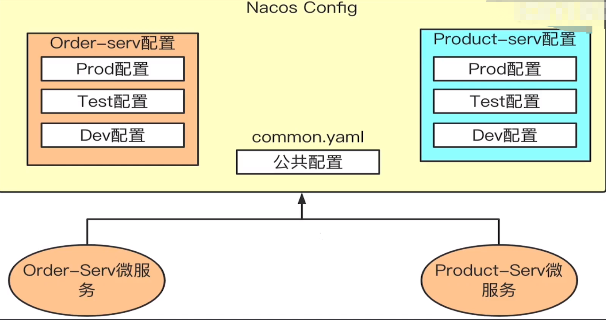
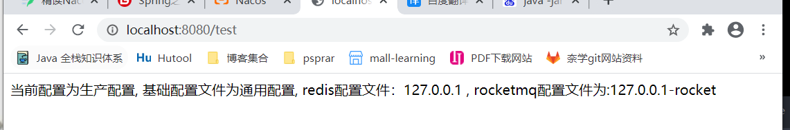

# 1、介绍
## 1.1、概述
- 1、Nacos /nɑ:kəʊs/ 是 Dynamic Naming and Configuration Service的首字母简称，一个更易于构建云原生应用的动态服务发现、配置管理和服务管理平台。
- 2、Nacos 致力于帮助您发现、配置和管理微服务。Nacos 提供了一组简单易用的特性集，帮助您快速实现动态服务发现、服务配置、服务元数据及流量管理。
- 3、Nacos 帮助您更敏捷和容易地构建、交付和管理微服务平台。 Nacos 是构建以“服务”为中心的现代应用架构 (例如微服务范式、云原生范式) 的服务基础设施。

## 1.2、关键特性包括
- 服务发现和服务健康监测 
  - Nacos 支持基于 DNS 和基于 RPC 的服务发现。服务提供者使用 原生SDK、OpenAPI、或一个独立的Agent TODO注册 Service 后，服务消费者可以使用DNS TODO 或HTTP&API查找和发现服务。 
  - Nacos 提供对服务的实时的健康检查，阻止向不健康的主机或服务实例发送请求。Nacos 支持传输层 (PING 或 TCP)和应用层 (如 HTTP、MySQL、用户自定义）的健康检查。 对于复杂的云环境和网络拓扑环境中（如 VPC、边缘网络等）服务的健康检查，Nacos 提供了 agent 上报模式和服务端主动检测2种健康检查模式。Nacos 还提供了统一的健康检查仪表盘，帮助您根据健康状态管理服务的可用性及流量。
- 动态配置服务
  - 动态配置服务可以让您以中心化、外部化和动态化的方式管理所有环境的应用配置和服务配置。 
  - 动态配置消除了配置变更时重新部署应用和服务的需要，让配置管理变得更加高效和敏捷。 
  - 配置中心化管理让实现无状态服务变得更简单，让服务按需弹性扩展变得更容易。 
  - Nacos 提供了一个简洁易用的UI (控制台样例 Demo) 帮助您管理所有的服务和应用的配置。Nacos 还提供包括配置版本跟踪、金丝雀发布、一键回滚配置以及客户端配置更新状态跟踪在内的一系列开箱即用的配置管理特性，帮助您更安全地在生产环境中管理配置变更和降低配置变更带来的风险。
- 动态DNS服务 
  - 动态 DNS 服务支持权重路由，让您更容易地实现中间层负载均衡、更灵活的路由策略、流量控制以及数据中心内网的简单DNS解析服务。动态DNS服务还能让您更容易地实现以 DNS 协议为基础的服务发现，以帮助您消除耦合到厂商私有服务发现 API 上的风险。 
  - Nacos 提供了一些简单的 DNS APIs TODO 帮助您管理服务的关联域名和可用的 IP:PORT 列表.
- 服务及其元数据管理
  - Nacos 能让您从微服务平台建设的视角管理数据中心的所有服务及元数据，包括管理服务的描述、生命周期、服务的静态依赖分析、服务的健康状态、服务的流量管理、路由及安全策略、服务的 SLA 以及最首要的 metrics 统计数据。
# 2、使用场景

## 2.1、## 动态配置服务
- 动态配置服务让您能够以中心化、外部化和动态化的方式管理所有环境的配置。动态配置消除了配置变更时重新部署应用和服务的需要。配置中心化管理让实现无状态服务更简单，也让按需弹性扩展服务更容易。
## 2.2、服务发现及管理
- 动态服务发现对以服务为中心的（例如微服务和云原生）应用架构方式非常关键。Nacos支持DNS-Based和RPC-Based（Dubbo、gRPC）模式的服务发现。Nacos也提供实时健康检查，以防止将请求发往不健康的主机或服务实例。借助Nacos，您可以更容易地为您的服务实现断路器。
### 2.2.1、服务注册
- Nacos Client会通过发送REST请求的方式向Nacos Server注册自己的服务，提供自身的元数据，比如ip地 址、端口等信息。Nacos Server接收到注册请求后，就会把这些元数据信息存储在一个双层的内存Map中。
### 2.2.2、服务心跳
- 在服务注册后，Nacos Client会维护一个定时心跳来持续通知Nacos Server，说明服务一直处于可用状态，防 止被剔除。默认5s发送一次心跳。
### 2.2.3、服务同步
- Nacos Server集群之间会互相同步服务实例，用来保证服务信息的一致性。 leader raft
### 2.2.4、服务发现
- 服务消费者(Nacos Client)在调用服务提供者的服务时，会发送一个REST请求给Nacos Server，获取上面 注册的服务清单，并且缓存在Nacos Client本地，同时会在Nacos Client本地开启一个定时任务定时拉取服务端最新的注 册表信息更新到本地缓存
### 2.2.5、服务健康检查
- Nacos Server会开启一个定时任务用来检查注册服务实例的健康情况，对于超过15s没有收到客户端心跳 的实例会将它的healthy属性置为false(客户端服务发现时不会发现)，如果某个实例超过30秒没有收到心跳，直接剔除该 实例(被剔除的实例如果恢复发送心跳则会重新注册)

# ## 3.1、版本选择


## 3.2、下载文件

### 3.2.1、文件下载方式(windows)

注意：Linux环境也是一样的配置，只不过是启动文件不一样而已。
第一步：下载文件

[https://github.com/alibaba/nacos/releases/tag/1.4.1](https://github.com/alibaba/nacos/releases/tag/1.4.1)

也可以用我的百度云网盘

> 链接：[https://pan.baidu.com/s/1w32BekIOSzILJbDgW4pO0w?pwd=n39q](https://pan.baidu.com/s/1w32BekIOSzILJbDgW4pO0w?pwd=n39q)
> 提取码：n39q

第二步：配置**nacos\conf\application.properties**，添加

```properties
### If use MySQL as datasource:
spring.datasource.platform=mysql

### Count of DB:
db.num=1

### Connect URL of DB:
db.url.0=jdbc:mysql://localhost:3306/nacos?characterEncoding=utf8&connectTimeout=1000&socketTimeout=3000&autoReconnect=true&useUnicode=true&useSSL=false&serverTimezone=UTC
db.user.0=root
db.password.0=root
```


第三步：把**nacos\conf\cluster.conf.example**改成**nacos\conf\cluster.conf**，也就是去掉后缀.example

启动

### 3.2.2、docker一键部署方式

> #安装
> 
> docker run --name nacos -e MODE=standalone -p 8848:8848 -d nacos/nacos-server:1.4.1
> #访问地址：
> 
> http://公网地址（阿里云上或者本地的虚拟机ip）:8848/nacos/

## 3.3、源码编译，本地启动

### 3.3.1、源码下载

[https://github.com/alibaba/nacos/tree/1.4.0-BETA](https://github.com/alibaba/nacos/tree/1.4.0-BETA)

### 3.3.2、开始编译，通过IDEA导入，会自动编译

### 3.3.3、导入sql


### 3.3.4、修改配置文件


添加配置：

```properties
db.num=1

### Connect URL of DB:
db.url.0=jdbc:mysql://localhost:3307/nacos?characterEncoding=utf8&connectTimeout=1000&socketTimeout=3000&autoReconnect=true&useUnicode=true&useSSL=false&serverTimezone=UTC
db.user.0=root
db.password.0=root
```

### 3.3.5、启动


### 3.3.6、运行结果


## 3.4、Nacos集群部署

### 3.4.1、部署图：


### 3.4.2、集群启动

在本地通过3个端口模拟3台机器，端口分别是：8848，8858，
8868。

> #copy3份解压后的nacos，修改各自的application.properties中的端口号，分别为：8848， 8858，8868
> 
> server.port=8848
> 
> server.port=8858
> 
> server.port=8868


各自的conf目录下放cluster.conf文件，文件内容为：

> 192.168.66.100:8848
> 
> 192.168.66.100:8858
> 
> 192.168.66.100:8868


启动三个nacos

>  ./startup.sh


### 3.4.3、注意：

>  如果内存不够可以修改内存参数。
> 
> Xms 是指设定程序启动时占用内存大小
> 
> Xmx 是指设定程序运行期间最大可占用的内存大小
> 
> Xmn 新生代的大小

### 3.4.4、使用Nginx作负载均衡访问集群的Nacos

#### 3.4.4.1、环境安装

> yum -y install gcc make automake pcre-devel  zlib zlib-devel openssl openssl-devel

#### 3.4.4.2、安装Nginx

> ./configure
> 
> make && make install

#### 3.4.4.3、配置nginx.conf文件

```shell
#定义upstream名字，下面会引用
upstream nacos{  
        #指定后端服务器地址
        server 192.168.66.100:8848;        
        server 192.168.66.100:8858;  
        server 192.168.66.100:8868;    
}
server {
  listen 80;
  server_name localhost;
  location / {
  	  #引用upstream
      proxy_pass http://nacos;
 }
}
```

#### 3.4.4.4、重启Nginx

> docker restart nginx

### 3.4.5、负载均衡Nacos

> 请求：[http://192.168.66.100/nacos](http://192.168.66.100/nacos)

# 4、配置中心介绍与对比

## 4.1、配置中心介绍

### 4.1.1、没有配置中心的情况下配置文件管理


问题：

- 配置文件数量会随着服务的增加而增加
- 单个配置文件无法区分多个运行环境
- 配置文件内容无法动态更新，需要重启服务

### 4.1.2、有配置中心的情况下配置文件管理


解决了什么问题？

- 统一配置文件管理
- 提供统一标准接口，服务根据标准接口自行拉取配置
- 支持动态更新的到所有服务

## 4.2、配置中心对比


### 4.2.1、Apollo

官网：
[https://www.apolloconfig.com/#/zh/README](https://www.apolloconfig.com/#/zh/README)

内容有安装，架构，设计等

#### 4.2.1.1、简介

- Apollo（阿波罗）是一款可靠的分布式配置管理中心，诞生于携程框架研发部，能够**集中化管理应用不同环境、不同集群的配置，配置修改后能够实时推送到应用端，并且具备规范的权限、流程治理**等特性，适用于微服务配置管理场景。
- 服务端基于Spring Boot和Spring Cloud开发，打包后可以直接运行，不需要额外安装Tomcat等应用容器。
- Java客户端不依赖任何框架，能够运行于所有Java运行时环境，同时对Spring/Spring Boot环境也有较好的支持。
- .Net客户端不依赖任何框架，能够运行于所有.Net运行时环境。

#### 4.2.1.2、特性

- **统一管理不同环境、不同集群的配置**
  - Apollo提供了一个统一界面集中式管理不同环境（environment）、不同集群（cluster）、不同命名空间（namespace）的配置。
  - 同一份代码部署在不同的集群，可以有不同的配置，比如zk的地址等
  - 通过命名空间（namespace）可以很方便的支持多个不同应用共享同一份配置，同时还允许应用对共享的配置进行覆盖
  - 配置界面支持多语言（中文，English）
- **配置修改实时生效（热发布）**
  - 用户在Apollo修改完配置并发布后，客户端能实时（1秒）接收到最新的配置，并通知到应用程序。
- **版本发布管理**
  - 所有的配置发布都有版本概念，从而可以方便的支持配置的回滚。
- **灰度发布**
  - 支持配置的灰度发布，比如点了发布后，只对部分应用实例生效，等观察一段时间没问题后再推给所有应用实例。
- **权限管理、发布审核、操作审计**
  - 应用和配置的管理都有完善的权限管理机制，对配置的管理还分为了编辑和发布两个环节，从而减少人为的错误。
  - 所有的操作都有审计日志，可以方便的追踪问题。
- **客户端配置信息监控**
  - 可以方便的看到配置在被哪些实例使用
- **提供Java和.Net原生客户端**
  - 提供了Java和.Net的原生客户端，方便应用集成
  - 支持Spring Placeholder，Annotation和Spring Boot的ConfigurationProperties，方便应用使用（需要Spring 3.1.1+）
  - 同时提供了Http接口，非Java和.Net应用也可以方便的使用
- **提供开放平台API**
  - Apollo自身提供了比较完善的统一配置管理界面，支持多环境、多数据中心配置管理、权限、流程治理等特性。
  - 不过Apollo出于通用性考虑，对配置的修改不会做过多限制，只要符合基本的格式就能够保存。
  - 在我们的调研中发现，对于有些使用方，它们的配置可能会有比较复杂的格式，如xml, json，需要对格式做校验。
  - 还有一些使用方如DAL，不仅有特定的格式，而且对输入的值也需要进行校验后方可保存，如检查数据库、用户名和密码是否匹配。
  - 对于这类应用，Apollo支持应用方通过开放接口在Apollo进行配置的修改和发布，并且具备完善的授权和权限控制
- **部署简单**
  - 配置中心作为基础服务，可用性要求非常高，这就要求Apollo对外部依赖尽可能地少
  - 目前唯一的外部依赖是MySQL，所以部署非常简单，只要安装好Java和MySQL就可以让Apollo跑起来
  - Apollo还提供了打包脚本，一键就可以生成所有需要的安装包，并且支持自定义运行时参数

#### 4.2.1.3、别人总结的（主要是懒，我很少用这个，都是用的nacos）

[https://blog.csdn.net/Dbh321/article/details/125533024](https://blog.csdn.net/Dbh321/article/details/125533024)

### 4.2.2、nacos

略，本篇文章重点讲

### 4.2.3、SpringCloud Config

引用：[https://blog.csdn.net/weixin_38192427/article/details/121198238](https://blog.csdn.net/weixin_38192427/article/details/121198238)

### 4.2.4、Disconfig

引用：[https://blog.csdn.net/fy_java1995/article/details/109237027](https://blog.csdn.net/fy_java1995/article/details/109237027)

# 5、Nacos集成SpringBoot实现统一配置管理

## 5.1、简单版（单配置文件版）

### 5.1.1、pom依赖

```xml
<dependency>
  <groupId>com.alibaba.cloud</groupId>
  <artifactId>spring-cloud-starter-alibaba-nacos-config</artifactId>
</dependency>
```

### 5.1.2、bootstrap.yml配置

```yaml
spring:
  application:
    name: nacos-config-demo # 表示当前微服务需要向配置中心索要nacos-config-demo的文件
  cloud:
    nacos:
      config:
        server-addr: http://1localhost:8848 # 表示去哪里找，nacos配置中心地址
        file-extension: yml # 表示支持的扩展文件名
```

### 5.1.3、Nacos中的配置

访问地址：http://localhost:8848/nacos
新建：

### 5.1.4、测试代码

```java
package com.zshy.nacos.controller;

import org.springframework.beans.factory.annotation.Value;
import org.springframework.cloud.context.config.annotation.RefreshScope;
import org.springframework.web.bind.annotation.GetMapping;
import org.springframework.web.bind.annotation.RestController;

/**
 * @author zhouhengzhe
 * @description: 控制器
 * @date 2022/10/5 1:24
 * @since v1
 */
@RestController
@RefreshScope
public class TestController {

    @Value("${testStr}")
    private String testStr;

    @GetMapping("/test")
    public String test(){
        return testStr;
    }
}
```

### 5.1.5、启动类

```java
package com.zshy.nacos;

import org.springframework.boot.SpringApplication;
import org.springframework.boot.autoconfigure.SpringBootApplication;

/**
 * @author zhouhengzhe
 * @description: nacos config 启动类
 * @date 2022/10/5 1:23
 * @since v1
 */
@SpringBootApplication
public class NacosConfigApplication {
    public static void main(String[] args) {
        SpringApplication.run(NacosConfigApplication.class, args);
    }
}
```

### 5.1.6、运行结果

### 5.1.7、详细代码（源码）

[https://gitee.com/zhouzhz/java-system-learn/tree/master/Spring%E4%B9%8BDemo%E7%B3%BB%E5%88%97/SpringCloud-2022/nacos-config-demo](https://gitee.com/zhouzhz/java-system-learn/tree/master/Spring%E4%B9%8BDemo%E7%B3%BB%E5%88%97/SpringCloud-2022/nacos-config-demo)

## 5.2、复杂版（多环境切换）

多环境切换指的是：开发环境，测试环境，预发环境，线上环境。

### 5.2.1、nacos-config-demo-dev.yml

Nacos中的SpringBoot配置文件的**优先级**：
**bootstrap.properties>bootstrap.yaml>application.properties>application.yml**


在Nacos config配置管理中新增配置如图极其对应关系如下：

索要文件的格式为：${spring.application.name}-${spring.profiles.active}.${spring.cloud.nacos.config.file-extension}
所以我们可以得知再nacos中的文件名就是**nacos-config-demo-dev.yml**
配置内容为：

```yaml
testConfig: 开发配置
```


### 5.2.2、bootstrap.yml

本地项目bootstrap.yml配置为：

```yaml
spring:
  application:
    name: nacos-config-demo # 表示当前微服务需要向配置中心索要nacos-config-demo的文件
  cloud:
    nacos:
      config:
        server-addr: http://106.52.205.232:8848 # 表示去哪里找，nacos配置中心地址
        file-extension: yml # 表示支持的扩展文件名
  profiles:
    active: dev # 表示我需要向配置中心索要的开发环境的配置
```

### 5.2.3、controller

controller配置：

```java
package com.zshy.nacos.controller;

import org.springframework.beans.factory.annotation.Value;
import org.springframework.cloud.context.config.annotation.RefreshScope;
import org.springframework.web.bind.annotation.GetMapping;
import org.springframework.web.bind.annotation.RestController;

/**
 * @author zhouhengzhe
 * @description: 控制器
 * @date 2022/10/5 1:24
 * @since v1
 */
@RestController
@RefreshScope
public class TestController {

    @Value("${testConfig}")
    private String testConfig;

    @GetMapping("/test")
    public String test(){
        return testConfig;
    }
}

```

### 5.2.4、运行结果


### 5.2.5、动态配置验证

动态配置验证，修改nacos文件中的配置为：


### 5.2.6、动态配置验证后的运行结果

运行结果就会变成


### 5.2.7、多环镜演示

假设我们的项目中的Nacos配置有n多个，如下

那么我们项目中，该怎么指定的，大家想一想，我们平常中是有n多个机器的，那么我们怎么指定运行哪个配置文件呢

```java
# dev/test/uat/prod四选一
java -jar xxx.jar -Dspring.profiles.active=dev/test/uat/prod
```

### 5.2.8、解决多环境共同配置(个人觉得很少用)


新建文件**nacos-config-demo.yml**

controller代码：

```java
package com.zshy.nacos.controller;

import org.springframework.beans.factory.annotation.Value;
import org.springframework.cloud.context.config.annotation.RefreshScope;
import org.springframework.web.bind.annotation.GetMapping;
import org.springframework.web.bind.annotation.RestController;

/**
 * @author zhouhengzhe
 * @description: 控制器
 * @date 2022/10/5 1:24
 * @since v1
 */
@RestController
@RefreshScope
public class TestController {

    @Value("${testConfig}")
    private String testConfig;

    @Value("${testCommon}")
    private String testCommon;

    @GetMapping("/test")
    public String test(){
        return testConfig + "/t"+ testCommon;
    }
}

```

运行结果

如果同一个配置项再三个配置文件中都存在且值不同，最终项目读取的是什么？
如果配置了spring.profiles.active则优先获取**nacos-config-demo-${spring.profiles.active}.yml**的值

### 5.2.9、不同微服务之间相同配置如何共享

比如一些redis地址，MQ地址，服务注册中心等公共配置都是多个微服务共享的，并不属于某个微服务。配置如下

Nacos Config为我们提供了两种解决方案：

#### shared-configs


bootstrap.yml

```yaml
spring:
  application:
    name: nacos-config-demo # 表示当前微服务需要向配置中心索要nacos-config-demo的文件
  cloud:
    nacos:
      config:
        server-addr: http://localhost:8848 # 表示去哪里找，nacos配置中心地址
        file-extension: yml # 表示支持的扩展文件名
        shared-configs[0]:
          data_id: rocketmq-config.yml
          refresh: true
        shared-configs[1]:
          data_id: redis-config.yml
          refresh: true
  profiles:
    active: prod # 表示我需要向配置中心索要的开发环境的配置
```

controller配置

```java
package com.zshy.nacos.controller;

import org.springframework.beans.factory.annotation.Value;
import org.springframework.cloud.context.config.annotation.RefreshScope;
import org.springframework.web.bind.annotation.GetMapping;
import org.springframework.web.bind.annotation.RestController;

/**
* @author zhouhengzhe
* @description: 控制器
* @date 2022/10/5 1:24
* @since v1
*/
@RestController
    @RefreshScope
    public class TestController {

        @Value("${testConfig}")
        private String testConfig;

        @Value("${testCommon}")
        private String testCommon;

        @Value("${redisip}")
        private String redisip;

        @Value("${rocketmqip}")
        private String rocketmqip;

        @GetMapping("/test")
        public String test() {
            return String.format("当前配置为%s,\t 基础配置文件为%s,\tredis配置文件：%s ,\t rocketmq配置文件为:%s",
                                 testConfig, testCommon, redisip, rocketmqip);
        }
    }

```

运行效果：

**注意：当通用配置文件中出现相同的值时，下面的会覆盖上面的。**

#### extension-configs

bootstrap.yml配置更新成

```yaml
spring:
  application:
    name: nacos-config-demo # 表示当前微服务需要向配置中心索要nacos-config-demo的文件
  cloud:
    nacos:
      config:
        server-addr: http://106.52.205.232:8848 # 表示去哪里找，nacos配置中心地址
        file-extension: yml # 表示支持的扩展文件名
#        shared-configs[0]:
#          data_id: rocketmq-config.yml
#          refresh: true
#        shared-configs[1]:
#          data_id: redis-config.yml
#          refresh: true
        extension-configs[0]:
          data_id: rocketmq-config.yml
          refresh: true
        extension-configs[1]:
            data_id: redis-config.yml
            refresh: true
  profiles:
    active: prod # 表示我需要向配置中心索要的开发环境的配置
```

其余不变。

### 总结

demo.yml demo-dev.yml shard-configs extension-config读取顺序

由上面打印的日志可知

## 5.3、补充：Nacos概念

### 5.3.1、Namespace命名空间（多环境的管理与隔离）

现如今，在微服务体系中，一个系统往往被拆分为多个服务，每个服务都有自己的配置文件，然后每个系统往往还会准备开发环境、测试环境、正式环境。

问题：我们来说算一算，假设某系统有10个微服务，那么至少有10个配置文件吧，三个环境（dev\test\prod），那就有30个配置文件需要进行管理。

> Namespace可以帮助我们进行多环境下的管理与隔离

#### 5.3.2.2、概念

用于进行租户粒度的配置隔离。不同的命名空间下，可以存在相同的 Group 或 Data ID 的配置。Namespace 的常用场景之一是不同环境的配置的区分隔离，例如开发测试环境和生产环境的资源（如配置、服务）隔离等。默认namespace=public的保留空间,不支持删除;默认情况下。


#### 5.3.2.3、场景

Nacos给的最佳实践表明，最外层的namespace是可以用于区分部署环境的，比如test，dev，prod等。

注意：命名空间可用于进行不同环境的配置隔离。一般一个环境划分到一个命名空间。

#### 5.3.2.4、如何新建Namespace


#### 5.3.2.5、如何查看Namespace


### 5.3.2、DataID配置（工程里的配置文件名字）

#### 5.3.2.1、概念

Nacos 中的某个配置集的 ID，配置集 ID 是组织划分配置的维度之一。Data ID 通常用于组织划分系统的配置集。一个系统或者应用可以包含多个配置集，每个配置集都可以被一个有意义的名称标识。

> 注意：
>
> - 在系统中，一个配置文件通常就是一个配置集。一般微服务的配置就是一个配置集

#### 5.3.2.2、dataId的拼接格式


> 解释：
>
> - prefix：默认为 spring.application.name 的值。
> - spring.profiles.active：即为当前环境对应的 profile。
> - file-extension：文件后缀

当activeprofile为空时。


#### 5.3.2.3、新建DataID步骤


### 5.3.3.、Group分组方案(也可以实现环境区分，跟命名空间一个作用)

#### 5.3.3.1、概念

Nacos中的一组配置集，是组织配置的维度之一。通过一个有意义的字符串对配置集进行分组，从而区分Data ID相同的配置集。当您在 Nacos上创建一个配置时，如果未填写配置分组的名称，则配置分组的名称默认采用DEFAULT_GROUP 。


#### 5.3.3.2、通过Group实现环境区分


### 5.3.4、Namespace实施方案(不同租户应对方案)

#### 5.3.4.1、实践方案

##### 5.3.4.1.1、面向一个租户

从一个租户(用户)的角度来看，如果有多套不同的环境，那么这个时候可以根据指定的环境来创建不同的 namespce，以此来实现多环境的隔离。
例如，你可能有dev，test和prod三个不同的环境，那么使用一套nacos 集群可以分别建以下三个不同的 namespace


> 问题：
> 这里的单租户同样也适于小型项目，或者是项目不太多时的实施方案，通过定义不同的环境，不同环境的项目在不同的Namespace下进行管理，不同环境之间通过Namespace进行隔离。

##### 5.3.4.1.2、面向多个租户

当多个项目同时使用该Nacos集群时，还可以通过Group进行Namespace内的细化分组。这里以 Namespace：dev 为例，在Namespace中通过不同Group进行同一环境中不同项目的再分类 。


> 注意：
>
> - 通过上面的理论分析，可以看出方案二有很好的扩展性
