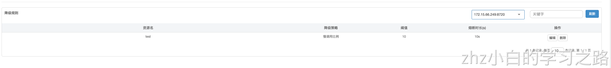
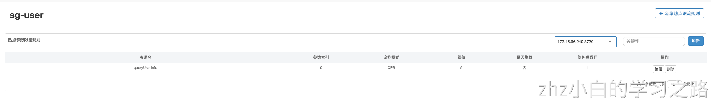
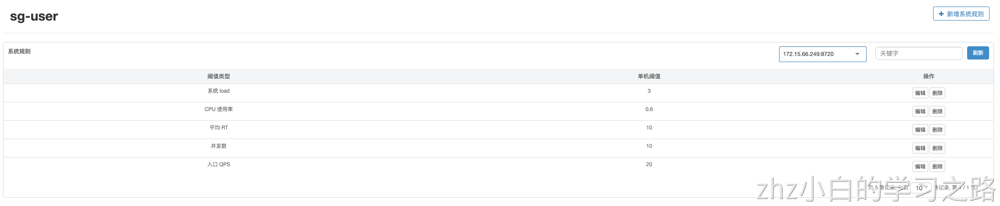

## Sentinel环境信息

## 1:引入依赖

快速开始

```xml
<dependency>    
  <groupId>com.alibaba.cloud</groupId>    
  <artifactId>spring-cloud-starter-alibaba-sentinel</artifactId>    
  <version>2.2.3.RELEASE</version> 
</dependency>
```

### 2:设置配置信息，编辑配置文件application.yml

```yaml
server:
  port: 8090
spring:
  application:
    #服务名
    name: sg-user
  cloud:
    sentinel:
      transport:
        # 默认是8719，通过该端口使得平台于微服务通信
        port: 8719
        # 连接到 sentinel 的服务平台上 下面地址为测试环境地址
        dashboard: 10.100.72.97:8088
```


### 3:设置资源

通过 @SentinelResource注解方式设置需要管控的资源

| **注意** | **一般推荐将 @SentinelResource 注解加到服务实现上** |
| -------- | --------------------------------------------------- |

@SentinelResource 注解属性说明

| **属性名**                                                   | **说明**                                                                                                                                                                                                                                                                                                                                                                                                    |
| ------------------------------------------------------------ |-----------------------------------------------------------------------------------------------------------------------------------------------------------------------------------------------------------------------------------------------------------------------------------------------------------------------------------------------------------------------------------------------------------|
| value                                                        | 资源名称，必需项（不能为空）                                                                                                                                                                                                                                                                                                                                                                                            |
| entryType                                                    | entry 类型，可选项（默认为 EntryType.OUT）                                                                                                                                                                                                                                                                                                                                                                           |
| blockHandler / blockHandlerClass                             | blockHandler 对应处理 BlockException 的函数名称，可选项。                                                                                                                                                                                                                                                                                                                                                               |
| blockHandler 函数访问范围需要是 public，返回类型需要与原方法相匹配，参数类型需要和原方法相匹配并且最后加一个额外的参数，类型为 BlockException。 |                                                                                                                                                                                                                                                                                                                                                                                                           |
| blockHandler 函数默认需要和原方法在同一个类中。              |                                                                                                                                                                                                                                                                                                                                                                                                           |
| 若希望使用其他类的函数，则可以指定 blockHandlerClass 为对应的类的 Class 对象，注意对应的函数必需为 static 函数，否则无法解析。 |                                                                                                                                                                                                                                                                                                                                                                                                           |
| fallback / fallbackClass | fallback 函数名称，可选项，用于在抛出异常的时候提供 fallback 处理逻辑。fallback 函数可以针对所有类型的异常（除了 exceptionsToIgnore 里面排除掉的异常类型）进行处理。fallback 函数签名和位置要求： <br/>1、 返回值类型必须与原函数返回值类型一致； <br/>2、 方法参数列表需要和原函数一致，或者可以额外多一个 Throwable 类型的参数用于接收对应的异常。 <br/> 3、 fallback 函数默认需要和原方法在同一个类中。若希望使用其他类的函数，则可以指定 fallbackClass 为对应的类的 Class 对象，注意对应的函数必需为 static 函数，否则无法解析。                                                                      |
| defaultFallback | 默认的 fallback 函数名称，可选项，通常用于通用的 fallback 逻辑（即可以用于很多服务或方法）。默认 fallback 函数可以针对所有类型的异常（除了 exceptionsToIgnore 里面排除掉的异常类型）进行处理。若同时配置了 fallback 和 defaultFallback，则只有 fallback 会生效。defaultFallback 函数签名要求：<br/>1、 返回值类型必须与原函数返回值类型一致； <br/>2、 方法参数列表需要为空，或者可以额外多一个 Throwable 类型的参数用于接收对应的异常。<br/>3、 defaultFallback 函数默认需要和原方法在同一个类中。若希望使用其他类的函数，则可以指定 fallbackClass 为对应的类的 Class 对象，注意对应的函数必需为 static 函数，否则无法解析。 |
  | exceptionsToIgnore | 用于指定哪些异常被排除掉，不会计入异常统计中，也不会进入 fallback 逻辑中，而是会原样抛出。                                                                                                                                                                                                                                                                                                                                                        |

#### 代码示例：

```java
@Override
@SentinelResource(value = "test", blockHandler = "handleException", blockHandlerClass = {ExceptionUtil.class})
public void test() throws InterruptedException {
    Thread.sleep(random.nextInt(20));
    System.out.println("Test");
}

@Override
@SentinelResource(value = "hello", fallback = "helloFallback")
public String hello(long s) {
    if (s < 0) {
        throw new IllegalArgumentException("invalid arg");
    }
    return String.format("Hello at %d", s);
}
 
public String helloFallback(long s, Throwable ex) {
    // Do some log here.
    ex.printStackTrace();
    return "Oops, error occurred at " + s;
}
```

上面代码对应的blockHandlerClass

```java
public final class ExceptionUtil {
    //必须为static修饰
    public static void handleException(BlockException ex) {
        // Handler method that handles BlockException when blocked.
        // The method parameter list should match original method, with the last additional
        // parameter with type BlockException. The return type should be same as the original method.
        // The block handler method should be located in the same class with original method by default.
        // If you want to use method in other classes, you can set the blockHandlerClass
        // with corresponding Class (Note the method in other classes must be static).
        System.out.println("Oops: " + ex.getClass().getCanonicalName());
    }
}
```

### 4：设置规则

4.1:流量规则

| **字段** | **含义**                     | **对应值** |
| -------- | ---------------------------- | ---------- |
| resource | 资源名，即限流规则的作用对象 | “”         |
| count    | 限流阈值                     |            |
| grade | 【阈值类型】限流阈值类型（QPS 或并发线程数） | 0：线程数；1:QPS |
| limitApp | 【针对来源】，若为 default 则不区分调用来源 | 默认default |
| strategy | 【流控模式】调用关系限流策略，默认直接 | 0:直接；1:关联；2:链路 |
| controlBehavior | 流量控制效果（直接拒绝、Warm Up、匀速排队） | 0:快速失败；1:warm up；2:排队等待 |

```java
/**
 * 流量控制
 */
@PostConstruct
private  void intFlowQpsRule(){
    List<FlowRule> rules = new ArrayList<>();
    // 设置资源
    FlowRule rule = new FlowRule("hello");
    //设置阈值
    rule.setCount(5);
	//设置规则
    rule.setGrade(RuleConstant.FLOW_GRADE_QPS);
	//来源 默认default
    rule.setLimitApp("default");
    rules.add(rule);
    FlowRuleManager.loadRules(rules);
}
```


4.2:熔断降级规则

| **字段** | **说明**                 | **默认值** |
| -------- | ------------------------ | ---------- |
| resource | 资源名，即规则的作用对象 |            |
| grade | 熔断策略，支持慢调用比例/异常比例/异常数策略 | 慢调用比例 |
| count | 慢调用比例模式下为慢调用临界 RT（超出该值计为慢调用）；异常比例/异常数模式下为对应的阈值 |
| timeWindow | 熔断时长，单位为 s |
| minRequestAmount | 熔断触发的最小请求数，请求数小于该值时即使异常比率超出阈值也不会熔断（1.7.0 引入） | 5 |
| statIntervalMs | 统计时长（单位为 ms），如 60*1000 代表分钟级（1.8.0 引入） | 1000ms |
| slowRatioThreshold | 慢调用比例阈值，仅慢调用比例模式有效（1.8.0 引入） | 

|

```java
/**
 * 熔断降级
 */
@PostConstruct
private void initDegradeRule(){
    List<DegradeRule> rules = new ArrayList<>();
    // 设置资源
    DegradeRule degradeRule = new DegradeRule("test");
    degradeRule.setGrade(RuleConstant.DEGRADE_GRADE_RT);
    //响应时间阈值10ms
    degradeRule.setCount(10);
    //熔断时间单位秒
    degradeRule.setTimeWindow(10);
    //阈值比例
    degradeRule.setSlowRatioThreshold(0.1);
    //最小请求数
    degradeRule.setMinRequestAmount(10);
    rules.add(degradeRule);
    DegradeRuleManager.loadRules(rules);
}
```

4.3:设置热点参数限流

```java
private void initParamFlowRule(){
    //资源名
    ParamFlowRule paramFlowRule = new ParamFlowRule("hello")
            //热点参数的索引，必填，对应字段参数的索引位置
            .setParamIdx(0)
            //限流阈值
            .setCount(5)
            //统计窗口时间长度（单位为秒）
            .setDurationInSec(10);
    //参数例外项，可以针对指定的参数值单独设置限流阈值，不受前面 count 阈值的限制。仅支持基本类型和字符串类型
    ParamFlowItem item = new ParamFlowItem()
            // 针对 int 类型的参数 1234，单独设置限流 QPS 阈值为 10，而不是全局的阈值 5.
            .setObject(String.valueOf(1234))
            .setClassType(int.class.getTypeName())
            .setCount(10);
    paramFlowRule.setParamFlowItemList(Collections.singletonList(item));
    List<ParamFlowRule> paramFlowRules = Collections.singletonList(paramFlowRule);
    System.out.println(JSON.toJSONString(paramFlowRules));
    ParamFlowRuleManager.loadRules(paramFlowRules);
```

4.4:系统自适应限流

```java
private static void initSystemRule() {
    SystemRule rule = new SystemRule();
    // max load is 3
    rule.setHighestSystemLoad(3.0);
    // max cpu usage is 60%
    rule.setHighestCpuUsage(0.6);
    // max avg rt of all request is 10 ms
    rule.setAvgRt(10);
    // max total qps is 20
    rule.setQps(20);
    // max parallel working thread is 10
    rule.setMaxThread(10);
    SystemRuleManager.loadRules(Collections.singletonList(rule));
}
```

4.5:黑白名单控制

```java
/**
 * 白名单限制
 */
private static void initWhiteRules() {
    AuthorityRule rule = new AuthorityRule();
    //资源
    rule.setResource(RESOURCE_NAME);
    //限制策略，默认白名单
    rule.setStrategy(RuleConstant.AUTHORITY_WHITE);
    //允许访问的app列表
    rule.setLimitApp("appA,appE");
    AuthorityRuleManager.loadRules(Collections.singletonList(rule));
}

/**
 * 黑名单限制
 */
private static void initBlackRules() {
    AuthorityRule rule = new AuthorityRule();
    //资源
    rule.setResource(RESOURCE_NAME);
    //限制策略为黑名单
    rule.setStrategy(RuleConstant.AUTHORITY_BLACK);
    //限制访问app列表
    rule.setLimitApp("appA,appB");
    AuthorityRuleManager.loadRules(Collections.singletonList(rule));
}
```

访问资源后控制台效果如下






现在sentinal接入成功

---

## 动态配置

规则动态推动，现在我们都是用nacos作为配置中心，以nacos作为sentinel规则配置中心示例
1:引入nacos-sentinel数据源依赖

```xml
<dependency>
   <groupId>com.alibaba.csp</groupId>
   <artifactId>sentinel-datasource-nacos</artifactId>
   <version>1.8.0</version>
</dependency>
```

2：编辑配置文件application.yml

```yaml
server:
  port: 8090
spring:
  application:
    #服务名
    name: sg-user
  cloud:
    sentinel:
      transport:
        # 默认是8719，通过该端口使得平台于微服务通信
        port: 8719
        # 连接到 sentinel 的服务平台上
        dashboard: localhost:8088
      log:
        # sentinel日志目录
        dir: /Users/xuguoqi/logs/csp
        # 日志是否打印thread id
        switch-pid: false
      datasource:
        # 流量控制
        flow:
          nacos:
            server-addr: 10.100.101.20:8848
            username: tech_dev_nacos
            password: uMvq2YC7s8
            namespace: 25d53aa8-9c3c-472b-8514-7d0a35911780
            data-id: ${spring.application.name}-flow-rules
            group-id: SENTINEL_GROUP
            data-type: json
            rule-type: flow
        # 熔断降级
        degrade:
          nacos:
            server-addr: 10.100.101.20:8848
            username: tech_dev_nacos
            password: uMvq2YC7s8
            namespace: 25d53aa8-9c3c-472b-8514-7d0a35911780
            data-id: ${spring.application.name}-sentinel-degrade
            group-id: SENTINEL_GROUP
            data-type: json
            rule-type: degrade
        # 热点参数流控
        param-flow:
          nacos:
            server-addr: 10.100.101.20:8848
            username: tech_dev_nacos
            password: uMvq2YC7s8
            namespace: 25d53aa8-9c3c-472b-8514-7d0a35911780
            data-id: ${spring.application.name}-degrade-rules
            group-id: SENTINEL_GROUP
            data-type: json
            rule-type: param-flow
        # 系统自适应限流
        system:
          nacos:
            server-addr: 10.100.101.20:8848
            username: tech_dev_nacos
            password: uMvq2YC7s8
            namespace: 25d53aa8-9c3c-472b-8514-7d0a35911780
            data-id: ${spring.application.name}-system-rules
            group-id: SENTINEL_GROUP
            data-type: json
            rule-type: system
        # 黑白名单控制
        authority:
          nacos:
            server-addr: 10.100.101.20:8848
            username: tech_dev_nacos
            password: uMvq2YC7s8
            namespace: 25d53aa8-9c3c-472b-8514-7d0a35911780
            data-id: ${spring.application.name}-authority-rules
            group-id: SENTINEL_GROUP
            data-type: json
            rule-type: authority
```

3：在nacos控制台配置管理里编辑对应规则，配置格式选择json


流控规则json格式如下：

```json
[
    {
        "resource": "/queryUserInfo",
        "limitApp": "default",
        "grade": 1,
        "count": 2,
        "strategy": 0,
        "controlBehavior": 0,
        "clusterMode": false
    }
]

```


熔断降级规则json格式如下：

```json
[
    {
        "resource": "/queryUserInfo",
        "grade": 0,
        "count": 10,
        "timeWindow": 10,
        "slowRatioThreshold": 0.1,
        "minRequestAmount": 10
    }
]
```

热点参数规则json格式

```json
[
    {
        "burstCount":0,
        "clusterMode":false,
        "controlBehavior":0,
        "count":5,
        "durationInSec":10,
        "grade":1,
        "maxQueueingTimeMs":0,
        "paramFlowItemList":[
            {
                "classType":"int",
                "count":10,
                "object":"1234"
            }
        ],
        "paramIdx":0,
        "resource":"queryUserInfo"
    }
]

```

系统自适应规则json格式

```json
[
    {
        "avgRt":10,
        "highestCpuUsage":0.6,
        "highestSystemLoad":3,
        "maxThread":10,
        "qps":20
    }
]
```

黑白名单限制json格式

```json
[
    {
        "limitApp":"appA,appB",
        "resource":"queryUserInfo",
        "strategy":0
    }
]
```

---

## Feign支持

Sentinel 适配了 [Feign](https://github.com/OpenFeign/feign) 组件。如果想使用，除了引入 spring-cloud-starter-alibaba-sentinel 的依赖外还需要 2 个步骤：

- 配置文件打开 Sentinel 对 Feign 的支持：feign.sentinel.enabled=true
- 加入 spring-cloud-starter-openfeign 依赖使 Sentinel starter 中的自动化配置类生效：

```xml
<dependency>
    <groupId>org.springframework.cloud</groupId>
    <artifactId>spring-cloud-starter-openfeign</artifactId>
</dependency>
```

这是一个 FeignClient 的简单使用示例：

```java
@FeignClient(name = "service-provider", fallback = EchoServiceFallback.class, configuration = FeignConfiguration.class)
public interface EchoService {
    @RequestMapping(value = "/echo/{str}", method = RequestMethod.GET)
    String echo(@PathVariable("str") String str);
}

class FeignConfiguration {
    @Bean
    public EchoServiceFallback echoServiceFallback() {
        return new EchoServiceFallback();
    }
}

class EchoServiceFallback implements EchoService {
    @Override
    public String echo(@PathVariable("str") String str) {
        return "echo fallback";
    }
}
```

| Note | Feign 对应的接口中的资源名策略定义：httpmethod:protocol://requesturl。@FeignClient 注解中的所有属性，Sentinel 都做了兼容。 |
| ---- | ------------------------------------------------------------ |

EchoService 接口中方法 echo 对应的资源名为 GET:http://service-provider/echo/{str}。

## RestTemplate 支持


Spring Cloud Alibaba Sentinel 支持对 RestTemplate 的服务调用使用 Sentinel 进行保护，在构造 RestTemplate bean的时候需要加上 @SentinelRestTemplate 注解。

```java
@Bean
@SentinelRestTemplate(blockHandler = "handleException", blockHandlerClass = ExceptionUtil.class)
public RestTemplate restTemplate() {
    return new RestTemplate();
}
```

@SentinelRestTemplate 注解的属性支持限流(blockHandler, blockHandlerClass)和降级(fallback, fallbackClass)的处理。
其中 blockHandler 或 fallback 属性对应的方法必须是对应 blockHandlerClass 或 fallbackClass 属性中的静态方法。
该方法的参数跟返回值跟 org.springframework.http.client.ClientHttpRequestInterceptor#interceptor 方法一致，其中参数多出了一个 BlockException 参数用于获取 Sentinel 捕获的异常。
比如上述 @SentinelRestTemplate 注解中 ExceptionUtil 的 handleException 属性对应的方法声明如下：

```java
public class ExceptionUtil {
    public static ClientHttpResponse handleException(HttpRequest request, byte[] body, ClientHttpRequestExecution execution, BlockException exception) {
        ...
    }
}

```

| Note | 应用启动的时候会检查 @SentinelRestTemplate 注解对应的限流或降级方法是否存在，如不存在会抛出异常 |
| ---- | ------------------------------------------------------------ |

@SentinelRestTemplate 注解的限流(blockHandler, blockHandlerClass)和降级(fallback, fallbackClass)属性不强制填写。
当使用 RestTemplate 调用被 Sentinel 熔断后，会返回 RestTemplate request block by sentinel 信息，或者也可以编写对应的方法自行处理返回信息。这里提供了 SentinelClientHttpResponse 用于构造返回信息。
Sentinel RestTemplate 限流的资源规则提供两种粒度：

- httpmethod:schema://host:port/path：协议、主机、端口和路径
- httpmethod:schema://host:port：协议、主机和端口

  | Note | 以 [https://www.taobao.com/test](https://www.taobao.com/test) 这个 url 并使用 GET 方法为例。对应的资源名有两种粒度，分别是 GET:[https://www.taobao.com](https://www.taobao.com/) 以及 GET:[https://www.taobao.com/test](https://www.taobao.com/test) |
  |--------------------------------------------------------------------------------------------------------------------------------------------------------------------------------------------------------------------------| --- |

更多资料参见：[https://github.com/alibaba/Sentinel/wiki](https://github.com/alibaba/Sentinel/wiki)