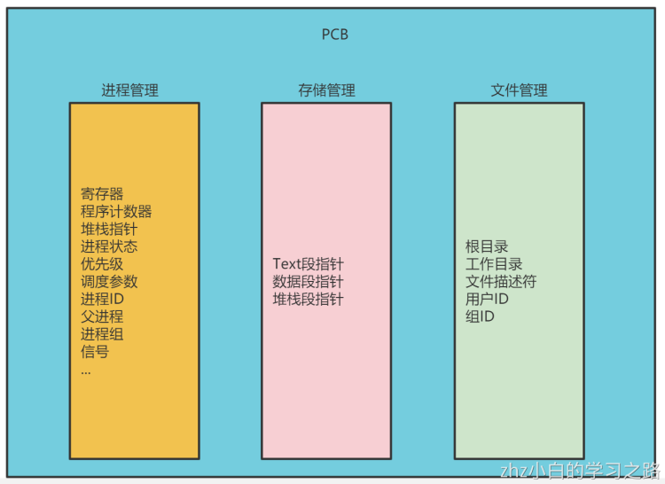
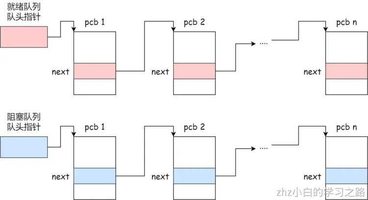
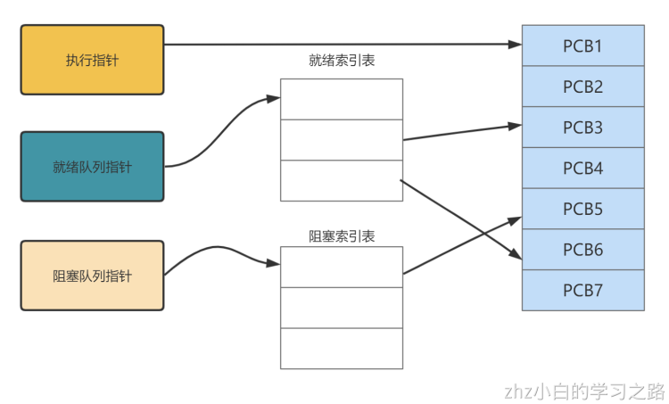
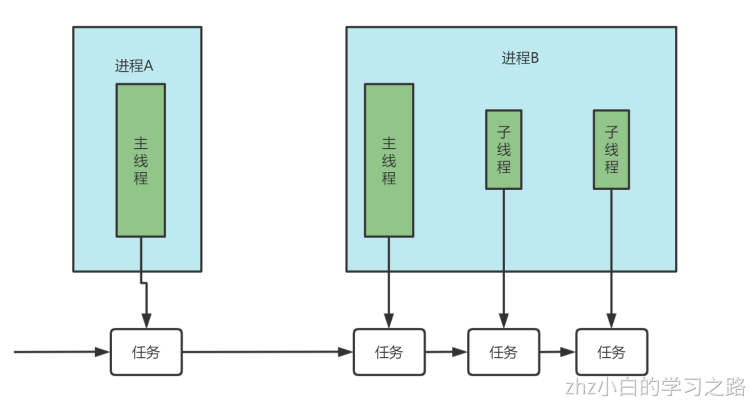
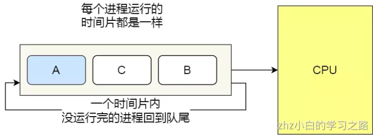
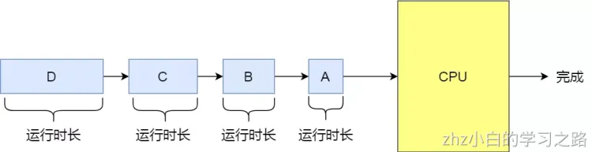
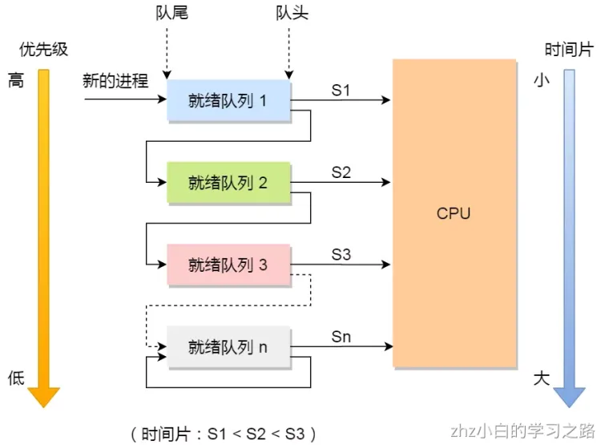
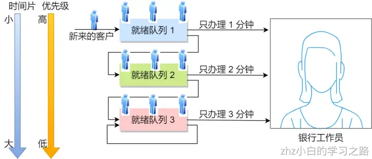

# 第3章、进程和线程
## 3.1 进程

### 3.1.1 进程的概念

我们编写的代码只是一个存储在硬盘的静态文件，通过编译后就会生成二进制可执行文件，当我们运行这个可执行文件后，它会被装载到内存中，接着 CPU 会执行程序中的每一条指令，那么这个**运行中的程序，就被称为「进程」**。

我们把操作系统做某件事，抽象成一种概念，称之为一个任务。一个进程可以对应一个任务，也可以对应多个任务。
早期的计算机只有一个 CPU，多个任务需要运行怎么办？需要**依次排队等待，串行执行，一个任务执行完毕，才能执行下一个**。这种方式存在着明显的弊端，假设排在前面的 A 任务需要执行5小时，而排后面的B任务仅需要1分钟，那么 B 任务必须等待 A 任务5小时完成后，才能执行，这种方式显得极其不灵活。
后来就有了多任务系统，在CPU同一时间只能处理一个任务的前提下，每个任务有一定的执行时长，比如任务A执行0.001s，切换到任务B执行0.05s，再切换到任务C执行0.01s...不断循环。这种机制也就可以在一定程度上解决上述任务B需要长时间等待的问题。
由于 CPU 速度非常快，这种多个任务不断切换，会给用户一种任务并行执行的错觉，这种也被称为是伪并行调度。既然有伪并行，那么也会有真并行。在现代计算机中，常见的CPU核数可以达到8核甚至更多，操作系统可将每一个核视为一个CPU，那么8核CPU就可以真并行执行8个任务。
并发和并行有什么区别？

伪并行虽然可以解决上述任务等待的问题，但是依然还存在一系列未解之谜：

- 每个任务应该执行多长时间？
- 如何找到要执行的下一个任务？
- 有些任务涉及了资源操作，执行到一半，切换任务，那么这些资源怎么办？

为了解决上面一系列谜题，我们需要一种模型对任务进行详尽的描述记录。

### 3.1.2 进程的状态

那么什么原因会导致进程会被创建，从而生成PCB呢？常见的有以下几种

1. 系统初始化
2. 用户通过系统提供的API创建新进程
3. 批处理作业初始化 (什么是批处理作业)
4. 由现有进程派生子进程

一个进程，因为某种原因被创建了，那么它可以按照以下步骤进行一系列的初始化

1. 给新进程分配一个进程ID
2. 分配内存空间
3. 初始化PCB
4. 进入就绪队列

#### 3.1.2.1 五状态模型

就绪 -> 运行：当操作系统内存在着调度程序，当需要运行一个新进程时，调度程序选择一个就绪态的进程，让其进入运行态。
运行 -> 就绪：运行态的进程，会占有CPU（参照一开始的饼状图）。每个进程会被分配一定的执行时间，当时间结束后，重新回到就绪态。
运行 -> 阻塞：进程请求调用系统的某些服务，但是操作系统没法立即给它（比如这种服务可能要耗时初始化，比如I/O资源需要等待），那么它就会进入阻塞态。
阻塞 -> 就绪：当等待结束了，就由阻塞态进入就绪态。
运行 -> 终止：当进程表示自己已经完成了，它会被操作系统终止。

这便是对于单个进程，经典的五状态模型。当存在多个进程时，由于同一时间只能有一个进程在执行，那么如何去管理这一系列的处于阻塞态和就绪态的进程呢？一般来说，会使用就绪队列，和阻塞队列，让处于阻塞态和就绪态的进程进入队列，排队执行。

#### 3.1.2.2 七状态模型

一旦排队的进程多了，对于有限的内存空间将会是极大的考验。为了解决内存占用问题，可以将一部分内存中的进程交换到磁盘中，这些被交换到磁盘的进程，会进入挂起状态
挂起状态可以分为两种：

- 阻塞挂起状态：进程在外存（硬盘）并等待某个事件的出现；
- 就绪挂起状态：进程在外存（硬盘），但只要进入内存，即刻立刻运行；

这两种挂起状态加上前面的五种状态，就变成了七种状态变迁，见如下图：

### 3.1.3 进程的控制结构

对于一个被执行的程序，操作系统会为该程序创建一个进程。进程作为一种抽象概念，可将其视为一个容器，该容器聚集了相关资源，包括地址空间，线程，打开的文件，保护许可等。而操作系统本身是一个程序，有一句经典的话 程序 = 算法 + 数据结构，因此对于单个进程，可以基于一种数据结构来表示它，这种数据结构称之为进程控制块(PCB)
在操作系统中，是用**进程控制块**（_process control block，PCB_）数据结构来描述进程的。
**PCB 是进程存在的唯一标识**，这意味着一个进程的存在，必然会有一个 PCB，如果进程消失了，那么 PCB 也会随之消失。
PCB 具体包含什么信息呢？

每个 PCB 是如何组织的呢？
通常是通过**链表**的方式进行组织，把具有**相同状态的进程链在一起，组成各种队列**。比如：

- 将所有处于就绪状态的进程链在一起，称为**就绪队列**；
- 把所有因等待某事件而处于等待状态的进程链在一起就组成各种**阻塞队列**；
- 另外，对于运行队列在单核 CPU 系统中则只有一个运行指针了，因为单核 CPU 在某个时间，只能运行一个程序。

那么，就绪队列和阻塞队列链表的组织形式如下图：

除了链接的组织方式，还有索引方式，它的工作原理：将同一状态的进程组织在一个索引表中，索引表项指向相应的 PCB，不同状态对应不同的索引表。

一般会选择链表，因为可能面临进程创建，销毁等调度导致进程状态发生变化，所以链表能够更加灵活的插入和删除。

### 3.1.4 进程的切换

当一个正在运行中的进程被中断，操作系统指定另一个就绪态的进程进入运行态，这个过程就是进程切换，也可以叫上下文切换。
该切换过程一般涉及以下步骤：
1.保存处理器上下文环境：将CPU程序计数器和寄存器的值保存到当前进程的私有堆栈里
2.更新当前进程的PCB（包括状态更变）
3.将当前进程移到就绪队列或者阻塞队列
4.根据调度算法，选择就绪队列中一个合适的新进程，将其更改为运行态
5.更新内存管理的数据结构
6.新进程内对堆栈所保存的上下文信息载入到CPU的寄存器和程序计数器，占有CPU

发生进程上下文切换有哪些场景？

- 为了保证所有进程可以得到公平调度，CPU 时间被划分为一段段的时间片，这些时间片再被轮流分配给各个进程。这样，当某个进程的时间片耗尽了，就会被系统挂起，切换到其它正在等待 CPU 的进程运行；
- 进程在系统资源不足（比如内存不足）时，要等到资源满足后才可以运行，这个时候进程也会被挂起，并由系统调度其他进程运行；
- 当进程通过睡眠函数 sleep 这样的方法将自己主动挂起时，自然也会重新调度；
- 当有优先级更高的进程运行时，为了保证高优先级进程的运行，当前进程会被挂起，由高优先级进程来运行；
- 发生硬件中断时，CPU 上的进程会被中断挂起，转而执行内核中的中断服务程序；

以上，就是发生进程上下文切换的常见场景了。

## 3.2 线程

在早期的操作系统中都是以进程作为独⽴运⾏的基本单位，直到后⾯，计算机科学家们⼜提出了更⼩的能独⽴运⾏的基本单位，也就是线程。

### 3.2.1 什么是线程？

线程是进程当中的⼀条执⾏流程。
同⼀个进程内多个线程之间可以共享代码段、数据段、打开的⽂件等资源，但每个线程各⾃都有⼀套独⽴的寄存器和栈，这样可以确保线程的控制流是相对独⽴的。

我们一开始提及过，操作系统底层存在调度程序，调度程序可调度任务，而单线程进程，每个进程可以对应一个任务。现在，对于多线程的进程，每一个线程最终对于调度程序来说，都是一个任务，如下图（Linux系统）。因此也有一种流行的说法**线程是CPU调度的基本单位**

## 3.3 线程的上下文切换

线程与进程最大的区别在于：**线程是调度的基本单位，而进程则是资源拥有的基本单位**。
所以，所谓操作系统的任务调度，实际上的调度对象是线程，而进程只是给线程提供了虚拟内存、全局变量等资源。
对于线程和进程，我们可以这么理解：

- 当进程只有一个线程时，可以认为进程就等于线程；
- 当进程拥有多个线程时，这些线程会共享相同的虚拟内存和全局变量等资源，这些资源在上下文切换时是不需要修改的；

另外，线程也有自己的私有数据，比如栈和寄存器等，这些在上下文切换时也是需要保存的。

线程上下文切换的是什么？
这还得看线程是不是属于同一个进程：

- 当两个线程不是属于同一个进程，则切换的过程就跟进程上下文切换一样；
- **当两个线程是属于同一个进程，因为虚拟内存是共享的，所以在切换时，虚拟内存这些资源就保持不动，只需要切换线程的私有数据、寄存器等不共享的数据**；

所以，线程的上下文切换相比进程，开销要小很多。

## 3.4 进程调度

进程都希望自己能够占用 CPU 进行工作，那么这涉及到前面说过的进程上下文切换。

一旦操作系统把进程切换到运行状态，也就意味着该进程占用着 CPU 在执行，但是当操作系统把进程切换到其他状态时，那就不能在 CPU 中执行了，于是操作系统会选择下一个要运行的进程。

选择一个进程运行这一功能是在操作系统中完成的，通常称为**调度程序**（_scheduler_）。

那到底什么时候调度进程，或以什么原则来调度进程呢？

### 3.4.1 什么时候调度进程

在进程的生命周期中，当进程从一个运行状态到另外一状态变化的时候，其实会触发一次调度。
比如，以下状态的变化都会触发操作系统的调度：

- _从就绪态 -> 运行态_：当进程被创建时，会进入到就绪队列，操作系统会从就绪队列选择一个进程运行；
- _从运行态 -> 阻塞态_：当进程发生 I/O 事件而阻塞时，操作系统必须另外一个进程运行；
- _从运行态 -> 结束态_：当进程退出结束后，操作系统得从就绪队列选择另外一个进程运行；

因为，这些状态变化的时候，操作系统需要考虑是否要让新的进程给 CPU 运行，或者是否让当前进程从 CPU 上退出来而换另一个进程运行。
另外，如果硬件时钟提供某个频率的周期性中断，那么可以根据如何处理时钟中断
，把调度算法分为两类：

- **非抢占式调度算法**挑选一个进程，然后让该进程运行直到被阻塞，或者直到该进程退出，才会调用另外一个进程，也就是说不会理时钟中断这个事情。
- **抢占式调度算法**挑选一个进程，然后让该进程只运行某段时间，如果在该时段结束时，该进程仍然在运行时，则会把它挂起，接着调度程序从就绪队列挑选另外一个进程。这种抢占式调度处理，需要在时间间隔的末端发生**时钟中断**，以便把 CPU 控制返回给调度程序进行调度，也就是常说的**时间片机制**。

### 3.4.2 以什么原则来调度进程

五种调度原则：

- **CPU 利用率**：调度程序应确保 CPU 是始终匆忙的状态，这可提高 CPU 的利用率；
- **系统吞吐量**：吞吐量表示的是单位时间内 CPU 完成进程的数量，长作业的进程会占用较长的 CPU 资源，因此会降低吞吐量，相反，短作业的进程会提升系统吞吐量；
- **周转时间**：周转时间是进程运行和阻塞时间总和，一个进程的周转时间越小越好；
- **等待时间**：这个等待时间不是阻塞状态的时间，而是进程处于就绪队列的时间，等待的时间越长，用户越不满意；
- **响应时间**：用户提交请求到系统第一次产生响应所花费的时间，在交互式系统中，响应时间是衡量调度算法好坏的主要标准。

说白了，这么多调度原则，目的就是要使得进程要「快」。

### 3.4.3 进程调度算法

常见的进程调度算法有：

- 先来先服服务
- 时间片轮转
- 最短作业优先
- 最短剩余时间优先
- 优先级调度
- 多级反馈队列调度

#### 3.4.3.1 先来先服务

先来先服务（First Come First Serverd, FCFS）。先进就绪队列，则先被调度，先来先服务是最简单的调度算法。

先来先服务存在上面谈论过的问题：当前面任务耗费很长时间执行，那么后面的任务即使只需要执行很短的时间，也必须一直等待。属于非抢占式

#### 3.4.3.2 时间片轮转调度

每一个进程会被分配一个时间片，表示允许该进程在这个时间段运行，如果时间结束了，进程还没运行完毕，那么会通过抢占式调度，将CPU分配给其他进程，该进程回到就绪队列。这是一种最简单最公平的调度算法，但是有可能会存在问题。由于进程的切换，需要耗费时间，如果时间片太短，频繁进行切换，会影响效率。如果进程时间片太长，有可能导致排后面的进程等待太长时间。因此时间片的长度，需要有大致合理的数值。（《现代操作系统》的观点是建议时间片长度在20ms~50ms）。

#### 3.4.3.3 最短作业优先

最短作业优先（Shortest Job First, SJF），顾名思义即进程按照作业时间长短排队，作业时间段的排前面先执行，如 下图。

这显然对长作业不利，很容易造成一种极端现象。
比如，一个长作业在就绪队列等待运行，而这个就绪队列有非常多的短作业，那么就会使得长作业不断的往后推，周转时间变长，致使长作业长期不会被运行。

#### 3.4.3.4 最短剩余时间优先

最短剩余时间优先（Shortest Remaining Time Next），从就绪队列中选择剩余时间最短的进程进行调度。该算法可以理解最短作业优先和时间片轮转的结合。如果没有时间片，那么最短剩余时间其实就是最短作业时间，因为每个进程都是从头执行到尾。

#### 3.4.3.5 优先级调度

假设就绪队列中有如下进程

| 进程 | 执行时间 | 优先级 |
| ---- | -------- | ------ |
| p1   | 5        | 1      |
| p2   | 2        | 3      |
| p3   | 3        | 2      |

按照优先级调度，执行顺序为p1->p3->p2。如果多个进程优先级相同，则按照先来先服务的方式依次执行。
优先级调度可以进一步细分为抢占式和非抢占式。
非抢占式：和上面提及的非抢占式类似，一旦该进程占有CPU就将一直执行到结束或者阻塞。
抢占式：进程执行期间，一旦有更高优先级的进程进入就绪队列，那么该进程就会被暂停，重回就绪队列，让更高优先级的进程执行。但是为了防止最高优先级进程一直执行，每个进程依然有自己的时间片，每次时间片结束后，会根据一定规则降低该进程优先级，避免某些最高优先级长作业进程一直占用CPU。

但是依然有缺点，可能会导致低优先级的进程永远不会运行。

#### 3.4.3.6 多级反馈队列调度

多级反馈队列调度基于时间片轮转和优先级调度，设置多个就绪队列，赋予每个就绪队列优先级，优先级越高的队列进程的时间片越短。如下图，第1级就绪队列优先级最高，进程的时间片长度最短，第2级就绪队列次之，以此类推。

当有新的进程创建时，先进入第1级就绪队列，时间片结束之前就运行完毕，则终止，否则进入第2级队列等待下一次调度。在n级队列之前，进程按照先到先服务规则依次调度，到了第n级队列（最后一级）采用时间片轮转调度。仅当第1级队列为空时，才调度第2级队列的进程，如果第i级队列的进程正在运行，此时有一个更高优先级的进程进入，则会停下第i级的进程，让它回到第i级队列尾部，转而执行更高优先级的进程，即满足优先级调度算法的原则。
可以发现，对于短作业可能可以在第一级队列很快被处理完。对于长作业，如果在第一级队列处理不完，可以移入下次队列等待被执行，虽然等待的时间变长了，但是运行时间也会更长了，所以该算法很好的**兼顾了长短作业，同时有较好的响应时间。**
拿去银行办业务的例子，把上面的调度算法串起来
**办理业务的客户相当于进程，银行窗口工作人员相当于 CPU。**
现在，假设这个银行只有一个窗口（单核 CPU ），那么工作人员一次只能处理一个业务。

那么最简单的处理方式，就是先来的先处理，后面来的就乖乖排队，这就是**先来先服务（**_**FCFS**_**）调度算法**。但是万一先来的这位老哥是来贷款的，这一谈就好几个小时，一直占用着窗口，这样后面的人只能干等，或许后面的人只是想简单的取个钱，几分钟就能搞定，却因为前面老哥办长业务而要等几个小时，你说气不气人？

有客户抱怨了，那我们就要改进，我们干脆优先给那些几分钟就能搞定的人办理业务，这就是**短作业优先（**_**SJF**_**）调度算法**。听起来不错，但是依然还是有个极端情况，万一办理短业务的人非常的多，这会导致长业务的人一直得不到服务，万一这个长业务是个大客户，那不就捡了芝麻丢了西瓜

那就公平起见，现在窗口工作人员规定，每个人我只处理 10 分钟。如果 10 分钟之内处理完，就马上换下一个人。如果没处理完，依然换下一个人，但是客户自己得记住办理到哪个步骤了。这个也就是**时间片轮转（**_**RR**_**）调度算法**。但是如果时间片设置过短，那么就会造成大量的上下文切换，增大了系统开销。如果时间片过长，相当于退化成退化成 FCFS 算法了。

既然公平也可能存在问题，那银行就对客户分等级，分为普通客户、VIP 客户、SVIP 客户。只要高优先级的客户一来，就第一时间处理这个客户，这就是**最高优先级（**_**HPF**_**）调度算法**。但依然也会有极端的问题，万一当天来的全是高级客户，那普通客户不是没有被服务的机会，不把普通客户当人是吗？那我们把优先级改成动态的，如果客户办理业务时间增加，则降低其优先级，如果客户等待时间增加，则升高其优先级。

那有没有兼顾到公平和效率的方式呢？这里介绍一种算法，考虑的还算充分的，**多级反馈队列（**_**MFQ**_**）调度算法**，它是时间片轮转算法和优先级算法的综合和发展。它的工作方式：

- 银行设置了多个排队（就绪）队列，每个队列都有不同的优先级，**各个队列优先级从高到低**，同时每个队列执行时间片的长度也不同，**优先级越高的时间片越短**。
- 新客户（进程）来了，先进入第一级队列的末尾，按先来先服务原则排队等待被叫号（运行）。如果时间片用完客户的业务还没办理完成，则让客户进入到下一级队列的末尾，以此类推，直至客户业务办理完成。
- 当第一级队列没人排队时，就会叫号二级队列的客户。如果客户办理业务过程中，有新的客户加入到较高优先级的队列，那么此时办理中的客户需要停止办理，回到原队列的末尾等待再次叫号，因为要把窗口让给刚进入较高优先级队列的客户。

可以发现，对于要办理短业务的客户来说，可以很快的轮到并解决。对于要办理长业务的客户，一下子解决不了，就可以放到下一个队列，虽然等待的时间稍微变长了，但是轮到自己的办理时间也变长了，也可以接受，不会造成极端的现象，可以说是综合上面几种算法的优点。

