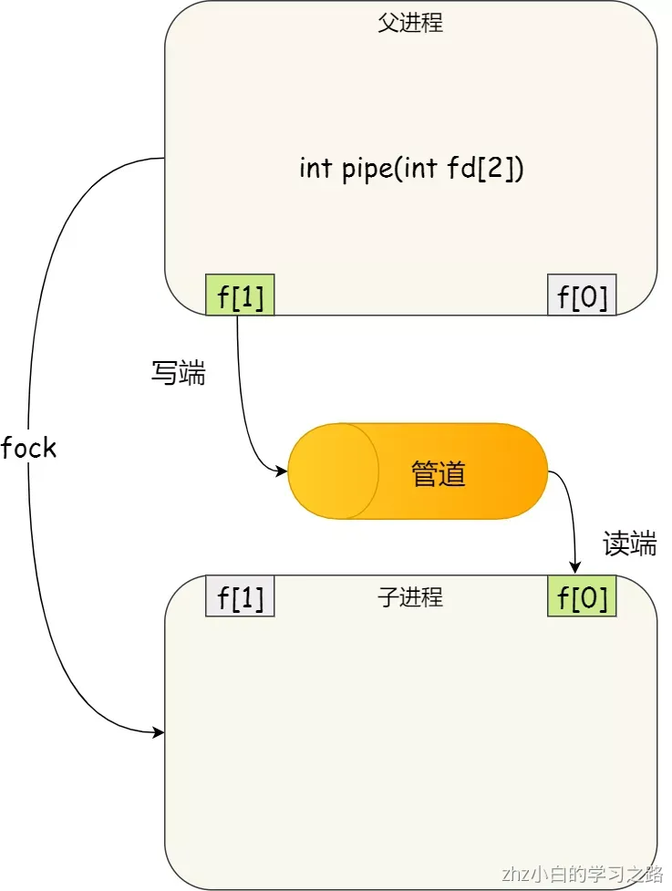
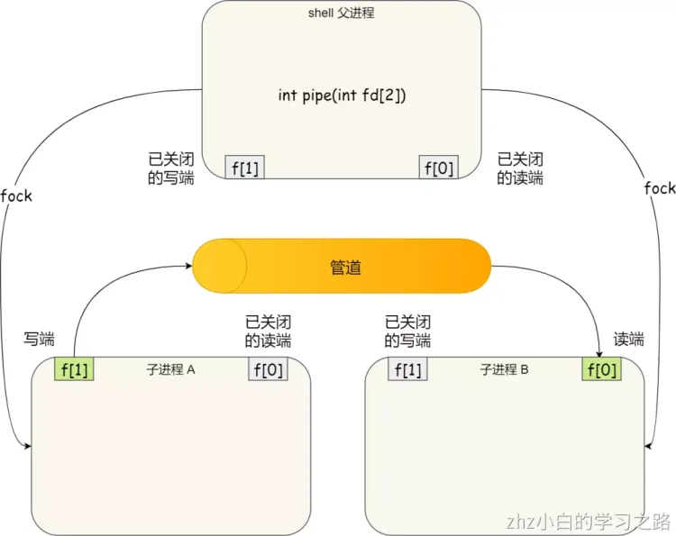
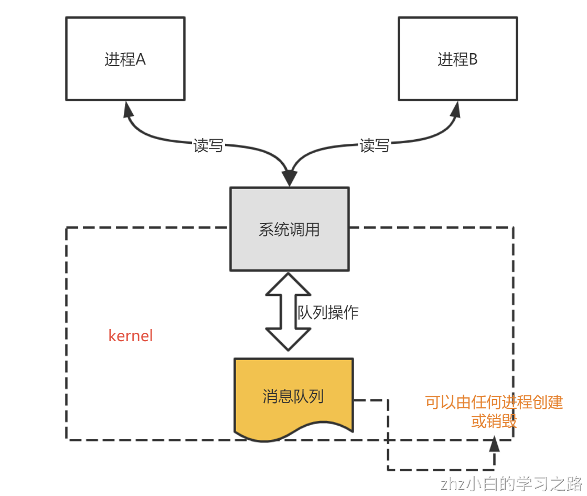
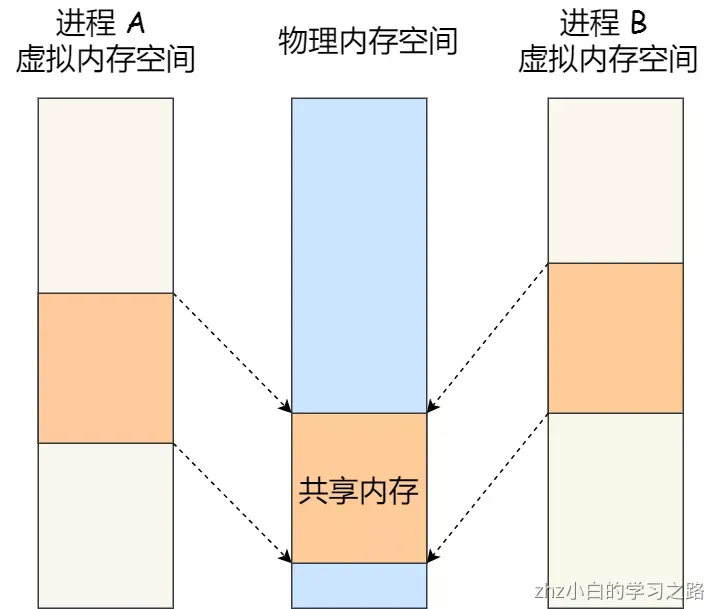
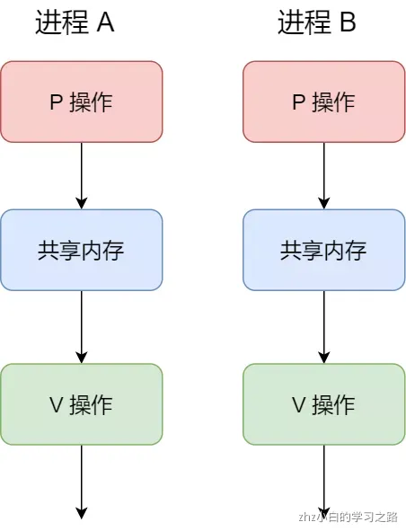
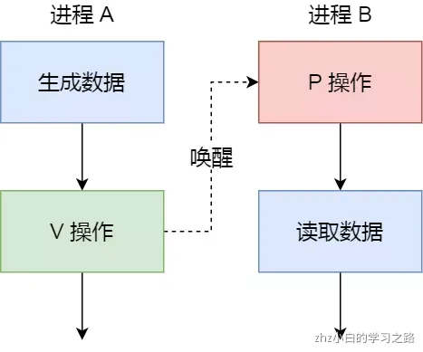
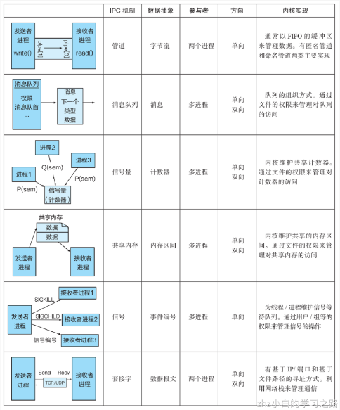

每个进程的用户地址空间都是独立的，一般而言是不能互相访问的，但内核空间是每个进程都共享的，所以进程之间要通信必须通过内核。

进程间通信目的一般有共享数据，数据传输，消息通知，进程控制等。以 Unix/Linux 为例，介绍几种重要的进程间通信方式：**共享内存，管道，消息队列，信号量，信号**

# 管道
如果你学过 Linux 命令，那你肯定很熟悉「`|`」这个竖线。
```shell
$ ps auxf | grep mysql
```
上面命令行里的「`|`」竖线就是一个**管道**，它的功能是将前一个命令（`ps auxf`）的输出，作为后一个命令（`grep mysql`）的输入，从这功能描述，可以看出**管道传输数据是单向的**，如果想相互通信，我们需要创建两个管道才行。
同时，我们得知上面这种管道是没有名字，所以「`|`」表示的管道称为**匿名管道**，用完了就销毁。
管道还有另外一个类型是**命名管道**，也被叫做 `FIFO`，因为数据是先进先出的传输方式。
在使用命名管道前，先需要通过 `mkfifo` 命令来创建，并且指定管道名字：
```shell
$ mkfifo myPipe
```
myPipe 就是这个管道的名称，基于 Linux 一切皆文件的理念，所以管道也是以文件的方式存在，我们可以用 ls 看一下，这个文件的类型是 p，也就是 pipe（管道） 的意思：
```shell
$ ls -l
prw-r--r--. 1 root    root         0 Jul 17 02:45 myPipe
```
接下来，我们往 myPipe 这个管道写入数据：
```shell
$ echo "hello" > myPipe  // 将数据写进管道
                         // 停住了 ...
```
你操作了后，你会发现命令执行后就停在这了，这是因为管道里的内容没有被读取，只有当管道里的数据被读完后，命令才可以正常退出。

于是，我们执行另外一个命令来读取这个管道里的数据：
```shell
$ cat < myPipe  // 读取管道里的数据
hello
```
可以看到，管道里的内容被读取出来了，并打印在了终端上，另外一方面，echo 那个命令也正常退出了。

我们可以看出，**管道这种通信方式效率低，不适合进程间频繁地交换数据**。当然，它的好处，自然就是简单，同时也我们很容易得知管道里的数据已经被另一个进程读取了。

我们可以得知，**对于匿名管道，它的通信范围是存在父子关系的进程**。因为管道没有实体，也就是没有管道文件，只能通过 fork 来复制父进程 fd 文件描述符，来达到通信的目的。

在 shell 里面执行 `A | B`命令的时候，A 进程和 B 进程都是 shell 创建出来的子进程，A 和 B 之间不存在父子关系，它俩的父进程都是 shell。


另外，**对于命名管道，它可以在不相关的进程间也能相互通信**。因为命令管道，提前创建了一个类型为管道的设备文件，在进程里只要使用这个设备文件，就可以相互通信。

# 消息队列
前面说到管道的通信方式是效率低的，因此管道不适合进程间频繁地交换数据。

对于这个问题，**消息队列**的通信模式就可以解决。比如，A 进程要给 B 进程发送消息，A 进程把数据放在对应的消息队列后就可以正常返回了，B 进程需要的时候再去读取数据就可以了。同理，B 进程要给 A 进程发送消息也是如此。

再来，**消息队列是保存在内核中的消息链表**，在发送数据时，会分成一个一个独立的数据单元，也就是消息体（数据块），消息体是用户自定义的数据类型，消息的发送方和接收方要约定好消息体的数据类型，所以每个消息体都是固定大小的存储块，不像管道是无格式的字节流数据。如果进程从消息队列中读取了消息体，内核就会把这个消息体删除。

消息队列生命周期随内核，如果没有释放消息队列或者没有关闭操作系统，消息队列会一直存在，而前面提到的匿名管道的生命周期，是随进程的创建而建立，随进程的结束而销毁。

缺点：
**消息队列通信过程中，存在用户态与内核态之间的数据拷贝开销**，因为进程写入数据到内核中的消息队列时，会发生从用户态拷贝数据到内核态的过程，同理另一进程读取内核中的消息数据时，会发生从内核态拷贝数据到用户态的过程。

# 共享内存
消息队列的读取和写入的过程，都会有发生用户态与内核态之间的消息拷贝过程。那**共享内存**的方式，就很好的解决了这一问题。

现代操作系统，对于内存管理，采用的是虚拟内存技术，也就是每个进程都有自己独立的虚拟内存空间，不同进程的虚拟内存映射到不同的物理内存中。所以，即使进程 A 和 进程 B 的虚拟地址是一样的，其实访问的是不同的物理内存地址，对于数据的增删查改互不影响。

**共享内存的机制，就是拿出一块虚拟地址空间来，映射到相同的物理内存中**。这样这个进程写入的东西，另外一个进程马上就能看到了，都不需要拷贝来拷贝去，传来传去，大大提高了进程间通信的速度。

# 信号量
用了共享内存通信方式，带来新的问题，那就是如果多个进程同时修改同一个共享内存，很有可能就冲突了。例如两个进程都同时写一个地址，那先写的那个进程会发现内容被别人覆盖了。

为了防止多进程竞争共享资源，而造成的数据错乱，所以需要保护机制，使得共享的资源，在任意时刻只能被一个进程访问。正好，**信号量**就实现了这一保护机制。

**信号量其实是一个整型的计数器，主要用于实现进程间的互斥与同步，而不是用于缓存进程间通信的数据**。

信号量表示资源的数量，控制信号量的方式有两种原子操作：

- 一个是 **P 操作**，这个操作会把信号量减去 -1，相减后如果信号量 < 0，则表明资源已被占用，进程需阻塞等待；相减后如果信号量 >= 0，则表明还有资源可使用，进程可正常继续执行。
- 另一个是 **V 操作**，这个操作会把信号量加上 1，相加后如果信号量 <= 0，则表明当前有阻塞中的进程，于是会将该进程唤醒运行；相加后如果信号量 > 0，则表明当前没有阻塞中的进程；

P 操作是用在进入共享资源之前，V 操作是用在离开共享资源之后，这两个操作是必须成对出现的。
接下来，举个例子，如果要使得两个进程互斥访问共享内存，我们可以初始化信号量为 `1`。


具体的过程如下：

- 进程 A 在访问共享内存前，先执行了 P 操作，由于信号量的初始值为 1，故在进程 A 执行 P 操作后信号量变为 0，表示共享资源可用，于是进程 A 就可以访问共享内存。
- 若此时，进程 B 也想访问共享内存，执行了 P 操作，结果信号量变为了 -1，这就意味着临界资源已被占用，因此进程 B 被阻塞。
- 直到进程 A 访问完共享内存，才会执行 V 操作，使得信号量恢复为 0，接着就会唤醒阻塞中的线程 B，使得进程 B 可以访问共享内存，最后完成共享内存的访问后，执行 V 操作，使信号量恢复到初始值 1。

可以发现，信号初始化为 `1`，就代表着是**互斥信号量**，它可以保证共享内存在任何时刻只有一个进程在访问，这就很好的保护了共享内存。

另外，在多进程里，每个进程并不一定是顺序执行的，它们基本是以各自独立的、不可预知的速度向前推进，但有时候我们又希望多个进程能密切合作，以实现一个共同的任务。

例如，进程 A 是负责生产数据，而进程 B 是负责读取数据，这两个进程是相互合作、相互依赖的，进程 A 必须先生产了数据，进程 B 才能读取到数据，所以执行是有前后顺序的。

那么这时候，就可以用信号量来实现多进程同步的方式，我们可以初始化信号量为 `0`。

具体过程：

- 如果进程 B 比进程 A 先执行了，那么执行到 P 操作时，由于信号量初始值为 0，故信号量会变为 -1，表示进程 A 还没生产数据，于是进程 B 就阻塞等待；
- 接着，当进程 A 生产完数据后，执行了 V 操作，就会使得信号量变为 0，于是就会唤醒阻塞在 P 操作的进程 B；
- 最后，进程 B 被唤醒后，意味着进程 A 已经生产了数据，于是进程 B 就可以正常读取数据了。

可以发现，信号初始化为 `0`，就代表着是**同步信号量**，它可以保证进程 A 应在进程 B 之前执行。

# 信号
信号一般用于一些异常情况下的进程间通信，是一种异步通信，它的数据结构一般就是一个数字
在 Linux 操作系统中， 为了响应各种各样的事件，提供了几十种信号，分别代表不同的意义。我们可以通过 `kill -l` 命令，查看所有的信号：
```shell
$ kill -l
 1) SIGHUP       2) SIGINT       3) SIGQUIT      4) SIGILL       5) SIGTRAP
 6) SIGABRT      7) SIGBUS       8) SIGFPE       9) SIGKILL     10) SIGUSR1
11) SIGSEGV     12) SIGUSR2     13) SIGPIPE     14) SIGALRM     15) SIGTERM
16) SIGSTKFLT   17) SIGCHLD     18) SIGCONT     19) SIGSTOP     20) SIGTSTP
21) SIGTTIN     22) SIGTTOU     23) SIGURG      24) SIGXCPU     25) SIGXFSZ
26) SIGVTALRM   27) SIGPROF     28) SIGWINCH    29) SIGIO       30) SIGPWR
31) SIGSYS      34) SIGRTMIN    35) SIGRTMIN+1  36) SIGRTMIN+2  37) SIGRTMIN+3
38) SIGRTMIN+4  39) SIGRTMIN+5  40) SIGRTMIN+6  41) SIGRTMIN+7  42) SIGRTMIN+8
43) SIGRTMIN+9  44) SIGRTMIN+10 45) SIGRTMIN+11 46) SIGRTMIN+12 47) SIGRTMIN+13
48) SIGRTMIN+14 49) SIGRTMIN+15 50) SIGRTMAX-14 51) SIGRTMAX-13 52) SIGRTMAX-12
53) SIGRTMAX-11 54) SIGRTMAX-10 55) SIGRTMAX-9  56) SIGRTMAX-8  57) SIGRTMAX-7
58) SIGRTMAX-6  59) SIGRTMAX-5  60) SIGRTMAX-4  61) SIGRTMAX-3  62) SIGRTMAX-2
63) SIGRTMAX-1  64) SIGRTMAX
```
运行在 shell 终端的进程，我们可以通过键盘输入某些组合键的时候，给进程发送信号。例如

- Ctrl+C 产生 `SIGINT` 信号，表示终止该进程；
- Ctrl+Z 产生 `SIGTSTP` 信号，表示停止该进程，但还未结束；

如果进程在后台运行，可以通过 `kill` 命令的方式给进程发送信号，但前提需要知道运行中的进程 PID 号，例如：

- kill -9 1050 ，表示给 PID 为 1050 的进程发送 `SIGKILL` 信号，用来立即结束该进程；

所以，信号事件的来源主要有硬件来源（如键盘 Cltr+C ）和软件来源（如 kill 命令）。

信号是进程间通信机制中**唯一的异步通信机制**

进程需要为信号设置相应的监听处理，当收到特定信号时，执行相应的操作，类似很多编程语言里的通知机制。

# Socket
前面提到的管道、消息队列、共享内存、信号量和信号都是在同一台主机上进行进程间通信，那要想**跨网络与不同主机上的进程之间通信，就需要 Socket 通信了。**

实际上，Socket 通信不仅可以跨网络与不同主机的进程间通信，还可以在同主机上进程间通信。

# 总结

