# 文件系统的功能规划
对于运行的进程来说，内存就像一个纸箱子，仅仅是一个暂存数据的地方，而且空间有限。如果我们想要进程结束之后，数据依然能够保存下来，就不能只保存在内存里，而是应该保存在外部存储中。就像图书馆这种地方，不仅空间大，而且能够永久保存。

我们最常用的外部存储就是硬盘，数据是以文件的形式保存在硬盘上的。为了管理这些文件，我们在规划文件系统的时候，需要考虑到以下几点。

**第一点，文件系统要有严格的组织形式，使得文件能够以块为单位进行存储**。这就像图书馆里，我们会给设置一排排书架，然后再把书架分成一个个小格子，有的项目存放的资料非常多，一个格子放不下，就需要多个格子来进行存放。我们把这个区域称为存放原始资料的仓库区。

**第二点，文件系统中也要有索引区，用来方便查找一个文件分成的多个块都存放在了什么位置**。这就好比，图书馆的书太多了，为了方便查找，我们需要专门设置一排书架，这里面会写清楚整个档案库有哪些资料，资料在哪个架子的哪个格子上。这样找资料的时候就不用跑遍整个档案库，在这个书架上找到后，直奔目标书架就可以了。
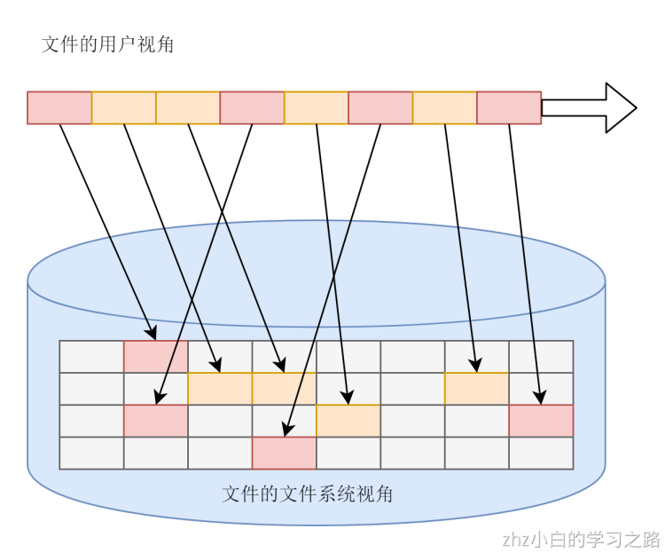
**第三点，如果文件系统中有的文件是热点文件，近期经常被读取和写入，文件系统应该有缓存层**。这就相当于图书馆里面的热门图书区，这里面的书都是畅销书或者是常常被借还的图书。因为借还的次数比较多，那就没必要每次有人还了之后，还放回遥远的货架，我们可以专门开辟一个区域，放置这些借还频次高的图书。这样借还的效率就会提高。

**第四点，文件应该用文件夹的形式组织起来，方便管理和查询**。这就像在图书馆里面，你可以给这些资料分门别类，比如分成计算机类、文学类、历史类等等。这样你也容易管理，项目组借阅的时候只要在某个类别中去找就可以了。

在文件系统中，每个文件都有一个名字，这样我们访问一个文件，希望通过它的名字就可以找到。文件名就是一个普通的文本。当然文件名会经常冲突，不同用户取相同的名字的情况还是会经常出现的。

要想把很多的文件有序地组织起来，我们就需要把它们成为目录或者文件夹。这样，一个文件夹里可以包含文件夹，也可以包含文件，这样就形成了一种树形结构。而我们可以将不同的用户放在不同的用户目录下，就可以一定程度上避免了命名的冲突问题。
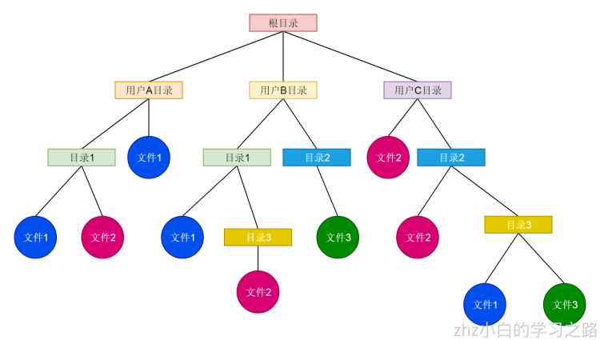
**第五点，Linux 内核要在自己的内存里面维护一套数据结构，来保存哪些文件被哪些进程打开和使用**。这就好比，图书馆里会有个图书管理系统，记录哪些书被借阅了，被谁借阅了，借阅了多久，什么时候归还。

# 文件系统的基本组成
## 一切皆文件
文件系统是操作系统中负责管理持久数据的子系统，说简单点，就是负责把用户的文件存到磁盘硬件中，因为即使计算机断电了，磁盘里的数据并不会丢失，所以可以持久化的保存文件。

文件系统的基本数据单位是文件，它的目的是对磁盘上的文件进行组织管理，那组织的方式不同，就会形成不同的文件系统。

Linux 最经典的一句话是：「**一切皆文件**」，不仅普通的文件和目录，就连块设备、管道、socket 等，也都是统一交给文件系统管理的。

Linux 文件系统会为每个文件分配两个数据结构：**索引节点（_index node_）和目录项（_directory entry_）**，它们主要用来记录文件的元信息和目录层次结构。

- 索引节点，也就是 _inode_，用来记录文件的元信息，比如 inode 编号、文件大小、访问权限、创建时间、修改时间、**数据在磁盘的位置**等等。索引节点是文件的**唯一**标识，它们之间一一对应，也同样都会被存储在硬盘中，所以**索引节点同样占用磁盘空间**。
- 目录项，也就是 _dentry_，用来记录文件的名字、**索引节点指针**以及与其他目录项的层级关联关系。多个目录项关联起来，就会形成目录结构，但它与索引节点不同的是，**目录项是由内核维护的一个数据结构，不存放于磁盘，而是缓存在内存**。

由于索引节点唯一标识一个文件，而目录项记录着文件的名，所以目录项和索引节点的关系是多对一，也就是说，一个文件可以有多个别字。比如，硬链接的实现就是多个目录项中的索引节点指向同一个文件。

注意，目录也是文件，也是用索引节点唯一标识，和普通文件不同的是，普通文件在磁盘里面保存的是文件数据，而目录文件在磁盘里面保存子目录或文件。

## 目录项和目录是一个东西吗？
虽然名字很相近，但是它们不是一个东西，目录是个文件，持久化存储在磁盘，而目录项是内核一个数据结构，缓存在内存。

如果查询目录频繁从磁盘读，效率会很低，所以内核会把已经读过的目录用目录项这个数据结构缓存在内存，下次再次读到相同的目录时，只需从内存读就可以，大大提高了文件系统的效率。

注意，目录项这个数据结构不只是表示目录，也是可以表示文件的。

## 那文件数据是如何存储在磁盘的呢？
磁盘读写的最小单位是**扇区**，扇区的大小只有 `512B` 大小，很明显，如果每次读写都以这么小为单位，那这读写的效率会非常低。

所以，文件系统把多个扇区组成了一个**逻辑块**，每次读写的最小单位就是逻辑块（数据块），Linux 中的逻辑块大小为 `4KB`，也就是一次性读写 8 个扇区，这将大大提高了磁盘的读写的效率。
以上就是索引节点、目录项以及文件数据的关系，下面这个图就很好的展示了它们之间的关系：
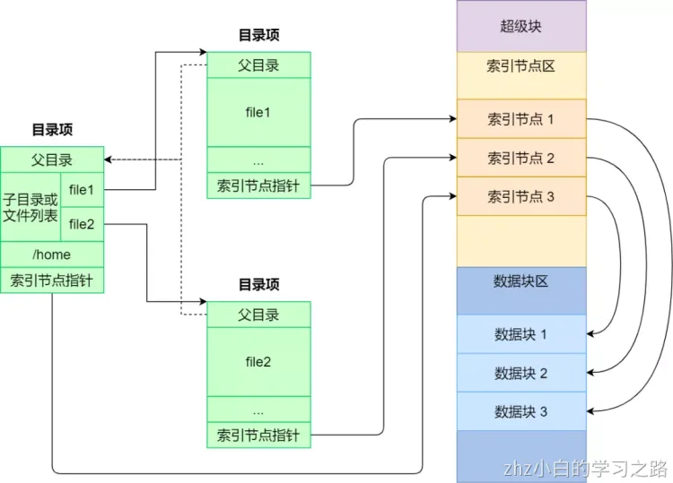
索引节点是存储在硬盘上的数据，那么为了加速文件的访问，通常会把索引节点加载到内存中。

另外，磁盘进行格式化的时候，会被分成三个存储区域，分别是超级块、索引节点区和数据块区。

- _超级块_，用来存储文件系统的详细信息，比如块个数、块大小、空闲块等等。
- _索引节点区_，用来存储索引节点；
- _数据块区_，用来存储文件或目录数据；

我们不可能把超级块和索引节点区全部加载到内存，这样内存肯定撑不住，所以只有当需要使用的时候，才将其加载进内存，它们加载进内存的时机是不同的：

- 超级块：当文件系统挂载时进入内存；
- 索引节点区：当文件被访问时进入内存；

# 虚拟文件系统
文件系统的种类众多，而操作系统希望**对用户提供一个统一的接口**，于是在用户层与文件系统层引入了中间层，这个中间层就称为**虚拟文件系统（_Virtual File System，VFS_）。**

VFS 定义了一组所有文件系统都支持的数据结构和标准接口，这样程序员不需要了解文件系统的工作原理，只需要了解 VFS 提供的统一接口即可。

在 Linux 文件系统中，用户空间、系统调用、虚拟机文件系统、缓存、文件系统以及存储之间的关系如下图：

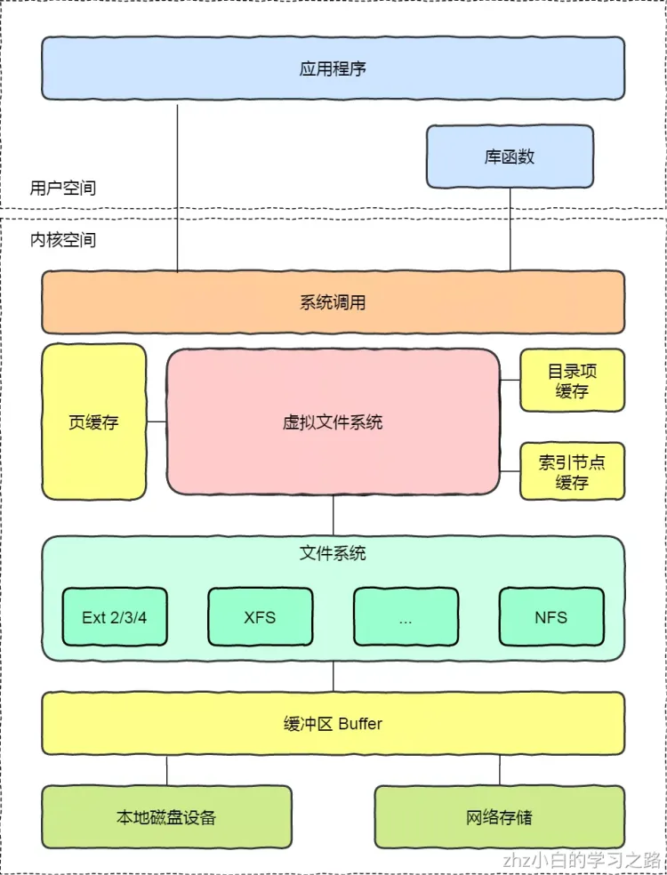
Linux 支持的文件系统也不少，根据存储位置的不同，可以把文件系统分为三类：

- _磁盘的文件系统_，它是直接把数据存储在磁盘中，比如 Ext 2/3/4、XFS 等都是这类文件系统。
- _内存的文件系统_，这类文件系统的数据不是存储在硬盘的，而是占用内存空间，我们经常用到的 `/proc` 和 `/sys` 文件系统都属于这一类，读写这类文件，实际上是读写内核中相关的数据数据。
- _网络的文件系统_，用来访问其他计算机主机数据的文件系统，比如 NFS、SMB 等等。

文件系统首先要先挂载到某个目录才可以正常使用，比如 Linux 系统在启动时，会把文件系统挂载到根目录。

# 文件的物理结构
在操作系统的辅助之下，磁盘中的数据在计算机中都会呈现为易读的形式，并且我们不需要关心数据到底是如何存放在磁盘中，存放在磁盘的哪个地方等等问题，这些全部都是由操作系统完成的。

那么，文件数据在磁盘中究竟是怎么样的呢？我们来一探究竟！

## 文件块
磁盘中的存储单元会被划分为一个个的“块”，也被称为扇区，扇区的大小一般都为 512byte。这说明即使一块数据不足 512byte，那么它也要占用 512byte 的磁盘空间。

而几乎所有的文件系统都会把文件分割成固定大小的块来存储，通常一个块的大小为 4K。如果磁盘中的扇区为 512byte，而文件系统的块大小为 4K，那么文件系统的存储单元就为 8 个扇区。这也是前面提到的一个问题，文件大小和占用空间之间有什么区别？文件大小是文件实际的大小，而占用空间则是因为即使它的实际大小没有达到那么大，但是这部分空间实际也被占用，其他文件数据无法使用这部分的空间。所以我们写入 1byte 的数据到文本中，但是它占用的空间也会是 4K。

这里要注意在 Windows 下的 NTFS 文件系统中，如果一开始文件数据小于 1K，那么则不会分配磁盘块来存储，而是存在一个文件表中。但是一旦文件数据大于 1K，那么不管以后文件的大小，都会分配以 4K 为单位的磁盘空间来存储。

与内存管理一样，为了方便对磁盘的管理，文件的逻辑地址也被分为一个个的文件块。于是文件的逻辑地址就是（逻辑块号，块内地址）。用户通过逻辑地址来操作文件，操作系统负责完成逻辑地址与物理地址的映射。

## 文件分配方式
不同的文件系统为文件分配磁盘空间会有不同的方式，这些方式各自都有优点和缺点。
### 连续分配
**连续分配**要求每个文件在磁盘上占有一组连续的块，该分配方式较为简单。
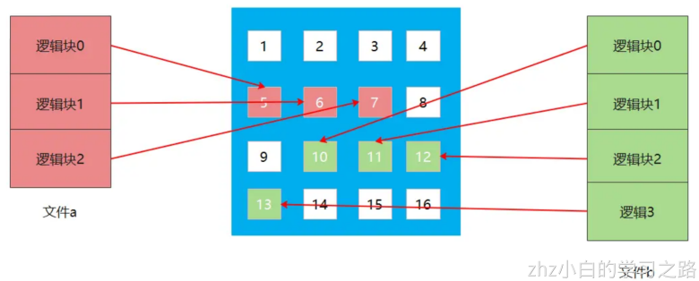
通过上图可以看到，文件的逻辑块号的顺序是与物理块号相同的，这样就可以实现随机存取了，只要知道了第一个逻辑块的物理地址，那么就可以快速访问到其他逻辑块的物理地址。那么操作系统如何完成逻辑块与物理块之间的映射呢？实际上，文件都是存放在目录下的，而目录是一种有结构文件，所以在文件目录的记录中会存放目录下所有文件的信息，每一个文件或者目录都是一个记录。而这些信息就包括文件的起始块号和占有块号的数量。

那么操作系统如何完成逻辑块与物理块之间的映射呢？（逻辑块号，块内地址）-> （物理块号，块内地址），只需要知道逻辑块号对应的物理块号即可，块内地址不变。

用户访问一个文件的内容，操作系统通过文件的标识符找到目录项 FCB，**物理块号 = 起始块号 + 逻辑块号**。当然，还需要检查逻辑块号是否合法，是否超过长度等。因为可以根据逻辑块号直接算出物理块号，所以连续分配支持**顺序访问**和**随机访问**。

因为读/写文件是需要移动磁头的，如果访问两个相隔很远的磁盘块，移动磁头的时间就会变长。使用连续分配来作为文件的分配方式，会使文件的磁盘块相邻，所以文件的读/写速度最快。

连续空间存放的方式虽然读写效率高，**但是有「磁盘空间碎片」和「文件长度不易扩展」的缺陷。**

如下图，如果文件 B 被删除，磁盘上就留下一块空缺，这时，如果新来的文件小于其中的一个空缺，我们就可以将其放在相应空缺里。但如果该文件的大小大于所有的空缺，但却小于空缺大小之和，则虽然磁盘上有足够的空缺，但该文件还是不能存放。当然了，我们可以通过将现有文件进行挪动来腾出空间以容纳新的文件，但是这个在磁盘挪动文件是非常耗时，所以这种方式不太现实。

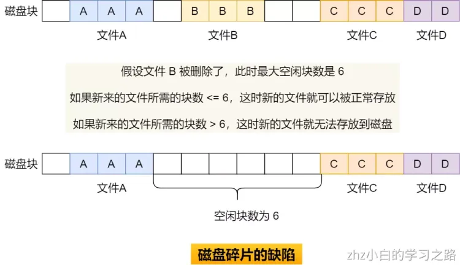
另外一个缺陷是文件长度扩展不方便，例如上图中的文件 A 要想扩大一下，需要更多的磁盘空间，唯一的办法就只能是挪动的方式，前面也说了，这种方式效率是非常低的。

那么有没有更好的方式来解决上面的问题呢？答案当然有，既然连续空间存放的方式不太行，那么我们就改变存放的方式，使用非连续空间存放方式来解决这些缺陷。


### 非连续空间存放方式
非连续空间存放方式分为「链表方式」和「索引方式」。
#### 链式分配
链式分配采取离散分配的方式，可以为文件分配离散的磁盘块。它有两种分配方式：显示链接和隐式链接。

##### 隐式链接
隐式链接是只目录项中只会记录文件所占磁盘块中的第一块的地址和最后一块磁盘块的地址，然后通过在每一个磁盘块中存放一个指向下一磁盘块的指针，从而可以根据指针找到下一块磁盘块。如果需要分配新的磁盘块，则使用最后一块磁盘块中的指针指向新的磁盘块，然后修改新的磁盘块为最后的磁盘块。


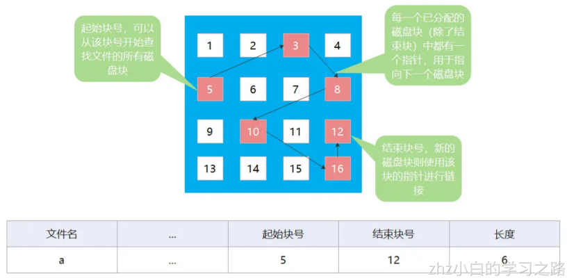
我们来思考一个问题，采用隐式链接如何将实现逻辑块号转换为物理块号呢？

用户给出需要访问的逻辑块号 i，操作系统需要找到所需访问文件的目录项 FCB。从目录项中可以知道文件的起始块号，然后将逻辑块号 0 的数据读入内存，由此知道 1 号逻辑块的物理块号，然后再读入 1 号逻辑块的数据进内存，此次类推，最终可以找到用户所需访问的逻辑块号 i。访问逻辑块号 i，总共需要 i + 1 次磁盘 I/O 操作。
得出结论：**隐式链接分配只能顺序访问，不支持随机访问，查找效率低。**

我们来思考另外一个问题，采用隐式链接是否方便文件拓展？
我们知道目录项中存有结束块号的物理地址，所以我们如果要拓展文件，只需要将新分配的磁盘块挂载到结束块号的后面即可，修改结束块号的指针指向新分配的磁盘块，然后修改目录项。
得出结论：**隐式链接分配很方便文件拓展。所有空闲磁盘块都可以被利用到，无碎片问题，存储利用率高。**

##### 显式链接
显示链接是把用于链接各个物理块的指针显式地存放在一张表中，该表称为文件分配表（FAT，File Allocation Table）。

由于查找记录的过程是在内存中进行的，因而不仅显著地**提高了检索速度**，而且**大大减少了访问磁盘的次数**。但也正是整个表都存放在内存中的关系，它的主要的缺点是**不适用于大磁盘**。

比如，对于 200GB 的磁盘和 1KB 大小的块，这张表需要有 2 亿项，每一项对应于这 2 亿个磁盘块中的一个块，每项如果需要 4 个字节，那这张表要占用 800MB 内存，很显然 FAT 方案对于大磁盘而言不太合适。

#### 索引分配
链表的方式解决了连续分配的磁盘碎片和文件动态扩展的问题，但是不能有效支持直接访问（FAT除外），索引的方式可以解决这个问题。

索引的实现是为每个文件创建一个「**索引数据块**」，里面存放的是**指向文件数据块的指针列表**，说白了就像书的目录一样，要找哪个章节的内容，看目录查就可以。

另外，**文件头需要包含指向「索引数据块」的指针**，这样就可以通过文件头知道索引数据块的位置，再通过索引数据块里的索引信息找到对应的数据块。

创建文件时，索引块的所有指针都设为空。当首次写入第 i 块时，先从空闲空间中取得一个块，再将其地址写到索引块的第 i 个条目。
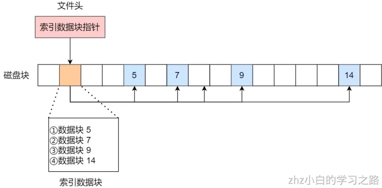
索引的方式优点在于：

- 文件的创建、增大、缩小很方便；
- 不会有碎片的问题；
- 支持顺序读写和随机读写；

由于索引数据也是存放在磁盘块的，如果文件很小，明明只需一块就可以存放的下，但还是需要额外分配一块来存放索引数据，所以缺陷之一就是存储索引带来的开销。

如果文件很大，大到一个索引数据块放不下索引信息，这时又要如何处理大文件的存放呢？我们可以通过组合的方式，来处理大文件的存。

先来看看链表 + 索引的组合，这种组合称为「**链式索引块**」，它的实现方式是**在索引数据块留出一个存放下一个索引数据块的指针**，于是当一个索引数据块的索引信息用完了，就可以通过指针的方式，找到下一个索引数据块的信息。那这种方式也会出现前面提到的链表方式的问题，万一某个指针损坏了，后面的数据也就会无法读取了。
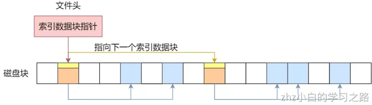
还有另外一种组合方式是索引 + 索引的方式，这种组合称为「**多级索引块**」，实现方式是**通过一个索引块来存放多个索引数据块**，一层套一层索引，像极了俄罗斯套娃是吧。

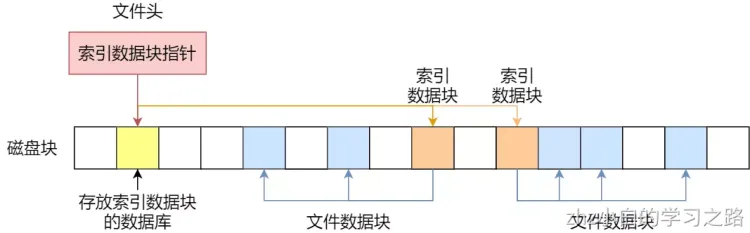
# 空闲空间的管理
前面说到的文件的存储是针对已经被占用的数据块组织和管理，接下来的问题是，如果我要保存一个数据块，我应该放在硬盘上的哪个位置呢？难道需要将所有的块扫描一遍，找个空的地方随便放吗？
那这种方式效率就太低了，所以针对磁盘的空闲空间也是要引入管理的机制，接下来介绍几种常见的方法：

- 空闲表法
- 空闲链表法
- 位图法
## 空闲表法
空闲表法就是为所有空闲空间建立一张表，表内容包括空闲区的第一个块号和该空闲区的块个数，注意，这个方式是连续分配的。如下图：
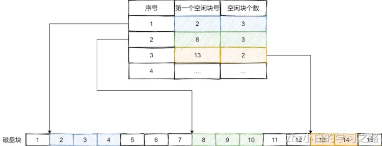
当请求分配磁盘空间时，系统依次扫描空闲表里的内容，直到找到一个合适的空闲区域为止。当用户撤销一个文件时，系统回收文件空间。这时，也需顺序扫描空闲表，寻找一个空闲表条目并将释放空间的第一个物理块号及它占用的块数填到这个条目中。

这种方法仅当有少量的空闲区时才有较好的效果。因为，如果存储空间中有着大量的小的空闲区，则空闲表变得很大，这样查询效率会很低。另外，这种分配技术适用于建立连续文件。

## 空闲链表法
我们也可以使用「链表」的方式来管理空闲空间，每一个空闲块里有一个指针指向下一个空闲块，这样也能很方便的找到空闲块并管理起来。如下图：
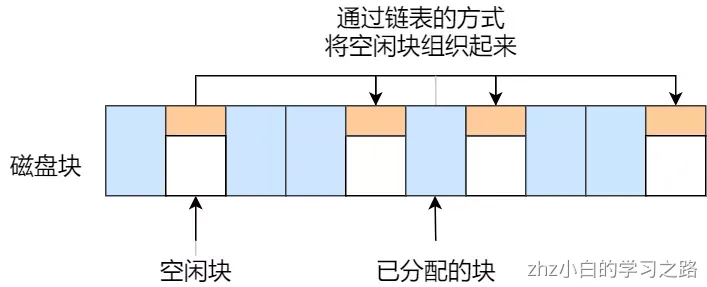
当创建文件需要一块或几块时，就从链头上依次取下一块或几块。反之，当回收空间时，把这些空闲块依次接到链头上。

这种技术只要在主存中保存一个指针，令它指向第一个空闲块。其特点是简单，但不能随机访问，工作效率低，因为每当在链上增加或移动空闲块时需要做很多 I/O 操作，同时数据块的指针消耗了一定的存储空间。

空闲表法和空闲链表法都不适合用于大型文件系统，因为这会使空闲表或空闲链表太大。
## 位图法
位图是利用二进制的一位来表示磁盘中一个盘块的使用情况，磁盘上所有的盘块都有一个二进制位与之对应。
当值为 0 时，表示对应的盘块空闲，值为 1 时，表示对应的盘块已分配。它形式如下：
```
1111110011111110001110110111111100111 ...
```
在 Linux 文件系统就采用了位图的方式来管理空闲空间，不仅用于数据空闲块的管理，还用于 inode 空闲块的管理，因为 inode 也是存储在磁盘的，自然也要有对其管理。

# 文件系统的结构
## 文件的存储
前面提到 Linux 是用位图的方式管理空闲空间，用户在创建一个新文件时，Linux 内核会通过 inode 的位图找到空闲可用的 inode，并进行分配。要存储数据时，会通过块的位图找到空闲的块，并分配，但仔细计算一下还是有问题的。

数据块的位图是放在磁盘块里的，假设是放在一个块里，一个块 4K，每位表示一个数据块，共可以表示 `4 * 1024 * 8 = 2^15` 个空闲块，由于 1 个数据块是 4K 大小，那么最大可以表示的空间为 `2^15 * 4 * 1024 = 2^27` 个 byte，也就是 128M。

也就是说按照上面的结构，如果采用「一个块的位图 + 一系列的块」，外加「一个块的 inode 的位图 + 一系列的 inode 的结构」能表示的最大空间也就 128M，这太少了，现在很多文件都比这个大。

在 Linux 文件系统，把这个结构称为一个**块组**，那么有 N 多的块组，就能够表示 N 大的文件。

最终，整个文件系统格式就是下面这个样子。
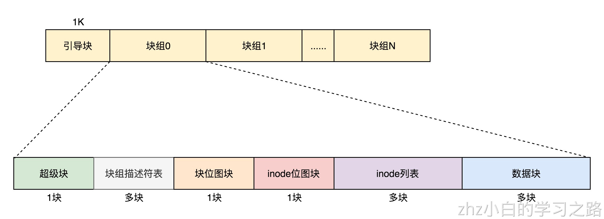
最前面的第一个块是引导块，在系统启动时用于启用引导，接着后面就是一个一个连续的块组了，块组的内容如下：

- _超级块_，包含的是文件系统的重要信息，比如 inode 总个数、块总个数、每个块组的 inode 个数、每个块组的块个数等等。
- _块组描述符_，包含文件系统中各个块组的状态，比如块组中空闲块和 inode 的数目等，每个块组都包含了文件系统中「所有块组的组描述符信息」。
- _数据位图和 inode 位图_， 用于表示对应的数据块或 inode 是空闲的，还是被使用中。
- _inode 列表_，包含了块组中所有的 inode，inode 用于保存文件系统中与各个文件和目录相关的所有元数据。
- _数据块_，包含文件的有用数据。

你可以会发现每个块组里有很多重复的信息，比如**超级块和块组描述符表，这两个都是全局信息，而且非常的重要**，这么做是有两个原因：

- 如果系统崩溃破坏了超级块或块组描述符，有关文件系统结构和内容的所有信息都会丢失。如果有冗余的副本，该信息是可能恢复的。
- 通过使文件和管理数据尽可能接近，减少了磁头寻道和旋转，这可以提高文件系统的性能。

不过，Ext2 的后续版本采用了稀疏技术。该做法是，超级块和块组描述符表不再存储到文件系统的每个块组中，而是只写入到块组 0、块组 1 和其他 ID 可以表示为 3、 5、7 的幂的块组中。

## 目录的存储
在前面，我们知道了一个普通文件是如何存储的，但还有一个特殊的文件，经常用到的目录，它是如何保存的呢？

基于 Linux 一切皆文件的设计思想，目录其实也是个文件，你甚至可以通过 `vim` 打开它，它也有 inode，inode 里面也是指向一些块。

和普通文件不同的是，**普通文件的块里面保存的是文件数据，而目录文件的块里面保存的是目录里面一项一项的文件信息。**

在目录文件的块中，最简单的保存格式就是**列表**，就是一项一项地将目录下的文件信息（如文件名、文件 inode、文件类型等）列在表里。

列表中每一项就代表该目录下的文件的文件名和对应的 inode，通过这个 inode，就可以找到真正的文件。
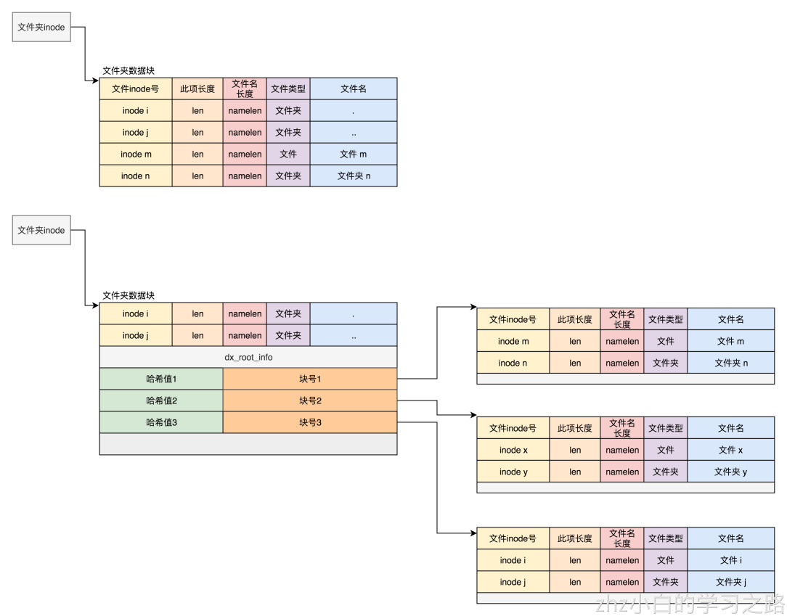
通常，第一项是「`.`」，表示当前目录，第二项是「`..`」，表示上一级目录，接下来就是一项一项的文件名和 inode。

如果一个目录有超级多的文件，我们要想在这个目录下找文件，按照列表一项一项的找，效率就不高了。

于是，保存目录的格式改成**哈希表**，对文件名进行哈希计算，把哈希值保存起来，如果我们要查找一个目录下面的文件名，可以通过名称取哈希。如果哈希能够匹配上，就说明这个文件的信息在相应的块里面。

Linux 系统的 ext 文件系统就是采用了哈希表，来保存目录的内容，这种方法的优点是查找非常迅速，插入和删除也较简单，不过需要一些预备措施来避免哈希冲突。

目录查询是通过在磁盘上反复搜索完成，需要不断地进行 I/O 操作，开销较大。所以，为了减少 I/O 操作，把当前使用的文件目录缓存在内存，以后要使用该文件时只要在内存中操作，从而降低了磁盘操作次数，提高了文件系统的访问速度。
