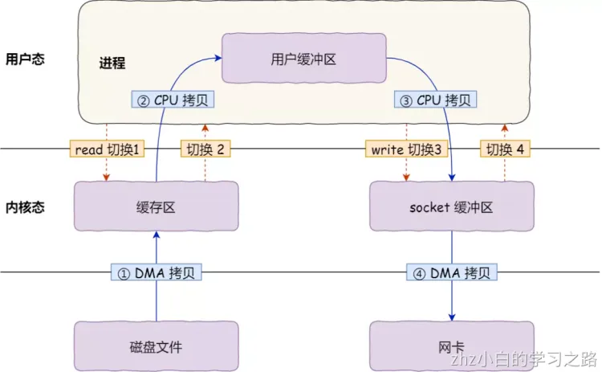
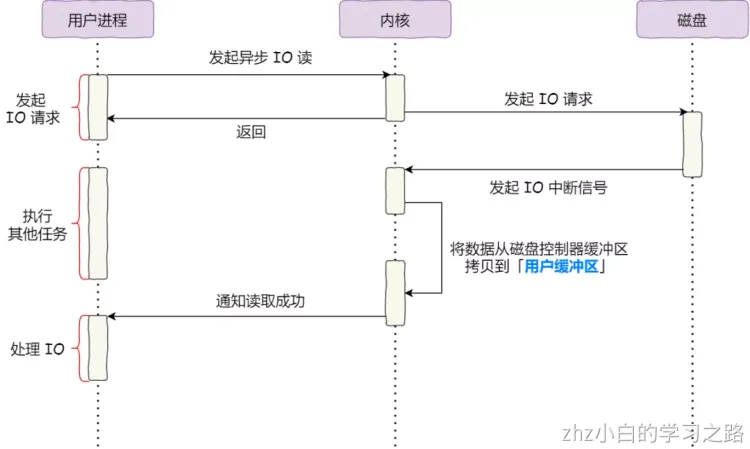

一台机器将自己想要表达的内容，按照某种约定好的格式发送出去，当另外一台机器收到这些信息后，也能够按照约定好的格式解析出来，从而准确、可靠地获得发送方想要表达的内容。这种约定好的格式就是**网络协议**（Networking Protocol）。

# 网络为什么要分层？
我们这里先构建一个相对简单的场景，之后几节内容，我们都要基于这个场景进行讲解。

我们假设这里就涉及三台机器。Linux 服务器 A 和 Linux 服务器 B 处于不同的网段，通过中间的 Linux 服务器作为路由器进行转发。


说到网络协议，我们还需要简要介绍一下两种网络协议模型，一种是**OSI 的标准七层模型**，一种是**业界标准的 TCP/IP 模型**。它们的对应关系如下图所示：

为什么网络要分层呢？因为网络环境过于复杂，不是一个能够集中控制的体系。全球数以亿记的服务器和设备各有各的体系，但是都可以通过同一套网络协议栈通过切分成多个层次和组合，来满足不同服务器和设备的通信需求。

我们这里简单介绍一下网络协议的几个层次。
我们从哪一个层次开始呢？从第三层，网络层开始，因为这一层有我们熟悉的 IP 地址。也因此，这一层我们也叫 IP 层。
我们通常看到的 IP 地址都是这个样子的：192.168.1.100/24。斜杠前面是 IP 地址，这个地址被点分隔为四个部分，每个部分 8 位，总共是 32 位。斜线后面 24 的意思是，32 位中，前 24 位是网络号，后 8 位是主机号。

为什么要这样分呢？我们可以想象，虽然全世界组成一张大的互联网，美国的网站你也能够访问的，但是这个网络不是一整个的。你们小区有一个网络，你们公司也有一个网络，联通、移动、电信运营商也各有各的网络，所以一个大网络是被分成个小的网络。

那如何区分这些网络呢？这就是网络号的概念。一个网络里面会有多个设备，这些设备的网络号一样，主机号不一样。不信你可以观察一下你家里的手机、电视、电脑。

连接到网络上的每一个设备都至少有一个 IP 地址，用于定位这个设备。无论是近在咫尺的你旁边同学的电脑，还是远在天边的电商网站，都可以通过 IP 地址进行定位。因此，**IP 地址类似互联网上的邮寄地址，是有全局定位功能的**。

就算你要访问美国的一个地址，也可以从你身边的网络出发，通过不断的打听道儿，经过多个网络，最终到达目的地址，和快递员送包裹的过程差不多。打听道儿的协议也在第三层，称为路由协议（Routing protocol），将网络包从一个网络转发给另一个网络的设备称为路由器。

总而言之，第三层干的事情，就是网络包从一个起始的 IP 地址，沿着路由协议指的道儿，经过多个网络，通过多次路由器转发，到达目标 IP 地址。

从第三层，我们往下看，第二层是数据链路层。有时候我们简称为二层或者 MAC 层。所谓 MAC，就是每个网卡都有的唯一的硬件地址（不绝对唯一，相对大概率唯一即可）。这虽然也是一个地址，但是这个地址是没有全局定位功能的。

就像给你送外卖的小哥，不可能根据手机尾号找到你家，但是手机尾号有本地定位功能的，只不过这个定位主要靠“吼”。外卖小哥到了你的楼层就开始大喊：“尾号 xxxx 的，你外卖到了！”
MAC 地址的定位功能局限在一个网络里面，也即同一个网络号下的 IP 地址之间，可以通过 MAC 进行定位和通信。从 IP 地址获取 MAC 地址要通过 ARP 协议，是通过在本地发送广播包，也就是“吼”，获得的 MAC 地址。

由于同一个网络内的机器数量有限，通过 MAC 地址的好处就是简单。匹配上 MAC 地址就接收，匹配不上就不接收，没有什么所谓路由协议这样复杂的协议。当然坏处就是，MAC 地址的作用范围不能出本地网络，所以一旦跨网络通信，虽然 IP 地址保持不变，但是 MAC 地址每经过一个路由器就要换一次。

我们看前面的图。服务器 A 发送网络包给服务器 B，原 IP 地址始终是 192.168.1.100，目标 IP 地址始终是 192.168.2.100，但是在网络 1 里面，原 MAC 地址是 MAC1，目标 MAC 地址是路由器的 MAC2，路由器转发之后，原 MAC 地址是路由器的 MAC3，目标 MAC 地址是 MAC4。

所以第二层干的事情，就是网络包在本地网络中的服务器之间定位及通信的机制。


我们再往下看，第一层，物理层，这一层就是物理设备。例如连着电脑的网线，我们能连上的 WiFi

从第三层往上看，第四层是传输层，这里面有两个著名的协议 TCP 和 UDP。尤其是 TCP，更是广泛使用，在 IP 层的代码逻辑中，仅仅负责数据从一个 IP 地址发送给另一个 IP 地址，丢包、乱序、重传、拥塞，这些 IP 层都不管。处理这些问题的代码逻辑写在了传输层的 TCP 协议里面。
我们常称，TCP 是可靠传输协议，也是难为它了。因为从第一层到第三层都不可靠，网络包说丢就丢，是 TCP 这一层通过各种编号、重传等机制，让本来不可靠的网络对于更上层来讲，变得“看起来”可靠。哪有什么应用层岁月静好，只不过 TCP 层帮你负重前行。

传输层再往上就是应用层，例如咱们在浏览器里面输入的 HTTP，Java 服务端写的 Servlet，都是这一层的。

二层到四层都是在 Linux 内核里面处理的，应用层例如浏览器、Nginx、Tomcat 都是用户态的。内核里面对于网络包的处理是不区分应用的。

从四层再往上，就需要区分网络包发给哪个应用。在传输层的 TCP 和 UDP 协议里面，都有端口的概念，不同的应用监听不同的端口。例如，服务端 Nginx 监听 80、Tomcat 监听 8080；再如客户端浏览器监听一个随机端口，FTP 客户端监听另外一个随机端口。

应用层和内核互通的机制，就是通过 Socket 系统调用。所以经常有人会问，Socket 属于哪一层，其实它哪一层都不属于，它属于操作系统的概念，而非网络协议分层的概念。只不过操作系统选择对于网络协议的实现模式是，二到四层的处理代码在内核里面，七层的处理代码让应用自己去做，两者需要跨内核态和用户态通信，就需要一个系统调用完成这个衔接，这就是 Socket。

# 发送数据包
网络分完层之后，对于数据包的发送，就是层层封装的过程。

就像下面的图中展示的一样，在 Linux 服务器 B 上部署的服务端 Nginx 和 Tomcat，都是通过 Socket 监听 80 和 8080 端口。这个时候，内核的数据结构就知道了。如果遇到发送到这两个端口的，就发送给这两个进程。

在 Linux 服务器 A 上的客户端，打开一个 Firefox 连接 Ngnix。也是通过 Socket，客户端会被分配一个随机端口 12345。同理，打开一个 Chrome 连接 Tomcat，同样通过 Socket 分配随机端口 12346。

在客户端浏览器，我们将请求封装为 HTTP 协议，通过 Socket 发送到内核。内核的网络协议栈里面，在 TCP 层创建用于维护连接、序列号、重传、拥塞控制的数据结构，将 HTTP 包加上 TCP 头，发送给 IP 层，IP 层加上 IP 头，发送给 MAC 层，MAC 层加上 MAC 头，从硬件网卡发出去。

网络包会先到达网络 1 的交换机。我们常称交换机为二层设备，这是因为，交换机只会处理到第二层，然后它会将网络包的 MAC 头拿下来，发现目标 MAC 是在自己右面的网口，于是就从这个网口发出去。

网络包会到达中间的 Linux 路由器，它左面的网卡会收到网络包，发现 MAC 地址匹配，就交给 IP 层，在 IP 层根据 IP 头中的信息，在路由表中查找。下一跳在哪里，应该从哪个网口发出去？在这个例子中，最终会从右面的网口发出去。我们常把路由器称为三层设备，因为它只会处理到第三层。

从路由器右面的网口发出去的包会到网络 2 的交换机，还是会经历一次二层的处理，转发到交换机右面的网口。

最终网络包会被转发到 Linux 服务器 B，它发现 MAC 地址匹配，就将 MAC 头取下来，交给上一层。IP 层发现 IP 地址匹配，将 IP 头取下来，交给上一层。TCP 层会根据 TCP 头中的序列号等信息，发现它是一个正确的网络包，就会将网络包缓存起来，等待应用层的读取。

应用层通过 Socket 监听某个端口，因而读取的时候，内核会根据 TCP 头中的端口号，将网络包发给相应的应用。

HTTP 层的头和正文，是应用层来解析的。通过解析，应用层知道了客户端的请求，例如购买一个商品，还是请求一个网页。当应用层处理完 HTTP 的请求，会将结果仍然封装为 HTTP 的网络包，通过 Socket 接口，发送给内核。

内核会经过层层封装，从物理网口发送出去，经过网络 2 的交换机，Linux 路由器到达网络 1，经过网络 1 的交换机，到达 Linux 服务器 A。在 Linux 服务器 A 上，经过层层解封装，通过 socket 接口，根据客户端的随机端口号，发送给客户端的应用程序，浏览器。于是浏览器就能够显示出一个绚丽多彩的页面了。

即便在如此简单的一个环境中，网络包的发送过程，竟然如此的复杂。

# 零拷贝
## 为什么要有DMA技术
在没有 DMA 技术前，I/O 的过程是这样的：

- CPU 发出对应的指令给磁盘控制器，然后返回；
- 磁盘控制器收到指令后，于是就开始准备数据，会把数据放入到磁盘控制器的内部缓冲区中，然后产生一个**中断**；
- CPU 收到中断信号后，停下手头的工作，接着把磁盘控制器的缓冲区的数据一次一个字节地读进自己的寄存器，然后再把寄存器里的数据写入到内存，而在数据传输的期间 CPU 是无法执行其他任务的。

为了方便你理解，我画了一副图：


可以看到，整个数据的传输过程，都要需要 CPU 亲自参与搬运数据的过程，而且这个过程，CPU 是不能做其他事情的。

简单的搬运几个字符数据那没问题，但是如果我们用千兆网卡或者硬盘传输大量数据的时候，都用 CPU 来搬运的话，肯定忙不过来。

计算机科学家们发现了事情的严重性后，于是就发明了 DMA 技术，也就是**直接内存访问（_Direct Memory Access_）** 技术。

什么是 DMA 技术？简单理解就是，**在进行 I/O 设备和内存的数据传输的时候，数据搬运的工作全部交给 DMA 控制器，而 CPU 不再参与任何与数据搬运相关的事情，这样 CPU 就可以去处理别的事务**。

那使用 DMA 控制器进行数据传输的过程究竟是什么样的呢？下面我们来具体看看。


具体过程：

- 用户进程调用 read 方法，向操作系统发出 I/O 请求，请求读取数据到自己的内存缓冲区中，进程进入阻塞状态；
- 操作系统收到请求后，进一步将 I/O 请求发送 DMA，然后让 CPU 执行其他任务；
- DMA 进一步将 I/O 请求发送给磁盘；
- 磁盘收到 DMA 的 I/O 请求，把数据从磁盘读取到磁盘控制器的缓冲区中，当磁盘控制器的缓冲区被读满后，向 DMA 发起中断信号，告知自己缓冲区已满；
- **DMA 收到磁盘的信号，将磁盘控制器缓冲区中的数据拷贝到内核缓冲区中，此时不占用 CPU，CPU 可以执行其他任务**；
- 当 DMA 读取了足够多的数据，就会发送中断信号给 CPU；
- CPU 收到 DMA 的信号，知道数据已经准备好，于是将数据从内核拷贝到用户空间，系统调用返回；

可以看到， 整个数据传输的过程，CPU 不再参与数据搬运的工作，而是全程由 DMA 完成，但是 CPU 在这个过程中也是必不可少的，因为传输什么数据，从哪里传输到哪里，都需要 CPU 来告诉 DMA 控制器。
早期 DMA 只存在在主板上，如今由于 I/O 设备越来越多，数据传输的需求也不尽相同，所以每个 I/O 设备里面都有自己的 DMA 控制器。

## 传统的文件传输有多糟糕？
如果服务端要提供文件传输的功能，我们能想到的最简单的方式是：将磁盘上的文件读取出来，然后通过网络协议发送给客户端。
传统 I/O 的工作方式是，数据读取和写入是从用户空间到内核空间来回复制，而内核空间的数据是通过操作系统层面的 I/O 接口从磁盘读取或写入。
代码通常如下，一般会需要两个系统调用：
```shell
read(file, tmp_buf, len);
write(socket, tmp_buf, len);
```
代码很简单，虽然就两行代码，但是这里面发生了不少的事情。

首先，期间共**发生了 4 次用户态与内核态的上下文切换**，因为发生了两次系统调用，一次是 `read()` ，一次是 `write()`，每次系统调用都得先从用户态切换到内核态，等内核完成任务后，再从内核态切换回用户态。

上下文切换到成本并不小，一次切换需要耗时几十纳秒到几微秒，虽然时间看上去很短，但是在高并发的场景下，这类时间容易被累积和放大，从而影响系统的性能。

其次，还**发生了 4 次数据拷贝**，其中两次是 DMA 的拷贝，另外两次则是通过 CPU 拷贝的，下面说一下这个过程：

- _第一次拷贝_，把磁盘上的数据拷贝到操作系统内核的缓冲区里，这个拷贝的过程是通过 DMA 搬运的。
- _第二次拷贝_，把内核缓冲区的数据拷贝到用户的缓冲区里，于是我们应用程序就可以使用这部分数据了，这个拷贝到过程是由 CPU 完成的。
- _第三次拷贝_，把刚才拷贝到用户的缓冲区里的数据，再拷贝到内核的 socket 的缓冲区里，这个过程依然还是由 CPU 搬运的。
- _第四次拷贝_，把内核的 socket 缓冲区里的数据，拷贝到网卡的缓冲区里，这个过程又是由 DMA 搬运的。

我们回过头看这个文件传输的过程，我们只是搬运一份数据，结果却搬运了 4 次，过多的数据拷贝无疑会消耗 CPU 资源，大大降低了系统性能。

这种简单又传统的文件传输方式，存在冗余的上文切换和数据拷贝，在高并发系统里是非常糟糕的，多了很多不必要的开销，会严重影响系统性能。

所以，**要想提高文件传输的性能，就需要减少「用户态与内核态的上下文切换」和「内存拷贝」的次数**。

## 如何优化文件传输的性能？
先来看看，如何减少「用户态与内核态的上下文切换」的次数呢？
读取磁盘数据的时候，之所以要发生上下文切换，这是因为用户空间没有权限操作磁盘或网卡，内核的权限最高，这些操作设备的过程都需要交由操作系统内核来完成，所以一般要通过内核去完成某些任务的时候，就需要使用操作系统提供的系统调用函数。

而一次系统调用必然会发生 2 次上下文切换：首先从用户态切换到内核态，当内核执行完任务后，再切换回用户态交由进程代码执行。

所以，**要想减少上下文切换到次数，就要减少系统调用的次数**。

再来看看，如何减少「数据拷贝」的次数？
在前面我们知道了，传统的文件传输方式会历经 4 次数据拷贝，而且这里面，「从内核的读缓冲区拷贝到用户的缓冲区里，再从用户的缓冲区里拷贝到 socket 的缓冲区里」，这个过程是没有必要的。

因为文件传输的应用场景中，在用户空间我们并不会对数据「再加工」，所以数据实际上可以不用搬运到用户空间，因此**用户的缓冲区是没有必要存在的**。

## 如何实现零拷贝
零拷贝技术实现的方式通常有 2 种：

- mmap + write
- sendfile

下面就谈一谈，它们是如何减少「上下文切换」和「数据拷贝」的次数。
#### mmap + write
在前面我们知道，`read()` 系统调用的过程中会把内核缓冲区的数据拷贝到用户的缓冲区里，于是为了减少这一步开销，我们可以用 `mmap()` 替换 `read()` 系统调用函数。
```shell
buf = mmap(file, len);
write(sockfd, buf, len);
```
`mmap()` 系统调用函数会直接把内核缓冲区里的数据「**映射**」到用户空间，这样，操作系统内核与用户空间就不需要再进行任何的数据拷贝操作。

具体过程如下：

- 应用进程调用了 `mmap()` 后，DMA 会把磁盘的数据拷贝到内核的缓冲区里。接着，应用进程跟操作系统内核「共享」这个缓冲区；
- 应用进程再调用 `write()`，操作系统直接将内核缓冲区的数据拷贝到 socket 缓冲区中，这一切都发生在内核态，由 CPU 来搬运数据；
- 最后，把内核的 socket 缓冲区里的数据，拷贝到网卡的缓冲区里，这个过程是由 DMA 搬运的。

我们可以得知，通过使用 `mmap()` 来代替 `read()`， 可以减少一次数据拷贝的过程。
但这还不是最理想的零拷贝，因为仍然需要通过 CPU 把内核缓冲区的数据拷贝到 socket 缓冲区里，而且仍然需要 4 次上下文切换，因为系统调用还是 2 次。

#### sendfile
在 Linux 内核版本 2.1 中，提供了一个专门发送文件的系统调用函数 `sendfile()`，函数形式如下：
```shell
#include <sys/socket.h>
ssize_t sendfile(int out_fd, int in_fd, off_t *offset, size_t count);	
```
它的前两个参数分别是目的端和源端的文件描述符，后面两个参数是源端的偏移量和复制数据的长度，返回值是实际复制数据的长度。

首先，它可以替代前面的 `read()` 和 `write()` 这两个系统调用，这样就可以减少一次系统调用，也就减少了 2 次上下文切换的开销。

其次，该系统调用，可以直接把内核缓冲区里的数据拷贝到 socket 缓冲区里，不再拷贝到用户态，这样就只有 2 次上下文切换，和 3 次数据拷贝。如下图：

但是这还不是真正的零拷贝技术，如果网卡支持 SG-DMA（_The Scatter-Gather Direct Memory Access_）技术（和普通的 DMA 有所不同），我们可以进一步减少通过 CPU 把内核缓冲区里的数据拷贝到 socket 缓冲区的过程。

你可以在你的 Linux 系统通过下面这个命令，查看网卡是否支持 scatter-gather 特性：
```shell
$ ethtool -k eth0 | grep scatter-gather
scatter-gather: on
```
于是，从 Linux 内核 `2.4` 版本开始起，对于支持网卡支持 SG-DMA 技术的情况下， `sendfile()` 系统调用的过程发生了点变化，具体过程如下：

- 第一步，通过 DMA 将磁盘上的数据拷贝到内核缓冲区里；
- 第二步，缓冲区描述符和数据长度传到 socket 缓冲区，这样网卡的 SG-DMA 控制器就可以直接将内核缓存中的数据拷贝到网卡的缓冲区里，此过程不需要将数据从操作系统内核缓冲区拷贝到 socket 缓冲区中，这样就减少了一次数据拷贝；

所以，这个过程之中，只进行了 2 次数据拷贝，如下图：

这就是所谓的**零拷贝（_Zero-copy_）技术，因为我们没有在内存层面去拷贝数据，也就是说全程没有通过 CPU 来搬运数据，所有的数据都是通过 DMA 来进行传输的。**

零拷贝技术的文件传输方式相比传统文件传输的方式，减少了 2 次上下文切换和数据拷贝次数，**只需要 2 次上下文切换和数据拷贝次数，就可以完成文件的传输，而且 2 次的数据拷贝过程，都不需要通过 CPU，2 次都是由 DMA 来搬运。**

所以，总体来看，**零拷贝技术可以把文件传输的性能提高至少一倍以上**。

# PageCache有什么作用？
回顾前面说道文件传输过程，其中第一步都是先需要先把磁盘文件数据拷贝「内核缓冲区」里，这个「内核缓冲区」实际上是**磁盘高速缓存（_PageCache_）**。

由于零拷贝使用了 PageCache 技术，可以使得零拷贝进一步提升了性能，我们接下来看看 PageCache 是如何做到这一点的。

读写磁盘相比读写内存的速度慢太多了，所以我们应该想办法把「读写磁盘」替换成「读写内存」。于是，我们会通过 DMA 把磁盘里的数据搬运到内存里，这样就可以用读内存替换读磁盘。
但是，内存空间远比磁盘要小，内存注定只能拷贝磁盘里的一小部分数据。

那问题来了，选择哪些磁盘数据拷贝到内存呢？

我们都知道程序运行的时候，具有「局部性」，所以通常，刚被访问的数据在短时间内再次被访问的概率很高，于是我们可以用 **PageCache 来缓存最近被访问的数据**，当空间不足时淘汰最久未被访问的缓存。

所以，读磁盘数据的时候，优先在 PageCache 找，如果数据存在则可以直接返回；如果没有，则从磁盘中读取，然后缓存 PageCache 中。

还有一点，读取磁盘数据的时候，需要找到数据所在的位置，但是对于机械磁盘来说，就是通过磁头旋转到数据所在的扇区，再开始「顺序」读取数据，但是旋转磁头这个物理动作是非常耗时的，为了降低它的影响，**PageCache 使用了「预读功能」**。

比如，假设 read 方法每次只会读 `32 KB` 的字节，虽然 read 刚开始只会读 0 ～ 32 KB 的字节，但内核会把其后面的 32～64 KB 也读取到 PageCache，这样后面读取 32～64 KB 的成本就很低，如果在 32～64 KB 淘汰出 PageCache 前，进程读取到它了，收益就非常大。

所以，PageCache 的优点主要是两个：

- 缓存最近被访问的数据；
- 预读功能；

这两个做法，将大大提高读写磁盘的性能。

**但是，在传输大文件（GB 级别的文件）的时候，PageCache 会不起作用，那就白白浪费 DMA 多做的一次数据拷贝，造成性能的降低，即使使用了 PageCache 的零拷贝也会损失性能**

这是因为如果你有很多 GB 级别文件需要传输，每当用户访问这些大文件的时候，内核就会把它们载入 PageCache 中，于是 PageCache 空间很快被这些大文件占满。

另外，由于文件太大，可能某些部分的文件数据被再次访问的概率比较低，这样就会带来 2 个问题：

- PageCache 由于长时间被大文件占据，其他「热点」的小文件可能就无法充分使用到 PageCache，于是这样磁盘读写的性能就会下降了；
- PageCache 中的大文件数据，由于没有享受到缓存带来的好处，但却耗费 DMA 多拷贝到 PageCache 一次；

所以，针对大文件的传输，不应该使用 PageCache，也就是说不应该使用零拷贝技术，因为可能由于 PageCache 被大文件占据，而导致「热点」小文件无法利用到 PageCache，这样在高并发的环境下，会带来严重的性能问题。

# 大文件传输用什么方式实现？
那针对大文件的传输，我们应该使用什么方式呢？

我们先来看看最初的例子，当调用 read 方法读取文件时，进程实际上会阻塞在 read 方法调用，因为要等待磁盘数据的返回，如下图：

具体过程：

- 当调用 read 方法时，会阻塞着，此时内核会向磁盘发起 I/O 请求，磁盘收到请求后，便会寻址，当磁盘数据准备好后，就会向内核发起 I/O 中断，告知内核磁盘数据已经准备好；
- 内核收到 I/O 中断后，就将数据从磁盘控制器缓冲区拷贝到 PageCache 里；
- 最后，内核再把 PageCache 中的数据拷贝到用户缓冲区，于是 read 调用就正常返回了。

对于阻塞的问题，可以用异步 I/O 来解决，它工作方式如下图：

它把读操作分为两部分：


- 前半部分，内核向磁盘发起读请求，但是可以**不等待数据就位就可以返回**，于是进程此时可以处理其他任务；
- 后半部分，当内核将磁盘中的数据拷贝到进程缓冲区后，进程将接收到内核的**通知**，再去处理数据；

而且，我们可以发现，异步 I/O 并没有涉及到 PageCache，所以使用异步 I/O 就意味着要绕开 PageCache。

绕开 PageCache 的 I/O 叫直接 I/O，使用 PageCache 的 I/O 则叫缓存 I/O。通常，对于磁盘，异步 I/O 只支持直接 I/O。

前面也提到，大文件的传输不应该使用 PageCache，因为可能由于 PageCache 被大文件占据，而导致「热点」小文件无法利用到 PageCache。

于是，**在高并发的场景下，针对大文件的传输的方式，应该使用「异步 I/O + 直接 I/O」来替代零拷贝技术**。

直接 I/O 应用场景常见的两种：

- 应用程序已经实现了磁盘数据的缓存，那么可以不需要 PageCache 再次缓存，减少额外的性能损耗。在 MySQL 数据库中，可以通过参数设置开启直接 I/O，默认是不开启；
- 传输大文件的时候，由于大文件难以命中 PageCache 缓存，而且会占满 PageCache 导致「热点」文件无法充分利用缓存，从而增大了性能开销，因此，这时应该使用直接 I/O。

另外，由于直接 I/O 绕过了 PageCache，就无法享受内核的这两点的优化：

- 内核的 I/O 调度算法会缓存尽可能多的 I/O 请求在 PageCache 中，最后「**合并**」成一个更大的 I/O 请求再发给磁盘，这样做是为了减少磁盘的寻址操作；
- 内核也会「**预读**」后续的 I/O 请求放在 PageCache 中，一样是为了减少对磁盘的操作；

于是，传输大文件的时候，使用「异步 I/O + 直接 I/O」了，就可以无阻塞地读取文件了。

所以，传输文件的时候，我们要根据文件的大小来使用不同的方式：

- 传输大文件的时候，使用「异步 I/O + 直接 I/O」；
- 传输小文件的时候，则使用「零拷贝技术」；

在 Nginx 中，我们可以用如下配置，来根据文件的大小来使用不同的方式：
```
location /video/ { 
    sendfile on; 
    aio on; 
    directio 1024m; 
}
```
当文件大小大于 `directio` 值后，使用「异步 I/O + 直接 I/O」，否则使用「零拷贝技术」。
