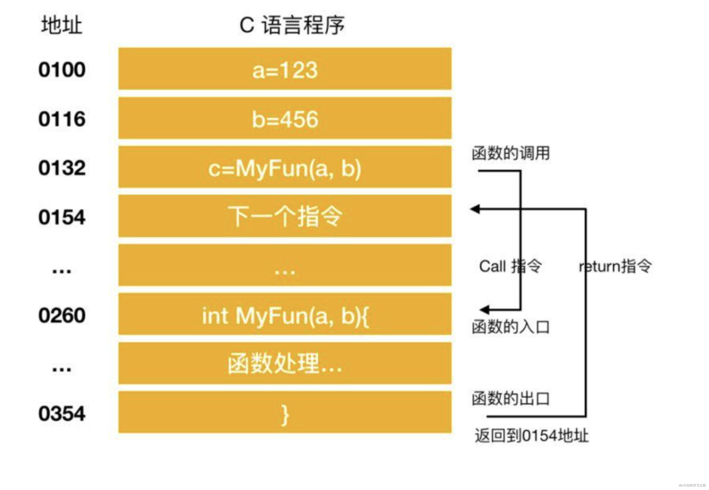
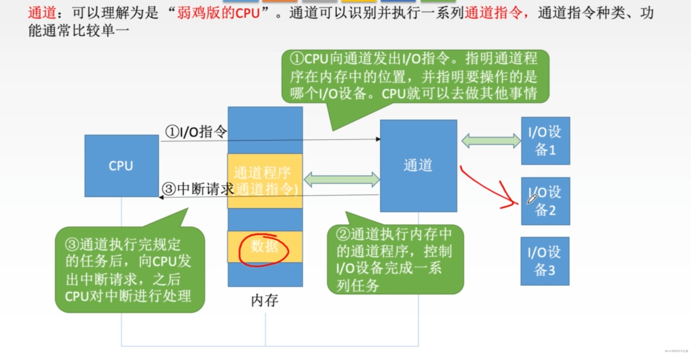

# 计算机指令
如果我们从**软件**工程师的角度来讲，CPU 就是一个执行各种**计算机指令**（Instruction Code）的逻辑机器。这里的计算机指令，就好比一门 CPU 能够听得懂的语言，我们也可以把它叫作**机器语言**（Machine Language）。
不同的 CPU 能够听懂的语言不太一样。比如，我们的个人电脑用的是 Intel 的 CPU，苹果手机用的是 ARM 的 CPU。这两者能听懂的语言就不太一样。类似这样两种 CPU 各自支持的语言，就是两组不同的**计算机指令集**，英文叫 Instruction Set。这里面的“Set”，其实就是数学上的集合，代表不同的单词、语法。

不同的 CPU 有不同的指令集，也就对应着不同的汇编语言和不同的机器码。为了方便你快速理解这个机器码的计算方式，我们选用最简单的 MIPS 指令集，来看看机器码是如何生成的。
MIPS 是一组由 MIPS 技术公司在 80 年代中期设计出来的 CPU 指令集。就在最近，MIPS 公司把整个指令集和芯片架构都完全开源了。

MIPS 的指令是一个 32 位的整数，高 6 位叫**操作码**（Opcode），也就是代表这条指令具体是一条什么样的指令，剩下的 26 位有三种格式，分别是 R、I 和 J。

**R 指令**是一般用来做算术和逻辑操作，里面有读取和写入数据的寄存器的地址。如果是逻辑位移操作，后面还有位移操作的位移量，而最后的功能码，则是在前面的操作码不够的时候，扩展操作码表示对应的具体指令的。

**I 指令**，则通常是用在数据传输、条件分支，以及在运算的时候使用的并非变量还是常数的时候。这个时候，没有了位移量和操作码，也没有了第三个寄存器，而是把这三部分直接合并成了一个地址值或者一个常数。

**J 指令**就是一个跳转指令，高 6 位之外的 26 位都是一个跳转后的地址。

// test.c int main() {   int a = 1;    int b = 2;   a = a + b; }
要让这段在一个 Linux 操作系统上跑起来，我们需要把整个程序翻译成一个**汇编语言**（ASM，Assembly Language）的程序，这个过程我们一般叫编译（Compile）成汇编代码。
针对汇编代码，我们可以再用汇编器（Assembler）翻译成机器码（Machine Code）。这些机器码由“0”和“1”组成的机器语言表示。这一条条机器码，就是一条条的**计算机指令**。这样一串串的 16 进制数字，就是我们 CPU 能够真正认识的计算机指令。

因为汇编代码其实就是“给程序员看的机器码”，也正因为这样，机器码和汇编代码是一一对应的。我们人类很容易记住 add、mov 这些用英文表示的指令，而 8b 45 f8 这样的指令，由于很难一下子看明白是在干什么，所以会非常难以记忆。

从高级语言到汇编代码，再到机器码，就是一个日常开发程序，最终变成了 CPU 可以执行的计算机指令的过程。
# CPU如何执行指令
## CPU 内部处理过程
下图展示了一般程序的运行流程（以 C 语言为例），可以说了解程序的运行流程是掌握程序运行机制的基础和前提。

在这个流程中，CPU 负责的就是解释和运行最终转换成机器语言的内容。
CPU 主要由两部分构成：控制单元 和 算术逻辑单元（ALU）

- 控制单元：从内存中提取指令并解码执行
- 算数逻辑单元（ALU）：处理算数和逻辑运算

CPU 是计算机的心脏和大脑，它和内存都是由许多晶体管组成的电子部件。它接收数据输入，执行指令并处理信息。它与输入/输出（I / O）设备进行通信，这些设备向 CPU 发送数据和从 CPU 接收数据。
从功能来看，CPU 的内部由**寄存器、控制器、运算器和时钟**四部分组成，各部分之间通过电信号连通。

- 寄存器是中央处理器内的组成部分。它们可以用来暂存指令、数据和地址。可以将其看作是内存的一种。根据种类的不同，一个 CPU 内部会有 20 – 100个寄存器。
- 控制器负责把内存上的指令、数据读入寄存器，并根据指令的结果控制计算机
- 运算器负责运算从内存中读入寄存器的数据
- 时钟 负责发出 CPU 开始计时的时钟信号

也可以说它包括三个部分，运算单元、数据单元和控制单元。
**运算单元**只管算，例如做加法、做位移等等。但是，它不知道应该算哪些数据，运算结果应该放在哪里。
运算单元计算的数据如果每次都要经过总线，到内存里面现拿，这样就太慢了，所以就有了**数据单元**。数据单元包括 **CPU 内部的缓存和寄存器组**，空间很小，但是速度飞快，可以暂时存放数据和运算结果。
有了放数据的地方，也有了算的地方，还需要有个指挥到底做什么运算的地方，这就是**控制单元**。控制单元是一个统一的指挥中心，它可以获得下一条指令，然后执行这条指令。这个指令会指导运算单元取出数据单元中的某几个数据，计算出个结果，然后放在数据单元的某个地方。

CPU 的控制单元里面，有一个**指令指针寄存器**，它里面存放的是下一条指令在内存中的地址。控制单元会不停地将代码段的指令拿进来，先放入指令寄存器。
当前的指令分两部分，一部分是做什么操作，例如是加法还是位移；一部分是操作哪些数据。
要执行这条指令，就要把第一部分交给运算单元，第二部分交给数据单元。
数据单元根据数据的地址，从数据段里读到数据寄存器里，就可以参与运算了。运算单元做完运算，产生的结果会暂存在数据单元的数据寄存器里。最终，会有指令将数据写回内存中的数据段。

你可能会问，上面算来算去执行的都是进程 A 里的指令，那进程 B 呢？CPU 里有两个寄存器，专门保存当前处理进程的代码段的起始地址，以及数据段的起始地址。这里面写的都是进程 A，那当前执行的就是进程 A 的指令，等切换成进程 B，就会执行 B 的指令了，这个过程叫作**进程切换**（Process Switch）。
到这里，你会发现，CPU 和内存来来回回传数据，靠的都是总线。其实总线上主要有两类数据，一个是地址数据，也就是我想拿内存中哪个位置的数据，这类总线叫**地址总线**（Address Bus）；另一类是真正的数据，这类总线叫**数据总线**（Data Bus）。
地址总线的位数，决定了能访问的地址范围到底有多广。例如只有两位，那 CPU 就只能认 00，01，10，11 四个位置，超过四个位置，就区分不出来了。位数越多，能够访问的位置就越多，能管理的内存的范围也就越广。
而数据总线的位数，决定了一次能拿多少个数据进来。例如只有两位，那 CPU 一次只能从内存拿两位数。要想拿八位，就要拿四次。位数越多，一次拿的数据就越多，访问速度也就越快。

## CPU 是一系列寄存器的集合体

拿我们用的 Intel CPU 来说，里面差不多有几百亿个晶体管。我们先不管几百亿的晶体管的背后是怎么通过电路运转起来的，逻辑上，我们可以认为，CPU 其实就是由一堆寄存器组成的。而寄存器就是 CPU 内部，由多个触发器（Flip-Flop）或者锁存器（Latches）组成的简单电路。
触发器和锁存器，其实就是两种不同原理的数字电路组成的逻辑门。
一个 CPU 里面会有很多种不同功能的寄存器。我这里给你介绍三种比较特殊的。
一个是**PC 寄存器**（Program Counter Register），我们也叫**指令地址寄存器**（Instruction Address Register）。顾名思义，它就是用来存放下一条需要执行的计算机指令的内存地址。
第二个是**指令寄存器**（Instruction Register），用来存放当前正在执行的指令。
第三个是**条件码寄存器**（Status Register），用里面的一个一个标记位（Flag），存放 CPU 进行算术或者逻辑计算的结果。
除了这些特殊的寄存器，CPU 里面还有更多用来存储数据和内存地址的寄存器。这样的寄存器通常一类里面不止一个。我们通常根据存放的数据内容来给它们取名字，比如整数寄存器、浮点数寄存器、向量寄存器和地址寄存器等等。有些寄存器既可以存放数据，又能存放地址，我们就叫它通用寄存器。

## 程序计数器
程序计数器(Program Counter)是用来存储下一条指令所在单元的地址。
程序执行时，PC的初值为程序第一条指令的地址，在顺序执行程序时，控制器首先按程序计数器所指出的指令地址从内存中取出一条指令，然后分析和执行该指令，同时将PC的值加1指向下一条要执行的指令。
我们还是以一个事例为准来详细的看一下程序计数器的执行过程

这是一段进行相加的操作，程序启动，在经过编译解析后会由操作系统把硬盘中的程序复制到内存中，示例中的程序是将 123 和 456 执行相加操作，并将结果输出到显示器上。
地址 0100 是程序运行的起始位置。Windows 等操作系统把程序从硬盘复制到内存后，会将程序计数器作为设定为起始位置 0100，然后执行程序，每执行一条指令后，程序计数器的数值会增加1（或者直接指向下一条指令的地址），然后，CPU 就会根据程序计数器的数值，从内存中读取命令并执行，也就是说，**程序计数器控制着程序的流程**。

## 条件分支和循环机制
高级语言中的条件控制流程主要分为三种：顺序执行、条件分支、循环判断三种，顺序执行是按照地址的内容顺序的执行指令。条件分支是根据条件执行任意地址的指令。循环是重复执行同一地址的指令。

- 顺序执行的情况比较简单，每执行一条指令程序计数器的值就是 + 1。
- 条件和循环分支会使程序计数器的值指向任意的地址，这样一来，程序便可以返回到上一个地址来重复执行同一个指令，或者跳转到任意指令。

下面以条件分支为例来说明程序的执行过程（循环也很相似）

条件和循环分支会使用到 jump（跳转指令）
程序的开始过程和顺序流程是一样的，CPU 从0100处开始执行命令，在0100和0101都是顺序执行，PC 的值顺序+1，执行到0102地址的指令时，判断0106寄存器的数值大于0，跳转（jump）到0104地址的指令，将数值输出到显示器中，然后结束程序，0103 的指令被跳过了，这就和我们程序中的 if() 判断是一样的，在不满足条件的情况下，指令会直接跳过。所以 PC 的执行过程也就没有直接+1，而是下一条指令的地址。
## 函数调用机制
接下来，我们继续介绍函数调用机制，哪怕是高级语言编写的程序，函数调用处理也是通过把程序计数器的值设定成函数的存储地址来实现的。函数执行跳转指令后，必须进行返回处理，单纯的指令跳转没有意义，下面是一个实现函数跳转的例子

函数的调用和返回很重要的两个指令是 call 和 return 指令，再将函数的入口地址设定到程序计数器之前，call 指令会把调用函数后要执行的指令地址存储在名为栈的主存内。函数处理完毕后，再通过函数的出口来执行 return 指令。return 指令的功能是把保存在栈中的地址设定到程序计数器。MyFun 函数在被调用之前，0154 地址保存在栈中，MyFun 函数处理完成后，会把 0154 的地址保存在程序计数器中。
## CPU 指令执行过程
几乎所有的冯·诺伊曼型计算机的CPU，其工作都可以分为5个阶段：**取指令、指令译码、执行指令、访存取数、结果写回**。

- 取指令阶段是将内存中的指令读取到 CPU 中寄存器的过程，程序寄存器用于存储下一条指令所在的地址
- 指令译码阶段，在取指令完成后，立马进入指令译码阶段，在指令译码阶段，指令译码器按照预定的指令格式，对取回的指令进行拆分和解释，识别区分出不同的指令类别以及各种获取操作数的方法。
- 执行指令阶段，译码完成后，就需要执行这一条指令了，此阶段的任务是完成指令所规定的各种操作，具体实现指令的功能。
- 访问取数阶段，根据指令的需要，有可能需要从内存中提取数据，此阶段的任务是：根据指令地址码，得到操作数在主存中的地址，并从主存中读取该操作数用于运算。
- 结果写回阶段，作为最后一个阶段，结果写回（Write Back，WB）阶段把执行指令阶段的运行结果数据“写回”到某种存储形式：结果数据经常被写到CPU的内部寄存器中，以便被后续的指令快速地存取；
# 内存
CPU 和 内存就像是一堆不可分割的恋人一样，是无法拆散的一对儿，没有内存，CPU 无法执行程序指令，那么计算机也就失去了意义；只有内存，无法执行指令，那么计算机照样无法运行。
内存和 CPU 如何进行交互？下面就来介绍一下

## 内存的物理结构
在了解一个事物之前，你首先得先需要见过它，你才会有印象，才会有想要了解的兴趣，所以我们首先需要先看一下什么是内存以及它的物理结构是怎样的。

内存的内部是由各种 IC 电路组成的，它的种类很庞大，但是其主要分为三种存储器

- 随机存储器（RAM）：内存中最重要的一种，表示既可以从中读取数据，也可以写入数据。当机器关闭时，内存中的信息会 丢失。
- 只读存储器（ROM）：ROM 一般只能用于数据的读取，不能写入数据，但是当机器停电时，这些数据不会丢失。
- 高速缓存（Cache）：Cache 也是我们经常见到的，它分为一级缓存（L1 Cache）、二级缓存（L2 Cache）、三级缓存（L3 Cache）这些数据，它位于内存和 CPU 之间，是一个读写速度比内存更快的存储器。当 CPU 向内存写入数据时，这些数据也会被写入高速缓存中。当 CPU 需要读取数据时，会直接从高速缓存中直接读取，当然，如需要的数据在Cache中没有，CPU会再去读取内存中的数据。

内存 IC 是一个完整的结构，它内部也有电源、地址信号、数据信号、控制信号和用于寻址的 IC 引脚来进行数据的读写。下面是一个虚拟的 IC 引脚示意图

图中 VCC 和 GND 表示电源，A0 – A9 是地址信号的引脚，D0 – D7 表示的是控制信号、RD 和 WR 都是好控制信号，我用不同的颜色进行了区分，将电源连接到 VCC 和 GND 后，就可以对其他引脚传递 0 和 1 的信号，大多数情况下，**+5V 表示1，0V 表示 0**。

我们都知道内存是用来存储数据，那么这个内存 IC 中能存储多少数据呢？D0 – D7 表示的是数据信号，也就是说，一次可以输入输出 8 bit = 1 byte 的数据。A0 – A9 是地址信号共十个，表示可以指定 00000 00000 – 11111 11111 共 2 的 10次方 = 1024个地址。每个地址都会存放 1 byte 的数据，因此我们可以得出内存 IC 的容量就是 1 KB。

## 内存的读写过程
让我们把关注点放在内存 IC 对数据的读写过程上来吧！我们来看一个对内存IC 进行数据写入和读取的模型

来详细描述一下这个过程，假设我们要向内存 IC 中写入 1byte 的数据的话，它的过程是这样的：

- 首先给 VCC 接通 +5V 的电源，给 GND 接通 0V 的电源，使用 A0 - A9 来指定数据的存储场所，然后再把数据的值输入给 D0 - D7 的数据信号，并把 WR（write）的值置为 1，执行完这些操作后，即可以向内存 IC 写入数据
- 读出数据时，只需要通过 A0 – A9 的地址信号指定数据的存储场所，然后再将 RD 的值置为 1 即可。
- 图中的 RD 和 WR 又被称为控制信号。其中当WR 和 RD 都为 0 时，无法进行写入和读取操作。
## 内存的现实模型
为了便于记忆，我们把内存模型映射成为我们现实世界的模型，在现实世界中，内存的模型很想我们生活的楼房。在这个楼房中，1层可以存储一个字节的数据，楼层号就是地址，下面是内存和楼层整合的模型图

我们知道，程序中的数据不仅只有数值，还有数据类型的概念，从内存上来看，就是占用内存大小（占用楼层数）的意思。即使物理上强制以 1 个字节为单位来逐一读写数据的内存，在程序中，通过指定其数据类型，也能实现以特定字节数为单位来进行读写。
下面是一个以特定字节数为例来读写指令字节的程序的示例
// 定义变量 char a; short b; long c; // 变量赋值 a = 123; b = 123; c = 123;
我们分别声明了三个变量 a,b,c ，并给每个变量赋上了相同的 123，这三个变量表示内存的特定区域。通过变量，即使不指定物理地址，也可以直接完成读写操作，操作系统会自动为变量分配内存地址。
这三个变量分别表示 1 个字节长度的 char，2 个字节长度的 short，表示4 个字节的 long。因此，虽然数据都表示的是 123，但是其存储时所占的内存大小是不一样的。如下所示

这里的 123 都没有超过每个类型的最大长度，所以 short 和 long 类型为所占用的其他内存空间分配的数值是0，这里我们采用的是低字节序列的方式存储
低字节序列：将数据低位存储在内存低位地址。
高字节序列：将数据的高位存储在内存地位的方式称为高字节序列。

## 内存的使用
### 指针
指针是 C 语言非常重要的特征，指针也是一种变量，只不过它所表示的不是数据的值，而是内存的地址。通过使用指针，可以对任意内存地址的数据进行读写。
在了解指针读写的过程前，我们先需要了解如何定义一个指针，和普通的变量不同，在定义指针时，我们通常会在变量名前加一个 * 号。例如我们可以用指针定义如下的变量
char *d; // char类型的指针 d 定义 short *e; // short类型的指针 e 定义 long *f; // long类型的指针 f 定义
我们以32位计算机为例，32位计算机的内存地址是 4 字节，在这种情况下，指针的长度也是 32 位。然而，变量 d e f 却代表了不同的字节长度，这是为什么呢？

实际上，这些数据表示的是从内存中一次读取的字节数，比如 d e f 的值都为 100，那么使用 char 类型时就能够从内存中读写 1 byte 的数据，使用 short 类型就能够从内存读写 2 字节的数据， 使用 long 就能够读写 4 字节的数据，下面是一个完整的类型字节表

| 类型 | 32位 | 64位 |
| --- | --- | --- |
| char | 1 | 1 |
| short int | 2 | 2 |
| int | 4 | 4 |
| unsigned int | 4 | 4 |
| float | 4 | 4 |
| double | 8 | 8 |
| long | 4 | 8 |
| long long | 8 | 8 |
| unsigned long | 4 | 8 |

我们可以用图来描述一下这个读写过程

### 数组是内存的实现
数组是指多个相同的数据类型在内存中连续排列的一种形式。作为数组元素的各个数据会通过下标编号来区分，这个编号也叫做索引，如此一来，就可以对指定索引的元素进行读写操作。

首先先来认识一下数组，我们还是用 char、short、long 三种元素来定义数组，数组的元素用[value] 扩起来，里面的值代表的是数组的长度，就像下面的定义
char g[100]; short h[100]; long i[100];
数组定义的数据类型，也表示一次能够读写的内存大小，char 、short 、long 分别以 1 、2 、4 个字节为例进行内存的读写。

数组是内存的实现，数组和内存的物理结构完全一致，尤其是在读写1个字节的时候，当字节数超过 1 时，只能通过逐个字节来读取，下面是内存的读写过程

数组是我们学习的第一个数据结构，我们都知道数组的检索效率是比较快的，至于数组的检索效率为什么这么快并不是我们这篇文章讨论的重点。
# 磁盘
## 磁盘的物理结构
之前我们介绍了CPU、内存的物理结构，现在我们来介绍一下磁盘的物理结构。**磁盘的物理结构指的是磁盘存储数据的形式**。

一块机械硬盘是由盘面、磁头和悬臂三个部件组成的。

把磁盘表面分成若干个同心圆的空间就是 磁道，把磁道按照固定大小的存储空间划分而成的就是 扇区

扇区是对磁盘进行物理读写的最小单位。Windows 中使用的磁盘，一般是一个扇区 512 个字节。不过，Windows 在逻辑方面对磁盘进行读写的单位是扇区整数倍簇。根据磁盘容量不同功能，1簇可以是 512 字节（1 簇 = 1扇区）、1KB（1簇 = 2扇区）、2KB、4KB、8KB、16KB、32KB( 1 簇 = 64 扇区)。簇和扇区的大小是相等的。
硬盘的基本存储单位为扇区（Sector），每个扇区一般为512字节。一个硬盘往往有多个磁片，每面按照同心圆划分若干个磁道，每个磁道划分为若干个扇区。

通常，我们的一个盘面上会有两个磁头，分别在盘面的正反面。盘面在正反两面都有对应的磁性涂层来存储数据，而且一块硬盘也不是只有一个盘面，而是上下堆叠了很多个盘面，各个盘面之间是平行的。每个盘面的正反两面都有对应的磁头。

我们的数据并不能直接从盘面传输到总线上，而是通过磁头，从盘面上读取到，然后再通过电路信号传输给控制电路、接口，再到总线上的。
读取数据，其实就是两个步骤。一个步骤，就是把盘面旋转到某一个位置。在这个位置上，我们的悬臂可以定位到整个盘面的某一个子区间。这个子区间的形状有点儿像一块披萨饼，我们一般把这个区间叫作**几何扇区**（Geometrical Sector），意思是，在“几何位置上”，所有这些扇区都可以被悬臂访问到。另一个步骤，就是把我们的悬臂移动到特定磁道的特定扇区，也就在这个“几何扇区”里面，找到我们实际的扇区。找到之后，我们的磁头会落下，就可以读取到正对着扇区的数据。

## 磁盘缓存
我们上面提到，磁盘往往和内存是互利共生的关系，相互协作，彼此持有良好的合作关系。每次内存都需要从磁盘中读取数据，必然会读到相同的内容，所以一定会有一个角色负责存储我们经常需要读到的内容。我们大家做软件的时候经常会用到缓存技术，那么硬件层面也不例外，磁盘也有缓存，磁盘的缓存叫做磁盘缓存。

磁盘缓存指的是把从磁盘中读出的数据存储到内存的方式，这样一来，当接下来需要读取相同的内容时，就不会再通过实际的磁盘，而是通过磁盘缓存来读取。某一种技术或者框架的出现势必要解决某种问题的，那么磁盘缓存就大大**改善了磁盘访问的速度**。

## 虚拟内存
虚拟内存是内存和磁盘交互的第二个媒介。虚拟内存是指把磁盘的一部分作为假想内存来使用。这与磁盘缓存是假想的磁盘（实际上是内存）相对，虚拟内存是假想的内存（实际上是磁盘）。

虚拟内存是计算机系统内存管理的一种技术。它使得应用程序认为它拥有连续可用的内存（一个完整的地址空间），但是实际上，它通常被分割成多个物理碎片，还有部分存储在外部磁盘管理器上，必要时进行数据交换。

通过借助虚拟内存，在内存不足时仍然可以运行程序。例如，在只剩 5MB 内存空间的情况下仍然可以运行 10MB 的程序。由于 CPU 只能执行加载到内存中的程序，因此，虚拟内存的空间就需要和内存中的空间进行置换（swap），然后运行程序。

虚拟内存的方法有分页式 和 分段式 两种。Windows 采用的是分页式。该方式是指在不考虑程序构造的情况下，把运行的程序按照一定大小的页进行分割，并以页为单位进行置换。在分页式中，我们把磁盘的内容读到内存中称为 Page In，把内存的内容写入磁盘称为 Page Out。Windows 计算机的页大小为 4KB ，也就是说，需要把应用程序按照 4KB 的页来进行切分，以页（page）为单位放到磁盘中，然后进行置换。

为了实现内存功能，Windows 在磁盘上提供了虚拟内存使用的文件（page file，页文件）。该文件由 Windows 生成和管理，文件的大小和虚拟内存大小相同，通常大小是内存的 1 – 2 倍。

# 总线
计算机是由五大部件组成的：**运算器、存储器、控制器、输入设备和输出设备**，这个概念比较抽象，简单一点来说就是 CPU 包含运算器和控制器，存储器也就指的是内存，而输入输出设备分别指的是键盘和显示器。计算机这几个部件之间是需要共同协作完成信息处理的，那么，这几大部件之间如何进行通信呢？靠的是总线
现代的 Intel CPU 的体系结构里面，通常有好几条总线。

首先，CPU 和内存以及高速缓存通信的总线，这里面通常有两种总线。这种方式，我们称之为**双独立总线**（Dual Independent Bus，缩写为 DIB）。CPU 里，有一个快速的**本地总线**（Local Bus），以及一个速度相对较慢的**前端总线**（Front-side Bus）。

我们在前面几讲刚刚讲过，现代的 CPU 里，通常有专门的高速缓存芯片。这里的高速本地总线，就是用来和高速缓存通信的。而前端总线，则是用来和主内存以及输入输出设备通信的。有时候，我们会把本地总线也叫作后端总线（Back-side Bus），和前面的前端总线对应起来。而前端总线也有很多其他名字，比如处理器总线（Processor Bus）、内存总线（Memory Bus）。

除了前端总线呢，我们常常还会听到 PCI 总线、I/O 总线或者系统总线（System Bus）。看到这么多总线的名字，你是不是已经有点晕了。这些名词确实容易混为一谈。其实各种总线的命名一直都很混乱，我们不如直接来看一看**CPU 的硬件架构图**。对照图来看，一切问题就都清楚了。
CPU 里面的北桥芯片，把我们上面说的前端总线，一分为二，变成了三个总线。

我们的前端总线，其实就是**系统总线**。CPU 里面的内存接口，直接和系统总线通信，然后系统总线再接入一个 I/O 桥接器（I/O Bridge）。这个 I/O 桥接器，一边接入了我们的内存总线，使得我们的 CPU 和内存通信；另一边呢，又接入了一个 I/O 总线，用来连接 I/O 设备。

事实上，真实的计算机里，这个总线层面拆分得更细。根据不同的设备，还会分成独立的 PCI 总线、ISA 总线等等。

在物理层面，其实我们完全可以把总线看作一组“电线”。不过呢，这些电线之间也是有分工的，我们通常有三类线路。

1. 数据线（Data Bus），用来传输实际的数据信息，也就是实际上了公交车的“人”。
2. 地址线（Address Bus），用来确定到底把数据传输到哪里去，是内存的某个位置，还是某一个 I/O 设备。这个其实就相当于拿了个纸条，写下了上面的人要下车的站点。
3. 控制线（Control Bus），用来控制对于总线的访问。虽然我们把总线比喻成了一辆公交车。那么有人想要做公交车的时候，需要告诉公交车司机，这个就是我们的控制信号。

## 地址总线
地址总线主要用于传输源数据或者目的数据在主存单元中的地址。
CPU 通过地址总线来指定存储单元的位置的，地址总线上能传送多少信息，CPU 就可以对多少个存储单元进行寻址。

上图中 CPU 和内存中间信息交换通过了 10 条地址总线，每一条线能够传递的数据都是 0 或 1 ，所以上图一次 CPU 和内存传递的数据是 2 的十次方。
所以，如果 CPU 有 N 条地址总线，那么可以说这个地址总线的宽度是 N 。这样 CPU 可以寻找 2 的 N 次方个内存单元。

## 数据总线
数据线顾名思义就是一次传递数据的位数，数据总线的位数就是数据总线宽度。
CPU 与内存或其他部件之间的数据传送是由数据总线来完成的。数据总线的宽度决定了 CPU 和外界的数据传输速度。8 根数据总线可以一次传送一个 8 位二进制数据（即一个字节）。16 根数据总线一次可以传输两个字节，32 根数据总线可以一次传输四个字节。。。。。。

## 控制总线
控制总线是在总线上发出控制信号的传输线，常见的控制信号有：时钟（同步操作）、复位（初始化操作）、中断请求/响应、存储器读写、IO 读写等。
CPU 与其他部件之间的控制是通过 控制总线 来完成的。有多少根控制总线，就意味着 CPU 提供了对外部器件的多少种控制。所以，控制总线的宽度决定了 CPU 对外部部件的控制能力。

# 输入输出设备

## CPU如何控制I/O设备
### 程序直接控制和中断控制方式

1. 首先是数据寄存器（Data Register）。CPU 向 I/O 设备写入需要传输的数据，比如要打印的内容是“GeekTime”，我们就要先发送一个“G”给到对应的 I/O 设备。
2. 然后是命令寄存器（Command Register）。CPU 发送一个命令，告诉打印机，要进行打印工作。这个时候，打印机里面的控制电路会做两个动作。第一个，是去设置我们的状态寄存器里面的状态，把状态设置成 not-ready。第二个，就是实际操作打印机进行打印。
3. 而状态寄存器（Status Register），就是告诉了我们的 CPU，现在设备已经在工作了，所以这个时候，CPU 你再发送数据或者命令过来，都是没有用的。直到前面的动作已经完成，状态寄存器重新变成了 ready 状态，我们的 CPU 才能发送下一个字符和命令。

对于快速的I/O设备，如“磁盘”，每准备好一个字就给CPU发送一次中断请求，会导致什么问题？

答：CPU需要花大量的时间来处理中断服务程序，CPU利用率严重下降。
### DMA存取方式

### 通道控制方式

## 信号和地址
搞清楚了实际的 I/O 设备和接口之间的关系，一个新的问题就来了。那就是，我们的 CPU 到底要往总线上发送一个什么样的命令，才能和 I/O 接口上的设备通信呢？
CPU 和 I/O 设备的通信，一样是通过 CPU 支持的机器指令来执行的。
为了让已经足够复杂的 CPU 尽可能简单，计算机会把 I/O 设备的各个寄存器，以及 I/O 设备内部的内存地址，都映射到主内存地址空间里来。主内存的地址空间里，会给不同的 I/O 设备预留一段一段的内存地址。CPU 想要和这些 I/O 设备通信的时候呢，就往这些地址发送数据。

而我们的 I/O 设备呢，就会监控地址线，并且在 CPU 往自己地址发送数据的时候，把对应的数据线里面传输过来的数据，接入到对应的设备里面的寄存器和内存里面来。CPU 无论是向 I/O 设备发送命令、查询状态还是传输数据，都可以通过这样的方式。这种方式呢，叫作**内存映射**IO（Memory-Mapped I/O，简称 MMIO）。

## CPU 和 I/O 设备之间的通信
在计算机系统里面，CPU 和 I/O 设备之间的通信，是这么来解决的。

首先，在 I/O 设备这一侧，我们把 I/O 设备拆分成，能和 CPU 通信的接口电路，以及实际的 I/O 设备本身。接口电路里面有对应的状态寄存器、命令寄存器、数据寄存器、数据缓冲区和设备内存等等。接口电路通过总线和 CPU 通信，接收来自 CPU 的指令和数据。而接口电路中的控制电路，再解码接收到的指令，实际去操作对应的硬件设备。

而在 CPU 这一侧，对 CPU 来说，它看到的并不是一个个特定的设备，而是一个个内存地址或者端口地址。CPU 只是向这些地址传输数据或者读取数据。所需要的指令和操作内存地址的指令其实没有什么本质差别。通过软件层面对于传输的命令数据的定义，而不是提供特殊的新的指令，来实际操作对应的 I/O 硬件。

