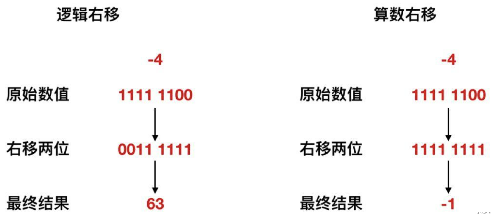

# 二进制
我们都知道，计算机的底层都是使用二进制数据进行数据流传输的，那么为什么会使用二进制表示计算机呢？或者说，什么是二进制数呢？在拓展一步，如何使用二进制进行加减乘除？下面就来看一下
## 什么是二进制数
那么什么是二进制数呢？为了说明这个问题，我们先把 00100111 这个数转换为十进制数看一下，二进制数转换为十进制数，直接将各位置上的值 * 位权即可，那么我们将上面的数值进行转换

也就是说，二进制数代表的 00100111 转换成十进制就是 39，这个 39 并不是 3 和 9 两个数字连着写，而是 3 * 10 + 9 * 1，这里面的 10 , 1 就是位权，以此类推，上述例子中的位权从高位到低位依次就是 7 6 5 4 3 2 1 0。这个位权也叫做次幂，那么最高位就是2的7次幂，2的6次幂 等等。二进制数的运算每次都会以2为底，这个2 指得就是基数，那么十进制数的基数也就是 10 。在任何情况下位权的值都是 **数的位数 – 1**，那么第一位的位权就是 1 – 1 = 0， 第二位的位权就睡 2 – 1 = 1，以此类推
## 移位运算和乘除的关系
在了解过二进制之后，下面我们来看一下二进制的运算，和十进制数一样，加减乘除也适用于二进制数，只要注意逢 2 进位即可。二进制数的运算，也是计算机程序所特有的运算，因此了解二进制的运算是必须要掌握的。
首先我们来介绍移位 运算，移位运算是指将二进制的数值的各个位置上的元素坐左移和右移操作，见下图

## 补数
刚才我们没有介绍右移的情况，是因为右移之后空出来的高位数值，有 0 和 1 两种形式。要想区分什么时候补0什么时候补1，首先就需要掌握二进制数表示负数的方法。
**二进制数中表示负数值时，一般会把最高位作为符号来使用，因此我们把这个最高位当作符号位。** 符号位是 0 时表示正数，是 1 时表示 负数。那么 -1 用二进制数该如何表示呢？可能很多人会这么认为：因为 1 的二进制数是 0000 0001，最高位是符号位，所以正确的表示 -1 应该是 1000 0001，但是这个答案真的对吗？
计算机世界中是没有减法的，计算机在做减法的时候其实就是在做加法，也就是用加法来实现的减法运算。比如 100 – 50 ，其实计算机来看的时候应该是 100 +  (-50)，为此，在表示负数的时候就要用到二进制补数，补数就是用正数来表示的负数。
为了获得补数，我们需要将二进制的各数位的数值全部取反，然后再将结果 + 1 即可，先记住这个结论，下面我们来演示一下。

具体来说，就是需要先获取某个数值的二进制数，然后对二进制数的每一位做取反操作(0 —> 1 , 1 —> 0)，最后再对取反后的数 +1 ，这样就完成了补数的获取。
补数的获取，虽然直观上不易理解，但是逻辑上却非常严谨，比如我们来看一下 1 – 1 的这个过程，我们先用上面的这个 1000 0001(它是1的补数，不知道的请看上文，正确性先不管，只是用来做一下计算)来表示一下

奇怪，1 – 1 会变成 130 ，而不是0，所以可以得出结论 1000 0001 表示 -1 是完全错误的。
那么正确的该如何表示呢？其实我们上面已经给出结果了，那就是 1111 1111，来论证一下它的正确性

我们可以看到 1 – 1 其实实际上就是 1 + (-1)，对 -1 进行上面的取反 + 1 后变为 1111 1111, 然后与 1 进行加法运算，得到的结果是九位的 1 0000 0000，结果发生了溢出，计算机会直接忽略掉溢出位，也就是直接抛掉 最高位 1 ，变为 0000 0000。也就是 0，结果正确，所以 1111 1111 表示的就是 -1 。
**所以负数的二进制表示就是先求其补数，补数的求解过程就是对原始数值的二进制数各位取反，然后将结果 + 1**。

## 算数右移和逻辑右移的区别
在了解完补数后，我们重新考虑一下右移这个议题，右移在移位后空出来的最高位有两种情况 0 和 1。
将二进制数作为带符号的数值进行右移运算时，移位后需要在最高位填充移位前符号位的值( 0 或 1)。这就被称为算数右移。如果数值使用补数表示的负数值，那么右移后在空出来的最高位补 1，就可以正确的表示 1/2,1/4,1/8等的数值运算。如果是正数，那么直接在空出来的位置补 0 即可。
下面来看一个右移的例子。将 -4 右移两位，来各自看一下移位示意图

如上图所示，在逻辑右移的情况下， -4 右移两位会变成 63， 显然不是它的 1/4，所以不能使用逻辑右移，那么算数右移的情况下，右移两位会变为 -1，显然是它的 1/4，故而采用算数右移。
那么我们可以得出来一个结论：**左移时，无论是图形还是数值，移位后，只需要将低位补 0 即可；右移时，需要根据情况判断是逻辑右移还是算数右移。**
下面介绍一下符号扩展：**将数据进行符号扩展是为了产生一个位数加倍、但数值大小不变的结果，以满足有些指令对操作数位数的要求，例如倍长于除数的被除数，再如将数据位数加长以减少计算过程中的误差。**
以8位二进制为例，符号扩展就是指在保持值不变的前提下将其转换成为16位和32位的二进制数。将0111 1111这个正的 8位二进制数转换成为 16位二进制数时，很容易就能够得出0000 0000 0111 1111这个正确的结果，但是像 1111 1111这样的补数来表示的数值，该如何处理？直接将其表示成为1111 1111 1111 1111就可以了。也就是说，不管正数还是补数表示的负数，只需要将 0 和 1 填充高位即可。
## 字符编码和字符集
### 字符编码
计算机中储存的信息都是用二进制数表示的，而我们在屏幕上看到的数字、英文、标点符号、汉字等字符是二进制数转换之后的结果。按照某种规则，将字符存储到计算机中，称为**编码** 。反之，将存储在计算机中的二进制数按照某种规则解析显示出来，称为**解码** 。比如说，按照A规则存储，同样按照A规则解析，那么就能显示正确的文本符号。反之，按照A规则存储，再按照B规则解析，就会导致乱码现象。
编码:字符(能看懂的)--字节(看不懂的)
解码:字节(看不懂的)-->字符(能看懂的)

- **字符编码Character Encoding** : 就是一套自然语言的字符与二进制数之间的对应规则。
编码表:生活中文字和计算机中二进制的对应规则

ASCII 码就好比一个字典，用 8 位二进制中的 128 个不同的数，映射到 128 个不同的字符里。比如，小写字母 a 在 ASCII 里面，就是第 97 个，也就是二进制的 0110 0001，对应的十六进制表示就是 61。而大写字母 A，就是第 65 个，也就是二进制的 0100 0001，对应的十六进制表示就是 41。

在 ASCII 码里面，数字 9 不再像整数表示法里一样，用 0000 1001 来表示，而是用 0011 1001 来表示。字符串 15 也不是用 0000 1111 这 8 位来表示，而是变成两个字符 1 和 5 连续放在一起，也就是 0011 0001 和 0011 0101，需要用两个 8 位来表示。
### 字符集

- **字符集 Charset**：也叫编码表。是一个系统支持的所有字符的集合，包括各国家文字、标点符号、图形符号、数字等。

计算机要准确的存储和识别各种字符集符号，需要进行字符编码，一套字符集必然至少有一套字符编码。常见字符集有ASCII字符集、GBK字符集、Unicode字符集等。
可见，当指定了**编码**，它所对应的**字符集**自然就指定了，所以**编码**才是我们最终要关心的。

- **ASCII字符集** ：
   - ASCII（American Standard Code for Information Interchange，美国信息交换标准代码）是基于拉丁字母的一套电脑编码系统，用于显示现代英语，主要包括控制字符（回车键、退格、换行键等）和可显示字符（英文大小写字符、阿拉伯数字和西文符号）。
   - 基本的ASCII字符集，使用7位（bits）表示一个字符，共128字符。ASCII的扩展字符集使用8位（bits）表示一个字符，共256字符，方便支持欧洲常用字符。
- **ISO-8859-1字符集**：
   - 拉丁码表，别名Latin-1，用于显示欧洲使用的语言，包括荷兰、丹麦、德语、意大利语、西班牙语等。
   - ISO-8859-1使用单字节编码，兼容ASCII编码。
- **GBxxx字符集**：
   - GB就是国标的意思，是为了显示中文而设计的一套字符集。
   - **GB2312**：简体中文码表。一个小于127的字符的意义与原来相同。但两个大于127的字符连在一起时，就表示一个汉字，这样大约可以组合了包含7000多个简体汉字，此外数学符号、罗马希腊的字母、日文的假名们都编进去了，连在ASCII里本来就有的数字、标点、字母都统统重新编了两个字节长的编码，这就是常说的"全角"字符，而原来在127号以下的那些就叫"半角"字符了。
   - **GBK**：最常用的中文码表。是在GB2312标准基础上的扩展规范，使用了双字节编码方案，共收录了21003个汉字，完全兼容GB2312标准，同时支持繁体汉字以及日韩汉字等。
   - **GB18030**：最新的中文码表。收录汉字70244个，采用多字节编码，每个字可以由1个、2个或4个字节组成。支持中国国内少数民族的文字，同时支持繁体汉字以及日韩汉字等。
- **Unicode字符集** ：
   - Unicode编码系统为表达任意语言的任意字符而设计，是业界的一种标准，也称为统一码、标准万国码。
   - 它最多使用4个字节的数字来表达每个字母、符号，或者文字。有三种编码方案，UTF-8、UTF-16和UTF-32。最为常用的UTF-8编码。
   - UTF-8编码，可以用来表示Unicode标准中任何字符，它是电子邮件、网页及其他存储或传送文字的应用中，优先采用的编码。互联网工程工作小组（IETF）要求所有互联网协议都必须支持UTF-8编码。所以，我们开发Web应用，也要使用UTF-8编码。它使用一至四个字节为每个字符编码，编码规则：
      1. 128个US-ASCII字符，只需一个字节编码。
      2. 拉丁文等字符，需要二个字节编码。 
      3. 大部分常用字（含中文），使用三个字节编码。
      4. 其他极少使用的Unicode辅助字符，使用四字节编码。
# 静态链接过程
平常一个不起眼的编译过程，例如一个hello_world.c，它在编译器上经历了四个步骤，分别是，预处理、编译、汇编和链接。

预处理主要处理那些源代码中以'#'开头的预编译指令，例如"#include"、"#define"、"#if"、"#ifdef"、"#pragma"等。

接着由编译程序将程序输出为汇编语言的文件，再由汇编器将汇编代码转换成机器可执行的指令。经过预编译、编译和汇编后，输出了一个目标文件即.o文件。

最后再由链接器将所有目标文件(.o文件)链接成一个可执行文件。

实际上，“**C 语言代码 - 汇编代码 - 机器码**” 这个过程，在我们的计算机上进行的时候是由两部分组成的。
第一个部分由编译（Compile）、汇编（Assemble）以及链接（Link）三个阶段组成。在这三个阶段完成之后，我们就生成了一个可执行文件。
第二部分，我们通过装载器（Loader）把可执行文件装载（Load）到内存中。CPU 从内存中读取指令和数据，来开始真正执行程序。

现代流行的操作系统分Windows和Linux两种，因此我们主要介绍这两种平台下的文件格式。在Windows下的可执行文件格式称为PE（Portable Executable），在Linux下则称为ELF（Executable Linkable Format），其实它们都是COFF（Common file format）格式的变种。

不光是可执行文件，动态链接库（DLL，Dynamic Linking Library）和静态链接库（Static Linking Library）都是按照可执行文件格式存储的。
**静态链接库稍有不同，它把很多目标文件捆绑在一起形成一个文件，可以简单把它理解为一个包含很多目标文件的文件包。**

我们先以目标文件为例，来举一个简单的文件ELF结构。目标文件是最常见的编译单位，它将指令代码、数据以Section的形式存储在文件中。
类似的Section段有很多，我们列举一些重要的来说：
.bss：包含程序运行时未初始化的数据（全局变量和静态变量）。当程序运行时，这些数据初始化为0。 .data和.data1，包含初始化的全局变量和静态变量。 .dynamic，包含了动态链接的信息，包括链接器地址、需要的动态库、段地址信息，类型为SHT_DYNAMIC。 .dynstr，包含了动态链接用的字符串，通常是和符号表中的符号关联的字符串，类型为SHT_STRTAB。 .dynsym，包含动态链接函数符号表和地址，没有地址的则为0，标志SHF_ALLOC，类型为SHT_DYNSYM。 .fini，正常结束时要执行的析构程序，类型为SHT_PROGBITS。 .got，全局偏移表(global offset table)，类型为SHT_PROGBITS。 .hash，包含符号hash表，用于快速查找函数名的。标志SHF_ALLOC，类型为SHT_HASH。 .init，程序运行或加载时初始化程序。类型为SHT_PROGBITS。 .interp，该节内容是一个字符串，指定了程序链接器的路径名。如果文件中有一个可加载的segment包含该节，属性就包含SHF_ALLOC，否则不包含。类型为SHT_PROGBITS。 .plt 过程链接表（Procedure Linkage Table），类型为SHT_PROGBITS。 .rodata和.rodata1， 包含只读数据，组成不可写的段。标志SHF_ALLOC，类型为SHT_PROGBITS。 .shstrtab，包含section的名字，真正的字符串存储在.shstrtab中，其他都是索引。类型为SHT_STRTAB。 .strtab，包含字符串，通常是符号表中符号对应的变量名字和函数名。类型为SHT_STRTAB。 .symtab，Symbol Table，符号表。包含了所有符号信息，包括变量、函数、定位、重定位符号定义和引用时需要的信息。符号表是一个数组，Index 0 第一个入口，它的含义是undefined symbol index， STN_UNDEF。 .rela.dyn，包含了除PLT以外的 RELA 类型的动态库重定向信息。 .rela.plt，包含了PLT中的 RELA 类型的动态库重定向信息 .rela.text 代码重定位表 .rela.data 数据重定位表 .line，调试时的行号表，即源代码行号与编译后指令的对应表

ELF 文件格式把各种信息，分成一个一个的 Section 保存起来。ELF 有一个基本的文件头（File Header），用来表示这个文件的基本属性，比如是否是可执行文件，对应的 CPU、操作系统等等。

ELF Header描述了Program header table 和 Section header table，Program header table 又描述了Segment摘要，Section header table 又描述了Section摘要。
我们来看下它们的结构体，Program header结构：

Section header结构：

除了这些基本属性之外，大部分程序还有这么一些 Section：

1. 首先是.text Section，也叫作**代码段**或者指令段（Code Section），用来保存程序的代码和指令；
2. 接着是.data Section，也叫作**数据段**（Data Section），用来保存程序里面设置好的初始化数据信息；
3. 然后就是.rel.text Secion，叫作**重定位表**（Relocation Table）。重定位表里，保留的是当前的文件里面，哪些跳转地址其实是我们不知道的。
4. 最后是.symtab Section，叫作**符号表**（Symbol Table）。符号表保留了我们所说的当前文件里面定义的函数名称和对应地址的地址簿。

链接器会扫描所有输入的目标文件，然后把所有符号表里的信息收集起来，构成一个全局的符号表。然后再根据重定位表，把所有不确定要跳转地址的代码，根据符号表里面存储的地址，进行一次修正。最后，把所有的目标文件的对应段进行一次合并，变成了最终的可执行代码。这也是为什么，可执行文件里面的函数调用的地址都是正确的。

# 动态链接和装载
## 可执行文件装载
装载器会把对应的指令和数据加载到内存里面来，让 CPU 去执行。
说起来只是装载到内存里面这一句话的事儿，实际上装载器需要满足两个要求。

**第一，可执行程序加载后占用的内存空间应该是连续的**。执行指令的时候，程序计数器是顺序地一条一条指令执行下去。这也就意味着，这一条条指令需要连续地存储在一起。
**第二，我们需要同时加载很多个程序，并且不能让程序自己规定在内存中加载的位置。**虽然编译出来的指令里已经有了对应的各种各样的内存地址，但是实际加载的时候，我们其实没有办法确保，这个程序一定加载在哪一段内存地址上。因为我们现在的计算机通常会同时运行很多个程序，可能你想要的内存地址已经被其他加载了的程序占用了。
要满足这两个基本的要求，我们很容易想到一个办法。那就是我们可以在内存里面，找到一段连续的内存空间，然后分配给装载的程序，然后把这段连续的内存空间地址，和整个程序指令里指定的内存地址做一个映射。

我们把指令里用到的内存地址叫作**虚拟内存地址**（Virtual Memory Address），实际在内存硬件里面的空间地址，我们叫**物理内存地址**（Physical Memory Address）**。**
每个进程都拥有一个自己想象的虚拟空间，**地址从0到0xFFFFFFFFF（32位设备）**
程序里有指令和各种内存地址，我们只需要关心虚拟内存地址就行了。对于任何一个程序来说，它看到的都是同样的内存地址。我们维护一个虚拟内存到物理内存的映射表，这样实际程序指令执行的时候，会通过虚拟内存地址，找到对应的物理内存地址，然后执行。因为是连续的内存地址空间，所以我们只需要维护映射关系的起始地址和对应的空间大小就可以了。
**操作系统上的使用的内存空间都是虚拟地址空间，而非实际物理空间，它是由操作系统虚构出来的一个地址空间。**
这就像是操作系统给了每个进程一个世界那样，在这个世界里，进程可以自由的申请和释放内存，而不需要理会物理内存如何分配和释放。

每个进程中的内存从虚拟地址都从0开始，到0xFFFFFFFF结束，其中有1G的空间专门为内核空间所用，用户空间也做了不同的分段。因此整个虚拟空间地址可以分为：

.kernel 内核空间段
.stack 栈内存段
.libraries  动态库映射段（文件映射段）
.heap 堆内存段
.bass 未初始化的全局/静态变量段
.data 已初始化全局/静态变量段
.text 程序指令字节段

**Linux和Windows操作系统都使用页映射方式管理虚拟内存和物理内存之间的关系**
**虚拟内存与物理内存之间由一个页表作为映射连接它们之间的关系**

当我们访问一块虚拟空间时，操作系统发现没有这块地址没有被连接到真实的物理地址，此时才真正从真实物理内存中找到一块内存块用页表连接起来，这才真正分配成功并且可以使用。

每次分配实际物理内存，也并不是分配一整块申请的虚拟内存空间，而是按页大小来分配。即，实际物理空间在使用到时才真正分配，而虚拟空间则已经先行分配。
**因此我们在虚拟内存上申请的连续内存，有可能在物理内存上是不连续的。当然，申请连续内存获得实际连续内存的概率要大很多。**

对虚拟空间来说，一块内存只是一个数据结构，没有实际的占用，也没有真正的空间之说，只是我们说起来容易理解一些。
**程序启动时虚拟内存中很多内存地址都没有被用到，因此也没有对应的物理页，只有当使用到该虚拟内存页时，发现有物理内存缺页的情况，才会发起物理内存申请和映射。**

除了虚拟内存，不一定有实际的物理内存外，实际的物理地址上的内存，也不一定在实际物理内存中。
操作系统又在实际物理内存上加了一个系统用于更好的利用实际物理内存空间，即Swap。
当检测到某些物理内存上一次使用时间过长时，则会被Swap置换到硬盘空间，为实际物理内存腾出更多空间给其他进程使用。
**那么执行文件是怎么被装载进进程的呢？**

大致过程为，先创建一个进程，然后将可执行文件装载进进程。
其中装载可执行文件时需要分三步：

1. **创建一个独立的虚拟地址空间**
2. **读取可执行文件头，并建立虚拟空间与可执行文件的映射关系**
3. **将CPU的指令寄存器设置成可执行文件的入口地址，开始运行**

**注意，创建一个虚拟空间实际上并不是创建空间，而是创建映射函数所需要的相应的数据结构。在i386的Linux下，创建虚拟地址空间实际上只是分配一个页目录就可以了。**

当要读取特定的页，却发现数据并没有加载到物理内存里的时候，就会触发一个来自于 CPU 的**缺页错误**（Page Fault）。我们的操作系统会捕捉到这个错误，然后将对应的页，从存放在硬盘上的虚拟内存里读取出来，加载到物理内存里。这种方式，使得我们可以运行那些远大于我们实际物理内存的程序。同时，这样一来，任何程序都不需要一次性加载完所有指令和数据，只需要加载当前需要用到就行了。
## 动态链接
程序的链接，是把对应的不同文件内的代码段，合并到一起，成为最后的可执行文件。这个链接的方式，让我们在写代码的时候做到了“复用”。同样的功能代码只要写一次，然后提供给很多不同的程序进行链接就行了。
但是，如果我们有很多个程序都要通过装载器装载到内存里面，那里面链接好的同样的功能代码，也都需要再装载一遍，再占一遍内存空间。这就好比，假设每个人都有骑自行车的需要，那我们给每个人都生产一辆自行车带在身边，固然大家都有自行车用了，但是马路上肯定会特别拥挤。

如果我们能够让同样功能的代码，在不同的程序里面，不需要各占一份内存空间，那该有多好啊！
这个思路就引入一种新的链接方法，叫作**动态链接**（Dynamic Link）。相应的，我们之前说的合并代码段的方法，就是**静态链接**（Static Link）。

在动态链接的过程中，我们想要“链接”的，不是存储在硬盘上的目标文件代码，而是加载到内存中的**共享库**（Shared Libraries）。顾名思义，这里的共享库重在“共享“这两个字。

这个加载到内存中的共享库会被很多个程序的指令调用到。在 Windows 下，这些共享库文件就是.dll 文件，也就是 Dynamic-Link Libary（DLL，动态链接库）。在 Linux 下，这些共享库文件就是.so 文件，也就是 Shared Object（一般我们也称之为动态链接库）。这两大操作系统下的文件名后缀，一个用了“动态链接”的意思，另一个用了“共享”的意思，正好覆盖了两方面的含义。

**我们在开启一个进程时，在装载完执行文件后，进程首先会把控制权交给动态链接器，由它完成所有的动态链接工作，再把控制权交给进程开始执行。**

当我们在代码中写下动态库的函数时，在程序模块动态装载时，应该不需要因为装载地址的改变而改变。

所以实现动态链接的基本想法就是把指令中那些需要被修改的部分分离出来，放到数据那里去，这样指令部分就可以保持不变，而数据部分可以在每个进程中拥有一个副本。

这种方案称为，地址无关代码（PIC，Position-independent Code）技术方案，通常我们在编译时会加上PIC这个标记，就是告诉编译器，我们这个库是地址无关的。
**如果一个库不是以地址无关（PIC）模式编译的，那么毫无疑问，它需要在装载时被重定位，即在启动执行时就需要装载库文件并且重定位所有与库文件有关的函数调用地址。**
**如果一个库是以地址无关（PIC）模式编译的，那么就不会在装载时对整个库函数相关调用进行重定位，而是会用延迟绑定（PLT）的方式实时定位函数。**

static int a; extern int b; extern void ext(); void bar() {   a = 1; // 模块内数据访问   b = 2; // 外部模块数据访问 } void foo() {   bar(); // 模块内函数调用   ext(); // 外部模块函数调用 }
以上面这段代码为例模块内和模块间的数据访问和函数调用方法，

1. 模块内的函数调用使用相对地址调用
2. 模块内的数据访问使用相对寻址方式
3. 模块外的数据访问，由于无法知道外部数据的具体地址，所以需要借助**全局偏移表（GOT）**获取外部数据
4. 模块外的函数调用，由于无法知道外部函数的具体地址，所以需要借助**全局偏移表（GOT）**获取外部函数地址后再调用

大致的方案得从编译说起，我们知道在使用printf，scanf()，strlen()这样的公用库函数时都需要加载公共库libc.so，但公共库并没有被合并到可执行文件中，也就没有可依赖的地址规则。

所以编译器在编译这些外部函数的时候，其实并不知道它们的调用地址是多少，无法填充真实地址。

但编译器会填充一个地址指向一段动态程序，当这个函数真正被调用时，先调用到动态程序，再由动态程序去寻找真正的调用地址，最后再调用真实地址的函数。

这种方法就是延迟绑定（PLT）**程序链接表**（Procedure Link Table）
**全局偏移表**（GOT，Global Offset Table）
在动态链接对应的共享库，我们在共享库的 data section 里面，保存了一张**全局偏移表**（GOT，Global Offset Table）。**虽然共享库的代码部分的物理内存是共享的，但是数据部分是各个动态链接它的应用程序里面各加载一份的。**所有需要引用当前共享库外部的地址的指令，都会查询 GOT，来找到当前运行程序的虚拟内存里的对应位置。而 GOT 表里的数据，则是在我们加载一个个共享库的时候写进去的。

不同的进程，调用同样的 lib.so，各自 GOT 里面指向最终加载的动态链接库里面的虚拟内存地址是不同的。

这样，虽然不同的程序调用的同样的动态库，各自的内存地址是独立的，调用的又都是同一个动态库，但是不需要去修改动态库里面的代码所使用的地址，而是各个程序各自维护好自己的 GOT，能够找到对应的动态库就好了。

我们的 GOT 表位于共享库自己的数据段里。GOT 表在内存里和对应的代码段位置之间的偏移量，始终是确定的。这样，我们的共享库就是地址无关的代码，对应的各个程序只需要在物理内存里面加载同一份代码。而我们又要通过各个可执行程序在加载时，生成的各不相同的 GOT 表，来找到它需要调用到的外部变量和函数的地址。
