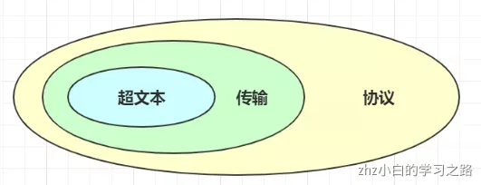
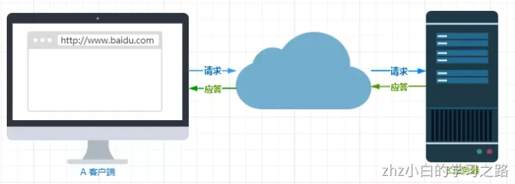
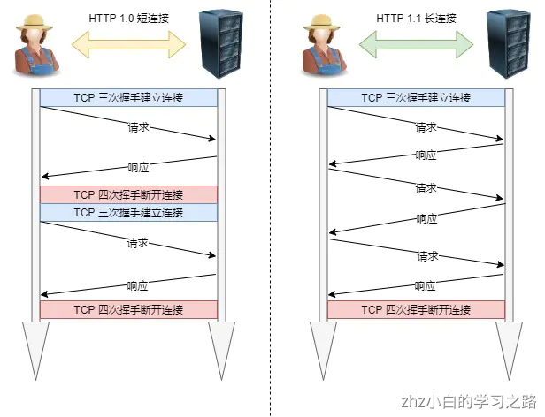
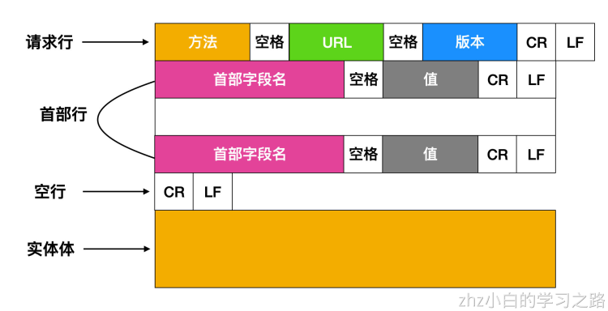
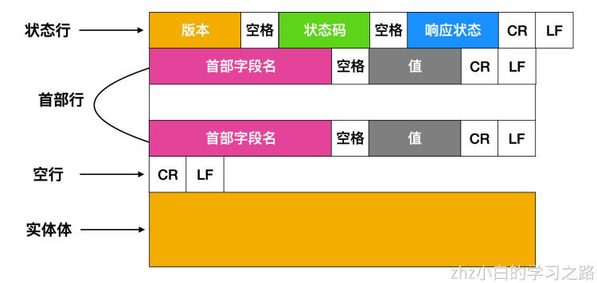

应用层：解决通过应用进程的交互来实现特定网络应用的问题。

我们在浏览器的地址中输入某个网站的域名后，就可以访问该网站的内容，这个就是**万维网WWW应用**，其相关的应用层协议为**超文本传送协议HTTP**
## HTTP基本概念
HTTP 是超文本传输协议，也就是**H**yperText **T**ransfer **P**rotocol。
HTTP的名字「超文本协议传输」，它可以拆成三个部分：

- 超文本
- 传输
- 协议


### 1. 「协议」
在生活中，我们也能随处可见「协议」，例如：

- 刚毕业时会签一个「三方协议」；
- 找房子时会签一个「租房协议」；


生活中的协议，本质上与计算机中的协议是相同的，协议的特点:

- 「**协**」字，代表的意思是必须有**两个以上的参与者**。例如三方协议里的参与者有三个：你、公司、学校三个；租房协议里的参与者有两个：你和房东。
- 「**仪**」字，代表的意思是对参与者的一种**行为约定和规范**。例如三方协议里规定试用期期限、毁约金等；租房协议里规定租期期限、每月租金金额、违约如何处理等。

针对 HTTP **协议**，我们可以这么理解。
HTTP 是一个用在计算机世界里的**协议**。它使用计算机能够理解的语言确立了一种计算机之间交流通信的规范（**两个以上的参与者**），以及相关的各种控制和错误处理方式（**行为约定和规范**）。

### 2. 「传输」
所谓的「传输」，很好理解，就是把一堆东西从 A 点搬到 B 点，或者从 B 点 搬到 A 点。
别轻视了这个简单的动作，它至少包含两项重要的信息。
HTTP 协议是一个**双向协议**。
我们在上网冲浪时，浏览器是请求方 A ，百度网站就是应答方 B。双方约定用 HTTP 协议来通信，于是浏览器把请求数据发送给网站，网站再把一些数据返回给浏览器，最后由浏览器渲染在屏幕，就可以看到图片、视频了。

数据虽然是在 A 和 B 之间传输，但允许中间有**中转或接力**。
就好像第一排的同学想穿递纸条给最后一排的同学，那么传递的过程中就需要经过好多个同学（中间人），这样的传输方式就从「A < --- > B」，变成了「A <-> N <-> M <-> B」。

而在 HTTP 里，需要中间人遵从 HTTP 协议，只要不打扰基本的数据传输，就可以添加任意额外的东西。
针对**传输**，我们可以进一步理解了 HTTP。
HTTP 是一个在计算机世界里专门用来在**两点之间传输数据**的约定和规范。

### 3. 「超文本」
HTTP 传输的内容是「超文本」。
我们先来理解「文本」，在互联网早期的时候只是简单的字符文字，但现在「文本」。的涵义已经可以扩展为图片、视频、压缩包等，在 HTTP 眼里这些都算做「文本」。
再来理解「超文本」，它就是**超越了普通文本的文本**，它是文字、图片、视频等的混合体最关键有超链接，能从一个超文本跳转到另外一个超文本。
HTML 就是最常见的超文本了，它本身只是纯文字文件，但内部用很多标签定义了图片、视频等的链接，在经过浏览器的解释，呈现给我们的就是一个文字、有画面的网页了。
OK，经过了对 HTTP 里这三个名词的详细解释，就可以给出比「超文本传输协议」这七个字更准确更有技术含量的答案：
**HTTP 是一个在计算机世界里专门在「两点」之间「传输」文字、图片、音频、视频等「超文本」数据的「约定和规范」。**
## HTTP 请求响应过程
让我们通过⼀个例⼦来探讨⼀下 HTTP 的请求响应过程，我们假设访问的 URL 地址为
[http://www.someSchool.edu/someDepartment/home.index](http://www.someSchool.edu/someDepartment/home.index) ，当我们输⼊⽹址并点击回⻋时，浏览器内部会
进⾏如下操作

- DNS服务器会⾸先进⾏域名的映射，找到访问 www.someSchool.edu 所在的地址，然后HTTP 客户端进程在80 端⼝发起⼀个到服务器  www.someSchool.edu 的 TCP 连接（80 端⼝是 HTTP 的默认端⼝）。在客户和服务器进程中都会有⼀个 套接字 与其相连。

- HTTP 客户端通过它的套接字向服务器发送⼀个 HTTP 请求报⽂。该报⽂中包含了路径someDepartment/home.index 的资源，我们后⾯会详细讨论 HTTP 请求报⽂。

- HTTP 服务器通过它的套接字接收该报⽂，进⾏请求的解析⼯作，并从其 存储器(RAM 或磁盘) 中检索出对象www.someSchool.edu/someDepartment/home.index，然后把检索出来的对象进⾏封装，封装到 HTTP响应报⽂中，并通过套接字向客户进⾏发送。

- HTTP 服务器随即通知 TCP 断开 TCP 连接，实际上是需要等到客户接受完响应报⽂后才会断开 TCP 连接。

- HTTP 客户端接受完响应报⽂后，TCP 连接会关闭。客户端会从报⽂中提取响应⽂件，并检查该 HTML ⽂件，然后循环检查报⽂中其他内部对象。

- 检查完成后，HTTP 客户端会把对应的资源通过显示器呈现给⽤户。

⾄此，键⼊⽹址再按下回⻋的全过程就结束了。上述过程描述的是⼀种简单的 请求-响应 全过程，真实的请求-响应情况可能要⽐上⾯描述的过程复杂很多。

## HTTP 请求特征
HTTP 最凸出的优点是「简单、灵活和易于扩展、应⽤⼴泛和跨平台」。
1.  简单
HTTP 基本的报⽂格式就是 header + body ，头部信息也是 key-value 简单⽂本的形式，易于理解，降低了学习和使⽤的⻔槛。
2.  灵活和易于扩展
HTTP协议⾥的各类请求⽅法、URI/URL、状态码、头字段等每个组成要求都没有被固定死，都允许开发⼈员⾃定义和扩充。
同时 HTTP 由于是⼯作在应⽤层（ OSI 第七层），则它下层可以随意变化。
HTTPS 也就是在 HTTP 与 TCP 层之间增加了 SSL/TLS 安全传输层，HTTP/3 甚⾄把 TCP 层换成了基于 UDP 的QUIC。
3.  应⽤⼴泛和跨平台
互联⽹发展⾄今，HTTP 的应⽤范围⾮常的⼴泛，从台式机的浏览器到⼿机上的各种 APP，从看新闻、刷贴吧到购物、理财、吃鸡，HTTP 的应⽤⽚地开花，同时天然具有跨平台的优越性。

## 持久性连接和⾮持久性连接
我们上⾯描述的 HTTP 请求响应过程就是⼀种 ⾮持久连接 ，因为每次 TCP 在传递完报⽂后，都会关闭 TCP 连接，每个 TCP 连接只传输⼀个请求报⽂和响应报⽂。
**⾮持久性连接**有⼀些 缺点 。
第⼀，必须为每个请求的对象建⽴和维护⼀个全新的连接。
第⼆，对于每个这样的连接来说，在客户端和服务器中都要分配 TCP 的缓冲区和保持 TCP 变量，这给 Web服务器带来了严重的负担。因为⼀台 Web 服务器可能要同时服务于数百甚⾄上千个客户请求。

早期 HTTP/1.0 性能上的⼀个很⼤的问题，那就是每发起⼀个请求，都要新建⼀次 TCP 连接（三次握⼿），⽽且是串⾏请求，做了⽆谓的 TCP 连接建⽴和断开，增加了通信开销。

为了解决上述 TCP 连接问题，HTTP/1.1 提出了⻓连接的通信⽅式，也叫**持久连接**。这种⽅式的好处在于减少了TCP 连接的重复建⽴和断开所造成的额外开销，减轻了服务器端的负载。
持久连接的特点是，只要任意⼀端没有明确提出断开连接，则保持 TCP 连接状态。

## HTTP 报⽂格式
我们上⾯描述了⼀下 HTTP 的请求响应过程，相信你对 HTTP 有了更深的认识，下⾯我们就来⼀起认识⼀下 HTTP的报⽂格式是怎样的。

HTTP 协议主要由三⼤部分组成：
起始⾏（start line） ：描述请求或响应的基本信息；
头部字段（header） ：使⽤ key-value 形式更详细地说明报⽂；
消息正⽂（entity） ：实际传输的数据，它不⼀定是纯⽂本，可以是图⽚、视频等⼆进制数据。

其中起始⾏和头部字段并成为  请求头 或者  响应头 ，统称为  Header ；消息正⽂也叫做实体，称为  body 。
HTTP 协议规定每次发送的报⽂必须要有 Header，但是可以没有 body，也就是说头信息是必须的，实体信息可以没有。⽽且在 header 和 body 之间必须要有⼀个空⾏（CRLF）。

这幅图需要注意⼀下，如果使⽤  GET ⽅法，是没有实体体的，如果你使⽤的是  POST ⽅法，才会有实体体。当⽤户提交表单时，HTTP 客户端通常使⽤ POST ⽅法；与此相反，HTML 表单的获取通常使⽤ GET ⽅法。HEAD⽅法类似于 GET ⽅法，只不过 HEAD ⽅法不会返回对象。

下⾯我们来看⼀下 HTTP 响应报⽂

可以看到，请求报⽂和响应报⽂只有请求头是不同的，其他信息均⼀致。
请求报⽂请求⾏：
```
GET /some/page.html HTTP/1.1 
```
响应报⽂：
```
HTTP/1.1 200 OK 
```
