# 当键入网址后，到网页显示，其间发生了什么
想必不少小伙伴面试过程中，会遇到「**当键入网址后，到网页显示，其间发生了什么**」的面试题。
还别说，这真是挺常问的这题，前几天坐在我旁边的主管电话面试应聘者的时候，也问了这个问题。

接下来以下图较简单的网络拓扑模型作为例子，探究探究其间发生了什么？

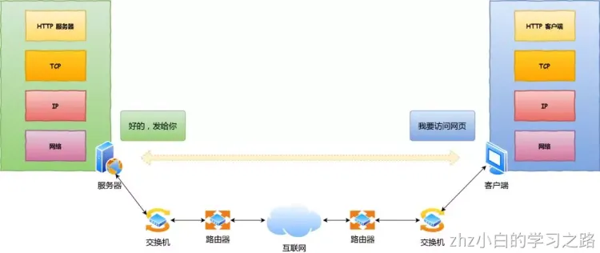
## 孤单小弟-HTTP

浏览器做的第一步工作是解析 URL
首先浏览器做的第一步工作就是要对 `URL` 进行解析，从而生发送给 `Web` 服务器的请求信息。
让我们看看一条长长的 URL 里的各个元素的代表什么，见下图：
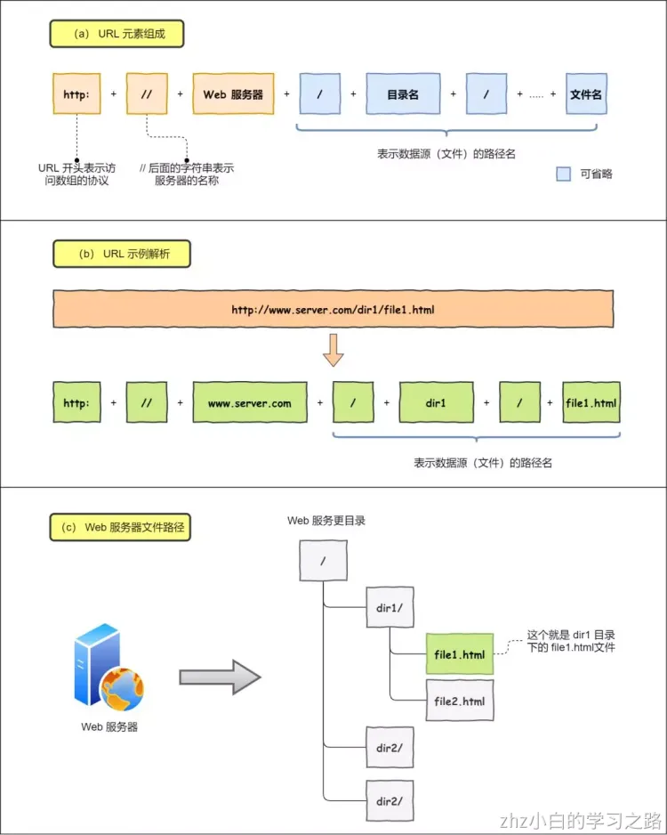

所以图中的长长的 URL 实际上是请求服务器里的文件资源。

要是上图中的蓝色部分 URL 元素都省略了，哪应该是请求哪个文件呢？

当没有路径名时，就代表访问根目录下事先设置的**默认文件**，也就是 `/index.html` 或者 `/default.html` 这些文件，这样就不会发生混乱了。

生产 HTTP 请求信息
对 `URL` 进行解析之后，浏览器确定了 Web 服务器和文件名，接下来就是根据这些信息来生成 HTTP 请求消息了。
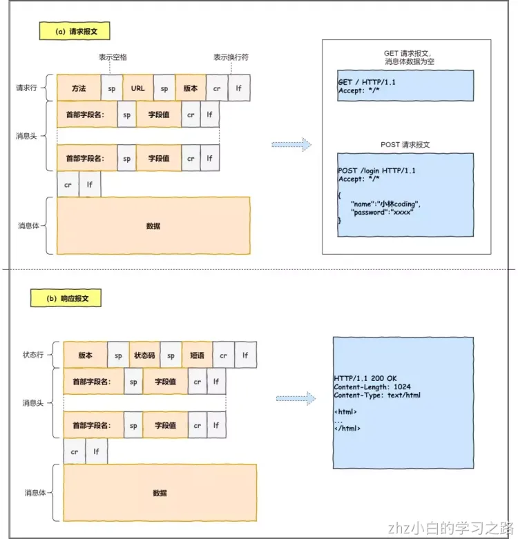
一个孤单 HTTP 数据包表示：“我这么一个小小的数据包，没亲没友，直接发到浩瀚的网络，谁会知道我呢？谁能载我一层呢？谁能保护我呢？我的目的地在哪呢？”。充满各种疑问的它，没有停滞不前，依然踏上了征途！

## 真实地址查询-DNS
通过浏览器解析 URL 并生成 HTTP 消息后，需要委托操作系统将消息发送给 `Web`  服务器。
但在发送之前，还有一项工作需要完成，那就是**查询服务器域名对于的 IP 地址**，因为委托操作系统发送消息时，必须提供通信对象的 IP 地址。
比如我们打电话的时候，必须要知道对方的电话号码，但由于电话号码难以记忆，所以通常我们会将对方电话号 + 姓名保存在通讯录里。
所以，有一种服务器就专门保存了 `Web` 服务器域名与 `IP` 的对应关系，它就是 `DNS` 服务器。

## 指南好帮手-协议栈
通过 DNS 获取到 IP 后，就可以把 HTTP 的传输工作交给操作系统中的**协议栈**。
协议栈的内部分为几个部分，分别承担不同的工作。上下关系是有一定的规则的，上面的部分会向下面的部分委托工作，下面的部分收到委托的工作并执行。
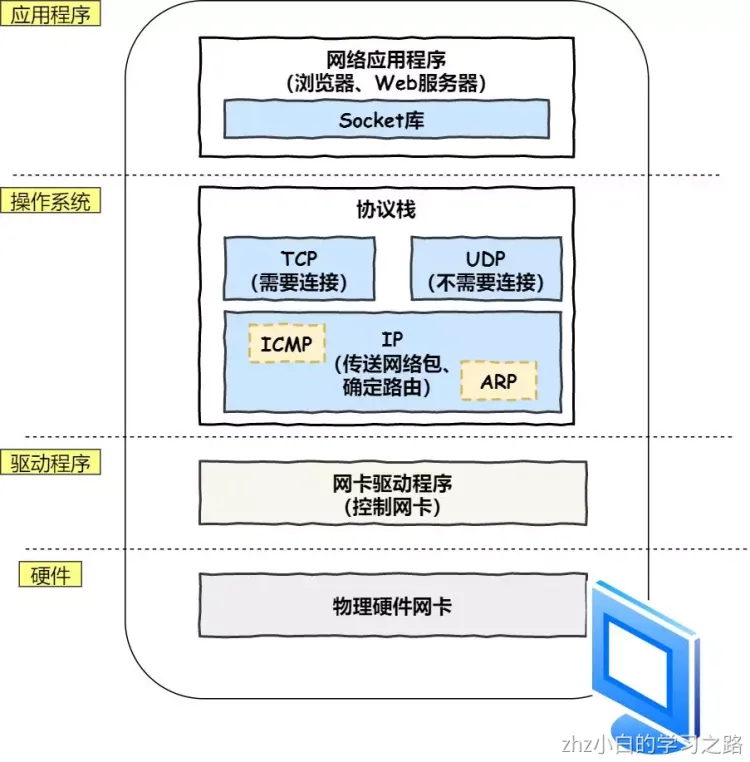
应用程序（浏览器）通过调用 Socket 库，来委托协议栈工作。协议栈的上半部分有两块，分别是负责收发数据的 TCP 和 UDP 协议，它们两会接受应用层的委托执行收发数据的操作。
协议栈的下面一半是用 IP 协议控制网络包收发操作，在互联网上传数据时，数据刽被切分成一块块的网络包，而将网络包发送给对方的操作就是由 IP 负责的。
此外 IP 中还包括 `ICMP` 协议和 `ARP` 协议。

- `ICMP` 用于告知网络包传送过程中产生的错误以及各种控制信息。
- `ARP` 用于根据 IP 地址查询相应的以太网 MAC 地址。

IP 下面的网卡驱动程序负责控制网卡硬件，而最下面的网卡则负责完成实际的收发操作，也就是对网线中的信号执行发送和接收操作。

## 可靠传输-TCP
HTTP 是基于 TCP 协议传输的，

TCP 传输数据之前，要先三次握手建立连接

如果 HTTP 请求消息比较长，超过了 `MSS` 的长度，这时 TCP 就需要把 HTTP 的数据拆解一块块的数据发送，而不是一次性发送所有数据。
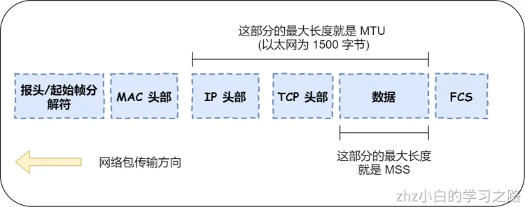

- `MTU`：一个网络包的最大长度，以太网中一般为 `1500` 字节。
- `MSS`：除去 IP 和 TCP 头部之后，一个网络包所能容纳的 TCP 数据的最大长度。

数据会被以 `MSS` 的长度为单位进行拆分，拆分出来的每一块数据都会被放进单独的网络包中。也就是在每个被拆分的数据加上 TCP 头信息，然后交给 IP 模块来发送数据。
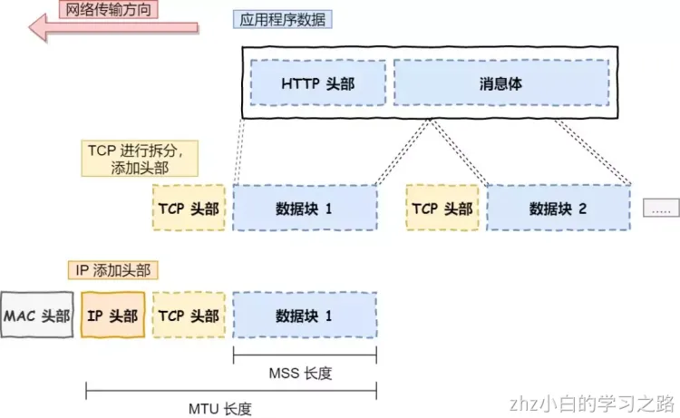
TCP 报文生成

TCP 协议里面会有两个端口，一个是浏览器监听的端口（通常是随机生成的），一个是 Web 服务器监听的端口（HTTP 默认端口号是 `80`， HTTPS 默认端口号是 `443`）。
在双方建立了连接后，TCP 报文中的数据部分就是存放 HTTP 头部 + 数据，组装好 TCP 报文之后，就需交给下面的网络层处理。
至此，网络包的报文如下图。
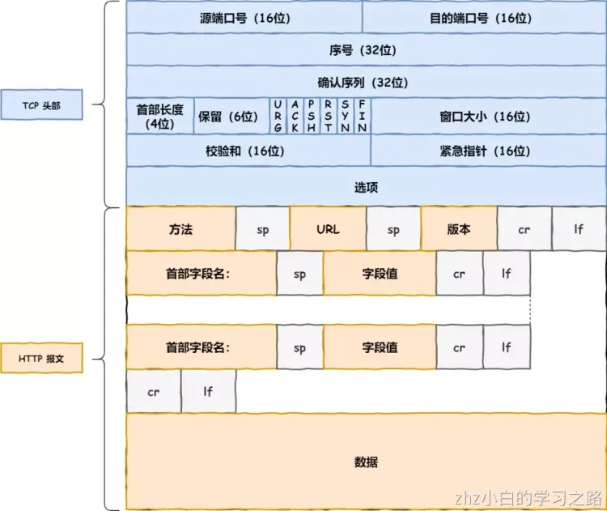

## 远程定位-IP
TCP 模块在执行连接、收发、断开等各阶段操作时，都需要委托 IP 模块将数据封装成**网络包**发送给通信对象。

在 IP 协议里面需要有**源地址 IP** 和 **目标地址 IP**：

- 源地址IP，即是客户端输出的 IP 地址；
- 目标地址，即通过 DNS 域名解析得到的 Web 服务器 IP。

因为 HTTP 是经过 TCP 传输的，所以在 IP 包头的**协议号**，要填写为 `06`（十六进制），表示协议为 TCP。

假设客户端有多个网卡，就会有多个 IP 地址，那 IP 头部的源地址应该选择哪个 IP 呢？

当存在多个网卡时，在填写源地址 IP 时，就需要判断到底应该填写哪个地址。这个判断相当于在多块网卡中判断应该使用哪个一块网卡来发送包。
这个时候就需要根据**路由表**规则，来判断哪一个网卡作为源地址 IP。

IP 报文生成

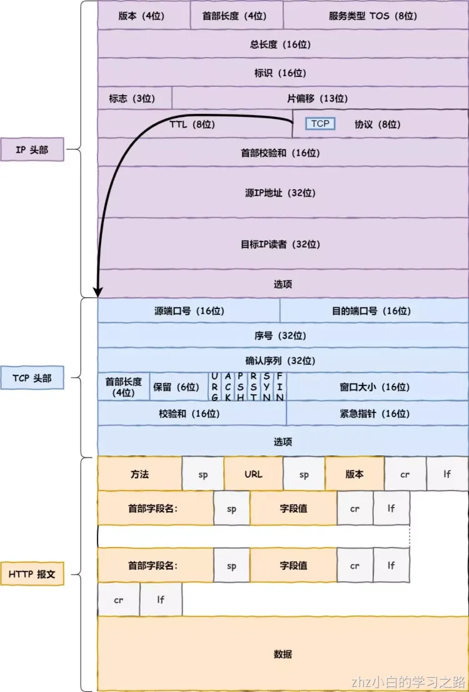

## 两点传输-MAC
生成了 IP 头部之后，接下来网络包还需要在 IP 头部的前面加上 **MAC 头部**。
MAC 包头格式
MAC 头部是以太网使用的头部，它包含了接收方和发送方的 MAC 地址等信息。
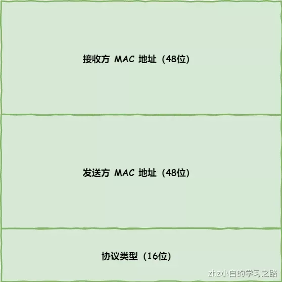
在 MAC 包头里需要**发送方 MAC 地址**和**接收方目标 MAC 地址**，用于**两点之间的传输**。
一般在 TCP/IP 通信里，MAC 包头的**协议类型**只使用：

- `0800` ：IP 协议
- `0806` ：ARP 协议

MAC 发送方和接收方如何确认?

**发送方**的 MAC 地址获取就比较简单了，MAC 地址是在网卡生产时写入到 ROM 里的，只要将这个值读取出来写入到 MAC 头部就可以了。
**接收方**的 MAC 地址就有点复杂了，只要告诉以太网对方的 MAC 的地址，以太网就会帮我们把包发送过去，那么很显然这里应该填写对方的 MAC 地址。
所以先得搞清楚应该把包发给谁，这个只要查一下**路由表**就知道了。在路由表中找到相匹配的条目，然后把包发给 `Gateway` 列中的 IP 地址就可以了。

既然知道要发给谁，按如何获取对方的 MAC 地址呢？

不知道对方 MAC 地址？不知道就喊呗。
此时就需要 `ARP` 协议帮我们找到路由器的 MAC 地址。
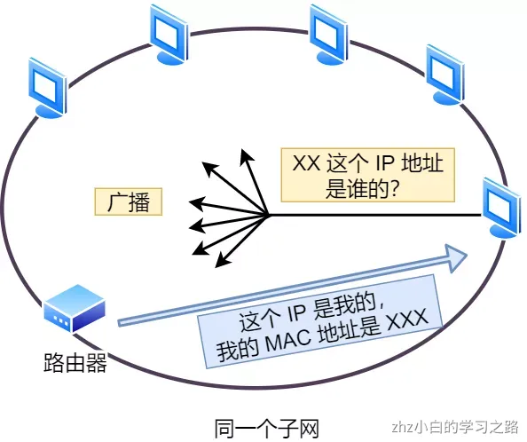
ARP 协议会在以太网中以**广播**的形式，对以太网所有的设备喊出：“这个 IP 地址是谁的？请把你的 MAC 地址告诉我”。
然后就会有人回答：“这个 IP 地址是我的，我的 MAC 地址是 XXXX”。
如果对方和自己处于同一个子网中，那么通过上面的操作就可以得到对方的 MAC 地址。然后，我们将这个 MAC 地址写入 MAC 头部，MAC 头部就完成了。

MAC 报文生成

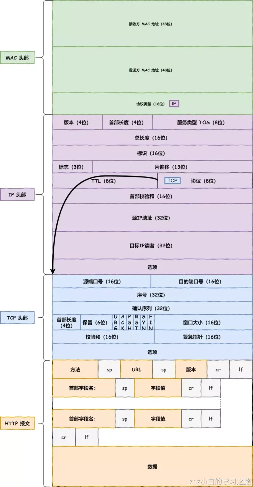

## 出口-网卡
IP 生成的网络包只是存放在内存中的一串二进制数字信息，没有办法直接发送给对方。因此，我们需要将**数字信息转换为电信号**，才能在网线上传输，也就是说，这才是真正的数据发送过程。
负责执行这一操作的是**网卡**，要控制网卡还需要靠**网卡驱动程序**。
网卡驱动从 IP 模块获取到包之后，会将其**复制**到网卡内的缓存区中，接着会其**开头加上报头和起始帧分界符，在末尾加上用于检测错误的帧校验序列**。
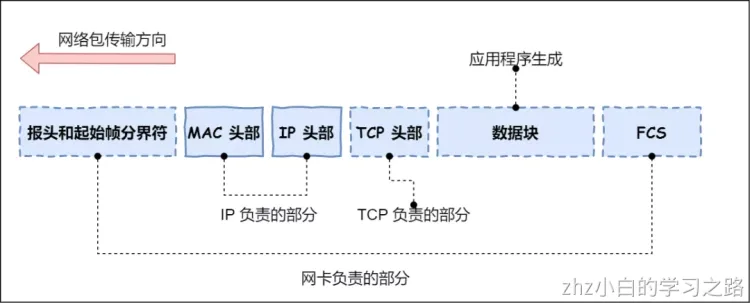

- 起始帧分界符是一个用来表示包起始位置的标记
- 末尾的 `FCS`（帧校验序列）用来检查包传输过程是否有损坏

最后网卡会将包转为电信号，通过网线发送出去。

## 送别者-交换机
下面来看一下包是如何通过交换机的。交换机的设计是将网络包**原样**转发到目的地。交换机工作在 MAC 层，也称为**二层网络设备**。

交换机的包接收操作

首先，电信号到达网线接口，交换机里的模块进行接收，接下来交换机里的模块将电信号转换为数字信号。
然后通过包末尾的 `FCS` 校验错误，如果没问题则放到缓冲区。这部分操作基本和计算机的网卡相同，但交换机的工作方式和网卡不同。
计算机的网卡本身具有 MAC 地址，并通过核对收到的包的接收方 MAC 地址判断是不是发给自己的，如果不是发给自己的则丢弃；相对地，交换机的端口不核对接收方 MAC 地址，而是直接接收所有的包并存放到缓冲区中。因此，和网卡不同，**交换机的端口不具有 MAC 地址**。
将包存入缓冲区后，接下来需要查询一下这个包的接收方 MAC 地址是否已经在 MAC 地址表中有记录了。
交换机的 MAC 地址表主要包含两个信息：

- 一个是设备的 MAC 地址，
- 另一个是该设备连接在交换机的哪个端口上。

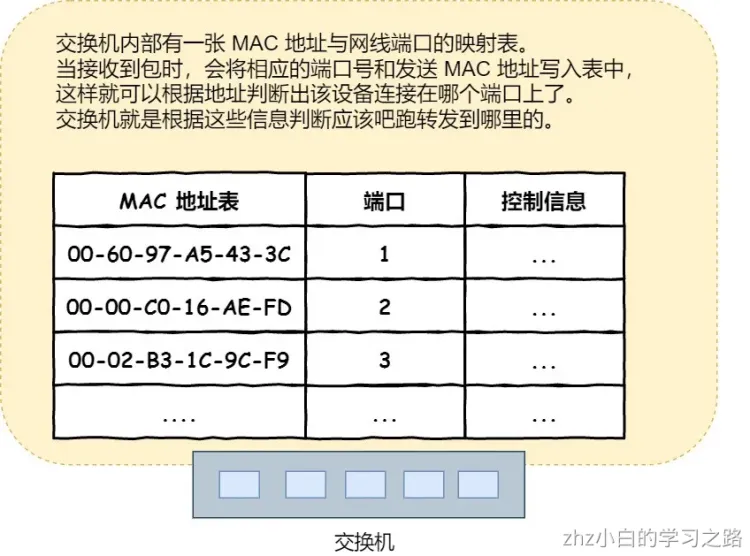
举个例子，如果收到的包的接收方 MAC 地址为 `00-02-B3-1C-9C-F9`，则与图中表中的第 3 行匹配，根据端口列的信息，可知这个地址位于 `3` 号端口上，然后就可以通过交换电路将包发送到相应的端口了。
所以，**交换机根据 MAC 地址表查找 MAC 地址，然后将信号发送到相应的端口**。

## 出镜大门-路由器

路由器与交换机的区别

网络包经过交换机之后，现在到达了**路由器**，并在此被转发到下一个路由器或目标设备。
这一步转发的工作原理和交换机类似，也是通过查表判断包转发的目标。
不过在具体的操作过程上，路由器和交换机是有区别的。

- 因为**路由器**是基于 IP 设计的，俗称**三层**网络设备，路由器的各个端口都具有 MAC 地址和 IP 地址；
- 而**交换机**是基于以太网设计的，俗称**二层**网络设备，交换机的端口不具有 MAC 地址。

路由器基本原理
路由器的端口具有 MAC 地址，因此它就能够成为以太网的发送方和接收方；同时还具有 IP 地址，从这个意义上来说，它和计算机的网卡是一样的。
当转发包时，首先路由器端口会接收发给自己的以太网包，然后**路由表**查询转发目标，再由相应的端口作为发送方将以太网包发送出去。

路由器的包接收操作
首先，电信号到达网线接口部分，路由器中的模块会将电信号转成数字信号，然后通过包末尾的 `FCS` 进行错误校验。
如果没问题则检查 MAC 头部中的**接收方 MAC 地址**，看看是不是发给自己的包，如果是就放到接收缓冲区中，否则就丢弃这个包。
总的来说，路由器的端口都具有 MAC 地址，只接收与自身地址匹配的包，遇到不匹配的包则直接丢弃。

查询路由表确定输出端口
完成包接收操作之后，路由器就会**去掉**包开头的 MAC 头部。
**MAC 头部的作用就是将包送达路由器**，其中的接收方 MAC 地址就是路由器端口的 MAC 地址。因此，当包到达路由器之后，MAC 头部的任务就完成了，于是 MAC 头部就会**被丢弃**。
接下来，路由器会根据 MAC 头部后方的 `IP` 头部中的内容进行包的转发操作。
转发操作分为几个阶段，首先是查询**路由表**判断转发目标。
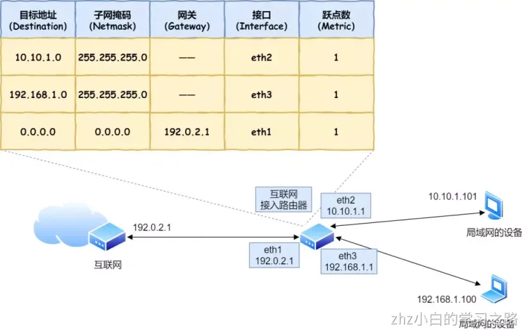
具体的工作流程根据上图，举个例子。
假设地址为 `10.10.1.101` 的计算机要向地址为 `192.168.1.100` 的服务器发送一个包，这个包先到达图中的路由器。
判断转发目标的第一步，就是根据包的接收方 IP 地址查询路由表中的目标地址栏，以找到相匹配的记录。
路由匹配和前面讲的一样，每个条目的子网掩码和 `192.168.1.100` IP 做 **& 与运算**后，得到的结果与对应条目的目标地址进行匹配，如果匹配就会作为候选转发目标，如果不匹配就继续与下个条目进行路由匹配。
如第二条目的子网掩码 `255.255.255.0` 与 `192.168.1.100` IP 做 **& 与运算**后，得到结果是 `192.168.1.0` ，这与第二条目的目标地址 `192.168.1.0` 匹配，该第二条目记录就会被作为转发目标。
实在找不到匹配路由时，就会选择**默认路由**，路由表中子网掩码为 `0.0.0.0` 的记录表示「默认路由」。

路由器的发送操作
接下来就会进入包的**发送操作**。
首先，我们需要根据**路由表的网关列**判断对方的地址。

- 如果网关是一个 IP 地址，则这个IP 地址就是我们要转发到的目标地址，**还未抵达终点**，还需继续需要路由器转发。
- 如果网关为空，则 IP 头部中的接收方 IP 地址就是要转发到的目标地址，也是就终于找到 IP 包头里的目标地址了，说明**已抵达终点**。

知道对方的 IP 地址之后，接下来需要通过 `ARP` 协议根据 IP 地址查询 MAC 地址，并将查询的结果作为接收方 MAC 地址。
路由器也有 ARP 缓存，因此首先会在 ARP 缓存中查询，如果找不到则发送 ARP 查询请求。
接下来是发送方 MAC 地址字段，这里填写输出端口的 MAC 地址。还有一个以太类型字段，填写 `0080` （十六进制）表示 IP 协议。
网络包完成后，接下来会将其转换成电信号并通过端口发送出去。这一步的工作过程和计算机也是相同的。
发送出去的网络包会通过**交换机**到达下一个路由器。由于接收方 MAC 地址就是下一个路由器的地址，所以交换机会根据这一地址将包传输到下一个路由器。
接下来，下一个路由器会将包转发给再下一个路由器，经过层层转发之后，网络包就到达了最终的目的地。
不知你发现了没有，在网络包传输的过程中，**源 IP 和目标 IP 始终是不会变的，一直变化的是 MAC 地址**，因为需要 MAC 地址在以太网内进行**两个设备**之间的包传输。

## 互相扒皮-服务器和客户端
数据包抵达了服务器，服务器肯定高兴呀，正所谓有朋自远方来，不亦乐乎？
服务器高兴的不得了，于是开始扒数据包的皮！就好像你收到快递，能不兴奋吗？
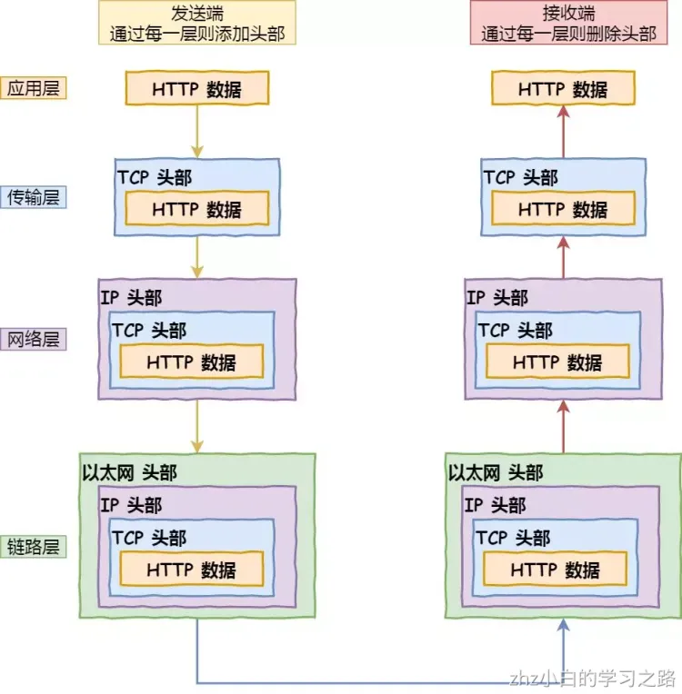
数据包抵达服务器后，服务器会先扒开数据包的 MAC 头部，查看是否和服务器自己的 MAC 地址符合，符合就将包收起来。
接着继续扒开数据包的 IP 头，发现 IP 地址符合，根据 IP 头中协议项，知道自己上层是 TCP 协议。
于是，扒开 TCP 的头，里面有序列号，需要看一看这个序列包是不是我想要的，如果是就放入缓存中然后返回一个 ACK，如果不是就丢弃。TCP头部里面还有端口号， HTTP 的服务器正在监听这个端口号。
于是，服务器自然就知道是 HTTP 进程想要这个包，于是就将包发给 HTTP 进程。
服务器的 HTTP 进程看到，原来这个请求是要访问一个页面，于是就把这个网页封装在 HTTP 响应报文里。
HTTP 响应报文也需要穿上 TCP、IP、MAC 头部，不过这次是源地址是服务器 IP 地址，目的地址是客户端 IP 地址。
穿好头部衣服后，从网卡出去，交由交换机转发到出城的路由器，路由器就把响应数据包发到了下一个路由器，就这样跳啊跳。
最后跳到了客户端的城门把手的路由器，路由器扒开 IP 头部发现是要找城内的人，于是把包发给了城内的交换机，再由交换机转发到客户端。
客户端收到了服务器的响应数据包后，同样也非常的高兴，客户能拆快递了！
于是，客户端开始扒皮，把收到的数据包的皮扒剩 HTTP 响应报文后，交给浏览器去渲染页面，一份特别的数据包快递，就这样显示出来了！
最后，客户端要离开了，向服务器发起了 TCP 四次挥手，至此双方的连接就断开了。
