# 第1章 操作系统概述
## 1.1 什么是操作系统

不知道你有没有产生过这些疑问：

- 桌面上的图标到底是啥？凭啥我在鼠标上一双击，就会出来一个美丽的画面？这都是从哪里跑出来的？
- 凭什么我在键盘上噼里啪啦地敲，某个位置就会显示我想要的那些字符？
- 电脑怎么知道我鼠标点击的是这个地方，又是怎么知道我要输入的是这个地方？
- 我在键盘上点“a”，是谁在显示器上画出“a”这个图像呢？
- 为什么我一回车，这些字符就发到遥远的另外一台机器上去了？

现代计算机系统由一个或多个处理器、主存、打印机、键盘、鼠标、显示器、网络接口以及各种输入/输出设备构成。

然而，程序员不会直接和这些硬件打交道，而且每位程序员不可能会掌握所有计算机系统的细节，这样我们就不用再编写代码了，所以在硬件的基础之上，计算机安装了一层软件，这层软件能够通过响应用户输入的指令达到控制硬件的效果，从而满足用户需求，这种软件称之为 `操作系统`，它的任务就是为用户程序提供一个更好、更简单、更清晰的计算机模型。
我们一般常见的操作系统主要有 **Windows、Linux、FreeBSD 或 OS X** ，这种带有图形界面的操作系统被称为 `图形用户界面(Graphical User Interface, GUI)`，而基于文本、命令行的通常称为 `Shell`。

这是一个操作系统的简化图，最下面的是硬件，硬件包括芯片、电路板、磁盘、键盘、显示器等我们上面提到的设备，在硬件之上是软件。大部分计算机有两种运行模式：`内核态` 和 `用户态`，软件中最基础的部分是`操作系统`，它运行在 `内核态` 中，内核态也称为 `管态` 和 `核心态`，它们都是操作系统的运行状态，只不过是不同的叫法而已。操作系统具有硬件的访问权，可以执行机器能够运行的任何指令。软件的其余部分运行在 `用户态` 下。

## 1.2 操作系统结构

### 1.2.1 Linux 内核 vs Windows 内核

Windows 和 Linux 可以说是我们比较常见的两款操作系统的。
Windows 基本占领了电脑时代的市场，商业上取得了很大成功，但是它并不开源，所以要想接触源码得加入 Windows 的开发团队中。

对于服务器使用的操作系统基本上都是 Linux，而且内核源码也是开源的，任何人都可以下载，并增加自己的改动或功能，Linux 最大的魅力在于，全世界有非常多的技术大佬为它贡献代码。
这两个操作系统各有千秋，不分伯仲。

操作系统核心的东西就是内核，这次我们就来看看，**Linux 内核和 Windows 内核有什么区别？**

### 1.2.2 内核

什么是内核呢？

计算机是由各种外部硬件设备组成的，比如内存、cpu、硬盘等，如果每个应用都要和这些硬件设备对接通信协议，那这样太累了。

所以，这个中间人就由内核来负责，**让内核作为应用连接硬件设备的桥梁**，应用程序只需关心与内核交互，不用关心硬件的细节。

内核有哪些能力呢？
现代操作系统，内核一般会提供 4 个基本能力：

- 管理进程、线程，决定哪个进程、线程使用 CPU，也就是进程调度的能力；
- 管理内存，决定内存的分配和回收，也就是内存管理的能力；
- 管理硬件设备，为进程与硬件设备之间提供通信能力，也就是硬件通信能力；
- 提供系统调用，如果应用程序要运行更高权限运行的服务，那么就需要有系统调用，它是用户程序与操作系统之间的接口。

内核是怎么工作的？

内核具有很高的权限，可以控制 cpu、内存、硬盘等硬件，而应用程序具有的权限很小，因此大多数操作系统，把内存分成了两个区域：

- 内核空间，这个内存空间只有内核程序可以访问；
- 用户空间，这个内存空间专门给应用程序使用；

用户空间的代码只能访问一个局部的内存空间，而内核空间的代码可以访问所有内存空间。
因此，当程序使用用户空间时，我们常说该程序在**用户态**执行，而当程序使内核空间时，程序则在**内核态**执行。

应用程序如果需要进入内核空间，就需要通过「系统调用」，下面来看看系统调用的过程：

内核程序执行在内核态，用户程序执行在用户态。当应用程序使用系统调用时，会产生一个中断。发生中断后， CPU 会中断当前在执行的用户程序，转而跳转到中断处理程序，也就是开始执行内核程序。内核处理完后，主动触发中断，把 CPU 执行权限交回给用户程序，回到用户态继续工作。

Linux 内核由如下几部分组成：内存管理、进程管理、设备驱动程序、文件系统和网络管理等。如图：

当今 Windows 7、Windows 10 使⽤的内核叫 Windows NT，NT 全称叫 New Technology。
下图是 Windows NT 的结构图⽚：

## 1.3 计算机启动过程

当你轻轻按下计算机的启动按钮时，你的主板就加上电了。

主板一般为矩形电路板，上面安装了组成计算机的主要电路系统，一般有 BIOS 芯片、I/O 控制芯片、键盘和面板控制开关接口、指示灯插接件、扩充插槽、主板及插卡的直流电源供电接插件等元件。

在主板上，有一个东西叫**ROM**（Read Only Memory，只读存储器）。这和咱们平常说的内存**RAM**（Random Access Memory，随机存取存储器）不同。

咱们平时买的内存条是可读可写的，这样才能保存计算结果。而 ROM 是只读的，上面早就固化了一些初始化的程序，也就是**BIOS**（Basic Input and Output System，基本输入输出系统）。

如果你自己安装过操作系统，刚启动的时候，按某个组合键，显示器会弹出一个蓝色的界面。能够调整启动顺序的系统，就是我说的 BIOS，然后我们就可以先执行它。

然后操作系统会询问 BIOS 获取配置信息。对于每个设备来说，会检查是否有设备驱动程序。如果没有，则会向用户询问是否需要插入 `CD-ROM` 驱动（由设备制造商提供）或者从 Internet 上下载。一旦有了设备驱动程序，操作系统会把它们加载到内核中，然后初始化表，创建所需的后台进程，并启动登录程序或GUI。

## 1.4 系统调用

你会发现，一个项目要想顺畅进行，需要用到公司的各种资源，比如说盖个公章、开个证明、申请个会议室、打印个材料等等。这里有个两难的权衡，一方面，资源毕竟是有限的，甚至是涉及机密的，不能由项目组滥取滥用；另一方面，就是效率，咱是一个私营企业，保证项目申请资源的时候只跑一次，这样才能比较高效。

为了平衡这一点，一方面涉及核心权限的资源，还是应该被公司严格把控，审批了才能用；另外一方面，为了提高效率，最好有个统一的办事大厅，明文列出提供哪些服务，谁需要可以来申请，然后就会有回应。

在操作系统中，也有同样的问题，例如多个进程都要往打印机上打印文件，如果随便乱打印进程，就会出现同样一张纸，第一行是 A 进程输出的文字，第二行是 B 进程输出的文字，全乱套了。所以，打印机的直接操作是放在操作系统内核里面的，进程不能随便操作。但是操作系统也提供一个办事大厅，也就是**系统调用**（System Call）。

系统调用也能列出来提供哪些接口可以调用，进程有需要的时候就可以去调用。这其中，立项是办事大厅提供的关键服务之一。同样，任何一个程序要想运行起来，就需要调用系统调用，创建进程。

如果一个进程在用户态下运行用户程序，例如从文件中读取数据。那么如果想要把控制权交给操作系统控制，那么必须执行一个异常指令或者系统调用指令。操作系统紧接着需要参数检查找出所需要的调用进程。

然后执行系统调用，把控制权移交给系统调用下面的指令。大致来说，系统调用就像是执行了一个特殊的过程调用，但是只有**系统调用能够进入内核态而过程调用则不能进入内核态**。

### 1.4.1 UNIX 系统调用

为了能够了解具体的调用过程，下面我们以 `read` 方法为例来看一下调用过程。

下面，我们会列出一些常用的 `POSIX` 系统调用，POSIX 系统调用大概有 100 多个，它们之中最重要的一些调用见下表

**进程管理**

| 调用                                 | 说明                     |
| ------------------------------------ | ------------------------ |
| pid = fork()                         | 创建与父进程相同的子进程 |
| pid = waitpid(pid, &statloc,options) | 等待一个子进程终止       |
| s = execve(name,argv,environp)       | 替换一个进程的核心映像   |
| exit(status)                         | 终止进程执行并返回状态   |

**文件管理**

| 调用                               | 说明                         |
| ---------------------------------- | ---------------------------- |
| fd = open(file, how,...)           | 打开一个文件使用读、写       |
| s = close(fd)                      | 关闭一个打开的文件           |
| n = read(fd,buffer,nbytes)         | 把数据从一个文件读到缓冲区中 |
| n = write(fd,buffer,nbytes)        | 把数据从缓冲区写到一个文件中 |
| position = iseek(fd,offset,whence) | 移动文件指针                 |
| s = stat(name,&buf)                | 取得文件状态信息             |

**目录和文件系统管理**

| 调用                         | 说明                                |
| ---------------------------- | ----------------------------------- |
| s = mkdir(nname,mode)        | 创建一个新目录                      |
| s = rmdir(name)              | 删去一个空目录                      |
| s = link(name1,name2)        | 创建一个新目录项 name2,并指向 name1 |
| s = unlink(name)             | 删去一个目录项                      |
| s = mount(special,name,flag) | 安装一个文件系统                    |
| s = umount(special)          | 卸载一个文件系统                    |

**其他**

| 调用                     | 说明                           |
| ------------------------ | ------------------------------ |
| s = chdir(dirname)       | 改变工作目录                   |
| s = chmod(name,mode)     | 修改一个文件的保护位           |
| s = kill(pid, signal)    | 发送信号给进程                 |
| seconds = time(&seconds) | 获取从 1970 年1月1日至今的时间 |

上面的系统调用参数中有一些公共部分，例如 pid 系统进程 id，fd 是文件描述符，n 是字节数，position 是在文件中的偏移量、seconds 是流逝时间。

### 1.4.2 Windows系统调用

UNIX 程序由执行某些操作或执行其他操作的代码组成，进行系统调用以执行某些服务。Windows 系统则不同，Windows 应用程序通常是由事件驱动的。主程序会等待一些事件发生，然后调用程序去处理。最简单的事件处理是键盘敲击和鼠标滑过，或者是鼠标点击，或者是插入 USB 驱动，然后操作系统调用处理器去处理事件，更新屏幕和更新程序内部状态。这是与 UNIX 不同的设计风格。

当然，Windows 也有系统调用。在 UNIX 中，系统调用（比如 read）和系统调用所使用的调用库（例如 read）几乎是一对一的关系。而在 Windows 中，情况则大不相同。首先，函数库的调用和实际的系统调用几乎是不对应的。微软定义了一系列过程，称为 `Win32应用编程接口(Application Programming Interface)`，程序员通过这套标准的接口来实现系统调用。这个接口支持从 Windows 95 版本以来所有的 Windows 版本。

Win32 API 有大量的调用，用来管理视窗、几何图形、文本、字体、滚动条、对话框、菜单以及 GUI 的其他功能。为了使图形子系统在内核态下运行，需要系统调用，否则就只有函数库调用。

我们把关注点放在和 Win32 系统调用中来，我们可以简单看一下 Win32 API 中的系统调用和 UNIX 中有什么不同（并不是所有的系统调用）

# 第2章 内存管理

## 2.1 虚拟内存

如果你是电子相关专业的，肯定在大学里捣鼓过单片机。
单片机是没有操作系统的，所以每次写完代码，都需要借助工具把程序烧录进去，这样程序才能跑起来。
另外，**单片机的 CPU 是直接操作内存的「物理地址」**。

在这种情况下，要想在内存中同时运行两个程序是不可能的。如果第一个程序在 2000 的位置写入一个新的值，将会擦掉第二个程序存放在相同位置上的所有内容，所以同时运行两个程序是根本行不通的，这两个程序会立刻崩溃。

操作系统如何解决这个问题呢？

这里关键的问题是这两个程序都引用了绝对物理地址，而这正是我们最需要避免的。

我们可以把进程所使用的地址「隔离」开来，即让操作系统为每个进程分配独立的一套「**虚拟地址**」，人人都有，大家自己玩自己的地址就行，互不干涉。但是有个前提每个进程都不能访问物理地址，至于虚拟地址最终怎么落到物理内存里，对进程来说是透明的，操作系统已经把这些都安排的明明白白了。

**操作系统会提供一种机制，将不同进程的虚拟地址和不同内存的物理地址映射起来。**

如果程序要访问虚拟地址的时候，由操作系统转换成不同的物理地址，这样不同的进程运行的时候，写入的是不同的物理地址，这样就不会冲突了。

于是，这里就引出了两种地址的概念：

- 我们程序所使用的内存地址叫做**虚拟内存地址**（_Virtual Memory Address_）
- 实际存在硬件里面的空间地址叫**物理内存地址**（_Physical Memory Address_）。

操作系统引入了虚拟内存，进程持有的虚拟地址会通过 CPU 芯片中的内存管理单元（MMU）的映射关系，来转换变成物理地址，然后再通过物理地址访问内存，如下图所示：

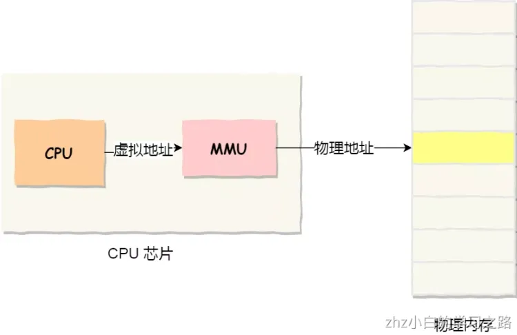
操作系统如何管理虚拟地址和物理地址之间的关系呢？

主要有两种方式，分别是**内存分段和内存分页**，分段是比较早提出的，我们先来看看内存分段。

## 2.2 内存分段

程序是由若干个逻辑分段组成的，如可由代码分段、数据分段、栈段、堆段组成。**不同的段是有不同的属性的，所以就用分段（_Segmentation_）的形式把这些段分离出来。**

分段机制下，虚拟地址和物理地址如何映射？

分段机制下的虚拟地址由两部分组成，**段选择子**和**段内偏移量**。
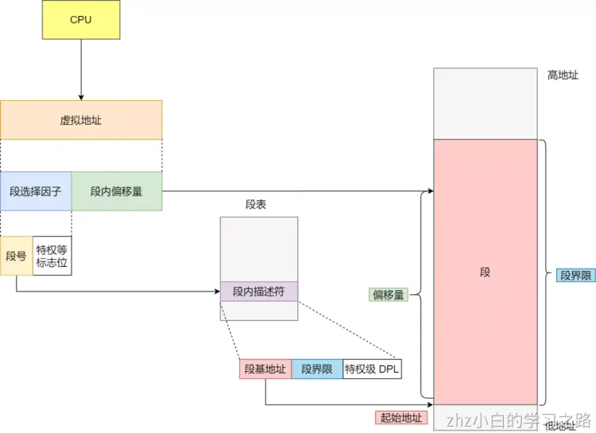
- **段选择子**就保存在段寄存器里面。段选择子里面最重要的是**段号**，用作段表的索引。**段表**里面保存的是这个**段的基地址、段的界限和特权等级**等。

- 虚拟地址中的**段内偏移量**应该位于 0 和段界限之间，如果段内偏移量是合法的，就将段基地址加上段内偏移量得到物理内存地址。

在上面了，知道了虚拟地址是通过**段表**与物理地址进行映射的，分段机制会把程序的虚拟地址分成 4 个段，每个段在段表中有一个项，在这一项找到段的基地址，再加上偏移量，于是就能找到物理内存中的地址，如下图：
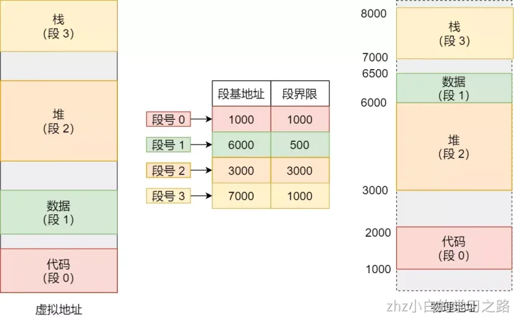
如果要访问段 3 中偏移量 500 的虚拟地址，我们可以计算出物理地址为，段 3 基地址 7000 + 偏移量 500 = 7500。

分段的办法很好，解决了程序本身不需要关心具体的物理内存地址的问题，但它也有一些不足之处：

- 第一个就是**内存碎片**的问题。
- 第二个就是**内存交换的效率低**的问题。

接下来，说说为什么会有这两个问题。

我们来看这样一个例子。我现在手头的这台电脑，有 1GB 的内存。我们先启动一个图形渲染程序，占用了 512MB 的内存，接着启动一个 Chrome 浏览器，占用了 128MB 内存，再启动一个 Python 程序，占用了 256MB 内存。这个时候，我们关掉 Chrome，于是空闲内存还有 1024 - 512 - 256 = 256MB。按理来说，我们有足够的空间再去装载一个 200MB 的程序。但是，这 256MB 的内存空间不是连续的，而是被分成了两段 128MB 的内存。因此，实际情况是，我们的程序没办法加载进来。
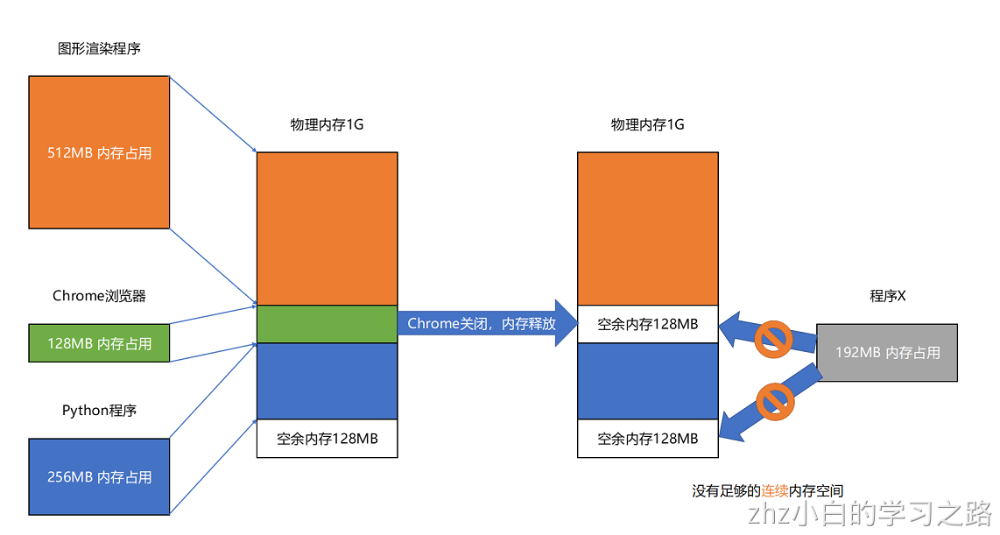
当然，这个我们也有办法解决。解决的办法叫**内存交换**（Memory Swapping）。

我们可以把 Python 程序占用的那 256MB 内存写到硬盘上，然后再从硬盘上读回来到内存里面。不过读回来的时候，我们不再把它加载到原来的位置，而是紧紧跟在那已经被占用了的 512MB 内存后面。这样，我们就有了连续的 256MB 内存空间，就可以去加载一个新的 200MB 的程序。如果你自己安装过 Linux 操作系统，你应该遇到过分配一个 swap 硬盘分区的问题。这块分出来的磁盘空间，其实就是专门给 Linux 操作系统进行内存交换用的。

虚拟内存、分段，再加上内存交换，看起来似乎已经解决了计算机同时装载运行很多个程序的问题。不过，你千万不要大意，这三者的组合仍然会遇到一个性能瓶颈。硬盘的访问速度要比内存慢很多，而每一次内存交换，我们都需要把一大段连续的内存数据写到硬盘上。所以，如果内存交换的时候，交换的是一个很占内存空间的程序，这样整个机器都会显得卡顿。

为了解决内存分段的内存碎片和内存交换效率低的问题，就出现了内存分页。

## 2.3 内存分页

分段的好处就是能产生连续的内存空间，但是会出现内存碎片和内存交换的空间太大的问题。

要解决这些问题，那么就要想出能少出现一些内存碎片的办法。另外，当需要进行内存交换的时候，让需要交换写入或者从磁盘装载的数据更少一点，这样就可以解决问题了。这个办法，也就是**内存分页**（_Paging_）。

**分页是把整个虚拟和物理内存空间切成一段段固定尺寸的大小**。这样一个连续并且尺寸固定的内存空间，我们叫**页**（_Page_）。在 Linux 下，每一页的大小为 `4KB`。

虚拟地址与物理地址之间通过**页表**来映射，如下图：

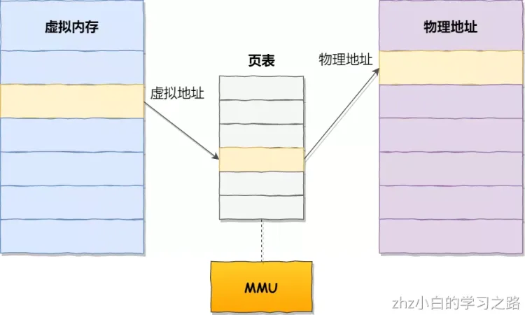
页表实际上存储在 CPU 的**内存管理单元** （_MMU_） 中，于是 CPU 就可以直接通过 MMU，找出要实际要访问的物理内存地址。

而当进程访问的虚拟地址在页表中查不到时，系统会产生一个**缺页异常**，进入系统内核空间分配物理内存、更新进程页表，最后再返回用户空间，恢复进程的运行。

分页怎么解决分段的内存碎片、内存交换效率低的问题？

由于内存空间都是预先划分好的，也就不会像分段会产生间隙非常小的内存，这正是分段会产生内存碎片的原因。而**采用了分页，那么释放的内存都是以页为单位释放的，也就不会产生无法给进程使用的小内存。**

如果内存空间不够，操作系统会把其他正在运行的进程中的「最近没被使用」的内存页面给释放掉，也就是暂时写在硬盘上，称为**换出**（_Swap Out_）。一旦需要的时候，再加载进来，称为**换入**（_Swap In_）。所以，一次性写入磁盘的也只有少数的一个页或者几个页，不会花太多时间，**内存交换的效率就相对比较高。**
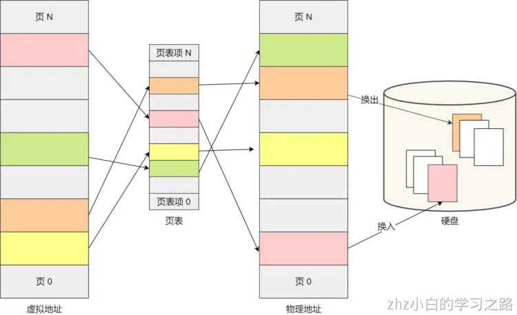
更进一步地，分页的方式使得我们在加载程序的时候，不再需要一次性都把程序加载到物理内存中。我们完全可以在进行虚拟内存和物理内存的页之间的映射之后，并不真的把页加载到物理内存里，而是**只有在程序运行中，需要用到对应虚拟内存页里面的指令和数据时，再加载到物理内存里面去。**

分页机制下，虚拟地址和物理地址是如何映射的？

在分页机制下，虚拟地址分为两部分，**页号**和**页内偏移**。页号作为页表的索引，**页表**包含物理页每页所在**物理内存的基地址**，这个基地址与页内偏移的组合就形成了物理内存地址，见下图。
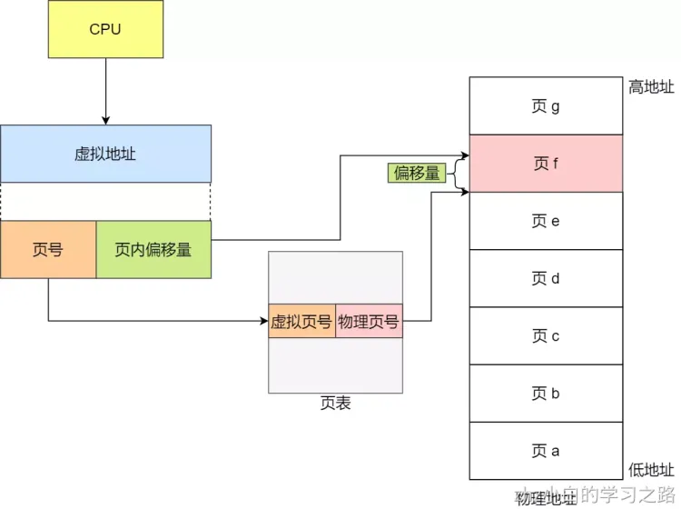
总结一下，对于一个内存地址转换，其实就是这样三个步骤：

- 把虚拟内存地址，切分成页号和偏移量；
- 根据页号，从页表里面，查询对应的物理页号；
- 直接拿物理页号，加上前面的偏移量，就得到了物理内存地址。

下面举个例子，虚拟内存中的页通过页表映射为了物理内存中的页，如下图：
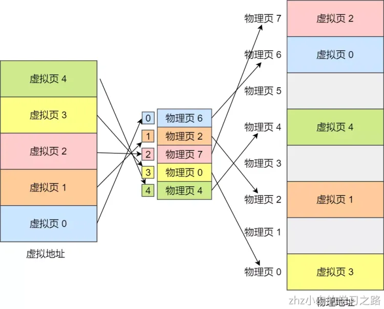
### 2.3.1 简单分页

简单的分页有什么缺陷呢？

有空间上的缺陷。

因为操作系统是可以同时运行非常多的进程的，那这不就意味着页表会非常的庞大。
在 32 位的环境下，虚拟地址空间共有 4GB，假设一个页的大小是 4KB（2^12），那么就需要大约 100 万 （2^20） 个页，每个「页表项」需要 4 个字节大小来存储，那么整个 4GB 空间的映射就需要有 `4MB` 的内存来存储页表。

这 4MB 大小的页表，看起来也不是很大。但是要知道每个进程都是有自己的虚拟地址空间的，也就说都有自己的页表。

那么，`100` 个进程的话，就需要 `400MB` 的内存来存储页表，这是非常大的内存了，更别说 64 位的环境了。

### 2.3.2 多级页表

要解决上面的问题，就需要采用的是一种叫作**多级页表**（_Multi-Level Page Table_）的解决方案。

在前面我们知道了，对于单页表的实现方式，在 32 位和页大小 `4KB` 的环境下，一个进程的页表需要装下 100 多万个「页表项」，并且每个页表项是占用 4 字节大小的，于是相当于每个页表需占用 4MB 大小的空间。

我们把这个 100 多万个「页表项」的单级页表再分页，将页表（一级页表）分为 `1024` 个页表（二级页表），每个表（二级页表）中包含 `1024` 个「页表项」，形成**二级分页**。如下图所示：
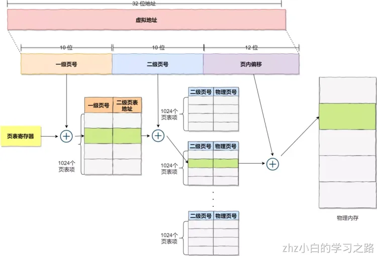
你可能会问，分了二级表，映射 4GB 地址空间就需要 4KB（一级页表）+ 4MB（二级页表）的内存，这样占用空间不是更大了吗？

当然如果 4GB 的虚拟地址全部都映射到了物理内上的，二级分页占用空间确实是更大了，但是，我们往往不会为一个进程分配那么多内存。

其实我们应该换个角度来看问题，还记得计算机组成原理里面无处不在的**局部性原理**么？

每个进程都有 4GB 的虚拟地址空间，而显然对于大多数程序来说，其使用到的空间远未达到 4GB，因为会存在部分对应的页表项都是空的，根本没有分配，对于已分配的页表项，如果存在最近一定时间未访问的页表，在物理内存紧张的情况下，操作系统会将页面换出到硬盘，也就是说不会占用物理内存。

如果使用了二级分页，一级页表就可以覆盖整个 4GB 虚拟地址空间，但**如果某个一级页表的页表项没有被用到，也就不需要创建这个页表项对应的二级页表了，即可以在需要时才创建二级页表**。做个简单的计算，假设只有 20% 的一级页表项被用到了，那么页表占用的内存空间就只有 4KB（一级页表） + 20% * 4MB（二级页表）= `0.804MB`
，这对比单级页表的 `4MB` 是不是一个巨大的节约？

那么为什么不分级的页表就做不到这样节约内存呢？我们从页表的性质来看，保存在内存中的页表承担的职责是将虚拟地址翻译成物理地址。假如虚拟地址在页表中找不到对应的页表项，计算机系统就不能工作了。所以**页表一定要覆盖全部虚拟地址空间，不分级的页表就需要有 100 多万个页表项来映射，而二级分页则只需要 1024 个页表项**（此时一级页表覆盖到了全部虚拟地址空间，二级页表在需要时创建）。

我们把二级分页再推广到多级页表，就会发现页表占用的内存空间更少了，这一切都要归功于对局部性原理的充分应用。

对于 64 位的系统，两级分页肯定不够了，就变成了四级目录，分别是：

- 全局页目录项 PGD（_Page Global Directory_）；
- 上层页目录项 PUD（_Page Upper Directory_）；
- 中间页目录项 PMD（_Page Middle Directory_）；
- 页表项 PTE（_Page Table Entry_）；

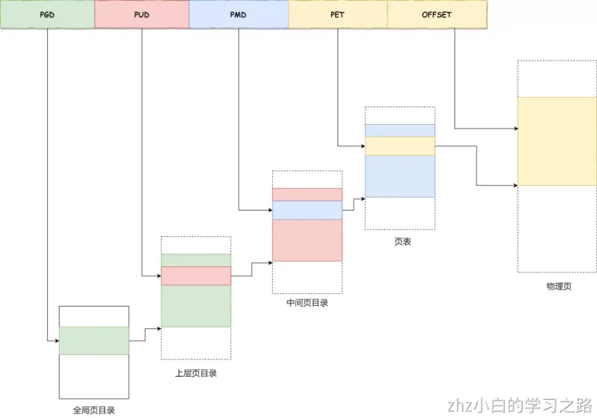
### 2.3.3 页表缓存TLB（Translation Lookaside Buffer）

多级页表虽然解决了空间上的问题，但是虚拟地址到物理地址的转换就多了几道转换的工序，这显然就降低了这俩地址转换的速度，也就是带来了时间上的开销。

程序是有局部性的，即在一段时间内，整个程序的执行仅限于程序中的某一部分。相应地，执行所访问的存储空间也局限于某个内存区域。

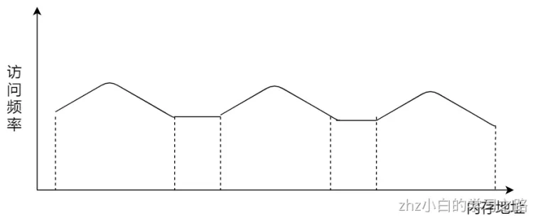
我们就可以利用这一特性，把最常访问的几个页表项存储到访问速度更快的硬件，于是计算机科学家们，就在 CPU 芯片中，加入了一个专门存放程序最常访问的页表项的 Cache，这个 Cache 就是 TLB（_Translation Lookaside Buffer_） ，通常称为页表缓存、转址旁路缓存、快表等。

在 CPU 芯片里面，封装了内存管理单元（_Memory Management Unit_）芯片，它用来完成地址转换和 TLB 的访问与交互。

有了 TLB 后，那么 CPU 在寻址时，会先查 TLB，如果没找到，才会继续查常规的页表。

TLB 的命中率其实是很高的，因为程序最常访问的页就那么几个。

## 2.4 Linux内存管理

逻辑地址和线性地址：

- 程序所使用的地址，通常是没被段式内存管理映射的地址，称为逻辑地址；
- 通过段式内存管理映射的地址，称为线性地址，也叫虚拟地址；

逻辑地址是「段式内存管理」转换前的地址，线性地址则是「页式内存管理」转换前的地址。

**Linux 内存主要采用的是页式内存管理，但同时也不可避免地涉及了段机制**。

这主要是上面 Intel 处理器发展历史导致的，因为 Intel X86 CPU 一律对程序中使用的地址先进行段式映射，然后才能进行页式映射。既然 CPU 的硬件结构是这样，Linux 内核也只好服从 Intel 的选择。

但是事实上，Linux 内核所采取的办法是使段式映射的过程实际上不起什么作用。也就是说，“上有政策，下有对策”，若惹不起就躲着走。

Linux 系统中的每个段都是从 0 地址开始的整个 4GB 虚拟空间（32 位环境下），也就是所有的段的起始地址都是一样的。这意味着，Linux 系统中的代码，包括操作系统本身的代码和应用程序代码，所面对的地址空间都是线性地址空间（虚拟地址），这种做法相当于屏蔽了处理器中的逻辑地址概念，段只被用于访问控制和内存保护。

我们再来瞧一瞧，Linux 的虚拟地址空间是如何分布的？

在 Linux 操作系统中，虚拟地址空间的内部又被分为**内核空间和用户空间**两部分，不同位数的系统，地址空间的范围也不同。比如最常见的 32 位和 64 位系统，如下所示：

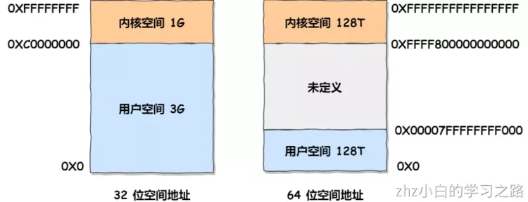
通过这里可以看出：

- `32` 位系统的内核空间占用 `1G`，位于最高处，剩下的 `3G` 是用户空间；
- `64` 位系统的内核空间和用户空间都是 `128T`，分别占据整个内存空间的最高和最低处，剩下的中间部分是未定义的。

再来说说，内核空间与用户空间的区别：

- 进程在用户态时，只能访问用户空间内存；
- 只有进入内核态后，才可以访问内核空间的内存；

虽然每个进程都各自有独立的虚拟内存，但是**每个虚拟内存中的内核地址，其实关联的都是相同的物理内存**。这样，进程切换到内核态后，就可以很方便地访问内核空间内存。

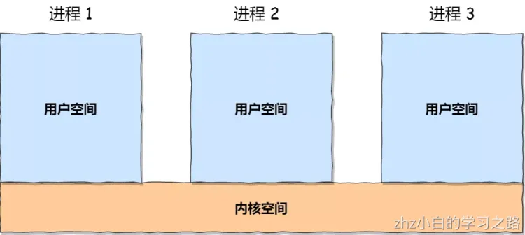
接下来，进一步了解虚拟空间的划分情况，用户空间和内核空间划分的方式是不同的，内核空间的分布情况就不多说了。

我们看看用户空间分布的情况，以 32 位系统为例，我画了一张图来表示它们的关系：
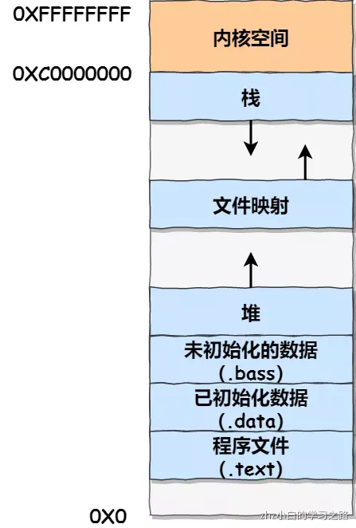
通过这张图你可以看到，用户空间内存，从**低到高**分别是 7 种不同的内存段：

- 程序文件段，包括二进制可执行代码；
- 已初始化数据段，包括静态常量；
- 未初始化数据段，包括未初始化的静态变量；
- 堆段，包括动态分配的内存，从低地址开始向上增长；
- 文件映射段，包括动态库、共享内存等，从低地址开始向上增长（跟硬件和内核版本有关）
- 栈段，包括局部变量和函数调用的上下文等。栈的大小是固定的，一般是 `8 MB`。当然系统也提供了参数，以便我们自定义大小；

在这 7 个内存段中，堆和文件映射段的内存是动态分配的。比如说，使用 C 标准库的 `malloc()` 或者 `mmap()` ，就可以分别在堆和文件映射段动态分配内存。

# 第3章、进程和线程
## 3.1 进程

### 3.1.1 进程的概念

我们编写的代码只是一个存储在硬盘的静态文件，通过编译后就会生成二进制可执行文件，当我们运行这个可执行文件后，它会被装载到内存中，接着 CPU 会执行程序中的每一条指令，那么这个**运行中的程序，就被称为「进程」**。
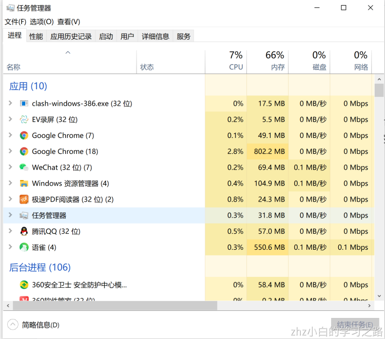
我们把操作系统做某件事，抽象成一种概念，称之为一个任务。一个进程可以对应一个任务，也可以对应多个任务。
早期的计算机只有一个 CPU，多个任务需要运行怎么办？需要**依次排队等待，串行执行，一个任务执行完毕，才能执行下一个**。这种方式存在着明显的弊端，假设排在前面的 A 任务需要执行5小时，而排后面的B任务仅需要1分钟，那么 B 任务必须等待 A 任务5小时完成后，才能执行，这种方式显得极其不灵活。
后来就有了多任务系统，在CPU同一时间只能处理一个任务的前提下，每个任务有一定的执行时长，比如任务A执行0.001s，切换到任务B执行0.05s，再切换到任务C执行0.01s...不断循环。这种机制也就可以在一定程度上解决上述任务B需要长时间等待的问题。
由于 CPU 速度非常快，这种多个任务不断切换，会给用户一种任务并行执行的错觉，这种也被称为是伪并行调度。既然有伪并行，那么也会有真并行。在现代计算机中，常见的CPU核数可以达到8核甚至更多，操作系统可将每一个核视为一个CPU，那么8核CPU就可以真并行执行8个任务。
并发和并行有什么区别？
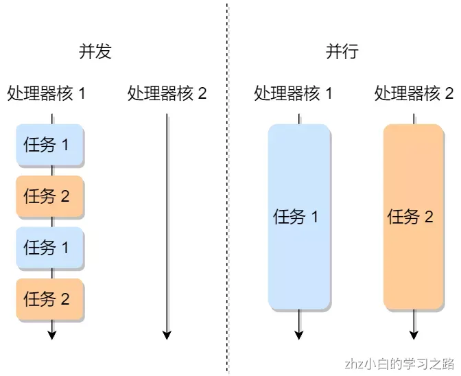
伪并行虽然可以解决上述任务等待的问题，但是依然还存在一系列未解之谜：

- 每个任务应该执行多长时间？
- 如何找到要执行的下一个任务？
- 有些任务涉及了资源操作，执行到一半，切换任务，那么这些资源怎么办？

为了解决上面一系列谜题，我们需要一种模型对任务进行详尽的描述记录。

### 3.1.2 进程的状态

那么什么原因会导致进程会被创建，从而生成PCB呢？常见的有以下几种

1. 系统初始化
2. 用户通过系统提供的API创建新进程
3. 批处理作业初始化 (什么是批处理作业)
4. 由现有进程派生子进程

一个进程，因为某种原因被创建了，那么它可以按照以下步骤进行一系列的初始化

1. 给新进程分配一个进程ID
2. 分配内存空间
3. 初始化PCB
4. 进入就绪队列

#### 3.1.2.1 五状态模型

就绪 -> 运行：当操作系统内存在着调度程序，当需要运行一个新进程时，调度程序选择一个就绪态的进程，让其进入运行态。
运行 -> 就绪：运行态的进程，会占有CPU（参照一开始的饼状图）。每个进程会被分配一定的执行时间，当时间结束后，重新回到就绪态。
运行 -> 阻塞：进程请求调用系统的某些服务，但是操作系统没法立即给它（比如这种服务可能要耗时初始化，比如I/O资源需要等待），那么它就会进入阻塞态。
阻塞 -> 就绪：当等待结束了，就由阻塞态进入就绪态。
运行 -> 终止：当进程表示自己已经完成了，它会被操作系统终止。

这便是对于单个进程，经典的五状态模型。当存在多个进程时，由于同一时间只能有一个进程在执行，那么如何去管理这一系列的处于阻塞态和就绪态的进程呢？一般来说，会使用就绪队列，和阻塞队列，让处于阻塞态和就绪态的进程进入队列，排队执行。

#### 3.1.2.2 七状态模型

一旦排队的进程多了，对于有限的内存空间将会是极大的考验。为了解决内存占用问题，可以将一部分内存中的进程交换到磁盘中，这些被交换到磁盘的进程，会进入挂起状态
挂起状态可以分为两种：

- 阻塞挂起状态：进程在外存（硬盘）并等待某个事件的出现；
- 就绪挂起状态：进程在外存（硬盘），但只要进入内存，即刻立刻运行；

这两种挂起状态加上前面的五种状态，就变成了七种状态变迁，见如下图：

### 3.1.3 进程的控制结构

对于一个被执行的程序，操作系统会为该程序创建一个进程。进程作为一种抽象概念，可将其视为一个容器，该容器聚集了相关资源，包括地址空间，线程，打开的文件，保护许可等。而操作系统本身是一个程序，有一句经典的话 程序 = 算法 + 数据结构，因此对于单个进程，可以基于一种数据结构来表示它，这种数据结构称之为进程控制块(PCB)
在操作系统中，是用**进程控制块**（_process control block，PCB_）数据结构来描述进程的。
**PCB 是进程存在的唯一标识**，这意味着一个进程的存在，必然会有一个 PCB，如果进程消失了，那么 PCB 也会随之消失。
PCB 具体包含什么信息呢？
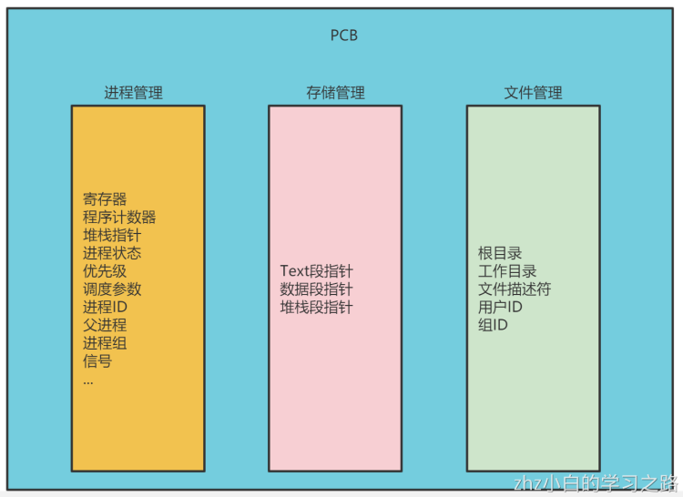
每个 PCB 是如何组织的呢？
通常是通过**链表**的方式进行组织，把具有**相同状态的进程链在一起，组成各种队列**。比如：

- 将所有处于就绪状态的进程链在一起，称为**就绪队列**；
- 把所有因等待某事件而处于等待状态的进程链在一起就组成各种**阻塞队列**；
- 另外，对于运行队列在单核 CPU 系统中则只有一个运行指针了，因为单核 CPU 在某个时间，只能运行一个程序。

那么，就绪队列和阻塞队列链表的组织形式如下图：

除了链接的组织方式，还有索引方式，它的工作原理：将同一状态的进程组织在一个索引表中，索引表项指向相应的 PCB，不同状态对应不同的索引表。
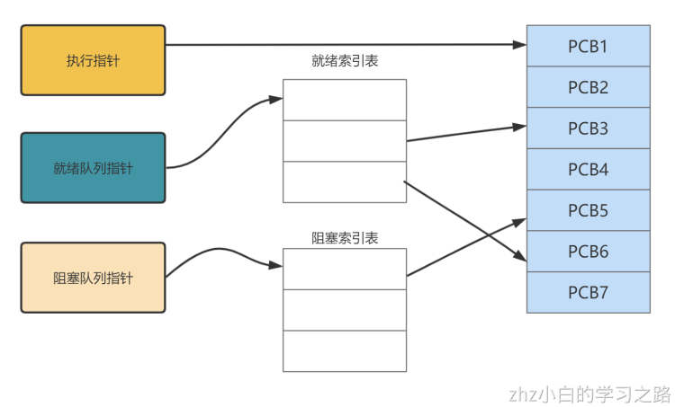
一般会选择链表，因为可能面临进程创建，销毁等调度导致进程状态发生变化，所以链表能够更加灵活的插入和删除。

### 3.1.4 进程的切换

当一个正在运行中的进程被中断，操作系统指定另一个就绪态的进程进入运行态，这个过程就是进程切换，也可以叫上下文切换。
该切换过程一般涉及以下步骤：
1.保存处理器上下文环境：将CPU程序计数器和寄存器的值保存到当前进程的私有堆栈里
2.更新当前进程的PCB（包括状态更变）
3.将当前进程移到就绪队列或者阻塞队列
4.根据调度算法，选择就绪队列中一个合适的新进程，将其更改为运行态
5.更新内存管理的数据结构
6.新进程内对堆栈所保存的上下文信息载入到CPU的寄存器和程序计数器，占有CPU

发生进程上下文切换有哪些场景？

- 为了保证所有进程可以得到公平调度，CPU 时间被划分为一段段的时间片，这些时间片再被轮流分配给各个进程。这样，当某个进程的时间片耗尽了，就会被系统挂起，切换到其它正在等待 CPU 的进程运行；
- 进程在系统资源不足（比如内存不足）时，要等到资源满足后才可以运行，这个时候进程也会被挂起，并由系统调度其他进程运行；
- 当进程通过睡眠函数 sleep 这样的方法将自己主动挂起时，自然也会重新调度；
- 当有优先级更高的进程运行时，为了保证高优先级进程的运行，当前进程会被挂起，由高优先级进程来运行；
- 发生硬件中断时，CPU 上的进程会被中断挂起，转而执行内核中的中断服务程序；

以上，就是发生进程上下文切换的常见场景了。

## 3.2 线程

在早期的操作系统中都是以进程作为独⽴运⾏的基本单位，直到后⾯，计算机科学家们⼜提出了更⼩的能独⽴运⾏的基本单位，也就是线程。

### 3.2.1 什么是线程？

线程是进程当中的⼀条执⾏流程。
同⼀个进程内多个线程之间可以共享代码段、数据段、打开的⽂件等资源，但每个线程各⾃都有⼀套独⽴的寄存器和栈，这样可以确保线程的控制流是相对独⽴的。
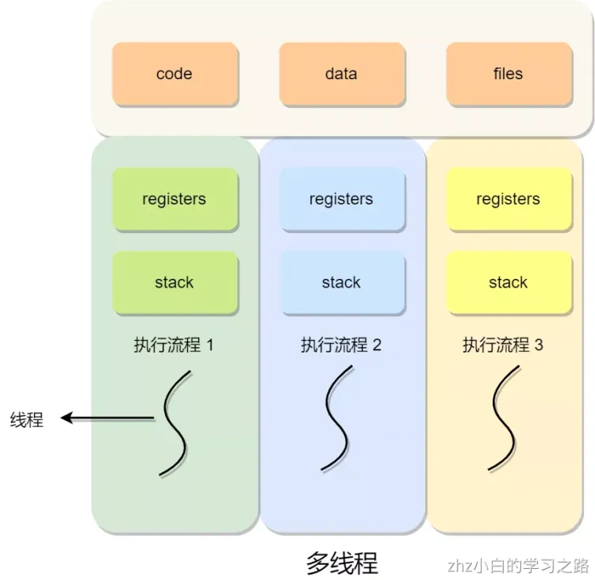
我们一开始提及过，操作系统底层存在调度程序，调度程序可调度任务，而单线程进程，每个进程可以对应一个任务。现在，对于多线程的进程，每一个线程最终对于调度程序来说，都是一个任务，如下图（Linux系统）。因此也有一种流行的说法**线程是CPU调度的基本单位**
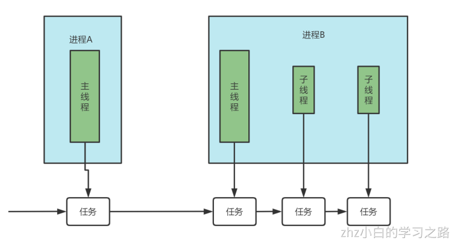
## 3.3 线程的上下文切换

线程与进程最大的区别在于：**线程是调度的基本单位，而进程则是资源拥有的基本单位**。
所以，所谓操作系统的任务调度，实际上的调度对象是线程，而进程只是给线程提供了虚拟内存、全局变量等资源。
对于线程和进程，我们可以这么理解：

- 当进程只有一个线程时，可以认为进程就等于线程；
- 当进程拥有多个线程时，这些线程会共享相同的虚拟内存和全局变量等资源，这些资源在上下文切换时是不需要修改的；

另外，线程也有自己的私有数据，比如栈和寄存器等，这些在上下文切换时也是需要保存的。

线程上下文切换的是什么？
这还得看线程是不是属于同一个进程：

- 当两个线程不是属于同一个进程，则切换的过程就跟进程上下文切换一样；
- **当两个线程是属于同一个进程，因为虚拟内存是共享的，所以在切换时，虚拟内存这些资源就保持不动，只需要切换线程的私有数据、寄存器等不共享的数据**；

所以，线程的上下文切换相比进程，开销要小很多。

## 3.4 进程调度

进程都希望自己能够占用 CPU 进行工作，那么这涉及到前面说过的进程上下文切换。

一旦操作系统把进程切换到运行状态，也就意味着该进程占用着 CPU 在执行，但是当操作系统把进程切换到其他状态时，那就不能在 CPU 中执行了，于是操作系统会选择下一个要运行的进程。

选择一个进程运行这一功能是在操作系统中完成的，通常称为**调度程序**（_scheduler_）。

那到底什么时候调度进程，或以什么原则来调度进程呢？

### 3.4.1 什么时候调度进程

在进程的生命周期中，当进程从一个运行状态到另外一状态变化的时候，其实会触发一次调度。
比如，以下状态的变化都会触发操作系统的调度：

- _从就绪态 -> 运行态_：当进程被创建时，会进入到就绪队列，操作系统会从就绪队列选择一个进程运行；
- _从运行态 -> 阻塞态_：当进程发生 I/O 事件而阻塞时，操作系统必须另外一个进程运行；
- _从运行态 -> 结束态_：当进程退出结束后，操作系统得从就绪队列选择另外一个进程运行；

因为，这些状态变化的时候，操作系统需要考虑是否要让新的进程给 CPU 运行，或者是否让当前进程从 CPU 上退出来而换另一个进程运行。
另外，如果硬件时钟提供某个频率的周期性中断，那么可以根据如何处理时钟中断
，把调度算法分为两类：

- **非抢占式调度算法**挑选一个进程，然后让该进程运行直到被阻塞，或者直到该进程退出，才会调用另外一个进程，也就是说不会理时钟中断这个事情。
- **抢占式调度算法**挑选一个进程，然后让该进程只运行某段时间，如果在该时段结束时，该进程仍然在运行时，则会把它挂起，接着调度程序从就绪队列挑选另外一个进程。这种抢占式调度处理，需要在时间间隔的末端发生**时钟中断**，以便把 CPU 控制返回给调度程序进行调度，也就是常说的**时间片机制**。

### 3.4.2 以什么原则来调度进程

五种调度原则：

- **CPU 利用率**：调度程序应确保 CPU 是始终匆忙的状态，这可提高 CPU 的利用率；
- **系统吞吐量**：吞吐量表示的是单位时间内 CPU 完成进程的数量，长作业的进程会占用较长的 CPU 资源，因此会降低吞吐量，相反，短作业的进程会提升系统吞吐量；
- **周转时间**：周转时间是进程运行和阻塞时间总和，一个进程的周转时间越小越好；
- **等待时间**：这个等待时间不是阻塞状态的时间，而是进程处于就绪队列的时间，等待的时间越长，用户越不满意；
- **响应时间**：用户提交请求到系统第一次产生响应所花费的时间，在交互式系统中，响应时间是衡量调度算法好坏的主要标准。

说白了，这么多调度原则，目的就是要使得进程要「快」。

### 3.4.3 进程调度算法

常见的进程调度算法有：

- 先来先服服务
- 时间片轮转
- 最短作业优先
- 最短剩余时间优先
- 优先级调度
- 多级反馈队列调度

#### 3.4.3.1 先来先服务

先来先服务（First Come First Serverd, FCFS）。先进就绪队列，则先被调度，先来先服务是最简单的调度算法。

先来先服务存在上面谈论过的问题：当前面任务耗费很长时间执行，那么后面的任务即使只需要执行很短的时间，也必须一直等待。属于非抢占式

#### 3.4.3.2 时间片轮转调度

每一个进程会被分配一个时间片，表示允许该进程在这个时间段运行，如果时间结束了，进程还没运行完毕，那么会通过抢占式调度，将CPU分配给其他进程，该进程回到就绪队列。这是一种最简单最公平的调度算法，但是有可能会存在问题。由于进程的切换，需要耗费时间，如果时间片太短，频繁进行切换，会影响效率。如果进程时间片太长，有可能导致排后面的进程等待太长时间。因此时间片的长度，需要有大致合理的数值。（《现代操作系统》的观点是建议时间片长度在20ms~50ms）。
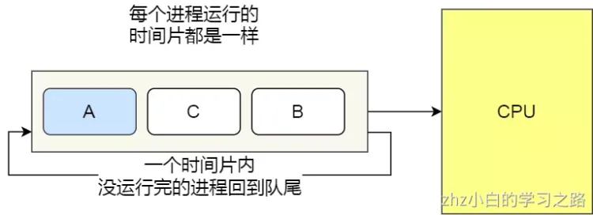
#### 3.4.3.3 最短作业优先

最短作业优先（Shortest Job First, SJF），顾名思义即进程按照作业时间长短排队，作业时间段的排前面先执行，如 下图。
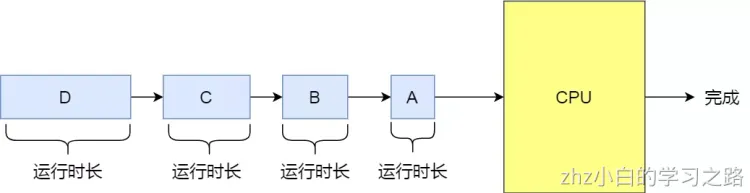
这显然对长作业不利，很容易造成一种极端现象。
比如，一个长作业在就绪队列等待运行，而这个就绪队列有非常多的短作业，那么就会使得长作业不断的往后推，周转时间变长，致使长作业长期不会被运行。

#### 3.4.3.4 最短剩余时间优先

最短剩余时间优先（Shortest Remaining Time Next），从就绪队列中选择剩余时间最短的进程进行调度。该算法可以理解最短作业优先和时间片轮转的结合。如果没有时间片，那么最短剩余时间其实就是最短作业时间，因为每个进程都是从头执行到尾。

#### 3.4.3.5 优先级调度

假设就绪队列中有如下进程

| 进程 | 执行时间 | 优先级 |
| ---- | -------- | ------ |
| p1   | 5        | 1      |
| p2   | 2        | 3      |
| p3   | 3        | 2      |

按照优先级调度，执行顺序为p1->p3->p2。如果多个进程优先级相同，则按照先来先服务的方式依次执行。
优先级调度可以进一步细分为抢占式和非抢占式。
非抢占式：和上面提及的非抢占式类似，一旦该进程占有CPU就将一直执行到结束或者阻塞。
抢占式：进程执行期间，一旦有更高优先级的进程进入就绪队列，那么该进程就会被暂停，重回就绪队列，让更高优先级的进程执行。但是为了防止最高优先级进程一直执行，每个进程依然有自己的时间片，每次时间片结束后，会根据一定规则降低该进程优先级，避免某些最高优先级长作业进程一直占用CPU。

但是依然有缺点，可能会导致低优先级的进程永远不会运行。

#### 3.4.3.6 多级反馈队列调度

多级反馈队列调度基于时间片轮转和优先级调度，设置多个就绪队列，赋予每个就绪队列优先级，优先级越高的队列进程的时间片越短。如下图，第1级就绪队列优先级最高，进程的时间片长度最短，第2级就绪队列次之，以此类推。
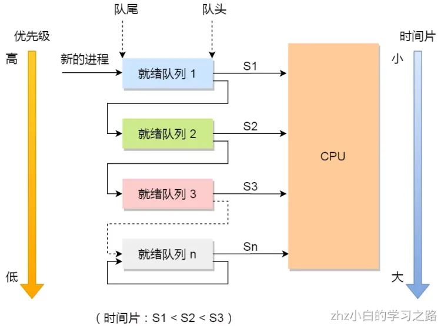
当有新的进程创建时，先进入第1级就绪队列，时间片结束之前就运行完毕，则终止，否则进入第2级队列等待下一次调度。在n级队列之前，进程按照先到先服务规则依次调度，到了第n级队列（最后一级）采用时间片轮转调度。仅当第1级队列为空时，才调度第2级队列的进程，如果第i级队列的进程正在运行，此时有一个更高优先级的进程进入，则会停下第i级的进程，让它回到第i级队列尾部，转而执行更高优先级的进程，即满足优先级调度算法的原则。
可以发现，对于短作业可能可以在第一级队列很快被处理完。对于长作业，如果在第一级队列处理不完，可以移入下次队列等待被执行，虽然等待的时间变长了，但是运行时间也会更长了，所以该算法很好的**兼顾了长短作业，同时有较好的响应时间。**
拿去银行办业务的例子，把上面的调度算法串起来
**办理业务的客户相当于进程，银行窗口工作人员相当于 CPU。**
现在，假设这个银行只有一个窗口（单核 CPU ），那么工作人员一次只能处理一个业务。

那么最简单的处理方式，就是先来的先处理，后面来的就乖乖排队，这就是**先来先服务（**_**FCFS**_**）调度算法**。但是万一先来的这位老哥是来贷款的，这一谈就好几个小时，一直占用着窗口，这样后面的人只能干等，或许后面的人只是想简单的取个钱，几分钟就能搞定，却因为前面老哥办长业务而要等几个小时，你说气不气人？

有客户抱怨了，那我们就要改进，我们干脆优先给那些几分钟就能搞定的人办理业务，这就是**短作业优先（**_**SJF**_**）调度算法**。听起来不错，但是依然还是有个极端情况，万一办理短业务的人非常的多，这会导致长业务的人一直得不到服务，万一这个长业务是个大客户，那不就捡了芝麻丢了西瓜

那就公平起见，现在窗口工作人员规定，每个人我只处理 10 分钟。如果 10 分钟之内处理完，就马上换下一个人。如果没处理完，依然换下一个人，但是客户自己得记住办理到哪个步骤了。这个也就是**时间片轮转（**_**RR**_**）调度算法**。但是如果时间片设置过短，那么就会造成大量的上下文切换，增大了系统开销。如果时间片过长，相当于退化成退化成 FCFS 算法了。

既然公平也可能存在问题，那银行就对客户分等级，分为普通客户、VIP 客户、SVIP 客户。只要高优先级的客户一来，就第一时间处理这个客户，这就是**最高优先级（**_**HPF**_**）调度算法**。但依然也会有极端的问题，万一当天来的全是高级客户，那普通客户不是没有被服务的机会，不把普通客户当人是吗？那我们把优先级改成动态的，如果客户办理业务时间增加，则降低其优先级，如果客户等待时间增加，则升高其优先级。

那有没有兼顾到公平和效率的方式呢？这里介绍一种算法，考虑的还算充分的，**多级反馈队列（**_**MFQ**_**）调度算法**，它是时间片轮转算法和优先级算法的综合和发展。它的工作方式：

- 银行设置了多个排队（就绪）队列，每个队列都有不同的优先级，**各个队列优先级从高到低**，同时每个队列执行时间片的长度也不同，**优先级越高的时间片越短**。
- 新客户（进程）来了，先进入第一级队列的末尾，按先来先服务原则排队等待被叫号（运行）。如果时间片用完客户的业务还没办理完成，则让客户进入到下一级队列的末尾，以此类推，直至客户业务办理完成。
- 当第一级队列没人排队时，就会叫号二级队列的客户。如果客户办理业务过程中，有新的客户加入到较高优先级的队列，那么此时办理中的客户需要停止办理，回到原队列的末尾等待再次叫号，因为要把窗口让给刚进入较高优先级队列的客户。

可以发现，对于要办理短业务的客户来说，可以很快的轮到并解决。对于要办理长业务的客户，一下子解决不了，就可以放到下一个队列，虽然等待的时间稍微变长了，但是轮到自己的办理时间也变长了，也可以接受，不会造成极端的现象，可以说是综合上面几种算法的优点。

