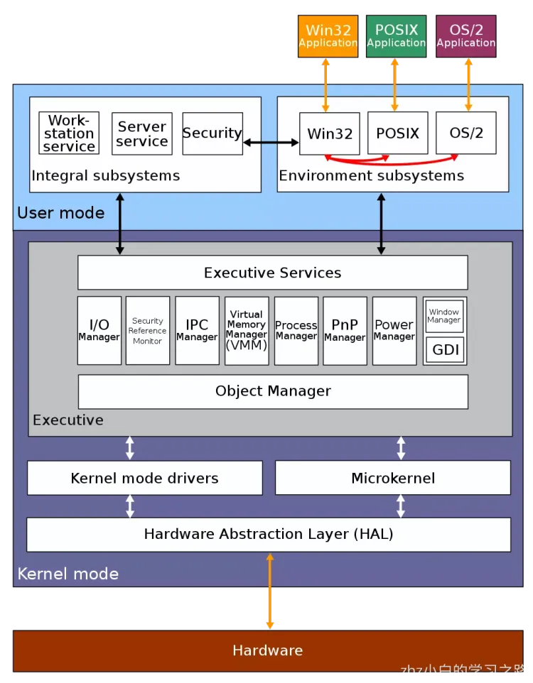

# 第1章 操作系统概述
## 什么是操作系统

不知道你有没有产生过这些疑问：

- 桌面上的图标到底是啥？凭啥我在鼠标上一双击，就会出来一个美丽的画面？这都是从哪里跑出来的？
- 凭什么我在键盘上噼里啪啦地敲，某个位置就会显示我想要的那些字符？
- 电脑怎么知道我鼠标点击的是这个地方，又是怎么知道我要输入的是这个地方？
- 我在键盘上点“a”，是谁在显示器上画出“a”这个图像呢？
- 为什么我一回车，这些字符就发到遥远的另外一台机器上去了？

现代计算机系统由一个或多个处理器、主存、打印机、键盘、鼠标、显示器、网络接口以及各种输入/输出设备构成。

然而，程序员不会直接和这些硬件打交道，而且每位程序员不可能会掌握所有计算机系统的细节，这样我们就不用再编写代码了，所以在硬件的基础之上，计算机安装了一层软件，这层软件能够通过响应用户输入的指令达到控制硬件的效果，从而满足用户需求，这种软件称之为 `操作系统`，它的任务就是为用户程序提供一个更好、更简单、更清晰的计算机模型。
我们一般常见的操作系统主要有 **Windows、Linux、FreeBSD 或 OS X** ，这种带有图形界面的操作系统被称为 `图形用户界面(Graphical User Interface, GUI)`，而基于文本、命令行的通常称为 `Shell`。

这是一个操作系统的简化图，最下面的是硬件，硬件包括芯片、电路板、磁盘、键盘、显示器等我们上面提到的设备，在硬件之上是软件。大部分计算机有两种运行模式：`内核态` 和 `用户态`，软件中最基础的部分是`操作系统`，它运行在 `内核态` 中，内核态也称为 `管态` 和 `核心态`，它们都是操作系统的运行状态，只不过是不同的叫法而已。操作系统具有硬件的访问权，可以执行机器能够运行的任何指令。软件的其余部分运行在 `用户态` 下。

## 操作系统结构

### Linux 内核 vs Windows 内核

Windows 和 Linux 可以说是我们比较常见的两款操作系统的。
Windows 基本占领了电脑时代的市场，商业上取得了很大成功，但是它并不开源，所以要想接触源码得加入 Windows 的开发团队中。

对于服务器使用的操作系统基本上都是 Linux，而且内核源码也是开源的，任何人都可以下载，并增加自己的改动或功能，Linux 最大的魅力在于，全世界有非常多的技术大佬为它贡献代码。
这两个操作系统各有千秋，不分伯仲。

操作系统核心的东西就是内核，这次我们就来看看，**Linux 内核和 Windows 内核有什么区别？**

### 内核

什么是内核呢？

计算机是由各种外部硬件设备组成的，比如内存、cpu、硬盘等，如果每个应用都要和这些硬件设备对接通信协议，那这样太累了。

所以，这个中间人就由内核来负责，**让内核作为应用连接硬件设备的桥梁**，应用程序只需关心与内核交互，不用关心硬件的细节。

内核有哪些能力呢？
现代操作系统，内核一般会提供 4 个基本能力：

- 管理进程、线程，决定哪个进程、线程使用 CPU，也就是进程调度的能力；
- 管理内存，决定内存的分配和回收，也就是内存管理的能力；
- 管理硬件设备，为进程与硬件设备之间提供通信能力，也就是硬件通信能力；
- 提供系统调用，如果应用程序要运行更高权限运行的服务，那么就需要有系统调用，它是用户程序与操作系统之间的接口。

内核是怎么工作的？

内核具有很高的权限，可以控制 cpu、内存、硬盘等硬件，而应用程序具有的权限很小，因此大多数操作系统，把内存分成了两个区域：

- 内核空间，这个内存空间只有内核程序可以访问；
- 用户空间，这个内存空间专门给应用程序使用；

用户空间的代码只能访问一个局部的内存空间，而内核空间的代码可以访问所有内存空间。
因此，当程序使用用户空间时，我们常说该程序在**用户态**执行，而当程序使内核空间时，程序则在**内核态**执行。

应用程序如果需要进入内核空间，就需要通过「系统调用」，下面来看看系统调用的过程：

内核程序执行在内核态，用户程序执行在用户态。当应用程序使用系统调用时，会产生一个中断。发生中断后， CPU 会中断当前在执行的用户程序，转而跳转到中断处理程序，也就是开始执行内核程序。内核处理完后，主动触发中断，把 CPU 执行权限交回给用户程序，回到用户态继续工作。

Linux 内核由如下几部分组成：内存管理、进程管理、设备驱动程序、文件系统和网络管理等。如图：

当今 Windows 7、Windows 10 使⽤的内核叫 Windows NT，NT 全称叫 New Technology。
下图是 Windows NT 的结构图⽚：

## 计算机启动过程

当你轻轻按下计算机的启动按钮时，你的主板就加上电了。

主板一般为矩形电路板，上面安装了组成计算机的主要电路系统，一般有 BIOS 芯片、I/O 控制芯片、键盘和面板控制开关接口、指示灯插接件、扩充插槽、主板及插卡的直流电源供电接插件等元件。

在主板上，有一个东西叫**ROM**（Read Only Memory，只读存储器）。这和咱们平常说的内存**RAM**（Random Access Memory，随机存取存储器）不同。

咱们平时买的内存条是可读可写的，这样才能保存计算结果。而 ROM 是只读的，上面早就固化了一些初始化的程序，也就是**BIOS**（Basic Input and Output System，基本输入输出系统）。

如果你自己安装过操作系统，刚启动的时候，按某个组合键，显示器会弹出一个蓝色的界面。能够调整启动顺序的系统，就是我说的 BIOS，然后我们就可以先执行它。

然后操作系统会询问 BIOS 获取配置信息。对于每个设备来说，会检查是否有设备驱动程序。如果没有，则会向用户询问是否需要插入 `CD-ROM` 驱动（由设备制造商提供）或者从 Internet 上下载。一旦有了设备驱动程序，操作系统会把它们加载到内核中，然后初始化表，创建所需的后台进程，并启动登录程序或GUI。

## 系统调用

你会发现，一个项目要想顺畅进行，需要用到公司的各种资源，比如说盖个公章、开个证明、申请个会议室、打印个材料等等。这里有个两难的权衡，一方面，资源毕竟是有限的，甚至是涉及机密的，不能由项目组滥取滥用；另一方面，就是效率，咱是一个私营企业，保证项目申请资源的时候只跑一次，这样才能比较高效。

为了平衡这一点，一方面涉及核心权限的资源，还是应该被公司严格把控，审批了才能用；另外一方面，为了提高效率，最好有个统一的办事大厅，明文列出提供哪些服务，谁需要可以来申请，然后就会有回应。

在操作系统中，也有同样的问题，例如多个进程都要往打印机上打印文件，如果随便乱打印进程，就会出现同样一张纸，第一行是 A 进程输出的文字，第二行是 B 进程输出的文字，全乱套了。所以，打印机的直接操作是放在操作系统内核里面的，进程不能随便操作。但是操作系统也提供一个办事大厅，也就是**系统调用**（System Call）。

系统调用也能列出来提供哪些接口可以调用，进程有需要的时候就可以去调用。这其中，立项是办事大厅提供的关键服务之一。同样，任何一个程序要想运行起来，就需要调用系统调用，创建进程。

如果一个进程在用户态下运行用户程序，例如从文件中读取数据。那么如果想要把控制权交给操作系统控制，那么必须执行一个异常指令或者系统调用指令。操作系统紧接着需要参数检查找出所需要的调用进程。

然后执行系统调用，把控制权移交给系统调用下面的指令。大致来说，系统调用就像是执行了一个特殊的过程调用，但是只有**系统调用能够进入内核态而过程调用则不能进入内核态**。

### UNIX 系统调用

为了能够了解具体的调用过程，下面我们以 `read` 方法为例来看一下调用过程。

下面，我们会列出一些常用的 `POSIX` 系统调用，POSIX 系统调用大概有 100 多个，它们之中最重要的一些调用见下表

**进程管理**

| 调用                                 | 说明                     |
| ------------------------------------ | ------------------------ |
| pid = fork()                         | 创建与父进程相同的子进程 |
| pid = waitpid(pid, &statloc,options) | 等待一个子进程终止       |
| s = execve(name,argv,environp)       | 替换一个进程的核心映像   |
| exit(status)                         | 终止进程执行并返回状态   |

**文件管理**

| 调用                               | 说明                         |
| ---------------------------------- | ---------------------------- |
| fd = open(file, how,...)           | 打开一个文件使用读、写       |
| s = close(fd)                      | 关闭一个打开的文件           |
| n = read(fd,buffer,nbytes)         | 把数据从一个文件读到缓冲区中 |
| n = write(fd,buffer,nbytes)        | 把数据从缓冲区写到一个文件中 |
| position = iseek(fd,offset,whence) | 移动文件指针                 |
| s = stat(name,&buf)                | 取得文件状态信息             |

**目录和文件系统管理**

| 调用                         | 说明                                |
| ---------------------------- | ----------------------------------- |
| s = mkdir(nname,mode)        | 创建一个新目录                      |
| s = rmdir(name)              | 删去一个空目录                      |
| s = link(name1,name2)        | 创建一个新目录项 name2,并指向 name1 |
| s = unlink(name)             | 删去一个目录项                      |
| s = mount(special,name,flag) | 安装一个文件系统                    |
| s = umount(special)          | 卸载一个文件系统                    |

**其他**

| 调用                     | 说明                           |
| ------------------------ | ------------------------------ |
| s = chdir(dirname)       | 改变工作目录                   |
| s = chmod(name,mode)     | 修改一个文件的保护位           |
| s = kill(pid, signal)    | 发送信号给进程                 |
| seconds = time(&seconds) | 获取从 1970 年1月1日至今的时间 |

上面的系统调用参数中有一些公共部分，例如 pid 系统进程 id，fd 是文件描述符，n 是字节数，position 是在文件中的偏移量、seconds 是流逝时间。

### Windows系统调用

UNIX 程序由执行某些操作或执行其他操作的代码组成，进行系统调用以执行某些服务。Windows 系统则不同，Windows 应用程序通常是由事件驱动的。主程序会等待一些事件发生，然后调用程序去处理。最简单的事件处理是键盘敲击和鼠标滑过，或者是鼠标点击，或者是插入 USB 驱动，然后操作系统调用处理器去处理事件，更新屏幕和更新程序内部状态。这是与 UNIX 不同的设计风格。

当然，Windows 也有系统调用。在 UNIX 中，系统调用（比如 read）和系统调用所使用的调用库（例如 read）几乎是一对一的关系。而在 Windows 中，情况则大不相同。首先，函数库的调用和实际的系统调用几乎是不对应的。微软定义了一系列过程，称为 `Win32应用编程接口(Application Programming Interface)`，程序员通过这套标准的接口来实现系统调用。这个接口支持从 Windows 95 版本以来所有的 Windows 版本。

Win32 API 有大量的调用，用来管理视窗、几何图形、文本、字体、滚动条、对话框、菜单以及 GUI 的其他功能。为了使图形子系统在内核态下运行，需要系统调用，否则就只有函数库调用。

我们把关注点放在和 Win32 系统调用中来，我们可以简单看一下 Win32 API 中的系统调用和 UNIX 中有什么不同（并不是所有的系统调用）

