> 一个好的管理，是70%在流程、规范、工具，剩下的30%自由发挥。一个不好的管理，只有地板，每个人都要自己想办法，够到天花板。一个好的工具，就是帮助团队够到天花板的台阶。    ——刘润
> 
> 项目管理是一门复杂的艺术，因为复杂，总会遇到各种各样的问题。比如，人工管理成本高，工作反馈有延误，怎么办？比如，口头布置工作，理解不彻底，容易遗漏，无据可依，无法问责。怎么办？比如，工作分解，多人执行，无法追踪。怎么办？
> 有时候这些"怎么办"的问题，可以尝试借助工具来解决，这些工具可能包括**软件、方法模型**。

## 一、主流项目管理软件对比
### 1.产品研发项目管理平台-[PingCode](https://link.zhihu.com/?target=https%3A//pingcode.com/signup%3Futm_source%3Dzhihu%26utm_medium%3DJira%25E3%2580%2581Worktile%25E3%2580%2581PingCode%25E3%2580%2581Teambition%25E3%2580%2581Tapd%25E7%25AD%2589%25E4%25B8%25BB%25E6%25B5%2581%25E9%25A1%25B9%25E7%259B%25AE%25E7%25AE%25A1%25E7%2590%2586%25E8%25BD%25AF%25E4%25BB%25B6%25E5%2593%25AA%25E4%25B8%25AA%25E5%25A5%25BD%25EF%25BC%259F%26utm_campaign%3D%25E9%25A1%25B9%25E7%259B%25AE%25E7%25AE%25A1%25E7%2590%2586%26utm_term%3D621129088)（国产）
**入选理由**：国内软件研发项目榜单评分最高的项目管理软件，比如，它在**2021年评为研发管理领域综合评分TOP1，在2022年入选国内年度口碑产品TOP36**。
**知名客户包括**：宁德时代、招商银行、中车、清华大学、电银信息等。
**适用类型**：10-1000人的软件研发项目管理
**满足的需求**：PingCode 是一款覆盖软件研发全生命周期的项目管理系统，被广泛用于需求收集、需求管理、需求优先级、产品路线图、项目管理（敏捷/kanban/瀑布）、工时管理、资源管理、测试管理、缺陷追踪、项目文档管理、效能度量等领域。集成了github、gitlab、jinkens、企微、飞书等主流开发工具。
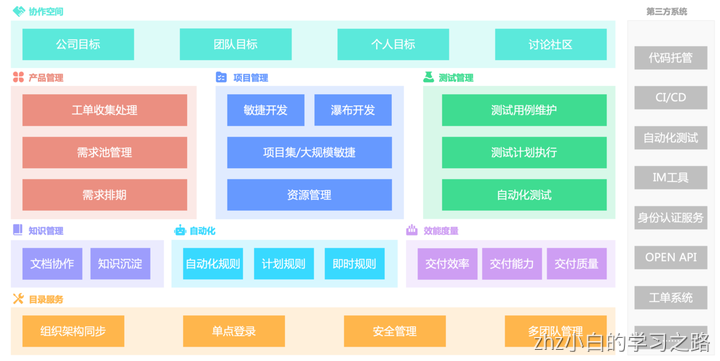
**软件优点：**

- 产品开箱即用，简单易上手，不需要像 Jira 那样经过好几月的培训以及专业的人员进行配置即可使用；
- 为 25 人以下团队免费提供基础版本，收费版价格仅为某些国外产品30%-40%；
- 国产化，满足信创、麒麟等需求；
- 支持私有部署、定制化以及saas等购买方式；

**软件缺点：**

- 不支持多语言
- 无法满足软件研发项目以外的项目管理需求

### 2.项目协作与目标管理软件-[Worktile](https://link.zhihu.com/?target=https%3A//worktile.com/signup%3Futm_source%3Dzhihu%26utm_medium%3DJira%25E3%2580%2581Worktile%25E3%2580%2581PingCode%25E3%2580%2581Teambition%25E3%2580%2581Tapd%25E7%25AD%2589%25E4%25B8%25BB%25E6%25B5%2581%25E9%25A1%25B9%25E7%259B%25AE%25E7%25AE%25A1%25E7%2590%2586%25E8%25BD%25AF%25E4%25BB%25B6%25E5%2593%25AA%25E4%25B8%25AA%25E5%25A5%25BD%25EF%25BC%259F%26utm_campaign%3D%25E9%25A1%25B9%25E7%259B%25AE%25E7%25AE%25A1%25E7%2590%2586%26utm_term%3D621129088)（国产）
**入选理由**：公司成立近10年，**国内市场占有率最高的项目管理软件之一**。知名客户包括：百度、中粮、小米、中国移动、新东方、中国银联等。
**适用类型**：各种类型团队、复杂项目
**满足的需求**：在功能上Worktile 是一个工具集合，它具备OKR目标管理、项目管理、项目集管理、项目计划、项目风险、项目成本管理、企业网盘、审批、简报等能力。并且具备强大的自定义能力，能够配置出符合各种项目团队的流程、表单、字段、数据报表，以及具备丰富的模板市场。
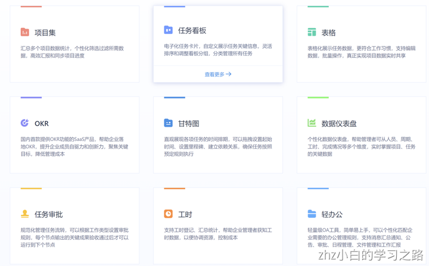
**软件优点：**

- 能够满足单项目以及多项目、复杂项目、项目集等管理需求；
- 开箱即用，上手简单，价格相对便宜；
- 能够很大程度帮助团队节省成本，因为它是一个工具集合能够同时满足项目、OKR、网盘、OA等需求；
- 支持saas、私有部署、定制等购买方案；
- 为10人以下团队提供基础的免费版本

**软件缺点：**

- 在软件项目管理的专业度上不如 PingCode 等垂直领域的产品；

### 3.通用项目管理工具-[Trello（海外）](https://trello.com/)
**入选理由**：一款基于看板的项目管理工具，早些年在国内非常知名，近几年由于国产软件崛起，逐步淡出人们视线。绝大部分功能免费，知名客户包括visa、zoom等。
**适用对象**：跨国或者海外中小型团队
**满足的需求**：Trello 是一款灵活且易于使用的项目管理和协作工具，它可以满足各种项目需求。比如项目管理、敏捷开发、个人任务规划、日程等等。并且与绝大部分海外的主流管理工具集成。
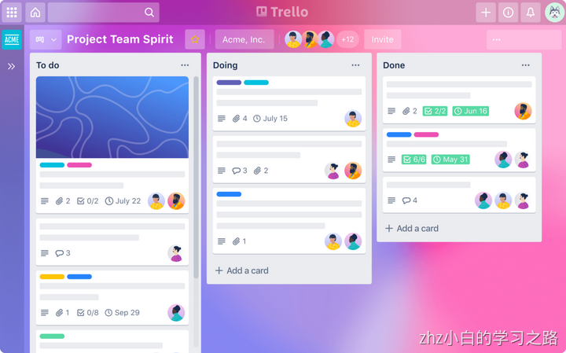
**软件优点：**
Trello非常适合小团队和新人使用，尤其是它简单容易上手，无需学习甚至不了解看板也能立即使用，并配有iOS、Android移动应用程序，可以随时随地管理你的任务；
**软件缺点：**
不适合国内企业用户，对个人用户影响不大；数据报表工能有限；无法满足复杂的项目管理；

### 4.综合性项目管理系统-[Asana（海外）](http://Asana.com)
**入选理由**：海外点评网站G22022年度十大最佳项目管理软件之一。Asana在国外被称为项目工具的瑞士军刀，它具备非常强的项目管理能力知名客户包括：宝洁、亚马逊等。
**适用对象**：市场、销售等业务团队以及职能性团队
**满足的需求**：它可以帮助用户协调和管理团队的任务，提高团队的协作效率。Asana最大的特色就是一个任务可以连接多个项目，所以假设今天有多个团队正在共同执行一个任务，我就可以以不同团队的角度一起共同协作一个任务，大大提升了部门之间的合作和沟通效率。在它的甘特图功能中有多个可供选择的时间线视图，包括任务列表和日历。但是，甘特图时间线在免费版本中不可用。
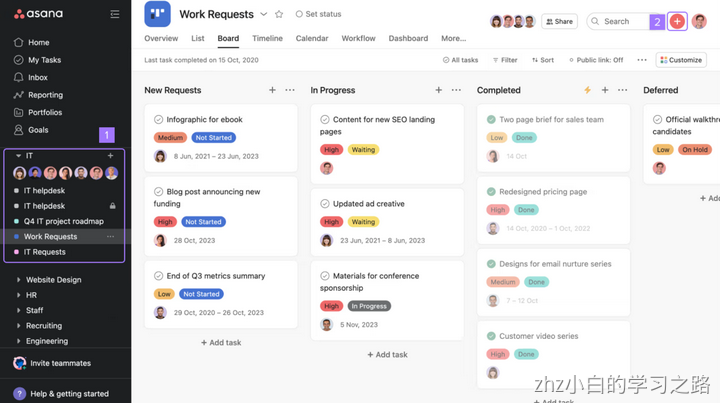
**软件优点**：高效便捷易用，学习成本低，并且对于需要统计的指标，也可以通过excel自带的函数进行统计；非常详细的项目/任务记录，能查看完成任务的完整历史记录以及他们是如何完成的；在提供软件的同时，同样也提供专业的管理咨询（国内除外）；
**软件缺点**：

- 国内团队使用可能会面临安全风险以及访问速度等问题；
- 没有本地时间跟踪功能，无法将注释转换为任务，免费版功能受限（没有自定义字段或表单）

### 5.个人免费项目管理app-[Teambition（国产）](http://Teambition.com)
**入选理由**：钉钉旗下项目管理套件，尽管最近几年在走下坡路，但依旧是国内知名项目管理软件；
**适用对象**：个人或者小型团队
**满足的需求**：钉钉旗下的一款项目管理软件，更适用于小型团队项目协作，被广泛用于适合产品、研发、设计、市场、运营、销售、HR等各类团队。Teambition 以项目和任务的可视化管理来支撑企业团队协作，含任务、文档、文件、统计、甘特图等丰富应用。
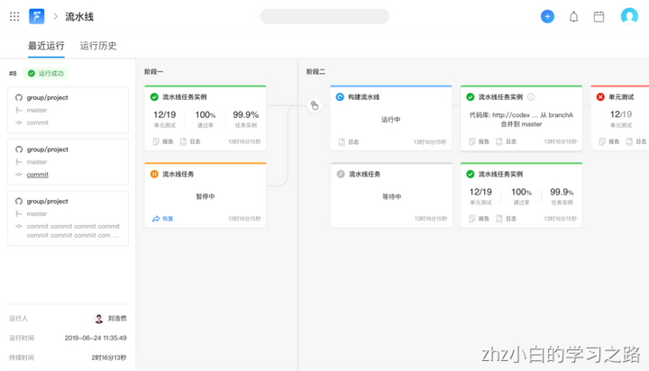
**软件优点**：

- 承诺个人版本永不收费；
- 优秀的产品界面和操作体验；
- 工具融合，打破信息孤岛，集成了项目管理、文档管理、资源管理、流程管理、沟通协作等工具，支持不同的业务场景；
- 深度嵌入钉钉，对同时使用钉钉的用户来说非常友好；

**软件缺点**：

- 为了追求的“简单易用”，牺牲了项目目标和分层分级权限管理——整体适用场景较为局限，难以实现项目的闭环管理（缺少目标、网盘管理能力）。
- 自定义能力不强，无法很好的满足团队的个性化需求以及复杂的项目管理；
- 无法与企业微信、飞书等外部工具打通；

### 6.复杂项目管理软件-[Microsoft Project（海外）](https://www.microsoft.com/en-us/microsoft-365/project/project-management-software)
**入选理由**：1995年由微软发布，全球最知名的项目管理软件之一，管理软件先驱，产品成熟度高。它是 Microsoft 最畅销的桌面产品之一，在推出初期几乎没有竞争。
**适用对象**：大型复杂项目，包括建筑、工程、IT、制造业等。
满足的需求：

- 项目计划：用户可以创建项目计划，并添加任务、里程碑、资源和预算等详细信息。
- 任务管理：可以帮助用户跟踪任务的进度、优先级和关系，以便更好地控制项目进度。
- 资源管理：用户可以管理项目所需的资源，包括人力、物资和设备等，并将它们分配给各个任务。
- 时程表和进度管理：可以帮助用户创建和维护项目的时程表，并跟踪实际进度与计划进度的差异。
- 项目协作：支持多人同时协作，用户可以通过共享任务列表、文档和进度信息等方式，与项目团队共同工作。

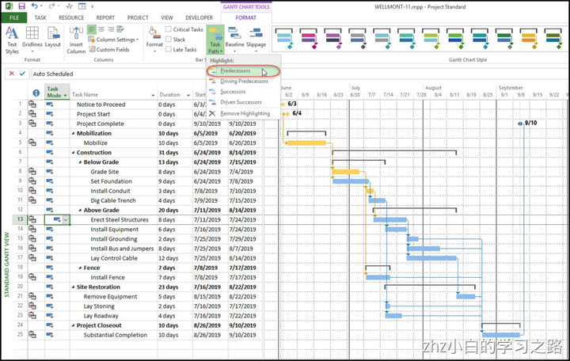
**软件优点：**

- 功能强大：Microsoft Project是一款功能强大的项目管理工具，它可以帮助用户制定计划、分配资源、跟踪进度、管理预算和分析工作. 它还可以帮助用户进行资源管理、协作和沟通；

**软件缺点**：

- 复杂、难用：虽然MS Project 拥有非常强大的功能，但也并非适合所有项目管理，就比如：一位资深研发项目管理人员曾这样评价——“我就从来没见过我软件团队内部有什么团队成功使用MS Project来做项目管理的，有些团队曾今尝试过，包括我之前的组，但没多久也就放弃了。为什么呢？因为实在是用不来啊，太重了。”
- 价格高昂

### 7.软件开发项目管理系统-[Tapd（国产）](https://www.tapd.cn/)
**入选理由**：腾讯云旗下的一款开发过程管理工具。
**适用对象**：腾讯系或者腾讯类型的研发团队，因为它为腾讯的打造，腾讯的研发模式特点特别明显，几乎只能让用户适应产品，而无法让产品适应用户；中小企业。
**满足的需求**：TAPD敏捷研发全生命周期包括需求、发布计划、迭代、任务、测试计划、测试用例、缺陷、Wiki、故事墙、甘特图、报表、文档、反馈13个核心应用以及支持工时填写和跟踪的工时进度。
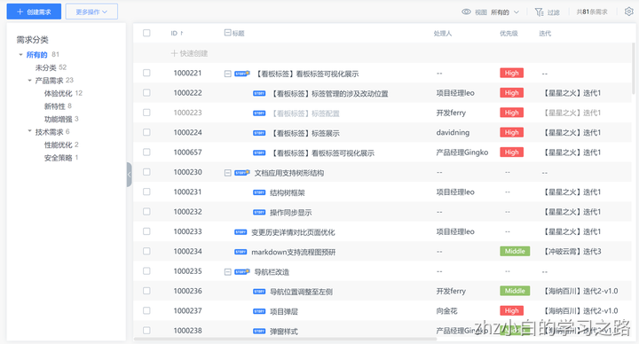
**软件优点**：

- TAPD提供了全面的项目管理功能；
- TAPD的界面简洁明了，易于使用
- TAPD支持敏捷开发、瀑布开发等多种开发模式

**软件缺点：**

- 由免费工具转向收费产品，且价格不低；
- 无法满足研发全流程的管理需求；
- 无售后，腾讯无售后
- 为腾讯的打造，腾讯的研发模式特点特别明显

### 8.免费开源项目管理工具-[Redmine（海外）](https://www.redmine.org/)
**入选理由**：为数不多且知名度不错、功能较为成熟的；。海外知名的开源项目管理产品，功能
**适用对象**：定制化开发需求的团队
**满足的需求**：项目管理，比如项目计划、任务分配、进度跟踪等；缺陷跟踪管理、文档管理、文件共享等.
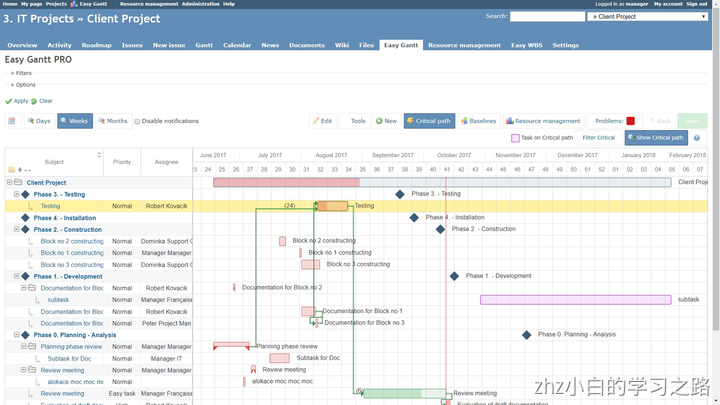
**软件优点**：开源免费的；多语言支持（已经内置了简体中文）；支持多种数据库，如MySQL、SQLite、PostgreSQL；功能丰富，如用户角色控制、问题追踪、自动日历和甘特图绘制、Wiki形式的文档撰写和文件管理，还可以集成其他版本管理系统和BUG跟踪系统，例如Git、SVN等等。
**软件缺点**：

- 成本更高：开源软件虽然可以节约一定的开发成本，但却会带来非常高的开发维护成本。我们曾算过一笔账：购买一个在线项目管理系统的成本是约是15万/年（100人团队）；开源项目管理系统二开最少需要一个专门的程序员来开发+长期维护，而一个程序员的薪资至少在20W/年，但二开前期人员投入一定不止1个人。
- 功能有限，系统一直处于“能用”的状态；
- 安全性可能更低：当软件应用程序的源代码公开可用时，其安全性变得更加脆弱。

### 9.工程项目管理平台-广联达（国产）
广联达科技股份有限公司成立于1998年，2010年在A股上市。广联达立足建筑产业，围绕工程项目的全生命周期，是提供以建设工程领域专业应用为核心基础支撑，以产业大数据、产业新金融等为增值服务的数字建筑平台服务商。（官网：[https://www.glodon.com/](https://link.zhihu.com/?target=https%3A//www.glodon.com/)）
需要注意的是广联达正版和盗版在服务层面是有些区别的。
### 10、禅道（国产）

- 开源版：完全免费，可以满足大部分企业的需求，含有bug管理
- 专业版：12000/1年，28800/终身，不限人数，除开源版功能还包含：app/短信通知、自定义报表、代码管理等
- 企业版：费用未知，不限人数，除专业版功能还包含：运维管理、考勤办公、文档管理、自定义工作流
- 国产软件，集产品管理、项目管理、质量管理、文档管理、组织管理和事务管理于一体，是一款功能完备的项目管理软件，完美地覆盖了项目管理的核心流程（安装方法：[选择适合您的安装方法 - 禅道使用手册 - 禅道开源项目管理软件](https://link.zhihu.com/?target=https%3A//www.zentao.net/book/zentaopmshelp/40.html%25EF%25BC%2589)）
### 11、[JIRA（海外）](https://www.atlassian.com/zh/software/jira)
Jira 是一款由 Atlassian 公司开发的流行的项目管理工具，为软件开发而设计。Jira 同样支持Scrum、Kanban项目管理模板，可以让团队创建和管理故事，冲刺，缺陷等各种类型的工作项，Jira 还提供了丰富的报告和分析功能。
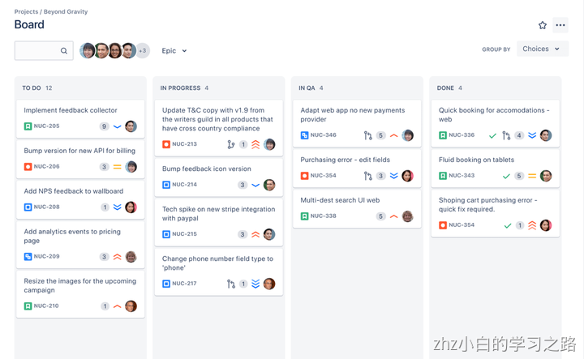
**Jira 优点：**

- 功能强大，覆盖了敏捷开发项目管理的各个方面
- 灵活，可以根据不同的情况进行调整和扩展

**Jira缺点：**

- 学习成本高，购买成本高；
- 不适合中国用户使用，因为在2021年前后宣布停止向大陆售卖Server版本，不少国内企业都从Jira迁移至国产软件；
- 性能有时不稳定，可能出现卡顿或崩溃的情况

### 12、免费的敏捷管理软件-[Leangoo](https://www.leangoo.com/)
Leangoo是Scrum中文网旗下敏捷研发团队开发的一款敏捷团队协作工具，支持单团队和多团队的敏捷开发项目管理。通过Leangoo软件，可以实现需求、任务、问题和文档的管理和协作，并随时随地的跟踪团队工作进展。
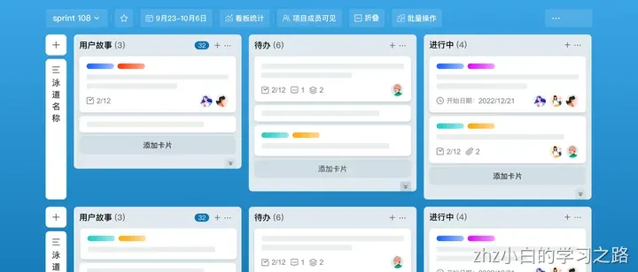
**Leangoo优点：**

- 支持多种敏捷框架，如Scrum、SAFe等，帮助企业提升研发效率和创新能力
- 产品简单易上手

**Leangoo缺点：**

- 产品迭代速度较慢，功能成熟度对比PingCode、Jira等可能有所不足；

### 13、开源敏捷项目管理工具-[OrangeScrum](https://www.orangescrum.com/)
OrangeScrum是一款简单而强大的项目管理软件和任务管理工具，它支持敏捷开发的一些实践方法，如看板、待办事项列表、冲刺和燃尽图，可以帮助团队跟踪进度、解决问题和提高效率。
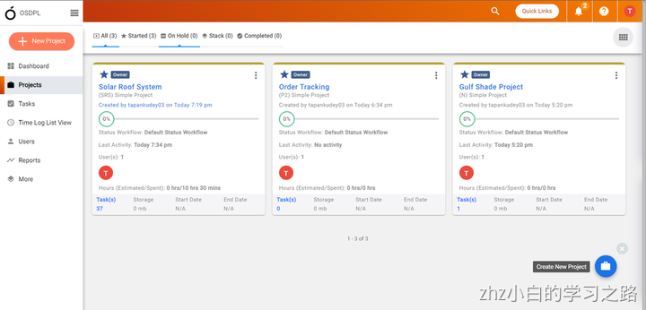
**OrangeScrum优点：**

- 开源免费，同时支持企业使用现成的敏捷开发模板以及二次开发
- 同时满足敏捷开发以及其他形式的项目任务管理

**OrangeScrum缺点：**

- 不支持中文，非开源版免费版只支持3个用户，100MB的存储空间，5个自定义字段，如果需要更多的功能和容量，需要付费升级；
- 大陆访问速度极慢，不支持在线客服和其他形式的服务支持

### 14、免费开源项目管理工具-[Tuleap](https://www.tuleap.org/)
Tuleap是一个开源的项目管理平台，支持敏捷方法论，如Scrum和Kanban。你可以在一个统一的界面上创建、跟踪和协作敏捷项目，包括需求、任务、缺陷、文档等；可以根据不同的敏捷框架和实践，定制自己的工作流程、看板、迭代、报告等；可以与其他开发工具集成，如Git、Jenkins、SonarQube等，实现持续集成和持续交付。
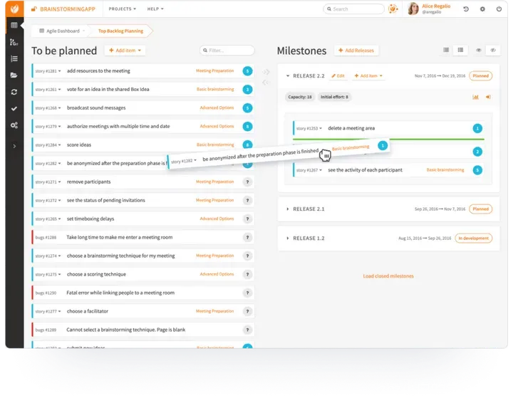
**Tuleap的缺点：**

- Tuleap的安装和配置需要一定的技术能力，对想低成本使用的中小团队并不适合
- Tuleap的功能比较丰富和复杂
- Tuleap的界面设计比较传统和简单

### 15、免费的项目管理软件-[Clickup](https://clickup.com/)
ClickUp是国外著名项目管理工具，可以看成国内版的飞书，不仅支持敏捷开发，同时能满足各种各样的企业管理需求，比如任务管理、CRM等等。
在敏捷开发方面，无论您是产品负责人，Scrum Master还是团队成员，ClickUp都有强大的功能进行错误跟踪，迭代管理和产品发布，支持Sprint，甘特图，无限任务，实时协作等。
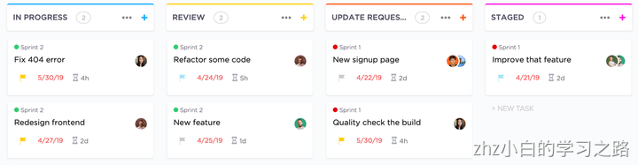
**优点：**

- 界面美观，产品体验好
- 不仅支持敏捷开发，同时满足企业多种需求

**缺点：**

- 熟练使用产品需要一定的上手成本；
- 对比PingCode、Jira等垂直领域产品而言，敏捷支持的专业程度稍有不足；

## 二、项目管理中必备的7大管理方法
### 1.项目分析：SWOT分析法
运用SWOT分析法，可以对研究对象所处的情景进行全面、系统、准确的研究，从而根据研究结果制定相应的发展战略、计划以及对策等。SWOT分析法的优点在于，考虑问题全面，是一种系统思维。而且可以把问题的“诊断”和“开处方”紧密结合在一起，条理清楚，便于检验。

### 2.项目过程管理：PDCA循环模型
PDCA 循环又被成为戴明环，分别对应Plan (计划)，Do (执行)，Check (检查)，Action (处置)。因方法框架简单易用，目前已大量运用于企业的人事管理，销售管理，产品开发，客户关系等领域。实践证明， PDCA 是有效的。PDCA 循环四个过程不是运行一次就完结，而是周而复始地进行，呈阶梯式上升。每一个阶段，都有庞大的流程方法和工具支撑，值得深度挖掘和应用。
“策划—实施—检查—改进”的 PDCA 循环管理模式，体现了一套科学管理手段和工作程序。PDCA 管理模式的应用，不仅在质量管理工作中可以运用，同样也适用于其他管理工作。
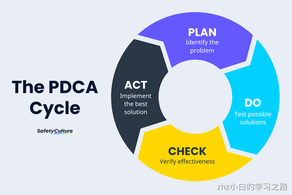
### 3.项目决策规划：6W2H
6W2H通用决策，是一个以价值为导向的标准化思维流程，通过八个方面提出问题并从中选择性价比最高的方法和路径来实现预定目标。做任何工作都应该从6W2H来思考，这有助于我们的思路的条理化，杜绝盲目性。我们的汇报也应该用6W2H，能节约写报告及看报告的时间。
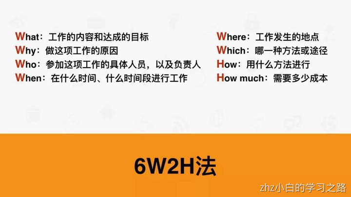
### 4.项目目标管理：SMART原则
SMART原则旨在建立可衡量的目标，来帮助你实现目标。它可以帮助员工更清晰、更高效地工作，也是为管理者在未来为员工实施绩效考核提供考核目标和标准，使考核更加科学、规范，更能保证考核的公平性、公开性和公平性。在设定目标时，通常需要遵循SMART原则。
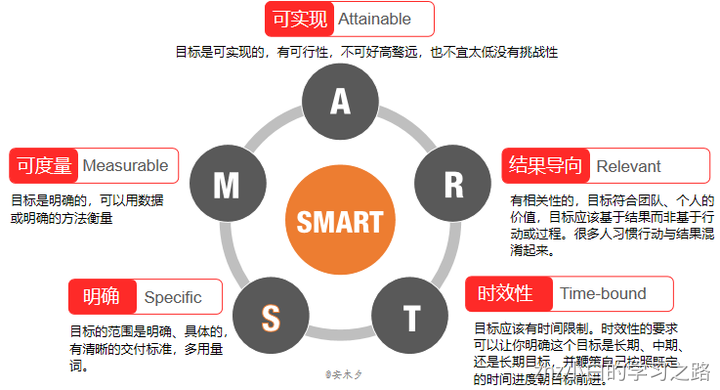
### 5.项目时间管理：四象限法则
时间管理领域最常用的莫过于史蒂芬•科维的“四象限法则”，他用“重要”和“紧急”两个维度把事情分为四类：重要且紧急、重要不紧急、不重要但紧急、不重要也不紧急。如果一个人整天都在做不重要也不紧急的事，那他的人生终将碌碌无为。如果总是在做不重要而很紧急的事，虽然看起来很忙，但是没有什么成效，对于这类事，要想办法委托给别人做或者尽量少做。如果重要而又紧急的事做得太多，压力就会倍增，难逃“忙中出错”。重要但不紧急的事，比如学习、战略规划、培养下属成长，如果长期不顾不管，它们慢慢就会变成重要而紧急的事。
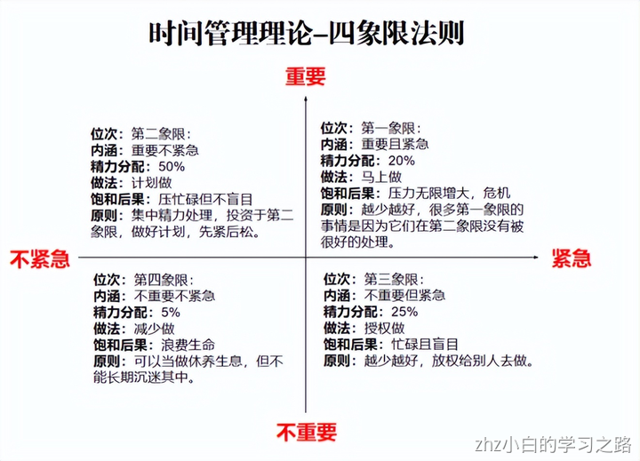
### 6.项目任务分解：WBS
WBS这三个字母分别代表工作任务、分解任务、结构化组织,是一种将复杂的项目分解成可执行项目的工具。
工作分解结构（WBS）是把一个项目分解成任务，任务再分解成一项项工作，再把一项项工作分配到每个人的日常活动中，直到分解不下去为止。即：项目→任务→工作→活动。工作分解结构以可交付成果为导向，对项目要素进行的分组，它归纳和定义了项目的整个工作范围，每下降一层代表对项目工作的更详细定义。
WBS是处于项目计划过程的中心，也是制定进度计划、资源需求、成本预算、风险管理计划和采购计划等的重要基础。
WBS的好处：

- 可以理清整个项目结构，了解项目全貌。
- 通过分析每个节点可以统筹整个项目所需的人力、时间、成本。
- 细分项目范围，为项目划清界线。
- 当提出需求时，能清晰的分辨出所提出需求为新增需求，还是变更需求，便于项目管理者管理项目。
- 通过功能分解，便于了解及控制项目进度，规避风险。
- 通过工作分解便于制订出合理的工作计划。
- 对一个大的工作包往往无法准确的进行评估，当对其进行细化分解后就能评估出相对准确的工作时间与人力资源。

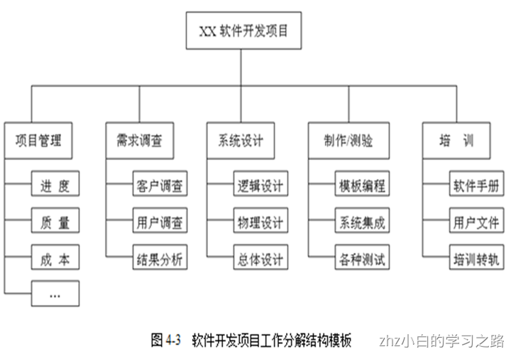
### 7.资源管理：二八原则
巴列特定律：“总结果的80%是由总消耗时间中的20%所形成的。”按事情的“重要程度”编排事务优先次序的准则是建立在“重要的少数与琐碎的多数”的原理的基础上。举例说明：

- 80%的销售额是源自20%的顾客；
- 80%的电话是来自20%的朋友；
- 80%的总产量来自20%的产品；
- 80%的财富集中在20%的人手中；

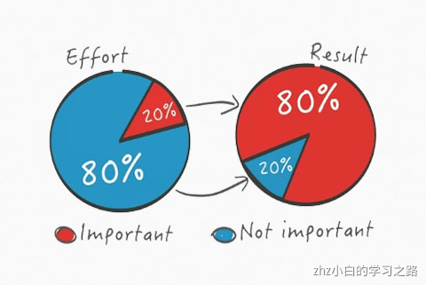
## 三、项目管理中必备的3大工具
### 1.计划进度管理：甘特图
甘特图作为进度管理的经典工具，在项目管理中被广泛应用。甘特图，又称为横道图、条状图，顾名思义，其是通过条状图来显示项目，进度和其他时间相关的系统进展的内在关系随着时间进展的情况。
形象的表示出任何特点项目的活动顺序和持续时间，项目经理由此可便利地弄清一项任务（项目）还剩下哪些工作要做，以此来评估工作进度，有助于项目经理计划和管理项目。（制作工具：Excel、PingCode、Worktile等）
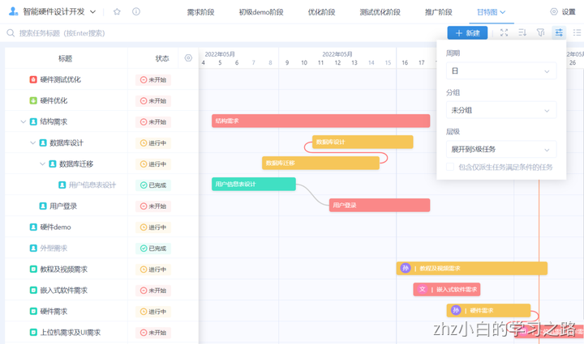
### 2.原因分析：鱼骨图
鱼骨图也是非常常见的一种项目管理工具，因其形状如鱼骨而得名，又称因果图，树状结构，是一种发现问题“根本原因”的方法。
问题或缺陷（即后果）表在“鱼头”处，在鱼骨上长出来的鱼刺，上面按出现机会多寡列出产生问题的可能原因，有助于说明各个原因是如何影响后果的。鱼骨图的特点是简洁实用，比较直观。
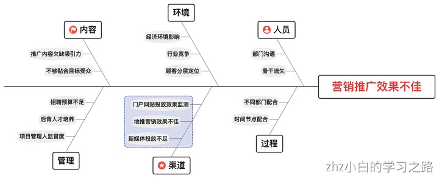
### 3.实施跟踪：PERT图
PERT 是项目评价和评估技巧 (project evaluation and review technique) 的英文缩写。这是用于计划和安排整个项目行程，跟踪实施阶段的主要项目管理工具之一。
PERT图不仅可以表达子任务的计划安排，还可以在任务计划执行过程中估计任务完成的情况，分析某些子任务完成情况对全局的影响，找出影响全局的区域和关键子任务，以便及时采取措施，确保整个项目的完成

## 延伸阅读：如何选择适合自己的项目管理软件
在选择项目管理软件时，您可以从以下几个维度来评估和比较：

1. 功能性：评估软件是否具备满足您项目管理需求的功能，如任务分配、进度跟踪、时间管理、文件共享等。
2. 适用性：考虑软件是否适合您团队的规模、行业和项目类型。某些软件可能针对特定类型的项目（如敏捷开发）进行了优化，而其他软件可能更适用于一般项目管理需求。
3. 价格：比较不同软件的价格和订阅计划，确保它们符合您的预算。同时，关注是否提供免费试用或免费版本，以便在购买前进行评估。
4. 用户友好性：评估软件的界面是否直观易用，学习曲线是否陡峭。选择一个用户友好的软件可以提高团队成员的接受度和使用效率。
5. 协作和沟通功能：检查项目管理软件是否提供内置的协作和沟通功能，如评论、讨论区和实时聊天等，以支持团队成员之间的高效沟通。
6. 移动支持：评估软件是否提供移动应用或移动友好的网页界面，以便团队成员在移动设备上方便地访问和管理项目。
7. 集成能力：了解软件是否可以与您团队现有的工具和系统（如邮箱、日历、文件存储等）进行集成，以实现更顺畅的工作流程。
8. 定制性和扩展性：考虑软件是否允许您根据团队需求进行定制和扩展，如自定义看板、自动化规则和插件等。
9. 数据安全和隐私：了解软件提供的数据安全和隐私保护措施，如加密、访问控制和备份等，确保您的项目数据得到充分保护。
10. 客户支持：评估软件厂商提供的客户支持质量，如在线帮助文档、视频教程、客服支持等。良好的客户支持可以帮助您在使用过程中解决问题，提高软件的使用效果。

在评估这些维度时，可以先列出您的核心需求和预算范围，然后对照各款软件的特点进行筛选和比较。最后，可以尝试几款符合您需求的软件，以便在实际使用中找到最适合您团队的项目管理工具。

## 参考
- [Jira、Tapd、PingCode等软件中，哪款敏捷开发项目管理工具更好？](https://zhuanlan.zhihu.com/p/619910374)
- [Jira、Worktile、PingCode、Teambition、Tapd等主流项目管理软件哪个好？](https://zhuanlan.zhihu.com/p/621129088)
