## 1 分布式事务
在分布式系统中，为了保证数据的高可用，通常，我们会将数据保留多个副本(replica)，这些副本会放置在不同的物理的机器上。为了对用户提供正确的 CRUD 等语义，我们需要保证这些放置在不同物理机器上的副本是一致的。分布式事务在现在遍地都是分布式部署的系统中几乎是必要的。

### 1.1 事务简介
事务(Transaction)是访问并可能更新数据库中各种数据项的一个程序执行单元(unit)。在关系数据库中，一个事务由一组SQL语句组成。事务应该具有4个属性：原子性、一致性、隔离性、持久性。这四个属性通常称为ACID特性。

1、**原子性（atomicity）**：事务是一个不可分割的工作单位，事务中包括的诸操作要么都做，要么都不做。

2、**一致性（consistency）**：事务必须是使数据库从一个一致性状态变到另一个一致性状态，事务的中间状态不能被观察到的。

3、**隔离性（isolation）**：一个事务的执行不能被其他事务干扰。即一个事务内部的操作及使用的数据对并发的其他事务是隔离的，并发执行的各个事务之间不能互相干扰。隔离性又分为四个级别：读未提交(read uncommitted)、读已提交(read committed，解决脏读)、可重复读(repeatable read，解决虚读)、串行化(serializable，解决幻读)。

4、**持久性（durability）**：持久性也称永久性（permanence），指一个事务一旦提交，它对数据库中数据的改变就应该是永久性的。接下来的其他操作或故障不应该对其有任何影响。

任何事务机制在实现时，都应该考虑事务的ACID特性，包括：本地事务、分布式事务，及时不能都很好的满足，也要考虑支持到什么程度。

### 1.2 本地事务
大多数场景下，我们的应用都只需要操作单一的数据库，这种情况下的事务称之为本地事务(`Local Transaction`)。本地事务的ACID特性是数据库直接提供支持。本地事务应用架构如下所示：

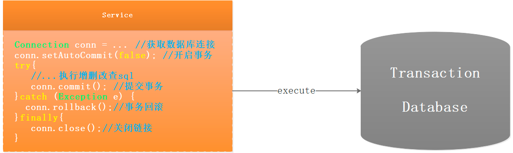

很多java应用都整合了spring，并使用其声明式事务管理功能来完成事务功能。一般使用的步骤如下：

1、配置事务管理器。spring提供了一个`PlatformTransactionManager`接口，其有2个重要的实现类：

- `DataSourceTransactionManager`:用于支持本地事务,事实上,其内部也是通过操作`java.sql.Connection`来开启、提交和回滚事务。

- `JtaTransactionManager`：用于支持分布式事务，其实现了JTA规范，使用XA协议进行两阶段提交。需要注意的是，这只是一个代理，我们需要为其提供一个JTA provider，一般是Java EE容器提供的事务协调器(Java EE server's transaction coordinator)，也可以不依赖容器，配置一个本地的JTA provider。

2、 在需要开启的事务的bean的方法上添加`@Transitional`注解

可以看到，spring除了支持本地事务，也支持分布式事务，下面我们先对分布式事务的典型应用场景进行介绍。

### 1.3 不同场景下的分布式事务
当下互联网发展如火如荼，绝大部分公司都进行了数据库拆分和服务化(SOA)。在这种情况下，完成某一个业务功能可能需要横跨多个服务，操作多个数据库。这就涉及到到了分布式事务，用需要操作的资源位于多个资源服务器上，而应用需要保证对于多个资源服务器的数据的操作，要么全部成功，要么全部失败。本质上来说，分布式事务就是为了保证不同资源服务器的数据一致性。

#### 1.3.1 跨库事务
跨库事务指的是，一个应用某个功能需要操作多个库，不同的库中存储不同的业务数据。下图演示了一个服务同时操作2个库的情况：

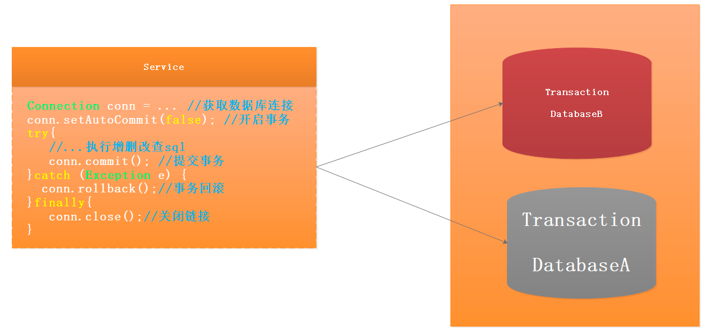

#### 1.3.2 分库分表事务
通常一个库数据量比较大或者预期未来的数据量比较大，都会进行水平拆分，也就是分库分表。如下图，将数据库B拆分成了2个库：

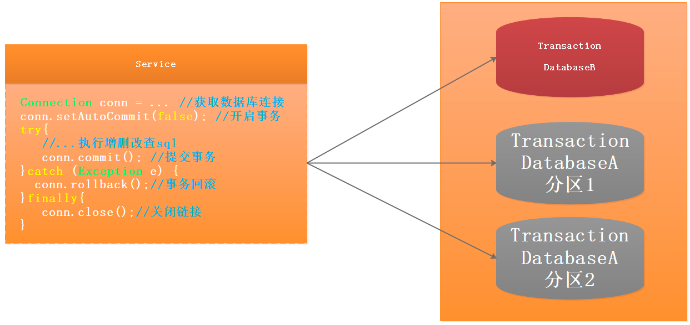
对于分库分表的情况，一般开发人员都会使用一些数据库中间件来降低sql操作的复杂性。如，对于sql：`insert into user(id,name) values (1,"gupaoedu"),(2,"gpvp")`。这条sql是操作单库的语法，单库情况下，可以保证事务的一致性。

但是由于现在进行了分库分表，开发人员希望将1号记录插入分库1，2号记录插入分库2。所以数据库中间件要将其改写为2条sql，分别插入两个不同的分库，此时要保证两个库要不都成功，要不都失败，因此基本上所有的数据库中间件都面临着分布式事务的问题。

#### 1.3.3 跨应用事务

微服务架构是目前一个比较一个比较火的概念。例如上面提到的一个案例，某个应用同时操作了9个库，这样的应用业务逻辑必然非常复杂，对于开发人员是极大的挑战，应该拆分成不同的独立服务，以简化业务逻辑。拆分后，独立服务之间通过RPC框架来进行远程调用，实现彼此的通信。下图演示了一个3个服务之间彼此调用的架构：

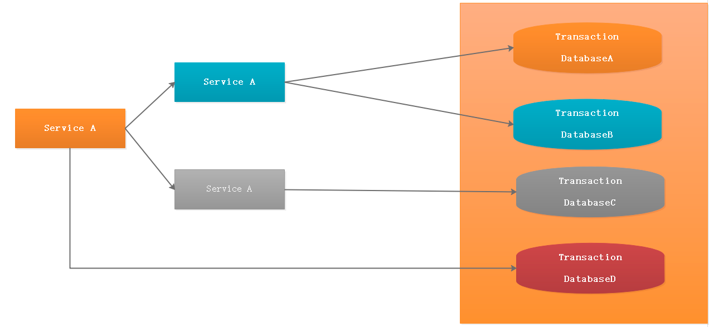

Service A完成某个功能需要直接操作数据库，同时需要调用Service B和Service C，而Service B又同时操作了2个数据库，Service C也操作了一个库。需要保证这些跨服务的对多个数据库的操作要不都成功，要不都失败，实际上这可能是最典型的分布式事务场景。
	
上述讨论的分布式事务场景中，无一例外的都直接或者间接的操作了多个数据库。如何保证事务的ACID特性，对于分布式事务实现方案而言，是非常大的挑战。同时，分布式事务实现方案还必须要考虑性能的问题，如果为了严格保证ACID特性，导致性能严重下降，那么对于一些要求快速响应的业务，是无法接受的。

## 2 分布式事务理论
分布式事务可以有多种分类，比如柔性事务和强一致性事务，这些事务操作会遵循一定的定理，比如CAP原理、BASE理论。

### 2.1 CAP原理

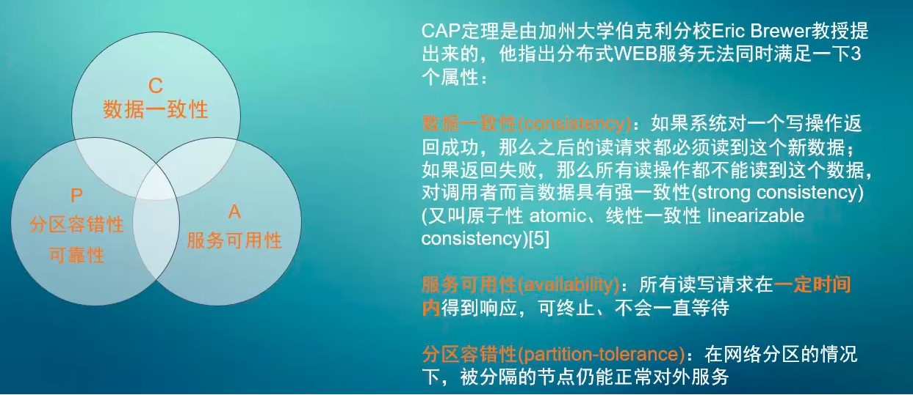
由于对系统或者数据进行了拆分，我们的系统不再是单机系统，而是分布式系统，针对分布式系统的CAP原理包含如下三个元素：

- **C:Consistency**，一致性。在分布式系统中的所有数据 备份，在同一时刻具有同样的值，所有节点在同一时刻读取的数据都是最新的数据副本。
- **A:Availability**，可用性，好的响应性能。完全的可用性指的是在任何故障模型下，服务都会在有限的时间内处理完成并进行响应。
- **P: Partition tolerance**，分区容忍性。尽管网络上有部分消息丢失，但系统仍然可继续工作。

CAP原理指的是，这三个要素最多只能同时实现两点，不可能三者兼顾。因此在进行分布式架构设计时，必须做出取舍。而对于分布式数据系统，分区容忍性是基本要求，否则就失去了价值。因此设计分布式数据系统，就是在一致性和可用性之间取一个平衡。对于大多数web应用，其实并不需要强一致性，因此牺牲一致性而换取高可用性，是目前多数分布式数据库产品的方向。

当然，牺牲一致性，并不是完全不管数据的一致性，否则数据是混乱的，那么系统可用性再高分布式再好也没有了价值。牺牲一致性，只是不再要求关系型数据库中的强一致性，而是只要系统能达到最终一致性即可，考虑到客户体验，这个最终一致的时间窗口，要尽可能的对用户透明，也就是需要保障“用户感知到的一致性”。通常是通过数据的多份异步复制来实现系统的高可用和数据的最终一致性的，“用户感知到的一致性”的时间窗口则取决于数据复制到一致状态的时间。

### 2.2 BASE理论
BASE理论是指，Basically Available（基本可用）、Soft-state（ 软状态/柔性事务）、Eventual Consistency（最终一致性）。是基于CAP定理演化而来，是对CAP中一致性和可用性权衡的结果。核心思想：即使无法做到强一致性，但每个业务根据自身的特点，采用适当的方式来使系统达到最终一致性。

1、**基本可用 BA：（Basically Available ）：**

指分布式系统在出现故障的时候，允许损失部分可用性，保证核心可用。但不等价于不可用。比如：搜索引擎0.5秒返回查询结果，但由于故障，2秒响应查询结果；网页访问过大时，部分用户提供降级服务等。简单来说就是基本可用。

2、**软状态 S：（ Soft State）：**

软状态是指允许系统存在中间状态，并且该中间状态不会影响系统整体可用性。即允许系统在不同节点间副本同步的时候存在延时。简单来说就是状态可以在一段时间内不同步。

3、**最终一致性 E：（Eventually Consistent）：**

系统中的所有数据副本经过一定时间后，最终能够达到一致的状态，不需要实时保证系统数据的强一致性。最终一致性是弱一致性的一种特殊情况。BASE理论面向的是大型高可用可扩展的分布式系统，通过牺牲强一致性来获得可用性。ACID是传统数据库常用的概念设计，追求强一致性模型。简单来说就是在一定的时间窗口内， 最终数据达成一致即可。

### 2.3 刚柔事务
何谓刚柔事务？刚性事务它的事务是原子的，要么都成功要么都失败，也就是需要保障ACID理论，而柔性事务只需要保障数据最终一致即可，需要遵循BASE理论。

- 刚性事务满足ACID理论
- 柔性事务满足BASE理论（基本可用，最终一致）

柔性事务分为：

- 两阶段型
- 补偿型
- 异步确保型
- 最大努力通知型。

金融项目对柔性事务用的比较多，例如支付宝、微信支付、银联支付几乎所有架构是SOA架构，因此传统单机环境下数据库的ACID事务满足了分布式环境下的业务需要，以上几种事务类似就是针对分布式环境下业务需要设定的。

## 3 常用事务解决方案模型
分布式事务解决方案几乎都是柔性事务，常见的有2PC/3PC、TCC、MQ最终一致性解决方案，至于工作中用哪种方案，需要根据业务场景选取，`2PC/3PC、TCC`数据强一致性高，而MQ是最终数据一致。

### 3.1 TDP模型
TDP模型中有5个基本元素：
- 1、应用程序(Application Program ，简称AP)：用于定义事务边界(即定义事务的开始和结束)，并且在事务边界内对资源进行操作。
- 2、资源管理器(Resource Manager，简称RM)：如数据库、文件系统等，并提供访问资源的方式。
- 3、务管理器(Transaction Manager ，简称TM)：负责分配事务唯一标识，监控事务的执行进度，并负责事务的提交、回滚等。
- 4、信资源管理器(Communication Resource Manager，简称CRM)：控制一个TM域(TM domain)内或者跨TM域的分布式应用之间的通信。
- 5、信协议(Communication Protocol，简称CP)：提供CRM提供的分布式应用节点之间的底层通信服务。

### 3.2 2PC/3PC

**1)2PC**
两阶段提交又称**2PC**,2PC是一个非常经典的`强一致、中心化的原子提交协议`。 这里所说的中心化是指协议中有两类节点：
- 1、一个是中心化`协调者节点`（coordinator）
- 2、N个参与者节点`（partcipant）。

`两个阶段`
- 1、第一阶段：投票阶段 
- 2、第二阶段：提交/执行阶段。

`举例` ：**订单服务A**，需要调用 **支付服务B** 去支付，支付成功则处理购物订单为待发货状态，否则就需要将购物订单处理为失败状态。

那么看2PC阶段是如何处理的

**1PC：**

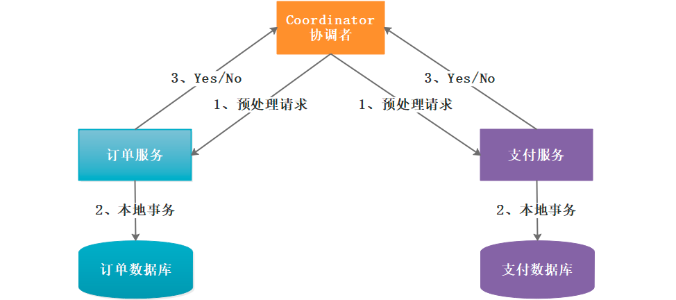

1：`事务询问`

**协调者** 向所有的 **参与者** 发送**事务预处理请求**，称之为**Prepare**，并开始等待各 **参与者** 的响应。

2：`执行本地事务`

各个 **参与者** 节点执行本地事务操作,但在执行完成后并**不会真正提交数据库本地事务**，而是先向 **协调者** 报告说：“我这边可以处理了/我这边不能处理”。

3：`各参与者向协调者反馈事务询问的响应`

如果 **参与者** 成功执行了事务操作,那么就反馈给协调者 **Yes** 响应,表示事务可以执行,如果没有 **参与者** 成功执行事务,那么就反馈给协调者 **No** 响应,表示事务不可以执行。

**2PC：**

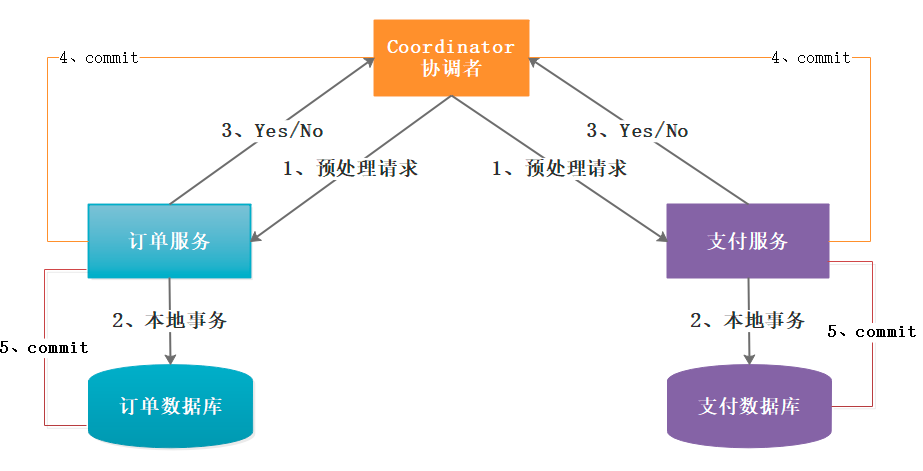
1：`所有的参与者反馈给协调者的信息都是Yes,那么就会执行事务提交`

**协调者** 向 **所有参与者** 节点发出Commit请求.

2：`事务提交`

**参与者** 收到Commit请求之后,就会正式执行本地事务Commit操作,并在完成提交之后释放整个事务执行期间占用的事务资源。

**2)3PC**

三阶段提交又称**3PC**，其在两阶段提交的基础上**增加了CanCommit阶段**，并**引入了超时机制**。一旦事务参与者迟迟没有收到协调者的Commit请求，就会自动进行本地commit，这样相对有效地解决了协调者单点故障的问题。

但是性能问题和不一致问题仍然没有根本解决。下面我们还是一起看下三阶段流程的是什么样的？

**1PC：**

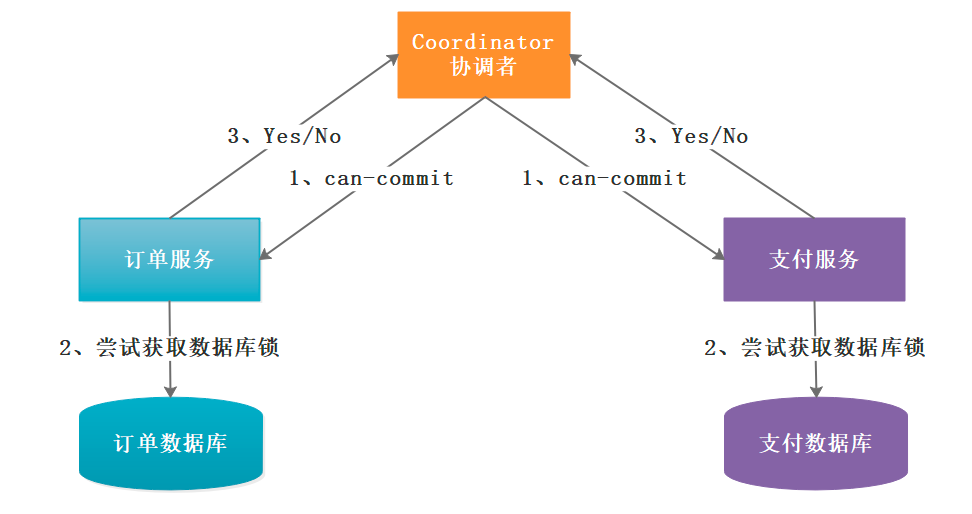

这个阶段类似于2PC中的第二个阶段中的Ready阶段，是一种事务询问操作，事务的协调者向所有参与者询问“**你们是否可以完成本次事务？**”，如果参与者节点认为自身可以完成事务就返回“YES”，否则“NO”。而在实际的场景中参与者节点会对自身逻辑进行事务尝试，简单来说就是检查下自身状态的健康性，看有没有能力进行事务操作。

**2PC：**
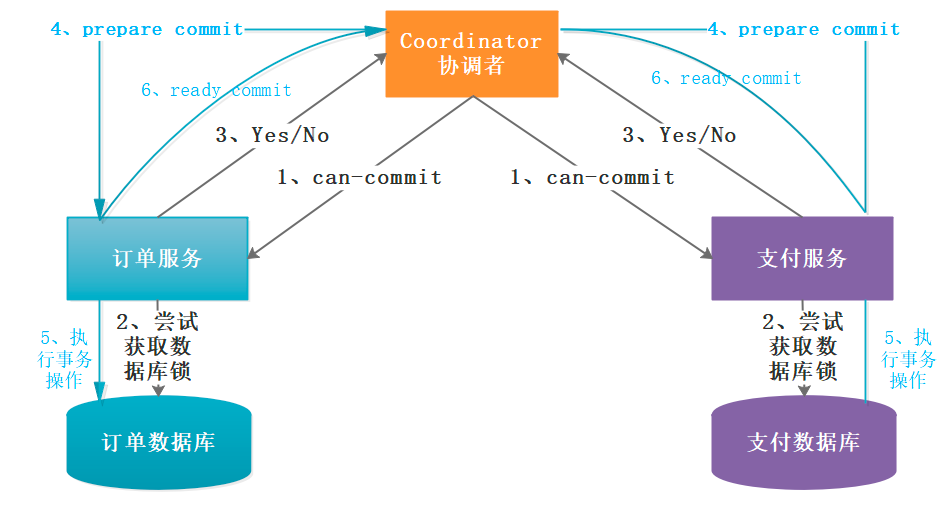
在阶段一中，如果所有的参与者都返回Yes的话，那么就会进入PreCommit阶段进行事务预提交。此时分布式事务协调者会向所有的参与者节点发送PreCommit请求，参与者收到后开始执行事务操作，并将Undo和Redo信息记录到事务日志中。参与者执行完事务操作后（此时属于未提交事务的状态)，就会向协调者反馈“Ack”表示我已经准备好提交了，并等待协调者的下一步指令。

否则，如果阶段一中有任何一个参与者节点返回的结果是No响应，或者协调者在等待参与者节点反馈的过程中超时（**2PC中只有协调者可以超时，参与者没有超时机制）**。整个分布式事务就会中断，协调者就会向所有的参与者发送**“abort”**请求。

**3PC：**

在阶段二

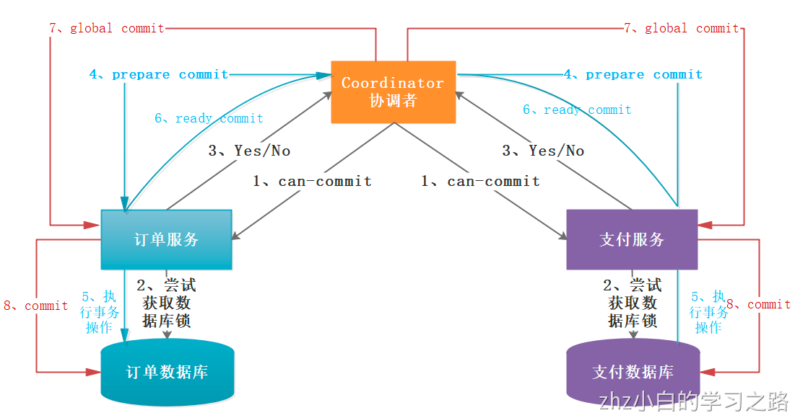

中如果所有的参与者节点都可以进行PreCommit提交，那么协调者就会从**“预提交状态”-》“提交状态”**。然后向所有的参与者节点发送**"doCommit"**请求，参与者节点在收到提交请求后就会各自执行事务提交操作，并向协调者节点反馈**“Ack”**消息，协调者收到所有参与者的Ack消息后完成事务。

相反，如果有一个参与者节点未完成PreCommit的反馈或者反馈超时，那么协调者都会向所有的参与者节点发送abort请求，从而中断事务。

**2PC VS 3PC**

相比较2PC而言，3PC对于协调者（**Coordinator**）和参与者（**Partcipant**）都设置了超时时间，而2PC只有协调者才拥有超时机制。这解决了一个什么问题呢？

`这个优化点，主要是避免了参与者在长时间无法与协调者节点通讯（协调者挂掉了）的情况下，无法释放资源的问题，因为参与者自身拥有超时机制会在超时后，自动进行本地commit从而进行释放资源。而这种机制也侧面降低了整个事务的阻塞时间和范围。 另外，通过**CanCommit、PreCommit、DoCommit**三个阶段的设计，相较于2PC而言，多设置了一个**缓冲阶段**保证了在最后提交阶段之前各参与节点的状态是一致的。 以上就是3PC相对于2PC的一个提高（相对缓解了2PC中的前两个问题），但是3PC依然没有完全解决数据不一致的问题。`

### 3.3 TCC

TCC与2PC、3PC一样，也是分布式事务的一种实现方案。TCC（**Try-Confirm-Cancel**）又称补偿事务。其核心思想是："针对每个操作都要注册一个与其对应的确认和补偿（撤销操作）"。它分为三个操作：

-  1、Try阶段：主要是对业务系统做检测及资源预留。
-  2、Confirm阶段：确认执行业务操作。
-  3、Cancel阶段：取消执行业务操作。

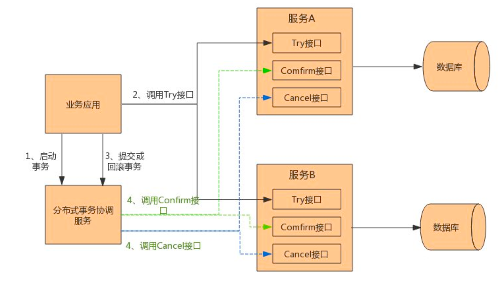

TCC事务的处理流程与2PC两阶段提交类似，不过2PC通常都是在跨库的DB层面，而TCC本质上就是一个应用层面的2PC，需要通过业务逻辑来实现。这种分布式事务的实现方式的优势在于，可以让**应用自己定义数据库操作的粒度，使得降低锁冲突、提高吞吐量成为可能**。
	
不足之处则在于对应用的侵入性非常强，业务逻辑的每个分支都需要实现try、confirm、cancel三个操作。此外，其实现难度也比较大，需要按照网络状态、系统故障等不同的失败原因实现不同的回滚策略。为了满足一致性的要求，confirm和cancel接口还必须实现幂等。

### 3.4 MQ分布式事务

在OLTP系统领域，我们在很多业务场景下都会面临事务一致性方面的需求，而大型互联网平台往往是由一系列分布式系统构成的，开发语言平台和技术栈也相对比较杂，尤其是在SOA和微服务架构盛行的今天，一个看起来简单的功能，内部可能需要调用多个“服务”并操作多个数据库或分片来实现，情况往往会复杂很多，如果对数据一致性要求很高，可以采用上面的2PC或者3PC以及TCC方案，如果数据强一致性要求没那么高，可以采用消息中间件（MQ）实现事务最终一致。

在支付系统中，常常使用的分布式事务解决方案就是基于MQ实现的，它对数据强一致性要求没那么高，但要求数据最终一致即可。例如：向借呗申请借钱，借呗审核通过后支付宝的余额才会增加，但借呗和支付宝有可能不是同一个系统，这时候如何实现事务呢？实现方案如下图：

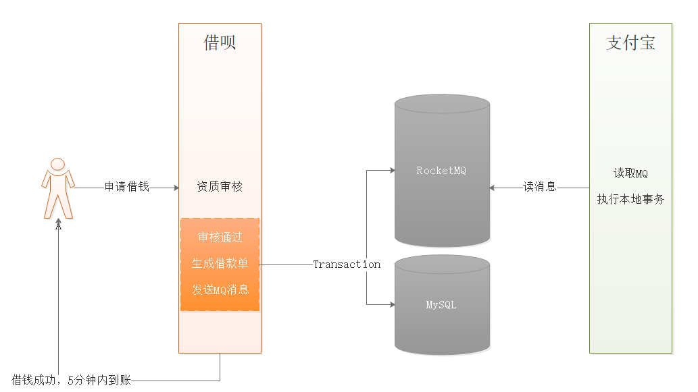

上图执行流程：

```properties
1:找花呗借钱
2:花呗借钱审核通过，同步生成借款单
3:借款单生成后，向MQ发送消息，通知支付宝转账
4:支付宝读取MQ消息，并增加账户余额
```
上图最复杂的其实是如何保障2、3在同一个事务中执行（本地事务和MQ消息发送在同一个事务执行），借款结束后，借呗数据处理就完成了，接下来支付宝才能读到消息，然后执行余额增加，这才完成整个操作。如果中途操作发生异常，例如支付宝余额增加发生问题怎么办？此时需要人工解决，没有特别好的办法，但这种事故概率极低。

## 4 Seata分布式事务
我们目前已经实现了商城项目中部分核心功能了，整个项目用的是微服务架构，如果此时服务间调用出现异常是会出现事务问题，而且是跨服务间的事务问题（分布式事务），上面虽然讲解了事务以及分布式事务相关知识点，但分布式事务究竟该如何解决呢？

### 4.1 订单问题分析

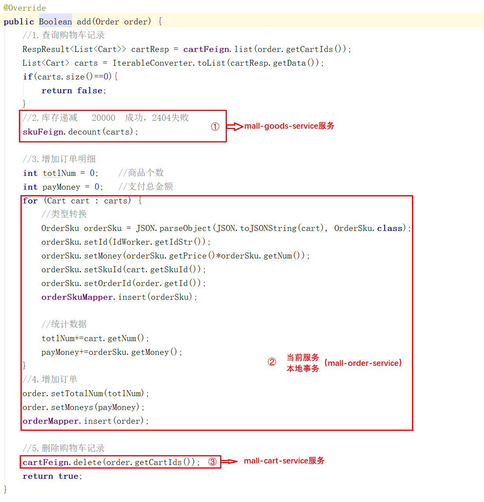
上面是我们之前写的下单代码，整个看起来没有任何问题，但其实存在事务问题，如果上述操作①和②都操作成功了，但是③操作发生异常，②是可根据异常实现本地事务回滚，但①处是没法实现本地事务回滚的，因为它跨应用了，操作流程已经结束。这个问题就是我们说的分布式事务问题。可以采用当前主流分布式事务解决方案Seata来解决。

Seata官网：[https://seata.io/zh-cn/index.html](https://seata.io/zh-cn/index.html)

案例地址：[https://github.com/seata/seata-samples](https://github.com/seata/seata-samples)

### 4.2 Seata介绍

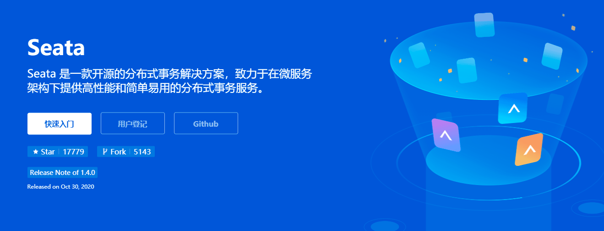
Seata 是一款开源的分布式事务解决方案，致力于在微服务架构下提供高性能和简单易用的分布式事务服务。在 Seata 开源之前，Seata 对应的内部版本在阿里经济体内部一直扮演着分布式一致性中间件的角色，帮助经济体平稳的度过历年的双11，对各BU业务进行了有力的支撑。经过多年沉淀与积累，商业化产品先后在阿里云、金融云进行售卖。2019.1 为了打造更加完善的技术生态和普惠技术成果，Seata 正式宣布对外开源，开放以来，广受欢迎，不到一年已经成为最受欢迎的分布式事务解决方案。
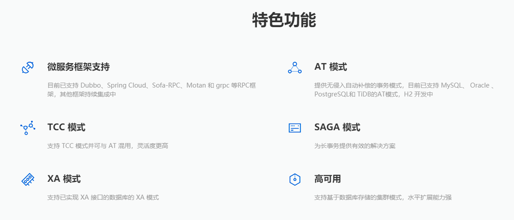

### 4.3 Seata AT模式
Seata 将为用户提供了 AT、TCC、SAGA 和 XA 事务模式，为用户打造一站式的分布式解决方案。其中AT模式最受欢迎，使用也非常简单，但它内在的原理不简单。

**AT模式前提：**

```properties
1:基于支持本地 ACID 事务的关系型数据库。
2:Java 应用，通过 JDBC 访问数据库。
```

**整体机制：**2PC协议的演变

```properties
1PC:业务数据和回滚日志记录在同一个本地事务中提交，释放本地锁和连接资源。
2PC:
	1)提交异步化，非常快速地完成。
	2)回滚通过一阶段的回滚日志进行反向补偿。
```

#### 4.3.1 AT模式工作机制

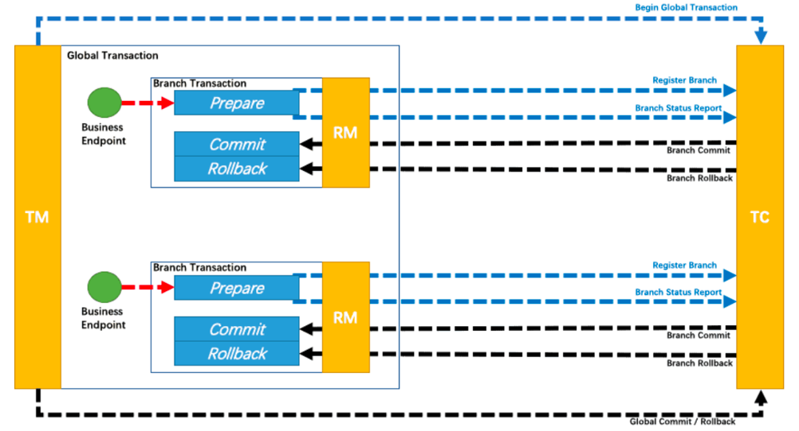

以一个示例来说明整个 AT 分支的工作过程。

业务表：`product`

| Field | Type         | Key  |
| ----- | ------------ | ---- |
| id    | bigint(20)   | PRI  |
| name  | varchar(100) |      |
| since | varchar(100) |      |


执行修改操作：（SQL语句如下）

```sql
update product set name = 'GTS' where name = 'TXC';
```

**1PC:**

**1**、解析`SQL`语句，得到类型为`UPDATE`,表为`product`，条件`where name = 'TXC'`。

**2**、根据解析的`SQL`语句进行要操作的结果查询：

```sql
select * product where name ='TXC'
```

得到的修改前数据结果如下：

| id   | name | since |
| ---- | ---- | ----- |
| 1    | TXC  | 2014  |


**3**、执行业务`SQL`

查询修改后的结果：

```sql
select id, name, since from product where id = 1;
```

查询修改后的数据结果如下：

| id   | name | since |
| ---- | ---- | ----- |
| 1    | GTS  | 2014  |


**4**、镜像备份

将修改前的结果和修改后的结果添加到数据库表`undo_log`中。

**5**、提交前，向TC注册分支申请`product`表中id=1的数据的全局锁。

**6**、本地事务提交。

**7**、本地事务提交结果上报给TC。

**2PC-提交：**

**1**、收到 TC 的分支提交请求，把请求放入一个异步任务的队列中，马上返回提交成功的结果给 TC。

**2**、异步任务阶段的分支提交请求将异步和批量地删除相应 UNDO LOG 记录。

**2PC-回滚：**

**1**、收到 TC 的分支回滚请求，开启一个本地事务，执行如下操作。

**2**、通过 XID 和 Branch ID 查找到相应的 UNDO LOG 记录。

**3**、数据校验：拿 UNDO LOG 中的后镜与当前数据进行比较，如果有不同，说明数据被当前全局事务之外的动作做了修改。这种情况，需要根据配置策略来做处理，详细的说明在另外的文档中介绍。

**4**、根据 UNDO LOG 中的前镜像和业务 SQL 的相关信息生成并执行回滚的语句：

```sql
update product set name = 'TXC' where id = 1;
```

**5**、提交本地事务。并把本地事务的执行结果（即分支事务回滚的结果）上报给 TC。

`undo_log`表，在每个需要执行分布式事务操作的数据库中添加

```sql
-- 注意此处0.7.0+ 增加字段 context
CREATE TABLE `undo_log` (
  `id` bigint(20) NOT NULL AUTO_INCREMENT,
  `branch_id` bigint(20) NOT NULL,
  `xid` varchar(100) NOT NULL,
  `context` varchar(128) NOT NULL,
  `rollback_info` longblob NOT NULL,
  `log_status` int(11) NOT NULL,
  `log_created` datetime NOT NULL,
  `log_modified` datetime NOT NULL,
  PRIMARY KEY (`id`),
  UNIQUE KEY `ux_undo_log` (`xid`,`branch_id`)
) ENGINE=InnoDB AUTO_INCREMENT=1 DEFAULT CHARSET=utf8;
```

#### 4.3.2 订单分布式事务

首先我们需要安装`seata-server`，我们采用docker方式安装：

```properties
docker run --name seata-server -p 8091:8091 -d  seataio/seata-server:1.0.0
```

分布式事务配置过程按照如下操作：

```properties
1:需要执行分布式事务的工程中引入依赖包spring-cloud-starter-alibaba-seata
2:配置代理数据源DataSourceProxy
3:将MyBatisPlus数据源切换成代理数据源
4:指定seata-server配置
	a.导入file.conf
	b.导入register.conf
5:配置工程中的分布式事务组
6:开始执行分布式事务的方法上添加注解@GlobalTransactional
```

1)导入依赖包

在`mall-order-service`和`mall-goods-service`中引入如下依赖包：

```xml
<dependency>
    <groupId>com.alibaba.cloud</groupId>
    <artifactId>spring-cloud-starter-alibaba-seata</artifactId>
    <version>2.1.0.RELEASE</version>
</dependency>
```

2)配置在理数据源

在`mall-order-service`和`mall-goods-service`中创建如下配置类：

```java
@Configuration
public class SeataDataSourceConfig {

    @Bean
    @ConfigurationProperties(prefix = "spring.datasource")
    public DataSource druidDataSource() {
        return new DruidDataSource();
    }
    //创建代理数据源
    @Bean
    public DataSourceProxy dataSourceProxy(DataSource druidDataSource) {
        return new DataSourceProxy(druidDataSource);
    }

    //替换MybatisSqlSessionFactoryBean的DataSource
    @Bean
    public MybatisSqlSessionFactoryBean sqlSessionFactoryBean(DataSourceProxy dataSourceProxy) throws Exception {
        // 这里用 MybatisSqlSessionFactoryBean 代替了 SqlSessionFactoryBean，否则 MyBatisPlus 不会生效
        MybatisSqlSessionFactoryBean mybatisSqlSessionFactoryBean = new MybatisSqlSessionFactoryBean();
        mybatisSqlSessionFactoryBean.setDataSource(dataSourceProxy);
        return mybatisSqlSessionFactoryBean;
    }
}
```

3)导入配置文件

将`参考资料/seata/配置文件`中的`file.conf`和`registry.conf`导入到`mall-order-service`和`mall-goods-service`的`resources`下，同时配置`mall-order-service`和`mall-goods-service`的bootstrap.yml文件，在该文件中添加如下配置：

```yaml
    alibaba:
      seata:
        tx-service-group: tx_shop
```

文件参考如下：

file.conf:

```properties
service {
  #vgroup->rgroup
  vgroup_mapping.tx_shop = "default"
  #only support single node
  default.grouplist = "192.168.100.130:8091"
  #degrade current not support
  enableDegrade = false
  #disable
  disable = false
}
```

registry.conf:

```properties
registry {
  # file 、nacos 、eureka、redis、zk、consul、etcd3、sofa
  type = "file"

  file {
    name = "file.conf"
  }
}

config {
  # file、nacos 、apollo、zk、consul、etcd3、springCloudConfig
  type = "file"

  file {
    name = "file.conf"
  }
}
```

4)添加注解@GlobalTransactional

在`com.zhz.mall.order.service.impl.OrderServiceImpl#add`方法上添加注解`@GlobalTransactional`

## 5 数据最终一分布式事务
上面说到的借呗借钱数据最终一致分布式事务解决方案可以采用RocketMQ，其实除了RocketMQ之外，其他MQ也可以实现分布式事务，但实现原理不一样，其他MQ采用的几乎都是ACK机制，只有RocketMQ支持事务消息，我们来讲述一下RocketMQ的事务消息在实战案例中该如何使用。

### 5.1 RocketMQ安装
在安装RocketMQ之前，我们先了解一下RocketMQ的部署架构，了解一下RocketMQ的组件，然后基于当前主流的Docker安装RocketMQ，我们这里安装单台RocketMQ，但为了防止单节点故障、保障高可用，生产环境建议安装RocketMQ集群。

#### 5.1.1 RocketMQ架构

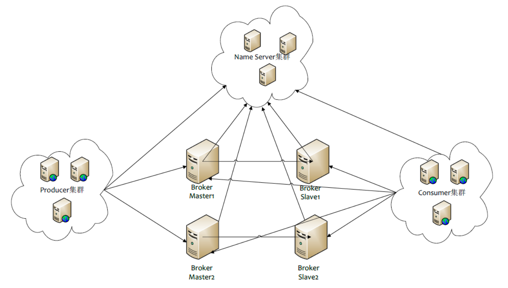

上图是RocketMQ的部署架构图：

```properties
1:NameServer是一个非常简单的Topic路由注册中心，其角色类似Dubbo中的zookeeper，支持Broker的动态注册与发现。

2:Broker主要负责消息的存储、投递和查询以及服务高可用保证。

3:Producer消息发布的角色，支持分布式集群方式部署。Producer通过MQ的负载均衡模块选择相应的Broker集群队列进行消息投递，投递的过程支持快速失败并且低延迟。

4:Consumer消息消费的角色，支持分布式集群方式部署。支持以push推，pull拉两种模式对消息进行消费。同时也支持集群方式和广播方式的消费，它提供实时消息订阅机制，可以满足大多数用户的需求。
```

参考地址：[https://github.com/apache/rocketmq/tree/master/docs/cn](https://github.com/apache/rocketmq/tree/master/docs/cn)

#### 5.1.2 Docker安装RocketMQ

##### 5.1.2.1 安装NameSrv

拉取镜像：

```properties
docker pull rocketmqinc/rocketmq
```

创建namesrv数据存储目录:

```properties
mkdir -p  /docker/rocketmq/data/namesrv/logs   /docker/rocketmq/data/namesrv/store
```

安装NameSrv:

```properties
docker run -d \
--restart=always \
--name rmqnamesrv \
--privileged=true \
-p 9876:9876 \
-v /docker/rocketmq/data/namesrv/logs:/root/logs \
-v /docker/rocketmq/data/namesrv/store:/root/store \
-e "MAX_POSSIBLE_HEAP=100000000" \
rocketmqinc/rocketmq \
sh mqnamesrv
```

相关参数说明：

| 参数                                               | 说明                                                         |
| -------------------------------------------------- | ------------------------------------------------------------ |
| -d                                                 | 以守护进程的方式启动                                         |
| - -restart=always                                  | docker重启时候容器自动重启                                   |
| - -name rmqnamesrv                                 | 把容器的名字设置为rmqnamesrv                                 |
| -p 9876:9876                                       | 把容器内的端口9876挂载到宿主机9876上面                       |
| -v /docker/rocketmq/data/namesrv/logs:/root/logs   | 把容器内的/root/logs日志目录挂载到宿主机的 /docker/rocketmq/data/namesrv/logs目录 |
| -v /docker/rocketmq/data/namesrv/store:/root/store | 把容器内的/root/store数据存储目录挂载到宿主机的 /docker/rocketmq/data/namesrv目录 |
| rmqnamesrv                                         | 容器的名字                                                   |
| -e “MAX_POSSIBLE_HEAP=100000000”                   | 设置容器的最大堆内存为100000000                              |
| rocketmqinc/rocketmq                               | 使用的镜像名称                                               |
| sh mqnamesrv                                       | 启动namesrv服务                                              |


##### 5.1.2.2 安装Broker

border配置：创建`broker.conf`配置文件`vi /docker/rocketmq/conf/broker.conf`，配置如下：

```properties
# 所属集群名称，如果节点较多可以配置多个
brokerClusterName = DefaultCluster
#broker名称，master和slave使用相同的名称，表明他们的主从关系
brokerName = broker-a
#0表示Master，大于0表示不同的slave
brokerId = 0
#表示几点做消息删除动作，默认是凌晨4点
deleteWhen = 04
#在磁盘上保留消息的时长，单位是小时
fileReservedTime = 48
#有三个值：SYNC_MASTER，ASYNC_MASTER，SLAVE；同步和异步表示Master和Slave之间同步数据的机制；
brokerRole = ASYNC_MASTER
#刷盘策略，取值为：ASYNC_FLUSH，SYNC_FLUSH表示同步刷盘和异步刷盘；SYNC_FLUSH消息写入磁盘后才返回成功状态，ASYNC_FLUSH不需要；
flushDiskType = ASYNC_FLUSH
# 设置broker节点所在服务器的ip地址
brokerIP1 = 192.168.100.130
#剩余磁盘比例
diskMaxUsedSpaceRatio=99
```

安装Broker:

```properties
docker run -d  \
--restart=always \
--name rmqbroker \
--link rmqnamesrv:namesrv \
-p 10911:10911 \
-p 10909:10909 \
--privileged=true \
-v  /docker/rocketmq/data/broker/logs:/root/logs \
-v  /docker/rocketmq/data/broker/store:/root/store \
-v /docker/rocketmq/conf/broker.conf:/opt/rocketmq-4.4.0/conf/broker.conf \
-e "NAMESRV_ADDR=namesrv:9876" \
-e "MAX_POSSIBLE_HEAP=200000000" \
rocketmqinc/rocketmq \
sh mqbroker -c /opt/rocketmq-4.4.0/conf/broker.conf
```

相关参数说明：

| 参数                                                         | 说明                                        |
| ------------------------------------------------------------ | ------------------------------------------- |
| -d                                                           | 以守护进程的方式启动                        |
| –restart=always                                              | docker重启时候镜像自动重启                  |
| - -name rmqbroker                                            | 把容器的名字设置为rmqbroker                 |
| - --link rmqnamesrv:namesrv                                  | 和rmqnamesrv容器通信                        |
| -p 10911:10911                                               | 把容器的非vip通道端口挂载到宿主机           |
| -p 10909:10909                                               | 把容器的vip通道端口挂载到宿主机             |
| -e “NAMESRV_ADDR=namesrv:9876”                               | 指定namesrv的地址为本机namesrv的ip地址:9876 |
| -e “MAX_POSSIBLE_HEAP=200000000” rocketmqinc/rocketmq sh mqbroker | 指定broker服务的最大堆内存                  |
| rocketmqinc/rocketmq                                         | 使用的镜像名称                              |
| sh mqbroker -c /opt/rocketmq-4.4.0/conf/broker.conf          | 指定配置文件启动broker节点                  |


##### 5.1.2.3 控制台安装

拉取镜像：

```properties
docker pull pangliang/rocketmq-console-ng
```

控制台安装:

```properties
docker run -d \
--restart=always \
--name rmqadmin \
-e "JAVA_OPTS=-Drocketmq.namesrv.addr=192.168.100.130:9876 \
-Dcom.rocketmq.sendMessageWithVIPChannel=false" \
-p 8080:8080 \
pangliang/rocketmq-console-ng
```

关闭防火墙(或者开放端口)

```properties
#关闭防火墙
systemctl stop firewalld.service
#禁止开机启动
systemctl disable firewalld.service
```

访问：[http://192.168.100.130:8080/#/](http://192.168.100.130:8080/#/) （可以切换中文）
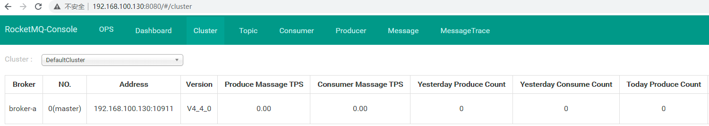

### 5.2 RocketMQ事务消息
在RocketMQ中生产者有三种角色 `NormalProducer`（普通）、`OrderProducer`（顺序）、`TransactionProducer`（事务） ，根据名字大概可以看出各个代表着什么作用，我们这里用 `TransactionProducer`（事务）来解决问题。


### 5.3 最终一致案例分析
我们上面已经完成了下订单操作，但如果用户完成了支付，此时需要通知当前系统处理订单状态，并增加用户金币，不过大家可以发现个问题，其实用户支付完成后，订单状态并非立即发生改变，很多时候都是过了一会儿订单状态才发生改变、奖励的金币才到账，这是因为支付系统和订单系统是独立系统，最主要的是支付业务和订单业务并不需要数据强一致性，最终一致即可。

我们举个例子，比如用户支付成功了，但赠送金币失败了，这个时候就需要给用户退款吗？很明显是不需要的，只需要处理下赠送金币的流程即可。


上图是支付流程设计：

```properties
1:用户下单成功后，会进入支付
2:支付需要从我们支付系统中获取支付二维码
3:用户支付完成后，微信服务器会将支付结果返回给我们的支付系统
4:支付系统会在本地数据库中做一个支付结果保存，同时通过RocketMQ将支付结果告知订单系统
5:订单系统读取RocketMQ支付结果，并发起订单状态变更以及赠送积分操作
```

上述流程中4-5两个流程可以采用RocketMQ事务消息实现事务最终一致操作。

### 5.4 支付工程创建

1)Api

创建`mall-pay-api`并创建支付日志记录实体Bean

```java
@Data
@AllArgsConstructor
@NoArgsConstructor
//MyBatisPlus表映射注解
@TableName(value = "pay_log")
public class PayLog {

    @TableId(type = IdType.ASSIGN_UUID)
    private String id;
    private Integer status;
    private String content;
    private String payId;
    private Date createTime;
}
```

2)Service

创建`mall-pay-service`，并且引入`mall-pay-api`依赖

pom.xml:

```xml
<?xml version="1.0" encoding="UTF-8"?>
<project xmlns="http://maven.apache.org/POM/4.0.0"
         xmlns:xsi="http://www.w3.org/2001/XMLSchema-instance"
         xsi:schemaLocation="http://maven.apache.org/POM/4.0.0 http://maven.apache.org/xsd/maven-4.0.0.xsd">
    <parent>
        <artifactId>mall-service</artifactId>
        <groupId>com.zhz.mall</groupId>
        <version>0.0.1-SNAPSHOT</version>
    </parent>
    <modelVersion>4.0.0</modelVersion>
    <artifactId>mall-pay-service</artifactId>
    <description>
        支付微服务
    </description>

    <dependencies>
        <!--支付Api-->
        <dependency>
            <groupId>com.zhz.mall</groupId>
            <artifactId>mall-pay-api</artifactId>
            <version>0.0.1-SNAPSHOT</version>
        </dependency>
    </dependencies>
</project>
```

bootstrap.yml

```yaml
server:
  port: 8090
spring:
  application:
    name: mall-pay
  datasource:
    driver-class-name: com.mysql.cj.jdbc.Driver
    url: jdbc:mysql://192.168.100.130:3306/shop_pay?useUnicode=true&characterEncoding=UTF-8&serverTimezone=UTC
    username: root
    password: 123456
  cloud:
    nacos:
      config:
        file-extension: yaml
        server-addr: 192.168.100.130:8848
      discovery:
        #Nacos的注册地址
        server-addr: 192.168.100.130:8848
  main:
    allow-bean-definition-overriding: true
feign:
  client:
    config:
      default:
        connectTimeout: 10000
        readTimeout: 600000

# ====================MybatisPlus====================
mybatis-plus:
  mapper-locations: mapper/*.xml
  type-aliases-package: com.zhz.mall.*.model
  configuration:
    map-underscore-to-camel-case: true
    log-impl: org.apache.ibatis.logging.stdout.StdOutImpl
#日志配置
logging:
  pattern:
    console: "%msg%n"
```

启动类`com.zhz.mall.MallPayApplication`

```java
@SpringBootApplication
@MapperScan(basePackages = "com.zhz.mall.pay.mapper")
public class MallPayApplication {

    public static void main(String[] args) {
        SpringApplication.run(MallPayApplication.class,args);
    }
}
```

### 5.5 事务消息发送

当接到微信支付服务器返回的支付结果后，将支付结果记录到数据库，同时将数据发送到RocketMQ中，并且以事务消息发送。

1)配置bootstrap.yml，添加RocketMQ配置

```yaml
#producer
rocketmq:
  name-server: 192.168.100.130:9876
  producer:
    group: pay-group
    send-message-timeout: 300000
    compress-message-body-threshold: 4096
    max-message-size: 4194304
    retry-times-when-send-async-failed: 0
    retry-next-server: true
    retry-times-when-send-failed: 2
```

注意消息操作，需要引入如下包：

```xml
<!--rocketmq-->
<dependency>
    <groupId>org.apache.rocketmq</groupId>
    <artifactId>rocketmq-spring-boot-starter</artifactId>
    <version>2.0.2</version>
</dependency>
```

2)Dao

创建`com.zhz.mall.pay.mapper.PayLogMapper`

```java
public interface PayLogMapper extends BaseMapper<PayLog> {
}
```

3)Service

接口：创建`com.zhz.mall.pay.service.PayLogService`并添加记录日志方法

```java
public interface PayLogService extends IService<PayLog> {
    void log(PayLog payLog);
}
```

实现类：创建`com.zhz.mall.pay.service.impl.PayLogServiceImpl`，并实现添加日志

```java
@Service
public class PayLogServiceImpl extends ServiceImpl<PayLogMapper,PayLog> implements PayLogService {

    @Autowired
    private PayLogMapper payLogMapper;

    /***
     * 记录日志
     * @param payLog
     */
    @Transactional(rollbackFor = Exception.class)
    @Override
    public void log(PayLog payLog) {
        //本地操作
        int count = payLogMapper.insert(payLog);
    }
}
```

4)Controller

创建`com.zhz.mall.pay.controller.WeixinPayController`，调用增加日志方法，并向RocketMQ发送事务消息

```java
@RestController
@RequestMapping(value = "/wx")
public class WeixinPayController {

    @Autowired
    private PayLogService payLogService;

    @Autowired
    private RocketMQTemplate rocketMQTemplate;

    /***
     * 记录支付结果
     * 执行事务消息发送
     */
    @GetMapping(value = "/result")
    public RespResult payLog(){
        //记录日志
        PayLog payLog = new PayLog("1",1,"test","No001",new Date());
        Message message = MessageBuilder.withPayload(JSON.toJSONString(payLog)).build();
        rocketMQTemplate.sendMessageInTransaction("rocket","log",message,null);
        return RespResult.ok();
    }
}
```

5)事务消息监听

创建`com.zhz.mall.pay.mq.TransactionListenerImpl`实现事务操作

```java
@Component
@RocketMQTransactionListener(txProducerGroup = "rocket")
public class TransactionListenerImpl implements RocketMQLocalTransactionListener {

    @Autowired
    private PayLogService payLogService;

    /***
     * 发送prepare消息成功后回调该方法用于执行本地事务
     * @param message:回传的消息，利用transactionId即可获取到该消息的唯一Id
     * @param o:调用send方法时传递的参数，当send时候若有额外的参数可以传递到send方法中，这里能获取到
     * @return
     */
    @Override
    public RocketMQLocalTransactionState executeLocalTransaction(Message message, Object o) {
        try {
            //================本地事务操作开始=====================================
            //将o转成PayLog
            String result = new String((byte[]) message.getPayload(),"UTF-8");
            PayLog payLog = JSON.parseObject(result,PayLog.class);
            payLogService.log(payLog);
            //================本地事务操作结束=====================================
        } catch (Exception e) {
            //异常,消息回滚
            e.printStackTrace();
            return RocketMQLocalTransactionState.ROLLBACK;
        }
        return RocketMQLocalTransactionState.COMMIT;
    }

    /***
     * 消息回查
     * @param message
     * @return
     */
    @Override
    public RocketMQLocalTransactionState checkLocalTransaction(Message message) {
        return RocketMQLocalTransactionState.COMMIT;
    }
}
```

### 5.6 事务消息监听

我们只需要在`mall-order-service`中监听消息即可，注意消息操作，需要引入如下包：

```xml
<!--rocketmq-->
<dependency>
    <groupId>org.apache.rocketmq</groupId>
    <artifactId>rocketmq-spring-boot-starter</artifactId>
    <version>2.0.2</version>
</dependency>
```

1)bootstrap.yml配置

```yaml
#RocketMQ消费者配置
rocketmq:
  name-server: 192.168.100.130:9876
```

2)消费监听

创建`com.zhz.mall.order.mq.OrderResultListener`实现监听

```java
@Component
@RocketMQMessageListener(topic = "log", consumerGroup = "order-group")
public class OrderResultListener implements RocketMQListener,RocketMQPushConsumerLifecycleListener {

    /***
     * 监听消息
     * 实现RocketMQPushConsumerLifecycleListener监听器之后，此方法不调用
     * @param message
     */
    @Override
    public void onMessage(Object message) {
    }

    /***
     * 消息监听
     * @param consumer
     */
    @Override
    public void prepareStart(DefaultMQPushConsumer consumer) {
        consumer.registerMessageListener(new MessageListenerConcurrently() {
            @Override
            public ConsumeConcurrentlyStatus consumeMessage(List<MessageExt> msgs, ConsumeConcurrentlyContext context) {
                try {
                    for (MessageExt msg : msgs) {
                        String result = new String(msg.getBody(),"UTF-8");
                        System.out.println("result:"+result);
                    }
                } catch (UnsupportedEncodingException e) {
                    e.printStackTrace();
                }
                //消费状态
                return ConsumeConcurrentlyStatus.CONSUME_SUCCESS;
            }
        });
    }
}
```

我们发送数据测试，消费端打印结果如下：

```json
{
  "content":"test",
  "createTime":1605420654287,
  "id":"1",
  "payId":"No001",
  "status":1
}

```